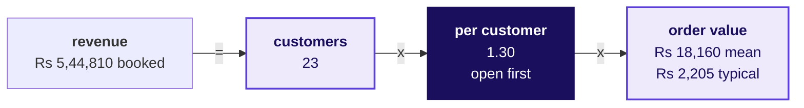

# What is revenue made of, and which check catches each wrong number?

Kalpa Retail, Week 1 Monday. Before Meera Raghavan signs Rs 12 crore for new customers, is acquisition even the branch that is short? On 30 orders from 1 July to 26 September, each chapter met a plausible wrong number that one check caught before it reached her.

## Panel 1: What is revenue made of, with Monday's numbers on it?

```mermaid
flowchart LR
    R["<b>revenue</b><br/>Rs 5,44,810 booked"] -->|"="| C["<b>customers</b><br/>23"]
    C -->|"x"| F["<b>per customer</b><br/>1.30<br/>open first"]
    F -->|"x"| A["<b>order value</b><br/>Rs 18,160 mean<br/>Rs 2,205 typical"]
    classDef known fill:#EEEAFB,stroke:#5B3FD6,color:#1A0F5C,stroke-width:2px
    classDef bet fill:#1A0F5C,stroke:#1A0F5C,color:#FFFFFF
    class C,A known
    class F bet
```

**Crux:** Revenue is customers times orders per customer times average order value; the identity 23 x (30 / 23) x (Rs 5,44,810 / 30) lands on Rs 5,44,810.

## Panel 2: Chapter 1: which total is sales?

| | |
|---|---|
| Wrong number | Rs 5,44,810 is called sales, with 4 cancelled store orders inside it. |
| Check | Count by status first: 21 delivered, 5 returned, 4 cancelled. |
| Fix | Each total named, with the bridge: booked Rs 5,44,810, less Rs 9,050 cancelled, less Rs 14,970 returned. |

**Crux:** Name the definition before the number: booked, "not cancelled", or delivered.

## Panel 3: Chapter 2: why must a branch use one definition?

| | |
|---|---|
| Wrong number | AOV is Rs 25,943: booked rupees over delivered orders. |
| Check | AOV x the 30 orders the revenue covers gives Rs 7,78,300 against Rs 5,44,810. |
| Fix | Rs 18,160 booked, or Rs 24,800 delivered, each named. |

**Crux:** Build every fraction on one definition, and check that it multiplies back.

## Panel 4: Chapter 3: do customers come back?

| | |
|---|---|
| Wrong number | 30 customers, so 30 / 30 = 1.00 and "nobody comes back". |
| Check | `len(rows)` against `len(set(ids))`: 30 against 23. |
| Fix | 23 customers, 1.30 orders each; 7 came back and 16 bought once. |

**Crux:** Count customers by their id, never by the rows.

## Panel 5: Chapter 4: what is a typical order?

| | |
|---|---|
| Wrong number | A first order is valued at the mean, Rs 18,160. |
| Check | Orders above the mean: 1 of 30. |
| Fix | The median, Rs 2,205 booked, is the typical order; the mean stays for totals. |

**Crux:** Report the median when one order can move the mean, and say why.

## Panel 6: Chapter 5: which branch first?

| | |
|---|---|
| Wrong number | Customers +10 percent and frequency +10 percent called 20 percent, Rs 77,772. |
| Check | 1.10 x 1.10 = 1.21: Rs 78,420 on the consumer segments' Rs 64,810. |
| Fix | Rs 9,722 more needs 15 percent more customers or orders; frequency has the evidence. |

**Crux:** Lifts multiply along the tree: two 10 percent lifts make 21 percent.

## Panel 7: Chapter 6: are the one-time buyers lost?

| | |
|---|---|
| Wrong number | 16 of 23 bought once, so "70 percent are lost". |
| Check | Median repeat gap 45 days; 9 of the 16 bought in the last 45. |
| Fix | 7 came back, 7 are past the usual gap, 9 are too recent to judge. |

**Crux:** A one-time buyer is not a lost customer until they have had time to come back.

## Panel 8: What will Meera sign?

"On 30 booked orders, 23 customers placed 1.30 orders each at a typical Rs 2,205; 7 came back and 9 are too recent to judge, so open frequency first and hold the Rs 12 crore for Tuesday's two quarters."

**Crux:** The sentence names its definition, its branch and its caveat, and waits for a second quarter before the budget.
