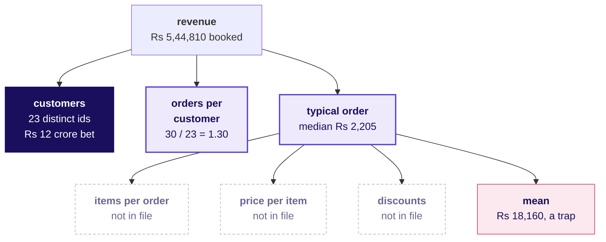

# The revenue tree

Kalpa Retail, Week 1 Monday. Revenue is a tree of metrics that multiply, every number carries its definition, and each trap below is a plausible wrong number with the check that catches it.

## Panel 1: The revenue tree, with Monday's numbers on it

```mermaid
flowchart TB
    R["<b>revenue</b><br/>Rs 5,44,810 booked"] --> C["<b>customers</b><br/>23 distinct ids<br/>Rs 12 crore bet"]
    R --> F["<b>orders per<br/>customer</b><br/>30 / 23 = 1.30"]
    R --> A["<b>typical order</b><br/>median Rs 2,205"]
    A --> I["<b>items per order</b><br/>not in file"]
    A --> P["<b>price per item</b><br/>not in file"]
    A --> D["<b>discounts</b><br/>not in file"]
    A --> M["<b>mean</b><br/>Rs 18,160, a trap"]
    classDef known fill:#EEEAFB,stroke:#5B3FD6,color:#1A0F5C,stroke-width:2px
    classDef unknown fill:#FFFFFF,stroke:#B8B2D6,color:#6B6690,stroke-dasharray:4 3
    classDef bet fill:#1A0F5C,stroke:#1A0F5C,color:#FFFFFF
    classDef bad fill:#FBE9EF,stroke:#D63A6A,color:#1A0F5C
    class F,A known
    class I,P,D unknown
    class C bet
    class M bad
```

**Crux:** Revenue is customers times orders per customer times average order value, and average order value is items per order times price per item, less discounts.

## Panel 2: Every branch is a metric with a bill

| Branch | Over what | What moving it costs |
|---|---|---|
| Customers | A count of distinct ids in the window | Marketing spend |
| Orders per customer | Distinct customers, same window | Retention |
| Items per order | Orders | Merchandising |
| Price per item | Items | Volume, as buyers leave |
| Discounts | Revenue before discounts | Margin, traded for quantity |

The identity checks the tree: 23 x (30 / 23) x (Rs 5,44,810 / 30) = Rs 5,44,810.

## Panel 3: Trap 1, which total is "sales"

| | |
|---|---|
| Wrong number | Rs 5,44,810 called sales, with 4 cancelled store orders inside it. |
| Check | Count by status first: 21 delivered, 5 returned, 4 cancelled. |
| Fix | Not cancelled is Rs 5,35,760 on 26 orders; delivered is Rs 5,20,790 on 21. |

**Crux:** Name the definition before the number: booked, not cancelled, or delivered.

## Panel 4: Trap 2, rows counted as customers

| | |
|---|---|
| Wrong number | 30 customers, so 30 / 30 = 1.00 and "nobody comes back". |
| Check | `len(rows)` against `len(set(ids))`: 30 against 23. |
| Fix | 23 customers, 1.30 orders each, 7 came back and 16 bought once. |

**Crux:** Count customers by their id, never by the rows.

## Panel 5: Trap 3, the mean sold as typical

| | |
|---|---|
| Wrong number | A first order valued at the mean, Rs 18,160. |
| Check | Orders above the mean: 1 of 30. Sort and read the top. |
| Fix | Median Rs 2,205 booked, Rs 2,060 delivered; the top order gets its own line. |

**Crux:** Report the median when one order can move the mean, and say why.

## Panel 6: Trap 4, lifts added instead of multiplied

| | |
|---|---|
| Wrong number | Customers +10 percent and frequency +10 percent called 20 percent. |
| Check | Recompute through the tree: 1.10 x 1.10 = 1.21. |
| Fix | Rs 6,59,220, against Rs 6,53,772 by adding. 15 percent off for 10 percent more quantity is 0.85 x 1.10 = 0.935, a 6.5 percent fall. |

**Crux:** Lifts multiply along the tree: two 10 percent lifts make 21 percent.

## Panel 7: Trap 5, one channel's share

| | |
|---|---|
| Wrong number | Store brings 91.6 percent of booked revenue, so the plan should be store-led. |
| Check | Count the orders behind the share; split each channel by status. |
| Fix | Consumer orders: web Rs 27,290 with 5 of 10 returned, app Rs 18,600 all delivered, store Rs 18,920 with 4 of 9 cancelled. |

## Panel 8: What goes to Meera

"23 customers placed 1.30 orders each at a typical order of Rs 2,205, and 16 bought only once, so open frequency before acquisition; hold the Rs 12 crore until Tuesday's two quarters."

**Crux:** One window shows the shape of revenue; only two windows show which branch moved.
