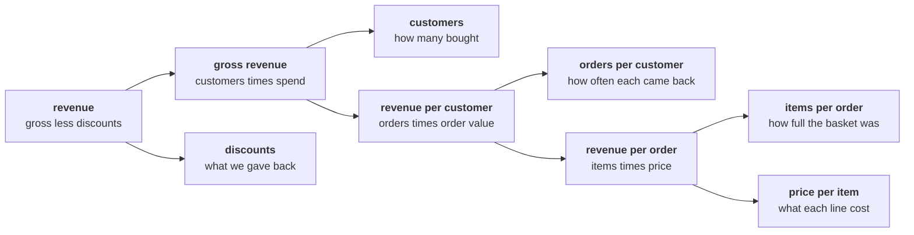

# Guided: the tree on paper, then the first count

Built with the trainer, one line at a time, in your own Codespace. Nothing here is graded. The
point is that every line on your screen is there because you typed it, which is what makes it
yours tomorrow.

---

## Part 1. The tree, before any code

Draw it on paper before you open a notebook. Revenue on the left; what multiplies into it on the
right.



Beside each of the five leaves, write the metric as a numerator over a denominator, and leave a
column for today's number. Three of the five will stay empty today, and saying why is part of the
answer.

| Leaf | Numerator | Denominator | Today's number |
|---|---|---|---|
| Customers | | | |
| Orders per customer | | | |
| Items per order | | | |
| Price per item | | | |
| Discounts | | | |

---

## Part 2. Open the workbench

1. Open the Codespace from the repository; it builds itself once and is then yours.
2. Open `notebooks/C2_W01_D01_02_first_count_STUDENT.ipynb` and run the setup cell. It prints
   `30 orders loaded`.
3. Restart the kernel and run the map cell, the one after setup, before anything else. Read the
   NameError it prints, then restart and Run All, and read the brackets down the page: `In [1]`,
   `In [2]`, `In [3]`.

---

## Part 3. One order, then the list

Type this into a new cell, run it, and read every field aloud with its type:

```python
first = ORDERS[0]
for key, value in first.items():
    print(key, repr(value), type(value).__name__)
```

Then `len(ORDERS)`, `ORDERS[0]["amount"]` and `ORDERS[0]["channel"]`, one at a time.

---

## Part 4. Count, then sum

The three moves, typed with the room:

```python
count = 0
for order in ORDERS:
    count = count + 1
print(count)
```

Then change one line so it sums the amounts instead of counting the orders, run it, and stop at
whatever it prints. The room reads the result together before anyone changes a line.

---

## What you leave with

The tree on paper with two leaves filled, a notebook that runs from a fresh kernel, a count of 30,
and one error read from its last line up. Everything after this point, in the unguided work, is
yours alone.
