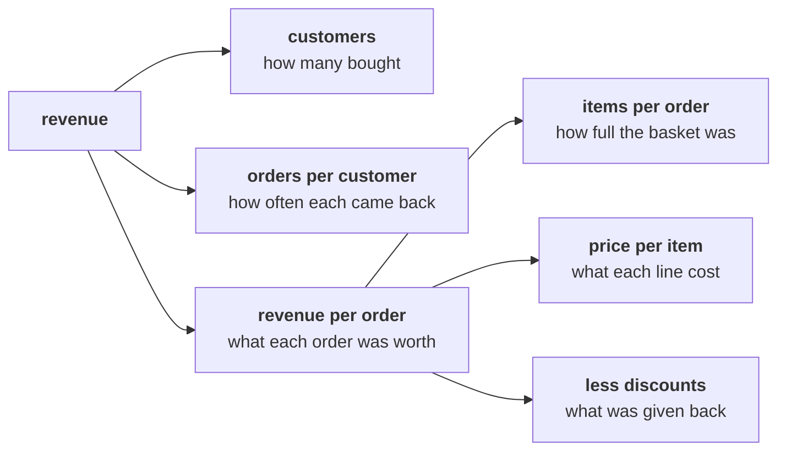

# What is sales made of, and how does one loop count Kalpa's orders and add up their revenue?

> "What is 'sales' made of? Is acquisition even the branch that is short?"
> Meera Raghavan, CEO, Kalpa Retail

**Who needs the answer.** Meera needs the tree before she can ask which branch of sales is short,
and the loop is how the team fills the tree's first numbers. A tree drawn wrong puts the Rs 12 crore
on the wrong branch before a single number is computed.

**The questions on the way.** Which branch is marketing's Rs 12 crore a bet on? How is orders per
customer written as a fraction? What does one Kalpa order hold? How many times does a loop over the
file run, and which reading of sales does it add up?

You build this with the trainer, one step at a time, with your own Codespace open. Nothing here is
graded. The trainer asks each item aloud, the room calls its letter, and the room's answer is tested
on the board or in the notebook before anyone moves on. Type every line of your notebook yourself.

---

## What is the case, and what does the file hold?

Kalpa Retail grew revenue 4 percent last year against a plan of 15 percent, and marketing has asked
Meera for Rs 12 crore to acquire new customers. The team's extract holds Kalpa Retail's 30 orders
from 1 July to 26 September 2026. Each order carries seven fields: the order id, the customer id, the
segment, the channel, the order date, the amount in rupees and the status, which is delivered,
returned after delivery, or cancelled before the order left the shelf.

---

## Which branches multiply into revenue?

Meera's question, whether acquisition is the branch that is short, can only be answered once the
branches are drawn, and marketing's Rs 12 crore sits on one of them.

Copy the tree from the board onto paper, with revenue on the left and what multiplies into it on the
right.

Beside each branch, write the metric as a numerator over a denominator, and leave a column for
today's number.

| Branch | Numerator | Denominator | Today's number |
|---|---|---|---|
| Customers | | | |
| Orders per customer | | | |
| Revenue per order | | | |
| Items per order | | | |
| Price per item | | | |

### Q1. Marketing asks for Rs 12 crore to acquire new customers. Which branch of the tree is that money a bet on?

a) Orders per customer, since new buyers bring new orders with them
b) Price per item, since new customers accept the list price more readily
c) Customers, since acquisition adds buyers who were not buying before
d) Discounts, since acquisition offers are usually a first-order coupon

### Q2. The head of Retail-Plus asks how often a customer comes back within the quarter. Which fraction answers him?

a) Orders over distinct customers, both counted in the same window
b) Distinct customers over orders, both counted in the same window
c) Orders over every customer ever registered, in the same window
d) Revenue over orders, both counted in the same window

---

## What does one Kalpa order hold?

Every number Meera sees today is built from these seven fields, so the room reads one record aloud
before it adds anything.

Run the setup cell of `notebooks/C2_W01_D01_01_four_readings_of_sales_STUDENT.ipynb`. Then, with the
room, print the first record and read each field aloud with its type: the order id, customer id,
segment, channel, date, amount and status. A record is a dictionary, and the file is a list of 30 of
them.

---

## How does one loop count the orders and add up their revenue?

The order count and the revenue total this loop prints are the first numbers the team writes on
Meera's tree, and the same counter and running total come back in Week 2 as SQL's COUNT and SUM.

In the build section of `notebooks/C2_W01_D01_01_four_readings_of_sales_STUDENT.ipynb`, type the
loop with the room: one counter for orders and one running total for revenue, both set before the
loop and both printed after it. If the loop stops part way, read the last line of the message
aloud, find the record it stopped on, and fix it with the room. That takes two minutes, and then the
loop runs.

### Q3. Before the loop runs, predict: how many times does its body run on Kalpa's file?

a) 7, once for each field in an order
b) 30, once for each order in the file
c) 3, once for each channel the orders come through
d) 1, since the body takes in the whole list at once

### Q4. The loop prints 30 orders and a revenue total. Which reading of sales is that total?

a) Delivered, since only delivered orders reach a customer
b) Not cancelled, since cancelled orders carry no revenue
c) Net of returns, since returned orders are refunded to the customer
d) Booked, since the loop adds every order whatever its status

---

## What do you leave with, and which question comes next?

You leave with the tree on paper and its numerators and denominators, a notebook that runs from a
fresh kernel, and an order count and a booked total from one loop. Chapter 1 opens on the question
the total raises: which of the file's totals should Meera call sales?
