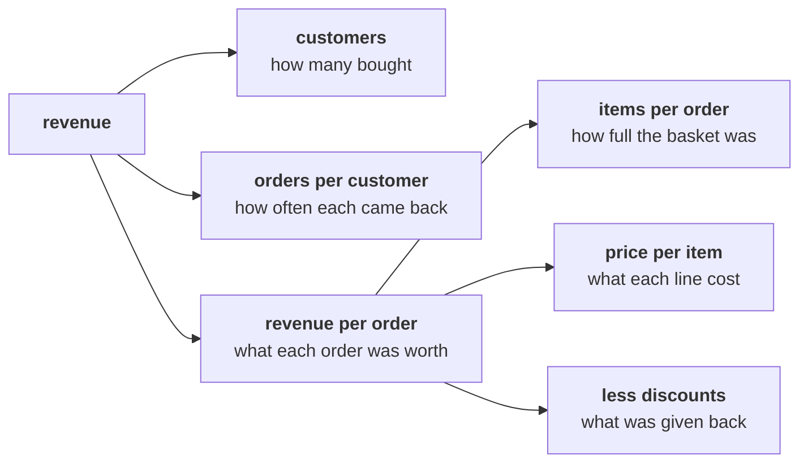

# Guided: the tree on the board, then orders and revenue in one loop

> "What is 'sales' made of? Is acquisition even the branch that is short?"
> Meera Raghavan, CEO, Kalpa Retail

Built with the trainer, one step at a time, with your own Codespace open. Nothing here is graded.
The trainer asks each item aloud, the room calls its letter, and the room's answer is tested on the
board or in the notebook before anyone moves on. Every line in your notebook is there because you
typed it.

---

## Part 1. The tree, before any code

Copy the tree from the board onto paper. Revenue on the left, and what multiplies into it on the
right.

Beside each branch, write the metric as a numerator over a denominator. Leave a column for today's
number.

| Branch | Numerator | Denominator | Today's number |
|---|---|---|---|
| Customers | | | |
| Orders per customer | | | |
| Revenue per order | | | |
| Items per order | | | |
| Price per item | | | |

### Q1. Marketing asks for Rs 12 crore to acquire new customers. Which branch of the tree is that money a bet on?

a) Orders per customer, since new buyers bring new orders with them
b) Price per item, since new customers accept the list price more readily
c) Customers, since acquisition adds buyers who were not buying before
d) Discounts, since acquisition offers are usually a first-order coupon

### Q2. Which is orders per customer, written as a numerator over a denominator?

a) Orders over distinct customers, both counted in the same window
b) Distinct customers over orders, both counted in the same window
c) Orders over rows in the file, both counted in the same window
d) Revenue over orders, both counted in the same window

---

## Part 2. One record, then the list

Run the setup cell of `notebooks/C2_W01_D01_01_what_sales_is_STUDENT.ipynb`. Then, with the room,
print the first record and read each field aloud with its type: order id, customer id, segment,
channel, date, amount and status. A record is a dictionary, and the file is a list of 30 of them.

---

## Part 3. Orders and revenue in one loop

At level 1 of `notebooks/C2_W01_D01_02_counting_leaves_STUDENT.ipynb`, type the loop with the
room: one counter for orders and one running total for revenue, both set
before the loop and both printed after it. If the loop stops part way, read the last line of the
message aloud, find the record it stopped on, and fix it with the room. Two minutes, and then the
loop runs.

### Q3. Before the loop runs, predict: how many times does its body run on the file?

a) 23 times, once for each customer who bought
b) 30 times, once for each order in the file
c) 26 times, once for each order not cancelled
d) 21 times, once for each order delivered

### Q4. The loop prints 30 orders and a revenue total. Which definition of sales is that total?

a) Delivered, since only delivered orders reach a customer
b) Not cancelled, since cancelled orders carry no revenue
c) Net of returns, since returned orders are refunded to the customer
d) Booked, since the loop adds every order whatever its status

---

## What you leave with

The tree on paper with its numerators and denominators, a notebook that runs from a fresh kernel,
an order count and a booked total from one loop, and the question the next round opens: which of
the three totals is "sales"?
