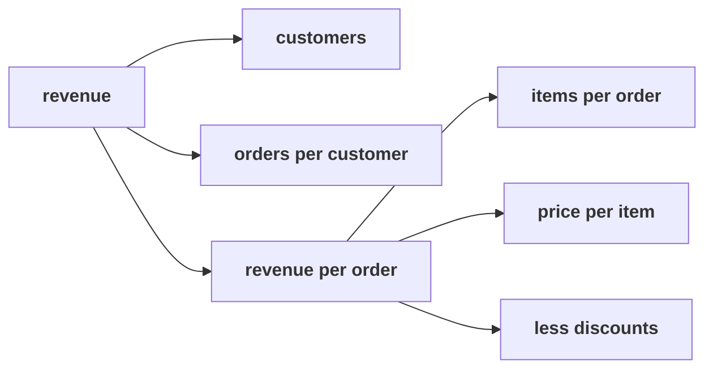

# Which branch does each growth idea move, and do the day's checks hold on files you have not seen?

> "Before I sign anything, I want to understand our own sales."
> Meera Raghavan, CEO, Kalpa Retail

**Who needs the answer.** Meera, whose marketing list holds five growth ideas, and the owner of
Kalpa's new pop-up store, who wants a first number from a fortnight of orders. An idea placed on the
wrong branch, or a leaf counted wrongly, sends money to the wrong place.

**The questions on the way.** Which branch does each growth idea move, and what does moving it cost?
What do customers, orders and revenue come to on a small file? What does the revenue tree look like
for a business you can watch? What does a fortnight of pop-up orders say once every check of the day
has run on it?

The practice lab after the afternoon runs four problems in about an hour, rising in difficulty: the
first works on the tree alone, the second counts the leaves on a small file, the third moves the tree to a
business you know, and the fourth runs every check of the day on one fresh file. Every record in
problems 2 and 4 is invented for this lab and belongs to no real customer. Items marked **Design**
ask for the best-fit approach, a sizing, or the fact that would switch the choice.

Post one line per problem, the letters in item order, no spaces:

```
Post exactly this shape: xxxxxxx / xxxx / xxxx / xxxxxx
```

---

## Which branch does each growth idea move, and what does moving it cost?

Meera's marketing list holds these five ideas, and placing each on the branch it moves shows which
of them would compete for the same customers. Allow about 15 minutes.

Five initiatives are on marketing's list: a discount, a new store, a loyalty card, a price rise and
an app redesign. Revenue is customers, times orders per customer, times revenue per order, and
revenue per order is items per order times price per item, less discounts:



### Q1. A 15 percent discount on everything, for a month: which branch does it move, and what does it cost?

a) Discounts, and it trades margin for the extra quantity it hopes to sell
b) Customers, and it costs the marketing budget the sale is advertised with
c) Price per item, and it costs nothing, since the list price is unchanged
d) Items per order, and it costs merchandising the shelf space it needs

### Q2. A new store in a city the app already serves: which branch does it move, and what is the catch?

a) Price per item, since store prices usually sit above the app's prices
b) Orders per customer, since a store makes buying easier for existing buyers
c) Customers, with the catch that some app buyers simply move to the store
d) Items per order, since shoppers in a store pick up more lines per visit

### Q3. A loyalty card with points on every order: which branch does it move, and what does it cost?

a) Customers, since the card is how most people first hear of the brand
b) Discounts, since points are money handed back at the checkout counter
c) Price per item, since members accept the list price more willingly
d) Orders per customer, paid in points to some who would return anyway

### Q4. A 5 percent price rise on the top sellers: which branch does it move, and what is the risk?

a) Items per order, since customers buy fewer extras when prices rise
b) Price per item, with volume at risk as the price-sensitive leave first
c) Customers, since a price rise mainly changes which people shop with Kalpa
d) Discounts, since a price rise is usually offset by coupons at the till

### Q5. Design. An app redesign with a new checkout and a new home screen: which branch does it move, and what decides it?

a) It depends on the behaviour it changes, so that behaviour is named first
b) Customers, since a redesign is marketing by another name in the end
c) Items per order, since a better home screen shows more products per visit
d) Orders per customer, since every app update brings its users back

### Q6. Marketing's list says 15 percent off everything will lift quantity 10 percent. Where would booked revenue of Rs 5,44,810 land?

a) About Rs 5,99,290, 1.10 of today, since quantity rose 10 percent
b) About Rs 5,17,570, 0.95 of today, since 10 less 15 is minus 5
c) About Rs 4,63,090, 0.85 of today, since quantity does not change price
d) About Rs 5,09,400, 0.935 of today, since 0.85 times 1.10 is 0.935

### Q7. Design. Marketing asks about 20 percent off instead. How much more quantity would that discount need just to hold revenue level?

a) 20 percent, the same as the cut in the price
b) 25 percent, since 1 divided by 0.80 is 1.25
c) About 17.6 percent, the lift a 15 percent discount needs
d) 40 percent, twice the cut, to cover the lost margin as well

---

## What do customers, orders and revenue come to on a small file?

The chapters put these measures on Meera's tree, and a kiosk's eight orders are few enough to predict
each one before the code prints it. Allow about 10 minutes.

Eight invented orders from one week at a Kalpa kiosk. Predict each number before you compute it,
then check your prediction in a notebook.

| order_id | customer_id | status | amount (Rs) |
|---|---|---|---|
| W-01 | U-1 | delivered | 1,500 |
| W-02 | U-2 | delivered | 2,000 |
| W-03 | U-1 | cancelled | 1,200 |
| W-04 | U-3 | delivered | 2,500 |
| W-05 | U-2 | delivered | 1,800 |
| W-06 | U-4 | returned | 3,000 |
| W-07 | U-5 | delivered | 2,200 |
| W-08 | U-1 | delivered | 1,600 |

### Q8. How many customers bought at the kiosk in the week, on all booked orders?

a) 8, one for each row in the table
b) 4, the customers with delivered orders
c) 5, one for each distinct customer id
d) 2, the customers who came back

### Q9. How many orders did each kiosk customer keep, on the delivered reading?

a) 1.50
b) 1.60
c) 1.20
d) 1.00

### Q10. What did the kiosk take on the not-cancelled reading of sales?

a) Rs 15,800, every order in the table
b) Rs 11,600, the delivered orders only
c) Rs 12,800, every order less the one that was returned
d) Rs 14,600, every order less the cancelled one

### Q11. What is the kiosk's typical booked order, as the median?

a) Rs 1,800, the lower of the two middle orders
b) Rs 1,900, halfway between the two middle orders
c) Rs 1,975, the total of all eight over the count
d) Rs 2,000, the upper of the two middle orders

---

## What does the revenue tree look like for a business you can watch?

The profitability case in Hacking the Case Interview (checked 29 Sep 2026) shows this tree spoken
aloud in an interview, and tonight's take-home asks you to draw it for a business you can watch.
Allow about 15 minutes.

Take a business you can watch: the canteen, a kirana store near where you live, or an app you use
most days. Draw its revenue tree on paper in that business's own words first, then answer.

### Q12. In the canteen's tree, which metric is "how often the same person eats here"?

a) Meals sold in a week over all the students enrolled on the campus
b) People who ate in a week over the meals sold in that week
c) Meals sold in a week over the distinct people who ate that week
d) Revenue in a week over the meals sold in that same week

### Q13. The kirana owner's "average bill" is the week's revenue over what?

a) The number of bills rung up in the same week
b) The number of days the shop was open that week
c) The number of distinct customers the owner recognised
d) The number of items sold across the counter that week

### Q14. An app's report says "orders per user: 0.4", computed as September's orders over all 50,000 registered users (invented numbers). What is wrong with it?

a) Nothing, since every registered user is a customer of the app
b) The rate is upside down, so it should read users over orders
c) September is too short a window to compute any rate at all
d) The denominator holds users who never ordered in September

### Q15. The canteen stays open an hour later every evening. Which branch does that move, and what does it cost?

a) Price per item, since late meals can carry a small premium on the menu
b) Customers who could not come before, paid for in staff and power
c) Items per order, since late diners tend to order more dishes at a time
d) Discounts, since leftover food is sold off cheaply at closing

---

## What does a fortnight of pop-up orders say once every check has run?

The pop-up's owner wants a first number from this fortnight, and nobody at Kalpa has cleaned the
export, so every check of the day runs on it at once. Allow about 20 minutes.

Twelve invented orders from a Kalpa pop-up store's first fortnight. Paste them into a new cell of
your own notebook and work every item from them.

```python
# Invented for this lab.
POPUP = [
    {"order_id": "IV-01", "customer_id": "V-01", "status": "delivered", "amount": 1800},
    {"order_id": "IV-02", "customer_id": "V-02", "status": "delivered", "amount": 2400},
    {"order_id": "IV-03", "customer_id": "V-03", "status": "cancelled", "amount": 2200},
    {"order_id": "IV-04", "customer_id": "V-01", "status": "delivered", "amount": 2100},
    {"order_id": "IV-05", "customer_id": "V-04", "status": "returned", "amount": 1600},
    {"order_id": "IV-06", "customer_id": "V-05", "status": "delivered", "amount": "2750"},
    {"order_id": "IV-07", "customer_id": "V-06", "status": "delivered", "amount": 60000},
    {"order_id": "IV-08", "customer_id": "V-02", "status": "delivered", "amount": 1900},
    {"order_id": "IV-09", "customer_id": "V-07", "status": "cancelled", "amount": 3100},
    {"order_id": "IV-10", "customer_id": "V-08", "status": "delivered", "amount": 2500},
    {"order_id": "IV-11", "customer_id": "V-03", "status": "delivered", "amount": 2300},
    {"order_id": "IV-12", "customer_id": "V-09", "status": "delivered", "amount": 1700},
]
```

If a sum stops part way, read the last line of the message, print the record it stopped on, and
convert with int(). Then carry on.

### Q16. The pop-up's first dashboard reads "Revenue Rs 84,350 from 12 customers." Which pair of errors does it carry?

a) It leaves out the returned order and counts the channels as customers
b) It uses the mean and leaves out the one text amount from the total
c) It counts 2 cancelled orders as sales and counts rows as customers
d) It uses the wrong window and counts only the delivered customers

### Q17. What did the pop-up take on the not-cancelled reading, and on how many orders?

a) Rs 77,450 on 9 orders
b) Rs 79,050 on 10 orders
c) Rs 84,350 on 12 orders
d) Rs 82,750 on 11 orders

### Q18. How many orders did each pop-up customer place, on all booked orders?

a) 1.00
b) 0.75
c) 1.25
d) 1.33

### Q19. What is the pop-up's typical booked order, and which number would mislead the owner?

a) Rs 2,250, the median, is typical; the mean of Rs 7,029 would mislead
b) Rs 7,029 is typical, and the median of Rs 2,250 would mislead the owner
c) Rs 2,200, the lower middle order, is typical; the mean is fine too
d) Rs 60,000 is typical, since it carries most of the fortnight's revenue

### Q20. Design. The owner plans a 10 percent lift in customers and a 10 percent lift in orders per customer, on not-cancelled revenue. What would revenue become?

a) About Rs 94,860, since the two lifts add to 20 percent
b) About Rs 86,955, since only one lift can land in a fortnight
c) About Rs 95,650, since the two lifts multiply to 1.21
d) About Rs 1,58,100, since two lifts together double the revenue

### Q21. Which kind of sentence can go to the pop-up's owner as written?

a) One that names the reading and the window, counts customers by id, and gives the median
b) One that gives the booked total and the average order, since the owner asked about revenue
c) One that gives delivered revenue and the mean order, since delivered is what stayed sold
d) One that gives the not-cancelled total alone, since that is what the pop-up made

---

## What sentence do you bring to Tuesday's opening?

Write one sentence to the pop-up's owner, in your own words, that names the reading of sales, the
customers, orders per customer and the typical order, and says which branch you would examine first
and why.
