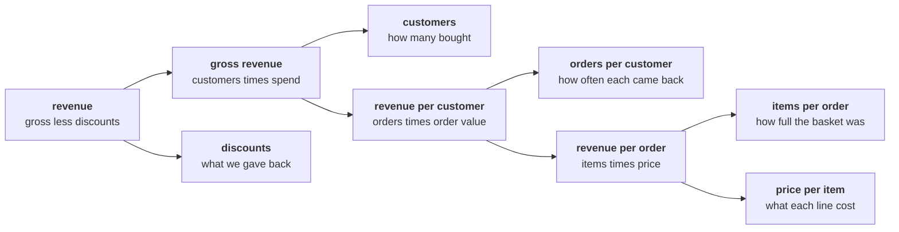

# Mid-session drill: place the initiative, price the move

Fifteen minutes, in pairs, no notebook. Every item has one right answer. Decide first, then check
your reasoning with your partner, then record the letter.

Post one line, twelve letters in item order, no spaces:

```
Post exactly this shape: xxxxxxxxxxxx
```

The tree every item refers to:



---

## Part A. Which branch does the initiative move?

### Q1. A 15 percent discount on everything, for a month: which branch does it move?

a) Customers, because a sale is what brings new buyers through the door
b) Discounts, traded away for the extra volume the sale is meant to bring
c) Price per item, since every tagged price on the shelf comes down with it
d) Items per order, because a sale is what always fills the basket up

### Q2. A new store in a city where the app already sells: which branch, and what is the catch?

a) Customers, with the catch that app buyers may simply move to the store
b) Orders per customer, since the store makes buying easier for people who already buy
c) Price per item, because store prices usually sit above the prices in the app
d) Items per order, since shoppers in a store tend to pick up more lines

### Q3. A loyalty card with points on every order: which branch does it move?

a) Customers, because the card is how new people first come to hear of the brand
b) Discounts, since the points are money handed back at the checkout
c) Price per item, because members accept the list price more willingly
d) Orders per customer, and it may pay people who would return anyway

### Q4. A five percent price rise on the top sellers: which branch, and what is the risk?

a) Price per item, with volume at risk as the price-sensitive leave first
b) Items per order, since customers buy fewer extras when prices go up
c) Customers, because a price rise mainly changes which people shop with us
d) Discounts, since a price rise is usually offset by coupons at the till

### Q5. An app redesign with a new checkout and a new home screen: which branch does it move?

a) Customers, because a redesign is really marketing by another name
b) Items per order, since a better home screen shows more products per visit
c) Depends on the behaviour it changes, so name that first
d) Orders per customer, because every app update brings people back

---

## Part B. Numbers on the tree

### Q6. Orders per customer rises 10 percent and items per order rises 10 percent. By how much does revenue rise?

a) 20 percent, the two lifts added together
b) 21 percent, because the two branches multiply
c) 10 percent, since only one branch can move in a quarter
d) 11 percent, the larger lift plus a tenth of the smaller one

### Q7. Fifteen percent off, and the items sold rise 10 percent. Where does revenue end?

a) 1.10 times 0.85, which is 0.935 of today
b) 1.10 plus 0.85, less one, which is 0.95 of today
c) 1.15 times 1.10, because a discount lifts the volume twice
d) 0.85 of today, since the volume does not change the price

### Q8. How much more volume does a 20 percent discount need just to stand still?

a) 20 percent, the same as the cut in the price
b) 16.7 percent, because 0.8 times 1.2 is close enough to one
c) 25 percent, because 1 divided by 0.8 is 1.25
d) 40 percent, twice the cut, to cover the lost margin as well

---

## Part C. Denominators and definitions

### Q9. Which of these is orders per customer, written correctly?

a) Customers over orders, counted in the same window
b) Orders over distinct customers, in the same window
c) Orders over every customer on record, in any window
d) Revenue over orders, which is the same rate by another name

### Q10. "Revenue is Rs 5,20,790." What is missing before this line leaves the team?

a) Nothing, because a total needs no qualifier at all
b) The median, since a total on its own always misleads
c) The number of customers who placed those orders
d) Its definition and its window

---

## Part D. The moves, in order

### Q11. Five moves turn a business ask into an answer: p) the data, q) the ask, r) the answer, s) the question, t) the method. Which order is right?

a) q, s, p, t, r
b) q, p, s, t, r
c) s, q, p, t, r
d) q, s, t, p, r

### Q12. Marketing's Rs 12 crore is a bet on which branch, and what is checked before it is spent?

a) Orders per customer; check the loyalty programme's cost first
b) Customers; compare customers and frequency across two quarters
c) Price per item; check whether competitors have cut their prices
d) Discounts; check how much was given back last year
