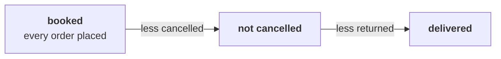

# Chapter 1 scenario set: four readings of sales

> "Before I sign anything, I want to understand our own sales. What is 'sales' made of?"
> Meera Raghavan, CEO, Kalpa Retail

Five items on the 30 orders from 1 July to 26 September, alone, in the room's turn of chapter 1.
Items marked **Design** ask for the best-fit approach, a sizing, or the fact that would switch it.
Every item has one right answer. Decide first, then record the letter.

Post one line, five letters in item order, no spaces:

```
Post exactly this shape: xxxxx
```

The walk every item refers to:



---

### Q1. Your first slide for Meera reads "Sales last quarter: Rs 5,44,810 (30 orders)." What is wrong with that line before it leaves the team?

a) It should show the median order, since Anand asked the team for no averages at all
b) It counts the 4 cancelled orders, demand that never became a sale
c) It leaves out the 5 returned orders, which belong in any figure called sales
d) It should cover a full year, since one quarter is too short a window to report on

### Q2. Before a sales figure leaves the team, four steps run: p) write the definition beside the total, q) count the orders by status, r) sum each reading, s) reconcile to Finance's figure for the board. In which order do they run?

a) r, q, p, s
b) q, r, s, p
c) r, p, q, s
d) q, r, p, s

### Q3. Design. Meera wants a first look this afternoon, and Anand will take a figure to the board next month. Which pairing of approaches fits the two asks?

a) Sum by status with the bridge for Meera now, and reconcile to Finance's books for the board
b) Ask Finance for both figures, since any number the team computes might disagree with the books
c) Add every amount for Meera now, since on a first look speed matters more than a definition
d) Tick the orders off by hand for both, since a spreadsheet leaves an audit trail anyone can follow

### Q4. Anand wanted revenue on the orders that were not cancelled, and this cell printed 9050.

```python
total = 0
for order in ORDERS:
    if order["status"] == "cancelled":
        total = total + int(order["amount"])
print(total)
```

Which change gives him the number he asked for?

a) Change "cancelled" to "delivered", so only the delivered orders are summed
b) Move print(total) inside the loop, so every step shows its running total
c) Change == to != on the status line, so the cancelled orders are skipped
d) Replace int() with float(), so the amounts keep their paise in the total

### Q5. Design. Next month Kalpa adds a fifth status, "part-refunded". Which way of computing the three readings keeps working with no new code?

a) One loop with an if per reading, since every reading is written out in full and easy to read
b) Sums by status, with not cancelled computed as booked less the cancelled key
c) Neither route, since any new status means both have to be rewritten from the top down
d) Finance's figure alone, since the books will already treat part-refunds in their own way

---

## Hands-on

Open `notebooks/C2_W01_D01_01_four_readings_of_sales_STUDENT.ipynb` and run it to the second route.
Check Q1 against the numbers it prints, and change a letter only if your reasoning changes with it.

**In the interview.** [F] What counts as "sales": booked, net of cancellations, or delivered, and
which do you give a CEO?
