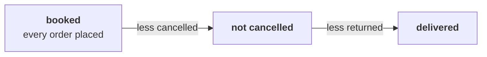

# Which of the file's totals should Meera call sales, and what does each one count?

> "Before I sign anything, I want to understand our own sales. What is 'sales' made of?"
> Meera Raghavan, CEO, Kalpa Retail

**Who needs the answer.** Meera Raghavan needs one number she can call sales before she decides
whether marketing gets Rs 12 crore to win new customers, and Anand Iyer, the finance controller,
needs that number to match his books. A wrong total misstates the base the 15 percent growth plan
is measured from, and every percentage built on it moves with it.

**The questions on the way.** Which way of answering fits Meera's first look, and which fits the
board? Which total can go on her slide as sales, and which checks run before it leaves the team?
Which change to a colleague's cell gives Anand his reading? Which route keeps working when the data
gains a new status?

Five items, alone, in the room's turn of chapter 1. Every item has one right answer, so decide it
before you record the letter. Items marked **Design** ask for the best-fit approach, a sizing, the
fact that would switch the choice, or the second route that would confirm a number.

Post one line, five letters in item order, no spaces:

```
Post exactly this shape: xxxxx
```

---

## What does Kalpa's file hold, and what does each reading of sales keep?

Kalpa Retail grew revenue 4 percent last year against a plan of 15 percent, and marketing has asked
for Rs 12 crore to win new customers. The team's extract holds Kalpa Retail's 30 orders from 1 July
to 26 September 2026, one row per order. Each row carries seven fields: the order id, the customer
id, the segment, the channel (app, web or store), the order date, the amount in rupees and the
status. The status says what happened to the order: delivered, returned after delivery and
refunded, or cancelled before it left the shelf.

Three readings of sales come out of the same rows, and each keeps different orders:

| Reading | The orders it keeps | The question it answers |
|---|---|---|
| Booked | Every order placed | How much did customers ask for? |
| Not cancelled | Booked, less the cancelled orders | How much left the shelf? |
| Delivered | The orders that reached a customer and stayed | How much stayed sold? |

The walk between the readings names every rupee that separates one from the next:



The file, counted and summed by status:

| Status | Orders | Rupees |
|---|---|---|
| Delivered | 21 | Rs 5,20,790 |
| Returned | 5 | Rs 14,970 |
| Cancelled | 4 | Rs 9,050 |
| All statuses | 30 | Rs 5,44,810 |

To reconcile a figure is to set it beside Finance's figure for the same window and explain every
rupee of difference.

---

## Which way of answering fits Meera's first look, and which fits the board?

Analysts choose every week between computing a figure themselves and taking the one in Finance's
books, and the choice turns on who will act on the number and how soon.

Four ways a team could answer "what are our sales?", sized on this file:

| Way | Rows touched | Time | What it risks on this file |
|---|---|---|---|
| A. Add every amount and send the total | 30 | under a second | one total, whatever each order's status |
| B. Sum by status, and report each reading with the walk between them | 30, once | under a second | nothing, once the walk lands on the booked total |
| C. Ask Finance for the figure in the books | none | a day or more | nothing, on Finance's own reading |
| D. Tick the orders off by hand in a spreadsheet | 30 | about ten minutes | a typo in one of 30 cells |

### Q1. Design. Meera wants a first look at sales this afternoon, and Anand will take a sales figure to the board next month. Which pairing of the four ways fits the two asks?

a) Add every amount for Meera now, as a first look needs speed, and ask Finance for the board
b) Ask Finance for both figures, since any number the team computes may disagree with the books
c) Sum by status with the walk for Meera now, and reconcile to Finance's books before the board
d) Tick the orders off by hand for both, since a spreadsheet leaves a trail anyone can follow

---

## Which total can go on Meera's slide as sales, and which checks run first?

Every finance and analytics team checks what a total counts before it leaves the team, because a
figure called sales gets quoted in rooms the analyst never enters.

### Q2. Your first slide for Meera reads "Sales last quarter: Rs 5,44,810 (30 orders)." What is wrong with that line before it leaves the team?

a) Nothing, since each of the 30 orders was placed by a customer who meant to buy
b) It carries Rs 9,050 of cancelled orders, and it names no reading of sales
c) It should report delivered revenue, since only delivered orders count as sales
d) It leaves out the 5 returned orders, which belong in any sales figure

### Q3. Anand will take the team's figure to the board. Four steps run before it leaves the team: p) write the reading beside the total, q) count the orders by status, r) sum each reading, s) reconcile to Finance's figure. In which order should they run?

a) r, q, p, s
b) q, r, s, p
c) r, p, q, s
d) q, r, p, s

---

## Which change gives Anand his reading, and which route keeps working?

Analysts inherit cells that print a number, and the first job is to say what the number counts. The
route a team keeps is the one that survives the next change in the data.

### Q4. Anand asked for revenue on the orders that were not cancelled, and a colleague's cell printed 9050. Which one change gives him his number?

```python
total = 0
for order in ORDERS:
    if order["status"] == "cancelled":
        total = total + int(order["amount"])
print(total)
```

Pick one change.

a) Change == to != on the status line, so that every cancelled order is skipped
b) Change "cancelled" to "delivered", so only the delivered orders are summed
c) Change "cancelled" to "returned" and == to !=, so returned orders are skipped
d) Change == to != and "cancelled" to "delivered", so undelivered orders are summed

### Q5. Design. Next month Kalpa adds a fifth status, "part-refunded". Which way of computing the readings shows the new status the first time it appears, with no new code?

a) One loop with an if per reading, since each reading is written out in full
b) Sums by status, since the new status arrives as its own line in the walk
c) Neither, since a new status means both routes are rewritten from the top
d) Finance's figure alone, since the books treat part-refunds in their own way

---

## How do you check your letters against the notebook?

Open `notebooks/C2_W01_D01_01_four_readings_of_sales_STUDENT.ipynb` and run it to its second route.
Check Q2 and Q5 against what it prints, and change a letter only if your reasoning changes with it.

**In the interview.** [F] What counts as "sales": booked, net of cancellations, or delivered, and
which do you give a CEO?
