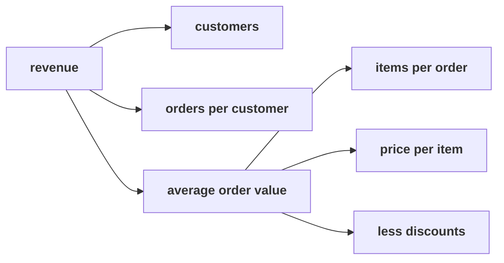

# How does sales split into customers, orders per customer and order value, each a fraction on one definition?

> "What is 'sales' made of?"
> Meera Raghavan, CEO, Kalpa Retail

**Who needs the answer.** Meera needs the tree to see which branch of sales is short before she
signs Rs 12 crore for new customers, and marketing's payback case values every new customer by the
order that customer will place. A branch measured badly misprices every new customer, and the
budget with them.

**The questions on the way.** Which tree can this file fill? What is an order worth on one reading
of sales? What should the team say about a colleague's AOV? Which check tells whether two numbers
share a definition? Which data would deepen the tree?

You work these five items alone, in the room's turn of chapter 2. Every item has one right answer,
so decide it before you record the letter. Items marked **Design** ask for the best-fit approach, a
sizing, the fact that would switch the choice, or the second route that would confirm a number.

Post one line, five letters in item order, no spaces:

```
Post exactly this shape: xxxxx
```

---

## What did chapter 1 find, and what does the tree need?

Kalpa Retail grew revenue 4 percent last year against a plan of 15 percent, and marketing has asked
for Rs 12 crore to win new customers. Chapter 1 read Kalpa Retail's 30 orders from 1 July to 26
September 2026 three ways: booked, every order placed, Rs 5,44,810 on 30 orders; not cancelled,
Rs 5,35,760 on 26; and delivered, the orders that reached a customer and stayed, Rs 5,20,790 on 21.

The revenue tree says what sales is made of. Revenue is customers, times orders per customer, times
average order value (AOV), and AOV is items per order times price per item, less discounts:



A branch is a metric when it is a numerator over a denominator, both taken on one reading of sales
and one window. AOV is revenue over orders, and orders per customer is orders over distinct
customers. Each order in the extract carries seven fields: the order id, the customer id, the
segment, the channel, the order date, the amount and the status. No field holds items, list prices
or discounts.

Two reports feed the team. Finance's report carries booked revenue, and the operations dashboard
counts delivered orders, because delivery is what operations runs.

---

## Which tree can this file fill today?

Every analytics team handed a revenue question draws the tree before it opens the data.

Four trees a team could draw, and what each needs:

| Tree | Fields it needs | In this file? |
|---|---|---|
| A. Revenue = orders x AOV | amount | yes |
| B. Revenue = customers x orders per customer x AOV | amount, customer id | yes |
| C. Tree B, with AOV split into items x price per item, less discounts | items, list price and discount on each order | no |
| D. A funnel from visits to orders | app sessions or store footfall | no |

### Q1. Design. Meera's question is whether acquisition is the short branch. Which of the four trees should the team draw on this file today?

a) Orders times AOV, since a two-branch tree is the quickest to explain to a CEO
b) Customers times orders per customer times AOV, since the file holds amounts and ids
c) The tree with AOV split into items and price, since it shows which part of the basket moved
d) A funnel from visits to orders, since it shows where shoppers drop out before they buy

---

## What is an order worth, on one reading of sales?

Finance and product teams publish every rate with its numerator and its denominator written beside
it.

### Q2. Marketing's payback needs the value of an order that stayed delivered. Delivered revenue is Rs 5,20,790 on 21 delivered orders. What is the delivered AOV?

a) Rs 20,030
b) Rs 17,360
c) Rs 24,800
d) Rs 18,160

### Q3. A colleague divides Finance's booked Rs 5,44,810 by the dashboard's 21 delivered orders and reports an AOV of Rs 25,943 for marketing's payback. What should the team say about that AOV?

a) It claims Rs 7,78,300 on the 30 booked orders, more than was ever booked, so it stays out
b) It gives back the booked Rs 5,44,810 on the 21 orders, so it checks out and can go in
c) It is the delivered AOV, since the orders it divides by are delivered ones, so it can go in
d) It is the booked AOV, since the rupees it divides are the booked ones, so it can go in

---

## Which check keeps a fraction honest, and which data would deepen the tree?

Analysts who divide one team's number by another's check the result before it travels, and they
know which table they are still waiting for.

### Q4. Design. Next quarter the payback team will divide Finance's revenue by an order count from the warehouse. Which check, run after dividing, tells them whether the two numbers share a definition?

a) The AOV must sit between the smallest and the largest order in the file
b) The division is redone on a calculator to confirm the arithmetic
c) AOV times the orders it was divided by must give the revenue back
d) AOV times the orders the revenue was summed over must give it back

### Q5. Design. Which data would the team need before it could draw the tree that splits AOV into items, price and discounts?

a) An order-items table with the items and list price on each order
b) Footfall and app sessions for every day of the quarter, store by store
c) A second quarter of the same extract, with the same seven fields
d) A customer id on every order, so that repeat buyers can be followed

---

## How do you check your letters against the notebook?

`notebooks/C2_W01_D01_02_the_tree_as_metrics_STUDENT.ipynb` runs the identity check on every
fraction the chapter builds. Check Q2 and Q3 against it, and change a letter only if your reasoning
changes with it.

**In the interview.** [S] How would you increase sales for an online retailer?
