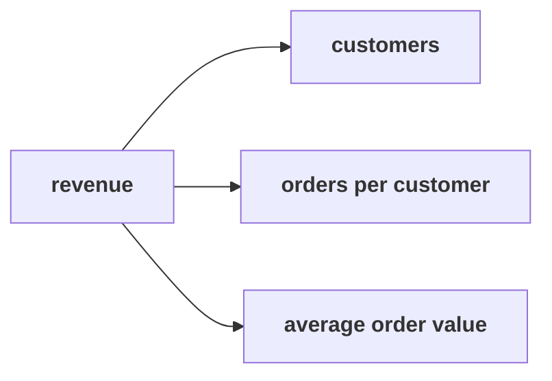

# Chapter 2 scenario set: the tree as metrics

> "What is 'sales' made of?"
> Meera Raghavan, CEO, Kalpa Retail

Five items on the same 30 orders, alone, in the room's turn of chapter 2. Items marked **Design**
ask for the best-fit approach, a sizing, or the fact that would switch it.

Post one line, five letters in item order, no spaces:

```
Post exactly this shape: xxxxx
```



---

### Q1. Which branch of Kalpa's tree can this 30-order extract measure as a fraction today?

a) Price per item, read from the amount on each order
b) Items per order, counted from the rows of the extract
c) Average order value, revenue over orders
d) Discount rate, the amount charged against the list price

### Q2. A colleague divides Finance's booked Rs 5,44,810 by the dashboard's 21 delivered orders and reports an AOV of Rs 25,943. What does multiplying it back over the 30 booked orders show?

a) Rs 5,44,810, so the booked total confirms the AOV
b) Rs 7,78,300, revenue nobody booked, so the fraction mixes two definitions
c) Rs 5,20,790, so the AOV matches the delivered revenue after all, and it stands
d) Nothing useful, since the identity holds only for the median order of the file

### Q3. Design. Kalpa's order-items table arrives next month with items and list prices on every order. Which tree should the team draw then?

a) The same three-branch tree, since extra fields only add noise to every split
b) A funnel from visits to orders, since items show where shoppers drop out
c) Orders times AOV, since a two-branch tree is the easiest one to explain to a CEO
d) The deeper tree, splitting AOV into items, price and discounts

### Q4. Delivered revenue is Rs 5,20,790 on 21 delivered orders. What is the delivered AOV?

a) Rs 24,800
b) Rs 25,943
c) Rs 18,160
d) Rs 22,643

### Q5. Design. Finance's revenue and the operations dashboard's order count are about to feed one fraction. Which step, taken before dividing, prevents the mixed AOV?

a) Round both numbers to the nearest thousand so the small gaps stop mattering
b) Ask each report what it counts, and divide only numbers on one definition
c) Use the larger of the two possible AOVs, since it is the safer one to plan on
d) Average the booked and delivered AOVs so that both reports are represented

---

## Hands-on

`notebooks/C2_W01_D01_02_the_tree_as_metrics_STUDENT.ipynb` runs the identity check on all three
fractions. Check Q2 and Q4 against it.

**In the interview.** [S] How would you increase sales for an online retailer?
