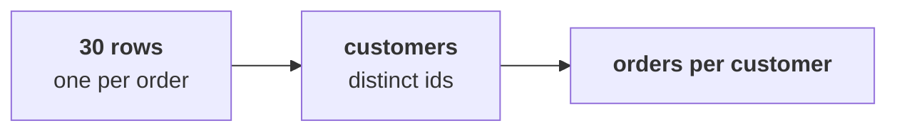

# Chapter 3 scenario set: the leaves, counted

> "Is acquisition even the branch that is short?"
> Meera Raghavan, CEO, Kalpa Retail

Five items on the same 30 orders, alone, in the room's turn of chapter 3. Items marked **Design**
ask for the best-fit approach, a sizing, or the fact that would switch it.

Post one line, five letters in item order, no spaces:

```
Post exactly this shape: xxxxx
```



---

### Q1. Match each question to the tool that answers it. Questions: 1) how many customers bought, 2) how many orders each customer placed, 3) which customers bought on both the app and the web, 4) how many orders there are. Tools: p) `len(ORDERS)`, q) `len(set(ids))`, r) a dictionary of counts, s) the `&` of two sets. Which matching holds?

a) 1p 2r 3s 4q
b) 1q 2s 3r 4p
c) 1q 2r 3s 4p
d) 1r 2q 3s 4p

### Q2. A colleague reports "30 customers, 1.00 orders each, so nobody comes back." Which decision would that number have misled?

a) Cutting the store channel, since its orders were the ones cancelled
b) Pricing the payback on the median, since there are so few customers
c) Delaying the plan, since one quarter is too short to count anyone at all
d) Funding acquisition as the only branch, since frequency looks dead

### Q3. Design. Next year Kalpa's full export holds 4 crore order rows in the warehouse. Which way of counting customers should the team use?

a) A Python loop over a list, since it is the method the team already trusts
b) COUNT(DISTINCT customer_id) in the warehouse, where the rows already live
c) len() of the export, since a row count is the fastest count there is
d) Sorting the ids in a spreadsheet by hand and counting where they change

### Q4. On delivered orders only, 21 orders come from 19 customers and nobody kept three. How many customers kept two delivered orders?

a) 7, the repeat buyers counted on all the booked orders
b) 2, the delivered orders less the delivered customers
c) 19, since every delivered customer counts as one
d) 5, the repeat buyers on not-cancelled orders

### Q5. Design. Meera asks only "how many customers bought this quarter?" Which method fits, and when would you switch to the dictionary of counts?

a) The row count, and switch once the number looks too round to be believed
b) A dictionary always, since it is never slower than any other count
c) A sort of the ids, and switch once the extract grows past a thousand rows
d) A set of ids, and switch when someone asks how many came back

---

## Hands-on

`notebooks/C2_W01_D01_03_the_leaves_counted_STUDENT.ipynb` counts the leaves under all three
definitions. Check Q1 and Q4 against it: its set, dictionary and `&` cells are Q1's tools.

**In the interview.** [F] Your extract shows 30 orders and 30 customers; what do you check before
saying nobody comes back?
