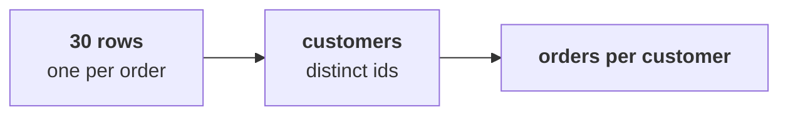

# How many customers does Kalpa have, and how many came back for a second order?

> "Is acquisition even the branch that is short?"
> Meera Raghavan, CEO, Kalpa Retail

**Who needs the answer.** Meera needs the customer count before she funds acquisition, and the head
of Retail-Plus and the marketing lead own the two customer branches the count fills. A wrong count
moves the Rs 12 crore to whichever branch the count happens to flatter.

**The questions on the way.** How do you count customers when every row is an order? What does a
colleague's orders-per-customer figure tell Meera? Where should the count run at the full export's
scale? How many customers kept two orders on another reading of sales? When is a set of ids enough,
and when does the team need a count per customer?

You work these five items alone, in the room's turn of chapter 3. Every item has one right answer,
so decide it before you record the letter. Items marked **Design** ask for the best-fit approach, a
sizing, the fact that would switch the choice, or the second route that would confirm a number.

Post one line, five letters in item order, no spaces:

```
Post exactly this shape: xxxxx
```

---

## What did chapters 1 and 2 find, and what does one row hold?

Kalpa Retail grew revenue 4 percent last year against a plan of 15 percent, and marketing has asked
for Rs 12 crore to win new customers. Chapter 1 read the 30 orders from 1 July to 26 September 2026
three ways: booked, Rs 5,44,810 on 30 orders; not cancelled, Rs 5,35,760 on 26; and delivered,
Rs 5,20,790 on 21. Chapter 2 drew the tree, revenue as customers times orders per customer times
average order value, and measured the booked order value at Rs 5,44,810 / 30 = Rs 18,160. The two
customer branches come from the customer id on each order.

A row in the extract is one order, and a customer is one customer id, so one customer can sit on
several rows. Orders per customer is orders over distinct customers, both in the same window, and a
customer came back when they placed two or more orders in the window.



Four Python tools do the counting. `len(ORDERS)` counts the rows. `len(set(ids))` counts distinct
ids, since a set keeps each value once however often it is added. A dictionary of counts keeps one
count per id. The `&` of two sets keeps the ids both sets hold.

---

## How do you count customers when every row is an order?

The head of Retail-Plus reads orders per customer to see whether his tier is slipping, and the
marketing lead reads the customer count as the branch the Rs 12 crore would buy.

### Q1. The head of Retail-Plus asks four things about the quarter: 1) how many customers bought, 2) how many orders each customer placed, 3) which customers bought on both the app and the web, 4) how many orders there are. The tools are p) `len(ORDERS)`, q) `len(set(ids))`, r) a dictionary of counts per id and s) the `&` of two sets of ids. Which matching answers all four?

a) 1p 2r 3s 4q
b) 1q 2s 3r 4p
c) 1r 2q 3s 4p
d) 1q 2r 3s 4p

### Q2. A colleague's cell divides the 30 orders by `len(ORDERS)` and sends Meera the result as orders per customer. What does it print, and what would she read into it?

a) 1.30, so frequency is a live branch worth testing before acquisition
b) 1.00, so nobody comes back and buying customers looks like the only way to grow
c) 0.77, so customers outnumber orders and many buyers never finished an order
d) 23.00, since the division runs the wrong way and the figure means nothing to her

---

## Where should the count run at Kalpa's full scale?

The same customer count goes to Meera next year from Kalpa's full export, and the team picks where
it runs before writing a line of it.

### Q3. Design. Next year the full export holds 4 crore order rows in the warehouse. Pulling them into a notebook moves 4 crore rows before a loop starts, while a count in the warehouse sends back one number. Which way of counting customers fits?

a) A Python loop over a list of the rows, since it is the method the team already trusts
b) `len()` of the export, since a row count is the fastest count there is
c) COUNT(DISTINCT customer_id) in the warehouse, where the rows already live
d) Sorting the ids in a spreadsheet and counting the places where they change

---

## How many customers came back on another reading, and which tool fits the ask?

Anand counts customers on his own reading of sales and Meera asks her own question about them, so
each count at Kalpa starts from who is asking.

### Q4. Anand counts customers only on orders that were not cancelled. On those, 26 orders come from 21 customers, and nobody placed three. How many of his customers kept two orders?

a) 5, the not-cancelled orders less their customers
b) 7, the repeat buyers counted on all the booked orders
c) 21, since every one of these customers counts as one
d) 26, one for each not-cancelled order in the file

### Q5. Design. Meera asks only "how many customers bought this quarter?" Two tools could answer her: a set of ids, one line and one pass, or a dictionary of counts, three lines and one pass. Which fits her ask, and what would make you switch?

a) The row count, and switch once the number looks too round to believe
b) A dictionary always, since it is never slower than any other count
c) A sort of the ids, and switch once the file grows past a thousand rows
d) A set of ids, and switch to counts when someone asks who came back

---

## How do you check your letters against the notebook?

`notebooks/C2_W01_D01_03_the_leaves_counted_STUDENT.ipynb` counts the customers on the booked
orders, and its set, dictionary and `&` cells are the tools of Q1. Check Q1 against it, run its set
cell on the 26 orders that were not cancelled for Q4, and change a letter only if your reasoning
changes with it.

**In the interview.** [F] Your extract shows 30 orders and 30 customers; what do you check before
saying nobody comes back?
