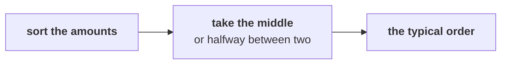

# Chapter 4 scenario set: the typical order

> "No averages. One business customer can move an average."
> Anand Iyer, finance controller, Kalpa Retail

Five items on the same 30 orders, alone, in the room's turn of chapter 4. Items marked **Design**
ask for the best-fit approach, a sizing, or the fact that would switch it.

Post one line, five letters in item order, no spaces:

```
Post exactly this shape: xxxxx
```



---

### Q1. The mean of 30 orders is Rs 18,160 and 29 of them sit below it. What does that say about the orders?

a) One or a few very large orders pull the mean far above a typical order
b) Most orders sit near Rs 18,160, and a few small ones pull the mean down below them
c) The mean is wrong arithmetic, and it should be recomputed by hand from the amounts
d) The orders are spread evenly, so the mean and the median must sit close together

### Q2. The 30 amounts are sorted; the 15th is Rs 2,110 and the 16th Rs 2,300. What is the median order?

a) Rs 2,110, the 15th amount in size order
b) Rs 2,300, the 16th amount in size order
c) Rs 18,160, the booked total divided by the count of 30
d) Rs 2,205, halfway between the two middle amounts

### Q3. Design. Marketing's payback adds up what a new customer brings over their first year. Which number should it be built on, and what would change it?

a) The booked mean, since every rupee of every order has to show up somewhere in a payback total
b) The median of first orders, since that is the order a typical new customer places
c) The targeted segment's mean, bulk orders set aside; a new target means a new segment
d) The largest order, since the payback should be planned around the very best customers

### Q4. Design. One invented Rs 90,000 order joins five invented orders of Rs 1,900 to Rs 2,600: the mean moves Rs 14,623, the median Rs 50, the trimmed mean Rs 83. Which should the team report as the typical order, and when would the trimmed mean do as well?

a) The mean, since the order that moved it most is the one the business most needs to see
b) The median; the trimmed mean would do once its rule drops every bulk order, not just one
c) The trimmed mean always, since it throws away the two orders most likely to be errors
d) Any of the three, since on five ordinary orders they all sit within Rs 100 of each other

### Q5. On delivered orders the mean is Rs 24,800 and the median Rs 2,060; on booked orders, Rs 18,160 and Rs 2,205. Which figure should Meera plan the typical order on?

a) Rs 24,800, the delivered mean, since delivered orders are the real ones that stayed sold
b) About Rs 2,060 to Rs 2,205, the median, named with its definition
c) Rs 18,160, because the mean is the figure that multiplies back to revenue
d) Rs 21,480, the average of the two means, so both definitions are represented

---

## Hands-on

`notebooks/C2_W01_D01_04_the_typical_order_STUDENT.ipynb` sizes the four middles on the invented
records and prints the median under each definition. Check Q2, Q4 and Q5 against it.

**In the interview.** [S] Mean or median for order value, and why?
