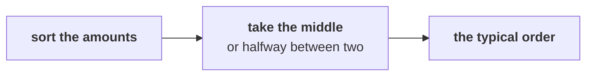

# What does a typical Kalpa order look like, stated so that one large order cannot move it?

> Meera: "What does a typical order look like?"
> Anand: "No averages. One business customer can move an average."
> Meera Raghavan, CEO, and Anand Iyer, finance controller, Kalpa Retail

**Who needs the answer.** Marketing's case for Rs 12 crore values every new customer by the orders
that customer will place, so Meera needs to know what a typical order is worth before she judges
whether the budget is cheap, and Anand has already said how he will read the answer. A first order
valued wrongly makes Rs 12 crore look cheaper or dearer than it is, and the payback with it.

**The questions on the way.** What does the mean say about the orders? What is the middle order?
Which number should a payback be built on? Which middle survives one large order? Does the typical
order hold when the reading of sales changes?

You work these five items alone, in the room's turn of chapter 4. Every item has one right answer,
so decide it before you record the letter. Items marked **Design** ask for the best-fit approach, a
sizing, the fact that would switch the choice, or the second route that would confirm a number.

Post one line, five letters in item order, no spaces:

```
Post exactly this shape: xxxxx
```

---

## What did chapters 1 to 3 find, and what are the middles?

Kalpa Retail grew revenue 4 percent last year against a plan of 15 percent, and marketing has asked
for Rs 12 crore to win new customers. Chapter 1 read the 30 orders from 1 July to 26 September 2026
three ways: booked, Rs 5,44,810 on 30 orders; not cancelled, Rs 5,35,760 on 26; and delivered,
Rs 5,20,790 on 21. Chapter 2 measured the average order value on booked orders at Rs 5,44,810 / 30 =
Rs 18,160. Chapter 3 counted 23 customers, 1.30 orders each, and 7 of them came back.

A middle is one number that stands for all the orders, and three are in play:

| Middle | How it is worked out |
|---|---|
| The mean | It is the total of the amounts over their count, which is the average order value. |
| The median | It is the middle amount once the amounts are sorted, or halfway between the two middle amounts when the count is even. |
| The trimmed mean | It is the mean of what is left after a rule drops the smallest and the largest orders. |



A payback asks how soon the money spent winning a customer comes back from what that customer
brings in. It adds up the customer's orders over a period, so it needs each order's contribution:
what an order leaves after the cost of its goods and of delivering it.

---

## What does the mean say about Kalpa's orders, and what is the middle order?

Blinkit reported a net average order value of Rs 518 for the quarter to June 2026 (MediaNama on
Eternal's Q1 FY27 earnings call, July 2026); at Kalpa, Meera wants to know what a typical order looks
like before she judges marketing's case.

### Q1. The mean of the 30 orders is Rs 18,160, and only 1 of the 30 sits above it. What does that say about Kalpa's orders?

a) One or a few very large orders pull the mean far above a typical order
b) Most orders sit near Rs 18,160, and a few small ones pull the mean down
c) The sum is wrong, so the mean should be recomputed by hand from the amounts
d) The orders are spread evenly, so the mean and the median sit close together

### Q2. Anand wants the typical order as the middle of the sorted amounts. Sorted, the 15th of the 30 amounts is Rs 2,110 and the 16th is Rs 2,300. What is the median order?

a) Rs 2,110, the lower of the two middle amounts
b) Rs 2,300, the upper of the two middle amounts
c) Rs 18,160, the booked total over the 30 orders placed
d) Rs 2,205, halfway between the two middle amounts

---

## Which number should the payback use, and which middle survives a large order?

Marketing's payback for the Rs 12 crore is built on one of these numbers, and Meera signs the budget
on that payback.

### Q3. Design. Marketing's payback adds up what a new customer brings in over their first year, to see how soon the cost of winning them comes back. Which number should it be built on, and what would change it?

a) The booked mean, since every rupee counts in a total; a cleaner extract would change it
b) The mean contribution per order of the segments the spend targets; a new target changes it
c) The median of first orders, since it is the typical order; a skewed segment would change it
d) The largest order, since it is the most a customer can reach; any price cut would change it

### Q4. Design. One invented Rs 90,000 order joins five invented orders of Rs 1,900 to Rs 2,600. The mean moves Rs 14,623, the median Rs 50 and the trimmed mean Rs 83. Which middle should the team report as the typical order, and when would the trimmed mean do as well?

a) The mean, since the order that moved it most is the one the business most needs to see
b) Any of the three, since on the five ordinary orders they sit within Rs 100 of each other
c) The median, which needs no rule; a trimmed mean matches it while it trims each large order
d) The trimmed mean always, since it moved almost as little as the median and is still a mean

---

## Does the typical order hold when the reading of sales changes?

Anand asks whether the typical order moves with the reading of sales before the number goes into
Meera's plan.

### Q5. Anand asks whether the typical order depends on the reading of sales. On not-cancelled orders the mean is Rs 20,606 and the median Rs 2,100. Set them beside the booked mean of Rs 18,160 and the booked median you found in Q2. What should the team tell him?

a) Both middles move with the reading, so the typical order waits for Finance's definition
b) The median barely moves while the mean moves by thousands, so the median goes in the plan
c) The mean moves less in percent than the median, so the mean is the steadier figure
d) Neither moves enough to matter, so either middle can go into the plan as the typical order

---

## How do you check your letters against the notebook?

`notebooks/C2_W01_D01_04_the_typical_order_STUDENT.ipynb` sizes the three middles on the invented
orders and prints the median on the booked and not-cancelled readings. Check Q2, Q4 and Q5 against it, and change
a letter only if your reasoning changes with it.

**In the interview.** [S] Mean or median for order value, and why?
