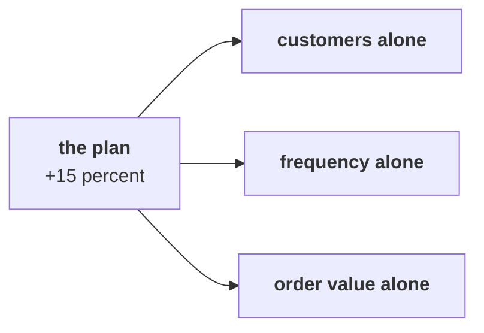

# Chapter 5 scenario set: which branch first

> "Is acquisition even the branch that is short?"
> Meera Raghavan, CEO, Kalpa Retail

Five items on the same 30 orders, alone, in the room's turn of chapter 5. Items marked **Design**
ask for the best-fit approach, a sizing, or the fact that would switch it.

Post one line, five letters in item order, no spaces:

```
Post exactly this shape: xxxxx
```



---

### Q1. Design. The 15 percent plan needs Rs 81,722 more on this extract. Holding the other branches, what does frequency alone need?

a) 3.45 more customers who buy the way today's customers do
b) Rs 2,724 more on every order the customers already place
c) 15 more orders, one for each point of the plan
d) 4.5 more orders from the same 23 customers

### Q2. Marketing says a 10 percent lift in customers and a 10 percent lift in orders per customer make 20 percent growth. What do they make through the tree?

a) 20 percent, since the two lifts add
b) 10 percent, since the two lifts overlap
c) 19 percent, since the second lift is smaller
d) 21 percent, since the two lifts multiply

### Q3. A 15 percent discount lifts the number of orders by 10 percent. What happens to revenue?

a) It rises 10 percent, since more orders are placed
b) It falls 6.5 percent, since 0.85 x 1.10 is 0.935
c) It falls 5 percent, since 10 less 15 is minus 5
d) It stays flat, since the two effects cancel out

### Q4. Design. Which finding in Tuesday's second quarter would move the first branch from frequency to acquisition?

a) Customers fell between quarters while orders per customer held steady
b) Orders per customer fell between quarters while customers held steady
c) The median order rose by a few hundred rupees between the quarters
d) Web returns fell from 5 of 10 orders to 3 of 10 orders between quarters

### Q5. Design. Which is the cheapest first test of the frequency branch?

a) A Rs 12 crore acquisition campaign launched across every city at once
b) A 15 percent discount on every order for a whole month
c) A reorder reminder to the one-time buyers, against a held-out group
d) A five percent price rise on the top-selling products

---

## Hands-on

`notebooks/C2_W01_D01_05_which_branch_first_STUDENT.ipynb` sizes the four options and builds the
two lifts as a bridge. Check Q1 and Q2 against it.

**In the interview.** [D] Marketing wants budget for acquisition; what would you check before
agreeing it is the right branch, and how would you say no?
