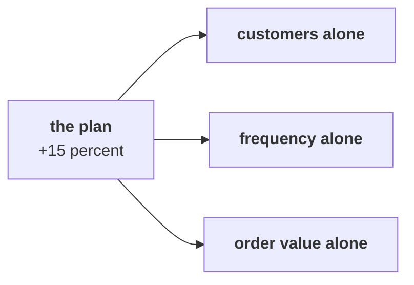

# Which branch should Meera open first to reach the 15 percent plan, and why not the others?

> "Is acquisition even the branch that is short?"
> Meera Raghavan, CEO, Kalpa Retail

**Who needs the answer.** Meera decides whether Rs 12 crore goes to acquisition. The marketing lead
owns that branch, and the head of Retail-Plus owns the members most likely to come back. The wrong
branch spends the money where the business is not short, and a plan sized wrongly misses its
target.

**The questions on the way.** Which base is the plan sized on, and what does a different base ask
of the customers the plan reaches? What would each branch have to do alone, and which has evidence
behind it? What do two lifts make together? What would switch the call, and which first test costs
least?

You work these five items alone, in the room's turn of chapter 5. Every item has one right answer,
so decide it before you record the letter. Items marked **Design** ask for the best-fit approach, a
sizing, the fact that would switch the choice, or the second route that would confirm a number.

Post one line, five letters in item order, no spaces:

```
Post exactly this shape: xxxxx
```

---

## What did chapters 1 to 4 find, and what does Meera's plan concern?

Kalpa Retail grew revenue 4 percent last year against a plan of 15 percent, and marketing has asked
for Rs 12 crore to win new customers. The chapters so far read Kalpa Retail's 30 orders from 1 July
to 26 September 2026:

| Chapter | What it found |
|---|---|
| 1 | Booked sales, every order placed, is Rs 5,44,810; not cancelled is Rs 5,35,760 and delivered Rs 5,20,790. |
| 2 | Revenue is customers, times orders per customer, times order value, and each branch is a fraction on one reading of sales. |
| 3 | Kalpa has 23 customers, at 1.30 orders each; 7 of them came back for a second order and 16 bought once. |
| 4 | The typical order is the median, Rs 2,205. The booked mean of Rs 18,160 sits far above it, so a total or a payback is built on the mean of the segments the spend targets. |

Each order carries a segment. Meera's growth plan concerns the three consumer segments, Retail-Core,
Retail-Plus and Student, so the plan is sized on the consumer view: the orders whose segment is one
of those three. The consumer view booked Rs 64,810 this quarter, at a mean order of Rs 2,235. The
plan asks 15 percent more, about Rs 74,532, which is Rs 9,722 more.



---

## Which base is the plan sized on, and what does a different base ask?

Every growth plan is sized on a stated base before any team is asked to move a branch, and finance
sends back a plan whose base is left unsaid.

### Q1. Design. Marketing's slide sizes the 15 percent plan on all booked revenue and asks for Rs 81,722 more this quarter. The plan's offers reach only the three consumer segments, so every rupee of it has to come from them. How much would those segments have to grow?

a) About 15 percent, since the plan's percentage is the same on any base
b) About 26 percent, since Rs 81,722 is 26 percent more than Rs 64,810
c) About 126 percent, since Rs 81,722 is more than the Rs 64,810 they book today
d) About 13 percent, since Rs 81,722 is 13 percent of the Rs 6,26,532 the plan reaches

---

## What would each branch have to do alone, and which has evidence behind it?

Strategy and finance teams size what each lever must deliver on its own before they fund any of
them, since a lever that needs an impossible move is off the table.

On the consumer view, each branch alone would have to do this to reach the plan:

| Branch moved alone | What it would have to do |
|---|---|
| Customers, the acquisition branch | It would need 15 percent more customers who buy like today's, every one of them new to Kalpa. |
| Orders per customer, the frequency branch | It would need 15 percent more orders from the same customers, about three in ten of the consumer one-time buyers returning once. |
| Order value | It would need Rs 335 more on every order, the mean rising from Rs 2,235 to Rs 2,570. |
| Price | It would need every price 15 percent higher, with nobody buying any less. |

### Q2. Design. Alone, any one of the four branches in the table could carry the plan. Which should Meera open first, on this quarter's evidence and cost?

a) Frequency, since 7 of the 23 customers already came back and the rest are on file
b) Acquisition, since 16 of the 23 bought only once and look like this quarter's new arrivals
c) Order value, since the booked mean of Rs 18,160 shows customers already spend heavily
d) Price, since 15 percent on every price needs no customer to change what they do

---

## What do two lifts make together?

Plans that combine two levers are checked before they reach a budget meeting.

### Q3. Marketing's slide says a 10 percent lift in customers and a 10 percent lift in orders per customer make 20 percent growth, Rs 77,772 on the consumer view's Rs 64,810. What do the two lifts make through the tree?

a) 20 percent, Rs 77,772, since lifts on two separate branches add
b) 10 percent, Rs 71,291, since both lifts act on the same orders
c) 21 percent, Rs 6,59,220, since the lifts multiply on booked revenue
d) 21 percent, Rs 78,420, since the second lift applies to the first

---

## What would switch the call, and which first test costs least?

A recommendation that names what would change it, and the cheapest way to test it, is one a leader
can sign today and revisit next quarter.

### Q4. Design. Tuesday brings the quarter before this one. Which finding in it would show that acquisition is the branch that is short?

a) Orders per customer fell between the quarters while customers held steady
b) Customers fell between the quarters while orders per customer held steady
c) The median order rose by a few hundred rupees between the quarters
d) The share of cancelled orders fell between the quarters, in every channel

### Q5. Design. Before any budget moves, Meera wants a cheap test of whether one-time buyers can be brought back for a second order. A reminder costs one message per buyer, a month of 15 percent off gives up Rs 15 of every Rs 100 sold, and loyalty points cost a share of every order, including orders that would have come anyway. Which test costs least and acts on that second order itself?

a) A survey asking the one-time buyers why they have not ordered again
b) A 15 percent discount on every order for a whole month
c) A reorder reminder to the one-time buyers already on file
d) A new loyalty tier with points on every order, open to all

---

## How do you check your letters against the notebook?

`notebooks/C2_W01_D01_05_which_branch_first_STUDENT.ipynb` sizes the four branches on the consumer
view and builds the two lifts as a bridge. Check Q2 and Q3 against it, and change a letter only if
your reasoning changes with it.

**In the interview.** [D] Marketing wants budget for acquisition; what would you check before
agreeing it is the right branch, and how would you say no?
