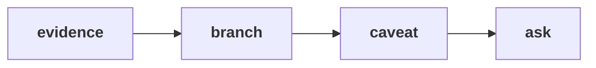

# Chapter 6 scenario set: the sentence Meera acts on

> "Before I sign anything, I want to understand our own sales."
> Meera Raghavan, CEO, Kalpa Retail

Five items on the same 30 orders, alone, in the room's turn of chapter 6. Items marked **Design**
ask for the best-fit approach, a sizing, or the fact that would switch it.

Post one line, five letters in item order, no spaces:

```
Post exactly this shape: xxxxx
```



---

### Q1. 16 of 23 customers bought once in an 88-day window. Which statement can go to Meera as written?

a) 70 percent of our customers are lost and will need to be won back
b) Retention is 30 percent a quarter, so seven in ten customers leave us
c) 16 of 23 bought once in this window, 9 of them too recently to judge
d) Nobody comes back after one order, so acquisition is the only branch

### Q2. Returning customers took a median of 45 days between orders. A one-time buyer ordered 6 days before the extract ends. How does the sentence treat them?

a) As too recent to judge, since they have had 6 of the usual 45 days
b) As lost, since six days have passed without a second order from them
c) As a returning customer, since they did buy inside the window
d) As outside every count, since their order is too near the edge

### Q3. Design. From Week 2 Meera's chief of staff wants the numbers every Monday. Which format fits then?

a) The same sentence, rewritten by hand from the notebooks every Monday
b) One number a week, since a weekly reader does not need the caveat
c) The whole tree as a table, sent as an attachment every Monday
d) A dashboard refreshed weekly, with the sentence as its headline

### Q4. Which order do the four parts of the sentence take?

a) Branch, then the ask, then the evidence, then the caveat
b) Caveat, then the evidence, then the ask, then the branch
c) Evidence, then the branch, then the caveat, then the ask
d) The ask, then the branch, then the caveat, then the evidence

### Q5. Design. The 45-day gap comes from only 7 customers. What would shrink the caveat most?

a) Rounding the gap to 45 days instead of computing it each time
b) A second and a third quarter, so the gap comes from many more customers
c) Dropping the too-recent buyers from the extract before any of the counting
d) Reporting the mean gap in place of the median gap

---

## Hands-on

`notebooks/C2_W01_D01_06_the_sentence_STUDENT.ipynb` measures the gap, splits the one-time buyers
and builds the sentence from variables. Check Q1 and Q2 against it.

**In the interview.** [D] You have one quarter of orders and 70 percent of customers bought once;
what do you tell the CEO?
