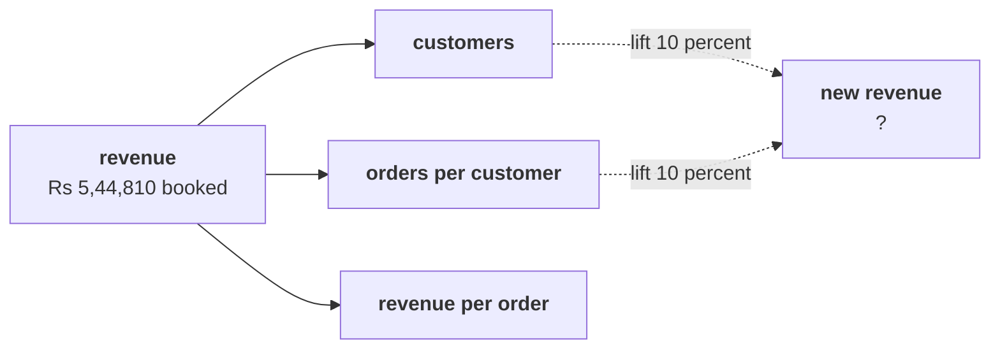

# The escalated case: which branch does Meera open first?

> "Marketing wants Rs 12 crore to acquire new customers. By Thursday I want your recommendation on
> which branch of revenue we examine first, and I will ask why you did not pick the others."
> Meera Raghavan, CEO, Kalpa Retail

Sixty minutes, alone, with no hints. The brief runs in five parts, each a harder question than the
last, and ends on one sentence to Meera. Work in
`notebooks/C2_W01_D01_ex1_escalated_case_STUDENT.ipynb`, which carries the same five parts as TODO
cells on the 30 orders from 1 July to 26 September.

The afternoon's items are numbered as one run: this brief holds items 1 to 10, and the second case
continues from item 11.

Post two lines. The first carries the seven lettered items (3, 4, 6, 7, 8, 9, 10) in order, no
spaces. The second carries the three numbers (items 1, 2 and 5), separated by spaces.

```
Post exactly this shape: xxxxxxx
Then this shape: n n n
```



---

## Part 1. What sales is made of: the leaves

### Q1. Compute: how many of the 23 customers bought only once in the quarter?

Write the number.

### Q2. Compute: on the not-cancelled definition (26 orders), what is orders per customer, to two decimals?

Write the number.

---

## Part 2. The typical order

### Q3. Which sentence about the typical order belongs in the note to Meera?

a) Rs 18,160, the mean, since it is the only figure that uses every rupee
b) Rs 2,205, the median, since one order lifts the mean about eightfold
c) Rs 2,060, the median of all 30 booked orders in the quarter
d) Somewhere between Rs 2,205 and Rs 18,160, so the note gives both

---

## Part 3. What a lift is worth

### Q4. Marketing says a 10 percent lift in customers and a 10 percent lift in orders per customer make 20 percent growth, Rs 6,53,772 on booked revenue. What is the right number?

a) 20 percent, Rs 6,53,772, since the two lifts add together
b) 10 percent, Rs 5,99,291, since only one branch can move at once
c) 11 percent, Rs 6,04,739, the larger lift and a tenth of the other
d) 21 percent, Rs 6,59,220, since the two branches multiply

### Q5. Compute: by how many rupees does marketing's 20 percent figure fall short of the right one?

Write the number, rounded to the rupee.

### Q6. Marketing's second idea is 15 percent off everything, expected to lift quantity 10 percent. Where does booked revenue land?

a) About Rs 5,09,400, which is 0.935 of today and a 6.5 percent fall
b) About Rs 5,17,570, which is 0.95 of today, since 10 less 15 is minus 5
c) About Rs 5,99,290, which is 1.10 of today, since the volume rose
d) About Rs 6,26,530, which is 1.15 of today, since both changes help

---

## Part 4. The branch to open first

### Q7. Which branch should Meera open first?

a) Acquisition, since marketing already has a plan and a budget for it
b) Price per item, since a price rise moves revenue fastest of all
c) Frequency, since most customers bought only once in the quarter
d) Basket size, since the typical order of Rs 2,205 is small

### Q8. The marketing lead asks why the Rs 12 crore should wait. Which answer holds up in the room?

a) Acquisition is the wrong branch, so the budget should be cut to zero this week
b) One quarter shows the shape of revenue; Tuesday's two quarters show the move
c) The file is too small to say anything, so the decision waits a full year
d) Frequency matters more than acquisition, so marketing is simply wrong

---

## Part 5. What one window cannot show

### Q9. What can this one window, 1 July to 26 September, not show?

a) How many distinct customers bought in the quarter
b) The typical order value in the quarter
c) How booked revenue splits across the channels
d) Which branch moved against the quarter before

### Q10. The note to Meera has five parts: p) the branch to open first, q) the definition of sales, r) what one window cannot show, s) the leaves, t) the typical order. In which order does she read them?

a) q, s, t, p, r
b) p, q, s, t, r
c) q, t, s, r, p
d) s, q, t, p, r

---

## The sentence to Meera

Write one sentence, under 60 words, that gives the window, the customers, orders per customer, the
typical order, the branch you would open first and what you would hold until Tuesday. Paste it after
your two lines.

## Hands-on

The TODO notebook's pick cells ask for letters of their own; post them as a third line, in the order
the notebook asks for them.

**In the interview.** [D] Marketing wants budget for acquisition; what would you check before
agreeing it is the right branch, and how would you say no?
