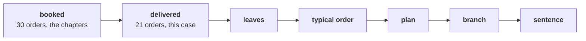

# Does frequency first survive on the orders that stayed delivered?

> "Booked includes orders we cancelled and orders that came back. Do it again on what was delivered
> and stayed delivered, and tell me whether your answer survives."
> Anand Iyer, finance controller, Kalpa Retail

**Who needs the answer.** Anand counts only what stayed sold, and his numbers are the ones that reach
the board. Meera needs to know before Thursday whether the branch she opens first changes on his
definition. An answer that holds on booked orders alone never reaches his books.

**The questions on the way.** How many customers stand behind the delivered orders, and how many
orders does each keep? What is the typical delivered order? What does the 15 percent plan ask of
delivered revenue, and where would marketing's discount leave it? How many delivered one-time buyers
are too recent to judge, which branch holds, and what goes in the board's headline? What sentence
goes to Meera?

You have thirty-five minutes, alone and with no hints. The five parts each climb from the one
before, and the last ends on one sentence to Meera. Work in
`notebooks/C2_W01_D01_ex1_escalated_case_STUDENT.ipynb`, which carries the same five parts as TODO
cells on the 30 orders. Items marked **Design** ask for the best-fit approach, a sizing, the fact
that would switch the choice, or the second route that would confirm a number.

The afternoon's items are numbered as one run: this brief holds items 1 to 10, and the second case
continues from item 11.

Post two lines. The first carries the six lettered items (3, 4, 5, 7, 8, 9) in order, no spaces.
The second carries the three numbers (items 1, 2 and 6), separated by spaces.

```
Post exactly this shape: xxxxxx
Then this shape: n n n
```

---

## What did the chapters find on booked orders, and what changes on delivered?

The six chapters answered Meera, Kalpa Retail's CEO, on the booked reading of Kalpa Retail's 30
orders from 1 July to 26 September 2026, an 88-day window:

| Question | The answer on booked orders |
|---|---|
| Sales | Booked sales were Rs 5,44,810 on 30 orders. |
| The customer branches | 23 customers placed 1.30 orders each; 7 came back and 16 bought once. |
| The typical order | The median was Rs 2,205, halfway between the two middle amounts of an even count. |
| The plan | The plan was sized on the consumer view, the orders whose segment is one of the three consumer segments Meera's plan concerns (Retail-Core, Retail-Plus and Student): Rs 64,810 booked, so 15 percent is Rs 9,722 more. |
| The branch | Frequency came first, since the customers exist and 7 already came back. |
| The window's edge | Returning customers took a median of 45 days between orders, so 9 of the 16 one-time buyers were too recent to judge. |

Anand's reading keeps only the delivered orders, those that reached a customer and stayed: 21 of
the 30 orders, Rs 5,20,790. The other 9 left the reading in two ways: 4 orders, Rs 9,050, were
cancelled before they left the shelf, and 5, Rs 14,970, were returned after delivery.



---

## How many customers stand behind the delivered orders, and how many orders does each keep?

Anand recounts the customer branches on the delivered orders before any customer figure goes to
Kalpa's board, because his books count only what stayed sold.

### Q1. Compute: how many distinct customers stand behind the 21 delivered orders?

Write the number.

### Q2. Compute: what is orders per customer on the delivered reading, to two decimals?

Write the number.

---

## What is the typical delivered order?

Marketing prices a new customer's first order from the typical order, so when Anand moves the
reading to delivered, the typical order is recomputed on the delivered amounts and says which orders
it describes.

### Q3. Anand's typical delivered order is the median of the 21 delivered amounts, sorted from smallest to largest into a list called amounts. Which expression gives it?

a) (amounts[9] + amounts[10]) / 2, halfway between two middles
b) amounts[11], the value one place above the middle of the list
c) amounts[10], the single middle value of an odd count
d) sum(amounts) / 21, the total divided by the count

---

## What does the plan ask of delivered revenue, and where would a discount leave it?

Anand sizes Meera's 15 percent plan on what stayed delivered before the board sees it, and he prices
marketing's discount on the same base before any money moves.

### Q4. Design. Anand wants the 15 percent plan sized on what stayed delivered, and Meera's plan still concerns the three consumer segments. Which base should the plan use, and what does it ask for?

a) All delivered revenue, Rs 5,20,790: about Rs 78,119 more, since every delivered rupee counts
b) The consumer view's delivered revenue, Rs 40,790: about Rs 6,119 more, to about Rs 46,909
c) The consumer view's booked revenue, Rs 64,810: about Rs 9,722 more, as chapter 5 sized it
d) All booked revenue, Rs 5,44,810: about Rs 81,722 more, since the board reads the booked total

### Q5. Design. Marketing proposes 15 percent off everything and expects orders to rise 10 percent. On the base you chose in Q4, where would revenue land?

a) Rs 38,139, a fall of 6.5 percent
b) Rs 61,570, a fall of 5 percent
c) Rs 38,751, a fall of 5 percent
d) Rs 60,597, a fall of 6.5 percent

---

## Which branch holds on delivered orders, once the window's edge is counted?

The head of Retail-Plus owns the members who return, so he needs the one-time buyers, and the recent
ones among them, counted on the reading Anand's books use.

### Q6. Compute: of the delivered customers who kept only one order, how many placed it fewer than 45 days before 26 September, too recently to judge?

Write the number.

### Q7. On delivered orders, which branch should Meera open first?

a) Acquisition, since few delivered customers kept a second order at all
b) Frequency, since the delivered rate stays close to the booked 1.30
c) Order value, since the delivered mean order rose to Rs 24,800
d) Frequency, with the cancelled and returned repeat orders as its leak

### Q8. Which line tells Anand what moved and what held between booked and delivered?

a) Everything held, so the reading of sales never mattered to the answer
b) Orders per customer fell; the typical order and the branch held
c) The typical order doubled, so the branch moves to order value
d) The branch moved to acquisition, since frequency fell on delivered orders

### Q9. Design. Anand will read the note at the board, where booked is Rs 5,44,810 and delivered Rs 5,20,790, Rs 24,020 apart. Which reading of sales goes in its headline, and what goes beside it?

a) Delivered, as his books count what stayed sold, with booked and the walk beside it
b) Booked, since the chapters and the plan were sized on it, with delivered in a note
c) Not cancelled, since it sits between the other two and splits the difference
d) Delivered alone, since two readings of sales on one page confuse a board

---

## What sentence goes to Meera on delivered orders?

This sentence reaches Meera before she decides on the Rs 12 crore, and Anand checks it against his
books, so it carries chapter 6's four parts and says what moved and what held.

### Q10. What one sentence, under 70 words, goes to Meera in chapter 6's four parts on delivered orders: the evidence with its window and reading of sales, the branch, what one quarter cannot show, and what happens to the Rs 12 crore?

Write it, and paste it after your two lines.

---

## How do the notebook's picks go into your post?

Each of the notebook's nine TODO cells carries a lettered choice above its placeholder. Post your
nine picks as one more line after your sentence, in TODO order, and run the notebook top to bottom:
every check should print PASS before you post.

**In the interview.** [D] Marketing wants budget for acquisition; what would you check before
agreeing it is the right branch, and how would you say no?
