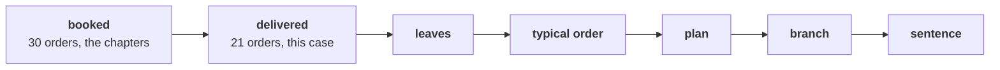

# The escalated case: does the answer survive on what stayed delivered?

> "Booked includes orders we cancelled and orders that came back. Do it again on what was delivered
> and stayed delivered, and tell me whether your answer survives."
> Anand Iyer, finance controller, Kalpa Retail

Thirty-five minutes, alone, with no hints. The six chapters answered Meera on booked orders; this
brief asks the same question on the 21 delivered orders, in five parts that each climb from the one
before, and ends on one sentence to Meera. Work in
`notebooks/C2_W01_D01_ex1_escalated_case_STUDENT.ipynb`, which carries the same five parts as TODO
cells on the 30 orders from 1 July to 26 September. Items marked **Design** ask for the best-fit
approach, a sizing, or the fact that would switch it.

The afternoon's items are numbered as one run: this brief holds items 1 to 10, and the second case
continues from item 11.

Post two lines. The first carries the six lettered items (3, 4, 5, 7, 8, 9) in order, no spaces.
The second carries the three numbers (items 1, 2 and 6), separated by spaces.

```
Post exactly this shape: xxxxxx
Then this shape: n n n
```



---

## Part 1. The leaves on what stayed delivered

### Q1. Compute: how many distinct customers are behind the 21 delivered orders?

Write the number.

### Q2. Compute: what is orders per customer on the delivered definition, to two decimals?

Write the number.

---

## Part 2. The typical delivered order

### Q3. The 21 delivered amounts are sorted into a list called amounts. Which expression is the median?

a) (amounts[9] + amounts[10]) / 2, halfway between the two middles
b) amounts[11], the value one place above the middle of the list
c) amounts[10], the single middle value of an odd count
d) sum(amounts) / 21, the total divided by the count

---

## Part 3. The plan and the discount, on delivered revenue

### Q4. Design. Anand wants the 15 percent plan sized on what stayed delivered. Which base should the frequency sizing use, and what does it ask for?

a) All 21 delivered orders, 3.15 more, since every delivered rupee counts toward Anand's plan
b) The 20 everyday delivered orders, 3 more, since no offer moves the top order
c) The 18 everyday delivered customers, 2.7 more people, since frequency is counted in people
d) The 30 booked orders, 4.5 more, since the board set the plan on booked revenue last year

### Q5. Design. Marketing proposes 15 percent off everything, expected to lift orders 10 percent. On the 20 everyday delivered orders, Rs 40,790, where does revenue land?

a) About Rs 38,140, a fall of 6.5 percent
b) About Rs 38,750, a fall of 5.0 percent
c) About Rs 44,870, a rise of 10.0 percent
d) About Rs 46,910, a rise of 15 percent

---

## Part 4. The branch, with the window's edge

### Q6. Compute: of the delivered customers who kept only one order, how many bought within the last 45 days of the window, too recently to judge?

Write the number.

### Q7. On delivered orders, which branch should Meera open first?

a) Acquisition, since few delivered customers kept a second order at all
b) Price per item, since a price rise moves delivered revenue fastest
c) Order value, since the delivered mean rose to Rs 24,800
d) Frequency, with cancelled and returned repeat orders as its leak

### Q8. Which line tells Anand what moved and what held between booked and delivered?

a) Everything held, so the definition never mattered to the answer
b) Orders per customer fell; the typical order and the branch held
c) The typical order doubled, so the branch moves to order value
d) The branch moved to acquisition, since frequency fell on delivered orders

### Q9. Design. Anand will read the note at the board. Which definition goes in its headline, and what goes beside it?

a) Delivered, as his books count what stayed sold, with booked and the bridge beside it
b) Booked alone, since it is the largest figure and so the most flattering for the team
c) Whichever definition gives frequency the strongest case, so the recommendation reads cleanly
d) Neither, since two definitions confuse a board and a single mean is simpler to take in

---

## Part 5. The sentence to Meera

### Q10. Write one sentence, under 70 words, in chapter 6's four parts on delivered orders: the evidence with its window and definition, the branch, what one quarter cannot show, and what happens to the Rs 12 crore.

Paste it after your two lines.

## Hands-on

Each of the notebook's nine TODO cells carries a lettered choice above its placeholder. Post your
nine picks as one more line after your sentence, in TODO order, and run the notebook top to bottom:
every check should print PASS before you post.

**In the interview.** [D] Marketing wants budget for acquisition; what would you check before
agreeing it is the right branch, and how would you say no?
