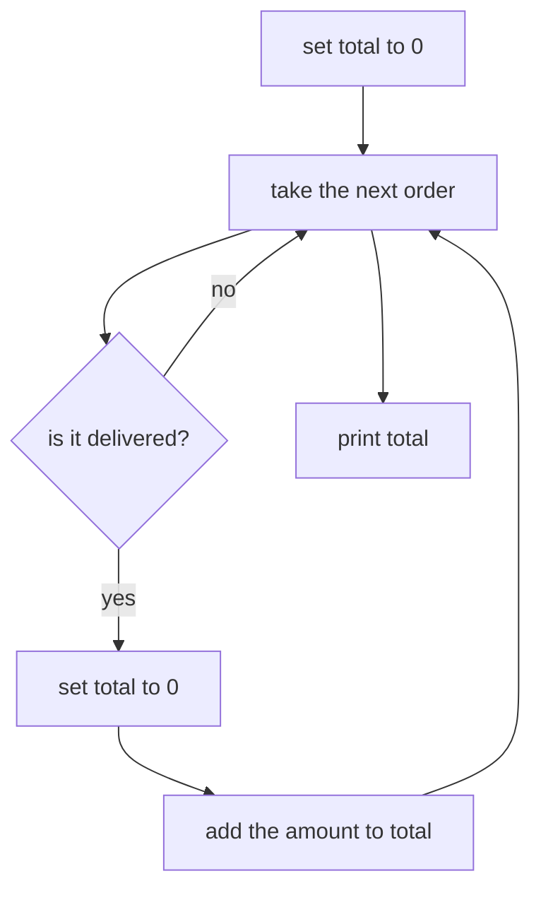

# Day 1, E3. Mid-session: find the mistake

Drop point: the close of the first half, after the accumulators and after the prediction drill. About 15 minutes, working alone.

This cell runs all the way to the end and prints a number. Nothing about the screen tells you the number is wrong.

```
for r in records:
    if r["status"] == "delivered":
        total = 0
        total = total + int(r["amount"])

print(total)
```

Fifteen items on that one cell. Read it before you run it.

Post one line at the end, in this shape, using your own letters:

```
1a 2b 3c 4d 5a 6b 7c 8d 9a 10b 11c 12d 13a 14b 15c
```

---

## Item 1

Before running it, what does that cell print?

a) Rs 25,720, the delivered total
b) Rs 58,210, every amount in the file
c) Rs 1,460
d) Nothing, since `total` was never given a starting value

## Item 2

One line sits in the wrong place. Which?

a) `total = 0`, inside the `if`
b) `for r in records`, which should be a `while`
c) `if r["status"] == "delivered"`, which should test the amount
d) `total = total + int(r["amount"])`, which should come before the `if`

## Item 3

Rs 1,460 is the amount of exactly one order in the file. Which one, and why did the loop keep it?

a) KR4200, because it is the largest amount and dominates the total
b) KR4201, because it is the first delivered order the loop reaches
c) KR4215, because it is the only order carrying a discount
d) KR4224, because it is the last delivered order the loop reaches

## Item 4

Where does the accumulator's starting value belong?

a) On the same line as the addition
b) Above the loop, where the loop cannot reach it
c) Inside the `if`, but after the addition
d) Below the `print`, so it is ready for the next run

## Item 5

You are handed the printed number and not the code. Which single fact about it is the strongest tell that something is wrong?

a) It matches an individual order's amount exactly
b) It is a round number ending in a zero
c) It is smaller than the largest amount in the file
d) It has four digits rather than five

## Item 6

Put the correct loop's lines in the order they must run. Answer as four letters.

a) `total = total + int(r["amount"])`
b) `for r in records:`
c) `total = 0`
d) `if r["status"] == "delivered":`

Which ordering is right?

a) b, d, a, c
b) c, d, b, a
c) c, b, d, a
d) b, c, d, a

## Item 7

Here is the broken loop drawn as a flow. Two arrows are wrong.



Which single change repairs the drawing?

a) Remove the arrow from E back to B, so the loop runs once
b) Remove node D, since the reset already happened at A
c) Send C's yes branch straight to F, skipping the addition
d) Move F above A, so the printing happens first

## Item 8

Why is a wrong number that runs cleanly harder to catch than the `TypeError` you met earlier?

a) It takes longer to run, so the room loses patience
b) The interpreter hides the line number when nothing raises
c) It only appears on large files, and this file is small
d) Nothing on screen flags it as wrong

## Item 9

Which check could you do in your head, on any total over a group of orders, that would have caught this?

a) Confirm the total ends in a zero
b) Confirm the loop ran thirty times
c) Confirm the total beats the biggest single order
d) Confirm the code contains no `if` inside a `for`

## Item 10

The correct delivered total is Rs 25,720 and the broken one is Rs 1,460. Roughly how many times larger is the correct answer?

a) About seventeen times
b) About four times
c) About forty times
d) About two hundred times

## Item 11

Which other single mistake also produces a delivered total that is too small, while still running cleanly?

a) Writing `count` where `total` was meant
b) Forgetting the `int()` around the amount
c) Printing inside the loop rather than after it
d) Testing the status with a capital D

## Item 12

The room is told the number is wrong and asked to find it in one minute. Which move finds it fastest?

a) Reading the loop line by line from the top
b) Searching the data for that exact amount
c) Adding a print of `r["order_id"]` inside the loop
d) Rerunning the cell to see whether the number changes

## Item 13

One more variant. What does this print?

```
total = 0
for r in records:
    if r["status"] == "delivered":
        total = total + int(r["amount"])
        total = 0

print(total)
```

a) Rs 1,460
b) Rs 25,720
c) 0
d) A `NameError`, since `total` is cleared

## Item 14

Which check, written once, would fail loudly on both variants? Assume `biggest_delivered` already holds the largest delivered amount.

a) `assert total >= biggest_delivered`
b) `assert total > 0`, so an empty result is caught
c) `assert isinstance(total, int)`, so a text total is caught
d) `assert len(records) == 30`, so a short file is caught

## Item 15

The wrong number reached a slide before anyone noticed. What goes on the corrections card?

a) An apology, since the room was misled
b) The claim, the correction and the source
c) The name of whoever ran the cell
d) A note that the file was dirty, which explains it

---

Post your fifteen letters on one line in the shape shown at the top. The solution is released at the close of the session.

## Hands-on

The running half is `notebooks/C2_W01_D01_ex2_hands_on_STUDENT.ipynb`, which stages the same broken loop, asks you to predict, name the line, repair it and prove the repair on a second condition. Post its four letters on the same line as these fifteen.
