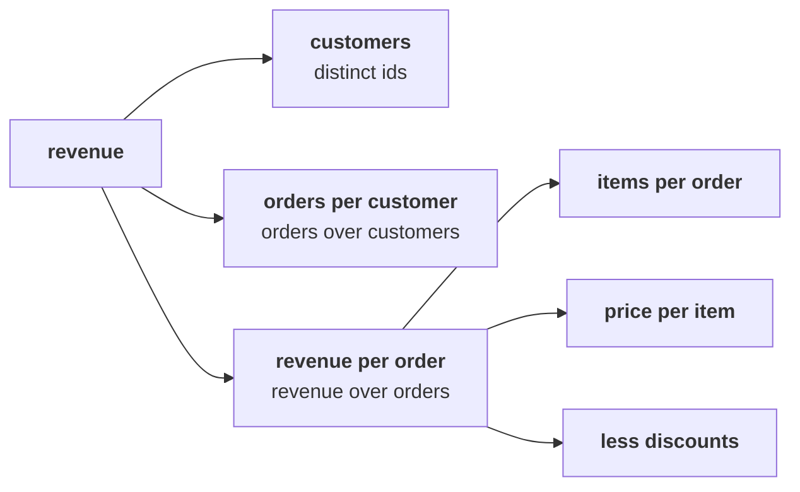

# Round 1 scenario set: what is sales, and what is it made of?

> "Before I sign anything, I want to understand our own sales. What is 'sales' made of?"
> Meera Raghavan, CEO, Kalpa Retail

Seven items on the 30 orders from 1 July to 26 September, alone, in the room's turn of round 1.
Every item has one right answer. Decide first, then record the letter.

Post one line, seven letters in item order, no spaces:

```
Post exactly this shape: xxxxxxx
```

The tree every item refers to:



---

### Q1. Your first slide for Meera reads "Sales last quarter: Rs 5,44,810 (30 orders)." What is wrong with that line before it leaves the team?

a) It should show the median order, since Anand asked for no averages
b) It counts the 4 cancelled orders, demand that never became a sale
c) It leaves out the 5 returned orders, which belong in any sales figure
d) It should cover a full year, since a quarter is too short to report

### Q2. A count by status comes back delivered 21, returned 5, cancelled 4. How many orders stand on the not-cancelled definition?

a) 21, since only a delivered order is a sale
b) 25, the 30 orders less the 5 that came back
c) 30, since every row is an order a customer placed with us
d) 26, the 30 orders less the 4 that were cancelled

### Q3. The 4 cancelled orders total Rs 9,050 and the 5 returned orders total Rs 14,970. What is revenue on the not-cancelled definition?

a) Rs 5,35,760, booked less the cancelled orders
b) Rs 5,29,840, booked less the returned orders
c) Rs 5,20,790, booked less the cancelled and the returned
d) Rs 5,53,860, booked with the cancelled orders added back

### Q4. All 4 cancelled orders are store orders. If the store team's growth baseline counts its 10 booked orders, what does that do to the plan?

a) Nothing, since the cancelled orders are too small in rupees to matter
b) It understates store, since a cancelled order was still real demand
c) It overstates store's orders by 4 in 10, demand that never arrived
d) It overstates app and web, since their orders are set against store's

### Q5. Anand wanted revenue on the orders that were not cancelled, and this cell printed 9050.

```python
total = 0
for order in ORDERS:
    if order["status"] == "cancelled":
        total = total + int(order["amount"])
print(total)
```

Which change gives him the number he asked for?

a) Change == to != on the status line, so cancelled orders are skipped
b) Change "cancelled" to "delivered", so only delivered orders are summed
c) Move print(total) inside the loop, so every step shows its running total
d) Replace int() with float(), so the amounts keep their paise

### Q6. Which of these lines is ready to go to Meera?

a) Sales: Rs 5,35,760, rounded to the nearest rupee for the board
b) Sales were Rs 5,44,810 in the quarter, which is what the orders add up to
c) Sales net of returns, last quarter: Rs 5,20,790 on 21 orders
d) Sales, not cancelled, 1 July to 26 September: Rs 5,35,760 on 26 orders

### Q7. Revenue is customers times orders per customer times revenue per order. Which pair of branches multiplies into revenue per customer?

a) Customers times orders per customer, both counted in the quarter
b) Orders per customer times revenue per order, in the same window
c) Items per order times customers, since both are counted on the order
d) Revenue per order times price per item, since both are in rupees

---

## Hands-on

Open `notebooks/C2_W01_D01_01_what_sales_is_STUDENT.ipynb` and run sections 1 and 2, the four
readings of sales and the trap. Check your answers to Q2 and Q3 against the numbers they print, and
change a letter only if your reasoning changes with it.

**In the interview.** [F] What counts as "sales": booked, net of cancellations, or delivered, and
which do you give a CEO?
