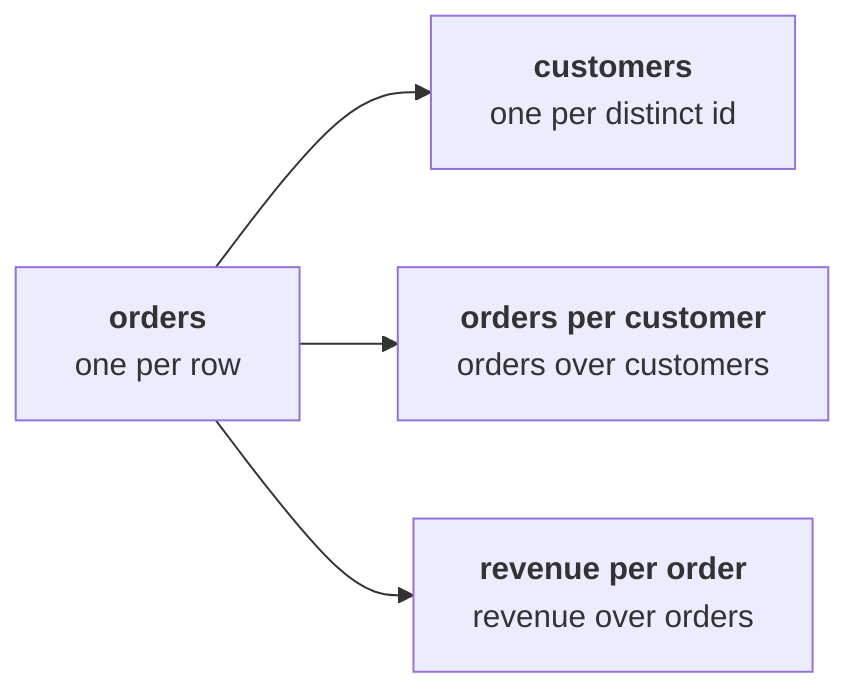

# Round 2 scenario set: count the leaves

> "Marketing tells me nobody comes back, so the only way to grow is to buy new customers. Is that
> what our own orders say?"
> Meera Raghavan, CEO, Kalpa Retail

Seven items on the 30 orders from 1 July to 26 September, alone, in the room's turn of round 2.
Every item has one right answer. Decide first, then record the letter.

Post one line, seven letters in item order, no spaces:

```
Post exactly this shape: xxxxxxx
```

A row in the file is an order. The leaves this round counts sit on the left of the tree:



---

### Q1. The first cut says "30 customers placed 30 orders, 1.00 each, so nobody comes back," and marketing reads it as proof that the Rs 12 crore is the only branch. Which check comes first?

a) Recount the orders by status, since cancelled orders may sit in the 30
b) Compare the mean and the median of the 30 order amounts
c) Compare the number of rows with the number of distinct customer ids
d) Ask marketing how many new customers the Rs 12 crore would buy

### Q2. Kavya asks how many customers bought in the quarter, and runs this cell on the 30 orders.

```python
ids = set()
for order in ORDERS:
    ids.add(order["customer_id"])
print(len(ids))
```

What does it print?

a) 23, one for each distinct id
b) 30, one for each row in the file
c) 16, the ids that appear only once
d) 7, the ids that appear twice

### Q3. Which number goes on the orders-per-customer leaf for the booked quarter?

a) 1.43, the 30 orders over the 21 customers who did not cancel
b) 1.30, the 30 orders over the 23 distinct customers
c) 1.00, the 30 orders over the 30 rows in the file
d) 0.77, the 23 customers over the 30 orders placed

### Q4. Seven customers bought twice in the quarter. What share of customers came back?

a) 23 percent, the 7 repeat customers out of the 30 rows
b) 47 percent, the 14 orders the repeat customers placed out of 30
c) 70 percent, the 16 customers who bought once out of the 23
d) 30 percent, the 7 repeat customers out of the 23 customers

### Q5. With 1.30 orders per customer and 7 repeat customers, what should Meera hear about the Rs 12 crore?

a) Frequency is a live branch, so check it before funding acquisition
b) Acquisition is confirmed, since most customers bought only once
c) The Rs 12 crore should move to a loyalty card before next quarter starts
d) Nothing changes, since 1.30 is close enough to 1.00 to round down

### Q6. This cell was meant to count the customers who came back, and it printed 0. The draft now says "no customer came back."

```python
counts = {}
for order in ORDERS:
    cid = order["customer_id"]
    if cid in counts:
        counts[cid] = counts[cid] + 1
    else:
        counts[cid] = 1
repeat = 0
for cid in counts:
    if counts[cid] > 2:
        repeat = repeat + 1
print(repeat)
```

Which change gives the number the draft needs?

a) Change > 2 to > 0, so every customer with an order is counted
b) Count only the delivered orders, so the returns stop hiding repeats
c) Change > 2 to >= 2, so a customer with two orders is counted
d) Replace the dictionary with a list, so each id keeps all its orders

### Q7. Anand asks for the leaves on delivered orders only. Which set holds?

a) 21 orders, 23 customers, 0.91 orders each
b) 21 orders, 19 customers, 1.11 orders each
c) 30 orders, 23 customers, 1.30 orders each
d) 21 orders, 21 customers, 1.00 orders each

---

## Hands-on

Open `notebooks/C2_W01_D01_02_counting_leaves_STUDENT.ipynb` and run its level 4, the leaves on the
delivered definition. Check your answers to Q2, Q3 and Q7 against the numbers it prints.

**In the interview.** [F] Your extract shows 30 orders and 30 customers; what do you check before
saying nobody comes back?
