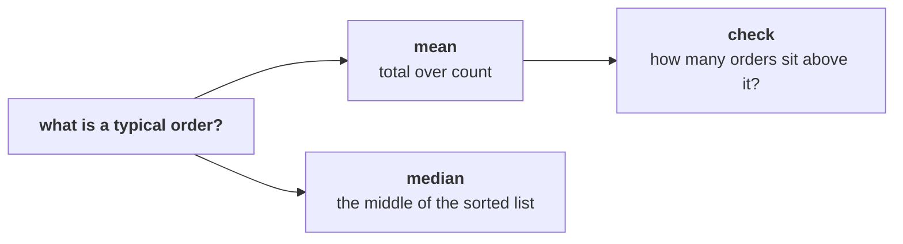

# Round 3 scenario set: what does a typical order look like?

> "No averages. One business customer can move an average."
> Anand Iyer, finance controller, Kalpa Retail

Seven items on the 30 orders from 1 July to 26 September, alone, in the room's turn of round 3.
Every item has one right answer. Decide first, then record the letter.

Post one line, seven letters in item order, no spaces:

```
Post exactly this shape: xxxxxxx
```



---

### Q1. Marketing's case for the Rs 12 crore values a new customer's first order at Rs 18,160, the mean of the 30 orders. What is wrong with that value?

a) Most orders sit far below it, so it describes almost no real order
b) Nothing, since the mean uses every order and the median ignores most
c) It should use delivered orders only, which would make it more honest
d) The mean is right and only needs rounding to Rs 18,000 for the board

### Q2. Anand says "no averages." Which single check tells you fastest whether one order is pulling the mean up?

a) Recompute the mean on the delivered orders only
b) Count the orders in each of the three channels
c) Count how many orders sit above the mean
d) Compare this quarter's mean with last year's mean

### Q3. You run the check from Q2 on the 30 orders. What does it report?

a) 15, about half the orders, as the mean splits the list in two
b) 29, since nearly every order sits above a mean this size
c) 0, since the mean always sits above every single order
d) 1, the one order that sits far above all the rest

### Q4. Sorted from smallest, the 15th and 16th of the 30 amounts are Rs 2,110 and Rs 2,300. What is the median order?

a) Rs 2,110, the lower of the two middle orders
b) Rs 2,205, the average of the two middle orders
c) Rs 2,300, the upper of the two middle orders
d) Rs 18,160, since the mean is the middle of the orders

### Q5. Five invented orders of Rs 1,900, Rs 2,100, Rs 2,200, Rs 2,400 and Rs 2,600 have a mean of Rs 2,240 and a median of Rs 2,200. One invented order of Rs 90,000 joins them. What happens?

a) Both move together to about Rs 16,870, since they use the same orders
b) The median jumps to Rs 90,000 and the mean stays near Rs 2,240
c) The mean jumps to about Rs 16,870 and the median moves to Rs 2,300
d) Neither moves much, since one order in six is a small share

### Q6. If a new customer's first order is worth about Rs 2,205 in place of Rs 18,160, what happens to the payback marketing promised on acquisition?

a) It needs about eight times as many orders to pay back
b) It pays back faster, since smaller orders are easier to win
c) Nothing, since payback is measured on customers and never on orders
d) It needs about twice as many orders, the gap between two medians

### Q7. Anand asks for the typical delivered order. Which number goes in the note?

a) Rs 2,205, the median of all 30 booked orders
b) Rs 24,800, the mean of the 21 delivered orders
c) Rs 2,100, the median of the 26 orders not cancelled
d) Rs 2,060, the median of the 21 delivered orders

---

## Hands-on

Open `notebooks/C2_W01_D01_03_typical_order_STUDENT.ipynb`. In section 3, type the sort into the
empty your-turn cell, read the top of the list, and write one line in your own words on what you
found. Then run section 4 and check your answers to Q4 and Q7 against the medians it prints.

**In the interview.** [S] Mean or median for order value, and why?
