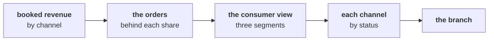

# Where does revenue come from, by customer type and channel, and does it change the branch?

> "Where does revenue come from, by customer type and channel? The store team says they carry the
> business. Should the growth plan be store-led?"
> Meera Raghavan, CEO, Kalpa Retail

**Who needs the answer.** Meera asked where revenue comes from, and anyone who drafts a channel plan
from her answer depends on it. A channel plan read off the wrong share puts the budget in the wrong
channel.

**The questions on the way.** Where does booked revenue come from by channel, and what should happen
before a share becomes a plan? What share does store hold once the view keeps the three consumer
segments? What does each channel keep once its rupees are split by status? Does the channel view
change the branch? How many customers does one segment hold?

You have twenty-five minutes, in pairs, on the same 30 orders. Work in
`notebooks/C2_W01_D01_ex2_second_case_STUDENT.ipynb`, which splits revenue by channel, by customer
type and by status. Argue each item with your partner before you record it. Items marked **Design**
ask for the best-fit approach, a sizing, the fact that would switch the choice, or the second route
that would confirm a number.

The items continue the afternoon's numbering from the escalated case, so this brief holds items 11
to 16.

Post one line, six letters in item order, no spaces:

```
Post exactly this shape: xxxxxx
```

---

## What did the morning find, and what does the file say by channel?

The chapters answered Meera on the booked reading of Kalpa Retail's 30 orders from 1 July to 26
September 2026: Rs 5,44,810 booked, 23 customers at 1.30 orders each, and frequency as the branch to
open first. The escalated case then rebuilt that answer on Anand's delivered reading.

Every order carries a channel, app, web or store, and a segment: Retail-Core, Retail-Plus, Student or
Business. Meera's growth plan concerns the three consumer segments, Retail-Core, Retail-Plus and
Student, so the consumer view keeps the orders whose segment is one of those three; it booked
Rs 64,810 this quarter. The segment is recorded on each order, so a customer who bought on two tiers
appears under both.

Booked revenue by channel, on all 30 orders:

| Channel | Orders | Booked revenue | Share of booked revenue |
|---|---|---|---|
| App | 10 | Rs 18,600 | 3.4 percent |
| Web | 10 | Rs 27,290 | 5.0 percent |
| Store | 10 | Rs 4,98,920 | 91.6 percent |
| All channels | 30 | Rs 5,44,810 | 100 percent |

The pairs' route through the file:



---

## What should happen before a channel's share becomes a plan?

Sales operations and finance teams read channel shares in every monthly review before any budget
follows them.

### Q11. The channel slide says: "Store brings 91.6 percent of revenue, so the growth plan should be store-led." What should the team do before anyone plans around that share?

a) Take store's share on delivered orders, since delivered is what stayed sold
b) Report store's share of orders instead, 10 of 30, since orders are fairer
c) Count the orders behind store's rupees, before any plan follows the share
d) Nothing more, since the channels' rupees add up to the booked total

---

## What share does store hold once the view keeps the three consumer segments?

Planning teams read every share against a stated base before anyone argues about which channel
leads.

### Q12. Design. Meera's growth plan concerns the three consumer segments, which book Rs 64,810 of the Rs 5,44,810. On which base should a channel plan read store's share, and what share does store hold there?

a) The consumer view: 29.2 percent, Rs 18,920 of Rs 64,810
b) All 30 orders: 91.6 percent, Rs 4,98,920 of Rs 5,44,810
c) The consumer view: 15.2 percent, Rs 9,870 of Rs 64,810
d) All 30 orders by count: 33.3 percent, 10 of the 30 orders

---

## What does each channel keep once its rupees are split by status?

Every e-commerce operating review splits each channel's rupees by what happened to the orders:
delivered, returned or cancelled.

### Q13. In the consumer view, web leads booked revenue with Rs 27,290. What does splitting web's rupees by status add?

a) Nothing, since web leads the consumer view on every reading of sales
b) Web's lead grows once its cancelled orders are taken out of it
c) Web kept everything it booked, so its lead holds on delivered orders too
d) More than half of web's booked rupees came back as returns, Rs 14,970

### Q14. In the consumer view, what does splitting store's booked rupees by status show?

a) Every rupee was delivered, so store is the cleanest channel in the view
b) Close to half never left the shelf, since those orders were cancelled
c) Close to half came back as returns after the orders were delivered
d) A small part was cancelled and a small part returned, under a tenth each

---

## Does the channel view change the branch, and how many customers does one segment hold?

A finding from a new cut of the data goes into the note only after the team checks whether it
changes the decision already on the table.

### Q15. Design. Three plans are on the table: store-led, on store's 91.6 percent of booked revenue; web-led, on web's lead in the consumer view; or frequency first, as the chapters found. Which does the evidence support, and what goes in the note?

a) Frequency first, with the leaks the status split found named in the note
b) Store-led, since store carries 91.6 percent of all booked revenue
c) Web-led, since web books the most of any channel in the consumer view
d) Frequency first, with the channel split left out of the note as a side issue

### Q16. The head of Retail-Plus asks how many of his customers bought in the quarter, and his segment's 10 orders sit in the file. Which answer holds?

a) 10, one for each Retail-Plus order placed in the quarter
b) 8, the distinct ids on its orders, one of whom also bought as Retail-Core
c) 23, since any customer in the file could have bought on the tier
d) 12, which is Rs 27,320 of Retail-Plus revenue over the typical order, Rs 2,205

---

## How do the notebook's picks go into your post?

Each of the notebook's seven TODO cells carries a lettered choice above its placeholder. Post your
seven picks as a second line, in TODO order, and run the notebook top to bottom: every check should
print PASS before you post.

**In the interview.** [D] One channel carries nine rupees in ten of revenue; does that change where
the growth plan invests?
