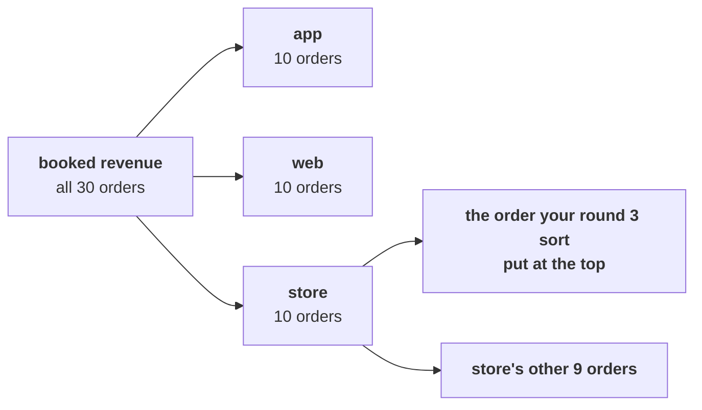

# The second case: does one channel change the recommendation?

> "Where does revenue come from, by customer type and channel? The store team says they carry the
> business. Should the growth plan be store-led?"
> Meera Raghavan, CEO, Kalpa Retail

Forty-five minutes, in pairs, on the same 30 orders. Work in
`notebooks/C2_W01_D01_ex2_second_case_STUDENT.ipynb`, which splits revenue by channel and by
customer type and then by status. Argue each item with your partner before you record it.

The items continue the afternoon's numbering from the escalated case, so this brief holds items 11
to 16.

Post one line, six letters in item order, no spaces:

```
Post exactly this shape: xxxxxx
```



---

### Q11. The channel slide says "Store brings 91.6 percent of revenue, so the growth plan should be store-led." What is the first thing wrong with it?

a) The share should be taken on delivered orders, which lifts it higher still
b) Store's share is really 33 percent, since it holds 10 of the 30 orders
c) One order carries most of store's share, so it says little about store
d) Nothing, since the rupees add up and store is the largest channel

### Q12. Recomputed on the 29 orders other than the one your round 3 sort put at the top, which total Rs 64,810, what share does store hold?

a) 29 percent, Rs 18,920 of Rs 64,810
b) 92 percent, the same share as before
c) 15 percent, Rs 9,870 of Rs 64,810
d) 31 percent, 9 of the 29 orders

### Q13. On those 29 orders web leads booked revenue with Rs 27,290. What does splitting web by status add?

a) Nothing, since web is the largest of these channels on every definition
b) Web's lead grows once the cancelled orders are taken out of it
c) Web delivered all 10 of its orders, so its lead is clean
d) Half of web's orders came back: 5 returned, Rs 14,970

### Q14. Which statement about store's 9 orders on the same base holds?

a) All 9 were delivered, so store is the cleanest of the channels
b) 4 of the 9 were cancelled, Rs 9,050, and 5 were delivered, Rs 9,870
c) 5 of the 9 were returned, Rs 14,970, the same leak as web shows
d) Only one order is left in store once the top of the sort is set aside, since the rest were cancelled

### Q15. Does the channel view change the branch Meera opens first?

a) No; frequency stays first, with web returns and store cancellations named
b) Yes; the plan should turn store-led, since store carries nine rupees in ten
c) Yes; web should get the Rs 12 crore, since it leads these 29 orders on revenue
d) No; and the channel view adds nothing worth putting in the note at all

### Q16. The head of Retail-Plus asks how many of his customers bought in the quarter. Which answer holds?

a) 10, one for each Retail-Plus order placed in the quarter
b) 8, the distinct ids on its orders, noting one also bought as Retail-Core
c) 23, since any customer in the file could have bought on the Retail-Plus tier
d) 12, which is Rs 27,320 divided by the typical order of Rs 2,205

---

## Hands-on

Each of the notebook's seven TODO cells carries a lettered choice above its placeholder. Post your
seven picks as a second line, in TODO order, and run the notebook top to bottom: every check should
print PASS before you post.

**In the interview.** [D] One channel carries nine rupees in ten of revenue; does that change where
the growth plan invests?
