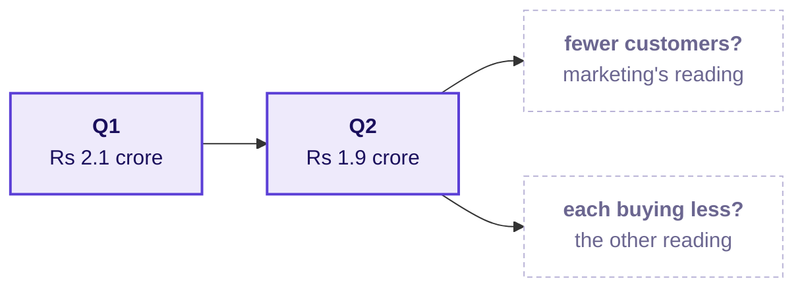

# What should you bring to Tuesday, when Meera asks which branch moved?

> "So revenue is customers, times how often they buy, times basket, times price. Now: which of those
> moved? Q2 was Rs 1.9 crore, Q1 was 2.1. Are we losing customers, or are the ones we have buying
> less? Marketing says more customers. Prove it or disprove it."
>
> Meera Raghavan, CEO, Kalpa Retail, replying to Monday's sentence

Week 1, read on Monday evening: about 15 minutes of reading and one check to run, so that Tuesday
starts on this question instead of catching up to it.

---

## What is Meera asking, and who else is waiting on the answer?

On Monday the data team told Meera that on 30 booked orders, 23 customers placed 1.30 orders each at a
typical order of Rs 2,205, that 7 came back and 9 bought too recently to judge, and that she should
open frequency before acquisition and hold marketing's Rs 12 crore until two quarters can be compared.
Her reply asks for exactly that comparison: revenue fell from Q1 to Q2, and she wants to know which
branch of Monday's revenue tree moved. On the same thread the head of Retail-Plus, Kalpa's paid
membership tier, forwards a member's complaint that the app's reorder feature has been broken for six
weeks, and asks whether his tier is the one slipping.

On Tuesday you present to both of them, name a cause as a hypothesis, and say what evidence would
prove it, and marketing will push back on whatever you name.

---

## Which words will Tuesday use that you may not know yet?

Write what you think each one means tonight, from memory, in the right-hand column. Tuesday's first
minutes assume you have tried, and a word you leave blank is the one to listen for in the room.

| Term | When Tuesday uses it | What you think it means tonight |
|---|---|---|
| Segment | Revenue is split by the type of customer, such as Retail-Plus members. | |
| Denominator | Every rate on the tree names what it divides by, as it did on Monday. | |
| Median and spread | One group of orders is described in two numbers. | |
| Function | The same numbers are needed for every group of customers. | |
| Hypothesis | A cause is named with the evidence that would settle it. | |

---

## Which one question should you think about tonight?

Revenue fell between two quarters, and on Monday's tree a fall can only come through the branches:
fewer customers, customers buying less often, or each order worth less. Marketing's Rs 12 crore
answers only the first of those.

With an orders file that covers both quarters, what would you count first to tell "fewer customers"
apart from "the same customers buying less"? Bring your answer as one sentence, since you will be
asked for it.

---

## What should you check in your Codespace tonight?

Nothing needs installing, and each check takes under five minutes.

1. Run Restart and Run All on each of Monday's notebooks, 00 to 06, and on your two case notebooks.
   Each should end on its checks passing, and if one does not, post its last error line in the cohort
   channel before the session.
2. Save your take-home notebook with its outputs showing, since a notebook that ran but was not saved
   looks empty to everyone else.

If you have ten minutes more, re-read chapter 3 of Monday's study notes, because Tuesday counts
customers by id again, this time in each quarter.

---

## Which line is worth carrying into Tuesday?

> One window shows the shape of revenue; only two windows show which branch moved.
