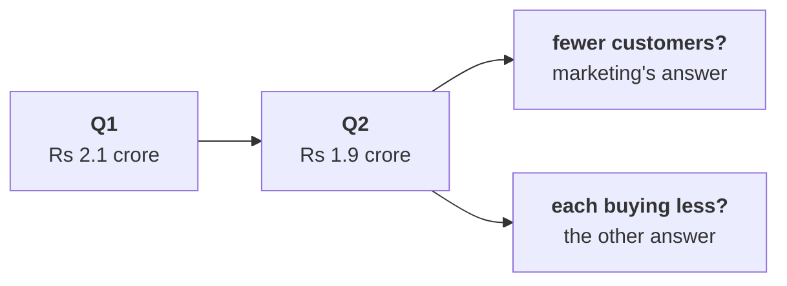

# Before tomorrow: which branch moved?

Ships tonight. Fifteen minutes of reading and one check to run. Tomorrow opens on Meera's reply to
today's numbers, and a room that has read this answers rather than catches up.

---

## What tomorrow is about

Today said what the branches are. Tomorrow Meera writes back:

> "So revenue is customers, times how often they buy, times basket, times price. Now: which of
> those moved? Q2 was Rs 1.9 crore, Q1 was 2.1. Are we losing customers, or are the ones we have
> buying less? Marketing says more customers. Prove it or disprove it."

The head of Retail-Plus, the paid-membership tier, forwards a member's complaint that the app's
reorder feature has been broken for six weeks, and asks whether the paid tier is the one slipping.

---

## The words you will hear tomorrow

Fill these in from memory tonight. Tomorrow's first ten minutes assume you can.

| Word | What you think it means, in your own words |
|---|---|
| Like-for-like | |
| Denominator | |
| Segment | |
| Decomposition | |
| Hypothesis | |

If you cannot fill one in, that is the one to listen for.

---

## One thing to think about before you arrive

Revenue fell between two quarters. At the top of today's tree only two things can have happened, and
they call for different responses:

1. **Fewer customers bought at all.** That is the branch marketing's Rs 12 crore is aimed at.
2. **The same customers bought less often, or spent less each time.** No amount of acquisition money
   fixes that.

Write one sentence tonight on how you would tell those two apart with an orders file that covers
both quarters. Bring the sentence; you will be asked for it.

---

## The check for tonight

Nothing to install. Two checks, both under five minutes.

1. Open your Codespace and run Restart and Run All on each of today's four notebooks. Each one ends
   on a green PASS line with 0 failed. If one does not, post its last error before the session
   rather than at the start of it.
2. Save your take-home notebook with its outputs showing. A notebook that ran but was not saved looks
   empty to everybody else.

---

## The line worth carrying in

> A rate without its denominator cannot be checked, and a comparison across two periods needs the
> same definition and the same kind of window on both sides before either number means anything.
