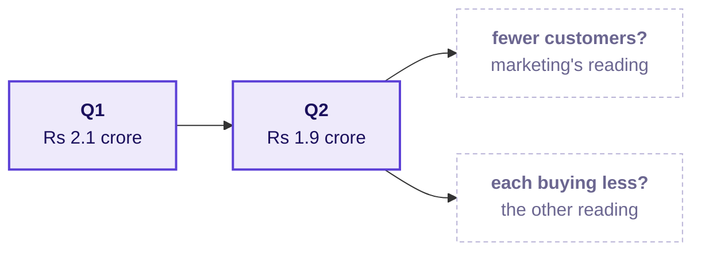

# Before Tuesday: which branch moved?

**Week 1, read on Monday evening.** About 15 minutes of reading and one check to run. Tuesday opens on Meera's reply to Monday's numbers, and a room that has read this starts on the question instead of catching up to it.

---

## Tuesday's message

Monday's tree said what revenue is made of. Meera has read the sentence you sent her, and she writes back:

> "So revenue is customers, times how often they buy, times basket, times price. Now: which of those moved? Q2 was Rs 1.9 crore, Q1 was 2.1. Are we losing customers, or are the ones we have buying less? Marketing says more customers. Prove it or disprove it."

On the same thread, the head of Retail-Plus, Kalpa's paid membership tier, forwards a member's complaint that the app's reorder feature has been broken for six weeks, and asks whether his tier is the one slipping.

On Tuesday you will present to both of them, name a cause as a hypothesis, and be asked what evidence would prove it. Marketing will push back.

---

## The words you will hear on Tuesday

Write what you think each one means tonight, from memory, in the right-hand column. Tuesday's first minutes assume you have tried.

| Term | Where you will meet it on Tuesday | What you think it means tonight |
|---|---|---|
| Like-with-like window | Before any two quarters are compared | |
| Denominator | Beside every rate on the tree, as on Monday | |
| Segment | When revenue is split by customer type | |
| Median and spread | When one group of orders is described in two numbers | |
| Function | When the same numbers are needed for every group | |

If one of the five stays blank, that is the word to listen for in the room.

---

## One thing to think about before you arrive

Revenue fell between two quarters. At the top of Monday's tree, the fall can only have come through the branches you drew: fewer customers, customers buying less often, or each order worth less. Marketing's Rs 12 crore answers only the first of those.

Think about one question tonight, and bring your answer as one sentence: with an orders file that covers both quarters, what would you count first to tell "fewer customers" apart from "the same customers buying less", and what would you have to check about the two quarters before either count means anything?

---

## The check for tonight

Nothing to install. Two checks, each under five minutes.

1. Open your Codespace and run Restart and Run All on Monday's three round notebooks and your case notebooks. Each should end on its checks passing; if one does not, post its last error line in the cohort channel before the session.
2. Save your take-home notebook with its outputs showing, since a notebook that ran but was not saved looks empty to everyone else.

If you have 15 minutes more, read the Brit Institute walkthrough of analyst case questions, the sales-drop case first: https://britinstitute.uk/blog/data-analyst-case-study-interview-questions (verified 29 Sep 2026). Read it for the order of the questions it asks, and leave the answers for Tuesday.

---

## The line worth carrying in

> One window shows the shape of revenue; only two windows show which branch moved.
