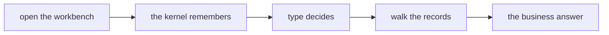
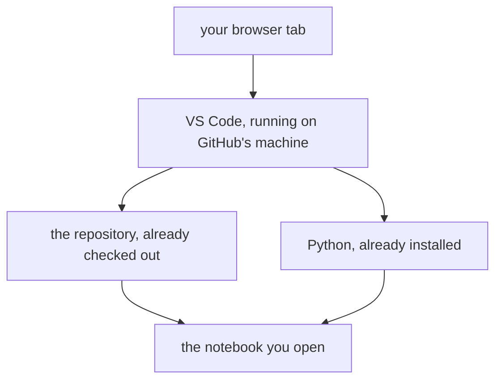
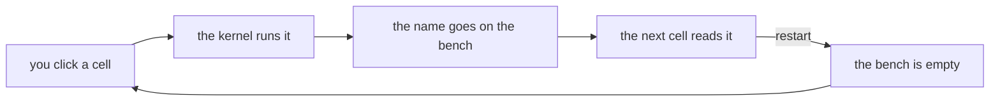
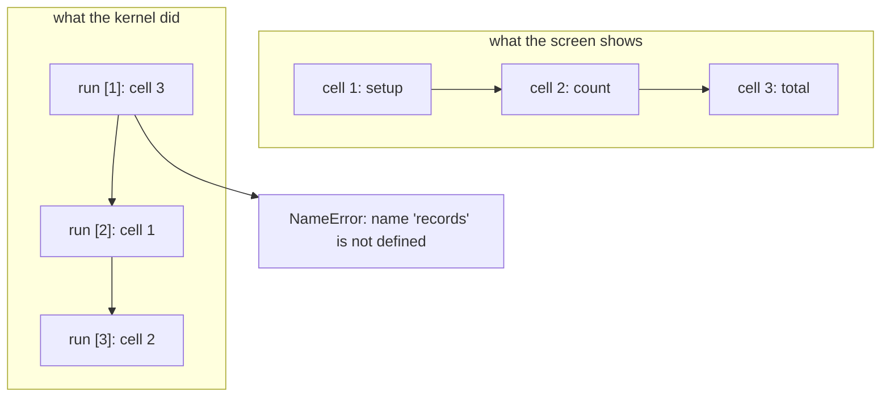
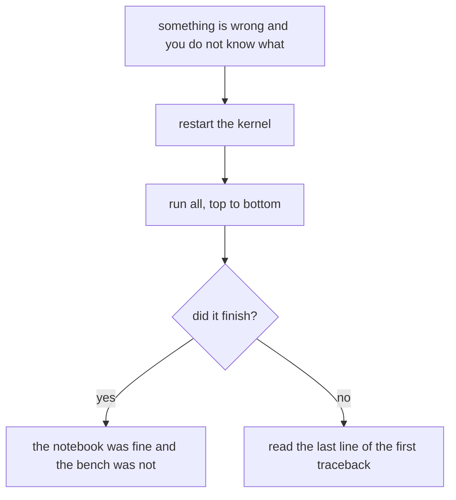
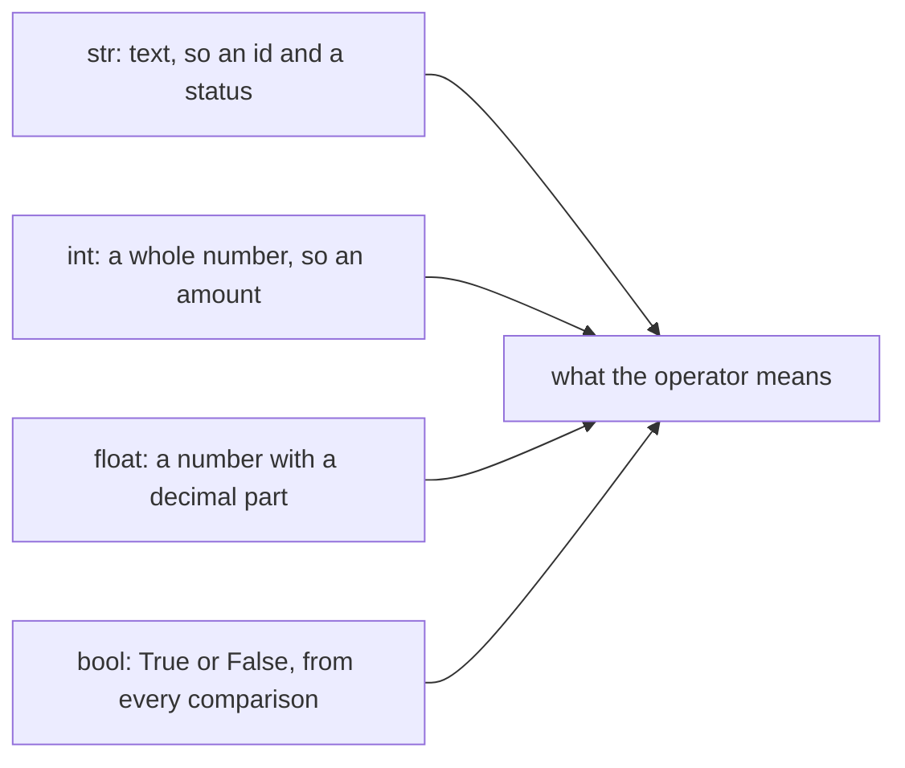
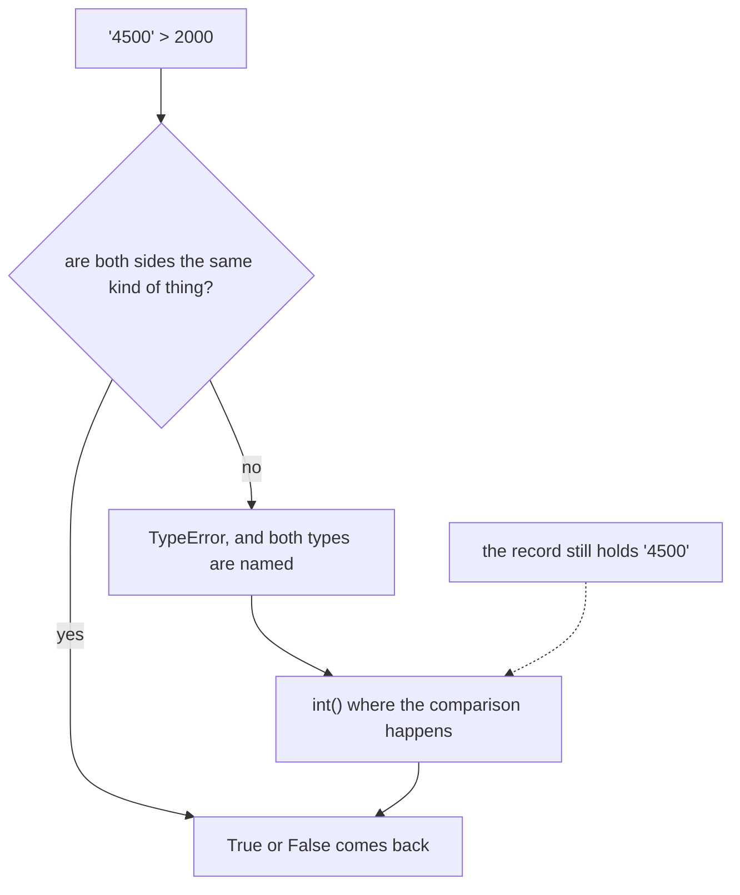
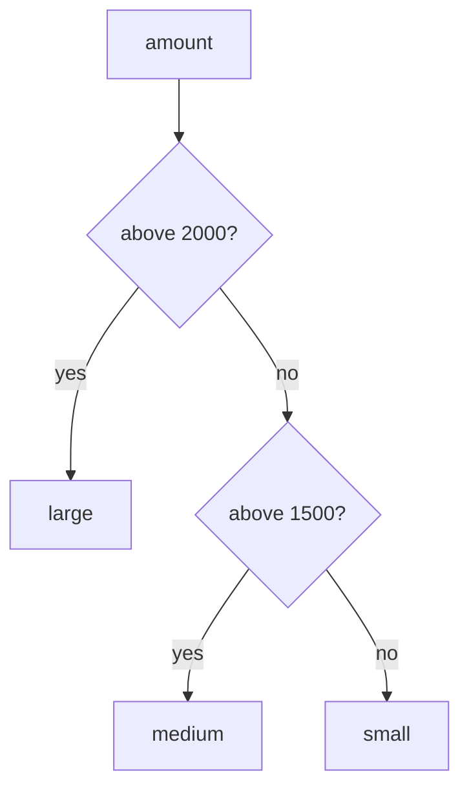
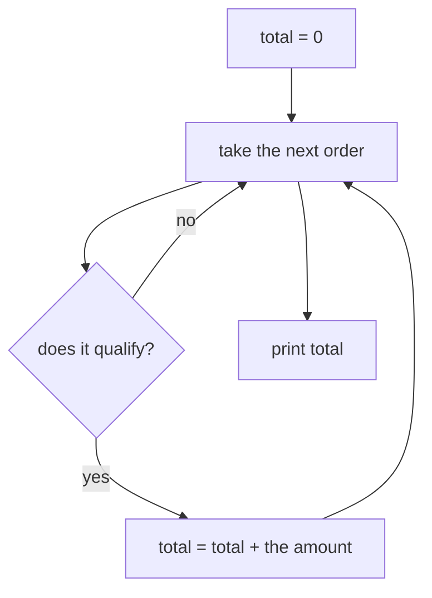
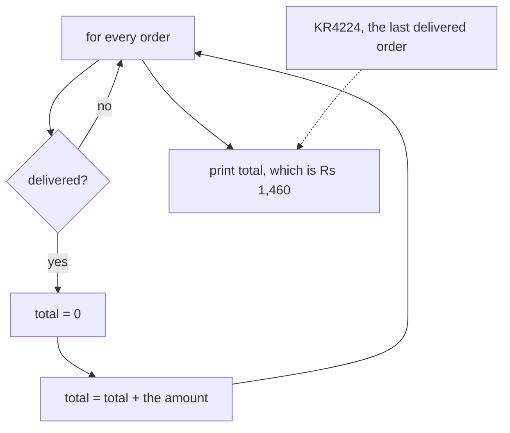

# Half one: the machine that remembers

Week 1, Day 1. Slide source. One idea per slide.

Position bar, repeated at every section boundary:
`[open the workbench] > [the kernel remembers] > [type decides] > [walk the records] > [the business answer]`

---

## S1. The machine that remembers
The notebook that opened the day is a machine that holds on to whatever you hand it.

For the next stretch you learn what it is holding, why it sometimes refuses you, and how to get it back when it forgets.

---

---

---

## S2. Where we are
`[open the workbench] > [the kernel remembers] > [type decides] > [walk the records] > [the business answer]`

Every order in this file is a Kalpa Retail order. The same thirty orders come back tomorrow as a file, and they come back again in Week 2 in pandas and in SQL.

---



---

---

## S3. The answer you just watched
The question was "Of these thirty Kalpa Retail orders, how much did we actually collect?"

The answer was 13 delivered orders, totalling Rs 25,720.

Nobody explained those records to you before the notebook ran, and that is the situation you will be hired into.

---

---

---

## S4. Where this is going
```
total = 0
for r in records:
    if r["status"] == "delivered":
        total = total + int(r["amount"])
```

Four lines produced that answer. You will have written this before the day ends.

---

---

---

## SECTION 1: OPEN THE WORKBENCH
`**[open the workbench]** > [the kernel remembers] > [type decides] > [walk the records] > [the business answer]`

---

---

---

## S5. What a Codespace is
A Codespace is a computer that GitHub runs for you and shows you inside a browser tab, with VS Code, Python and this repository already on it.

Nothing is installed on your laptop and nothing needs to be. The Codespace you open today is the environment for the whole programme.

---

---



---

## S6. The layout, part by part
The explorer down the left lists the files in the repository, and today's notebook is one of them.

The editor in the middle is where the notebook opens, one cell under another.

Each cell has a run button on its left, and the output of that cell appears directly under it.

The kernel indicator at the top right names the Python that is running your cells.

The terminal panel at the bottom is a shell on the same machine, and you have no reason to open it today.

---

---

---

## S7. Running a cell
A cell is a box you type Python into, and Shift and Enter runs it.

The output appears under the cell you ran, and it stays on screen until you run that cell again.

---

---

---

## S8. Step card, section 1
1. Open the Codespace from the repository and wait for the editor to finish loading.
2. Open the notebook from the explorer on the left.
3. Run a cell with Shift and Enter.
4. Read the output under the cell before you move on.

---

---

---

## SECTION 2: THE KERNEL REMEMBERS
`[open the workbench] > **[the kernel remembers]** > [type decides] > [walk the records] > [the business answer]`

---

---

---

## S9. The bench
The kernel is a workbench that keeps whatever you put on it for as long as it is running.

Running a cell is you putting something on the bench. Restarting the kernel sweeps the bench clean, and the file on disk is untouched by that.

This picture is the one we use for the rest of the day.

---



---

---

## S10. Cells run in the order you run them
The notebook is a stack of cells on a screen, and the kernel has no opinion at all about that stack.

The kernel sees the order you clicked run in. If you ran the third cell first, then the third cell ran first.

---



---

---

## S11. The execution counter is the truth
The number in square brackets to the left of a cell counts the runs the kernel has done.

```
[2]  records = [ ... ]
[3]  count = 0
[1]  for r in records:
```

The cell at the bottom of the screen ran first. Read the counters, never the positions.

---

---

---

## S11a. Applied to Kalpa: the counters on today's notebook
The setup cell that loads the thirty Kalpa Retail orders carries counter `[1]` on a clean kernel, and every later counter climbs from there without a gap.

A gap in that sequence means somebody ran a cell, edited it and ran something else, so the output you are reading came from code that no longer exists on the page.

Read the counters before you read the outputs, every time you open a notebook somebody else ran.

---

---

## S12. The break
```
NameError: name 'records' is not defined
```

You ran the counting cell before the setup cell, so the name `records` was never put on the bench and the kernel had nothing to hand your loop.

The error names the exact word it went looking for.

---

---

---

## S13. The recovery drill
Restart the kernel, then run all cells from the top. You are back where you were, in a few seconds.

The file on disk never changed. What you lost was the state on the bench, and the cells put that state straight back.

Do the drill now on purpose, because you will do it many times this week.

---

---



---

## S14. Step card, section 2
1. The kernel holds what you gave it until you restart it.
2. Run order is what the kernel sees, and screen order is what you see.
3. Read the execution counter first when an output surprises you.
4. Restart and run all is the recovery, and it costs you seconds.

---

---

---

## SECTION 3: TYPE DECIDES
`[open the workbench] > [the kernel remembers] > **[type decides]** > [walk the records] > [the business answer]`

---

---

---

## S15. Four types you meet today
`str` holds text, like the order id "KR4224" and the status "delivered".

`int` holds a whole number, like the amount 1460.

`float` holds a number with a decimal part, like 1460.5.

`bool` holds `True` or `False`, which is what every comparison hands back.

---

---



---

## S16. type() is the question you ask
```
type("4500")        <class 'str'>
type(4500)          <class 'int'>
type(4500.0)        <class 'float'>
type(4500 > 2000)   <class 'bool'>
```

When an operator behaves in a way you did not expect, ask the value what it is before you change any code.

---

---

---

## S17. Look at the record
```
{"order_id": "KR4200", "segment": "Retail-Core", "amount": "4500", "status": "returned", "order_date": "2026-08-03"}
{"order_id": "KR4201", "segment": "Retail-Plus", "amount": 2395, "status": "delivered", "order_date": "2026-08-03"}
```

One of those two amounts is wearing quotes. Read the two lines again and find it.

KR4200 stores its amount as the text "4500", and it is the largest amount in the file.

---

---

---

## S18. The break
```
amount = "4500"
amount > 2000
```

```
TypeError: '>' not supported between instances of 'str' and 'int'
```

Python was asked whether a piece of text is greater than a number. It stopped and named both types it was holding.

---



---

---

## S19. From the field
Mars Climate Orbiter, 1999. A value crossed a system boundary in the wrong unit, nothing validated it, and the mission, about USD 327 million, was lost.

Today's type discipline is the small version of that lesson.

---

---

---

## S20. Refusing beats guessing
A spreadsheet would place that text amount somewhere in the sort order and show you a number with no warning attached to it.

Python refuses the comparison and tells you which two types it was holding. You lose ten seconds and you keep the truth.

That is your answer when someone asks why the error was the good outcome.

---

---

---

## S20a. Question: is '10' > 9 True, or an error?
Take thirty seconds and commit to one of these four before the next slide.

a) `True`, since ten is larger than nine
b) `False`, since the quotes make it text and text sorts differently
c) A `TypeError`, because the two sides are different kinds of thing
d) It depends on the version of Python

---

---

## S20b. Answer: it raises, and refusing is safer
**The claim.** `'10' > 9` raises `TypeError: '>' not supported between instances of 'str' and 'int'`, and Python names both types while it refuses.

| Option | Why it does not hold |
|---|---|
| a) `True` | Reads the digits and ignores the quotes. Python has no rule that converts one side to match the other. |
| b) `False` | Would be the answer if both sides were text, since `'10' > '9'` really is `False`. One side is a number here. |
| d) It depends on the version | Python 2 compared across types and produced an order nobody could defend. Python 3 removed it on purpose. |

**The mental model.** A spreadsheet guesses and shows you a total. Python refuses and shows you both types. You lose ten seconds and keep the truth.

---

---

## S21. Comparison operators
```
2395 > 2000                   True
2395 >= 2395                  True
"delivered" == "delivered"    True
"delivered" != "returned"     True
```

Each of these hands back a `bool`, and the `if` statement reads that `bool` and nothing else.

---

---

---

## S22. if, elif and else
```
amount = 1460
if amount > 2000:
    band = "large"
elif amount > 1500:
    band = "medium"
else:
    band = "small"
```

Python tries the conditions from the top and stops at the first one that is `True`, so `band` holds "small" here.

---

---



---

## S23. The loop walks the stack
A dataset is a stack of cards, and the loop deals you one card at a time and calls it `r`.

```
for r in records:
    print(r["order_id"])
```

Thirty records means thirty turns through the indented lines. The way a field is fetched by its name gets its proper treatment in half two.

---

---

---

## S24. The count accumulator
```
count = 0
for r in records:
    if r["status"] == "delivered":
        count = count + 1

print(count)
```

```
13
```

The counter is set to zero once, above the loop, and each card that passes the condition adds one to it.

---



---

---

## S25. The sum accumulator
```
total = 0
for r in records:
    if r["status"] == "delivered":
        total = total + int(r["amount"])

print(total)
```

```
25720
```

The shape is the same and the amount goes in where the one was. That is 13 delivered orders totalling Rs 25,720, which is the number the notebook handed you at the start of the day.

---

---

---

## S25a. Applied to Kalpa: the delivered answer, in full
Thirteen of the thirty Kalpa Retail orders were delivered, and those thirteen come to Rs 25,720.

The thirty amounts together come to Rs 58,210, so more than half the money in the file sits in orders that were returned or cancelled.

That gap is the first thing a business person asks about, and your loop is what puts a number on it.

---

---

## S26. Find the mistake in this loop
```
for r in records:
    if r["status"] == "delivered":
        total = 0
        total = total + int(r["amount"])

print(total)
```

```
1460
```

This runs and it prints a number. Rs 1,460 is the amount of KR4224, the last delivered order in the file, and it is a total of nothing at all.

Which line is in the wrong place?

---



---

---

## S27. Step card, section 3
1. Ask `type()` when an operator surprises you.
2. Read both type names in a `TypeError` before you touch the code.
3. Set the accumulator to zero once, above the loop.
4. When a number looks wrong, go and find the record that explains it.

---

---

---

## S28. Crux, half one
Two errors landed on your screen this half, and each one told you exactly what it was holding.

The kernel remembers exactly what you gave it and nothing else, and the type of a value decides what every operator means.

---

---
