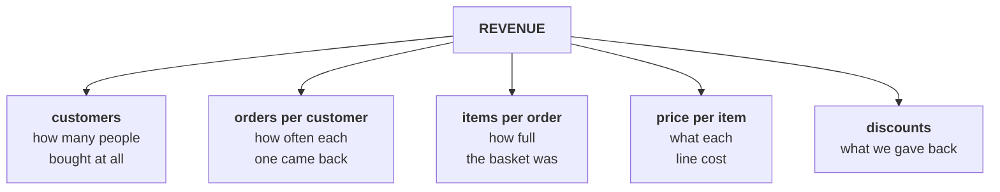
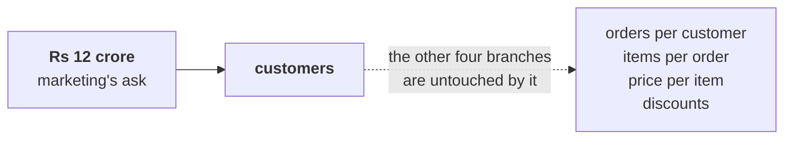
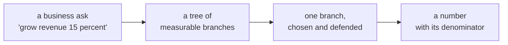
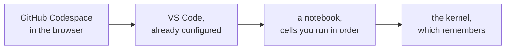

# Half one: the question before the budget

Week 1, Day 1. Slide source. One idea per slide.

Position bar, repeated at every section boundary:
`[the ask] > [the tree] > [the branches] > [the workbench]`

---

## SECTION A. The ask

---

## S1. Rs 12 crore, and one question first
Kalpa Retail sells consumer goods through its app, website and stores across India and South-East Asia. Revenue grew 4 percent last year against a plan of 15.

The board wants a growth plan within a month. Marketing has asked for Rs 12 crore to acquire new customers.

Meera Raghavan, the CEO, has not signed it.

---

## S2. What she said, in her words
> "Before I sign anything, I want to understand our own sales. What is 'sales' made of? Where does revenue come from, by customer type and channel? Is acquisition even the branch that is short?"

Three questions. The third one is the one that decides whether the Rs 12 crore moves.

---

## S3. And what the finance controller added
Anand Iyer, who owns the books:

> "No averages. One business customer can move an average."

Write that down. It comes back before the day ends, with a number attached.

---

## S4. Sales is not one number
| If "sales" means | Then the number is |
|---|---|
| Everything ordered | Gross bookings, including what was cancelled |
| Everything delivered | Delivered revenue, which Finance recognises |
| Everything collected | Cash in, which lags delivery |
| Everything after returns | Net revenue, which is lower again |

Four honest answers to one word. Pick one and say which, or the rest of the day argues about the wrong thing.

---

## SECTION B. The tree

---

## S5. Break it once
Revenue is what customers pay. So the first split is how many of them, and how much each.

```
REVENUE = CUSTOMERS × REVENUE PER CUSTOMER
```

Keep breaking the right-hand side until every piece is something a team owns.

---

## S6. Revenue, all the way down


Five branches. Growth comes from one of them at a time.

---

## S7. Five branches, five different bills
| Branch | Moves when | Costs |
|---|---|---|
| Customers | More people buy at all | Marketing spend, and it is the slowest |
| Orders per customer | The same people come back more | Retention work, a reorder feature, a tier |
| Items per order | Baskets get fuller | Merchandising, bundles |
| Price per item | Realised price rises | Pricing, and it risks volume |
| Discounts | Less is given back | Margin, directly |

---

## S8. Every branch is a metric with a denominator
| Branch | Numerator | Denominator |
|---|---|---|
| Customers | Distinct buyers | The window, which has to match on both sides |
| Orders per customer | Orders | Distinct customers, same window |
| Items per order | Items | Orders |
| Price per item | Revenue | Items |
| Discounts | Discount given | Gross revenue before discount |

A rate with no denominator is a rumour.

---

## SECTION C. The branches

---

## S9. Where the Rs 12 crore lands


Marketing has picked a branch. Nothing here says it is the wrong one.

---

## D10. Which branch would you open first?
Five branches, one week, and a CEO who wants a recommendation by Thursday.

**Question.** Which one do you check before the rest, and what makes it first rather than second?

---

## D11. Answer: the one the data can settle fastest
Two tests, in this order.

1. **Can this week's data answer it at all?** Customers and orders per customer need only orders and customer ids. Items per order needs a table nobody has given you yet.
2. **Would the answer change the decision?** If frequency moved and acquisition did not, Rs 12 crore is aimed at the wrong branch, and that is worth knowing before Thursday.

---

## S12. What a business ask becomes


This is the move interviews test. The tree is the answer to "how would you approach this".

---

## SECTION D. The workbench

---

## S13. Where the work happens


Nothing is installed on your machine. The environment is the same one for every learner for twenty weeks.

---

## S14. The kernel remembers, and that is the trap
A cell you ran ten minutes ago is still holding its result. A cell you edited but did not re-run is not.

So the notebook on your screen and the state in the kernel can disagree, and the screen is the one that lies.

---

## S15. Restart and run all
The recovery move, and the only one you need today.

```
Kernel > Restart Kernel and Run All Cells
```

If the notebook fails after that, the notebook is wrong. If it passes, the notebook is right and your screen was stale.

---

## S16. What you leave with today
| You will be able to | And say why |
|---|---|
| Draw the revenue tree for any retailer | Every branch is a metric with a denominator |
| Compute four of its leaves in Python | Records are dictionaries, datasets are lists of them |
| Choose median over mean on purpose | Because one order can carry most of the revenue |
| Name the branch Kalpa should open first | And say what it would cost to move |
