# The question before the budget

Week 1, Day 1. Half one.

Kicker: WEEK 1  ·  MONDAY  ·  MORNING
Quote: Before I sign anything, I want to understand our own sales. Is acquisition even the branch that is short?
Who: Meera Raghavan, CEO, Kalpa Retail, to the data and AI team at Kalpa's Global Capability Centre

```notes
LIVE, 1 minute. Read Meera's words aloud and leave them on screen while the room settles.
Say the week's arc once: today, what sales is made of; Tuesday, which branch moved; Wednesday,
whether the numbers can be trusted; Thursday, whether the gap is real and what goes to Meera;
Friday, the week rebuilt without an assistant. Do not repeat it later.
Transition: the next 19 minutes are the ask and the thinking, with no tool open.
```

---

## SECTION 1: The ask and the thinking
*A CEO wants to know what sales is made of before she signs Rs 12 crore, and the thinking is drawn before any tool opens.*

```notes
LIVE. This chapter runs 20 minutes including the cover. No laptop opens in it. The tree drawn
here stays on the whiteboard all day, and every number the rounds produce is written onto it.
```

---

## S1. Monday morning at Kalpa's GCC
*The ask reaches the data and AI team before anyone opens a tool.*

```cards
icon: building-2 | eyebrow: The group | title: Kalpa Group | body: Kalpa is headquartered in Singapore and runs five business units, of which Retail is the largest client of the GCC.
icon: store | eyebrow: The client | title: Kalpa Retail | body: Kalpa Retail sells consumer goods through its app, its website and its stores across India and South-East Asia.
icon: users | eyebrow: Your team | title: The GCC data and AI team | body: You join the newest team at Kalpa's Global Capability Centre in Bengaluru as trainee engineers. | tone: dark
```

```stats
value: 4% | label: revenue growth | note: last year, as reported
value: 15% | label: the plan | note: what the board expected
value: 1 month | label: to a growth plan | note: the board's deadline
value: Rs 12 cr | label: marketing's ask | note: to acquire new customers
```

```notes
LIVE, 3 minutes. Kalpa is fictional and the whole programme is set inside it; say that once.
The frame matters: the learners are the newest engineers in a Global Capability Centre, and a
CEO's question has landed on their board.
Ask: which of the four numbers worries Meera most? Most say the 4 percent. The sharper answer is
the Rs 12 crore, because it is about to be spent on an assumption nobody has checked.
Transition: here is what Meera actually wrote.
```

---

## S2. Meera asks three questions, and Finance adds one
*A client message carries several questions, and the first job is to separate them.*

**The client asks.** "Before I sign anything, I want to understand our own sales. What is 'sales' made of? Where does revenue come from, by customer type and channel? Is acquisition even the branch that is short?"

> "No averages. One business customer can move an average." Anand Iyer, finance controller, Kalpa Retail

| What she asked | What it becomes for the team | When it is answered |
|---|---|---|
| What is sales made of | Revenue is split into multiplied branches, each counted from the orders. | This morning, rounds 1 and 2 |
| By customer type and channel | Revenue is grouped by segment and by channel on the same file. | This afternoon, the second case |
| Is acquisition the short branch | The branch to open first is named, with the evidence for it. | This afternoon, proved on Tuesday |
| No averages | The typical order is stated in a way one order cannot move. | This morning, round 3 |

```notes
LIVE, 3 minutes. Read Meera's message, then Anand's line. The table is the separation of one
message into four questions, each with a day and a block. Anand's warning is a prediction about
the data; do not explain it now, because round 3 tests it on the file.
Watch for: learners who try to answer all four at once. Two belong to the morning.
Transition: to answer "what is sales made of", draw the tree.
```

---

## S3. Revenue is a tree, and every branch is a metric
*Revenue multiplies out of three branches, and each has a numerator and a denominator.*

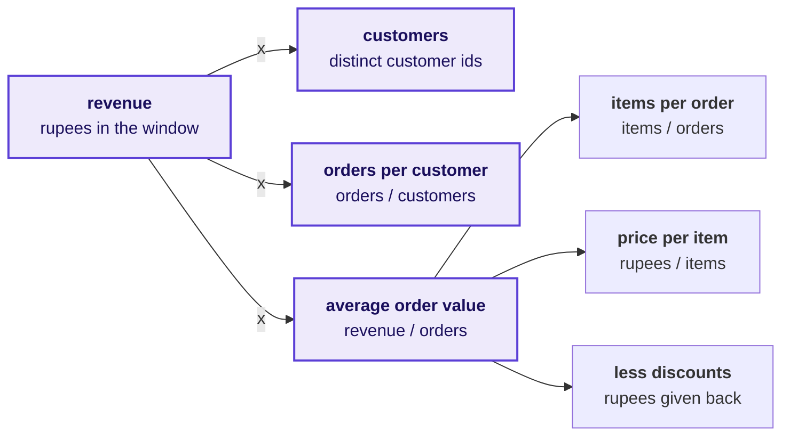
```mermaid
flowchart LR
    R["<b>revenue</b><br/>rupees in the window"] -->|"x"| C["<b>customers</b><br/>distinct customer ids"]
    R -->|"x"| F["<b>orders per customer</b><br/>orders / customers"]
    R -->|"x"| A["<b>average order value</b><br/>revenue / orders"]
    A --> I["<b>items per order</b><br/>items / orders"]
    A --> P["<b>price per item</b><br/>rupees / items"]
    A --> D["<b>less discounts</b><br/>rupees given back"]
    classDef known fill:#EEEAFB,stroke:#5B3FD6,color:#1A0F5C,stroke-width:2px
    class R,C,F,A known
```

**The rule.** Revenue equals customers, times orders per customer, times average order value, and average order value is items per order times price per item, less discounts.

```notes
LIVE, 5 minutes. Draw this on the whiteboard with the room, one branch at a time, left to right.
Check the multiplication with units: customers times orders per customer gives orders; orders
times revenue per order gives rupees. The denominators cancel, which is why the three branches
multiply back to revenue exactly.
Ask: what is the denominator of orders per customer? Customers, counted as distinct people. Hold
on to that; round 2 turns on it.
This is the profitability framework that case interviews test, drawn on day one.
Transition: every branch moves revenue, and each one sends a different bill.
```

---

## S4. Each branch sends a different bill to move it
*A 10 percent lift on any branch lifts revenue about 10 percent; what differs is the cost.*

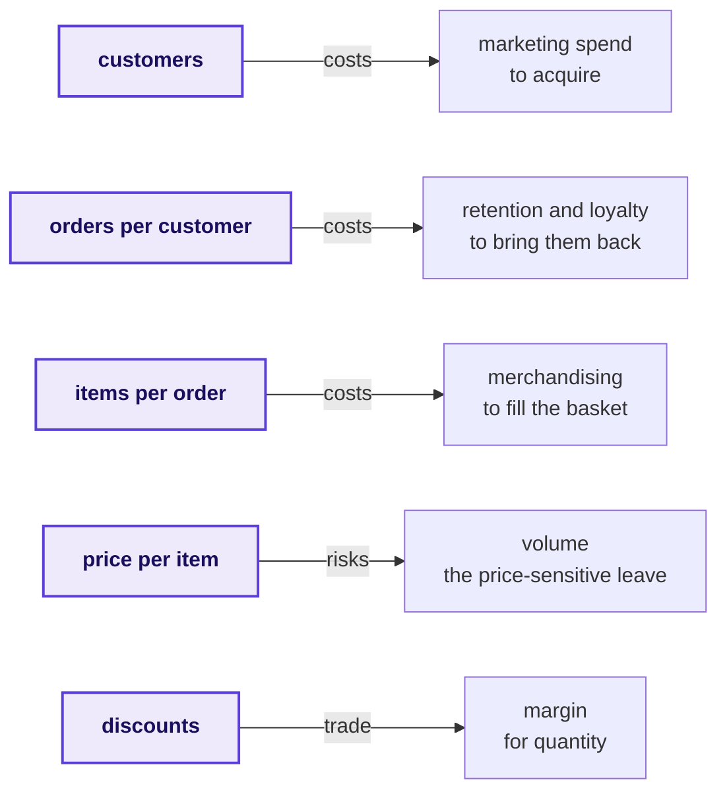
```mermaid
flowchart LR
    C["<b>customers</b>"] -->|"costs"| C1["marketing spend<br/>to acquire"]
    F["<b>orders per customer</b>"] -->|"costs"| F1["retention and loyalty<br/>to bring them back"]
    I["<b>items per order</b>"] -->|"costs"| I1["merchandising<br/>to fill the basket"]
    P["<b>price per item</b>"] -->|"risks"| P1["volume<br/>the price-sensitive leave"]
    D["<b>discounts</b>"] -->|"trade"| D1["margin<br/>for quantity"]
    classDef known fill:#EEEAFB,stroke:#5B3FD6,color:#1A0F5C,stroke-width:2px
    class C,F,I,P,D known
```

A CEO chooses between branches on cost and risk, which is why the analyst's first job is to say which branch is short before anyone chooses how to move it.

```notes
LIVE, 3 minutes. Read the five bills. The branches are not interchangeable even though their
arithmetic effect is the same size.
Ask: which of these bills does marketing's Rs 12 crore pay? The first one.
Transition: put the budget on the tree.
```

---

## S5. Marketing's Rs 12 crore is a bet on one branch
*The budget lands on customers before anyone has measured which branch is short.*

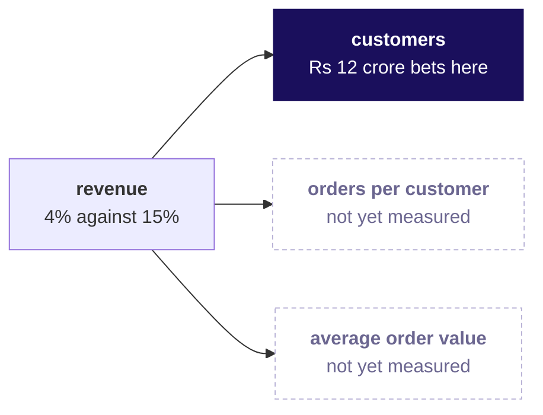
```mermaid
flowchart LR
    R["<b>revenue</b><br/>4% against 15%"] --> C["<b>customers</b><br/>Rs 12 crore bets here"]
    R --> F["<b>orders per customer</b><br/>not yet measured"]
    R --> A["<b>average order value</b><br/>not yet measured"]
    classDef bet fill:#1A0F5C,stroke:#1A0F5C,color:#FFFFFF
    classDef unknown fill:#FFFFFF,stroke:#B8B2D6,color:#6B6690,stroke-dasharray:4 3
    class C bet
    class F,A unknown
```

**In the interview.** [D] Marketing wants budget for acquisition; what would you check before agreeing it is the right branch, and how would you say no?

```notes
LIVE, 3 minutes. This is the day's tension. Marketing is not wrong to want customers; it may be
paying for the branch that is fine. The two dashed boxes are what the morning measures.
The interview question comes back in the afternoon drill; for now, ask the room what they would
want to see first. Listen for "how often customers come back" and write it on the board.
Transition: the morning climbs to that answer in five rungs.
```

---

## S6. The day climbs five rungs, each a harder question
*Each rung is answered with a number, and the number raises the next question.*

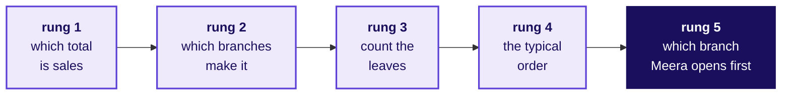
```mermaid
flowchart LR
    R1["<b>rung 1</b><br/>which total<br/>is sales"] --> R2["<b>rung 2</b><br/>which branches<br/>make it"]
    R2 --> R3["<b>rung 3</b><br/>count the<br/>leaves"]
    R3 --> R4["<b>rung 4</b><br/>the typical<br/>order"]
    R4 --> R5["<b>rung 5</b><br/>which branch<br/>Meera opens first"]
    classDef known fill:#EEEAFB,stroke:#5B3FD6,color:#1A0F5C,stroke-width:2px
    classDef bet fill:#1A0F5C,stroke:#1A0F5C,color:#FFFFFF
    class R1,R2,R3,R4 known
    class R5 bet
```

Rungs 1 and 2 are round 1, rung 3 is round 2, rung 4 is round 3, and rung 5 is this afternoon's escalated case.

```notes
LIVE, 2 minutes. Point at each rung once. Each round ends with a number written on the tree, and
each round has a wrong number that looks right. Tell the room that the wrong numbers are the
point: an analyst is paid to catch them before a CEO acts on them.
Transition: round 1, what "sales" means.
```

---

## SECTION 2: Round 1, what sales is
*Thirty orders add up to more than one honest total, and a number without its definition misleads.*

```notes
LIVE. Round 1 runs 50 minutes: the question and its picture (5), the demonstration (15), the
trap (10), the harder variant (15) and Kavya's review (5).
```

---

## S7. Round 1 asks which total is "sales"
*One quarter's extract, three statuses, and a CEO who wants one number.*

**The client asks.** "What is 'sales' made of?"

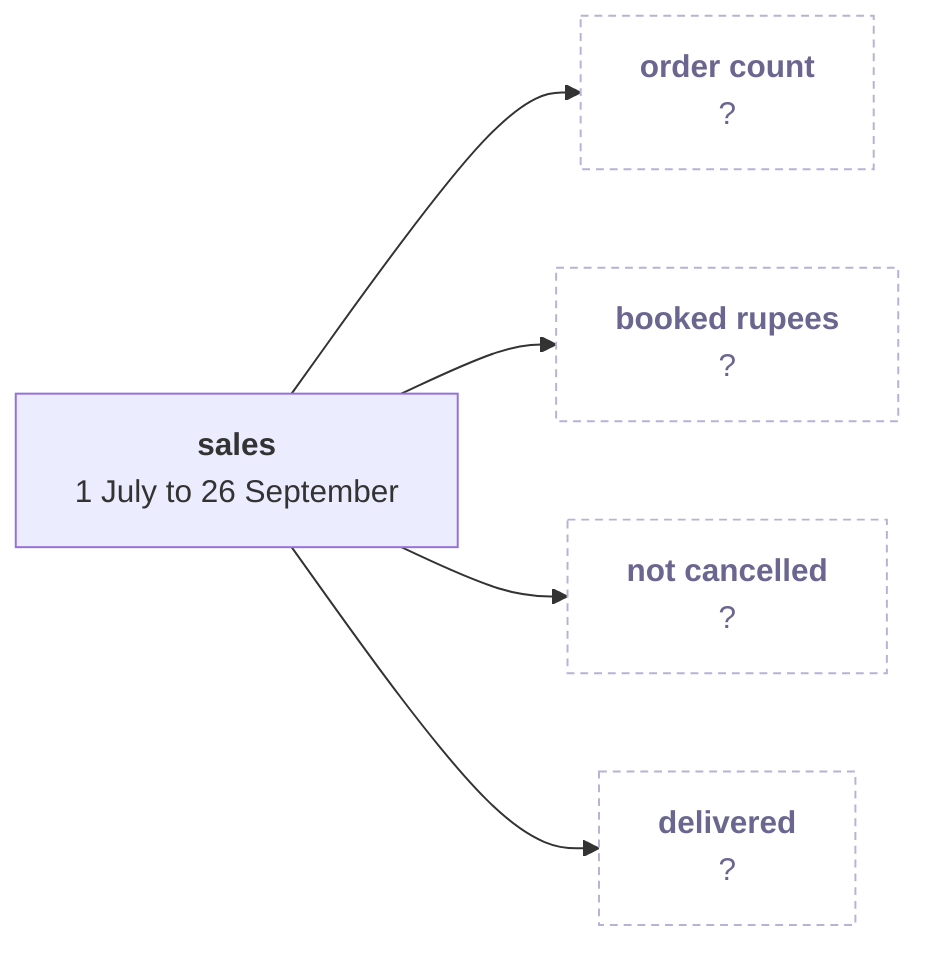
```mermaid
flowchart LR
    S["<b>sales</b><br/>1 July to 26 September"] --> N["<b>order count</b><br/>?"]
    S --> B["<b>booked rupees</b><br/>?"]
    S --> C["<b>not cancelled</b><br/>?"]
    S --> D["<b>delivered</b><br/>?"]
    classDef unknown fill:#FFFFFF,stroke:#B8B2D6,color:#6B6690,stroke-dasharray:4 3
    class N,B,C,D unknown
```

The file holds 30 orders from the app, the website and the stores, 10 from each, and every order carries a status of delivered, returned or cancelled.

```notes
LIVE, 2 minutes. Ask the room to name what "sales" could mean before the next slide. Collect
answers on the board. Most rooms name booked revenue first; somebody usually says "what we
actually delivered". Both are right answers to different questions.
Transition: here is how the readings relate.
```

---

## S8. Each reading of sales removes one status
*Booked counts everything, and each honest step down removes what never became a sale.*

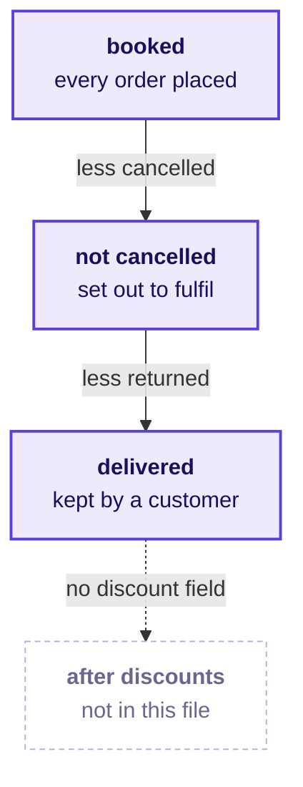
```mermaid
flowchart TB
    B["<b>booked</b><br/>every order placed"] -->|"less cancelled"| N["<b>not cancelled</b><br/>set out to fulfil"]
    N -->|"less returned"| D["<b>delivered</b><br/>kept by a customer"]
    D -.->|"no discount field"| X["<b>after discounts</b><br/>not in this file"]
    classDef known fill:#EEEAFB,stroke:#5B3FD6,color:#1A0F5C,stroke-width:2px
    classDef unknown fill:#FFFFFF,stroke:#B8B2D6,color:#6B6690,stroke-dasharray:4 3
    class B,N,D known
    class X unknown
```

Each reading answers a different question, and the note to Meera names which one it uses before it states a number.

```notes
LIVE, 3 minutes. Draw this chain on the board under the tree. The dashed box is as useful as the
others: an engineer who can say what the data cannot answer is worth more than one who guesses.
Transition: open the Codespace and count.
```

---

## S9. One order is a dictionary of named fields
*The file is a list of 30 dictionaries, and a question asks for a field by its name.*

```python
{"order_id": "KR-01001", "customer_id": "C-0101", "segment": "Retail-Core",
 "channel": "app", "order_date": "2026-07-21", "amount": 2300, "status": "delivered"}
```

| Key | Value | The question it answers |
|---|---|---|
| customer_id | C-0101 | This field says who bought, which is how customers are counted. |
| channel | app | This field says where they bought, which the second case groups by. |
| amount | 2300 | This field says for how much, which is how revenue is summed. |
| status | delivered | This field says whether the order stayed sold. |

```notes
LIVE, 5 minutes. The first two minutes open the Codespace from Week 0 and run the setup cell of
the round 1 notebook; the support TA circulates. A kernel run out of order is met when it
happens: restart and Run All, two minutes, and move on.
Then show ORDERS[0] on the projector. Ask which key answers "who bought". Some learners say
order_id; it counts orders, and customer_id counts people.
Transition: loop over all 30 and count by status.
```

---

## S10. A loop with an if counts orders by status
*One pass over the list, one counter per status, and the three counts add back to 30.*

```python
delivered = returned = cancelled = 0
for order in ORDERS:
    if order["status"] == "delivered":
        delivered += 1
    elif order["status"] == "returned":
        returned += 1
    else:
        cancelled += 1
```

```stats
value: 21 | label: delivered | note: reached a customer and stayed
value: 5 | label: returned | note: sent back after delivery
value: 4 | label: cancelled | note: never left the shelf
```

```notes
LIVE, 5 minutes. Type it live. Name the three moves of an accumulator: start before the loop,
update inside it, read after it. Check aloud that 21 plus 5 plus 4 is 30.
Watch for: a counter started inside the loop, which resets every order.
Transition: the same loop with a running rupee total gives the four readings.
```

---

## S11. The four readings give three rupee totals
*Booked, not cancelled and delivered differ by Rs 24,020 across 9 orders.*

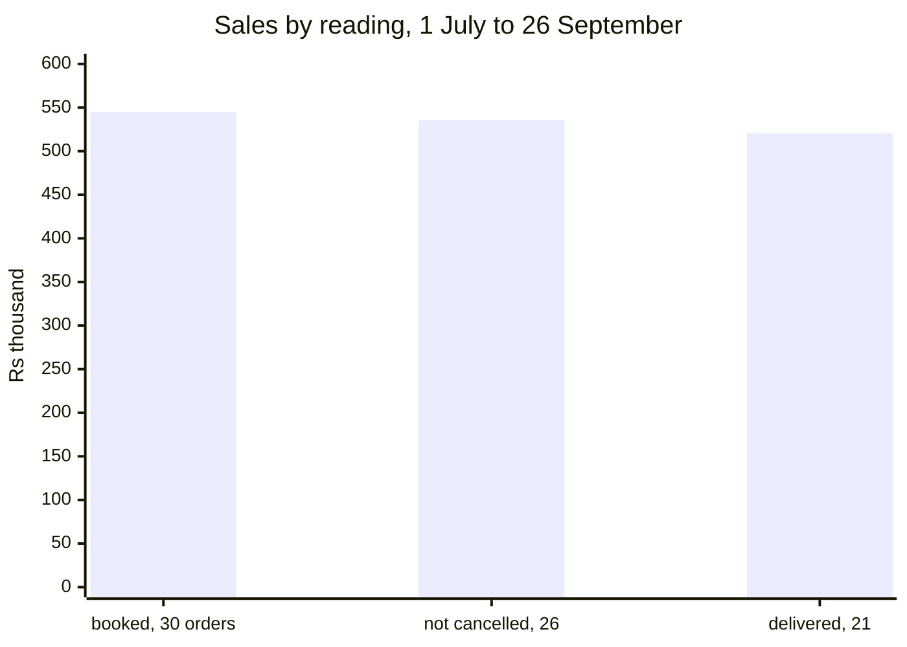
```mermaid
xychart-beta
    title "Sales by reading, 1 July to 26 September"
    x-axis ["booked, 30 orders", "not cancelled, 26", "delivered, 21"]
    y-axis "Rs thousand" 0 --> 600
    bar [544.81, 535.76, 520.79]
```

Booked is Rs 5,44,810 on 30 orders, not cancelled is Rs 5,35,760 on 26 and delivered is Rs 5,20,790 on 21.

```notes
LIVE, 5 minutes. Run the trainer's cell for the three totals; it converts each amount to a
number as it adds, and round 2 shows why that conversion is there. Read the three totals aloud
with their order counts, which is the fourth reading.
Ask: which of these would you put in front of Meera? Take two answers and leave them open.
Transition: here is the one a hurried analyst sends.
```

---

## S12. Wrong answer: sales of Rs 5,44,810 from all 30
*The biggest number, sent without a definition, is the one that reaches the CEO first.*

**The plausible wrong answer.** "Sales for the quarter were Rs 5,44,810 on 30 orders."

```stats
value: Rs 5,44,810 | label: reported as sales | note: every order the file holds
value: 30 | label: orders counted | note: 4 of them were cancelled
value: 10 | label: store orders | note: the growth baseline takes all of them
```

The number is correct arithmetic, and the growth plan built on it would count demand that never arrived as a baseline to beat.

```notes
LIVE, 4 minutes. Present it as a hurried analyst would, confidently. Ask the room what is wrong
with it before the next slide. Someone usually says "it includes cancelled orders". Ask what
decision it would mislead: the store channel looks busier than it was.
Transition: the check that catches it.
```

---

## S13. Count by status before summing, per channel
*All 4 cancelled orders are store orders, so store's count is overstated by 4 in 10.*

| Channel | Orders | Delivered | Returned | Cancelled |
|---|---|---|---|---|
| app | 10 | 10 | 0 | 0 |
| web | 10 | 5 | 5 | 0 |
| store | 10 | 6 | 0 | 4 |

**Why it is wrong.** A cancelled order never became a sale, and because every cancellation sits in one channel, the error lands on store and on nobody else.

```notes
LIVE, 3 minutes. The check is the count by status before any sum: 21 delivered, 5 returned, 4
cancelled, and then the same count per channel. Point at the store row. Point at the web row too
and say nothing yet; the second case this afternoon comes back to it.
Transition: the fix is one sentence long.
```

---

## S14. The fix is the definition written beside the number
*Every reading is correct once it says what it includes.*

| Reading | Orders | Total | What the sentence to Meera says |
|---|---|---|---|
| Booked | 30 | Rs 5,44,810 | Every order placed in the window, including 4 cancelled. |
| Not cancelled | 26 | Rs 5,35,760 | Orders we set out to fulfil, with Rs 9,050 on 4 orders taken out. |
| Delivered | 21 | Rs 5,20,790 | Orders that reached a customer and were not sent back. |

**The rule.** Name the definition before the number: booked, not cancelled, or delivered.

```notes
LIVE, 3 minutes. Read the rule aloud; it is crux line 1 and comes back on the cheat sheet word for
word. For the growth plan, the honest baseline is not cancelled or delivered, stated as such.
Transition: the harder variant, run by the room.
```

---

## S15. Question: place five initiatives and price a discount
*A discount, a new store, a loyalty card, a price rise and an app redesign, each on one branch.*

```cards
icon: percent | eyebrow: Initiative 1 | title: A 15 percent discount | body: The discount runs on everything for a month.
icon: store | eyebrow: Initiative 2 | title: A new store | body: The store opens in a city where the app already sells.
icon: badge-check | eyebrow: Initiative 3 | title: A loyalty card | body: The card earns points on every order.
icon: trending-up | eyebrow: Initiative 4 | title: A price rise | body: Prices rise five percent on the top sellers.
icon: smartphone | eyebrow: Initiative 5 | title: An app redesign | body: The app gets a new checkout and home screen.
```

**Question.** In pairs, ten minutes: place each initiative on the branch it moves and write what moving it costs. Then the discount: it lifts quantity 10 percent at 15 percent off, so did revenue a) rise 10 percent, b) fall 5 percent, c) fall 6.5 percent, or d) stay flat?

```notes
LIVE, 10 minutes. Pairs work on paper against the tree on the board; the round 1 notebook's last
level has the same task for those who finish early. Walk the room.
Listen for the app redesign: pairs who place it without asking what it changes are the pairs to
visit. Collect two placements for it on the board before the answer.
For the discount, most pairs pick a or b. Do not correct yet.
Transition: the answers.
```

---

## S16. Answer: four place cleanly, and the discount loses
*The redesign depends on the behaviour it changes, and the discount multiplies to 0.935.*

| Initiative | Branch it moves | What moving it costs |
|---|---|---|
| A 15 percent discount | Discounts, hoping for more items | Margin is traded for quantity. |
| A new store | Customers | Rent is paid, and it may only move app buyers. |
| A loyalty card | Orders per customer | Points are paid to people who may have returned anyway. |
| A price rise | Price per item | The price-sensitive buyers leave first. |
| An app redesign | Customers, frequency or basket | The build is paid before the behaviour is named. |

**The rule.** The discount is c: 0.85 times 1.10 is 0.935, so revenue falls 6.5 percent, because branches multiply.

```notes
LIVE, 5 minutes. The redesign is the teaching row: an initiative is placed by the behaviour it
changes. A shorter checkout lifts conversion, so customers; a reorder button lifts frequency.
Work the discount on the board: price times 0.85, quantity times 1.10, revenue times 0.935.
Adding the percentages gives minus 5, which is option b and is wrong for the same reason two 10
percent lifts are not 20 percent; that returns this afternoon.
Transition: Kavya's review of round 1.
```

---

## S17. Round 1 puts one honest number on the tree
*The root now carries a total with its definition, and the three branches are still empty.*

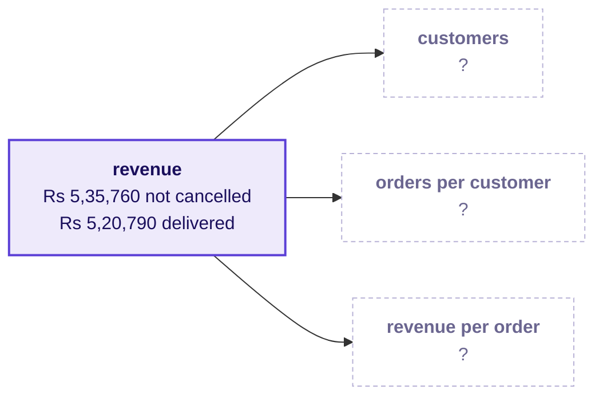
```mermaid
flowchart LR
    R["<b>revenue</b><br/>Rs 5,35,760 not cancelled<br/>Rs 5,20,790 delivered"] --> C["<b>customers</b><br/>?"]
    R --> F["<b>orders per customer</b><br/>?"]
    R --> A["<b>revenue per order</b><br/>?"]
    classDef known fill:#EEEAFB,stroke:#5B3FD6,color:#1A0F5C,stroke-width:2px
    classDef unknown fill:#FFFFFF,stroke:#B8B2D6,color:#6B6690,stroke-dasharray:4 3
    class R known
    class C,F,A unknown
```

**Kavya's review.** "You gave me a number and told me what it counts. Now tell me what it is made of: how many customers, how often they buy and what one order is worth."

```notes
LIVE, 3 minutes. Kavya Nair is the team's senior analyst; her review is what a senior checks
before work leaves the team, and she closes every round. Write the two totals on the root of the
board tree.
Transition: one interview question from this round.
```

---

## S18. The interview asks which sales you give a CEO
*A definition question separates a report writer from an analyst.*

```stats
value: Rs 5,44,810 | label: booked | note: 30 orders
value: Rs 5,35,760 | label: not cancelled | note: 26 orders
value: Rs 5,20,790 | label: delivered | note: 21 orders
```

**In the interview.** [F] What counts as "sales": booked, net of cancellations, or delivered, and which do you give a CEO?

```notes
LIVE, 2 minutes. Ask one learner to answer aloud in under a minute. Listen for three moves: name
the readings, say what each answers, and choose one for the decision at hand while stating the
others. The full answer is in the study notes and the day sheet.
The row's anchor [F], turning "grow revenue 15 percent" into questions data can answer, is
drilled this afternoon.
Transition: round 2, count the leaves.
```

---

## SECTION 3: Round 2, count the leaves
*Customers, how often they buy and what one order is worth, counted from 30 rows.*

```notes
LIVE. Round 2 runs 50 minutes: the question and its picture (5), the demonstration with the
TypeError met in two minutes (15), the trap (10), the harder variant (15) and Kavya's review (5).
```

---

## S19. Round 2 counts the three branches from the rows
*Customers, orders per customer and revenue per order are three counts and two divisions.*

**The client asks.** "Is acquisition even the branch that is short?"

```stats
value: 30 | label: orders in the file | note: 1 July to 26 September
value: Rs 5,44,810 | label: booked | note: the root, with its definition
value: ? | label: customers | note: the branch marketing wants to buy
```

The acquisition case rests on the customers branch, so the count of customers is the first leaf to get right.

```notes
LIVE, 2 minutes. Ask: if nobody ever came back, what would orders per customer be? Exactly 1.
If it is exactly 1, acquisition really is the only branch. Keep that thought for the trap.
Transition: what a row is, and what a customer is.
```

---

## S20. A row is an order, and a customer can own many
*Customers are counted by their id, and several rows can point at the same id.*

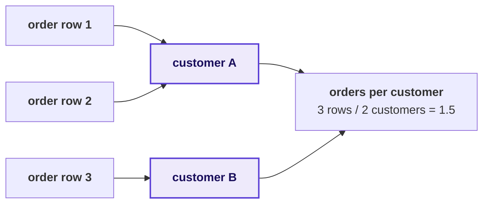
```mermaid
flowchart LR
    O1["<b>order row 1</b>"] --> P1["<b>customer A</b>"]
    O2["<b>order row 2</b>"] --> P1
    O3["<b>order row 3</b>"] --> P2["<b>customer B</b>"]
    P1 --> F["<b>orders per customer</b><br/>3 rows / 2 customers = 1.5"]
    P2 --> F
    classDef known fill:#EEEAFB,stroke:#5B3FD6,color:#1A0F5C,stroke-width:2px
    class P1,P2 known
```

The rows count orders, the distinct ids count customers, and orders per customer is the first over the second.

```notes
LIVE, 3 minutes. Draw this on the board with letters, never with real ids. Ask the room to say
what three rows over three customers would mean, and what three rows over two would mean.
Transition: to the notebook, orders and revenue in one loop.
```

---

## S21. Orders and revenue are counted in one loop
*Two accumulators start at zero, and each order adds one to the count and its amount to the total.*

```python
orders = 0
revenue = 0
for order in ORDERS:
    orders += 1
    revenue += order["amount"]
print(orders, revenue)
```

The loop is the accumulator from round 1 with a second running total beside the first.

```notes
LIVE, 4 minutes. Every learner types and runs this in the round 2 notebook. Ask for a prediction
first: 30 and Rs 5,44,810. Let them run it. It stops part way.
Transition: two minutes on what stopped it.
```

---

## S22. A TypeError stops the sum: read the last line
*One amount is stored as text, and int() is today's fix.*

```text
TypeError: unsupported operand type(s) for +=: 'int' and 'str'
```

```python
revenue += int(order["amount"])     # today's fix
print(order)                        # the record the loop stopped on
```

**What breaks.** The running total is a number and one amount arrived as text, so Python will not add them; print the loop variable to find which record it was.

```notes
LIVE, 2 minutes, no more. Read the last line of the trace bottom up: the kind of error, the
operation, the two types. Every learner runs print(order) on their own screen and finds the
record themselves; do not read it out. Apply int() and rerun: 30 orders, Rs 5,44,810.
Say once that int() is a patch for today and Wednesday asks the question of the whole file.
Transition: revenue per order, from the two totals.
```

---

## S23. Revenue per order is Rs 18,160 on booked orders
*The third branch is revenue divided by orders, with both from the same loop.*

```stats
value: 30 | label: orders | note: the rows
value: Rs 5,44,810 | label: booked revenue | note: once int() is applied
value: Rs 18,160 | label: revenue per order | note: 5,44,810 over 30
```

Revenue per order is the branch the identity needs, and round 3 asks whether it describes a typical order.

```notes
LIVE, 4 minutes. Divide on the projector. Write Rs 18,160 on the board tree in pencil, with a
question mark beside it; Anand's warning is about exactly this number.
Transition: the last leaf, customers.
```

---

## S24. The customer ids come out of the rows as a list
*Collecting one id per row gives a list as long as the file.*

```python
ids = []
for order in ORDERS:
    ids.append(order["customer_id"])
print(len(ids))                     # 30
```

A list keeps every id in the order the rows arrive, repeats included.

```notes
LIVE, 5 minutes. Type it live and run it. Ask what len(ids) counts. The honest answer is "ids
collected", and the tempting answer is "customers". Do not settle it; the next slide does it the
hurried way.
Transition: the number that would go to Meera.
```

---

## S25. Wrong answer: 30 customers, so nobody comes back
*Customers counted as rows make orders per customer exactly 1.00.*

**The plausible wrong answer.** "30 customers placed 30 orders, so orders per customer is 1.00 and nobody comes back."

```stats
value: 30 | label: customers, counted as rows | note: len(ids)
value: 1.00 | label: orders per customer | note: 30 / 30
value: Rs 12 cr | label: the budget it supports | note: acquisition looks like the only branch
```

If nobody comes back, frequency is dead and acquisition is the only branch left, which is the case marketing made.

```notes
LIVE, 4 minutes. Say it confidently, then ask what decision it supports. The room sees that this
one wrong count turns into a yes to Rs 12 crore. That is why it is a trap and why it is worth
ten minutes.
Transition: the check.
```

---

## S26. A set counts distinct ids: 23 customers, not 30
*Comparing the length of the rows with the length of the set exposes the repeats.*

```python
print(len(ORDERS))                  # 30 rows
print(len(set(ids)))                # 23 distinct customers
```

```stats
value: 30 | label: rows | note: one per order
value: 23 | label: distinct customer ids | note: len(set(ids))
value: 7 | label: rows that repeat an id | note: 30 minus 23
```

**Why it is wrong.** A row is an order, and a set keeps each id once, so 7 of the 30 rows belong to customers already counted.

```notes
LIVE, 3 minutes. The check is len(rows) against len(set(ids)). A set drops repeats, which is
the one thing a list will not do. Ask: does 7 repeated rows mean 7 repeat customers? Here, yes,
because each of them bought exactly twice; the dictionary of counts on the next slides proves it.
Transition: the fix and what it changes.
```

---

## S27. Fix: 23 customers bought 1.30 times each
*Seven customers came back, so frequency is a live branch and acquisition is not the only one.*

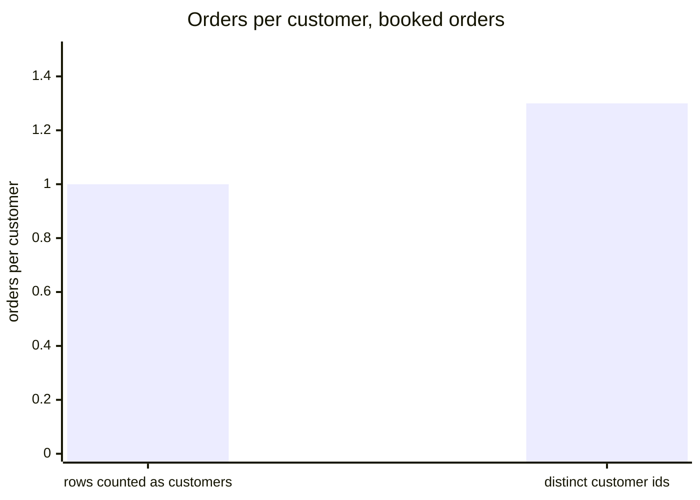
```mermaid
xychart-beta
    title "Orders per customer, booked orders"
    x-axis ["rows counted as customers", "distinct customer ids"]
    y-axis "orders per customer" 0 --> 1.5
    bar [1.00, 1.30]
```

Customers are 23, orders per customer is 1.30 and 7 customers bought twice, which is 30 percent of customers; 23 x 1.30 x Rs 18,160 multiplies back to Rs 5,44,810.

```notes
LIVE, 3 minutes. Run the identity on the projector: 23 times 30 over 23 times 5,44,810 over 30
is 5,44,810. The tree closes. The decision changed: nobody-comes-back is false, and frequency is
a branch worth opening.
Crux line 2: count customers by their id, never by the rows.
Transition: the harder variant.
```

---

## D28. A dictionary of counts finds the repeat customers
*Each id becomes a key, and its value counts the orders that id placed.*

```python
counts = {}
for order in ORDERS:
    cid = order["customer_id"]
    counts[cid] = counts.get(cid, 0) + 1
repeaters = [cid for cid in counts if counts[cid] > 1]
print(len(counts), len(repeaters))  # 23 7
```

A dictionary answers "how many for each id" in one pass, which a set cannot, since a set only knows whether an id was seen.

```notes
SELF-STUDY, 0 live minutes. For the confident half, and the round 2 notebook's level 3 runs it.
The list comprehension on the fifth line is optional; a loop with an if does the same.
```

---

## S29. Question: count the leaves on delivered orders
*The same three branches on the 21 orders that reached a customer and stayed.*

| Leaf | Booked | Delivered |
|---|---|---|
| Orders | 30 | ? |
| Customers | 23 | ? |
| Orders per customer | 1.30 | ? |
| Revenue | Rs 5,44,810 | ? |

**Question.** In pairs, ten minutes: rerun the leaves with an if on status. Before you run, predict orders per customer on delivered orders: a) 1.30, since the definition changes nothing; b) 1.11; c) 1.00; d) 1.45.

```notes
LIVE, 10 minutes. The room runs it in the round 2 notebook's last level. Most predict a, because
"the same customers" feels right. Watch for pairs who filter the orders and forget to rebuild
the set from the filtered rows.
Transition: the answers, for all three definitions.
```

---

## S30. Answer: every leaf moves with the definition
*Delivered orders give 21 orders, 19 customers and 1.11 orders each.*

| Leaf | Booked | Not cancelled | Delivered |
|---|---|---|---|
| Orders | 30 | 26 | 21 |
| Customers | 23 | 21 | 19 |
| Orders per customer | 1.30 | 1.24 | 1.11 |
| Revenue | Rs 5,44,810 | Rs 5,35,760 | Rs 5,20,790 |

The answer is b: frequency falls from 1.30 to 1.11 because cancelled and returned orders fall away, and a leaf reported without its definition can be off by that much.

```notes
LIVE, 5 minutes. Point out that customers fell less than orders: some customers only had a
cancelled or returned order. The definition choice from round 1 reaches every leaf.
Transition: Kavya's review.
```

---

## S31. Round 2 fills two branches and doubts the third
*Customers and frequency are counted, and revenue per order carries Anand's warning.*

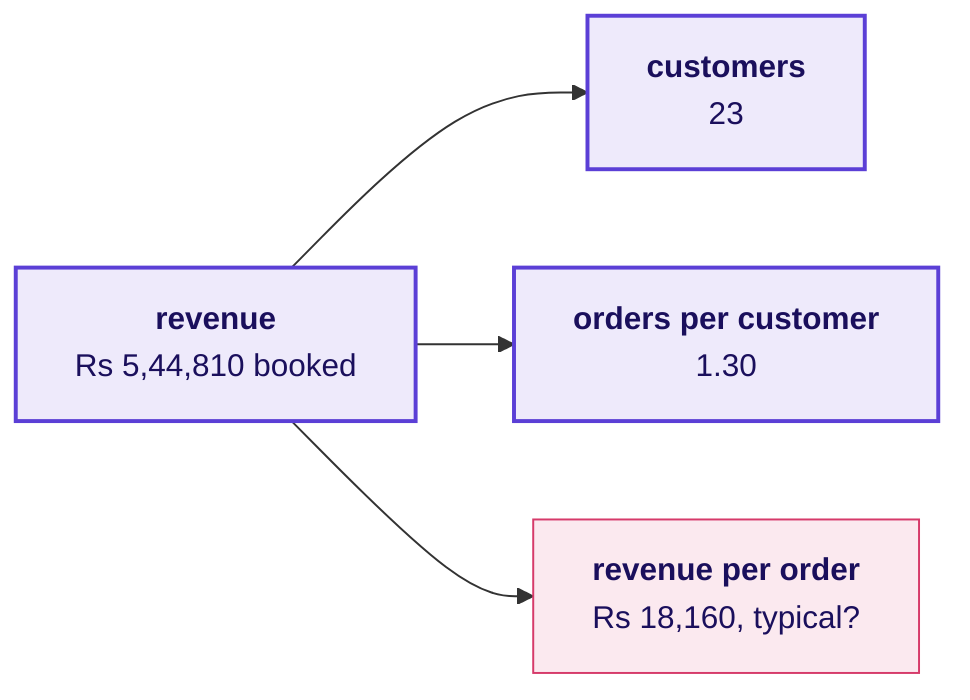
```mermaid
flowchart LR
    R["<b>revenue</b><br/>Rs 5,44,810 booked"] --> C["<b>customers</b><br/>23"]
    R --> F["<b>orders per customer</b><br/>1.30"]
    R --> A["<b>revenue per order</b><br/>Rs 18,160, typical?"]
    classDef known fill:#EEEAFB,stroke:#5B3FD6,color:#1A0F5C,stroke-width:2px
    classDef bad fill:#FBE9EF,stroke:#D63A6A,color:#1A0F5C
    class R,C,F known
    class A bad
```

**Kavya's review.** "Twenty-three customers, and seven came back. That is a frequency story as much as an acquisition one. Before you tell Meera what an order is worth, check whether Rs 18,160 is an order anyone actually placed."

```notes
LIVE, 3 minutes. Update the board tree with 23 and 1.30. Circle Rs 18,160 in red.
Transition: the interview question for this round.
```

---

## S32. The interview tests the count before the claim
*Two questions, one on the business check and one on the Python behind it.*

```stats
value: 30 | label: rows | note: orders
value: 23 | label: customers | note: distinct ids
value: 1.30 | label: orders per customer | note: 30 over 23
```

**In the interview.** [F] Your extract shows 30 orders and 30 customers; what do you check before saying nobody comes back? [SV] How do you count distinct customers in Python, and why does a set give the answer a list does not?

```notes
LIVE, 2 minutes. Take one answer to the first question aloud. The row's anchor [SV], a list
against a dictionary, belongs here too: a list keeps every row, a dictionary looks up by key, and
a set keeps each key once. The full answers are in the study notes.
Transition: the break, then round 3.
```

---

## SECTION 4: Round 3, the typical order
*One order can move an average a long way, and the honest typical order is the one it cannot move.*

```notes
LIVE. The 10-minute break runs before this chapter; restart here with Anand's line on screen.
Round 3 runs 50 minutes: the question and its picture (5), the demonstration (15), the trap and
the reveal (10), the harder variant (15) and Kavya's review (5).
```

---

## S33. Round 3 asks what a typical order looks like
*Marketing will value a new customer's first order at whatever number this round sends.*

**The client asks.** "What does a typical order look like, and which 'typical' is honest?"

> "No averages. One business customer can move an average." Anand Iyer, finance controller, Kalpa Retail

```stats
value: Rs 18,160 | label: revenue per order | note: round 2's third branch
value: 30 | label: orders behind it | note: booked, 1 July to 26 September
```

```notes
LIVE, 2 minutes. Read Anand's line again. Ask: is Rs 18,160 what a Kalpa customer spends on one
order? Take a show of hands for yes, no and cannot tell. Most say yes or cannot tell.
Transition: two ways to say "typical".
```

---

## S34. Two typicals: the mean and the median
*The mean spends every rupee, and the median reads the middle of the sorted list.*

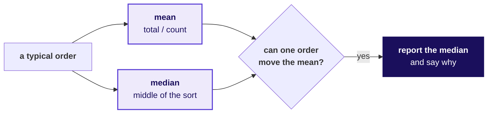
```mermaid
flowchart LR
    T["<b>a typical order</b>"] --> M["<b>mean</b><br/>total / count"]
    T --> D["<b>median</b><br/>middle of the sort"]
    M --> Q{"<b>can one order<br/>move the mean?</b>"}
    D --> Q
    Q -->|"yes"| R["<b>report the median</b><br/>and say why"]
    classDef known fill:#EEEAFB,stroke:#5B3FD6,color:#1A0F5C,stroke-width:2px
    classDef bet fill:#1A0F5C,stroke:#1A0F5C,color:#FFFFFF
    class M,D known
    class R bet
```

Every rupee pulls on the mean, while one order cannot drag the median far, so the choice between them is made by looking at the data.

```notes
LIVE, 3 minutes. Draw the fork on the board. The decision question in the diamond is the whole
round: the choice between mean and median is made by looking at the data, never by habit.
Transition: the mean on Kalpa's orders.
```

---

## S35. The mean of 30 booked orders is Rs 18,160
*Sum the amounts, divide by the count, and the mean equals revenue per order.*

```python
total = 0
for order in ORDERS:
    total += int(order["amount"])
mean = total / len(ORDERS)
print(mean)                         # 18160.333...
```

```stats
value: Rs 5,44,810 | label: total | note: 30 booked orders
value: Rs 18,160 | label: mean order | note: rounded to the rupee
```

```notes
LIVE, 5 minutes. Run it in the round 3 notebook. Point out that the mean is round 2's revenue
per order under another name; the same number, reached twice.
Transition: how an average can be moved, on orders we invent.
```

---

## S36. The median is the middle of the sorted amounts
*Five invented orders show the mechanism before the real file is sorted.*

| Invented order | Amount |
|---|---|
| 1 | Rs 1,900 |
| 2 | Rs 2,100 |
| 3 | Rs 2,300 |
| 4 | Rs 2,400 |
| 5 | Rs 2,600 |

Sorted, the middle of five is the third, so the median is Rs 2,300 and the mean is Rs 2,260; with an even count, the median is the average of the two middle amounts.

```notes
LIVE, 5 minutes. Say clearly that these five orders are invented for the mechanism. Sort them on
the board and point at the middle. Mean and median sit Rs 40 apart, so either would do here.
Transition: add one large invented order.
```

---

## S37. One invented Rs 90,000 order drags the mean up
*The mean jumps from Rs 2,260 to Rs 16,883, and the median moves by Rs 50.*

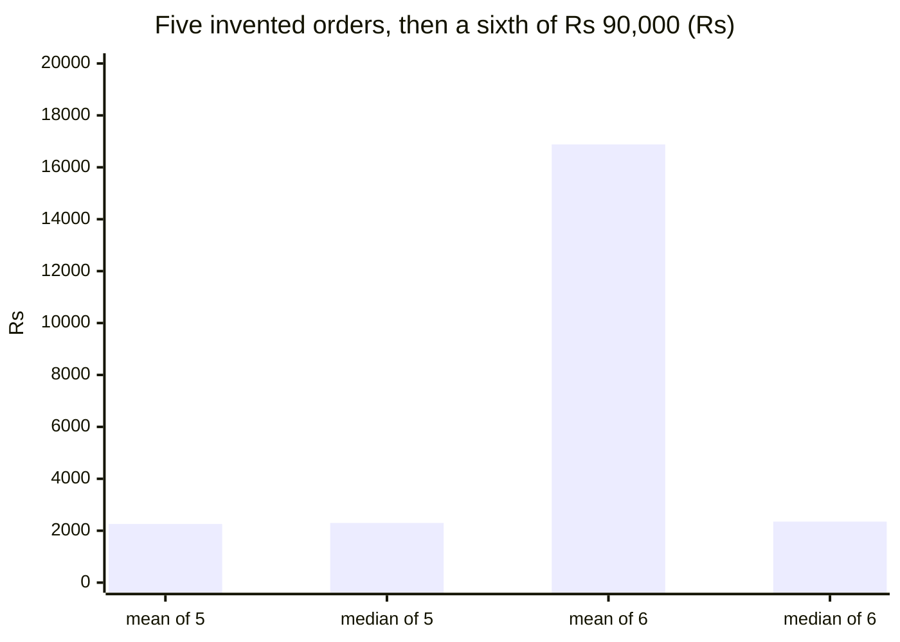
```mermaid
xychart-beta
    title "Five invented orders, then a sixth of Rs 90,000 (Rs)"
    x-axis ["mean of 5", "median of 5", "mean of 6", "median of 6"]
    y-axis "Rs" 0 --> 20000
    bar [2260, 2300, 16883, 2350]
```

Five of the six invented orders now sit below the mean, which describes none of them.

```notes
LIVE, 5 minutes. Still invented. Mean of six: 1,01,300 over 6 is 16,883. Median of six: the
average of 2,300 and 2,400 is 2,350. Ask: which of the two now describes what a customer
usually spends? The median.
Transition: back to Kalpa, and the number marketing would like.
```

---

## S38. Wrong answer: a typical order is Rs 18,160
*The mean, sold as typical, prices every new customer's first order.*

**The plausible wrong answer.** "Our typical order is Rs 18,160, so each new customer's first order is worth Rs 18,160."

```stats
value: Rs 18,160 | label: sold as the typical order | note: the mean of 30 booked orders
value: Rs 12 cr | label: the case it props up | note: payback per new customer looks fast
```

```notes
LIVE, 3 minutes. Say it the way a marketing deck would. Ask what decision it drives: the
payback on acquisition, since a bigger first order pays back the Rs 12 crore faster.
Transition: the check.
```

---

## S39. Count the orders above the mean: 1 of 30
*A typical value with 29 of 30 orders below it describes almost none of them.*

```python
above = 0
for order in ORDERS:
    if int(order["amount"]) > mean:
        above += 1
print(above)                        # 1
```

**Why it is wrong.** 29 of the 30 orders sit below Rs 18,160, so the mean is being dragged by the orders at the top of the list.

```notes
LIVE, 2 minutes. The first check is a count, and it needs no sorting. One order above the mean
out of thirty is the signature from the invented example.
Transition: sort and read the top yourself.
```

---

## S40. Sort the amounts in your empty cell, and read the top
*The sort is yours to run, and what sits at the top is yours to name.*

```python
amounts = []
for order in ORDERS:
    amounts.append(int(order["amount"]))
amounts.sort()
print(amounts[-3:])                 # run this in the empty cell
```

The last three amounts in the sorted list are the largest orders in the file; compare them with the rest before reading the median.

```notes
LIVE, 2 minutes. Every learner types these lines into the empty your-turn cell of the round 3
notebook and runs it. Do not read the output aloud or point at a row; the discovery is theirs.
Ask two learners to say in words what they see at the top, without the number. Then ask whose
warning it confirms: Anand's.
Transition: the median, and what it does to the acquisition case.
```

---

## S41. Fix: the typical order is the median, Rs 2,205
*A first order is worth about Rs 2,205, so payback needs about eight times as many orders.*

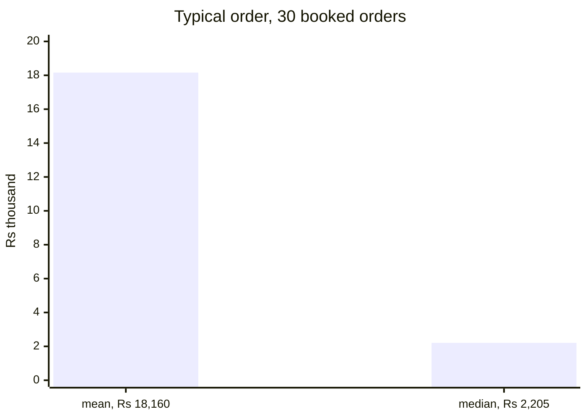
```mermaid
xychart-beta
    title "Typical order, 30 booked orders"
    x-axis ["mean, Rs 18,160", "median, Rs 2,205"]
    y-axis "Rs thousand" 0 --> 20
    bar [18.16, 2.205]
```

**The rule.** Report the median when one order can move the mean, and say why: a first order is worth about Rs 2,205, so acquisition pays back on about eight times as many orders.

```notes
LIVE, 3 minutes. The reveal. Run statistics.median or the middle of the sorted list: Rs 2,205,
the average of the 15th and 16th amounts. Say the consequence in business terms: marketing's
payback arithmetic was about eight times too kind. This is crux line 3.
Transition: the harder variant.
```

---

## S42. Question: which median prices a first order?
*The median moves with the definition of sales, just as the leaves did.*

```stats
value: Rs 2,205 | label: median, booked | note: 30 orders
value: ? | label: median, delivered | note: 21 orders
```

**Question.** In pairs, ten minutes: compute the median on delivered orders and choose the one for the acquisition case: a) booked, because it has more orders; b) delivered, because it is what a customer kept; c) the mean, because Finance adds rupees; d) whichever is higher.

```notes
LIVE, 10 minutes. The room runs it in the round 3 notebook's last level. Watch for pairs who
filter the orders and then take the median of the unfiltered list.
Most pairs pick a. Ask them what a returned order is worth to Kalpa after it comes back.
Transition: the answer.
```

---

## S43. Answer: price the first order on delivered, Rs 2,060
*The delivered median is lower again, and that is the honest price of a first order.*

| Typical order | Orders behind it | Value |
|---|---|---|
| Mean, booked | 30 | Rs 18,160 |
| Median, booked | 30 | Rs 2,205 |
| Median, delivered | 21 | Rs 2,060 |

The answer is b: a first order that is returned or cancelled pays nothing back, so the acquisition case prices a new customer on the delivered median of Rs 2,060 and says so.

```notes
LIVE, 5 minutes. Put the three values on the board tree beside revenue per order. Point out that
booked and delivered medians differ by Rs 145, while mean and median differ by about Rs 16,000:
the definition matters, and the choice of typical matters far more.
Transition: Kavya's review of the morning.
```

---

## S44. The morning's tree points at frequency first
*Twenty-three customers, 1.30 orders each and a typical order of Rs 2,205.*

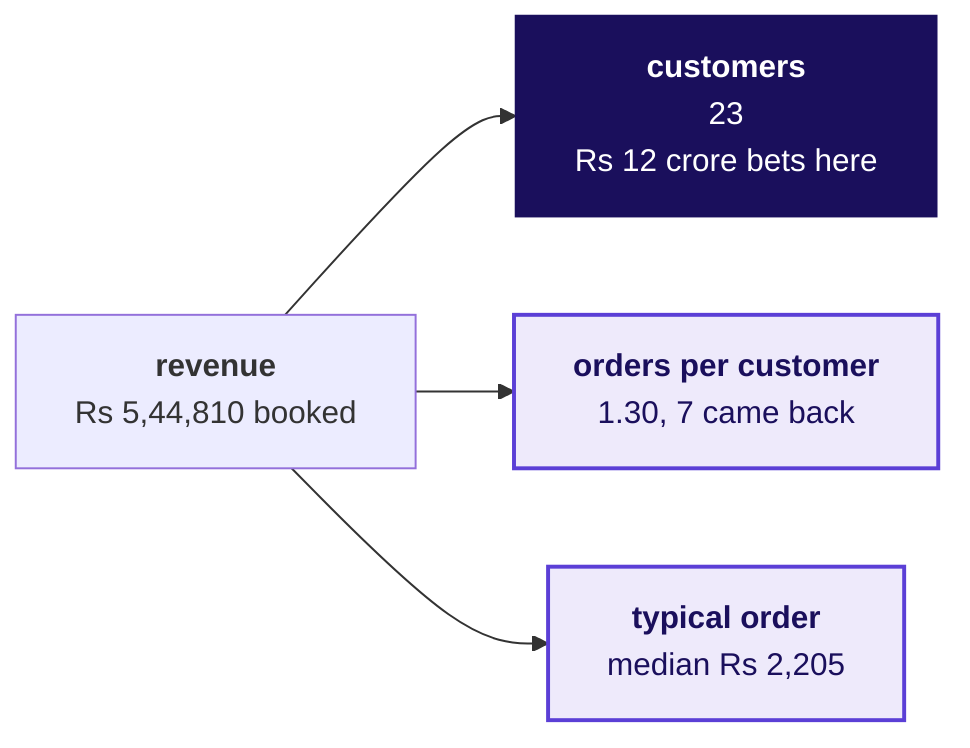
```mermaid
flowchart LR
    R["<b>revenue</b><br/>Rs 5,44,810 booked"] --> C["<b>customers</b><br/>23<br/>Rs 12 crore bets here"]
    R --> F["<b>orders per customer</b><br/>1.30, 7 came back"]
    R --> A["<b>typical order</b><br/>median Rs 2,205"]
    classDef known fill:#EEEAFB,stroke:#5B3FD6,color:#1A0F5C,stroke-width:2px
    classDef bet fill:#1A0F5C,stroke:#1A0F5C,color:#FFFFFF
    class F,A known
    class C bet
```

**Kavya's review.** "Now the tree has honest numbers on every branch. This afternoon, tell Meera which branch she should open first, and why the others wait."

```notes
LIVE, 3 minutes. Read the tree aloud as one sentence: 23 customers, 1.30 orders each, a typical
order of Rs 2,205. Do not give the recommendation; the escalated case this afternoon is where the
room writes it.
Transition: the last interview question of the morning.
```

---

## S45. The interview asks mean or median, and why
*The answer is a decision rule, stated with the numbers behind it.*

```stats
value: Rs 18,160 | label: mean | note: 1 of 30 orders above it
value: Rs 2,205 | label: median | note: booked orders
```

**In the interview.** [S] Mean or median for order value, and why? [S] The mean order is Rs 18,160 and the median Rs 2,205; what do you tell the business about its orders?

```notes
LIVE, 2 minutes. One learner answers aloud. Listen for the rule, the numbers and the business
consequence in the same breath. The full answers are in the study notes.
Close the morning: the afternoon opens on Meera's question with all three rounds in hand.
```
