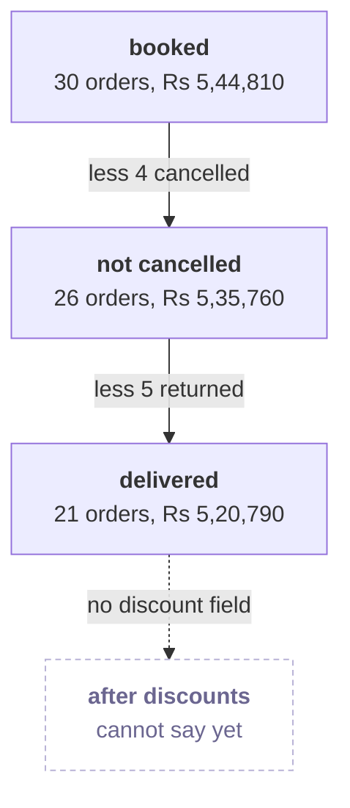
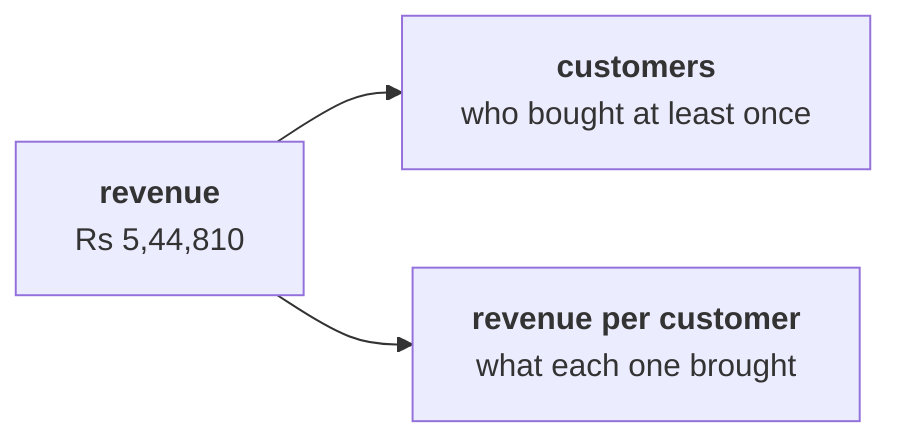
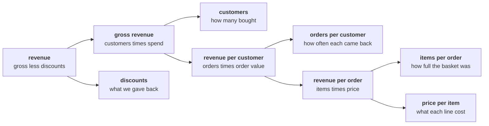
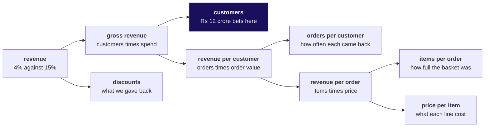
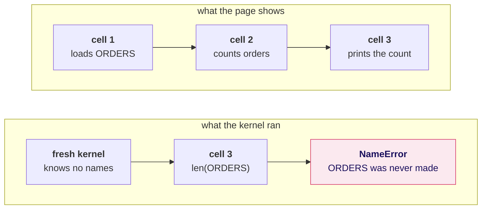
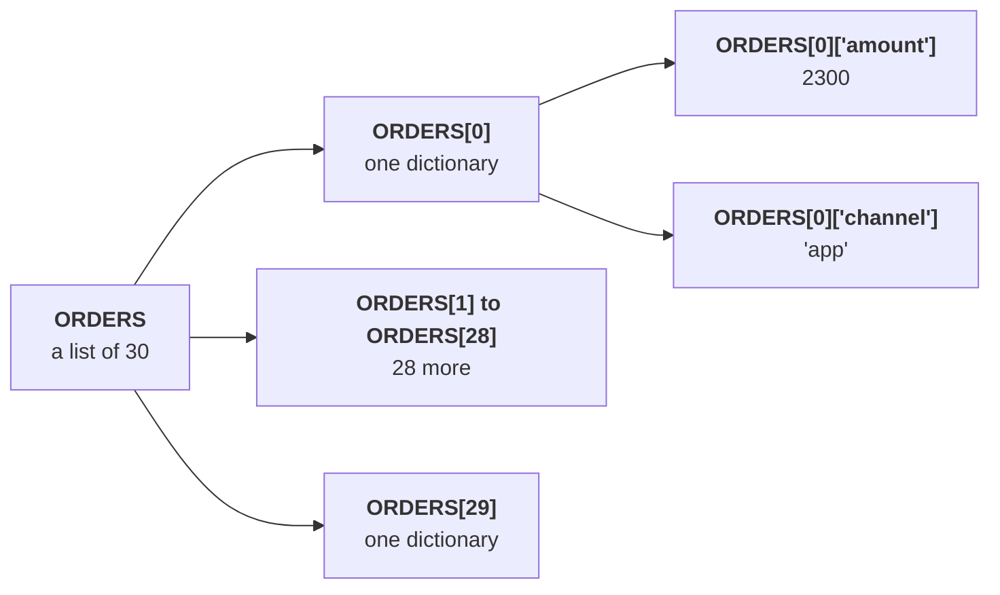
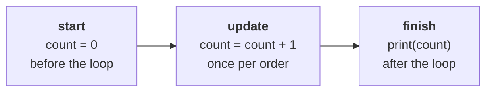

# The question before the budget

Week 1, Day 1. Half one.

Kicker: WEEK 1  ·  MONDAY  ·  HALF ONE
Quote: Where does our growth actually come from, and where is it leaking?
Who: Meera Raghavan, CEO, Kalpa Retail, to the data and AI team at Kalpa's Global Capability Centre

```notes
LIVE, one minute. Read Meera's question aloud and leave it on screen while the room settles.
This question opens Week 1 and never fully closes: every module answers a harder version of it.
Say the arc once: today, what sales is made of; Tuesday, which branch moved; Wednesday, whether
the numbers can be trusted; Thursday, whether the gap is real and what goes to Meera; Friday, the
week rebuilt without an assistant. Then move on and do not repeat it.
```

---

## SECTION 1: The ask
*A CEO asks what sales are made of before she signs Rs 12 crore, and the ask lands on your team.*

```notes
LIVE. Chapter one runs about 15 minutes. Its job is translation: a business ask becomes a
question data can answer. No Python in this chapter at all.
```

---

## S1. Monday morning at Kalpa's GCC
*The ask reaches the data and AI team before anyone opens a tool.*

```cards
icon: building-2 | eyebrow: The group | title: Kalpa Group | body: Headquartered in Singapore, with five business units: Retail, Financial Services, Logistics, Health and Connect.
icon: store | eyebrow: The client | title: Kalpa Retail | body: Sells consumer goods through its app, its website and its stores across India and South-East Asia.
icon: users | eyebrow: Your team | title: The GCC data and AI team | body: The newest team at Kalpa's Global Capability Centre in Bengaluru, serving all five units. You join it as trainee engineers. | tone: dark
```

```stats
value: 4% | label: revenue growth | note: last year, as reported
value: 15% | label: the plan | note: what the board expected
value: 1 month | label: to a growth plan | note: the board's deadline
value: Rs 12 cr | label: marketing's ask | note: to acquire new customers
```

```notes
LIVE, 3 minutes. Kalpa is fictional and the whole programme is set inside it; say that once.
The frame matters: you are not students answering a worksheet, you are the newest engineers in a
Global Capability Centre, and a CEO's question has landed on your board. Ask the room: which of the
four numbers worries the CEO most? Most say the 4 percent. The sharper answer is the Rs 12 crore,
because it is about to be spent on an assumption nobody has checked.
```

---

## S2. What Meera wrote, and what Finance added
*Three questions in one message, and a warning about averages.*

**The client asks.** "Before I sign anything, I want to understand our own sales. What is 'sales' made of? Where does revenue come from, by customer type and channel? Is acquisition even the branch that is short?"

> "No averages. One business customer can move an average." Anand Iyer, finance controller, Kalpa Retail

| What she asked | What it becomes for the team | Answered |
|---|---|---|
| What is sales made of | The revenue tree, with every branch counted | Today |
| By customer type and channel | Revenue grouped by segment and channel | Tuesday |
| Is acquisition the short branch | Which branch moved between two quarters | Tuesday |
| No averages | The typical order that one record cannot move | Today, half two |

```notes
LIVE, 3 minutes. Read Meera's message aloud, then Anand's line. Point out that a client message
usually carries several questions, and that the engineer's first job is to separate them and say
when each gets answered. This table is that separation. Anand's warning is a prediction about the
data; do not explain it yet, because half two proves it with the file.
Trap: learners try to answer all four questions today. Only two belong to today.
```

---

## S3. Question: which total is "sales"
*Thirty orders from 1 July to 26 September, three statuses, and more than one honest total.*


```mermaid
flowchart TB
    B["<b>booked</b><br/>30 orders, Rs 5,44,810"] -->|"less 4 cancelled"| N["<b>not cancelled</b><br/>26 orders, Rs 5,35,760"]
    N -->|"less 5 returned"| D["<b>delivered</b><br/>21 orders, Rs 5,20,790"]
    D -.->|"no discount field"| X["<b>after discounts</b><br/>cannot say yet"]
    classDef unknown fill:#FFFFFF,stroke:#B8B2D6,color:#6B6690,stroke-dasharray:4 3
    class X unknown
```

**Question.** Meera asks for "sales" in the note she will read on Thursday. Which total goes in, and what do you write beside it? Answer as a letter: a) Rs 5,44,810, the biggest; b) Rs 5,20,790, the most conservative; c) any one of them, with its definition written beside it; d) none until the discounts are known.

```notes
LIVE, 3 minutes. Give the room one minute in pairs, then take a show of letters. Expect a split
between a and b. Do not resolve it here; the next slide does.
The trap is thinking one of these numbers is right and the others are wrong. All four readings are
correct arithmetic; they answer different questions.
```

---

## S4. Answer: the total you define, with its definition
*Every reading is correct arithmetic; the error is a number without its definition.*

| Reading | Total | It answers |
|---|---|---|
| Booked | Rs 5,44,810 | How much demand reached us, before anything fell away |
| Not cancelled | Rs 5,35,760 | How much we set out to fulfil |
| Delivered | Rs 5,20,790 | How much reached a customer and stayed there |
| After discounts | Not in this file | How much we actually kept, which Finance will ask for |

**Kavya's review.** Name the definition before the number, every time: "Revenue, all booked orders, 1 July to 26 September: Rs 5,44,810." Today's counts use every booked order, as the file arrives, and the note says so.

```notes
LIVE, 2 minutes. The answer is c. Option d sounds rigorous and is a way of never answering: you can
state a number now and say what it leaves out.
Kavya Nair is the senior analyst on the team; her review is what a senior checks before work
leaves the team. She will appear at the close of every chapter this week.
Do not reconcile the readings against Finance's books today; that is Wednesday's lesson.
```

---

## S5. From a business ask to a question data can answer
*The five moves an engineer makes before opening a tool, run on Meera's ask.*

```timeline
label: Move 1 | title: The ask | body: Business words: what is sales made of, and is acquisition the short branch.
label: Move 2 | title: The question | body: Which multiplied parts make up revenue, and which part is short.
label: Move 3 | title: The data | body: One row per order: who bought, when, through which channel, for how much.
label: Move 4 | title: The method | body: Break revenue into branches and count each branch from the rows.
label: Move 5 | title: The answer | body: A number per branch, each with its definition, and the branch to open first. | tone: dark
```

**In the interview.** [F] A business says "grow revenue 15 percent". How do you turn that into questions data can answer?

```notes
LIVE, 3 minutes. Walk the five moves left to right with Meera's words in each. The model answer to
the interview question is these five moves said aloud in under a minute: restate the goal, break
revenue into its drivers, name the data each driver needs, say how you would measure the gap per
driver, and say what decision each result would change. The answer is in the day sheet.
Transition: move 4 needs a picture of revenue, which is chapter two.
```

---

## SECTION 2: The tree
*Revenue is a product of four counts less what we give back, and every initiative lands on one branch.*

```notes
LIVE. Chapter two runs about 40 minutes, including the 15-minute placement drill. This is the
chapter never to cut: the tree is the teaching, and Python arrives later as the calculator.
Draw the tree on the whiteboard as the slides build it, so the room has it in front of them.
```

---

## S6. Revenue, broken once
*Before any deeper split, revenue is how many customers times what each one brings.*


```mermaid
flowchart LR
    R["<b>revenue</b><br/>Rs 5,44,810"] --> C["<b>customers</b><br/>who bought at least once"]
    R --> V["<b>revenue per customer</b><br/>what each one brought"]
```

Every branch below this point is one of these two, broken again. A growth plan that cannot say which of the two it moves is not yet a plan.

```notes
LIVE, 3 minutes. Draw this on the board first, with the room. Ask: if revenue fell, which of the two
could have caused it? Both. That is why marketing's claim, that we need more customers, is only one
of two hypotheses before any data is looked at.
```

---

## S7. Revenue, all the way down
*Four counts multiply, and discounts come off the top, so every leaf is a count or a price.*


```mermaid
flowchart LR
    R["<b>revenue</b><br/>gross less discounts"] --> G["<b>gross revenue</b><br/>customers times spend"]
    R --> D["<b>discounts</b><br/>what we gave back"]
    G --> C["<b>customers</b><br/>how many bought"]
    G --> V["<b>revenue per customer</b><br/>orders times order value"]
    V --> F["<b>orders per customer</b><br/>how often each came back"]
    V --> O["<b>revenue per order</b><br/>items times price"]
    O --> B["<b>items per order</b><br/>how full the basket was"]
    O --> P["<b>price per item</b><br/>what each line cost"]
```

**The formula.** Revenue equals customers, times orders per customer, times items per order, times price per item, less discounts.

```notes
LIVE, 4 minutes. Extend the board drawing one level at a time, left to right. Revenue per
customer on the last slide was after discounts; this slide pulls the discounts out first, so that
every leaf on the right is a count or a price. Check the multiplication with units: customers
times orders per customer gives orders; times items per order gives items; times price per item
gives rupees. Then discounts come off. This tree is the profitability framework case interviews
test, and the room is drawing it on day one.
```

---

## S8. Every branch is a metric with a denominator
*A rate without its denominator cannot be checked, compared or defended.*

| Branch | Numerator | Denominator | From today's file |
|---|---|---|---|
| Customers | Distinct customer ids | None, it is a count | 23 |
| Orders per customer | Orders | Distinct customers | 30 over 23 |
| Items per order | Items sold | Orders | Not in this file |
| Price per item | Revenue before discounts | Items sold | Not in this file |
| Discounts | Rupees given back | Revenue before discounts | Not in this file |

**Kavya's review.** Say the denominator out loud. Orders per customer is 30 over 23, never 23 over 30, and a share of discounts is over revenue before discounts, never after.

```notes
LIVE, 4 minutes. Fill the table on the board with the room. The three rows marked not in this file
are the most useful rows on the slide: an engineer who can say what the data cannot answer is more
valuable than one who fills the gap with a guess. Half two turns those three rows into one line to
Meera asking for the missing fields.
```

---

## S9. Five branches, five different bills
*A 10 percent lift on any branch lifts revenue about 10 percent; what differs is what it costs.*

```cards
icon: users | eyebrow: Customers | title: Acquisition | body: Paid in marketing spend. The risk is new customers who buy once and never return.
icon: repeat | eyebrow: Orders per customer | title: Retention | body: Paid in loyalty and service. The risk is rewarding people who would have come back anyway.
icon: shopping-cart | eyebrow: Items per order | title: Basket | body: Paid in merchandising and bundles. The risk is filling baskets with low-margin lines.
icon: tag | eyebrow: Price per item | title: Price | body: Paid in lost volume. The risk is a rise that drives the price-sensitive away.
icon: percent | eyebrow: Discounts | title: Margin | body: Paid in margin for quantity. The risk is volume that grows by less than the cut. | tone: dark
```

```notes
LIVE, 4 minutes. The point of this slide is that the branches are not interchangeable even though
their arithmetic effect is the same. A CEO chooses between them on cost and risk, which is why the
analyst's job is to say which branch is short before anyone chooses how to move it.
Ask: which of these five does marketing's Rs 12 crore buy? The first.
```

---

## D10. Two small lifts compound
*A multiplied tree turns two 10 percent lifts into 21 percent, where adding them says 20.*

```stats
value: x 1.10 | label: orders per customer | note: a 10 percent lift
value: x 1.10 | label: items per order | note: a 10 percent lift
value: x 1.21 | label: revenue | note: 21 percent, since 1.10 times 1.10 is 1.21
```

**What breaks.** The same multiplication works against you when a discount buys less volume than it gives away.

```stats
value: x 1.10 | label: items sold | note: 10 percent more volume
value: x 0.85 | label: price after discount | note: 15 percent given back
value: x 0.935 | label: revenue | note: a fall of 6.5 percent
```

```notes
SELF-STUDY, depth for the confident half. Show it live only if the room is ahead. The discount
case returns in the Kahoot, so a learner who reads this slide has that answer.
```

---

## S11. Where the Rs 12 crore lands
*Marketing's budget is a bet on one leaf out of five, placed before anyone checked which is short.*


```mermaid
flowchart LR
    R["<b>revenue</b><br/>4% against 15%"] --> G["<b>gross revenue</b><br/>customers times spend"]
    R --> D["<b>discounts</b><br/>what we gave back"]
    G --> C["<b>customers</b><br/>Rs 12 crore bets here"]
    G --> V["<b>revenue per customer</b><br/>orders times order value"]
    V --> F["<b>orders per customer</b><br/>how often each came back"]
    V --> O["<b>revenue per order</b><br/>items times price"]
    O --> B["<b>items per order</b><br/>how full the basket was"]
    O --> P["<b>price per item</b><br/>what each line cost"]
    classDef bet fill:#1A0F5C,stroke:#1A0F5C,color:#FFFFFF
    class C bet
```

Before anyone agrees to the budget, the team asks one question: of the gap between 4 and 15 percent, how much came from fewer customers and how much from each customer buying less? Tuesday's file answers it.

```notes
LIVE, 3 minutes. This is the day's central tension. Marketing is not wrong to want customers; it may
be spending on the branch that is fine. The interview question [D] lives here: what would you check
before agreeing, and how would you say no? Model answer in the day sheet: agree the goal, show the
tree, name the branch the budget moves, ask for the two-quarter comparison, and propose the check
before the spend, never a flat refusal.
```

---

## S12. Question: place five initiatives on the tree
*A discount, a new store, a loyalty card, a price rise and an app redesign, each on one branch.*

```cards
icon: percent | eyebrow: Initiative 1 | title: A 15 percent discount | body: On everything, for a month.
icon: store | eyebrow: Initiative 2 | title: A new store | body: In a city where the app already sells.
icon: badge-check | eyebrow: Initiative 3 | title: A loyalty card | body: Points on every order.
icon: trending-up | eyebrow: Initiative 4 | title: A price rise | body: Five percent on the top sellers.
icon: smartphone | eyebrow: Initiative 5 | title: An app redesign | body: A new checkout and home screen.
```

**Question.** In pairs, ten minutes: place each initiative on the branch it moves, and write in one line what moving that branch costs.

```notes
LIVE, the 15-minute mid-session drill, including the debrief on the next slide. Walk the room.
Listen for the app redesign: pairs who place it without asking what it changes are the pairs to
visit. Collect two placements for the redesign on the board before revealing the answer; they
will differ, and that difference is the lesson.
```

---

## S13. Answer: five initiatives, placed
*Four land cleanly; the fifth depends on which behaviour it changes, and that is the lesson.*

| Initiative | The branch it moves | What moving it costs | The catch |
|---|---|---|---|
| A 15 percent discount | Discounts, hoping for more items and orders | Margin | Volume must rise by more than the cut, or revenue falls |
| A new store | Customers | Rent and fit-out | It may move app customers into the store and add nobody |
| A loyalty card | Orders per customer | Points and their cost | It pays people who would have come back anyway |
| A price rise | Price per item | Volume at risk | The price-sensitive leave first |
| An app redesign | Depends on what it changes: sign-ups, frequency or basket | The build | Name the behaviour before placing it |

```notes
LIVE, 5 minutes. The redesign is the teaching row: an initiative is placed by the behaviour it
changes, not by what it is called. A new checkout that removes a step lifts conversion, so
customers; a home screen that shows reorder buttons lifts frequency. Ask one pair to defend its
placement in one sentence.
```

---

## S14. The rules for any growth ask
*Four rules from the tree, in the order they are used.*

```cards
num: 01 | icon: git-branch | eyebrow: Before any tool | title: Draw the tree | body: Write every branch as a numerator over a denominator.
num: 02 | icon: map-pin | eyebrow: For each initiative | title: Place it on a branch | body: By the behaviour it changes, never by its name.
num: 03 | icon: receipt | eyebrow: Before you recommend | title: Price the move | body: What it costs, and what could make it backfire.
num: 04 | icon: search | eyebrow: Before anyone funds it | title: Ask which branch moved | body: Compare two periods branch by branch, then choose. | tone: dark
```

**Kavya's review.** A growth plan that cannot point at one branch of the tree is a wish. Point first, then spend.

```notes
LIVE, 2 minutes. This is the photograph slide. Read the four rules; they come back in the half-two
close, on the cheat sheet and in Saturday's paper.
```

---

## SECTION 3: The workbench
*One editor, one notebook, one kernel, and the habit that keeps a notebook honest.*

```notes
LIVE. Chapter three runs about 25 minutes, most of it hands on the keyboard. If time is short,
this is the chapter to compress: cut the recovery drill to five minutes, never the tree.
```

---

## S15. Where the work happens
*Everything runs in the browser, in one editor, from your own GitHub account.*

```cards
icon: cloud | eyebrow: The machine | title: GitHub Codespaces | body: A computer in the cloud that runs your editor, so every laptop in the room behaves the same.
icon: code | eyebrow: The editor | title: VS Code | body: Where you open the notebook, the data file and the terminal.
icon: notebook-pen | eyebrow: The document | title: The notebook | body: Cells of code and text, run one at a time, each keeping its output.
icon: cpu | eyebrow: The engine | title: The kernel | body: The Python process that runs your cells and remembers every variable they create. | tone: dark
```

```notes
LIVE, 3 minutes. Everyone opens the Codespace from Week 0 now; the support TA circulates. The last
card is the one that matters for the next three slides: the kernel is a running process with a
memory, and the page is only a view of it.
```

---

## S16. The kernel remembers what you ran, not what you see
*Cells run in the order you click them, and the kernel keeps whatever each run left behind.*


```mermaid
flowchart TB
    subgraph PAGE["what the page shows"]
        direction LR
        P1["<b>cell 1</b><br/>loads ORDERS"] --> P2["<b>cell 2</b><br/>counts orders"] --> P3["<b>cell 3</b><br/>prints the count"]
    end
    subgraph RAN["what the kernel ran"]
        direction LR
        K0["<b>fresh kernel</b><br/>knows no names"] --> K3["<b>cell 3</b><br/>len(ORDERS)"] --> E["<b>NameError</b><br/>ORDERS was never made"]
    end
    PAGE ~~~ RAN
    classDef bad fill:#FBE9EF,stroke:#D63A6A,color:#1A0F5C
    class E bad
```

The page shows cells in order. The kernel only knows the cells you actually ran, in the order you ran them, since it last restarted.

```notes
LIVE, 3 minutes. Demonstrate on the projector: restart the kernel, click cell 3, run it. Do not
say what will happen; the next slide asks the room to predict it.
```

---

## S17. Question: what does cell 3 print
*A fresh kernel, and the third cell run before the first two.*

```text
In [ ]:   ORDERS = kit.load_records("C2_W01_D01_orders_STUDENT.py")
In [ ]:   count = len(ORDERS)
In [1]:   print(len(ORDERS))
```

**Question.** The brackets show the order cells ran in, and only cell 3 shows a number. Predict its output before it runs: a) 30; b) 0; c) an error naming ORDERS; d) nothing at all.

```notes
LIVE, 2 minutes. Take letters, then run it. Most rooms split between a, because the page shows the
data loaded above, and c. Point at the brackets: an empty bracket means that cell has not run
since the kernel started.
```

---

## S18. Answer: an error, because the kernel never met ORDERS
*The name does not exist until the cell that makes it has run.*

```text
NameError: name 'ORDERS' is not defined
```

**What breaks.** The kernel has not run the cell that defines ORDERS, so the name does not exist yet. The page above the cell is not the kernel's memory.

1. Restart the kernel, so nothing from earlier runs survives.
2. Run All, so every cell runs once, top to bottom.
3. If a cell fails, fix it and Run All again from the top.

```notes
LIVE, 3 minutes. The answer is c, and the exact text is on the slide. Then do the recovery drill
once with the room: restart, Run All, confirm the count prints 30.
The opposite failure is worse and silent: a notebook that only works because a deleted cell ran
earlier. Restart and Run All is the only test that catches it.
```

---

## S19. The rule that keeps a notebook honest
*A notebook is only true if it runs from a fresh kernel, top to bottom.*

```cards
icon: rotate-ccw | eyebrow: Before you share | title: Restart and Run All | body: If it fails from the top, it is broken, however good it looked a minute ago.
icon: list-ordered | eyebrow: While you work | title: Top to bottom | body: Write cells in the order they must run, and never lean on a cell you deleted.
icon: eye | eyebrow: When you read | title: The numbers on the left | body: The bracket beside a cell shows the order it ran in; gaps and jumps are a warning.
```

**The rule.** Restart and Run All before every commit, every share and every answer you give Meera.

```notes
LIVE, 2 minutes. The execution counter, the number in brackets beside each cell, is the quickest
check: a clean run reads 1, 2, 3 down the page.
```

---

## SECTION 4: The first count
*A record is a dictionary, the file is a list of them, and one loop counts what the tree asks for.*

```notes
LIVE. Chapter four runs about 30 minutes, the first half of the counting block. The rest of the
counting opens half two. Keep the tree on the board: every count here is a leaf on it.
```

---

## S20. One order is a dictionary
*Each order arrives as named fields, so a question can ask for a field by its name.*

```python
{"order_id": "KR-01001", "customer_id": "C-0101", "segment": "Retail-Core",
 "channel": "app", "order_date": "2026-07-21", "amount": 2300, "status": "delivered"}
```

| Key | Value | The question it answers |
|---|---|---|
| customer_id | C-0101 | Who bought, which is how customers are counted |
| channel | app | Where they bought, which Tuesday groups by |
| amount | 2300 | For how much, which is how revenue is summed |
| status | delivered | Whether it stayed sold, which chapter one used |

```notes
LIVE, 3 minutes. This is Week 0's library record with new fields; say so, and the room relaxes.
Ask which key answers "who bought". The trap: some learners think order_id counts customers.
It counts orders; customer_id counts people.
```

---

## S21. The file is a list of thirty of them
*A list keeps the orders in order, and a dictionary names the fields inside each one.*


```mermaid
flowchart LR
    L["<b>ORDERS</b><br/>a list of 30"] --> A["<b>ORDERS[0]</b><br/>one dictionary"]
    L --> M["<b>ORDERS[1] to ORDERS[28]</b><br/>28 more"]
    L --> Z["<b>ORDERS[29]</b><br/>one dictionary"]
    A --> K1["<b>ORDERS[0]['amount']</b><br/>2300"]
    A --> K2["<b>ORDERS[0]['channel']</b><br/>'app'"]
```

**In the interview.** [SV] A list against a dictionary: when do you reach for each?

```notes
LIVE, 2 minutes. Trace one path with a finger: the list, position 0, the key amount, the value
2300. Model answer to the interview question: a list when order and position matter or when you
will loop over everything; a dictionary when you look things up by a name. Records are
dictionaries inside a list because you loop over the orders and look up fields inside each one.
```

---

## S22. Counting is an accumulator
*Start a total before the loop, update it once per record, and read it after the loop ends.*


```mermaid
flowchart LR
    S["<b>start</b><br/>count = 0<br/>before the loop"] --> U["<b>update</b><br/>count = count + 1<br/>once per order"] --> F["<b>finish</b><br/>print(count)<br/>after the loop"]
```

```python
count = 0
for order in ORDERS:
    count = count + 1
print(count)           # 30
```

```notes
LIVE, 3 minutes. The librarian's loop from Week 0 is the same three moves. Ask where each line
sits: the start outside the loop, the update inside, the finish after. Two classic bugs to name:
the start inside the loop, which resets every time, and the print inside the loop, which prints
thirty times.
```

---

## S23. Question: what does the revenue loop print
*The same three moves, summing amounts instead of counting orders.*

```python
revenue = 0
for order in ORDERS:
    revenue += order["amount"]
print(revenue)
```

**Question.** Predict before it runs: a) 544810; b) thirty lines, one running total per order; c) an error part way through the list; d) 0, because revenue starts at zero.

```notes
LIVE, 3 minutes. Take letters, then have every learner run it themselves; the discovery is theirs,
not the projector's. Do not advance until most of the room has the error on their own screen.
Option a is what the room expects, b misreads where the print sits, and d misreads the
accumulator.
```

---

## S24. Answer: an error, part way through the list
*The running total is a number, one amount is text, and Python will not add the two.*

```text
TypeError: unsupported operand type(s) for +=: 'int' and 'str'
```

Two names survive the crash: revenue holds the total the loop reached, and order holds the record it stopped on. Print both before you change a line.

```python
print(revenue)                  # the total the loop reached
print(order)                    # the record it stopped on
print(type(order["amount"]))    # the type, which is the whole story
```

```notes
LIVE, 3 minutes. The answer is c. Have every learner run the three prints and say aloud what they
found; the record and the total are theirs to find, so do not read either out first. The
teaching point is that a failed loop leaves its evidence behind in the loop variable.
```

---

## S25. Reading a trace from its last line up
*The last line names the problem; the lines above it say where it happened.*

```text
TypeError                                 Traceback (most recent call last)
Cell In[2], line 3
      1 revenue = 0
      2 for order in ORDERS:
----> 3     revenue += order["amount"]
      4 print(revenue)

TypeError: unsupported operand type(s) for +=: 'int' and 'str'
```

```cards
num: 1 | eyebrow: Read first | title: TypeError | body: The kind of problem: an operation met a type it cannot use.
num: 2 | eyebrow: Then | title: += | body: The operation that failed: adding to the running total.
num: 3 | eyebrow: Then | title: 'int' and 'str' | body: What was on each side: a number, and text.
num: 4 | eyebrow: Last | title: The arrow at line 3 | body: Where it gave up; the lines around it are context.
```

```notes
LIVE, 2 minutes. This is the exact text Jupyter prints. Read it bottom up with the room: kind,
operation, the two sides, then the arrow. This habit is Week 1's most reused skill; every day from
here has a planted failure.
```

---

## S26. The fix for today, and what it costs
*int() makes the total add up; it does not say why an amount arrived as text.*

```python
revenue = 0
for order in ORDERS:
    revenue += int(order["amount"])
print(revenue)         # 544810
```

**Kavya's review.** The total is right and the question is still open: why did one amount arrive as text, and are there others in a bigger file? Tell Meera what you patched, in the same note as the number.

```notes
LIVE, 3 minutes. int() converts text that looks like a whole number into a number. Say plainly
that this is a patch for today; Wednesday asks the question of the whole file. The honest sentence
to Meera is: the total is Rs 5,44,810, and one amount arrived in the wrong type, which we are
checking.
```

---

## D27. int() is a patch, and here is where it breaks
*The same fix fails the moment the text carries an Indian comma.*

```python
int("1,20,000")
```

```text
ValueError: invalid literal for int() with base 10: '1,20,000'
```

A conversion that works on today's value is not a cleaning strategy. Cleaning means deciding, per field, what counts as a valid value and what happens to the rows that are not, which is Wednesday's work.

```notes
SELF-STUDY, depth for the confident half. Worth showing live only if a learner asks whether int()
always works.
```

---

## S28. What half one leaves on your desk
*Four things you can now do, each used again this afternoon.*

| You can now | The evidence |
|---|---|
| Separate a client message into questions, and say when each is answered | Meera's four questions, two of them today's |
| Name a total with its definition | Rs 5,44,810 booked, Rs 5,20,790 delivered |
| Draw the revenue tree, every branch a numerator over a denominator | The tree on the board, three leaves not in the file |
| Run a notebook honestly, and count with an accumulator | Restart and Run All; 30 orders; Rs 5,44,810 once int() is applied |

```notes
LIVE, 2 minutes, then the break. Ask two learners to say the tree aloud without the slide. After
the break: customers, orders per customer, the three leaves the file cannot give, and the
average Anand warned about.
```
