# The question before the budget

Week 1, Day 1. Half one.

Kicker: WEEK 1  ·  MONDAY  ·  MORNING
Quote: Before I sign anything, I want to understand our own sales. Is acquisition even the branch that is short?
Who: Meera Raghavan, CEO, Kalpa Retail, to the data and AI team at Kalpa's Global Capability Centre

```notes
On screen before the clock starts. Leave Meera's words up while the room settles, and do not read them yet:
they close the story in 45 minutes. Say once that Kalpa is fictional and the whole programme is set
inside it, and that the first 45 minutes are about the business, with no laptop open.
Transition: one Saturday at Kalpa Retail.
```

---

## SECTION 0: The retail story
*Before any data, the business: how a retailer makes money, who asks the data team for what, and the metrics as formulas.*

```notes
LIVE, 45 minutes in six parts, then 5 minutes for Meera's ask. The talk track is
trainer/C2_W01_D01_domain_story_TRAINER.md, and it holds what to say, the question per part and
the facts you may quote with their sources. Six drawings go on the board, one per part, and stay
up all day. The domain card goes out at the close of the afternoon, after the room has met the traps.
```

---

## S1. One Saturday at Kalpa Retail
*A store and an app in the same city, from the first shelf check to the Monday page.*

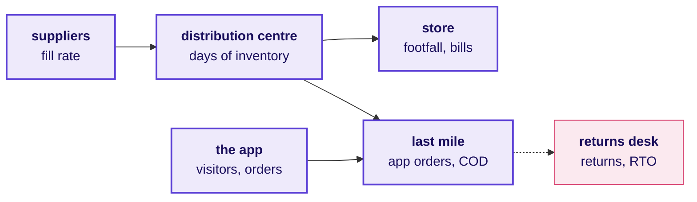
```mermaid
flowchart LR
    SUP["<b>suppliers</b><br/>fill rate"] --> DC["<b>distribution centre</b><br/>days of inventory"]
    DC --> ST["<b>store</b><br/>footfall, bills"]
    DC --> LM["<b>last mile</b><br/>app orders, COD"]
    APP["<b>the app</b><br/>visitors, orders"] --> LM
    LM -.-> RD["<b>returns desk</b><br/>returns, RTO"]
    classDef known fill:#EEEAFB,stroke:#5B3FD6,color:#1A0F5C,stroke-width:2px
    classDef bad fill:#FBE9EF,stroke:#D63A6A,color:#1A0F5C
    class SUP,DC,ST,APP,LM known
    class RD bad
```

```notes
LIVE, 8 minutes. Part 1 of the talk track. Tell the Saturday from the shelf check to the Monday
page, and follow the Retail-Plus member's basket: Rs 2,000 of goods, Rs 200 off in a promotion,
Rs 1,800 paid with a card held as a token; the bedsheet comes back next week. The app's 2,000
orders average Rs 1,500.
Ask: think of the last thing you bought in a shop and on an app; which one knew more about you?
Land it: the data team works where customers leave traces, and a store leaves far fewer.
Draw the value chain on the board, six boxes left to right.
Transition: which real companies Kalpa is like.
```

---

## S2. Kalpa is built like an Indian group
*One group, five units, and one data and AI centre in Bengaluru serving each of them.*

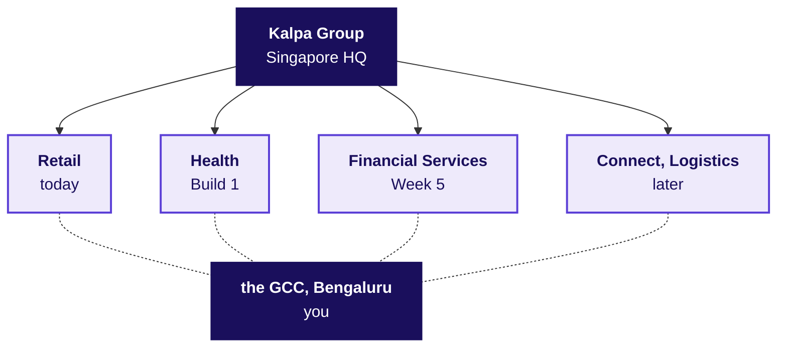
```mermaid
flowchart TB
    G["<b>Kalpa Group</b><br/>Singapore HQ"] --> R["<b>Retail</b><br/>today"]
    G --> H["<b>Health</b><br/>Build 1"]
    G --> F["<b>Financial Services</b><br/>Week 5"]
    G --> O["<b>Connect, Logistics</b><br/>later"]
    R & H & F & O -.- C["<b>the GCC, Bengaluru</b><br/>you"]
    classDef unit fill:#EEEAFB,stroke:#5B3FD6,color:#1A0F5C,stroke-width:2px
    classDef dark fill:#1A0F5C,stroke:#1A0F5C,color:#FFFFFF
    class R,H,F,O unit
    class G,C dark
```

Kalpa's stores work like DMart's, and its app sells stock Kalpa owns, like DMart Ready; Flipkart and Amazon India are marketplaces whose sellers own the goods.

```notes
LIVE, 7 minutes. Part 2 of the talk track. Ask first: what does your phone company know about you
that a grocer would want? Land it: units that share customers can learn a great deal about each
one, and each unit keeps its own books and needs its own purpose before it uses the data.
Kalpa is fictional; Reliance and Tata are real groups built like it, and every fact about them is
in the talk track's facts table with its source. The GCC you have joined works like the Indian
centres of Walmart, Target, Tesco and Lowe's.
Draw the group on the board, six boxes.
Transition: where the money goes.
```

---

## S3. Rs 100 ordered leaves Rs 2.50 of EBITDA
*EBITDA is earnings before interest, tax, depreciation and amortisation: what the Rs 100 leaves.*

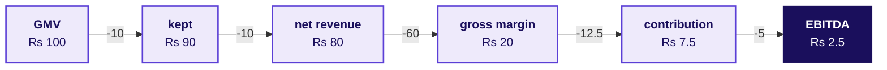
```mermaid
flowchart LR
    G["<b>GMV</b><br/>Rs 100"] -->|"-10"| K["<b>kept</b><br/>Rs 90"]
    K -->|"-10"| N["<b>net revenue</b><br/>Rs 80"]
    N -->|"-60"| M["<b>gross margin</b><br/>Rs 20"]
    M -->|"-12.5"| C["<b>contribution</b><br/>Rs 7.5"]
    C -->|"-5"| O["<b>EBITDA</b><br/>Rs 2.5"]
    classDef known fill:#EEEAFB,stroke:#5B3FD6,color:#1A0F5C,stroke-width:2px
    classDef dark fill:#1A0F5C,stroke:#1A0F5C,color:#FFFFFF
    class G,K,N,M,C known
    class O dark
```

| Step | Less | What it is |
|---|---|---|
| GMV to kept | Rs 10 | Cancellations and returns come off first. |
| Kept to net revenue | Rs 10 | GST is collected for the state. |
| Net revenue to gross margin | Rs 60 | The cost of the goods goes to suppliers. |
| Gross margin to contribution | Rs 12.5 | Picking, delivery, fees, returns and retention offers come with every order. |
| Contribution to EBITDA | Rs 5 | Stores, warehouses, tech, head office and acquisition do not grow with one more order. |

```notes
LIVE, 10 minutes. Part 3 of the talk track, the part never to cut. Illustrative numbers. The slide lays the board's six boxes
left to right; on the board, draw them top to bottom and write each deduction on its arrow: cancellations and returns come off first; GST is collected for the state;
the cost of the goods goes to suppliers; per-order costs are picking, delivery, payment fees,
returns and the offers that bring a customer back; fixed costs are stores, warehouses,
technology, head office and the budget that wins new customers.
Ask first: of the member's Rs 1,800, how much does Kalpa keep as EBITDA? Four ranges, hands up
for each; then reveal about Rs 50, the basket's Rs 150 of contribution less about Rs 100 towards
the costs that do not change with one more order. Real retailers keep a thin slice: DMart reported
profit after tax of 4.8 percent of revenue for FY26.
Add the marketplace sentence: a marketplace books only its fees as revenue, and foreign-owned
multi-brand e-commerce selling to Indian consumers runs that way under Press Note 2 of 2018.
Transition: who asks the data team for what.
```

---

## S4. Six people already want something from us
*Each asks for a different number, and each loses something different when it is wrong.*

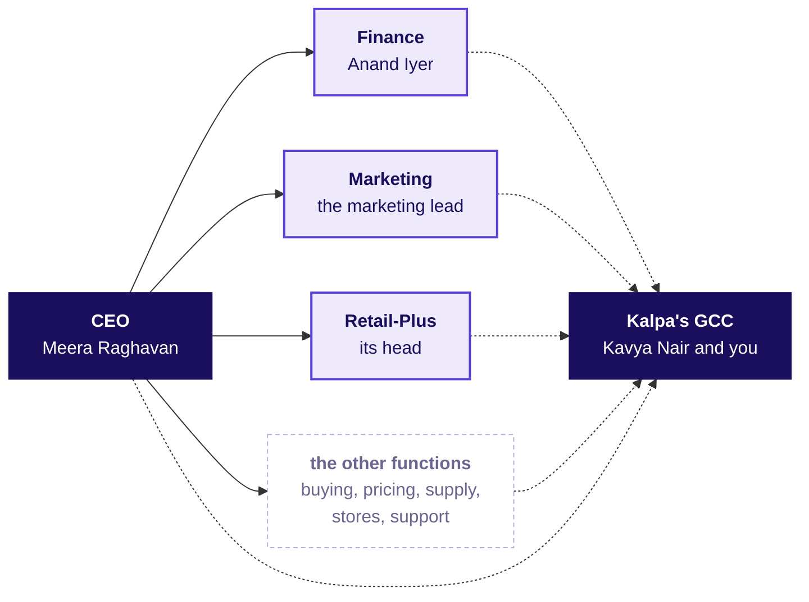
```mermaid
flowchart LR
    CEO["<b>CEO</b><br/>Meera Raghavan"] --> FIN["<b>Finance</b><br/>Anand Iyer"]
    CEO --> MKT["<b>Marketing</b><br/>the marketing lead"]
    CEO --> RP["<b>Retail-Plus</b><br/>its head"]
    CEO --> OTH["<b>the other functions</b><br/>buying, pricing, supply,<br/>stores, support"]
    FIN & MKT & RP & OTH -.-> GCC["<b>Kalpa's GCC</b><br/>Kavya Nair and you"]
    CEO -.-> GCC
    classDef known fill:#EEEAFB,stroke:#5B3FD6,color:#1A0F5C,stroke-width:2px
    classDef unknown fill:#FFFFFF,stroke:#B8B2D6,color:#6B6690,stroke-dasharray:4 3
    classDef dark fill:#1A0F5C,stroke:#1A0F5C,color:#FFFFFF
    class FIN,MKT,RP known
    class OTH unknown
    class CEO,GCC dark
```

```notes
LIVE, 6 minutes. Part 4 of the talk track. Name the six boxes: Meera, Anand, the marketing lead, the
head of Retail-Plus, the other functions (buying, pricing, supply chain, stores, and support, where
Farhan Sheikh arrives in Week 8), and Kavya Nair with us in the GCC, who reviews everything before
it leaves. The data platform lead sits beside the GCC and wants the warehouse queried, never exported.
Ask: if one of our numbers is wrong, whose mistake can we undo next week, and whose can we not?
Land it: before a number leaves the team, know who asked for it and whether being wrong can be
taken back.
Draw who asks on the board, six boxes. If short of time, draw it, ask once and move on.
Transition: the tree every retail number hangs off.
```

---

## S5. Every retail number hangs off one tree
*Revenue is customers, times orders per customer, times order value, less what leaks.*

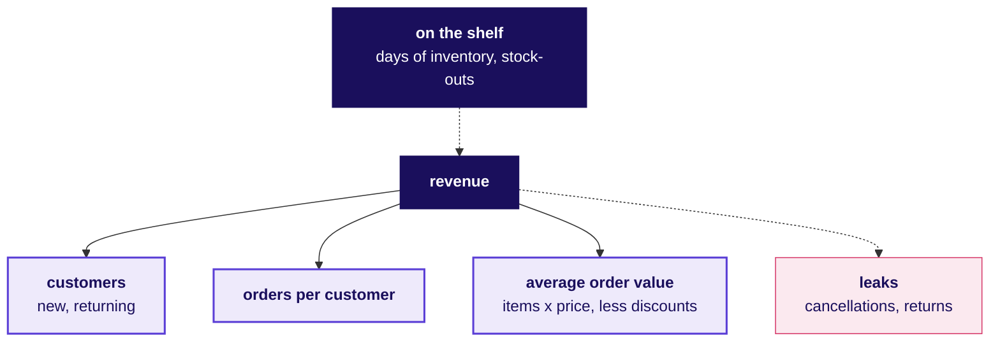
```mermaid
flowchart TB
    S["<b>on the shelf</b><br/>days of inventory, stock-outs"] -.-> R["<b>revenue</b>"]
    R --> C["<b>customers</b><br/>new, returning"]
    R --> F["<b>orders per customer</b>"]
    R --> A["<b>average order value</b><br/>items x price, less discounts"]
    R -.-> L["<b>leaks</b><br/>cancellations, returns"]
    classDef known fill:#EEEAFB,stroke:#5B3FD6,color:#1A0F5C,stroke-width:2px
    classDef bad fill:#FBE9EF,stroke:#D63A6A,color:#1A0F5C
    classDef dark fill:#1A0F5C,stroke:#1A0F5C,color:#FFFFFF
    class C,F,A known
    class L bad
    class R,S dark
```

**The rule.** Every metric is a numerator over a denominator in a window, and a rate means nothing until you say what it is compared with.

```notes
LIVE, 9 minutes. Part 5 of the talk track, the other part never to cut. Say the three traps with
their illustrative numbers: retention of 300 over 380 is 79 percent and divides by survivors; the
pressure cookers ran out on Saturday, so Sunday's file shows no sales and no row says anyone asked;
total growth of 15 percent is 2 percent like for like.
Ask: the festive lights have sold 62 percent in four weeks with Diwali ahead; good news or bad?
Collect three things to check first. Land it: a rate means nothing until you say what it is
compared with, and over which window.
Draw the metric tree, six boxes, and leave it on the board all day; the case writes its numbers
onto it.
Transition: from describing to acting.
```

---

## S6. The further right, the more a wrong answer costs
*Describe, predict, recommend and act, and the rules every rung works under.*

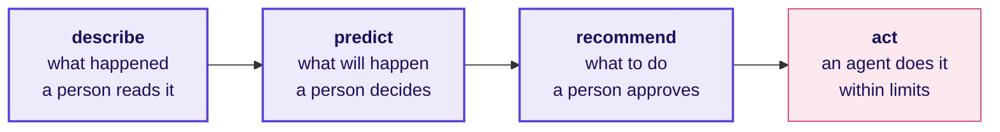
```mermaid
flowchart LR
    D["<b>describe</b><br/>what happened<br/>a person reads it"] --> P["<b>predict</b><br/>what will happen<br/>a person decides"]
    P --> R["<b>recommend</b><br/>what to do<br/>a person approves"]
    R --> A["<b>act</b><br/>an agent does it<br/>within limits"]
    classDef known fill:#EEEAFB,stroke:#5B3FD6,color:#1A0F5C,stroke-width:2px
    classDef bad fill:#FBE9EF,stroke:#D63A6A,color:#1A0F5C
    class D,P,R known
    class A bad
```

| Rule | What it means for the data team |
|---|---|
| MRP | A price model never goes above the legal ceiling. |
| DPDP Act and Rules | Personal data is used only for a stated purpose. |
| RBI tokenisation | A payments table holds tokens and last four digits, never card numbers. |
| E-commerce Rules 2020 | Consent is an explicit click, and a ranking is explained. |

```notes
LIVE, 5 minutes. Part 6 of the talk track. Klarna's assistant took two-thirds of its chats in its
first month in 2024, and fifteen months later its chief executive said the cost focus had lowered
quality; a tribunal held Air Canada responsible for what its chatbot said.
Ask: which would you let a system do with no person checking: send the Monday numbers, reorder
detergent, refund the bedsheet, change a price? Listen for the reasons.
Keep the domain card back until the close.
Transition: the business in one line, and the question its CEO asked us.
```

---

## S7. Meera read one page and asked one question
*Revenue grew 4 percent against a plan of 15, and marketing wants Rs 12 crore.*

**The client asks.** "Before I sign anything, I want to understand our own sales. What is 'sales' made of? Where does revenue come from, by customer type and channel? Is acquisition even the branch that is short?"

> "No averages. One business customer can move an average." Anand Iyer, finance controller, Kalpa Retail

```stats
value: 4% | label: revenue growth | note: last year
value: 15% | label: the plan | note: what the board expected
value: Rs 12 cr | label: marketing's ask | note: to acquire customers
```

```notes
LIVE, 2 minutes. This is the story's last line, read aloud: "That is the business. On Monday its
CEO read one page, and she asked us one question before she signs anything."
Then Anand's line. Do not explain it; chapter 4 tests it on the file.
Transition: one message holds four questions.
```

---

## S8. One message holds four questions
*A client message is split into questions, each with the chapter that answers it.*

| What she asked | What it becomes | Where it is answered |
|---|---|---|
| What is sales made of | Each reading of sales, then the tree as metrics | Chapters 1 and 2 |
| Is acquisition the short branch | The leaves counted, and the branch to open first | Chapters 3 and 5 |
| No averages | The typical order, stated so one order cannot move it | Chapter 4 |
| By customer type and channel | Revenue grouped by segment and channel | The second case |

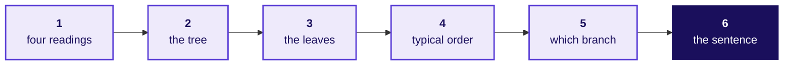
```mermaid
flowchart LR
    C1["<b>1</b><br/>four readings"] --> C2["<b>2</b><br/>the tree"] --> C3["<b>3</b><br/>the leaves"]
    C3 --> C4["<b>4</b><br/>typical order"] --> C5["<b>5</b><br/>which branch"] --> C6["<b>6</b><br/>the sentence"]
    classDef known fill:#EEEAFB,stroke:#5B3FD6,color:#1A0F5C,stroke-width:2px
    classDef bet fill:#1A0F5C,stroke:#1A0F5C,color:#FFFFFF
    class C1,C2,C3,C4,C5 known
    class C6 bet
```

```notes
LIVE, 3 minutes. Point at each chapter once. Each ends on a number written onto the board tree,
and each has a wrong number that looks right; an analyst's job is to catch those before a CEO acts on one.
Chapters 1 to 4 run this morning, with the break before chapter 4; 5 and 6 open the afternoon.
Transition: chapter 1, which total is sales.
```

---

## SECTION 1: Four readings of sales
*Thirty orders add up to more than one honest total, and a number without its definition misleads.*

```notes
LIVE, 30 minutes: the need (3), the options (5), the build (8, with 2 for the TypeError if it
happens), the trap (7), the second route (4), Kavya's review (3). Notebook 01 is the demonstration.
```

---

## S9. Meera wants one number called sales
*The file holds 30 orders from 1 July to 26 September, each delivered, returned or cancelled.*

**The client asks.** "What is 'sales' made of?"

| | |
|---|---|
| The metric at stake | Sales, the base every growth percentage is measured from |
| Who asks | Meera, and behind her Anand, whose books it must match |
| What a wrong number costs | A plan measured from demand that never became a sale |

```notes
LIVE, 2 minutes. Ask the room to name what "sales" could mean before the next slide and write the
answers on the board. Most name booked revenue first; somebody says "what we delivered".
Transition: a real retailer publishes two of them for the same quarter.
```

---

## S10. Reliance Retail publishes two totals a quarter
*Gross revenue and revenue from operations, with GST recovered as the step between them.*

```stats
value: Rs 90,408 cr | label: gross revenue | note: quarter to June 2026
value: Rs 79,745 cr | label: revenue from operations | note: the same quarter
value: GST | label: the step between | note: collected for the state
```

Source: Reliance Industries media release, 17 July 2026. Two correct numbers for one quarter is normal in retail, which is why every number carries its definition.

```notes
LIVE, 1 minute. The company is real and the numbers are its own. The point to make is
that the largest retailer in India states which revenue it means.
Transition: four ways the team could answer Meera.
```

---

## S11. Four ways to answer, and one best fit
*Each option sized on this file: rows touched, time, and what it gets wrong.*

| Option | Rows | Time | Error on this file |
|---|---|---|---|
| A. Add every amount and send it | 30 | under a second | It counts the 4 cancelled orders as sales. |
| B. Sum by status, with the bridge | 30 | under a second | None, once the bridge lands. |
| C. Ask Finance for the books | none | a day or more | None, on Finance's definition. |
| D. Tick orders off by hand | 30 | ten minutes | A typo can hide in any of 30 cells. |

**The rule.** B is the best fit: one pass gives all three readings and names every rupee between them. Finance's definition of the plan's base would decide which of B's totals goes in the note.

```notes
LIVE, 5 minutes. Walk the four. D is fine at 30 rows and impossible at 30 lakh; C is the right
answer for the board and too slow for a first look. What would change the call: Finance has fixed
the definition the 15 percent plan was set on.
Transition: build B.
```

---

## S12. Each reading of sales removes one status
*Booked keeps everything, and each step down removes what never became a sale.*

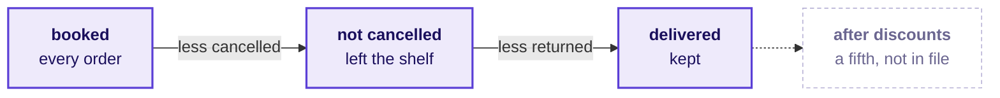
```mermaid
flowchart LR
    B["<b>booked</b><br/>every order"] -->|"less cancelled"| N["<b>not cancelled</b><br/>left the shelf"]
    N -->|"less returned"| D["<b>delivered</b><br/>kept"]
    D -.-> X["<b>after discounts</b><br/>a fifth, not in file"]
    classDef known fill:#EEEAFB,stroke:#5B3FD6,color:#1A0F5C,stroke-width:2px
    classDef unknown fill:#FFFFFF,stroke:#B8B2D6,color:#6B6690,stroke-dasharray:4 3
    class B,N,D known
    class X unknown
```

The file has no discount field, so sales after discounts cannot be computed from it.

```notes
LIVE, 1 minute. Draw this chain under the board tree. An engineer who can say what the data
cannot answer saves the CEO from a guess.
Transition: open notebook 01.
```

---

## S13. Question: which reading comes out largest?
*One loop keeps three sums: booked, not cancelled and delivered.*

```python
for order in ORDERS:
    amount = int(order["amount"])
    readings["booked"] += amount
    if order["status"] != "cancelled":
        readings["not cancelled"] += amount
    if order["status"] == "delivered":
        readings["delivered"] += amount
```

**Question.** Which rupee reading is largest: a) delivered, b) not cancelled, c) booked, or d) all three are equal?

```notes
LIVE, 2 minutes. Predict before running; take letters by hand. Most say c; some say a because
"only delivered is real", which confuses the largest with the truest. When the room runs the
notebook's first loop it stops on a TypeError, because one amount is stored as text. Give it two
minutes, no more: read the last line bottom up (the kind of error, the operation, the two types),
have each learner print the loop variable on their own screen without reading the record out,
apply int() as the loop above does, and move on. Wednesday asks why.
Transition: run it.
```

---

## S14. Answer: booked, then not cancelled, then delivered
*The three differ by Rs 24,020 across 9 orders.*

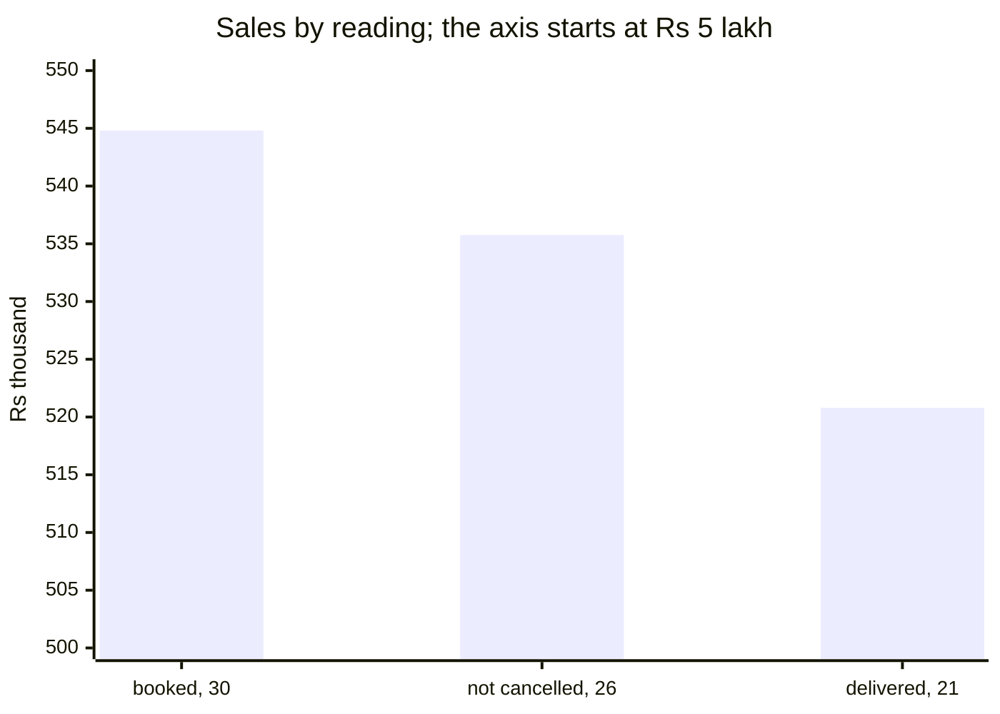
```mermaid
xychart-beta
    title "Sales by reading; the axis starts at Rs 5 lakh"
    x-axis ["booked, 30", "not cancelled, 26", "delivered, 21"]
    y-axis "Rs thousand" 500 --> 550
    bar [544.81, 535.76, 520.79]
```

The answer is c: booked Rs 5,44,810, not cancelled Rs 5,35,760, delivered Rs 5,20,790. The order count, 30, is the fourth reading.

```notes
LIVE, 3 minutes. Read the three with their order counts. Ask which goes in front of Meera, take
two answers and leave them open.
Transition: the one a hurried analyst sends.
```

---

## S15. Wrong answer: sales of Rs 5,44,810 from all 30
*The biggest number, sent without a definition, reaches the CEO first.*

**The plausible wrong answer.** A colleague's first draft to Meera: "Sales this quarter: Rs 5,44,810 on 30 orders."

```stats
value: Rs 5,44,810 | label: reported as sales | note: every order in the file
value: 4 | label: cancelled orders inside it | note: Rs 9,050 never sold
value: 10 | label: store orders | note: the baseline takes all of them
```

The arithmetic is right, and a growth plan built on it counts demand that never arrived as a baseline to beat.

```notes
LIVE, 3 minutes. Present it confidently, as the hurried analyst would. Ask what is wrong before
the next slide, then what decision it misleads: store looks busier than it was.
Transition: the check that catches it.
```

---

## S16. Count by status before summing: all 4 are store
*A count by channel and status shows where the cancellations sit.*

| Channel | Delivered | Returned | Cancelled |
|---|---|---|---|
| App | 10 | 0 | 0 |
| Web | 5 | 5 | 0 |
| Store | 6 | 0 | 4 |

**The rule.** Count the statuses before adding the amounts, and write the definition beside every total.

```notes
LIVE, 2 minutes. The check counts orders before anything is summed. Store's 10 orders overstate its kept orders
by 4 in 10. The five returns did become sales and came back, which is why they stay in "not
cancelled" and leave "delivered".
Transition: the fix, as a bridge.
```

---

## S17. Fix: the definition beside the number
*A bridge walks from booked to delivered, so every rupee that leaves is named.*

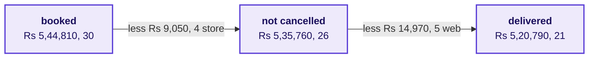
```mermaid
flowchart LR
    B["<b>booked</b><br/>Rs 5,44,810, 30"] -->|"less Rs 9,050, 4 store"| N["<b>not cancelled</b><br/>Rs 5,35,760, 26"]
    N -->|"less Rs 14,970, 5 web"| D["<b>delivered</b><br/>Rs 5,20,790, 21"]
    classDef known fill:#EEEAFB,stroke:#5B3FD6,color:#1A0F5C,stroke-width:2px
    class B,N,D known
```

The sentence for Meera names the definition first: "Sales this quarter, net of cancellations, were Rs 5,35,760 on 26 orders."

```notes
LIVE, 2 minutes. Write the two totals on the root of the board tree with their definitions.
Transition: the same numbers another way.
```

---

## S18. A second route: sums by status, then combine
*Rupees added under each status, then each reading built from the statuses.*

```python
by_status = {}
for order in ORDERS:
    by_status[order["status"]] = by_status.get(order["status"], 0) + int(order["amount"])
not_cancelled = by_status["delivered"] + by_status["returned"]
```

**The rule.** The two routes must agree to the rupee. Group by status when a new status may appear, since it needs no new if; write each reading out when a reader must see the definition.

```notes
LIVE, 4 minutes. Run the notebook's second-route cell; its three checks assert the routes agree.
When to switch: a part-refund status tomorrow breaks the one-loop route and not this one. At a
million rows both become one GROUP BY status, which Week 2 teaches.
Transition: Kavya's review.
```

---

## S19. Chapter 1 puts one honest number on the tree
*The root now carries a total with its definition, and the branches are still empty.*

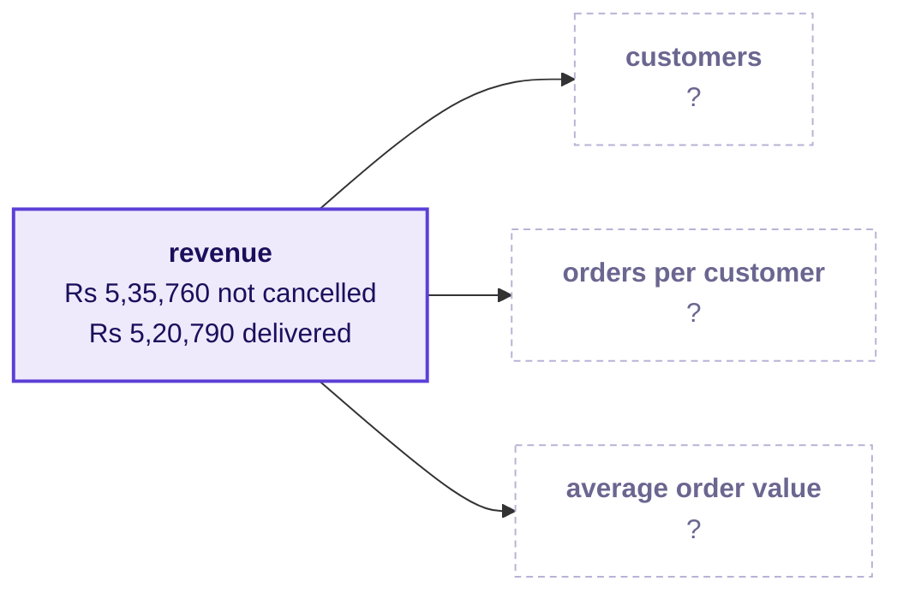
```mermaid
flowchart LR
    R["<b>revenue</b><br/>Rs 5,35,760 not cancelled<br/>Rs 5,20,790 delivered"] --> C["<b>customers</b><br/>?"]
    R --> F["<b>orders per customer</b><br/>?"]
    R --> A["<b>average order value</b><br/>?"]
    classDef known fill:#EEEAFB,stroke:#5B3FD6,color:#1A0F5C,stroke-width:2px
    classDef unknown fill:#FFFFFF,stroke:#B8B2D6,color:#6B6690,stroke-dasharray:4 3
    class R known
    class C,F,A unknown
```

**Kavya's review.** "You found Rs 9,050 that was never a sale by counting before adding. Which definition Meera plans on is her call; your job is to make sure she can see which one she is reading."

**In the interview.** [F] What counts as "sales": booked, net of cancellations, or delivered, and which do you give a CEO?

```notes
LIVE, 3 minutes. Kavya Nair is the team's senior analyst; her review closes every chapter. One
learner answers the interview question aloud in under a minute: name the readings, say what each
answers, choose one for the decision and state the others.
Transition: chapter 2, the tree as metrics.
```

---

## SECTION 2: The tree as metrics
*A branch helps Meera only when it is a fraction on one definition and one window.*

```notes
LIVE, 30 minutes: the need (3), the options (6), the build (4), the trap (9), the second route
(5), Kavya's review (3). Notebook 02 is the demonstration.
```

---

## S20. Meera needs the branches, each as a fraction
*Revenue is customers, times orders per customer, times average order value.*

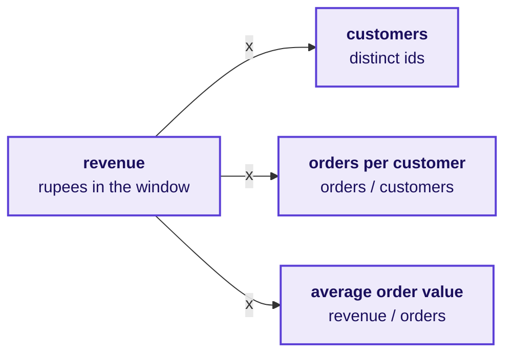
```mermaid
flowchart LR
    R["<b>revenue</b><br/>rupees in the window"] -->|"x"| C["<b>customers</b><br/>distinct ids"]
    R -->|"x"| F["<b>orders per customer</b><br/>orders / customers"]
    R -->|"x"| A["<b>average order value</b><br/>revenue / orders"]
    classDef known fill:#EEEAFB,stroke:#5B3FD6,color:#1A0F5C,stroke-width:2px
    class R,C,F,A known
```

| | |
|---|---|
| The metric at stake | AOV, revenue over orders, the first branch the file can measure |
| Who asks | Meera for the tree; marketing, whose payback values each new order |
| What a wrong number costs | A tree that multiplies to revenue nobody booked |

```notes
LIVE, 2 minutes. Check the multiplication with units on the board: customers times orders per
customer gives orders; orders times revenue per order gives rupees. The denominators cancel.
Transition: a real company that reports its tree this way.
```

---

## S21. Jio reports its revenue as a tree
*Subscribers times revenue per user: customers times what each one brings.*

```stats
value: 533 million | label: Jio subscribers | note: quarter to June 2026
value: Rs 215.6 | label: revenue per user | note: a month
value: 1.6% | label: monthly churn | note: the leak
```

Source: Reliance Industries media release, 17 July 2026. A telecom's tree has two branches and a leak; a retailer's has three branches and two leaks.

```notes
LIVE, 1 minute. Kalpa Connect is the Jio-like unit and arrives in Build 3. The point here is the
shape: a company reports its branches, each as a fraction, and investors multiply them.
Transition: which tree this file can fill.
```

---

## S22. The file fills the three-branch tree
*Four trees a team could draw, sized by the fields each needs.*

| Option | Needs | In this file? |
|---|---|---|
| A. Orders x AOV | amount | Yes, and it hides who buys. |
| B. Customers x frequency x AOV | amount, customer id | Yes. |
| C. B with items, price and discounts | items, prices, discounts | No. |
| D. A funnel from visits to orders | sessions or footfall | No. |

**The rule.** B is the best fit: the deepest tree this file fills, with marketing's branch beside the two it competes with. Order lines with items and prices would move the call to C.

```notes
LIVE, 6 minutes. The sizing here counts fields: the file's seven fields fill A and B.
Ask what data would let us draw C; the order-items table arrives later in the programme.
Transition: build B's first branch.
```

---

## S23. AOV is Rs 18,160, and the tree multiplies back
*Orders times AOV lands exactly on booked revenue, because AOV was made from it.*

```stats
value: 30 | label: orders | note: the booked definition
value: Rs 5,44,810 | label: booked revenue | note: chapter 1
value: Rs 18,160 | label: AOV | note: 5,44,810 over 30
```

**The rule.** The product always lands on revenue, so a wrong leaf never shows in the total and shows only in the split.

```notes
LIVE, 4 minutes. Predict first: what does 30 times Rs 18,160 give? Exactly booked revenue. Write
Rs 18,160 on the board tree in pencil with a question mark; Anand's warning is about this number.
Transition: what goes wrong when two reports feed one fraction.
```

---

## S24. Question: booked rupees over delivered orders?
*Finance reports booked revenue; the operations dashboard counts delivered orders.*

**Question.** A hurried analyst divides Finance's Rs 5,44,810 by the dashboard's 21 delivered orders. The AOV is: a) Rs 18,160, b) Rs 24,800, c) Rs 25,943, or d) Rs 23,687?

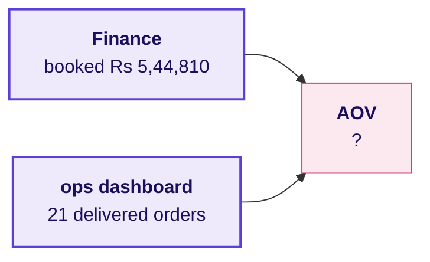
```mermaid
flowchart LR
    F["<b>Finance</b><br/>booked Rs 5,44,810"] --> X["<b>AOV</b><br/>?"]
    O["<b>ops dashboard</b><br/>21 delivered orders"] --> X
    classDef bad fill:#FBE9EF,stroke:#D63A6A,color:#1A0F5C
    classDef known fill:#EEEAFB,stroke:#5B3FD6,color:#1A0F5C,stroke-width:2px
    class F,O known
    class X bad
```

```notes
LIVE, 2 minutes. Letters by hand. Most compute it and get c; the question is whether anyone
objects to the division itself.
Transition: the answer, and what it does to the tree.
```

---

## S25. Answer: Rs 25,943, which matches no definition
*Multiplied back on 30 orders it claims Rs 7,78,300 that nobody booked.*

**The plausible wrong answer.** A colleague's note to marketing: "Our average order is Rs 25,943."

```stats
value: Rs 25,943 | label: the mixed AOV | note: booked rupees / delivered orders
value: Rs 7,78,300 | label: what it multiplies to | note: 43% above booked
value: Rs 24,800 | label: delivered AOV | note: delivered / delivered
```

The numerator keeps the rupees of 9 cancelled and returned orders while the denominator has dropped those orders.

```notes
LIVE, 4 minutes. The answer is c. What it would mislead: marketing's payback case values each new
customer's order at Rs 25,943. The error is invisible until something is multiplied back.
Transition: the one-line check.
```

---

## S26. Check: AOV x the orders summed gives revenue
*On one definition the identity holds; on a mixed one it lands on nothing.*

| Fraction | AOV | x the orders the revenue covers | Gives that revenue back? |
|---|---|---|---|
| Booked / booked | Rs 18,160 | Rs 5,44,810 | Yes, booked revenue. |
| Delivered / delivered | Rs 24,800 | Rs 5,20,790 | Yes, delivered revenue. |
| Booked / delivered | Rs 25,943 | Rs 7,78,300 | No. |

**The rule.** One definition per fraction; ask each report what it counts before you divide.

```notes
LIVE, 3 minutes. The fix and what changed: two honest AOVs, Rs 18,160 booked and Rs 24,800
delivered, each with its definition; the mixed one goes nowhere.
Transition: the same AOV another way.
```

---

## S27. A second route: AOV is the mean of the amounts
*Revenue over orders and the mean of the 30 amounts are one number.*

```python
aov = revenue / orders                       # from the totals
mean_route = sum(amounts) / len(amounts)      # from the rows
statistics.fmean(amounts)                     # from the library
```

**The rule.** Totals route when a report holds them; rows route when you hold the rows. Chapter 4 asks whether the mean is the right middle at all.

```notes
LIVE, 5 minutes. The notebook asserts all three agree. The real switch is the one chapter 4
makes: for "what does a typical order look like", the mean may be the wrong middle.
Transition: Kavya's review.
```

---

## S28. Chapter 2 names three branches the file lacks
*Items, price and discounts are not in this extract, and saying so is part of the answer.*

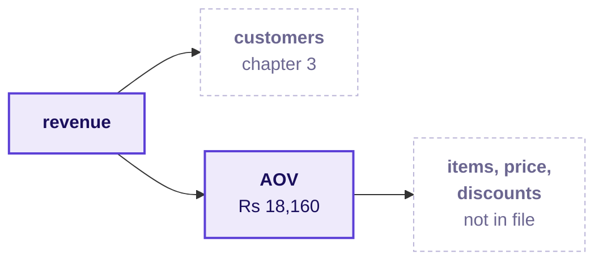
```mermaid
flowchart LR
    R["<b>revenue</b>"] --> C["<b>customers</b><br/>chapter 3"]
    R --> A["<b>AOV</b><br/>Rs 18,160"]
    A --> I["<b>items, price,<br/>discounts</b><br/>not in file"]
    classDef known fill:#EEEAFB,stroke:#5B3FD6,color:#1A0F5C,stroke-width:2px
    classDef unknown fill:#FFFFFF,stroke:#B8B2D6,color:#6B6690,stroke-dasharray:4 3
    class R,A known
    class C,I unknown
```

**Kavya's review.** "You gave me each branch as a numerator over a denominator and told me which three this file cannot fill, so I know which ones I can plan on."

**In the interview.** [S] How would you increase sales for an online retailer?

```notes
LIVE, 3 minutes. One learner answers aloud: draw the tree, measure each branch on one window and
definition, find the short one, then place initiatives on it.
Transition: chapter 3, counting the customer branches.
```

---

## SECTION 3: The leaves, counted
*Customers and how often they buy, counted from 30 rows, and the tree multiplied back.*

```notes
LIVE, 30 minutes: the need (3), the options (5), the build (8), the trap (9), the second route
(3), Kavya's review (2); the delivered leaves sit in S35's notes; cut them first. Notebook 03 is the demonstration.
```

---

## S29. If nobody comes back, acquisition is the branch
*The customers branch is the one the Rs 12 crore buys, so it is the first leaf to get right.*

**The client asks.** "Is acquisition even the branch that is short?"

| | |
|---|---|
| The metric at stake | Customers, and orders per customer: orders over distinct customers |
| Who asks | Meera; the marketing lead and the head of Retail-Plus, who own the two branches |
| What a wrong number costs | "Nobody comes back" makes Rs 12 crore look like the only way to grow |

```notes
LIVE, 2 minutes. Ask: if nobody ever came back, what would orders per customer be? Exactly 1.
Keep that thought for the trap.
Transition: a real retailer's customer count, and its denominator.
```

---

## S30. Reliance counts 396 million registered customers
*A registered customer is a denominator of its own, and which people you count is the question.*

```stats
value: 396 million | label: registered customers | note: Reliance Retail, 30 June 2026
value: 20,169 | label: stores | note: the same date
```

Source: Reliance Industries media release, 17 July 2026. Divide a quarter's orders by registered customers and you get a different, smaller metric than orders per customer who ordered.

```notes
LIVE, 1 minute. The point is the denominator: registered, active and ordering customers are three
different counts, and each gives a different rate.
Transition: four ways to count customers.
```

---

## S31. A dictionary counts customers and repeats at once
*Four ways to count customers on 30 rows, and what each can answer.*

| Option | Passes | Answers |
|---|---|---|
| A. `len(ORDERS)` | none | How many orders there are, which is not customers. |
| B. `len(set(ids))` | one | How many customers there are. |
| C. A dictionary of orders per id | one | How many customers, how many orders each, who came back. |
| D. Sort the ids and count changes | a sort and a pass | How many customers, and it is easy to miscount by hand. |

**The rule.** C is the best fit because one pass fills both customer branches and names the repeat buyers. At millions of rows it becomes one COUNT(DISTINCT) in the warehouse.

```notes
LIVE, 5 minutes. B is right when only the count is needed. The switch to SQL is Week 2's.
Transition: build it.
```

---

## S32. Question: of 23 customers, how many came back?
*A dictionary keyed by customer id counts each one's orders in one pass.*

```python
counts = {}
for order in ORDERS:
    cid = order["customer_id"]
    counts[cid] = counts.get(cid, 0) + 1
```

**Question.** How many of the 23 bought more than once: a) none, b) 7, c) 16, or d) 23?

```notes
LIVE, 3 minutes. Letters by hand. Some say 16, confusing one-time with repeat.
Transition: the answer.
```

---

## S33. Answer: 7 came back, and 16 bought once
*Every branch is now measured, and the tree multiplies back to booked revenue.*

```stats
value: 23 | label: customers | note: distinct ids
value: 1.30 | label: orders per customer | note: 30 / 23
value: 7 | label: came back | note: 16 bought once
```

**The rule.** 23 x 1.30 x Rs 18,160 = Rs 5,44,810. The answer is b; here orders less customers equals repeat buyers only because nobody bought three times.

```notes
LIVE, 5 minutes. Write 23 and 1.30 on the board tree. Note one repeat customer carries two
segments because the segment sits on each order.
Transition: the count a colleague sent first.
```

---

## S34. Wrong answer: 30 customers, nobody comes back
*A colleague's first draft divided orders by the number of rows: 1.00 each.*

**The plausible wrong answer.** "30 customers placed 30 orders: 1.00 each, so nobody comes back."

```stats
value: 30 | label: customers, as counted | note: the number of rows
value: 1.00 | label: orders per customer | note: 30 / 30
value: Rs 12 cr | label: what it justifies | note: acquisition as the only branch
```

The division is correct and its denominator is wrong: a row is an order, and one customer can place several.

```notes
LIVE, 4 minutes. Present it as the figure a colleague's first draft sent Meera before the room built
the count: the case for the budget, made by a counting slip. Ask what would check it before the
next slide.
Transition: the check.
```

---

## S35. A set counts distinct ids: 23 customers
*The same column counted as a list and as a set gives 30 and 23.*

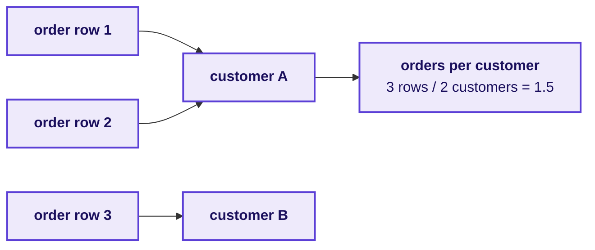
```mermaid
flowchart LR
    O1["<b>order row 1</b>"] --> P1["<b>customer A</b>"]
    O2["<b>order row 2</b>"] --> P1
    O3["<b>order row 3</b>"] --> P2["<b>customer B</b>"]
    P1 --> F["<b>orders per customer</b><br/>3 rows / 2 customers = 1.5"]
    classDef known fill:#EEEAFB,stroke:#5B3FD6,color:#1A0F5C,stroke-width:2px
    class O1,O2,O3,P1,P2,F known
```

`len(ids)` is 30 and `len(set(ids))` is 23: seven orders came from people who had already bought.

```notes
LIVE, 5 minutes. A set keeps each value once however often it is added. The fix: 30 / 23 = 1.30
orders per customer, and frequency is a live branch. On delivered orders the same count gives 19
customers, 1.11 each, and 2 who kept two; the escalated case this afternoon rebuilds on that.
Transition: the same rate by a second route.
```

---

## S36. A second route: the mean of the counts
*Orders per customer is also the average of the dictionary's values.*

```python
second_route = sum(counts.values()) / len(counts)   # 1.30, the same rate
```

**The rule.** The ratio route needs two counts; the counts route needs the rows and also shows the spread, 16 at one and 7 at two, which the ratio hides.

```notes
LIVE, 3 minutes. The notebook asserts the two agree and that the dictionary's keys are the set.
Use the counts whenever someone will ask how many came back.
Transition: Kavya's review.
```

---

## S37. Chapter 3 fills both customer branches
*23 customers, 1.30 orders each, 7 came back, and the tree multiplies back.*

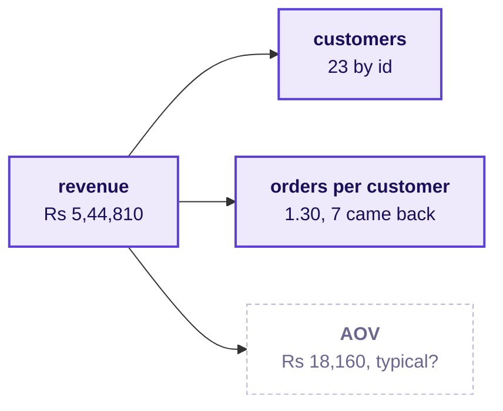
```mermaid
flowchart LR
    R["<b>revenue</b><br/>Rs 5,44,810"] --> C["<b>customers</b><br/>23 by id"]
    R --> F["<b>orders per customer</b><br/>1.30, 7 came back"]
    R --> A["<b>AOV</b><br/>Rs 18,160, typical?"]
    classDef known fill:#EEEAFB,stroke:#5B3FD6,color:#1A0F5C,stroke-width:2px
    classDef unknown fill:#FFFFFF,stroke:#B8B2D6,color:#6B6690,stroke-dasharray:4 3
    class R,C,F known
    class A unknown
```

**Kavya's review.** "Your first 30 was a count of rows, divided as if it were people. A count of people comes from their ids, and every rate you send upstairs names its denominator."

**In the interview.** [F] Your extract shows 30 orders and 30 customers; what do you check before saying nobody comes back?

```notes
LIVE, 2 minutes. One learner answers aloud: rows against distinct ids, then the window, then
whether one person can carry two ids.
Transition: a 10-minute break, then chapter 4.
```

---

## SECTION 4: The typical order
*Anand said no averages, and one order is about to show why.*

```notes
LIVE, 30 minutes after the break: the need (3), the options (5), the build (5), the trap with the
sort and the fix (10), the second route (4), Kavya's review (3). Notebook 04 is the demonstration.
```

---

## S38. A first order's worth decides the payback
*The payback case values each new customer by the order they will place.*

**The client asks.** "What does a typical order look like?"

> "No averages. One business customer can move an average." Anand Iyer, finance controller

| | |
|---|---|
| The metric at stake | The typical order, which marketing's payback credits to every new customer |
| Who asks | Meera and the marketing lead; Anand, who warned against averages |
| What a wrong number costs | A first order valued eight times too high, and a payback that looks short |

```notes
LIVE, 2 minutes. Read Anand's line again; now it is testable.
Transition: a real company's reported order value.
```

---

## S39. Blinkit reports AOV, a mean, for totals
*A reported average order value is the right number for totals across millions of orders.*

```stats
value: Rs 518 | label: Blinkit net AOV | note: quarter to June 2026
value: 2,443 | label: dark stores | note: the same quarter
```

Source: MediaNama on Eternal's results, 24 July 2026. The mean is the right number for totals and the wrong one for one shopper's basket when a few very large orders share the file.

```notes
LIVE, 1 minute. A mean over millions of similar small baskets describes them well; a mean over 30
orders with one very large one does not.
Transition: four middles.
```

---

## S40. Four middles, sized on one large order
*How far each moves when one invented Rs 90,000 order joins five invented small ones.*

| Option | Moves with one large order | Right when |
|---|---|---|
| A. Mean | By Rs 14,623, every rupee of it | Totals must multiply back. |
| B. Median | By Rs 50, one place in the sort | The question is what a typical order looks like. |
| C. Trimmed mean | By Rs 83, and it needs a rule | There is a stated rule for how many to drop. |
| D. Mean per customer type | Not at all within a type | Each type gets its own plan. |

**The rule.** B for the typical order, with A beside it for the total. D answers better when marketing prices the payback per customer type, which the second case tests. The numbers in this table are invented.

```notes
LIVE, 5 minutes. The invented set is five orders from Rs 1,900 to Rs 2,600 plus one of Rs 90,000;
the notebook's sizing cell draws the three moves.
Transition: build the median.
```

---

## S41. The build: the median is Rs 2,205
*Sort the 30 amounts and take halfway between the 15th and the 16th.*

```stats
value: Rs 2,205 | label: median order | note: halfway between Rs 2,110 and Rs 2,300
value: 8.2 | label: mean over median | note: one order does it
```

**The rule.** When the mean is eight times the median, sort the file before quoting either.

```notes
LIVE, 5 minutes. Write Rs 2,205 on the board tree beside the pencilled Rs 18,160. The median runs
Rs 2,205 booked, Rs 2,100 not cancelled, Rs 2,060 delivered; the mean runs Rs 18,160 to Rs 24,800.
Notebook 04 step 2 builds option C on Kalpa's own orders: a trimmed mean of Rs 2,300.
Transition: the number marketing sent first.
```

---

## S42. Wrong answer: a typical order is Rs 18,160
*The mean, as it appears on marketing's slide.*

**The plausible wrong answer.** "A typical Kalpa order is Rs 18,160, and so is each new customer's first order."

```stats
value: Rs 18,160 | label: the mean | note: total over count
value: 1 of 30 | label: orders above it | note: 29 sit below
```

Valued at Rs 18,160, a new customer looks about eight times more valuable than the orders Kalpa takes, and Rs 12 crore looks cheap.

```notes
LIVE, 4 minutes. Present it as marketing's slide, which reached Meera before the room built the median; the
room's job is to name the check. Ask first how many orders sit above the mean; most say about half. The check is
that count: one.
Transition: see it.
```

---

## S43. The check: 29 of 30 orders sit below the mean
*Notebook 04 draws every amount as a dot; here, where they sit against the mean.*

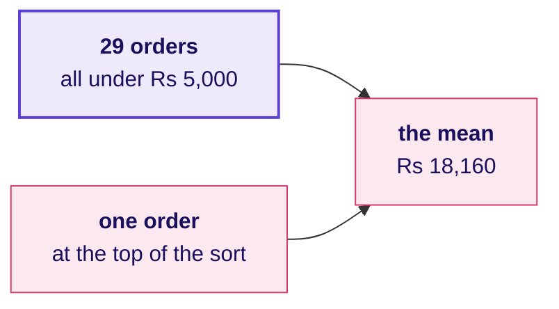
```mermaid
flowchart LR
    P["<b>29 orders</b><br/>all under Rs 5,000"] --> M["<b>the mean</b><br/>Rs 18,160"]
    T["<b>one order</b><br/>at the top of the sort"] --> M
    classDef known fill:#EEEAFB,stroke:#5B3FD6,color:#1A0F5C,stroke-width:2px
    classDef bad fill:#FBE9EF,stroke:#D63A6A,color:#1A0F5C
    class P known
    class T,M bad
```

The dots pile up below Rs 5,000 and the mean stands far to the right of them.

```notes
LIVE, 4 minutes. Show the strip chart in notebook 04. Then every learner types the sort in the
empty cell and finds what sits at the top on their own screen. Do not read the record out; ask
what kind of order it must be.
Transition: the middle one order cannot drag.
```

---

## S44. Fix: send the median, and say which order
*The typical order is Rs 2,205, the mean stays for totals, and the top order gets its own line.*

```stats
value: Rs 2,205 | label: the typical order | note: the median, booked
value: 8x | label: overstated | note: a typical order, credited at the mean
```

**The rule.** Report the median for the typical order and the mean for the total, and say which order separates them. A payback needs a mean, from the segment the spend targets, with the one-off large order set aside.

```notes
LIVE, 2 minutes. What changed: the typical order is Rs 2,205, and the slide's Rs 18,160 overstates it
eightfold. The payback itself is rebuilt on the consumer segment's mean, which chapter 5 uses.
Rub out the pencilled Rs 18,160 on the board tree and leave Rs 2,205.
Transition: the median another way.
```

---

## S45. A second route: statistics.median agrees
*The library holds the even-count rule, and must match the hand-written middle.*

```python
ranked = sorted(amounts)
median = (ranked[14] + ranked[15]) / 2      # 2205.0, by hand
statistics.median(amounts)                  # 2205.0, the library
```

**The rule.** Write the middle once by hand so the even-count rule is yours; then use the library, and in Week 2 PERCENTILE_CONT(0.5) and pandas median.

```notes
LIVE, 4 minutes. The notebook asserts agreement on all three definitions.
Transition: Kavya's review, and the tree after the morning.
```

---

## S46. The morning's tree points at frequency
*Every branch measured and named: 16 of 23 bought once, and a typical order is Rs 2,205.*

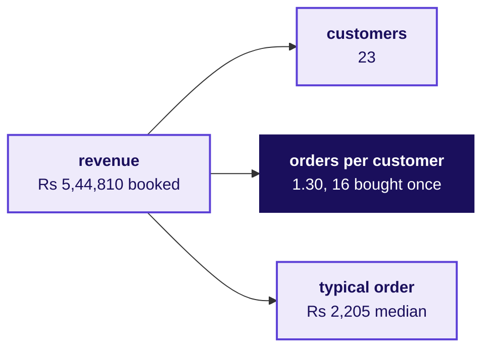
```mermaid
flowchart LR
    R["<b>revenue</b><br/>Rs 5,44,810 booked"] --> C["<b>customers</b><br/>23"]
    R --> F["<b>orders per customer</b><br/>1.30, 16 bought once"]
    R --> A["<b>typical order</b><br/>Rs 2,205 median"]
    classDef known fill:#EEEAFB,stroke:#5B3FD6,color:#1A0F5C,stroke-width:2px
    classDef bet fill:#1A0F5C,stroke:#1A0F5C,color:#FFFFFF
    class R,C,A known
    class F bet
```

**Kavya's review.** "Anand said no averages and you know why. Put the median in the sentence, say the mean is eight times higher, and say one order does it."

**In the interview.** [S] Mean or median for order value, and why?

```notes
LIVE, 3 minutes. One learner answers aloud. Leave the tree on the board over lunch; chapter 5
opens on it and asks which branch Meera opens first.
```
