# The question before the budget

Week 1, Day 1. Half one.

Kicker: WEEK 1  ·  MONDAY  ·  MORNING
Quote: Before I sign anything, I want to understand our own sales. Is acquisition even the branch that is short?
Who: Meera Raghavan, CEO, Kalpa Retail, to the data and AI team at Kalpa's Global Capability Centre

```notes
On screen before the clock starts. Leave Meera's words up while the room settles and do not explain
them yet: the next slide sets out the questions that climb to her answer, and the story ends on her
full message. Say once that Kalpa is fictional and the whole programme is set inside it, and that
the first 45 minutes are about the business, with no laptop open.
Transition: the day's question, and the nine questions that climb to its answer.
```

---

## S1. Nine questions climb to Meera's answer
*Before Meera signs Rs 12 crore for new customers, is acquisition even the branch of sales that is short?*

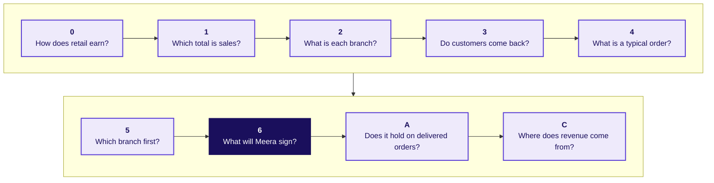
```mermaid
flowchart TB
    subgraph AM[" "]
        direction LR
        C0["<b>0</b><br/>How does retail earn?"] --> C1["<b>1</b><br/>Which total is sales?"] --> C2["<b>2</b><br/>What is each branch?"] --> C3["<b>3</b><br/>Do customers come back?"] --> C4["<b>4</b><br/>What is a typical order?"]
    end
    subgraph PM[" "]
        direction LR
        C5["<b>5</b><br/>Which branch first?"] --> C6["<b>6</b><br/>What will Meera sign?"] --> CA["<b>A</b><br/>Does it hold on delivered orders?"] --> CC["<b>C</b><br/>Where does revenue come from?"]
    end
    AM --> PM
    classDef known fill:#EEEAFB,stroke:#5B3FD6,color:#1A0F5C,stroke-width:2px
    classDef bet fill:#1A0F5C,stroke:#1A0F5C,color:#FFFFFF
    class C0,C1,C2,C3,C4,C5,CA,CC known
    class C6 bet
```

```notes
LIVE, 1 minute. Read the day's question once, then the nine short questions in order: the story
first, chapters 1 to 4 this morning with a break before chapter 4, and chapters 5 and 6 and the two
cases after lunch. Each chapter ends on a number, the next chapter asks the question that number
raises, and the afternoon closes on the sentence Meera signs. Answer nothing yet.
Ask: if you had to answer Meera by tonight, which of the nine would you start with? Take one answer
and leave it open.
Watch for anyone who jumps straight to "buy more customers" or "cut prices"; write it on the board
and say chapter 5 tests it.
Transition: before any data, the business, starting with how a retailer earns.
```

---

## SECTION 0: How does retail earn
*How does a retailer like Kalpa make money, who asks the data team for which number, and how is each number worked out?*

```notes
LIVE, 45 minutes in six parts, told from the talk track, trainer/C2_W01_D01_domain_story_TRAINER.md,
which holds what to say, the question for each part and the facts you may quote with their sources:
the map 1, the Saturday 7, the real companies 7, where Rs 100 goes 10, who asks 6, the tree 9, and
describing to acting 5; D8 and D9, the tree's ten formulas, are self-study. No laptop opens. Each part puts one drawing on the board, and the Rs 100
journey and the metric tree stay up all day. The story states every metric as a formula with what it
answers and who asks, and it stages no wrong number, since each of those belongs to a chapter.
Meera's ask follows in 4 minutes. The domain card goes out at the close of the afternoon.
Transition: the six questions the story answers.
```

---

## S2. The team needs the business first, in six questions
*Who needs to know how a retailer earns, and which questions get us there?*

**Who needs the answer.** Everyone on the data team: each of Kalpa's stakeholders asks us for a number, and an analyst who cannot say how the money moves cannot say which number answers them or what a wrong one costs.

```timeline
label: Part 1 | title: One Saturday | body: What happens at a Kalpa store and on its app in one day?
label: Part 2 | title: Real companies | body: Which real companies is Kalpa like?
label: Part 3 | title: Rs 100 | body: Where does Rs 100 at the checkout go?
label: Part 4 | title: Who asks | body: Who asks the data team for which number?
label: Part 5 | title: The tree | body: Which tree does every retail number hang off?
label: Part 6 | title: People and agents | body: How far may a system act with no person checking?
```

```notes
LIVE, 1 minute, the first of part 1's 8. Read the six questions aloud and say that the story
answers them in this order and then hands over to Meera's message. Nobody needs to write anything,
since each part leaves a drawing on the board.
Ask: which of the six have you wondered about as a shopper? Take one hand.
Watch for laptops opening; the story runs without them.
Transition: one Saturday at a Kalpa Retail store and on its app.
```

---

## S3. A Saturday runs from the shelf to Monday's page
*What happens on one Saturday at a Kalpa store and on its app?*

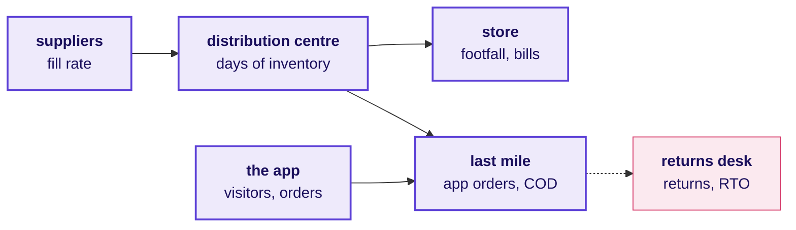
```mermaid
flowchart LR
    SUP["<b>suppliers</b><br/>fill rate"] --> DC["<b>distribution centre</b><br/>days of inventory"]
    DC --> ST["<b>store</b><br/>footfall, bills"]
    DC --> LM["<b>last mile</b><br/>app orders, COD"]
    APP["<b>the app</b><br/>visitors, orders"] --> LM
    LM -.-> RD["<b>returns desk</b><br/>returns, RTO"]
    classDef known fill:#EEEAFB,stroke:#5B3FD6,color:#1A0F5C,stroke-width:2px
    classDef bad fill:#FBE9EF,stroke:#D63A6A,color:#1A0F5C
    class SUP,DC,ST,APP,LM known
    class RD bad
```

Suppliers fill the distribution centre, which stocks the store and feeds the last mile; the app's orders ride the last mile, and what comes back goes to the returns desk.

```notes
LIVE, 7 minutes, the rest of part 1 of the talk track. Tell the Saturday: the store manager checks
every shelf against its planogram, and one check in twenty-five finds a gap; the truck brings 900 of
the 1,000 cases the cookware supplier was asked for; 1,200 people come through the doors and 480 pay
at a till, with an average bill of Rs 1,250. On the app the same day, 50,000 people open it 80,000
times, fill 8,000 carts and place 2,000 orders averaging Rs 1,500. Follow one Retail-Plus member's
basket: Rs 2,000 of goods, Rs 200 off in a promotion, Rs 1,800 paid with a card the app holds only
as a token. Next week the bedsheet comes back, and a cash-on-delivery parcel is refused at the door
and travels back as an RTO. On Monday the CEO reads one page.
Ask: think of the last thing you bought in a shop and the last thing you ordered on an app; which
one knew more about you, and what exactly did it know?
Watch for "the shop, because the staff know me": the staff may, and the till keeps only the bill.
Land it: the data team works where customers leave traces, and a store leaves far fewer than an app.
Draw the value chain on the board, six boxes left to right.
Transition: which real companies Kalpa is like.
```

---

## S4. Kalpa is built like Reliance, its stores like DMart
*Which real companies is Kalpa like?*

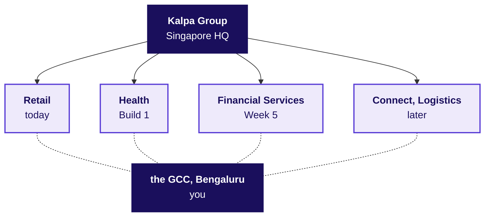
```mermaid
flowchart TB
    G["<b>Kalpa Group</b><br/>Singapore HQ"] --> R["<b>Retail</b><br/>today"]
    G --> H["<b>Health</b><br/>Build 1"]
    G --> F["<b>Financial Services</b><br/>Week 5"]
    G --> O["<b>Connect, Logistics</b><br/>later"]
    R & H & F & O -.- C["<b>the GCC, Bengaluru</b><br/>you"]
    classDef unit fill:#EEEAFB,stroke:#5B3FD6,color:#1A0F5C,stroke-width:2px
    classDef dark fill:#1A0F5C,stroke:#1A0F5C,color:#FFFFFF
    class R,H,F,O unit
    class G,C dark
```

Kalpa is fictional. Its stores work like DMart's and its app sells stock Kalpa owns, like DMart Ready, while Flipkart and Amazon India are marketplaces whose sellers own the goods.

```notes
LIVE, 7 minutes, part 2 of the talk track. Ask first: what does your phone company know about you
that a grocer would want? Listen for where you are through the day, the apps you open, how you pay
and your number.
Watch for "if both belong to one group, the grocer can simply use it": India's data protection law
ties each use of personal data to a purpose the person agreed to, so even inside one group the
purpose decides what one business may use.
Say that Kalpa Group is headquartered in Singapore and runs five businesses, and that its data and
engineering centre in Bengaluru, the Global Capability Centre, is the team the room has joined.
Reliance and Tata are real groups built like it: in the quarter to June 2026 Reliance reported Jio
with 533 million subscribers and Reliance Retail with 20,169 stores (Reliance Industries media
release, 17 July 2026). The centre works like the Indian centres of Walmart, Target, Tesco and
Lowe's, and Retail-Plus is Kalpa's paid tier, a membership of the kind Amazon Prime is.
Draw the group on the board, six boxes.
Transition: where the money from one basket goes.
```

---

## S5. Rs 100 of GMV leaves Rs 2.50 of EBITDA
*Where does Rs 100 ordered go before EBITDA, earnings before interest, tax, depreciation and amortisation?*

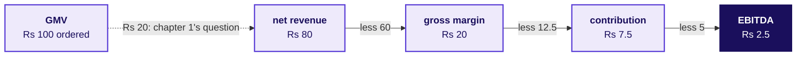
```mermaid
flowchart LR
    G["<b>GMV</b><br/>Rs 100 ordered"] -.->|"Rs 20: chapter 1's question"| N["<b>net revenue</b><br/>Rs 80"]
    N -->|"less 60"| M["<b>gross margin</b><br/>Rs 20"]
    M -->|"less 12.5"| C["<b>contribution</b><br/>Rs 7.5"]
    C -->|"less 5"| O["<b>EBITDA</b><br/>Rs 2.5"]
    classDef known fill:#EEEAFB,stroke:#5B3FD6,color:#1A0F5C,stroke-width:2px
    classDef dark fill:#1A0F5C,stroke:#1A0F5C,color:#FFFFFF
    class G,N,M,C known
    class O dark
```

| Step | Less | What goes |
|---|---|---|
| GMV to net revenue | Rs 20 | GMV is everything ordered at the price charged, net revenue is what Kalpa earns from the goods, and chapter 1 finds what sits between them. |
| Net revenue to gross margin | Rs 60 | The cost of the goods goes to suppliers. |
| Gross margin to contribution | Rs 12.5 | Each order pays for picking, packing, delivery, the payment fee and the offers that bring a customer back. |
| Contribution to EBITDA | Rs 5 | Stores, warehouses, technology, head office and the budget that wins new customers do not grow with one more order. |

```notes
LIVE, 10 minutes, part 3 of the talk track, the part never to cut. The numbers are illustrative.
Ask first: the member paid Rs 1,800, so how much of it does Kalpa keep as EBITDA: under Rs 20,
Rs 20 to 100, Rs 100 to 400, or more than Rs 400? Take hands for each range and leave the answer
open while the drawing goes up.
Say that GMV, gross merchandise value, is everything customers ordered at the prices they were
charged, and that finance reports a smaller number, net revenue, which is what Kalpa earns from the
goods; the two differ on purpose. Rs 100 of GMV becomes Rs 80 of net revenue, and what the Rs 20
between them is made of is the question chapter 1 opens on Kalpa's own orders, so it stays on the
board as a question. From net revenue take the cost of the goods and Rs 20 of gross margin is left;
take what every order costs and Rs 7.50 of contribution is left; take the costs that do not grow
with one more order and Rs 2.50 of EBITDA is left. Real retailers keep a thin slice: DMart reported
profit after tax of 4.8 percent of revenue for FY26 (Avenue Supermarts results release, 2 May 2026).
Then reveal the guess: on these illustrative numbers the basket keeps about Rs 50 as EBITDA, its
Rs 150 of contribution less about Rs 100 towards the costs that do not change with one more order.
If a learner asks how the basket reaches Rs 150, the first step, from the Rs 1,800 charged to what
Kalpa earns, is chapter 1's question.
Watch for rooms that guess high; they most need this part.
Add the marketplace sentence: a marketplace such as Flipkart or Amazon India books only its fees as
revenue, and a foreign-owned multi-brand e-commerce business selling to Indian consumers must run
that way under Press Note 2 of 2018.
Draw Rs 100's journey on the board, five boxes top to bottom, with the first arrow written as the
open question it is. It stays up all day.
Transition: who asks the data team for which number.
```

---

## S6. Six people already want a number from us
*Who asks the data team for which number, and what does a wrong one cost them?*

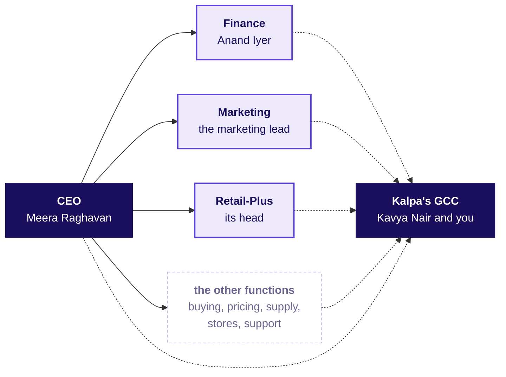
```mermaid
flowchart LR
    CEO["<b>CEO</b><br/>Meera Raghavan"] --> FIN["<b>Finance</b><br/>Anand Iyer"]
    CEO --> MKT["<b>Marketing</b><br/>the marketing lead"]
    CEO --> RP["<b>Retail-Plus</b><br/>its head"]
    CEO --> OTH["<b>the other functions</b><br/>buying, pricing, supply,<br/>stores, support"]
    FIN & MKT & RP & OTH -.-> GCC["<b>Kalpa's GCC</b><br/>Kavya Nair and you"]
    CEO -.-> GCC
    classDef known fill:#EEEAFB,stroke:#5B3FD6,color:#1A0F5C,stroke-width:2px
    classDef unknown fill:#FFFFFF,stroke:#B8B2D6,color:#6B6690,stroke-dasharray:4 3
    classDef dark fill:#1A0F5C,stroke:#1A0F5C,color:#FFFFFF
    class FIN,MKT,RP known
    class OTH unknown
    class CEO,GCC dark
```

| Who asks | What they want from us | What a wrong number costs |
|---|---|---|
| Meera, CEO | She wants to know where growth comes from and where it leaks. | She signs a budget for the wrong branch. |
| Anand, finance controller | He wants our numbers to match his books. | He restates a figure in front of the board. |
| The marketing lead | The lead wants to know whether Kalpa needs more customers. | A campaign budget is spent before anyone can take it back. |
| The head of Retail-Plus | The head wants to know whether the paid tier is slipping. | Members lapse while the wrong ones are protected. |

```notes
LIVE, 6 minutes, part 4 of the talk track. Name the six boxes: Meera Raghavan; Anand Iyer, the
finance controller; the marketing lead; the head of Retail-Plus; the other functions, which are
category buying, pricing, supply chain, store operations and customer support, where Farhan Sheikh
arrives in Week 8 with two thousand tickets a day; and Kavya Nair with us in the GCC, who checks
everything before it leaves the team. The data platform lead sits beside the GCC and wants the
warehouse queried, never exported.
Ask: if one of our numbers is wrong, whose mistake can we undo next week, and whose can we not?
Watch for "all of them, we send a correction": a correction fixes the dashboard, and the decision
taken on the wrong number stays taken.
Land it: before a number leaves the team, know who asked for it and whether being wrong can be
taken back.
Draw who asks on the board, six boxes. If short of time, draw it, ask once and move on.
Transition: the tree every retail number hangs off.
```

---

## S7. Revenue is customers x orders each x order value
*Which tree does every retail number hang off?*

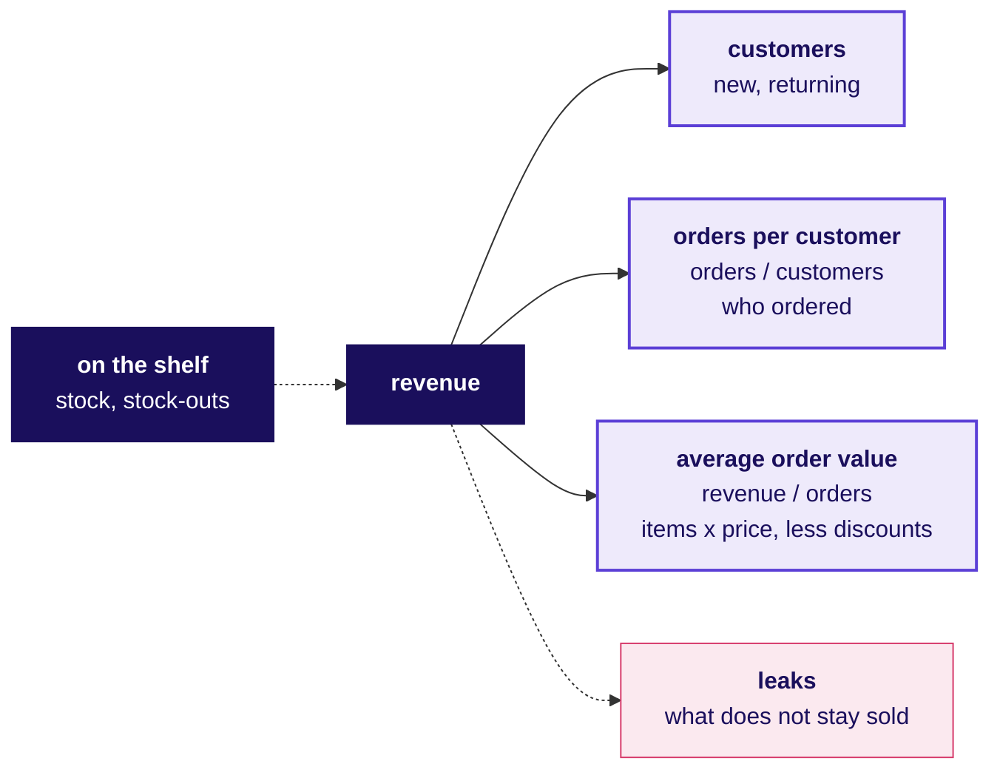
```mermaid
flowchart LR
    S["<b>on the shelf</b><br/>stock, stock-outs"] -.-> R["<b>revenue</b>"]
    R --> C["<b>customers</b><br/>new, returning"]
    R --> F["<b>orders per customer</b><br/>orders / customers<br/>who ordered"]
    R --> A["<b>average order value</b><br/>revenue / orders<br/>items x price, less discounts"]
    R -.-> L["<b>leaks</b><br/>what does not stay sold"]
    classDef known fill:#EEEAFB,stroke:#5B3FD6,color:#1A0F5C,stroke-width:2px
    classDef bad fill:#FBE9EF,stroke:#D63A6A,color:#1A0F5C
    classDef dark fill:#1A0F5C,stroke:#1A0F5C,color:#FFFFFF
    class C,F,A known
    class L bad
    class R,S dark
```

**The rule.** Every number on the tree is worked out by one formula, a numerator over a denominator in one window, and each has someone at Kalpa who asks for it.

```notes
LIVE, 9 minutes, part 5 of the talk track, the other part never to cut. Say that every retail number
hangs off one tree: revenue is customers, times orders per customer, times items per order, times
price per item, less discounts. Customers are new or returning: new ones are won by acquisition and
returning ones kept by retention. Stock on the shelf decides whether any of it can happen, and some
of what is ordered does not stay sold before the margin is counted. Then read the formulas off the
tree, one line each, pointing at the branch as you say it: how the number is worked out, the
question it answers and who at Kalpa asks; D8 and D9 list all ten for self-study. If the room
wants a number, part 1 fills two: 2,000 orders from 80,000 visits to the app is 2.5 percent, and
Rs 1,500 an order is the app's average order value.
Ask: the marketing lead, the head of Retail-Plus and Anand Iyer each walk up to this board; which
number on the tree does each of them ask about first, and why that one?
Listen for customers, the new ones above all, for the marketing lead; how often members order and
how many come back, for the head of Retail-Plus; gross margin and numbers that match his books, for
Anand. Watch for "all three ask about revenue": revenue is Meera's number, and each of the three
owns a branch of it and asks for that branch first.
Land it: every number on the tree has a formula and an owner, and a number sent without knowing its
owner reaches a decision it was never built for.
Draw the metric tree on the board, six boxes, and leave it up all day; the chapters write their
numbers onto it.
Transition: part 6, from describing to acting; D8 and D9, the formula tables, are self-study.
```

---

## D8. The branch numbers each have a formula and an owner
*How are the numbers on the tree's branches worked out, and who at Kalpa asks for each?*

| The number | Worked out as | The question it answers | Who asks |
|---|---|---|---|
| Conversion | Orders / visits | Of the people who came, how many bought? | Marketing and the app's product team |
| Average order value | Revenue / orders | How much does one order bring in? | Merchandising, marketing and finance |
| Orders per customer | Orders / customers who ordered | How often does a customer buy? | The head of Retail-Plus and marketing |
| Repeat rate | Customers with two or more orders / customers who ordered | How many customers came back for another order? | The head of Retail-Plus and marketing |
| Retention | A cohort's buyers in month k / the cohort's starting size | How many of one month's new customers still buy k months on? | The head of Retail-Plus and marketing |

```notes
SELF-STUDY, 2 minutes. The first five formulas the trainer reads off the tree in part 5, each with
the question it answers and who at Kalpa asks for it. Each is a numerator over a denominator in one
window, and the window and the denominator are named before the number is sent.
Transition: the money and stock numbers on the next slide.
```

---

## D9. The money numbers each have a formula and an owner
*How are the money and stock numbers worked out, and who at Kalpa asks for each?*

| The number | Worked out as | The question it answers | Who asks |
|---|---|---|---|
| Customer lifetime value | Contribution per order x orders a year x years as a customer | What is one customer worth over the years they buy? | Marketing and finance |
| Acquisition cost and payback | Spend / new customers, then that cost / monthly contribution per customer | What did each new customer cost, and when do they repay it? | Meera and Anand, before signing |
| Gross margin | (Net revenue less the cost of goods) / net revenue | How much of each rupee earned is left after the goods? | Anand and the category buyers |
| Days of inventory | Average stock at cost / cost of goods per day | How many days would today's stock last? | Supply chain, the buyers and finance |
| Like-for-like growth | Same stores' sales this period / their sales last period, less 1 | Did the stores that were already open sell more? | Meera, store operations and investors |

```notes
SELF-STUDY, 2 minutes. The other five formulas from part 5. Lifetime value, acquisition cost and
payback decide whether a budget such as marketing's Rs 12 crore pays for itself; gross margin and
days of inventory are the finance controller's and the buyers' numbers; like-for-like growth is how
a retailer with new stores reports the ones it already had.
Transition: part 6, from describing what happened to letting a system act.
```

---

## S9. The further right, the more a wrong answer costs
*How far may a system act on its own before a person checks it?*

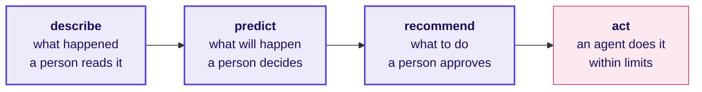
```mermaid
flowchart LR
    D["<b>describe</b><br/>what happened<br/>a person reads it"] --> P["<b>predict</b><br/>what will happen<br/>a person decides"]
    P --> R["<b>recommend</b><br/>what to do<br/>a person approves"]
    R --> A["<b>act</b><br/>an agent does it<br/>within limits"]
    classDef known fill:#EEEAFB,stroke:#5B3FD6,color:#1A0F5C,stroke-width:2px
    classDef bad fill:#FBE9EF,stroke:#D63A6A,color:#1A0F5C
    class D,P,R known
    class A bad
```

| Rule | What it means for the data team |
|---|---|
| MRP | A price model never sets a price above the maximum retail price printed on the pack. |
| DPDP Act and Rules | Personal data is used only for a purpose the person agreed to. |
| RBI tokenisation | A payments table holds tokens and the last four digits, never card numbers. |
| E-commerce Rules 2020 | Consent is an explicit click, and a ranking comes with its explanation. |

```notes
LIVE, 5 minutes, part 6 of the talk track. Say that analytics describes and a person reads it, a
forecast predicts and a person decides, a model recommends and a person approves, and an agent acts
inside limits with nobody checking before it takes effect. Klarna's AI assistant took two-thirds of
its customer-service chats in its first month in 2024 (Klarna, 27 February 2024), and fifteen months
later its chief executive said the cost focus had lowered quality (Fortune, 9 May 2025); a tribunal
held Air Canada responsible for what its chatbot said about a refund (Moffatt v. Air Canada, 2024
BCCRT 149).
Ask: which would you let a system do with no person checking: send the Monday numbers, reorder
detergent, refund the bedsheet, change a price?
Watch for "the Monday numbers, since they are only a report": they are the riskiest of the four,
because the CEO decides on them before anyone could catch a wrong one, and the detergent reorder
inside limits is the safest.
Land it: an agent is only as safe as its policy and the limits around it. Keep the domain card back
until the close of the afternoon.
Transition: the business in one line, and the question its CEO asked us.
```

---

## S10. Meera asks whether acquisition is the short branch
*What did Kalpa's CEO ask the data team on Monday?*

**The client asks.** "Before I sign anything, I want to understand our own sales. What is 'sales' made of? Where does revenue come from, by customer type and channel? Is acquisition even the branch that is short?"

> "No averages. One business customer can move an average." Anand Iyer, finance controller, Kalpa Retail

```stats
value: 4% | label: revenue growth | note: last year
value: 15% | label: the plan | note: what the board expected
value: Rs 12 cr | label: marketing's ask | note: to acquire customers
```

```notes
LIVE, 2 minutes. Read the story's last line aloud: "That is the business. On Monday its CEO read
one page: revenue grew 4 percent against a plan of 15, marketing wants Rs 12 crore, and she asked us
one question before she signs anything." Then read her message and Anand's line. Do not explain
Anand's line; chapter 4 tests it on the file.
Ask: which sentence in her message would you answer first? Most pick the last one.
Transition: her message, split into the questions the chapters answer.
```

---

## S11. Each part of Meera's message becomes a chapter
*Which chapter answers each part of Meera's message?*

| What she asked | The question it becomes | Where it is answered |
|---|---|---|
| "What is 'sales' made of?" | Which total is sales, and what is each branch? | Chapters 1 and 2 answer it. |
| "Is acquisition even the branch that is short?" | Do customers come back, and which branch comes first? | Chapters 3 and 5 answer it. |
| Anand: "No averages." | What does a typical order look like? | Chapter 4 answers it. |
| "By customer type and channel" | Where does revenue come from, and does it change the branch? | The second case answers it. |
| "Before I sign anything" | What one sentence can she sign? | Chapter 6 answers it. |

```notes
LIVE, 2 minutes. Point at each row once. Chapters 1 to 4 run this morning with the break before
chapter 4; chapters 5 and 6 open the afternoon, then the escalated case and the second case. Every
chapter ends on a number written onto the board tree.
Ask: which row would marketing like us to skip? Take one answer; chapter 3 comes back to it.
Transition: chapter 1, which total is sales.
```

---

## SECTION 1: Which total is sales
*Which of the file's totals should Meera call sales, and what does each one count?*

```notes
LIVE, 30 minutes: the map 1, the need 2, Reliance 2, the options 4, the picture 1, the build 7 (the
loop 3, with 2 of them for the TypeError if it happens, the predict 1, the answer 2 and the check
1), the trap 7 (the draft 2, why it is wrong 3 and the fix 2), the second route 3 and the close 3.
Notebook 01 is the demonstration, and every number on these slides is one it prints.
Transition: who needs the answer, and the six questions on the way.
```

---

## S12. Meera and Anand need one named total for the plan
*Who needs to know which total is sales, and which questions lead there?*

**Who needs the answer.** Meera measures the 15 percent plan from sales and Anand's books must match it, so a total that counts orders nobody kept sets the plan's base too high.

```timeline
label: Question 1 | title: Who needs it | body: Who needs one number called sales, and what does a wrong one cost?
label: Question 2 | title: Four ways | body: Which way of answering fits this file?
label: Question 3 | title: Three sums | body: Which reading of sales comes out largest?
label: Question 4 | title: All 30 as sales | body: What goes wrong if all 30 orders are sent as sales?
label: Question 5 | title: By status | body: Do sums by status reach the same totals?
label: Question 6 | title: The root | body: Which number goes on the tree's root?
```

```notes
LIVE, 1 minute. Read the six questions; the chapter's last slide answers each in one line. The file
is 30 Kalpa Retail orders from 1 July to 26 September 2026, an 88-day window, and each order is
delivered, returned after delivery or cancelled before it left.
Ask the room to hold one question for a slide: what could "sales" mean?
Transition: the need, in Meera's words.
```

---

## S13. Meera's 15 percent plan is measured from sales
*Who needs one number called sales, and what does a wrong one cost?*

**The client asks.** "What is 'sales' made of?"

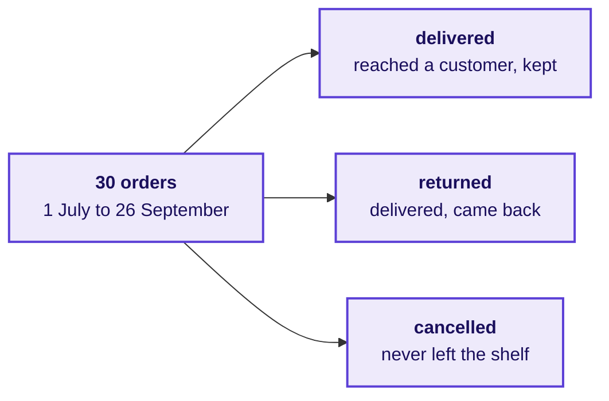
```mermaid
flowchart LR
    F["<b>30 orders</b><br/>1 July to 26 September"] --> D["<b>delivered</b><br/>reached a customer, kept"]
    F --> R["<b>returned</b><br/>delivered, came back"]
    F --> X["<b>cancelled</b><br/>never left the shelf"]
    classDef known fill:#EEEAFB,stroke:#5B3FD6,color:#1A0F5C,stroke-width:2px
    class F,D,R,X known
```

| | |
|---|---|
| The metric at stake | Sales is the base every growth percentage is measured from. |
| Who asks | Meera asks, and Anand's books must match the number. |
| What a wrong number costs | A plan measured from demand that never became a sale sets its target too high. |

```notes
LIVE, 2 minutes. Ask the room to name what "sales" could mean, and write each answer on the board.
Most name everything ordered first; somebody says "what we delivered". Say that the story left
Rs 20 between Rs 100 of GMV and Rs 80 of net revenue as a question, and that this chapter finds the
part of that gap the file can show.
Watch for "sales is the sum of the amount column"; hold it for the options.
Transition: a real retailer that publishes two totals for the same quarter.
```

---

## S14. Reliance Retail publishes two totals a quarter
*Does a real retailer report more than one total for one quarter?*

```stats
value: Rs 90,408 cr | label: gross revenue | note: quarter to June 2026
value: Rs 79,745 cr | label: revenue from operations | note: the same quarter
value: GST | label: the step between them | note: collected for the state
```

Source: Reliance Industries media release, 17 July 2026. Both totals are correct, so each goes out with its name. The story's Rs 20 between GMV and net revenue holds two kinds of step, tax like Reliance's GST and orders that never stayed sold, and the second kind is the one Kalpa's file can show.

```notes
LIVE, 2 minutes. The company is real and the numbers are its own. Make one point: the largest
retailer in India states which revenue it means, and so does every number the team sends. Point at
the first arrow of the Rs 100 drawing on the board and write "tax" and "never stayed sold" beside it.
Ask: which of Reliance's two totals would an investor compare with last year's? Either works, as
long as it is the same one both years.
Transition: four ways the team could answer Meera.
```

---

## S15. Summing by status fits: one pass, every reading
*Which way of answering fits this file?*

| Option | Rows | Time | Error on this file |
|---|---|---|---|
| A. Add every amount and send the total | 30 | under a second | It counts every cancelled order as a sale. |
| B. Sum by status, with a bridge between the totals | 30, once | under a second | It has none once the bridge names each gap. |
| C. Ask Finance for the figure in the books | none | a day or more | It has none on Finance's definition. |
| D. Tick the orders off by hand | 30 | about ten minutes | A typo can hide in any of the 30 cells. |

**The rule.** B is the best fit, since one pass gives every reading and the bridge names each rupee between them. If Finance has already fixed the definition the plan was set on, C decides which of B's totals goes in the note.

```notes
LIVE, 4 minutes. Walk the four. D is fine at 30 rows and impossible at 30 lakh; C is the right
answer for the board and too slow for a first look; A is the fastest and hides its definition. What
would change the call: Finance has fixed the definition the 15 percent plan was set on.
Ask: which would you run first if Meera wanted an answer in ten minutes? Most say A; ask what it
would count.
Transition: what each reading keeps.
```

---

## S16. Each reading of sales drops one more status
*What does each reading of sales keep?*

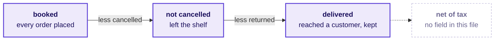
```mermaid
flowchart LR
    B["<b>booked</b><br/>every order placed"] -->|"less cancelled"| N["<b>not cancelled</b><br/>left the shelf"]
    N -->|"less returned"| D["<b>delivered</b><br/>reached a customer, kept"]
    D -.-> X["<b>net of tax</b><br/>no field in this file"]
    classDef known fill:#EEEAFB,stroke:#5B3FD6,color:#1A0F5C,stroke-width:2px
    classDef unknown fill:#FFFFFF,stroke:#B8B2D6,color:#6B6690,stroke-dasharray:4 3
    class B,N,D known
    class X unknown
```

The file has no tax field, so the step Reliance reports as GST cannot be taken from it.

```notes
LIVE, 1 minute. Draw this chain under the board tree. An engineer who can say what the data cannot
answer saves the CEO from a guess.
Transition: the loop that computes all three readings.
```

---

## S17. One loop keeps booked, not cancelled and delivered
*How does one pass over the 30 orders keep three sums?*

```python
readings = {"orders": 0, "booked": 0, "not cancelled": 0, "delivered": 0}
for order in ORDERS:
    amount = int(order["amount"])
    readings["orders"] += 1
    readings["booked"] += amount
    if order["status"] != "cancelled":
        readings["not cancelled"] += amount
    if order["status"] == "delivered":
        readings["delivered"] += amount
```

Each order is added to every reading that keeps its status, and `int()` makes each amount a whole number before it is added.

```notes
LIVE, 3 minutes, 2 of them for the TypeError if it happens. Walk the loop: one dictionary holds four
running totals, and each if keeps what its reading keeps. When the room runs the notebook's first
loop, which adds the amounts without int(), it may stop on a TypeError. Give it two minutes and no
more: read the last line bottom up (the kind of error, the operation, the two types), have each
learner print the loop variable on their own screen without reading the record out, apply int() as
this loop does, and move on. Wednesday asks why an amount arrived that way.
Watch for learners who start cleaning the file; today's fix is int() and nothing more.
Transition: predict the result before running it.
```

---

## S18. Which reading of sales comes out largest?
*Before the loop runs, which of its three sums do you expect on top?*

a) Delivered, because only delivered orders are real.
b) Not cancelled, because it keeps returns and deliveries.
c) Booked, because it keeps every order placed.
d) All three come out equal.

```notes
LIVE, 1 minute. Letters by hand. Most say c; some say a because "only delivered is real", which
confuses the largest reading with the truest one.
Transition: run it and read the three.
```

---

## S19. Answer: c, booked is largest at Rs 5,44,810
*How far apart are the three readings of sales?*

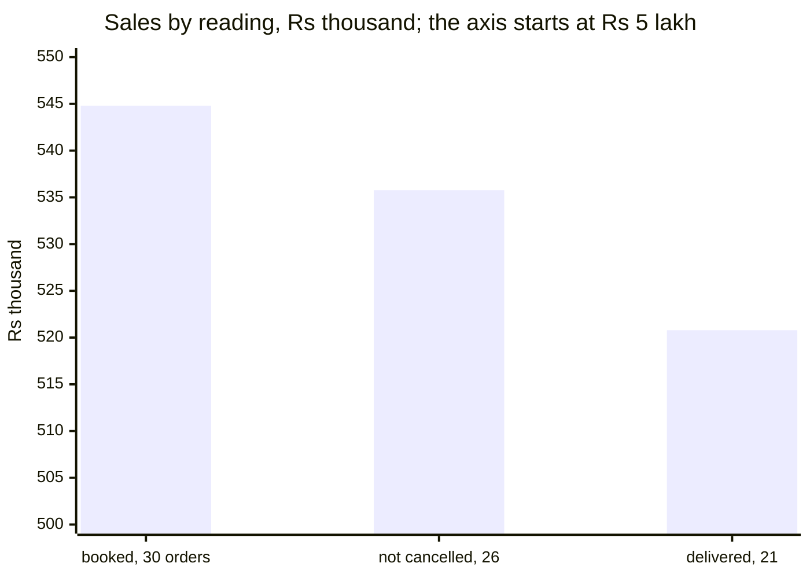
```mermaid
xychart-beta
    title "Sales by reading, Rs thousand; the axis starts at Rs 5 lakh"
    x-axis ["booked, 30 orders", "not cancelled, 26", "delivered, 21"]
    y-axis "Rs thousand" 500 --> 550
    bar [544.81, 535.76, 520.79]
```

Booked is Rs 5,44,810 on 30 orders, not cancelled Rs 5,35,760 on 26 and delivered Rs 5,20,790 on 21, so Rs 24,020 on 9 orders separates the widest pair.

```notes
LIVE, 2 minutes. The answer is c. Delivered (a) is the smallest, since it drops the returns as well
as the cancellations; not cancelled (b) keeps less than booked; the three could only be equal (d) if
no order were cancelled or returned. Read the three with their order counts: the order count, 30,
is a fourth reading, how many times somebody decided to buy. Point at the axis, which starts at
Rs 5 lakh so the gaps show; say so whenever an axis does not start at zero.
Ask: which of the three goes in front of Meera? Take two answers and leave them open.
Transition: the check that the loop did what it claims.
```

---

## S20. Check: 30 orders, and each reading keeps less
*Did the loop visit every order, and does each narrower reading keep less?*

```python
kit.check("the loop visited all 30 orders", readings["orders"] == 30)
kit.check("booked sales is Rs 5,44,810", readings["booked"] == 544810)
kit.check("each narrower reading keeps less",
          readings["booked"] >= readings["not cancelled"] >= readings["delivered"])
```

All three checks pass, so the totals are the file's own and no reading is larger than the one it narrows.

```notes
LIVE, 1 minute. A check proves the build did what it claims before anyone reads the number aloud.
Point out that these checks test the build and cannot say which reading is sales; that is a
business question.
Transition: the line a colleague sent Meera first.
```

---

## S21. A draft sends Rs 5,44,810 on 30 orders as sales
*What goes wrong if all 30 orders are sent as sales?*

**The plausible wrong answer.** A colleague's first draft to Meera reads: "Sales this quarter: Rs 5,44,810 on 30 orders."

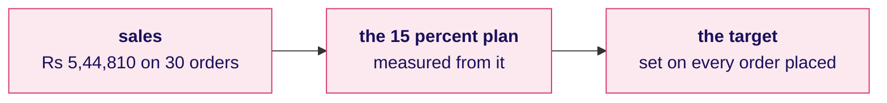
```mermaid
flowchart LR
    W["<b>sales</b><br/>Rs 5,44,810 on 30 orders"] --> P["<b>the 15 percent plan</b><br/>measured from it"]
    P --> T["<b>the target</b><br/>set on every order placed"]
    classDef bad fill:#FBE9EF,stroke:#D63A6A,color:#1A0F5C
    class W,P,T bad
```

The arithmetic is right, and the draft treats every order placed as a sale Meera's plan has to grow from.

```notes
LIVE, 2 minutes. Present it confidently, as the colleague's figure, before anyone in the room has
checked it. Ask what is wrong with it, and which decision it would mislead: the plan's base, and the
channel whose orders sit inside it.
Watch for "nothing, the sum is correct": agree that the sum is correct, and ask what it counts.
Transition: the check that catches it.
```

---

## S22. A count by status shows 4 cancelled, all in store
*Which check catches the orders inside the total that were never sold?*

**Why it is wrong.** A cancelled order never left the shelf and never paid Kalpa a rupee, so it is demand that never arrived. Counting orders by channel and status before adding any amount shows where the 4 sit.

| Channel | Delivered | Returned | Cancelled |
|---|---|---|---|
| App | 10 | 0 | 0 |
| Web | 5 | 5 | 0 |
| Store | 6 | 0 | 4 |

```notes
LIVE, 3 minutes. The check counts orders before anything is summed. Store's 10 orders overstate its
kept orders by 4 in 10. The five web returns did become sales and came back, which is why they stay
in "not cancelled" and leave "delivered".
Ask: if the head of stores read the draft, what would they believe about store's quarter?
Transition: the fix, drawn as a bridge.
```

---

## S23. The fix writes the definition beside each total
*What does the fix change in the note to Meera?*

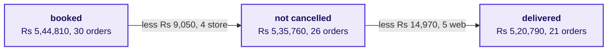
```mermaid
flowchart LR
    B["<b>booked</b><br/>Rs 5,44,810, 30 orders"] -->|"less Rs 9,050, 4 store"| N["<b>not cancelled</b><br/>Rs 5,35,760, 26 orders"]
    N -->|"less Rs 14,970, 5 web"| D["<b>delivered</b><br/>Rs 5,20,790, 21 orders"]
    classDef known fill:#EEEAFB,stroke:#5B3FD6,color:#1A0F5C,stroke-width:2px
    class B,N,D known
```

The sentence for Meera names the definition first: "Sales this quarter, net of cancellations, were Rs 5,35,760 on 26 orders; Rs 9,050 on 4 store orders was cancelled."

```notes
LIVE, 2 minutes. What changed: Rs 9,050 and 4 store orders leave sales, and store's kept orders fall
from the 10 the draft implied to 6. Write both totals on the root of the board tree, each with its
definition.
Transition: the same three totals by a second route.
```

---

## S24. Sums by status land on the same three totals
*Do sums by status reach the same totals as the one loop?*

```python
by_status = {}
for order in ORDERS:
    s = order["status"]
    amount = int(order["amount"])
    by_status[s] = by_status.get(s, 0) + amount
```

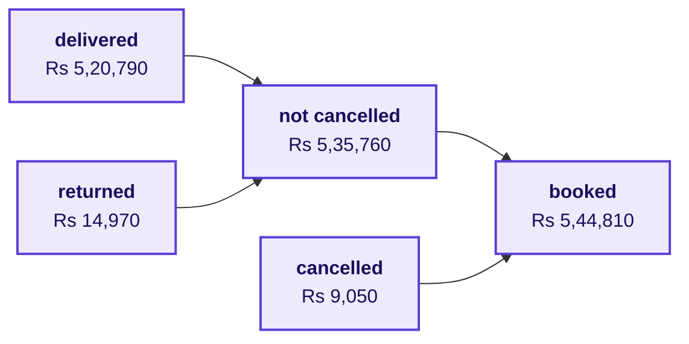
```mermaid
flowchart LR
    D["<b>delivered</b><br/>Rs 5,20,790"] --> NC["<b>not cancelled</b><br/>Rs 5,35,760"]
    R["<b>returned</b><br/>Rs 14,970"] --> NC
    NC --> B["<b>booked</b><br/>Rs 5,44,810"]
    X["<b>cancelled</b><br/>Rs 9,050"] --> B
    classDef known fill:#EEEAFB,stroke:#5B3FD6,color:#1A0F5C,stroke-width:2px
    class D,R,NC,X,B known
```

**The rule.** The two routes must agree to the rupee, and grouping by status is the route to keep when a new status may appear, since it needs no new if.

```notes
LIVE, 3 minutes. Run the notebook's second-route cell; its checks assert that both routes agree to
the rupee on all three readings. When to switch: a part-refund status tomorrow needs a new if in the
one-loop route and nothing in this one; write each reading out when a reader must see the
definition. At a million rows both become one GROUP BY status, which Week 2 teaches.
Transition: the chapter's answers, one line each.
```

---

## S25. Meera gets Rs 5,35,760, named net of cancellations
*Which of the file's totals should Meera call sales, and what does each one count?*

| Question | Answer |
|---|---|
| Who needs sales? | Meera needs it for the plan's base, and Anand needs it to match his books. |
| Which way fits? | One pass that sums by status, with a bridge, fits this file. |
| Which reading is largest? | Booked is Rs 5,44,810, then not cancelled Rs 5,35,760, then delivered Rs 5,20,790. |
| All 30 as sales? | That total counts 4 cancelled store orders, Rs 9,050 that was never sold. |
| Sums by status? | They reach the same three totals to the rupee. |
| The tree's root? | It carries Rs 5,35,760 net of cancellations, with delivered beside it. |

**Kavya's review.** "You found Rs 9,050 that was never a sale by counting before adding. Which definition Meera plans on is her call; your job is to make sure she can see which one she is reading."

**In the interview.** [F] What counts as "sales": booked, net of cancellations, or delivered, and which do you give a CEO?

```notes
LIVE, 3 minutes. Read the six answers down the table. Kavya Nair is the team's senior analyst, and
her review closes every chapter. One learner answers the interview question aloud in under a
minute: name the readings, say what each answers, choose one for the decision and state the others
beside it.
Transition: chapter 2, what each branch of the tree is.
```

---

## SECTION 2: What is each branch
*How does sales split into customers, orders per customer and order value, each a fraction on one definition?*

```notes
LIVE, 30 minutes: the map 1, the need 2, Jio 1, the options 4, the picture 2, the build 6 (the code
2, the predict 1, the answer 2 and the check 1), the trap 9 (the predict 1, the wrong answer 3, why
it is wrong 3 and the fix 2), the second route 3 and the close 2. Notebook 02 is the demonstration.
Transition: who needs the branches, and the six questions on the way.
```

---

## S26. Meera and marketing need each branch as a fraction
*Who needs each branch of sales as a number, and which questions lead there?*

**Who needs the answer.** Meera, who must see which branch of sales is short, and the marketing lead, whose payback case values every new order: a branch built from two definitions multiplies to revenue nobody booked.

```timeline
label: Question 1 | title: Why fractions | body: Who needs the branches, and why as fractions?
label: Question 2 | title: Which tree | body: Which tree can this file fill?
label: Question 3 | title: Order value | body: What is the average order value?
label: Question 4 | title: Two reports | body: What goes wrong when booked rupees are divided by delivered orders?
label: Question 5 | title: The mean | body: Does the mean of the amounts agree?
label: Question 6 | title: What is missing | body: Which branches does the file still lack?
```

```notes
LIVE, 1 minute. Chapter 1 settled the readings: Rs 5,44,810 booked on 30 orders, Rs 5,35,760 not
cancelled on 26 and Rs 5,20,790 delivered on 21. This chapter builds the tree on them, on the booked
definition. Read the six questions.
Transition: why each branch has to be a fraction.
```

---

## S27. A branch helps Meera only as a fraction
*Who needs the branches, and why must each one be a fraction?*

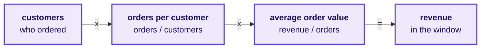
```mermaid
flowchart LR
    C["<b>customers</b><br/>who ordered"] -->|"x"| F["<b>orders per customer</b><br/>orders / customers"]
    F -->|"x"| A["<b>average order value</b><br/>revenue / orders"]
    A -->|"="| R["<b>revenue</b><br/>in the window"]
    classDef known fill:#EEEAFB,stroke:#5B3FD6,color:#1A0F5C,stroke-width:2px
    class C,F,A,R known
```

| | |
|---|---|
| The metric at stake | AOV, revenue over orders, is the first branch this file can measure. |
| Who asks | Meera asks for the tree, and marketing values each new order with its AOV. |
| What a wrong number costs | A tree built from two definitions multiplies to revenue nobody booked. |
| What chapter 1 found | Booked sales is Rs 5,44,810 on 30 orders. |

```notes
LIVE, 2 minutes. Check the multiplication with units on the board: customers times orders per
customer gives orders, and orders times revenue per order gives rupees, because each denominator
cancels the next numerator. That is also why a branch measured on another definition breaks the
chain.
Transition: a real company that reports its revenue this way.
```

---

## S28. Jio reports its revenue as a tree of branches
*Does a real company report its revenue as branches?*

```stats
value: 533 million | label: Jio subscribers | note: quarter to June 2026
value: Rs 215.6 | label: revenue per user | note: a month
value: 1.6% | label: monthly churn | note: subscribers who leave
```

Source: Reliance Industries media release, 17 July 2026. A telecom's revenue is subscribers times revenue per user, with churn as its leak, and investors multiply the branches the way this chapter multiplies Kalpa's.

```notes
LIVE, 1 minute. Kalpa Connect is the Jio-like unit and arrives in Build 3. The point is the shape: a
company reports its branches, each as a fraction.
Transition: which tree this file can fill.
```

---

## S29. This file fills customers x frequency x AOV
*Which tree can this file fill?*

| Option | Fields it needs | In this file? | What it tells Meera |
|---|---|---|---|
| A. Orders x AOV | amount | Yes | It sizes orders and hides who buys. |
| B. Customers x orders per customer x AOV | amount, customer id | Yes | It shows who buys, how often and for how much. |
| C. B, with AOV split into items x price, less discounts | items, prices, discounts | No | It would show which part of the basket moved. |
| D. A funnel from visits to orders | sessions or footfall | No | It would show where shoppers drop out. |

**The rule.** B is the best fit: it is the deepest tree this file fills, and it puts marketing's branch beside the two it competes with. Order lines with items and prices would move the call to C.

```notes
LIVE, 4 minutes. The sizing here counts fields: the file's seven fields fill A and B. Ask what data
would let us draw C; the order-items table arrives later in the programme, and traffic data would
put D in front of the tree.
Transition: the tree the file can fill, drawn beside what it cannot.
```

---

## S30. Three branches can be measured and three cannot
*What does each branch divide, and which can this file measure?*

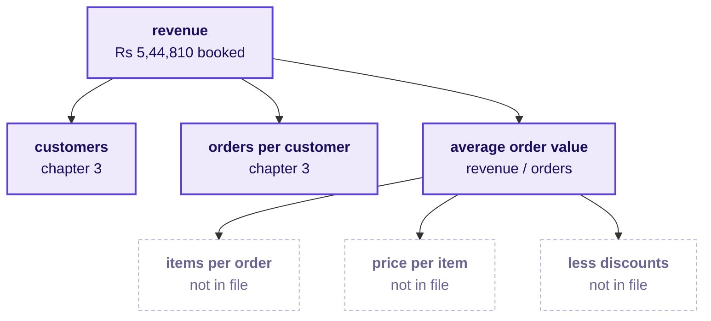
```mermaid
flowchart TB
    R["<b>revenue</b><br/>Rs 5,44,810 booked"] --> C["<b>customers</b><br/>chapter 3"]
    R --> F["<b>orders per customer</b><br/>chapter 3"]
    R --> A["<b>average order value</b><br/>revenue / orders"]
    A --> I["<b>items per order</b><br/>not in file"]
    A --> P["<b>price per item</b><br/>not in file"]
    A --> D["<b>less discounts</b><br/>not in file"]
    classDef known fill:#EEEAFB,stroke:#5B3FD6,color:#1A0F5C,stroke-width:2px
    classDef unknown fill:#FFFFFF,stroke:#B8B2D6,color:#6B6690,stroke-dasharray:4 3
    class R,C,F,A known
    class I,P,D unknown
```

```notes
LIVE, 2 minutes. Draw the three lower branches dashed on the board tree. Saying which branches the
file cannot fill is part of the answer, because those are the ones nobody can plan on yet.
Transition: the code that measures the first branch.
```

---

## S31. AOV is booked revenue over the orders it came from
*How does the first branch become a number?*

```python
orders = len(ORDERS)
revenue = sum(order["amount"] for order in ORDERS)
aov = revenue / orders
```

Chapter 1's `int()` fix is applied once as the orders load, so every amount here is a whole number, and both halves of the fraction count the same 30 booked orders.

```notes
LIVE, 2 minutes. Walk the three lines: a count, a sum on one definition, and the fraction of the
two. Say aloud that both lines read the same list, which is what one definition means in code.
Transition: predict what the two multiply back to.
```

---

## S32. What does orders times the AOV give back?
*Booked revenue splits into orders x AOV, so what do the two multiply back to?*

a) Exactly booked revenue, because the average was made from that total.
b) More than booked revenue, because repeat customers count twice.
c) Less than booked revenue, because the average rounds down.
d) Nothing useful until prices per item are known.

```notes
LIVE, 1 minute. Letters by hand. Most say a; some say c because of rounding.
Transition: the answer, with the AOV.
```

---

## S33. Answer: a, orders x AOV lands on booked revenue
*What is the average order value on the booked definition?*

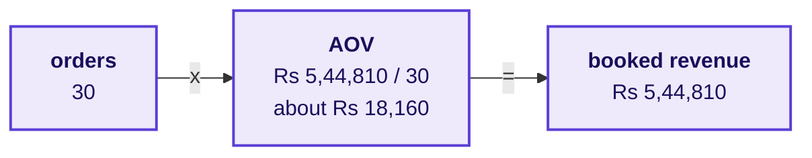
```mermaid
flowchart LR
    O["<b>orders</b><br/>30"] -->|"x"| A["<b>AOV</b><br/>Rs 5,44,810 / 30<br/>about Rs 18,160"]
    A -->|"="| R["<b>booked revenue</b><br/>Rs 5,44,810"]
    classDef known fill:#EEEAFB,stroke:#5B3FD6,color:#1A0F5C,stroke-width:2px
    class O,A,R known
```

The AOV is Rs 5,44,810 over 30 orders, about Rs 18,160, and 30 times the unrounded AOV is Rs 5,44,810 exactly. Since the product always lands on revenue, a wrong branch can hide in the split while the total looks right.

```notes
LIVE, 2 minutes. The answer is a. Repeat customers (b) never enter this fraction, which counts
orders; rounding (c) moves the product by Rs 10 when the AOV is first rounded to Rs 18,160, and by
nothing when it is not; prices per item (d) split the AOV further and leave it as it is. Write Rs 18,160 on the board tree in pencil with a question mark;
Anand's warning is about this number, and chapter 4 comes back to it.
Transition: the checks.
```

---

## S34. Check: the tree lands; 3 of 6 branches are absent
*Does the identity hold, and how many branches does the file lack?*

```python
kit.check("orders x AOV lands on booked revenue", round(orders * aov) == revenue)
kit.check("booked AOV is Rs 18,160", round(aov) == 18160)
missing = [b for b in ("items", "price", "discount") if b not in ORDERS[0]]
kit.check("three branches of six are not in this file", len(missing) == 3)
```

All three pass: the product lands on Rs 5,44,810, the AOV rounds to Rs 18,160, and items, price and discounts are not fields in the file.

```notes
LIVE, 1 minute. The checks prove the build. They cannot say whether Rs 18,160 describes an order
anyone at Kalpa would recognise, which is chapter 4's question.
Transition: what happens when two reports feed one fraction.
```

---

## S35. What AOV do booked rupees over delivered orders give?
*Finance reports booked revenue and the operations dashboard counts delivered orders; what if each feeds one half?*

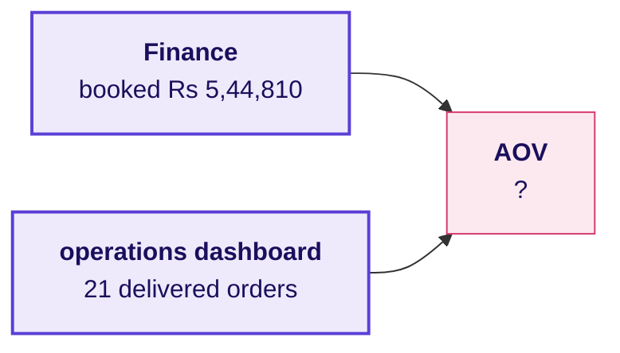
```mermaid
flowchart LR
    F["<b>Finance</b><br/>booked Rs 5,44,810"] --> X["<b>AOV</b><br/>?"]
    O["<b>operations dashboard</b><br/>21 delivered orders"] --> X
    classDef known fill:#EEEAFB,stroke:#5B3FD6,color:#1A0F5C,stroke-width:2px
    classDef bad fill:#FBE9EF,stroke:#D63A6A,color:#1A0F5C
    class F,O known
    class X bad
```

a) Rs 18,160
b) Rs 24,800
c) Rs 25,943
d) Rs 23,687

```notes
LIVE, 1 minute. Letters by hand. Most divide and get c; watch for anyone who objects to the division
itself, and ask them why.
Transition: the answer, and the note a colleague sent with it.
```

---

## S36. Answer: c, Rs 25,943, which matches no definition
*What goes wrong when booked rupees are divided by delivered orders?*

**The plausible wrong answer.** A colleague's note to marketing reads: "Our average order is Rs 25,943."

```stats
value: Rs 25,943 | label: the mixed AOV | note: booked rupees / delivered orders
value: Rs 7,78,300 | label: multiplied back | note: on the 30 booked orders
value: 43% | label: above booked | note: revenue nobody booked
```

```notes
LIVE, 3 minutes. The answer is c, Rs 5,44,810 over 21. Rs 18,160 (a) is booked over booked, Rs 24,800
(b) is delivered over delivered, and Rs 23,687 (d) divides by the 23 customers. What the mixed
number would mislead: marketing's payback case would value each new customer's order at Rs 25,943.
The error stays invisible until something is multiplied back.
Ask: which half of the fraction would you check first?
Transition: the check that catches it.
```

---

## S37. AOV x the orders summed must give revenue back
*Which check catches a fraction built from two definitions?*

**Why it is wrong.** The numerator keeps the rupees of the 9 cancelled and returned orders while the denominator has dropped those orders, so every order looks Rs 7,783 larger than a booked order averages.

| Fraction | AOV | Times the orders the revenue covers | Does that revenue come back? |
|---|---|---|---|
| Booked / booked | Rs 18,160 | 30 orders give Rs 5,44,810. | Yes, booked revenue comes back. |
| Delivered / delivered | Rs 24,800 | 21 orders give Rs 5,20,790. | Yes, delivered revenue comes back. |
| Booked / delivered | Rs 25,943 | 30 orders give Rs 7,78,300. | No, it lands Rs 2,33,490 over. |

```notes
LIVE, 3 minutes. Multiplying the mixed AOV by the 21 delivered orders would only hand back the
numerator, so the check uses the 30 orders the booked rupees came from: 30 x (Rs 5,44,810 / 21) is
Rs 7,78,300.
Transition: the fix.
```

---

## S38. One definition per fraction: Rs 18,160 or Rs 24,800
*What does the fix change in the note to marketing?*

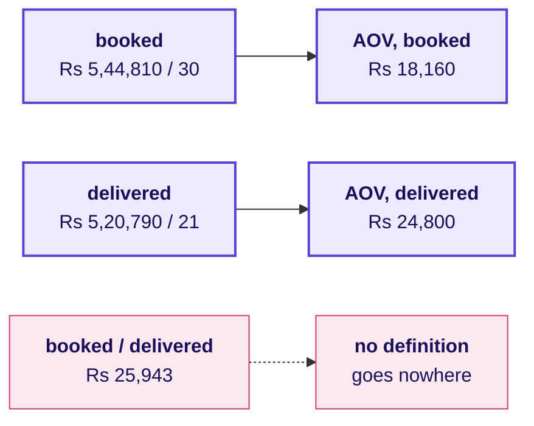
```mermaid
flowchart LR
    B["<b>booked</b><br/>Rs 5,44,810 / 30"] --> AB["<b>AOV, booked</b><br/>Rs 18,160"]
    D["<b>delivered</b><br/>Rs 5,20,790 / 21"] --> AD["<b>AOV, delivered</b><br/>Rs 24,800"]
    M["<b>booked / delivered</b><br/>Rs 25,943"] -.-> Z["<b>no definition</b><br/>goes nowhere"]
    classDef known fill:#EEEAFB,stroke:#5B3FD6,color:#1A0F5C,stroke-width:2px
    classDef bad fill:#FBE9EF,stroke:#D63A6A,color:#1A0F5C
    class B,AB,D,AD known
    class M,Z bad
```

**The rule.** Each fraction takes one definition, so ask each report what it counts before you divide.

```notes
LIVE, 2 minutes. What changed: two honest AOVs, each sent with its definition, and the mixed
Rs 25,943 goes nowhere. Marketing's note names which of the two it uses.
Transition: the same AOV by a second route.
```

---

## S39. The mean of the 30 amounts is the same Rs 18,160
*Does the mean of the amounts agree with revenue over orders?*

```python
amounts = [order["amount"] for order in ORDERS]
mean_route = sum(amounts) / len(amounts)
library_route = statistics.fmean(amounts)
```

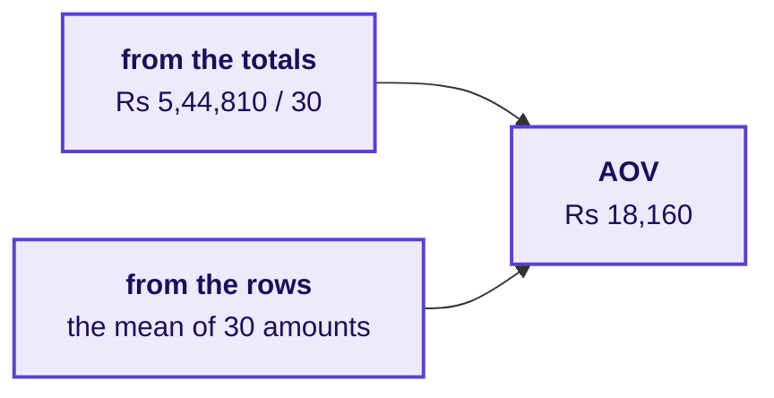
```mermaid
flowchart LR
    T["<b>from the totals</b><br/>Rs 5,44,810 / 30"] --> M["<b>AOV</b><br/>Rs 18,160"]
    L["<b>from the rows</b><br/>the mean of 30 amounts"] --> M
    classDef known fill:#EEEAFB,stroke:#5B3FD6,color:#1A0F5C,stroke-width:2px
    class T,L,M known
```

**The rule.** Use the totals when a report holds them and the rows when you hold the rows; chapter 4 asks whether the mean is the right middle at all.

```notes
LIVE, 3 minutes. The notebook asserts that the three routes agree, and they agree because the mean
is what the tree calls AOV. The switch that matters is chapter 4's: when the question is what a
typical order looks like, the mean may be the wrong middle.
Transition: the chapter's answers, one line each.
```

---

## S40. Each branch is a fraction; AOV is Rs 18,160 booked
*How does sales split into customers, orders per customer and order value, each a fraction on one definition?*

| Question | Answer |
|---|---|
| Why fractions? | Each branch is a numerator over a denominator, so the branches multiply back to revenue. |
| Which tree? | Customers x orders per customer x AOV is the deepest tree this file fills. |
| The AOV? | It is Rs 18,160, booked revenue over 30 orders. |
| Booked over delivered? | It gives Rs 25,943, which matches no definition and claims Rs 7,78,300. |
| Does the mean agree? | The mean of the 30 amounts is the same Rs 18,160. |
| What is missing? | Items, price and discounts are missing, so order value cannot be split yet. |

**Kavya's review.** "You gave me each branch as a numerator over a denominator and told me which three this file cannot fill, so I know which ones I can plan on. When two reports feed one fraction, ask each what it counts before you divide."

**In the interview.** [S] How would you increase sales for an online retailer?

```notes
LIVE, 2 minutes. One learner answers aloud: draw the tree, measure each branch on one window and one
definition, find the short one, then place initiatives on it.
Transition: chapter 3, the customer branches counted.
```

---

## SECTION 3: Do customers come back
*How many customers does Kalpa have, and how many came back for a second order?*

```notes
LIVE, 30 minutes: the map 1, the need 2, Reliance 1, the options 4, the picture 2, the build 8 (the
code 2, the predict 1, the answer 3 and the check 2), the trap 8 (the draft 3, why it is wrong 3
and the fix 2), the second route 2 and the close 2. D54, the count on delivered orders, is
self-study; in the room it is the first thing to cut. Notebook 03 is the demonstration.
Transition: who needs the count, and the six questions on the way.
```

---

## S41. Meera's budget turns on whether customers return
*Who needs the customer count, and which questions lead to it?*

**Who needs the answer.** Meera, before she signs Rs 12 crore to buy customers, and the marketing lead and the head of Retail-Plus, who own the two customer branches: if nobody comes back, acquisition is the only branch, and if customers return, frequency can grow without buying anyone new.

```timeline
label: Question 1 | title: What rides on it | body: Who needs the customer count, and what rides on it?
label: Question 2 | title: Rows and people | body: How do we count customers when a row is an order?
label: Question 3 | title: Who came back | body: How many customers came back?
label: Question 4 | title: Every row a customer | body: What goes wrong if every row is counted as a customer?
label: Question 5 | title: The mean of counts | body: Does the mean of the counts agree?
label: Question 6 | title: Delivered only | body: What changes on delivered orders?
```

```notes
LIVE, 1 minute. Chapter 2 measured order value: Rs 5,44,810 over 30 orders is an AOV of Rs 18,160,
and the two customer branches are still empty. Read the six questions.
Transition: what rides on the count.
```

---

## S42. If nobody comes back, acquisition is the only branch
*Who needs the customer count, and what rides on it?*

**The client asks.** "Is acquisition even the branch that is short?"

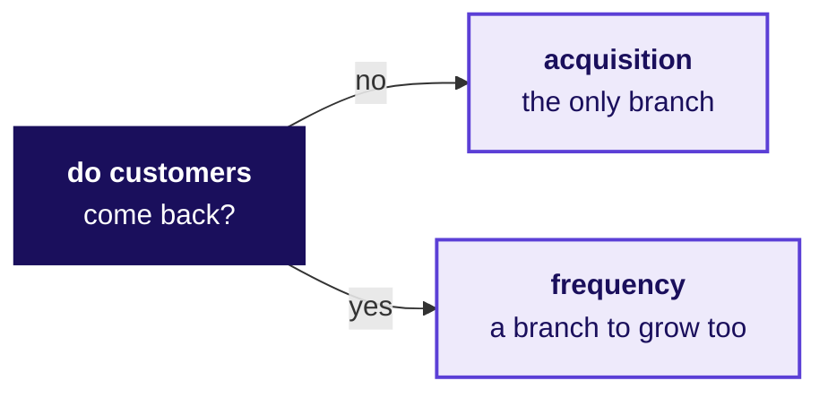
```mermaid
flowchart LR
    Q["<b>do customers</b><br/>come back?"] -->|"no"| A["<b>acquisition</b><br/>the only branch"]
    Q -->|"yes"| F["<b>frequency</b><br/>a branch to grow too"]
    classDef known fill:#EEEAFB,stroke:#5B3FD6,color:#1A0F5C,stroke-width:2px
    classDef dark fill:#1A0F5C,stroke:#1A0F5C,color:#FFFFFF
    class A,F known
    class Q dark
```

| | |
|---|---|
| The metric at stake | Customers are counted, and orders per customer is orders over customers in the window. |
| Who asks | Meera asks, with the marketing lead and the head of Retail-Plus. |
| What a wrong number costs | "Nobody comes back" makes Rs 12 crore look like the only way to grow. |

```notes
LIVE, 2 minutes. Ask: if nobody ever came back, what would orders per customer be? Exactly 1. Keep
that thought for the trap.
Transition: a real retailer's customer count, and its denominator.
```

---

## S43. Reliance counts 396 million registered customers
*Which customers does a real retailer count?*

```stats
value: 396 million | label: registered customers | note: Reliance Retail, 30 June 2026
value: 20,169 | label: stores | note: the same date
```

Source: Reliance Industries media release, 17 July 2026. A registered customer is a denominator of its own: divide a quarter's orders by it and you get a smaller metric than orders per customer who ordered.

```notes
LIVE, 1 minute. The point is the denominator: registered, active and ordering customers are three
different counts, and each gives a different rate.
Transition: four ways to count customers.
```

---

## S44. A dictionary counts customers and repeats at once
*How do we count customers when a row is an order?*

| Option | Passes | What it answers | Error on this file |
|---|---|---|---|
| A. `len(ORDERS)`, the rows | none | It says how many orders there are. | It counts a repeat customer once per order. |
| B. `len(set(ids))`, distinct ids | one | It says how many customers there are. | It says nothing about who came back. |
| C. A dictionary of orders per id | one | It says how many customers, how many orders each and who came back. | It has none on this file. |
| D. Sort the ids and count the changes | a sort and a pass | It says how many customers there are. | It is easy to miscount by hand. |

**The rule.** C is the best fit, since one pass fills both customer branches and names the repeat buyers. At millions of rows the count becomes one COUNT(DISTINCT customer_id) in the warehouse, which Week 2 teaches.

```notes
LIVE, 4 minutes. B is right when only the count is needed, and C when someone will ask who came
back. The switch to SQL is Week 2's.
Ask: which option would you trust if the file had a million rows and you had one minute?
Transition: why one person can leave several rows.
```

---

## S45. A row is an order, and one person can place several
*Why can one customer leave several rows in the file?*

```mermaid
flowchart LR
    O1["<b>order row 1</b>"] --> P1["<b>customer A</b>"]
    O2["<b>order row 2</b>"] --> P1
    O3["<b>order row 3</b>"] --> P2["<b>customer B</b>"]
    P1 & P2 --> F["<b>orders per customer</b><br/>3 rows / 2 customers = 1.5"]
    classDef known fill:#EEEAFB,stroke:#5B3FD6,color:#1A0F5C,stroke-width:2px
    class O1,O2,O3,P1,P2,F known
```

On three invented rows, customer A ordered twice, so three orders come from two people and orders per customer is 1.5.

```notes
LIVE, 2 minutes. Draw it with the three invented rows. The rows are orders, and the people behind
them are the customers; the rate needs people in its denominator.
Transition: the build on Kalpa's 30 rows.
```

---

## S46. A dictionary keyed by customer id counts orders
*How does one pass count each customer's orders?*

```python
counts = {}
for order in ORDERS:
    cid = order["customer_id"]
    counts[cid] = counts.get(cid, 0) + 1
customers = len(counts)
once = sum(1 for n in counts.values() if n == 1)
```

The customer id is the key and the count of that customer's orders is the value, so `counts.get(cid, 0)` starts each new customer at zero.

```notes
LIVE, 2 minutes. Walk the loop line by line, then the two lines under it: the number of keys is the
number of customers, and the counts of one are the customers who bought once.
Transition: predict how many came back.
```

---

## S47. How many customers bought more than once?
*The dictionary holds each customer's order count, so how many counts are above one?*

a) None, since orders per customer is close to 1.
b) 7, the gap between 30 orders and 23 customers.
c) 16, the customers who are not new.
d) 23, since the rate is above 1.

```notes
LIVE, 1 minute. Letters by hand. Some say 16, confusing one-time buyers with repeat buyers.
Transition: the answer.
```

---

## S48. Answer: b, 7 of Kalpa's 23 customers came back
*How many customers does Kalpa have, and how many came back?*

```mermaid
xychart-beta
    title "23 customers by the orders each placed"
    x-axis ["bought once", "bought twice"]
    y-axis "customers" 0 --> 18
    bar [16, 7]
```

23 customers placed 30 orders, 1.30 each; 16 bought once and 7 came back. Orders less customers equals the repeat buyers here only because nobody bought three times.

```notes
LIVE, 3 minutes. The answer is b. Orders per customer near 1 (a) still leaves room for 7 repeat
buyers; 16 (c) are the customers who bought once; 23 (d) is every customer. Write 23 and 1.30 on the
board tree. One repeat customer carries Retail-Core on one order and Retail-Plus on the other,
because the segment is recorded on each order, so a count of customers per segment has to say which
order's segment it used.
Transition: the checks.
```

---

## S49. Check: the counts add to 30 and the tree lands
*Do the counts add back to 30, and does the tree multiply back to revenue?*

```mermaid
flowchart TB
    R["<b>revenue</b><br/>Rs 5,44,810 booked"] --> C["<b>customers</b><br/>23"]
    R --> F["<b>orders per customer</b><br/>30 / 23 = 1.30"]
    R --> A["<b>AOV</b><br/>Rs 5,44,810 / 30"]
    classDef known fill:#EEEAFB,stroke:#5B3FD6,color:#1A0F5C,stroke-width:2px
    class R,C,F,A known
```

The 23 counts add back to 30 orders, and 23 x (30 / 23) x (Rs 5,44,810 / 30) lands exactly on Rs 5,44,810.

```notes
LIVE, 2 minutes. Both checks pass in the notebook. With the rounded 1.30 and Rs 18,160 the product
comes to about Rs 5,43,000, so write the fractions unrounded when you check the identity.
Transition: the count a colleague sent first.
```

---

## S50. A draft counts 30 customers at 1.00 order each
*What goes wrong if every row is counted as a customer?*

**The plausible wrong answer.** A colleague's first draft to Meera reads: "30 customers placed 30 orders: 1.00 each, so nobody comes back."

```mermaid
flowchart LR
    R["<b>30 rows</b><br/>read as customers"] --> F["<b>1.00 orders each</b><br/>nobody comes back"]
    F --> B["<b>Rs 12 crore</b><br/>acquisition as the only branch"]
    classDef bad fill:#FBE9EF,stroke:#D63A6A,color:#1A0F5C
    class R,F,B bad
```

```notes
LIVE, 3 minutes. Present it as the figure a colleague's first draft sent Meera before the room built
the count: the case for the budget, made by a counting slip. Ask what would check it before the
next slide.
Watch for learners who accept it because the division is right.
Transition: the check.
```

---

## S51. The id column holds 30 rows and 23 distinct ids
*Which check tells rows apart from customers?*

**Why it is wrong.** The division is correct and its denominator is wrong: a row is an order, and one customer can place several.

```python
ids = [order["customer_id"] for order in ORDERS]
len(ids), len(set(ids))        # (30, 23)
```

The same column counted as a list gives 30 and counted as a set gives 23, so 7 of the 30 orders came from people who had already bought.

```notes
LIVE, 3 minutes. A set keeps each value once however often it is added, so the list's 30 against the
set's 23 says 7 orders came from people who had already bought.
Transition: the fix.
```

---

## S52. Fixed: 30 / 23 = 1.30 orders, and 7 came back
*What does dividing by distinct customers change?*

```stats
value: 23 | label: customers | note: distinct ids
value: 1.30 | label: orders per customer | note: 30 / 23
value: 7 | label: came back | note: 16 bought once
```

The draft's 1.00 goes nowhere, 7 returning customers are visible again, and "nobody comes back" leaves the case for the Rs 12 crore.

```notes
LIVE, 2 minutes. What changed, in customers: 7 people the draft could not see.
Transition: the same rate by a second route.
```

---

## S53. The mean of the 23 counts is the same 1.30
*Does the mean of the counts agree with orders over customers?*

```python
second_route = sum(counts.values()) / len(counts)   # 1.30, the same rate
```

**The rule.** The ratio needs two counts, which a report holds; the counts need the rows and also show the spread, 16 customers at one order and 7 at two, which the ratio hides. Use the counts whenever someone will ask how many came back.

```notes
LIVE, 2 minutes. The notebook asserts that the two routes agree and that the dictionary's keys are
the set's members.
Transition: the chapter's answers; D54, on delivered orders, is self-study.
```

---

## D54. On delivered orders: 19 customers, 1.11 each
*What changes when only delivered orders count?*

| | Booked | Delivered |
|---|---|---|
| Orders | 30 | 21 |
| Customers | 23 | 19 |
| Orders per customer | 1.30 | 1.11 |
| Customers with two orders | 7 | 2 |

On the delivered definition 19 customers kept 21 orders and 2 kept two, so every leaf moves with the definition, and each count goes out with the definition it was taken on.

```notes
SELF-STUDY, 3 minutes. Chapter 1's delivered reading kept 21 of the 30 orders; counted by id they
come from 19 customers, 1.11 orders each, and 2 of them kept two. The escalated case this afternoon
rebuilds Meera's answer on delivered orders, and this is its first leaf. In the room, cut this slide
first.
Transition: the chapter's answers.
```

---

## S55. Kalpa has 23 customers, and 7 came back
*How many customers does Kalpa have, and how many came back for a second order?*

| Question | Answer |
|---|---|
| What rides on the count? | It decides whether acquisition is the only branch before Meera signs Rs 12 crore. |
| How are customers counted? | A row is an order, so customers are counted by distinct id. |
| How many came back? | 7 of 23 customers came back and 16 bought once, 1.30 orders each. |
| Every row a customer? | The draft's 30 at 1.00 each says nobody comes back, and the ids say 7 did. |
| Does the mean agree? | The mean of the 23 counts is also 1.30. |
| Delivered only? | 19 customers kept 21 orders, 1.11 each, and 2 kept two. |

**Kavya's review.** "Your first 30 was a count of rows, divided as if it were people. A count of people comes from their ids, and every rate you send upstairs names its denominator."

**In the interview.** [F] Your extract shows 30 orders and 30 customers; what do you check before saying nobody comes back?

```notes
LIVE, 2 minutes. One learner answers aloud: rows against distinct ids, then the window, since a
customer who buys every four months looks like a one-time buyer in one quarter, then whether one
person can carry two ids.
Transition: a 10-minute break, then chapter 4.
```

---

## SECTION 4: What is a typical order
*What does a typical Kalpa order look like, stated so that one large order cannot move it?*

```notes
LIVE, 30 minutes after the break: the map 1, the need 2, Blinkit 1, the options 4, the picture 2,
the build 6 (the code 2, the predict 1, the answer 2 and the check 1), the trap 9 (marketing's slide
3, why it is wrong with the sort 4 and the fix 2), the second route 3 and the close 2. D65 and D66,
the trimmed mean on Kalpa's orders, are self-study. Notebook 04 is the demonstration.
Transition: who needs a typical order, and the six questions on the way.
```

---

## S56. Marketing and Anand both need a typical order
*Who needs a typical order, and which questions lead to it?*

**Who needs the answer.** The marketing lead, whose payback case values every new customer by the order they will place, Meera, who signs the budget on that payback, and Anand, who has warned against averages: an order valued too high makes Rs 12 crore look cheap.

```timeline
label: Question 1 | title: What it prices | body: Who needs a typical order, and what does it price?
label: Question 2 | title: Which middle | body: Which middle survives one large order?
label: Question 3 | title: The median | body: What is the median order?
label: Question 4 | title: Mean as typical | body: What goes wrong when the mean is sold as typical?
label: Question 5 | title: The library | body: Does statistics.median agree?
label: Question 6 | title: The payback | body: What goes into the payback case?
```

```notes
LIVE, 1 minute. Chapter 3 found 23 customers, 1.30 orders each and 7 who came back, and the tree
multiplies back through an AOV of Rs 18,160. Read the six questions.
Transition: what the typical order prices.
```

---

## S57. A first order's value decides the payback
*Who needs a typical order, and what does it price?*

**The client asks.** "What does a typical order look like?"

> "No averages. One business customer can move an average." Anand Iyer, finance controller

| | |
|---|---|
| The metric at stake | The typical order is what marketing's payback credits to every new customer. |
| Who asks | Meera and the marketing lead ask, and Anand has already warned against averages. |
| What a wrong number costs | A first order valued too high makes the payback look short and Rs 12 crore look cheap. |

```notes
LIVE, 2 minutes. Read Anand's line again; now it can be tested on the file.
Transition: a real company's reported order value.
```

---

## S58. Blinkit reports a mean order value, right for totals
*What does a real company report as its order value?*

```stats
value: Rs 518 | label: Blinkit net AOV | note: quarter to June 2026
value: 2,443 | label: dark stores | note: the same quarter
```

Source: MediaNama on Eternal's results, 24 July 2026. A reported AOV is a mean, the right number for totals across millions of similar baskets and the wrong one for one shopper's basket when a few very large orders share the file.

```notes
LIVE, 1 minute. A mean over millions of similar small baskets describes them well; the question is
whether Kalpa's 30 orders are that kind of file.
Transition: four middles a team could report.
```

---

## S59. The median barely moves when one large order joins
*Which middle survives one large order?*

| Option | Moves when one large order joins | Right call when |
|---|---|---|
| A. The mean, total over count | It moves by Rs 14,623. | Totals must multiply back. |
| B. The median, the middle of the sorted amounts | It moves by Rs 50, one place in the sort. | The question is what a typical order looks like. |
| C. A trimmed mean, dropping the top and bottom order | It moves by Rs 83, and it needs a rule. | A stated rule says how many to drop. |
| D. A mean per customer type | It does not move within a type. | Each type gets its own plan. |

Sized on six invented orders: five of Rs 1,900 to Rs 2,600, then one of Rs 90,000.

**The rule.** B for the typical order, with A beside it for totals; D answers better if marketing prices the payback per customer type.

```notes
LIVE, 4 minutes. The invented set is five orders from Rs 1,900 to Rs 2,600 plus one of Rs 90,000;
the notebook's sizing cell draws the three moves. The trimmed mean is the middle a spreadsheet user
reaches for first, and it needs a rule for how many orders to drop.
Ask: which of the four would Anand accept, and why?
Transition: the picture of what one large order does.
```

---

## S60. One large order drags the mean and nudges the median
*What does one large order do to each middle?*

```mermaid
flowchart LR
    F["<b>five invented orders</b><br/>Rs 1,900 to 2,600<br/>mean Rs 2,260<br/>median Rs 2,300"] -->|"add one invented<br/>order of Rs 90,000"| S["<b>six invented orders</b><br/>mean Rs 16,883<br/>median Rs 2,350"]
    classDef known fill:#EEEAFB,stroke:#5B3FD6,color:#1A0F5C,stroke-width:2px
    classDef bad fill:#FBE9EF,stroke:#D63A6A,color:#1A0F5C
    class F known
    class S bad
```

The mean shares the large order's rupees across every order, so it jumps by Rs 14,623, while the median only asks which order sits in the middle, so it moves Rs 50.

```notes
LIVE, 2 minutes. The numbers are invented, and none of them is a Kalpa order. Ask which middle Anand
would trust after seeing the two boxes.
Transition: the median on Kalpa's 30 orders.
```

---

## S61. Sort the 30 amounts and average the 15th and 16th
*How is the middle of 30 orders found?*

```python
ranked = sorted(amounts)
median = (ranked[14] + ranked[15]) / 2     # the 15th and 16th in size order
```

With an even count there are two middle orders and the median is halfway between them; Python counts from 0, so the 15th order is `ranked[14]`.

```notes
LIVE, 2 minutes. Walk the two lines. Ask what changes with an odd count, say 31 orders: one middle
order, ranked[15], and no averaging.
Transition: predict the median.
```

---

## S62. What is the median of Kalpa's 30 orders?
*The mean is Rs 18,160, so where do you expect the middle order to sit?*

a) About Rs 2,200.
b) Rs 18,160, the same as the mean.
c) Rs 9,080, half the mean.
d) Rs 2,300, the 16th order in size order.

```notes
LIVE, 1 minute. Letters by hand. Many expect b, since in a textbook the mean and the median sit close
together.
Transition: the answer.
```

---

## S63. Answer: a, the median order is Rs 2,205
*What is the median order, and how far is it from the mean?*

```mermaid
xychart-beta
    title "Two middles of the same 30 orders, Rs"
    x-axis ["mean", "median"]
    y-axis "Rs" 0 --> 20000
    bar [18160, 2205]
```

The 15th and 16th orders in size order are Rs 2,110 and Rs 2,300, so the median is Rs 2,205, about one eighth of the Rs 18,160 mean.

```notes
LIVE, 2 minutes. The answer is a. The mean (b) equals the median only when the orders spread evenly
on both sides of the middle; half the mean (c) has no rule behind it; Rs 2,300 (d) is one of the two middle
orders, and an even count takes the halfway point. Write Rs 2,205 on the board tree beside the
pencilled Rs 18,160.
Transition: the check.
```

---

## S64. Check: the mean is 8.2 times the median
*Does the median check out, and how far apart are the two middles?*

```stats
value: Rs 2,205 | label: median | note: halfway between Rs 2,110 and Rs 2,300
value: Rs 18,160 | label: mean | note: chapter 2's AOV
value: 8.2 | label: mean over median | note: two middles far apart
```

**The rule.** When the mean is several times the median, sort the file before quoting either.

```notes
LIVE, 1 minute. The notebook's checks confirm that the median is Rs 2,205 and the mean about eight
times it. Two middles that far apart are a finding in themselves.
Transition: marketing's slide; D65 and D66, on the trimmed mean, are self-study.
```

---

## D65. Where does a trimmed mean of the 30 land?
*Drop the smallest and the largest order and average the other 28: where do you expect it?*

a) Near the mean of Rs 18,160.
b) Halfway between the mean and the median.
c) Within about Rs 100 of the median.
d) Below every order in the file.

```notes
SELF-STUDY, 2 minutes. This is option C from the options slide, run on Kalpa's own orders, as
notebook 04's second level runs it.
Transition: the answer.
```

---

## D66. Answer: c, the trimmed mean is Rs 2,300
*What does trimming one order from each end give on this file?*

```mermaid
xychart-beta
    title "Three middles of Kalpa's 30 orders, Rs"
    x-axis ["mean", "trimmed mean, 28 of 30", "median"]
    y-axis "Rs" 0 --> 20000
    bar [18160, 2300, 2205]
```

Trimming one order from each end lands at Rs 2,300, beside the median of Rs 2,205. A trim needs a rule for how many orders to drop and the median needs none, so the median stays the call.

```notes
SELF-STUDY, 2 minutes. The answer is c. The trimmed mean falls far from the mean (a) and from the
halfway point (b), and it cannot fall below every order (d), since it averages 28 of them.
Transition: marketing's slide.
```

---

## S67. Marketing's slide says a typical order is Rs 18,160
*What goes wrong when the mean is sold as the typical order?*

**The plausible wrong answer.** Marketing's slide reads: "A typical Kalpa order is Rs 18,160, and so is each new customer's first order."

```mermaid
flowchart LR
    T["<b>a typical order</b><br/>Rs 18,160"] --> N["<b>each new customer's first order</b><br/>Rs 18,160"]
    N --> C["<b>Rs 12 crore</b><br/>looks cheap"]
    classDef bad fill:#FBE9EF,stroke:#D63A6A,color:#1A0F5C
    class T,N,C bad
```

```notes
LIVE, 3 minutes. Present it as marketing's slide, which reached Meera before the room built the
median; the room's job is to name the check. Ask first how many of the 30 orders sit above the
mean; most say about half.
Transition: the check.
```

---

## S68. Only 1 of the 30 orders sits above the mean
*Which check shows whether Kalpa's orders look like the mean?*

**Why it is wrong.** A typical order is one most orders look like, and only 1 of the 30 orders is larger than Rs 18,160, so a payback priced on the mean values each new customer's order about eight times too high.

```python
above = sum(1 for a in amounts if a > mean)     # 1
```

```mermaid
flowchart LR
    M["<b>the mean</b><br/>Rs 18,160"] --> MA["<b>above it</b><br/>1 of 30 orders"]
    D["<b>the median</b><br/>Rs 2,205"] --> DA["<b>above it</b><br/>15 of 30 orders"]
    classDef bad fill:#FBE9EF,stroke:#D63A6A,color:#1A0F5C
    classDef known fill:#EEEAFB,stroke:#5B3FD6,color:#1A0F5C,stroke-width:2px
    class M,MA bad
    class D,DA known
```

```notes
LIVE, 4 minutes. A middle that describes the orders has about half of them on each side, and the
median has 15 above it by construction. Show the strip chart in notebook 04, where the amounts sit
on a scale in which each step is ten times the one before: they pile up in the low thousands, and
the mean stands far to the right of them. Then every learner runs the sort in the notebook's empty
cell and reads their own result; nobody reads a record aloud.
Transition: the fix.
```

---

## S69. Send the median as typical and the mean for totals
*What does the fix change in the numbers Meera sees?*

```stats
value: Rs 2,205 | label: the typical order | note: the median, booked
value: Rs 18,160 | label: the mean | note: kept for totals
value: 8x | label: overstated | note: a first order priced at the mean
```

**The rule.** Report the median for the typical order and the mean for the total, and say how far apart the two are.

```notes
LIVE, 2 minutes. What changed: the typical order is Rs 2,205, and the slide's Rs 18,160 overstates it
about eightfold. Rub out the pencilled Rs 18,160 on the board tree and write Rs 2,205. The payback
still needs a mean, taken from the customers the spend targets, which chapter 5 builds.
Transition: the median by a second route.
```

---

## S70. The library's median agrees on both definitions
*Does statistics.median agree with the hand-written middle?*

```python
statistics.median(amounts)     # 2205.0, the same as the sorted middle
```

| Definition | Orders | Sorted middle | statistics.median |
|---|---|---|---|
| Booked | 30 | Rs 2,205 | Rs 2,205 |
| Not cancelled | 26 | Rs 2,100 | Rs 2,100 |

**The rule.** Write the middle once by hand so the even-count rule is yours, then use the library, and in Week 2 PERCENTILE_CONT(0.5) in SQL and median in pandas.

```notes
LIVE, 3 minutes. The notebook asserts that both routes agree on both definitions. After this the
library is the route; the switch that still matters is between middles, since the mean comes back
whenever a total has to reconcile.
Transition: the chapter's answers.
```

---

## S71. A typical Kalpa order is Rs 2,205, the median
*What does a typical Kalpa order look like, stated so that one large order cannot move it?*

| Question | Answer |
|---|---|
| What does it price? | It prices each new customer's first order in marketing's payback. |
| Which middle survives? | The median survives, since it moves one place when a large order joins. |
| What is the median? | It is Rs 2,205, halfway between Rs 2,110 and Rs 2,300. |
| The mean as typical? | Only 1 of the 30 orders sits above the Rs 18,160 mean. |
| Does the library agree? | statistics.median gives Rs 2,205, and Rs 2,100 on the not-cancelled orders. |
| What goes into the payback? | It takes a mean from the customers the spend targets, with the median quoted as the typical order. |

**Kavya's review.** "Anand said no averages, and now you know why. Put the median in the sentence and say the mean is about eight times higher."

**In the interview.** [S] Mean or median for order value, and why?

```notes
LIVE, 2 minutes. One learner answers aloud: the median when a few large orders can pull the mean,
reported with the count of orders above the mean, and the mean kept for totals, since mean times
count gives revenue. Chapter 5 takes the payback's mean from the three consumer segments Meera's
plan concerns, Retail-Core, Retail-Plus and Student. Leave the tree on the board over lunch; chapter
5 opens on it and asks which branch Meera opens first.
Transition: lunch, then chapter 5 in the afternoon deck.
```
