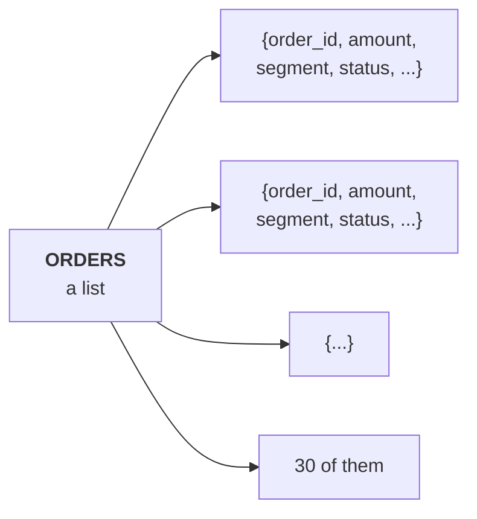
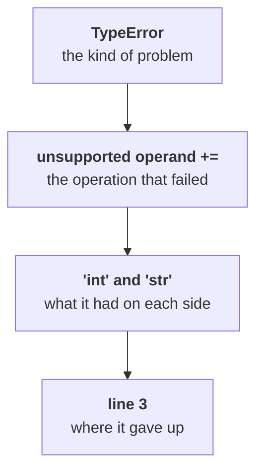
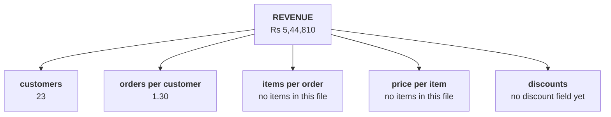
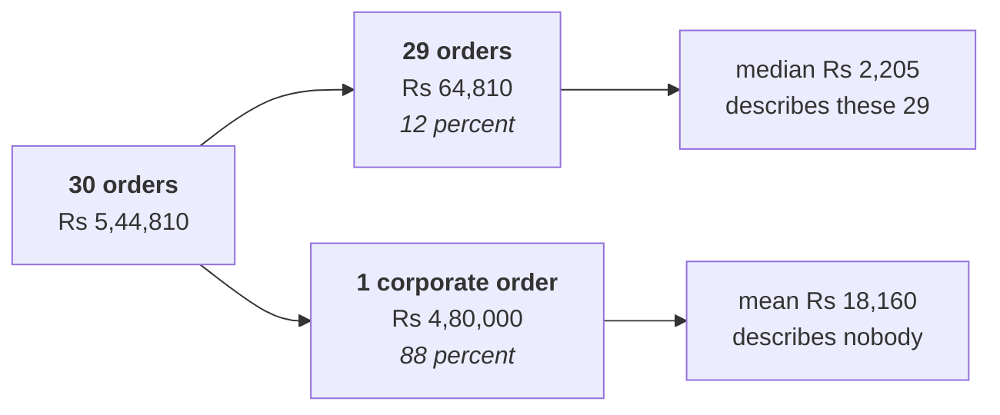
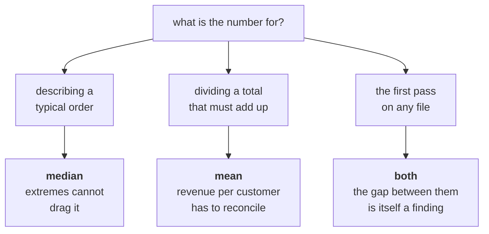

# Half two: counting the leaves, and the average that lies

Week 1, Day 1. Slide source. One idea per slide.

Position bar, repeated at every section boundary:
`[the records] > [the accumulator] > [the leaves] > [the average that lies]`

---

## SECTION A. The records

---

## S1. Thirty orders, nobody explained them
The data team pulled thirty Kalpa Retail orders to get moving. No documentation, no data dictionary, no column notes.

That is the situation you are hired into. The tree tells you what to compute; the file tells you nothing.

---

## S2. One order is a dictionary
```python
{"order_id": "KR-01001", "customer_id": "C-0101", "segment": "Retail-Core",
 "channel": "app", "order_date": "2026-07-21", "amount": 2300, "status": "delivered"}
```

Seven named boxes. You reach into it by name, never by position.

---

## S3. The dataset is a list of them


One shape, thirty times. This is the shape everything in Week 1 has.

---

## S4. Counting is an accumulator
```python
count = 0
for order in ORDERS:
    count = count + 1
```

Start at zero. Walk the list. Add one each time. Three lines, and every leaf on the tree is a variation of them.

---

## S5. Summing is the same shape
```python
total = 0
for order in ORDERS:
    total = total + order["amount"]
```

The only thing that changed is what gets added. Count adds one; sum adds the value.

---

## D6. What does this one do?
```python
total = 0
for order in ORDERS:
    total = total + order["amount"]
print(total)
```

**Question.** Thirty orders, every amount a number in the file you were handed. What appears?

---

## D7. Answer: it stops on order eight
```
TypeError: unsupported operand type(s) for +=: 'int' and 'str'
```

One amount in this file is the text `"4500"` rather than the number `4500`. Python will not add a word to a number, and it says so at the row it reached.

---

## S8. Reading the trace, top to bottom


Four facts in one line of output. A trace is a sentence, and it is read from the bottom line up.

---

## S9. The fix for today, and its cost
```python
total = total + int(order["amount"])
```

`int()` turns the text into a number. It also turns a silent problem into a silent assumption, because nobody wrote down that the file had text in it.

Wednesday is the day that assumption gets a log entry.

---

## SECTION B. The leaves

---

## S10. Four leaves, computed
| Leaf | What it is | Today |
|---|---|---|
| Orders | Rows in the file | 30 |
| Revenue | Sum of amounts | Rs 5,44,810 |
| Customers | Distinct customer ids | 23 |
| Orders per customer | Orders divided by customers | 1.30 |

Two of the five branches now have numbers on them. Three do not, because the file has no items.

---

## S11. The tree, with today's numbers on it


Naming what you cannot compute is half the answer. The other half is asking for it.

---

## S12. Delivered, returned, cancelled
| Status | Orders | Revenue |
|---|---|---|
| Delivered | 21 | Rs 5,20,790 |
| Returned | 5 | Rs 14,970 |
| Cancelled | 4 | Rs 9,050 |

Which of these is "sales"? Finance recognises delivered. Say which one you used, every time.

---

## SECTION C. The average that lies

---

## S13. The average order is Rs 18,160
Thirty orders, Rs 5,44,810 collected, so the average order is Rs 18,160.

Put that in a slide for the CEO and it says Kalpa Retail sells eighteen-thousand-rupee baskets.

---

## D14. Does Rs 18,160 describe a typical order?
**Question.** Sort the thirty amounts and look at the one in the middle. Is the average anywhere near it?

---

## D15. Answer: no. The middle order is Rs 2,205
The average is eight times the middle order. Half the file sits below Rs 2,205 and the average sits above almost all of it.

An average that describes nothing in the file is worse than no number, because it gets quoted.

---

## S16. One order carries 88 percent of the revenue


Take that one order out and the average lands at Rs 2,235, next door to the median.

---

## S17. Which one is honest, and when


---

## S18. The sentence you would send Meera
> "Across thirty orders the typical basket is about Rs 2,200, and one corporate order carries most of the revenue. Before we fund acquisition, I want to check whether the branch that moved is customers or how often they come back. I will have that by Thursday."

Claim, the caveat, the next step. That shape returns every day this week.
