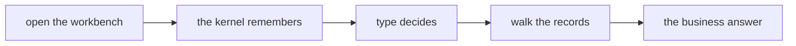
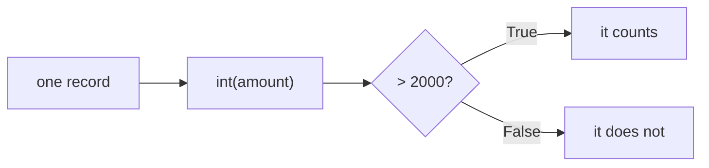
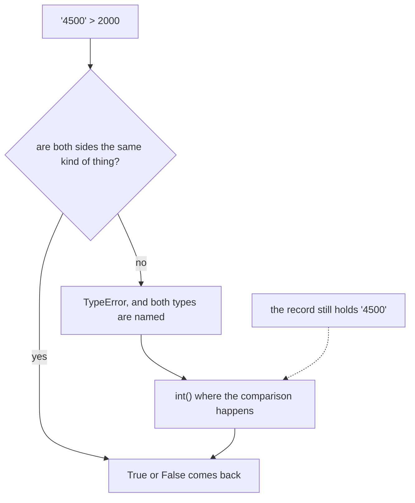
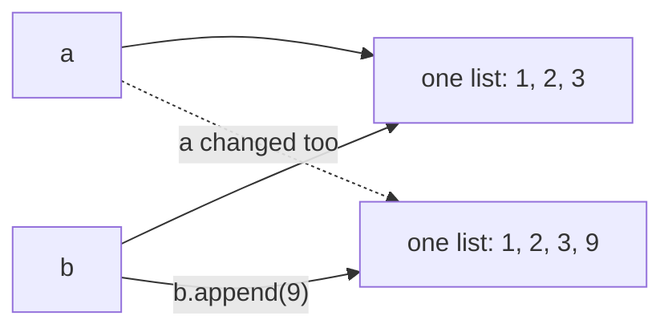
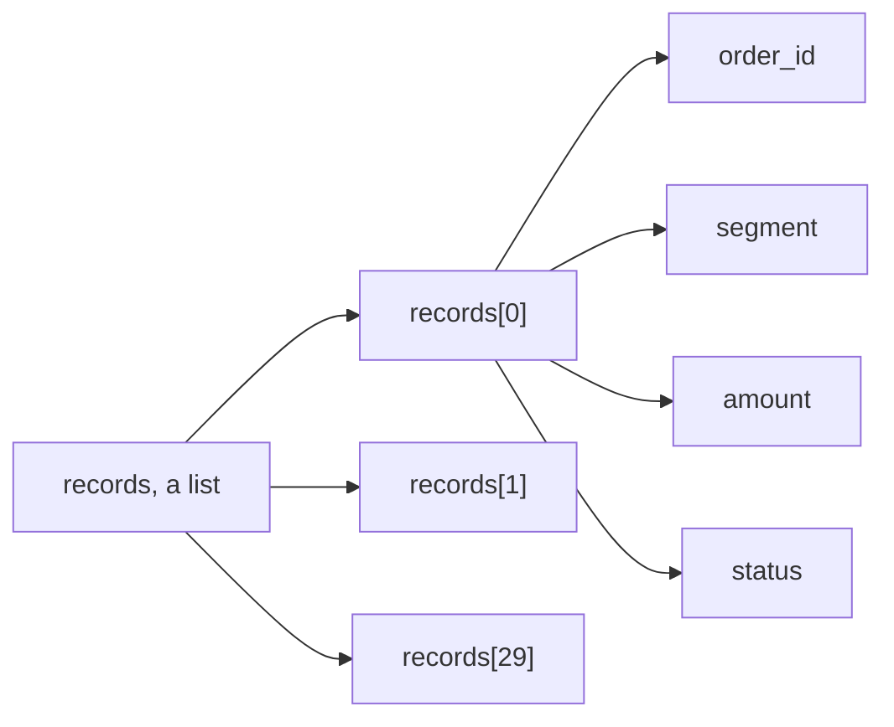
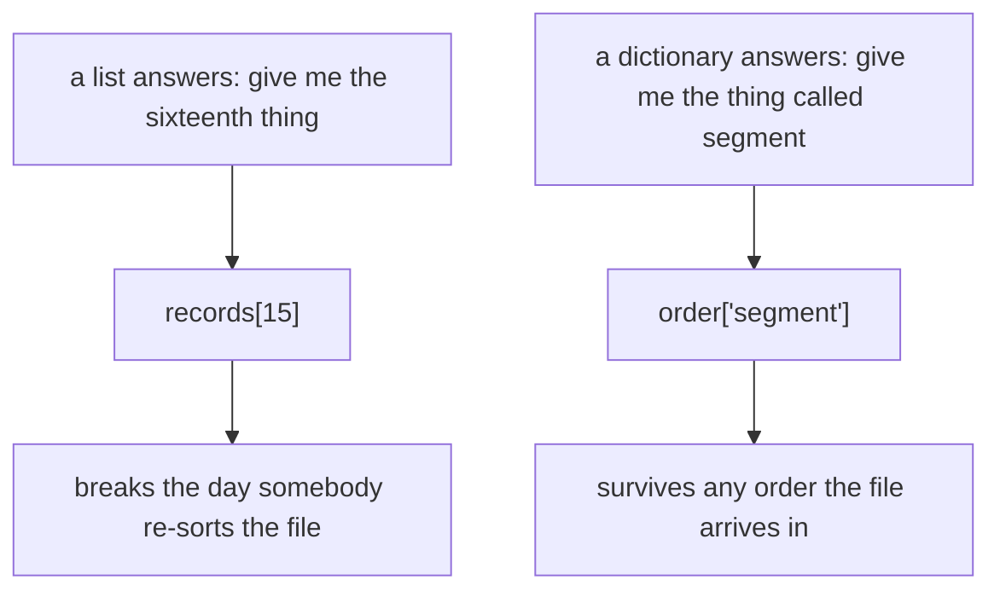
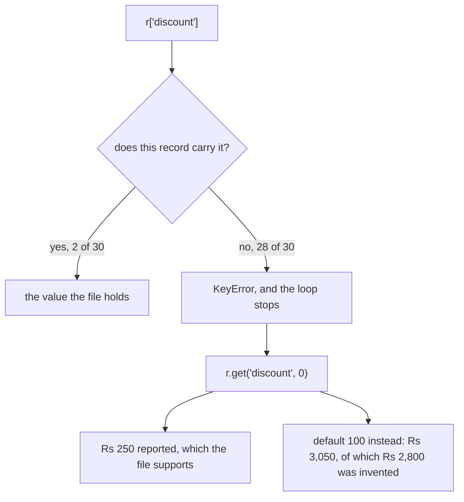
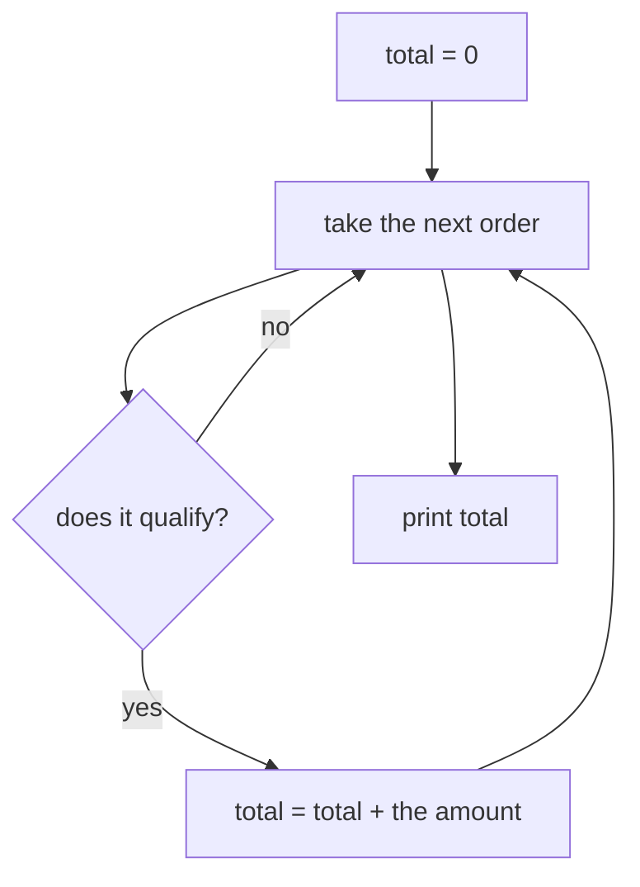
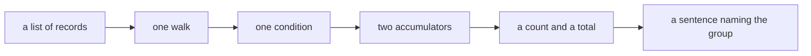

# Half two: the records answer back

Week 1, Day 1. Slide source. One idea per slide.

Position bar, repeated at every section boundary:
`[open the workbench] > [the kernel remembers] > [type decides] > [walk the records] > [the business answer]`

---

## S1. The records answer back
Half one gave you a loop, a condition and an accumulator.

This half points all three at a question somebody actually asked.

---

---

---

## S2. Where we are
`[open the workbench] > [the kernel remembers] > [type decides] > **[walk the records]** > [the business answer]`

The kernel holds your records and you can name a value's type. Now the records have to produce a number.

---



---

---

## S3. The question on the table
Someone on the Kalpa Retail side asks how many of these orders are above Rs 2,000 and what those orders add up to.

Nobody has told you whether the file will cooperate with that question.

---

---

---

## SECTION 1: THE GUIDED BUILD
`[open the workbench] > [the kernel remembers] > [type decides] > **[walk the records]** > [the business answer]`

---

---

---

## S4. Build it with me
The trainer builds this on screen one line at a time, and you build the same lines on your own Codespace at the same pace.

Three pieces, and you already have all three: a loop that walks the records, a condition that asks one question of each record, and two accumulators that remember the answers.

---

---

---

## S5. The condition
```
count = 0
total = 0
for r in records:
    if r["amount"] > 2000:
        count = count + 1
        total = total + r["amount"]
```

Run it.

---

---



---

## S6. The break
```
TypeError: '>' not supported between instances of 'str' and 'int'
```

It stops on the very first record in the file, which is KR4200 storing its amount as the text "4500".

You met this error in half one, and here it is inside the cell you are typing yourself.

---



---

---

## S7. The fix, at the point of use
```
for r in records:
    if int(r["amount"]) > 2000:
```

`int()` takes a value and hands back the whole number it stands for. That is all it is today, a converter you call at the moment you need a number.

You put it where the comparison happens, so the record arrives as text and the comparison still gets a number.

---

---

---

## S8. The answer
```
count = 0
total = 0
for r in records:
    if int(r["amount"]) > 2000:
        count = count + 1
        total = total + int(r["amount"])

print(count, total)
```

```
13 35020
```

13 orders are above Rs 2,000 and they total Rs 35,020, and that is a sentence you can say out loud to the person who asked.

---

---

---

## S9. Two thirteens
The delivered orders came to 13 orders, totalling Rs 25,720.

The orders above Rs 2,000 came to 13 orders, totalling Rs 35,020.

Those are two different groups of orders that happen to hold the same count. Whenever you report either number, name the group it came from.

---

---

---

## S10. Step card, section 1
1. Set both accumulators to zero above the loop.
2. Ask one condition of each record.
3. Convert at the point where you need the number.
4. Report the answer as a sentence with its group named.

---

---

---

## SECTION 2: LISTS
`[open the workbench] > [the kernel remembers] > [type decides] > **[walk the records]** > [the business answer]`

---

---

---

## S11. A list keeps its order
```
ids = ["KR4200", "KR4201", "KR4202", "KR4203", "KR4204"]

ids[0]      "KR4200"
ids[2]      "KR4202"
```

Counting starts at zero, so the first item is item zero and the third item is item two.

---

---

---

## S12. A slice and an append
```
ids[1:3]                ["KR4201", "KR4202"]
ids.append("KR4205")
len(ids)                6
```

A slice takes a run of items, starting at the first number and stopping before the second one.

`append` puts one more item on the end of the list you already have.

---

---

---

## S13. b = a
```
a = ["KR4200", "KR4201"]
b = a
b.append("KR4202")

len(a)      3
```

`b = a` gives the same list a second name. There is one list here and two ways to reach it, so appending through either name changes what both names show.

When you want a second list, say so on purpose:

```
b = list(a)
```

---



---

---

## S13a. Question: after b = a and b.append(9), what is len(a)?
Commit to one before the next slide.

a) 3, since `a` was never mentioned again
b) 4, since both names point at one list
c) A `TypeError`, since a list cannot be extended after assignment
d) 1, since `a` now holds only the appended value

---

---

## S13b. Answer: 4, since one list has two names
**The claim.** `len(a)` is 4. `b = a` copied the name and not the list, so appending through either name changes the one list both names point at.

| Option | Why it does not hold |
|---|---|
| a) 3 | Reads the code as if `b = a` had made a copy. Assignment never copies a list. |
| c) `TypeError` | Appending to a list is always allowed, whatever names point at it. |
| d) 1 | Confuses appending with replacing. Nothing here replaced anything. |

**The mental model.** A name is a label you stick on a thing. Two labels on one box means opening either one shows you the same contents. Copy on purpose with `list(a)` or `a[:]`.

---

---

## S14. Step card, section 2
1. Index from zero.
2. A slice stops before its second number.
3. `append` changes the list in place.
4. Copy with `list(a)` when you want two lists instead of two names.

---

---

---

## SECTION 3: A RECORD HAS NAMES
`[open the workbench] > [the kernel remembers] > [type decides] > **[walk the records]** > [the business answer]`

---

---

---

## S15. A record is a dictionary
```
r = {"order_id": "KR4224", "segment": "Retail-Core", "amount": 1460,
     "status": "delivered", "order_date": "2026-08-17"}

r["status"]     "delivered"
```

A dictionary stores values under names, and you fetch a field by asking for its name. Your loop has been doing this since half one.

---



---

---

## S16. Never by position
Position is a promise the file never made to you.

The day someone adds a column in front of the status field, every position you wrote points one field to the left, and your code keeps running and answers a different question.

A name survives that reordering, and that is the whole argument.

---

---



---

## S17. The break
```
records[0]["discount"]
```

```
KeyError: 'discount'
```

Two of the thirty orders carry a discount field. Asking a dictionary for a name it does not have stops the program, and the error names the field it went looking for.

---



---

---

## S18. Absent is different from empty
Nobody wrote a discount of nothing on the other twenty-eight orders. Those records have no discount field on them at all.

So your code has to say what happens when the name is missing, and that instruction is yours to write.

---

---

---

## S19. .get() with a default
```
r.get("discount", 0)
```

`.get()` asks for a name and takes a second value to hand back when that name is absent.

The program keeps running, and the number that arrives is the number you chose.

---

---

---

## S20. The default is a decision
```
total = 0
for r in records:
    total = total + r.get("discount", 0)
```

With a default of 0, the thirty records total Rs 250 in discounts, which is the sum of the two discounts the file actually records.

With a default of 100, the same thirty records total Rs 3,050, and Rs 2,800 of that is a number you invented twenty-eight times.

Both cells run to the end. Only one of the two totals is a fact.

---

---

---

## S20a. Applied to Kalpa: the two defaults, priced
Two of the thirty Kalpa Retail orders carry a discount, KR4215 at Rs 75 and KR4223 at Rs 175.

A default of zero reports Rs 250, which is exactly what the file holds.

A default of a hundred reports Rs 3,050, of which Rs 2,800 was supplied by you rather than by Kalpa. Nothing on the page says which part came from where.

---

---

## S21. Step card, section 3
1. Fetch a field by its name.
2. Never fetch a field by its position.
3. A `KeyError` means that name is absent from that record.
4. State your default out loud, because it becomes part of your answer.

---

---

---

## SECTION 4: THE BUSINESS ANSWER
`[open the workbench] > [the kernel remembers] > [type decides] > [walk the records] > **[the business answer]**`

---

---

---

## S22. A dataset is a list of dictionaries
```
records = [
    {"order_id": "KR4200", "segment": "Retail-Core", "amount": "4500", "status": "returned", "order_date": "2026-08-03"},
    {"order_id": "KR4201", "segment": "Retail-Plus", "amount": 2395, "status": "delivered", "order_date": "2026-08-03"},
]
```

Thirty records in one list, and each record is a dictionary carrying the same field names. That is the entire shape of the data you have worked on all day.

---

---


---

## S23. So the loop you already wrote walks it
```
total = 0
for r in records:
    if r["status"] == "delivered":
        total = total + int(r["amount"])
```

This is the cell the day ends on, and it answers the question you were shown at the start: "Of these thirty Kalpa Retail orders, how much did we actually collect?"

The converter sits there because you now know one amount in this file is text, and the cell should not depend on which records happen to be tidy.

---



---

---

## S24. The recipe for any of these questions
1. Set your accumulators to zero above the loop.
2. Walk the records one card at a time.
3. Ask one condition of each card.
4. Add to the accumulators only when the condition holds, and print at the end.

---



---

---

## S25. Your three questions
1. How many orders are in the Student segment, and what do they total?
2. How many orders were returned, and what do returned orders total?
3. How many delivered orders are above Rs 2,000, and what do they total?

No hints on these. Work on your own Codespace, and the solution is released at close.

---

---

---

## S26. Tomorrow
These same thirty records arrive tomorrow as a file rather than as a cell you can read on screen.

A file has forgotten every type it ever knew. Every amount, every status and every date arrives as text, and the cell you just wrote has to survive that.

---

---

---

## S27. Crux, half two
A dataset is a stack of named cards, and a loop with a condition and an accumulator turns that stack into one number you can defend.

---

---

---

## S28. Crux, the day
You can take thirty records nobody explained to you and come back with a number, and you can say what would break it.

---

---
