# Which branch does Meera open first?

Week 1, Day 1. Half two.

Kicker: WEEK 1  ·  MONDAY  ·  HALF TWO
Quote: Before I sign anything, I want to understand our own sales. Is acquisition even the branch that is short?
Who: Meera Raghavan, CEO, Kalpa Retail, to the data and AI team at Kalpa's Global Capability Centre

```notes
LIVE, 1 minute. Read Meera's line aloud and leave it on screen. The morning answered three rungs:
what sales is, how many leaves the file carries, and which typical order is honest. The afternoon
climbs the last rung on its own: which branch Meera opens first, and what one window cannot show.
Then the room's wrong answers, a second case in pairs, the interview drill and the close.
```

---

## SECTION 1: The escalated case
*Sixty minutes on your own: Meera's question answered with evidence, and the branch she opens first.*

```notes
LIVE. This block runs 60 minutes: about 9 to brief across S1 to S6, 48 working, 3 to collect on
S6. The trainer does not teach during the working time; the support TA answers environment
problems only. Watch which wrong numbers appear in the room, because the debrief is built from them.
```

---

## S1. Meera wants one branch named by Thursday
*Marketing has put Rs 12 crore on the customers branch, and Meera wants to know if that branch is short.*

**The client asks.** "Before I sign anything, I want to understand our own sales. What is 'sales' made of? Where does revenue come from, by customer type and channel? Is acquisition even the branch that is short?"

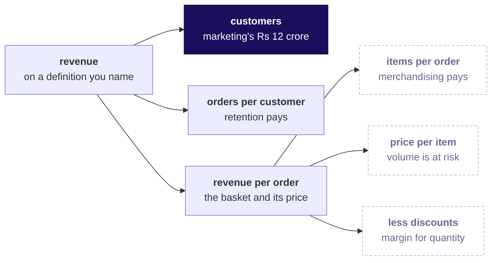
```mermaid
flowchart LR
    R["<b>revenue</b><br/>on a definition you name"] --> C["<b>customers</b><br/>marketing's Rs 12 crore"]
    R --> F["<b>orders per customer</b><br/>retention pays"]
    R --> V["<b>revenue per order</b><br/>the basket and its price"]
    V --> I["<b>items per order</b><br/>merchandising pays"]
    V --> P["<b>price per item</b><br/>volume is at risk"]
    V --> D["<b>less discounts</b><br/>margin for quantity"]
    classDef bet fill:#1A0F5C,stroke:#1A0F5C,color:#FFFFFF
    classDef unknown fill:#FFFFFF,stroke:#B8B2D6,color:#6B6690,stroke-dasharray:4 3
    class C bet
    class I,P,D unknown
```

```notes
LIVE, 2 minutes. This is the morning's tree with marketing's bet placed on it. By Thursday Meera
expects a recommendation on which branch to examine first, and she will ask why the others were
not picked. The dashed branches need fields the file does not carry. Transition: the brief turns her
question into five parts.
```

---

## S2. The escalated case asks five things of you
*One brief in five parts, worked alone for sixty minutes, on a definition of sales you name first.*

```timeline
label: Part 1 | title: The leaves | body: Customers, orders per customer and revenue per order, each on a definition you state.
label: Part 2 | title: The typical order | body: The honest typical order, and why you chose it over the other one.
label: Part 3 | title: The arithmetic | body: What two 10 percent lifts give, and what a 15 percent plan asks of one branch alone.
label: Part 4 | title: The branch | body: The branch Meera opens first, and one reason each of the others waits.
label: Part 5 | title: The sentence | body: One sentence to Meera with its number, its caveat and its next step. | tone: dark
```

The brief is `exercises/unguided/C2_W01_D01_escalated_case_STUDENT.md`, and the notebook `notebooks/C2_W01_D01_ex1_escalated_case_STUDENT.ipynb` has a check cell under every number.

```notes
LIVE, 2 minutes to brief. Leave this slide up while the room works. Nobody pastes the morning's
demonstration cells unread, because part 1 asks for a definition the demonstration did not always
use. If a learner is stuck after fifteen minutes, point them at the part's slide (S3 to S6) and ask
which rung of the morning it repeats. Transition: one slide per part, shown quickly now.
```

---

## S3. Parts 1 and 2: every leaf carries its definition
*Choose booked, not cancelled or delivered first, then count every leaf on that one choice.*

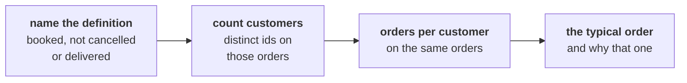
```mermaid
flowchart LR
    A["<b>name the definition</b><br/>booked, not cancelled<br/>or delivered"] --> C["<b>count customers</b><br/>distinct ids on<br/>those orders"]
    C --> D["<b>orders per customer</b><br/>on the same orders"]
    D --> E["<b>the typical order</b><br/>and why that one"]
```

**The rule.** Write the definition beside every number, so a reader who chose another definition can see why your number differs.

```notes
LIVE, 1 minute. Parts 1 and 2 repeat rounds 1 to 3 on one definition of the learner's choosing.
Any definition is right if it is named. Watch for a learner who counts customers on all 30 orders
and orders on the delivered 21; the definition has to hold across numerator and denominator.
Transition: part 3 pushes the tree.
```

---

## S4. Part 3: push the tree and read what comes out
*Revenue is a product of branches, so a lift on one branch multiplies through to the total.*

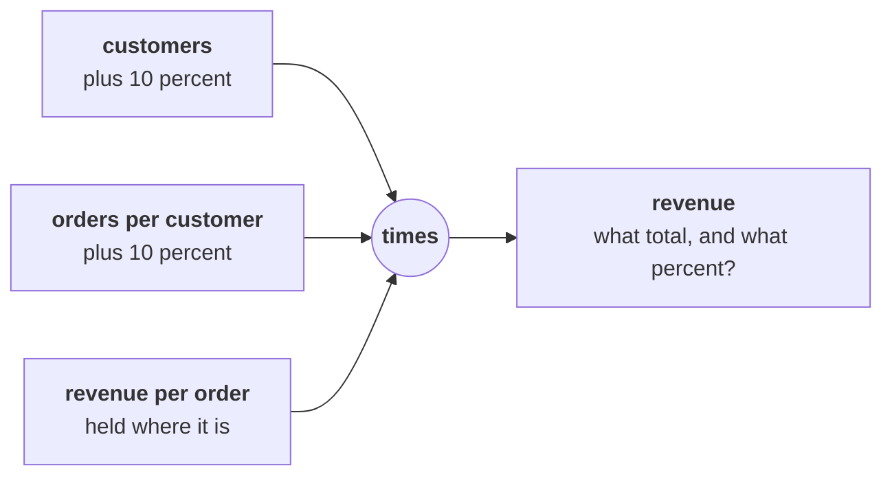
```mermaid
flowchart LR
    C["<b>customers</b><br/>plus 10 percent"] --> X(("<b>times</b>"))
    F["<b>orders per customer</b><br/>plus 10 percent"] --> X
    V["<b>revenue per order</b><br/>held where it is"] --> X
    X --> R["<b>revenue</b><br/>what total, and what percent?"]
```

Write down two numbers: the total when customers and orders per customer each rise 10 percent, and how far one branch alone has to move to deliver the 15 percent plan.

```notes
LIVE, 1 minute. Do not work either number here; both come back in the debrief. The second number
matters for part 4: a branch that has to rise 15 percent on its own is a large ask, and learners
who see it in customers and in orders say what it means in people. Transition: part 4 asks who
pays to move each branch.
```

---

## S5. Part 4: each branch sends a different bill
*Choosing a branch means choosing who pays to move it, and what the file can say about it.*

```cards
icon: users | eyebrow: Customers | title: Acquisition | body: Marketing pays, and the Rs 12 crore request sits on this branch.
icon: repeat | eyebrow: Orders per customer | title: Frequency | body: Retention pays, so the customers Kalpa already has come back more often.
icon: shopping-basket | eyebrow: Items per order | title: Basket | body: Merchandising pays, and this file carries no order lines to measure it.
icon: tag | eyebrow: Price per item | title: Price | body: A rise risks volume, and the file carries no list prices.
icon: percent | eyebrow: Discounts | title: Discount | body: Margin is traded for quantity, and the file has no discount field. | tone: dark
```

```notes
LIVE, 1 minute. Part 4 names one branch and gives each of the others one reason to wait. The
three branches the file cannot measure wait for a data reason; acquisition waits for an evidence
reason, which is what the learner has to find in the leaves. Transition: part 5 is one sentence.
```

---

## S6. Part 5: one sentence Meera can act on
*Claim, evidence, caveat and next step, shown on an invented canteen so the Kalpa sentence stays yours.*

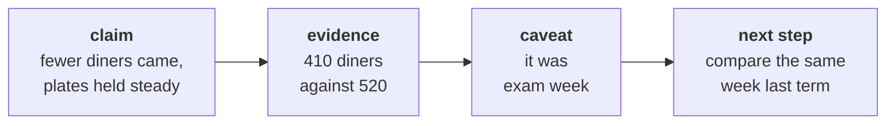
```mermaid
flowchart LR
    A["<b>claim</b><br/>fewer diners came,<br/>plates held steady"] --> B["<b>evidence</b><br/>410 diners<br/>against 520"]
    B --> C["<b>caveat</b><br/>it was<br/>exam week"]
    C --> D["<b>next step</b><br/>compare the same<br/>week last term"]
```

**Kavya's review.** "Before a note goes to Meera I read three things: the definition beside every number, customers counted by their id, and a caveat that says what one window cannot show. A note missing any of them comes back to you."

```notes
LIVE, 2 minutes at the brief and 3 minutes at the end of the hour. The canteen is invented to show
the shape; do not show a Kalpa sentence before the close. At the end of the hour, collect three
written sentences and three part 3 totals on the board without comment, because the debrief runs
on them. Transition: the room's own wrong answers.
```

---

## SECTION 2: The room's wrong answers
*Four numbers that looked right an hour ago, each caught by one check.*

```notes
LIVE. The debrief runs 15 minutes, built from what the room produced. Use the room's own numbers
where they match; the slides carry the four that every room produces. Then a 10-minute break.
```

---

## S7. Which of these four numbers would you sign?
*Four numbers a room produces on this file, each plausible on a first reading.*

```stats
value: 1.00 | label: orders per customer | note: 30 orders over 30 customers
value: Rs 18,160 | label: typical order | note: revenue over orders
value: 20 percent | label: growth | note: two 10 percent lifts, added
value: Rs 5,44,810 | label: sales | note: all 30 orders summed
```

**Question.** Choose one: a) all four, since each came from the file; b) only the sales total; c) only the growth figure; d) none of the four, as written.

```notes
LIVE, 3 minutes. Letters first, then one defender for b: the sales total is a real sum, which is
why it tempts. The answer is d, because each number answers a different question from the one it
claims. Transition: the check that catches each.
```

---

## S8. Answer: none of the four survives its check
*Each number is caught by one check, and each fix changes what Meera would decide.*

| The wrong number | What it misses | The check that catches it | What to report |
|---|---|---|---|
| 1.00 orders per customer | A row is an order, and 7 customers bought twice. | Compare len(rows) with len(set(ids)), which gives 30 against 23. | 23 customers placed 1.30 orders each. |
| Rs 18,160 typical order | 29 of the 30 orders sit below the mean. | Count the orders above the mean, then sort and read the top. | The median, Rs 2,205, is the typical order. |
| 20 percent growth | Branches multiply along the tree. | Recompute revenue through the tree: 1.10 x 1.10. | Two 10 percent lifts give 21 percent. |
| Rs 5,44,810 as sales | Four cancelled orders never became sales. | Count orders by status before summing. | Not cancelled is Rs 5,35,760 on 26 orders. |

```notes
LIVE, 4 minutes. The answer is d. Walk the rows in the order the room met them. Row one is the
number that would have supported the Rs 12 crore: "nobody comes back" makes acquisition look like
the only branch. Row four is right once it carries its name, booked; the error is calling it sales.
Transition: the arithmetic row, drawn.
```

---

## S9. Two 10 percent lifts make 21 percent
*The branches multiply, so the second lift also applies to what the first lift added.*

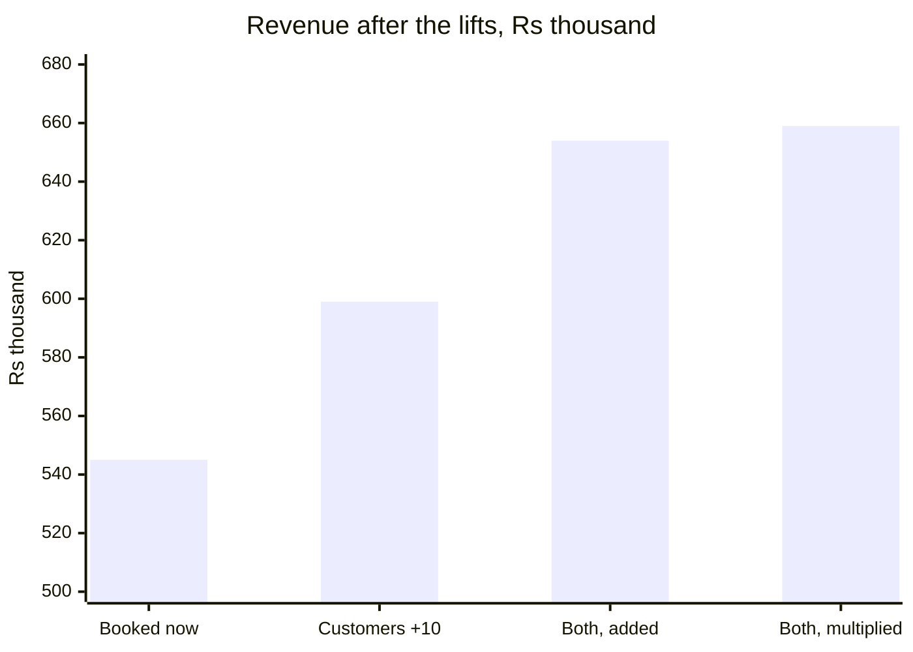
```mermaid
xychart-beta
    title "Revenue after the lifts, Rs thousand"
    x-axis ["Booked now", "Customers +10", "Both, added", "Both, multiplied"]
    y-axis "Rs thousand" 500 --> 680
    bar [545, 599, 654, 659]
```

1.10 x 1.10 is 1.21, so two 10 percent lifts make 21 percent: Rs 6,59,220 against the Rs 6,53,772 that adding gives, Rs 5,448 apart.

```notes
LIVE, 4 minutes. Work it on the board: Rs 5,44,810 times 1.10 is Rs 5,99,291; times 1.10 again is
Rs 6,59,220. Adding the percentages gives Rs 6,53,772. The gap is small at 10 percent and grows
with the lifts: two 30 percent lifts make 69 percent, where adding says 60. The axis starts at
Rs 5 lakh so the gap is visible; say so. Interview question 10 in the drill is this slide. Transition: the 15 percent plan, one branch at a time.
```

---

## S10. The 15 percent plan asks one branch for 15 percent
*Held alone, a branch has to rise by the whole 15 percent, and the file says what that means.*

```stats
value: 26.5 | label: customers | note: from 23, if customers alone carry it
value: 1.50 | label: orders per customer | note: from 1.30, if frequency alone carries it
value: Rs 6,26,532 | label: revenue | note: Rs 5,44,810 times 1.15
```

Five of the 16 customers who bought once coming back for a second order would make 35 orders over 23 customers, which is 1.52 orders each and more than the plan asks.

**In the interview.** [F] A business says 'grow revenue 15 percent'; how do you turn that into questions data can answer?

```notes
LIVE, 3 minutes. Customers alone need about three and a half more customers in this window, which
is what the Rs 12 crore buys. Frequency alone needs four or five more orders from customers Kalpa
already has. Both are 15 percent; the bills differ, which is the part 4 argument. Transition: the
same arithmetic on a discount, for self-study.
```

---

## D11. A discount multiplies too, and can shrink revenue
*A 15 percent discount that lifts quantity 10 percent leaves revenue 6.5 percent lower.*

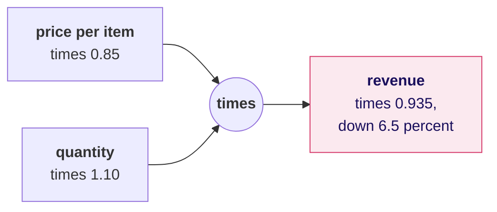
```mermaid
flowchart LR
    P["<b>price per item</b><br/>times 0.85"] --> X(("<b>times</b>"))
    Q["<b>quantity</b><br/>times 1.10"] --> X
    X --> R["<b>revenue</b><br/>times 0.935,<br/>down 6.5 percent"]
    classDef bad fill:#FBE9EF,stroke:#D63A6A,color:#1A0F5C
    class R bad
```

On Rs 5,44,810 that is Rs 5,09,397. The question to ask next is how many of the extra orders came from customers who would have paid full price anyway.

```notes
SELF-STUDY, shown live only if the debrief has time. It is the same multiplication as S9 with one
factor below one. It answers interview question 12 in the drill.
```

---

## SECTION 3: The second case, in pairs
*Forty-five minutes in pairs: where revenue comes from, and whether one channel changes the branch.*

```notes
LIVE, after the 10-minute break. The block runs 45 minutes: 3 to brief on S12, 25 in pairs with
no slides, then S13 to S17 as the debrief, about 17 minutes. Do not show S13 before the pairs work;
it carries the wrong answer the pairs should meet in their own numbers.
```

---

## S12. Meera asks where revenue comes from
*By customer type and by channel, on the same 30 orders, in the second case brief and its notebook.*

**The client asks.** "Where does revenue come from, by customer type and channel?"

| Customer type | Orders | Booked revenue |
|---|---|---|
| Retail-Core | 14 | Rs 32,650 |
| Retail-Plus | 10 | Rs 27,320 |
| Student | 5 | Rs 4,840 |
| Business | 1 | The order your round 3 sort put at the top |

Work in pairs in `exercises/unguided/C2_W01_D01_second_case_STUDENT.md` and `notebooks/C2_W01_D01_ex2_second_case_STUDENT.ipynb`. Segment is recorded on each order, so one customer appears under two types; say so before counting customers per type.

```notes
LIVE, 3 minutes. The table is booked revenue on all 30 orders. The pairs split by channel and by
status themselves. Watch for pairs who count 23 customers across the four types and get 24; that
is the customer recorded under two types. Transition: 25 minutes in pairs, then the debrief.
```

---

## S13. Store brings 91.6 percent, so is growth store-led?
*Booked revenue by channel on all 30 orders, the first chart most pairs draw.*

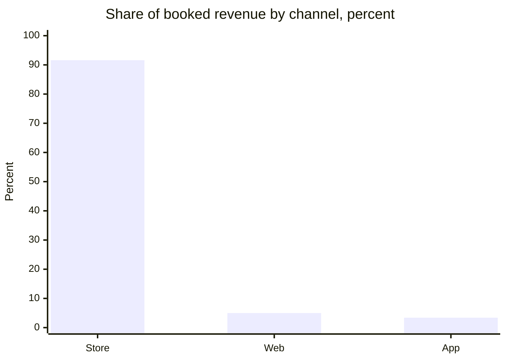
```mermaid
xychart-beta
    title "Share of booked revenue by channel, percent"
    x-axis ["Store", "Web", "App"]
    y-axis "Percent" 0 --> 100
    bar [91.6, 5.0, 3.4]
```

**Question.** Choose one: a) yes, store carries nine rupees in ten, so it gets the budget; b) not yet, count the orders behind each share first; c) yes, and removing cancelled store orders changes little; d) no, app and web hold twenty of the thirty orders.

```notes
LIVE, 3 minutes. Letters first. Expect a from the pairs who stopped at the chart and c from the
pairs who checked cancellations and stopped there. The answer is b. Transition: what the count
shows.
```

---

## S14. Answer: one order carries store's share
*Count the orders behind each share, and store's 91.6 percent rests on one of its ten orders.*

```stats
value: 1 of 10 | label: store orders | note: carry almost all of store's revenue
value: Rs 18,920 | label: store, consumer orders | note: of Rs 64,810 across 29 consumer orders
value: 4 of 9 | label: consumer store orders | note: were cancelled, Rs 9,050
```

**In the interview.** [D] One channel carries nine rupees in ten of revenue; does that change where the growth plan invests?

```notes
LIVE, 4 minutes. The one order is the order the round 3 sort put at the top, and it is real
revenue; nobody deletes it. The fix is to recompute on the 29 consumer orders and to report the top
order on its own line. Among consumer orders store falls from 91.6 percent to about 29 percent.
Transition: the consumer channels, booked against delivered.
```

---

## S15. On consumer orders, web leads and half comes back
*Booked against delivered for each channel, the 29 consumer orders only, in Rs thousand.*

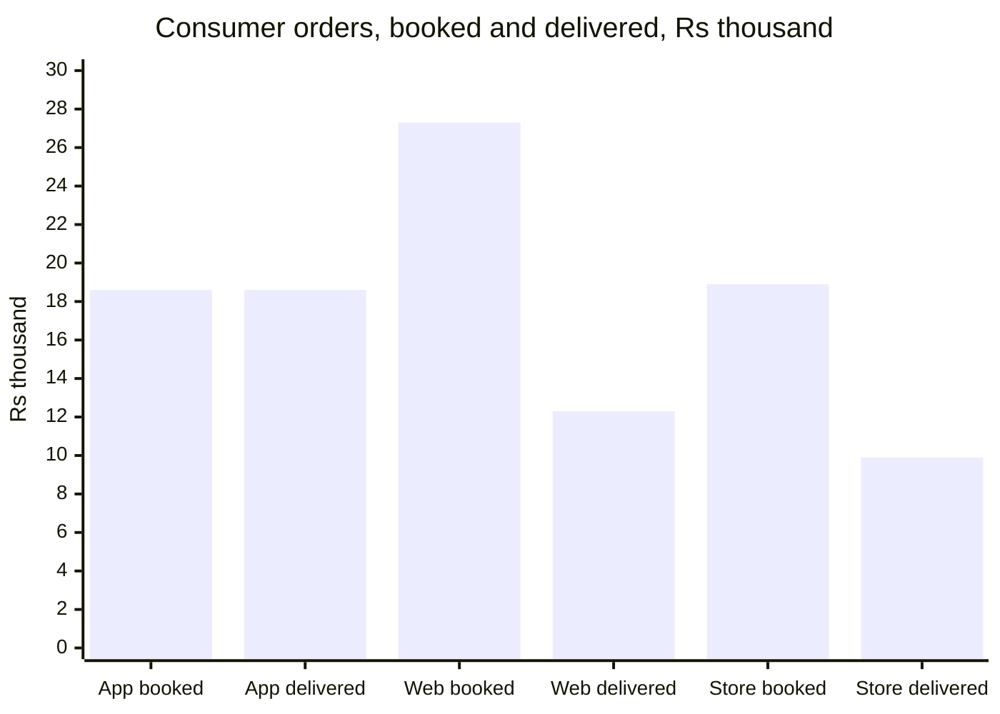
```mermaid
xychart-beta
    title "Consumer orders, booked and delivered, Rs thousand"
    x-axis ["App booked", "App delivered", "Web booked", "Web delivered", "Store booked", "Store delivered"]
    y-axis "Rs thousand" 0 --> 30
    bar [18.6, 18.6, 27.3, 12.3, 18.9, 9.9]
```

Web books the most, Rs 27,290, and 5 of its 10 orders came back for Rs 14,970. App delivered all 10 of its orders, Rs 18,600, and store delivered Rs 9,870 on 5.

```notes
LIVE, 4 minutes. Read the pairs left to right: app is clean, web loses about half its booked
revenue to returns, store loses to cancellations. Ask which channel a finance controller would
call the healthiest, and why the answer is app although web books more. Transition: does this
change the branch?
```

---

## S16. Does one channel change the branch to open first?
*Frequency came out of the escalated case, and the channel view either moves it or adds to the note.*

```stats
value: 16 of 23 | label: customers | note: bought once in the quarter
value: 5 of 10 | label: web orders | note: came back as returns
value: 4 of 9 | label: consumer store orders | note: were cancelled
```

**Question.** Choose one: a) yes, acquisition in store, where nine rupees in ten sit; b) yes, web first, since it books the most consumer revenue; c) no, frequency stays first with two leaks named; d) no, and the channel numbers stay out of the note.

```notes
LIVE, 2 minutes. Letters in pairs. A pair that says b has confused booked with kept revenue. A
pair that says d has thrown away the two findings the second case produced. The answer is c.
Transition: what the note now says.
```

---

## S17. Answer: frequency stays first, with two leaks named
*The channel view leaves the branch where it was and adds two leaks Meera should hear about.*

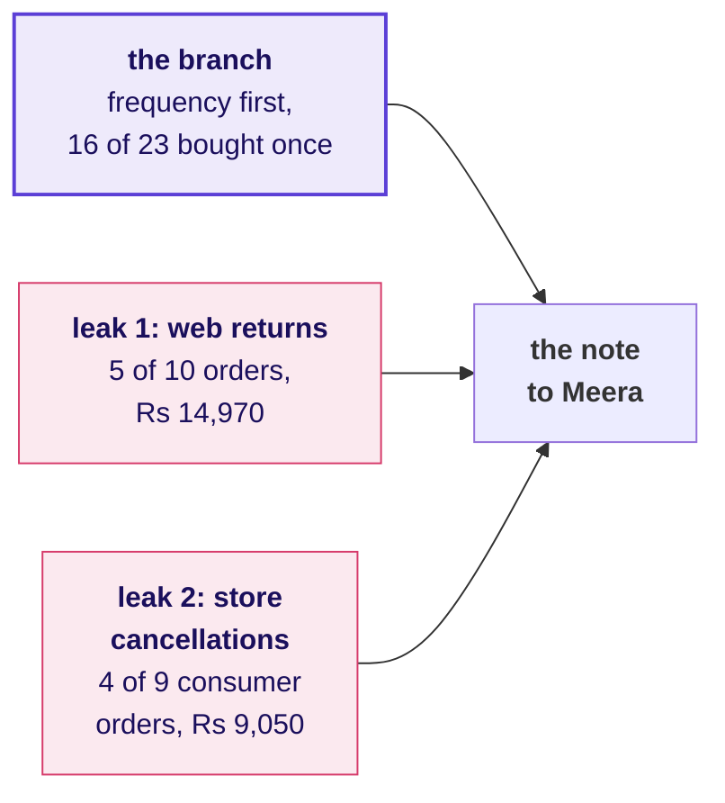
```mermaid
flowchart LR
    B["<b>the branch</b><br/>frequency first,<br/>16 of 23 bought once"] --> N["<b>the note<br/>to Meera</b>"]
    W["<b>leak 1: web returns</b><br/>5 of 10 orders,<br/>Rs 14,970"] --> N
    S["<b>leak 2: store<br/>cancellations</b><br/>4 of 9 consumer<br/>orders, Rs 9,050"] --> N
    classDef known fill:#EEEAFB,stroke:#5B3FD6,color:#1A0F5C,stroke-width:2px
    classDef bad fill:#FBE9EF,stroke:#D63A6A,color:#1A0F5C
    class B known
    class W,S bad
```

**Kavya's review.** "A share is only as strong as the orders behind it. Count them and split them by status, and a 91.6 percent headline turns into two leaks and a branch that stayed where it was."

```notes
LIVE, 4 minutes. The answer is c. The leaks are for the note, and neither is a branch: returns and
cancellations sit between booked and delivered revenue on every branch. Tuesday's two quarters
test whether either leak grew. Transition: the interview drill.
```

---

## SECTION 4: The interview drill
*Thirty minutes aloud in pairs: twelve questions from today, each answered in under a minute.*

```notes
LIVE. The drill runs 30 minutes, about 10 per slide. In pairs, one asks and one answers aloud in
under a minute, then they swap. The answers below are one breath each; the full answers are in the
study notes. Listen for a number with its definition in every answer.
```

---

## S18. Four questions on what sales is and who bought
*In pairs: one asks, one answers aloud in under a minute, then swap.*

| Tag | Question |
|---|---|
| [F] | What counts as "sales": booked, net of cancellations, or delivered, and which do you give a CEO? |
| [F] | Your extract shows 30 orders and 30 customers; what do you check before saying nobody comes back? |
| [SV] | How do you count distinct customers in Python, and why does a set give the answer a list does not? |
| [SV] | A list against a dictionary: when do you reach for each? |

```notes
LIVE, 10 minutes. One breath each.
Sales: name all three and give the CEO the one that fits the decision, delivered for what Kalpa
kept and not cancelled for demand, with the definition beside the number.
Thirty and thirty: check whether 30 is rows or distinct customer ids; here the set gives 23, so 7
customers came back.
Distinct customers: put the ids in a set, which keeps each value once, so its length is the
distinct count; a list keeps every repeat.
List against dictionary: a list when order and position matter, a dictionary when you look a
value up by a key, as ORDERS is a list of dictionaries.
```

---

## S19. Four questions on the typical order and the tree
*The same drill, on the numbers from round 3 and the escalated case.*

| Tag | Question |
|---|---|
| [S] | Mean or median for order value, and why? |
| [S] | The mean order is Rs 18,160 and the median Rs 2,205; what do you tell the business about its orders? |
| [F] | Marketing says a 10 percent lift in customers and a 10 percent lift in frequency make 20 percent growth; what is the right number, and when does the difference matter? |
| [D] | A 15 percent discount lifts quantity 10 percent; did revenue rise or fall, and what would you ask next? |

```notes
LIVE, 10 minutes. One breath each.
Mean or median: the median for a typical order, because one large order drags the mean; the mean
where a total must multiply back, and both on a first look.
Rs 18,160 against Rs 2,205: most orders are small and one order at the top drags the mean; value a
first order near Rs 2,205 and name the top order on its own line.
Two 10 percent lifts: 1.10 times 1.10 is 1.21, so 21 percent, Rs 6,59,220; the gap grows as the
lifts grow.
The discount: 0.85 times 1.10 is 0.935, so revenue fell 6.5 percent; ask how many extra orders
would have been placed at full price.
```

---

## S20. Four questions on the branch and the budget
*The drill's last four, where the answer is a recommendation with its evidence.*

| Tag | Question |
|---|---|
| [S] | How would you increase sales for an online retailer? |
| [F] | A business says 'grow revenue 15 percent'; how do you turn that into questions data can answer? |
| [D] | Marketing wants budget for acquisition; what would you check before agreeing it is the right branch, and how would you say no? |
| [D] | One channel carries nine rupees in ten of revenue; does that change where the growth plan invests? |

```notes
LIVE, 10 minutes. One breath each.
Increase sales: draw the tree, measure each branch, and open the one with room to move and the
cheapest bill before spending on any.
Grow 15 percent: split revenue into branches, ask which moved and by how much, and say what 15
percent asks of each branch alone.
Acquisition budget: check orders per customer and repeat buyers first; here 16 of 23 bought once,
so say "frequency first, and the budget waits for two quarters".
Nine rupees in ten: count the orders behind the share; here one order carries it, and on consumer
orders the channel view adds leaks without moving the branch.
```

---

## SECTION 5: The close
*The Kahoot, the sentence to Meera, five lines to keep, and the question she sends back.*

```notes
LIVE. The close runs 20 minutes: the Kahoot 10, the sentence 4, the five lines 3, Tuesday's
question 3.
```

---

## S21. Kahoot: today's traps, played for speed
*Ungraded, for you and for the trainer: it shows what the day left in the room.*

```stats
value: 8 | label: items | note: one per trap and branch of the day
value: 0 | label: scores recorded | note: ungraded, every day of the week
value: 10 min | label: to play | note: then the missed ones, discussed
value: 1 | label: return question | note: from today, in Tuesday's Kahoot
```

```notes
LIVE, 10 minutes. Run the Kahoot pack from the kahoot folder. Pause on any item below 60 percent
correct and ask one learner who got it right to explain it. Transition: the sentence to Meera.
```

---

## S22. The sentence to Meera, with its caveat
*Four parts in one sentence, and a decision she can hold until Tuesday.*

> "On the 30 orders from 1 July to 26 September, 23 customers placed 1.30 orders each at a typical order of Rs 2,205, and 16 of them bought only once, so I would open frequency before acquisition; this one window cannot show which branch moved, so hold the Rs 12 crore until Tuesday's two quarters." The data and AI team, to Meera Raghavan, CEO, Kalpa Retail

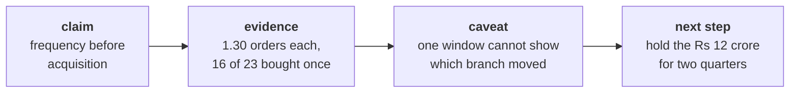
```mermaid
flowchart LR
    A["<b>claim</b><br/>frequency before<br/>acquisition"] --> B["<b>evidence</b><br/>1.30 orders each,<br/>16 of 23 bought once"]
    B --> C["<b>caveat</b><br/>one window cannot show<br/>which branch moved"]
    C --> D["<b>next step</b><br/>hold the Rs 12 crore<br/>for two quarters"]
```

```notes
LIVE, 4 minutes. Read it aloud once, then have two learners read their own from the escalated
case and let the room check each for the four parts. A sentence without its evidence is an
opinion, and one without its caveat is a promise. Transition: the five lines.
```

---

## S23. Five lines to carry out of Monday
*Each line is a trap from today turned into a habit.*

```cards
num: 1 | eyebrow: Round 1 | title: Definition | body: Name the definition before the number: booked, not cancelled, or delivered.
num: 2 | eyebrow: Round 2 | title: Customers | body: Count customers by their id, never by the rows.
num: 3 | eyebrow: Round 3 | title: Typical order | body: Report the median when one order can move the mean, and say why.
num: 4 | eyebrow: The case | title: The tree | body: Lifts multiply along the tree: two 10 percent lifts make 21 percent.
num: 5 | eyebrow: The caveat | title: Two windows | body: One window shows the shape of revenue; only two windows show which branch moved. | tone: dark
```

```notes
LIVE, 3 minutes. Read the five lines aloud. They are the same lines on the cheat sheet and in the
study notes, word for word. Ask which one the learner's own escalated case broke, and note the
answers for Tuesday's opening. Transition: Meera's reply.
```

---

## S24. Tomorrow, Meera asks which branch moved
*Meera has read today's numbers, and her reply is Tuesday's work.*

**The client asks.** "So revenue is customers, times how often they buy, times basket, times price. Now: which of those moved? Q2 was Rs 1.9 crore, Q1 was 2.1."

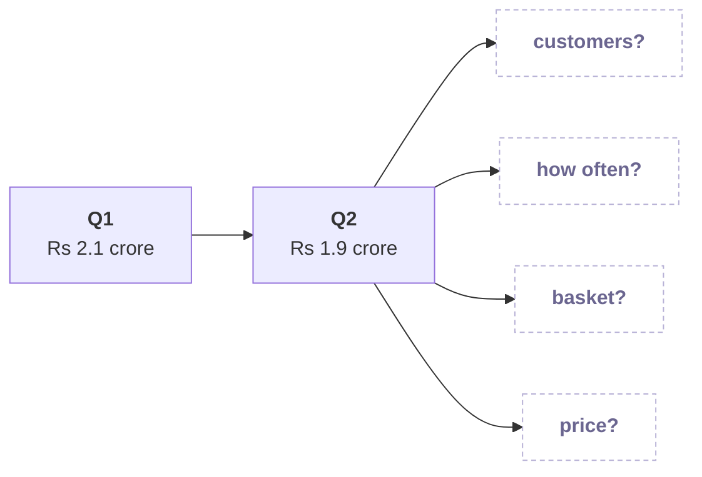
```mermaid
flowchart LR
    Q1["<b>Q1</b><br/>Rs 2.1 crore"] --> Q2["<b>Q2</b><br/>Rs 1.9 crore"]
    Q2 --> C["<b>customers?</b>"]
    Q2 --> F["<b>how often?</b>"]
    Q2 --> B["<b>basket?</b>"]
    Q2 --> P["<b>price?</b>"]
    classDef unknown fill:#FFFFFF,stroke:#B8B2D6,color:#6B6690,stroke-dasharray:4 3
    class C,F,B,P unknown
```

```notes
LIVE, 3 minutes. Read Meera's reply and stop. Do not predict the answer; Tuesday's file settles
it. Remind the room of the take-home and the pre-read, and that the practice lab follows with the
TA.
```
