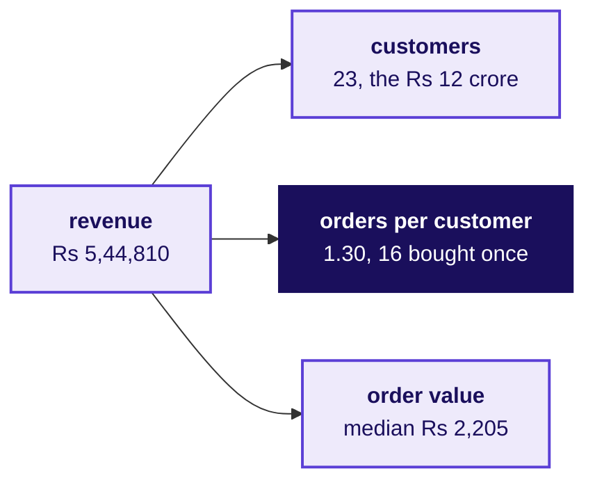
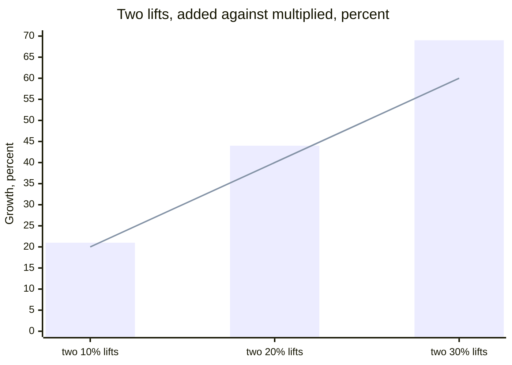
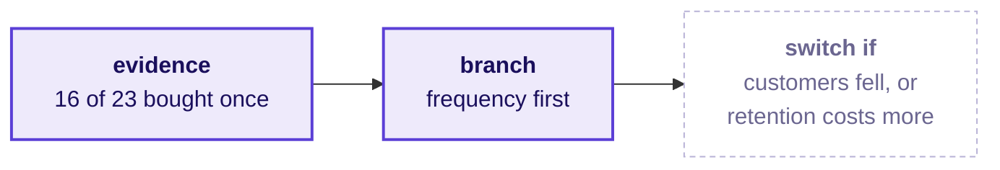
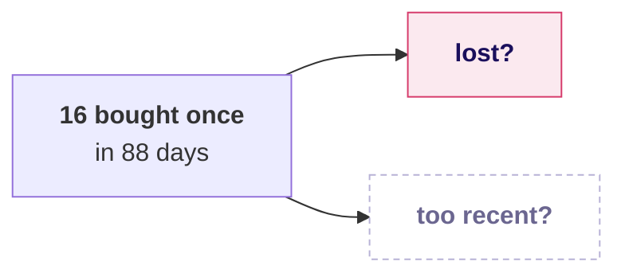
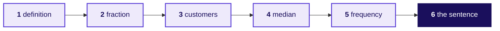
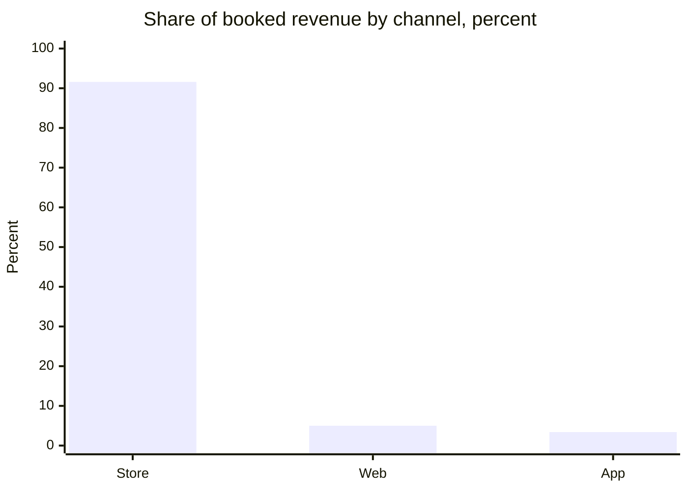
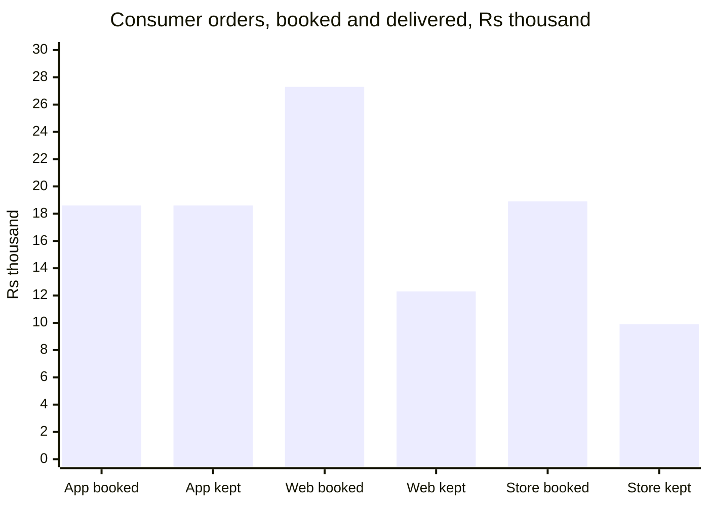
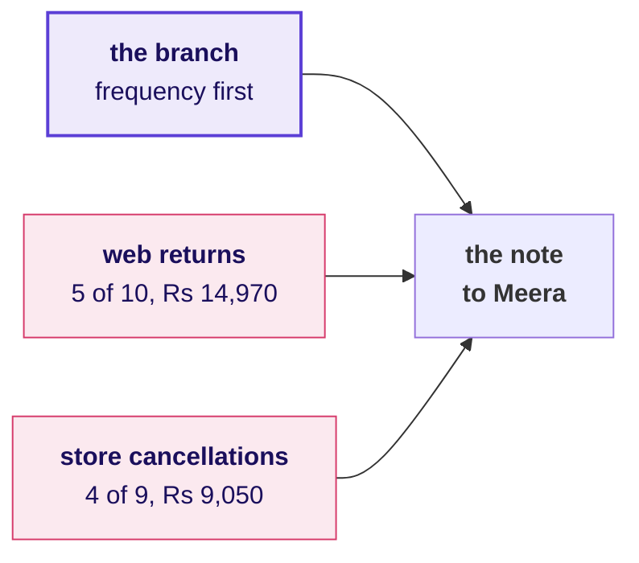
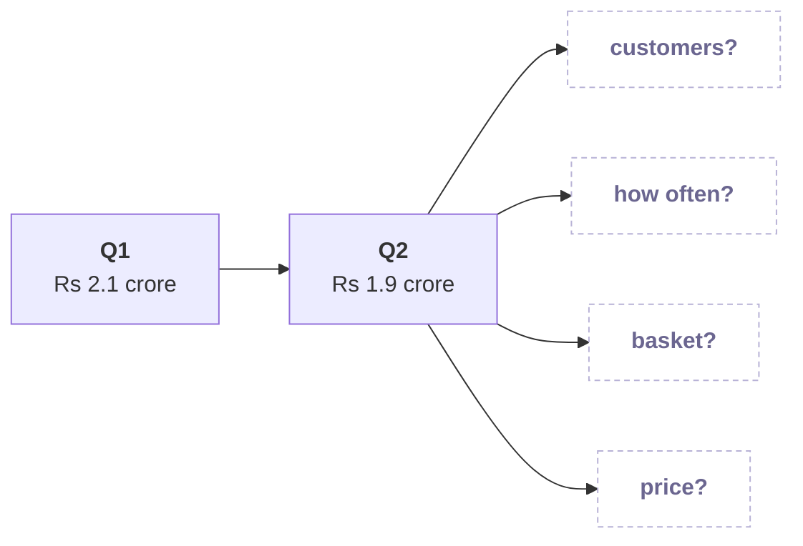

# The branch, the sentence and the cases

Week 1, Day 1. Half two.

Kicker: WEEK 1  ·  MONDAY  ·  AFTERNOON
Quote: Is acquisition even the branch that is short?
Who: Meera Raghavan, CEO, Kalpa Retail, before she signs Rs 12 crore

```notes
On screen before the clock starts. The board tree from the morning is still up: 23 customers, 1.30 orders each,
16 bought once, a typical order of Rs 2,205. The afternoon opens on it.
Transition: chapter 5, which branch Meera opens first.
```

---

## SECTION 5: Which branch first
*The plan asks little of either customer branch; the evidence says which one to test.*

```notes
LIVE, 30 minutes: the need (3), the options sized (7), the build (5), the trap (8), the second
route (4), Kavya's review (3). Notebook 05 is the demonstration.
```

---

## S1. Meera wants one branch, and why not the others
*Every branch is measured, and marketing has proposed moving one of them for Rs 12 crore.*

**The client asks.** "Is acquisition even the branch that is short?"

| | |
|---|---|
| The metric at stake | Growth against the 15 percent plan, sized on the 29 everyday orders |
| Who asks | Meera; the marketing lead owns acquisition, the head of Retail-Plus owns the members who come back |
| What a wrong number costs | Rs 12 crore on the branch that was fine, sized by adding lifts that multiply |

```notes
LIVE, 2 minutes. Point at the board tree. The question is now a choice between branches, and a
choice needs the cost of each option beside it.
Transition: companies that pay for frequency directly.
```

---

## S2. Flipkart and Amazon pay to buy frequency
*A membership is a bet on the orders-per-customer branch.*

```cards
icon: badge-check | eyebrow: Flipkart | title: Flipkart Black, Rs 1,499 a year | body: Flipkart launched it in 2025, evolving it from its VIP programme (Flipkart Stories, 12 September 2025).
icon: package | eyebrow: Amazon India | title: Prime, Rs 399 to Rs 1,499 a year | body: Amazon offers the plans in India (About Amazon India).
icon: repeat | eyebrow: Kalpa | title: Retail-Plus, the paid tier | body: Kalpa's own frequency bet already exists, and its head is one of today's stakeholders. | tone: dark
```

```notes
LIVE, 1 minute. Both companies could have spent the money on acquisition and chose to pay
existing customers to come back more often. Free or faster delivery removes the reason to batch.
Transition: what the plan asks of each branch.
```

---

## S3. The plan asks 3.3 customers or 4.35 orders
*The 29 everyday orders: 22 customers, 15 bought once; Rs 9,722 more.*

| Option | The plan needs | Evidence in this file |
|---|---|---|
| A. Customers | 3.3 more who buy like today's | None; one window cannot show customers falling. |
| B. Frequency | 4.35 more orders from the same 22 | 7 already came back. |
| C. Order value | Rs 335 more on every order | Items and prices are not in the file. |
| D. Price | Every price 15 percent higher, nobody leaving | None, and nothing sells above MRP. |

**The rule.** B is the best fit: 4 or 5 of the 15 one-time buyers returning once at the everyday mean of Rs 2,235 carries the plan, and a retention test costs a reminder to people already on the list.

```notes
LIVE, 7 minutes. Say why the base is the 29: the order at the top of chapter 4's sort carries most
of booked revenue, and no offer repeats it; on booked revenue the plan reads 4.5 orders, but each
would have to be worth the Rs 18,160 mean. Walk the four. A and B are small asks in customers' actions; the difference is
who is asked: people Kalpa has never met, or people who already bought. C rests on an average the
morning showed one order drags.
What would change the call: Tuesday's second quarter showing customers falling while frequency
held, or a cost per retained order above the cost of acquiring a customer.
Transition: the branch on the tree.
```

---

## S4. Frequency is the branch to open first
*Sixteen customers are one order away from moving it.*


```mermaid
flowchart LR
    R["<b>revenue</b><br/>Rs 5,44,810"] --> C["<b>customers</b><br/>23, the Rs 12 crore"]
    R --> F["<b>orders per customer</b><br/>1.30, 16 bought once"]
    R --> A["<b>order value</b><br/>median Rs 2,205"]
    classDef known fill:#EEEAFB,stroke:#5B3FD6,color:#1A0F5C,stroke-width:2px
    classDef bet fill:#1A0F5C,stroke:#1A0F5C,color:#FFFFFF
    class R,C,A known
    class F bet
```

```stats
value: 16 | label: bought once | note: of 23 customers
value: 7 | label: came back | note: frequency is live
```

```notes
LIVE, 5 minutes. Light the frequency branch on the board tree. Notebook 05's build draws the same
tree and counts the one-time buyers.
Transition: marketing answers with a bigger plan.
```

---

## S5. Wrong answer: two 10 percent lifts make 20
*Marketing proposes funding both branches and adds the lifts.*

**The plausible wrong answer.** "Fund acquisition and retention together: 10 percent more customers and 10 percent more orders each make 20 percent growth, Rs 77,772."

```stats
value: 20% | label: the slide's growth | note: 10 plus 10
value: Rs 77,772 | label: the slide's revenue | note: Rs 64,810 x 1.20, everyday orders
```

The slide's arithmetic is the one most rooms do in their heads.

```notes
LIVE, 4 minutes. Ask for the right number before the next slide; take hands for 20, 21, 10 or 11.
Transition: the check.
```

---

## S6. The check: recompute through the tree, 21 percent
*The second lift applies to a customer base already 10 percent larger.*


```mermaid
xychart-beta
    title "Two lifts, added against multiplied, percent"
    x-axis ["two 10% lifts", "two 20% lifts", "two 30% lifts"]
    y-axis "Growth, percent" 0 --> 70
    bar [21, 44, 69]
    line [20, 40, 60]
```

1.10 x 1.10 = 1.21: Rs 78,420, Rs 648 above the slide. The line is the added figure and the bars the multiplied one; the gap grows with the lifts.

```notes
LIVE, 4 minutes. Work it on the board, on the 29 everyday orders: Rs 64,810 x 1.10 = Rs 71,291; x 1.10 again =
Rs 78,420. What it would mislead: a target sized by addition is missed by the lift on the lift.
The same rule prices a discount: 0.85 x 1.10 = 0.935, a 6.5 percent fall.
Transition: the lift, part by part.
```

---

## S7. A second route: the lift as four parts
*The base, two lifts of Rs 6,481 each, and the lift on the lift of Rs 648.*

| Part | Rs |
|---|---|
| Everyday orders, this quarter | 64,810 |
| Customers up 10 percent | 6,481 |
| Orders per customer up 10 percent | 6,481 |
| The lift on the lift, 0.10 x 0.10 | 648 |
| After both lifts | 78,420 |

**The rule.** Multiply the factors for the total; build the parts when someone asks where the extra came from, since the lift on the lift shows as its own line.

```notes
LIVE, 4 minutes. Notebook 05 draws this as a bridge and asserts it lands on the multiplied total.
Bring the parts route to marketing: the lift on the lift has its own line.
Transition: Kavya's review.
```

---

## S8. Chapter 5 opens frequency, and knows the rule
*The branch the evidence points at, and the arithmetic whichever branch is funded.*


```mermaid
flowchart LR
    E["<b>evidence</b><br/>16 of 23 bought once"] --> B["<b>branch</b><br/>frequency first"]
    B --> S["<b>switch if</b><br/>customers fell, or<br/>retention costs more"]
    classDef known fill:#EEEAFB,stroke:#5B3FD6,color:#1A0F5C,stroke-width:2px
    classDef unknown fill:#FFFFFF,stroke:#B8B2D6,color:#6B6690,stroke-dasharray:4 3
    class E,B known
    class S unknown
```

**Kavya's review.** "Pick the branch the evidence points at and the one that costs least to test, then say what would make you pick another. And recompute anything someone adds up."

**In the interview.** [D] Marketing wants budget for acquisition; what would you check before agreeing it is the right branch, and how would you say no?

```notes
LIVE, 3 minutes. One learner answers aloud: count customers by id and repeat buyers, price a
new customer on the everyday orders' mean with the top order set aside, ask for the prior quarter; the no is a no for now with a date.
Transition: chapter 6, the sentence.
```

---

## SECTION 6: The sentence
*One sentence she can sign against, and the one number in it most likely to be misread.*

```notes
LIVE, 30 minutes: the need (3), the options (5), the build (4), the trap and the fix (12), the
second route (3), Kavya's review (3). Notebook 06 is the demonstration.
```

---

## S9. Meera will read one sentence, and so will marketing
*The answer, the evidence and its limit, in the time it takes to read one line.*

| | |
|---|---|
| The metric at stake | The repeat picture: who came back, who has not, who has not had time to |
| Who asks | Meera signs; Kavya reviews first; the marketing lead reads it for its weakest number |
| What a wrong number costs | A claim marketing knocks down in one question, and the trust the week depends on |

```notes
LIVE, 2 minutes. Meera will not read five notebooks. Marketing will read the sentence looking for
the number it can recompute into a different story.
Transition: a real company's first-window number.
```

---

## S10. Klarna's first month was not its verdict
*A first window's number, and what fifteen months later showed.*

```timeline
label: February 2024 | title: Two-thirds of chats | body: Klarna reported its AI assistant handled two-thirds of customer-service chats in its first month (Klarna, 27 February 2024).
label: May 2025 | title: Quality, fifteen months on | body: Its chief executive said the focus on cost had lowered quality, and customers would always reach a human (Fortune, 9 May 2025).
```

A number from one window, read as the verdict, is the risk this chapter's caveat guards against.

```notes
LIVE, 1 minute. The dossier's section 8 tells the full case. The point: one window shows a shape,
and the verdict needs the next window.
Transition: four ways to hand Meera the answer.
```

---

## S11. One sentence carries the decision and its limit
*Four ways to answer, sized in Meera's reading time.*

| Option | Reading time | Carries a decision? |
|---|---|---|
| A. One number, 1.30 orders each | 2 seconds | No; she supplies the meaning. |
| B. The tree as a table | a minute or more | No; she picks the number that suits the room. |
| C. One sentence: evidence, branch, caveat, ask | about 20 seconds | Yes, with its limit. |
| D. A weekly dashboard | weeks to build | Whatever she looks at. |

**The rule.** C is the best fit. D earns its build cost when the question turns weekly, as it does when Meera's chief of staff asks for the leadership deck in Week 2.

```notes
LIVE, 5 minutes. Walk the four. The sentence is the only option that carries a decision and its
limit together.
Transition: build the first draft.
```

---

## S12. The build: the first draft of the sentence
*Evidence with its window, the branch, the caveat and the ask, from the chapters' numbers.*

> "On the 30 booked orders from 1 July to 26 September, 23 customers placed 1.30 orders each at a typical order of Rs 2,205, and 16 of them bought only once, so I would open frequency before acquisition, and since one quarter cannot show which branch moved, hold the Rs 12 crore until Tuesday's two quarters." The first draft


```mermaid
flowchart LR
    A["<b>evidence</b><br/>with its window"] --> B["<b>branch</b><br/>frequency"] --> C["<b>caveat</b><br/>one quarter"] --> D["<b>ask</b><br/>hold the budget"]
    classDef known fill:#EEEAFB,stroke:#5B3FD6,color:#1A0F5C,stroke-width:2px
    classDef bet fill:#1A0F5C,stroke:#1A0F5C,color:#FFFFFF
    class A,B,C known
    class D bet
```

```notes
LIVE, 4 minutes. Notebook 06 builds the draft from variables so no number drifts from the work.
Ask which number in it marketing will reach for first. Most say the 16.
Transition: a colleague tightens the draft for the slide.
```

---

## S13. Question: how many of the 16 are lost?
*One quarter of orders, and a number that reads like churn.*

**Question.** Of the 16 who bought once, how many can you call lost from this file: a) all 16, which is 70 percent of 23 customers; b) 9, the ones who bought most recently; c) at most 7, the ones past the usual gap; d) none, since 7 customers did come back?


```mermaid
flowchart LR
    O["<b>16 bought once</b><br/>in 88 days"] --> L["<b>lost?</b>"]
    O --> R["<b>too recent?</b>"]
    classDef bad fill:#FBE9EF,stroke:#D63A6A,color:#1A0F5C
    classDef unknown fill:#FFFFFF,stroke:#B8B2D6,color:#6B6690,stroke-dasharray:4 3
    class L bad
    class R unknown
```

```notes
LIVE, 2 minutes. Present the 70 percent as the colleague's tightened draft of S12's sentence, which is how it
would reach Meera. Take letters by hand; most pick a. Ask the question marketing would ask: how long do
our customers usually take to come back?
Transition: the answer.
```

---

## S14. Answer: 9 of the 16 are too recent to judge
*Returning customers took a median of 45 days; 9 one-time buyers bought inside the last 45.*

**The plausible wrong answer.** "16 of 23 never came back: 70 percent of our customers are lost."

```stats
value: 45 days | label: median repeat gap | note: from the 7 who came back
value: 9 | label: too recent to judge | note: under 45 days before the end
value: 7 | label: past the usual gap | note: at most 7 of 23 look lost
```

**The rule.** The answer is c. A one-time buyer is not a lost customer until they have had time to come back.

```notes
LIVE, 8 minutes. What 70 percent would mislead: retention looks like an emergency on a number
marketing knocks down in one question. The check measures the usual gap from the customers who did
return and holds back everyone who has not had that long. The fix: 7 came back, 7 are past the usual
gap, 9 are too recent. The gap rests on 7 customers, and an 88-day window only sees short gaps, so
45 days is a floor and the sentence claims nothing beyond it.
The same edge hides in returns rates, renewals and young cohorts: the dossier's returns trap.
Transition: the sentence.
```

---

## S15. Fix: the sentence with the window's edge
*The 16 becomes the split: 7 came back, 7 past the usual gap, 9 too recent.*

> "On the 30 booked orders from 1 July to 26 September, 23 customers placed 1.30 orders each at a typical order of Rs 2,205; 7 came back, 7 are past the usual gap without a second order, and 9 bought too recently to judge, so I would open frequency before acquisition, and since one quarter cannot show which branch moved, hold the Rs 12 crore until Tuesday's two quarters." The data and AI team, to Meera Raghavan


```mermaid
flowchart LR
    A["<b>evidence</b><br/>with its window"] --> B["<b>branch</b><br/>frequency"] --> C["<b>caveat</b><br/>one quarter"] --> D["<b>ask</b><br/>hold the budget"]
    classDef known fill:#EEEAFB,stroke:#5B3FD6,color:#1A0F5C,stroke-width:2px
    classDef bet fill:#1A0F5C,stroke:#1A0F5C,color:#FFFFFF
    class A,B,C known
    class D bet
```

```notes
LIVE, 2 minutes. What changed: the 16 is replaced by the split, and the sentence carries no "lost"
and no percentage marketing can recompute. Notebook 06's checks assert each number is in it.
Transition: the same caveat another way.
```

---

## S16. A second route: due dates give the same 9
*Order date plus the typical gap, compared with the window's last day.*

```python
too_recent = [c for c in once if (end - first[c]).days < 45]          # recency
due_late   = [c for c in once if first[c] + timedelta(days=45) > end]  # due dates
```

**The rule.** Recency reports today's state; a due date is the day a reminder would go out. With more quarters the gap comes from hundreds of customers and the caveat shrinks.

```notes
LIVE, 3 minutes. The notebook asserts both routes find the same customers.
Transition: Kavya's review.
```

---

## S17. Chapter 6 hands Meera a sentence she can sign
*Every number defensible, the limit stated, the budget held with a date.*


```mermaid
flowchart LR
    C1["<b>1</b> definition"] --> C2["<b>2</b> fraction"] --> C3["<b>3</b> customers"]
    C3 --> C4["<b>4</b> median"] --> C5["<b>5</b> frequency"] --> C6["<b>6</b> the sentence"]
    classDef known fill:#EEEAFB,stroke:#5B3FD6,color:#1A0F5C,stroke-width:2px
    classDef bet fill:#1A0F5C,stroke:#1A0F5C,color:#FFFFFF
    class C1,C2,C3,C4,C5 known
    class C6 bet
```

**Kavya's review.** "This is a sentence I would take into the room: what we know, what we would do, and what we need before spending Rs 12 crore, and every number in it is one we can defend."

**In the interview.** [D] You have one quarter of orders and 70 percent of customers bought once; what do you tell the CEO?

```notes
LIVE, 3 minutes. One learner answers aloud. Then the escalated case: Anand pushes back.
```

---

## SECTION A: Escalated case
*Anand asks for the whole answer again on what was delivered, alone, in 35 minutes.*

```notes
LIVE, 35 minutes: 5 to brief on S18 and S19, 30 alone with no slides. The support TA answers
environment problems only. Collect wrong numbers while circulating for the debrief.
```

---

## S18. Anand wants it on what stayed delivered
*Anand asks whether the answer holds on the orders that stayed sold.*

**The client asks.** "Booked includes orders we cancelled and orders that came back. Do it again on what was delivered and stayed delivered, and tell me whether your answer survives." Anand Iyer, finance controller

```cards
icon: package-check | eyebrow: Part 1 | title: The delivered leaves | body: Orders, customers by id, and orders per customer, all on delivered orders.
icon: ruler | eyebrow: Part 2 | title: The typical delivered order | body: The mean, the median of an odd count, and the orders above the mean.
icon: calculator | eyebrow: Part 3 | title: The plan and the discount | body: What frequency alone must deliver, and a discount priced through the tree.
icon: git-branch | eyebrow: Part 4 | title: The branch, with the window's edge | body: One-time buyers, the ones too recent to judge, and the branch.
icon: message-square | eyebrow: Part 5 | title: The sentence | body: Chapter 6's four parts, on delivered orders, with what held. | tone: dark
```

```notes
LIVE, 5 minutes. The brief is exercises/unguided/C2_W01_D01_escalated_case_STUDENT.md and the
notebook is notebooks/C2_W01_D01_ex1_escalated_case_STUDENT.ipynb. Each learner posts the
brief's two lines (six letters, then three numbers), the sentence, and the notebook's nine TODO
picks on one more line.
Transition: 30 minutes alone.
```

---

## S19. What to post, and what counts as done
*Six letters and three numbers, one sentence, then the notebook's nine picks.*

```timeline
label: Parts 1 and 2 | title: 12 minutes | body: The delivered leaves and the delivered median.
label: Parts 3 and 4 | title: 12 minutes | body: The plan from frequency alone, the discount, and the window's edge.
label: Part 5 | title: 6 minutes | body: The sentence, and one line on what moved and what held.
```

```notes
LIVE, the next 30 minutes run with this slide on screen. Circulate and write down every wrong
number you see; the debrief is built from them.
Transition: the room's wrong answers.
```

---

## SECTION B: Wrong answers
*Six numbers that looked right this morning or in the case, each caught by one check.*

```notes
LIVE, 15 minutes: the question 3, the answer 12. Use the room's own numbers where they match; the
slides carry the six every room produces. A 10-minute break follows.
```

---

## S20. Which of these six numbers would you sign?
*Each came out of the file, and each is plausible on a first reading.*

```stats
value: Rs 5,44,810 | label: sales | note: all 30 orders summed
value: Rs 25,943 | label: AOV | note: booked rupees / delivered orders
value: 1.00 | label: orders per customer | note: 30 orders / 30 rows
value: Rs 18,160 | label: typical order | note: revenue / orders
value: 20% | label: growth | note: two 10 percent lifts, added
value: 70% | label: customers lost | note: 16 of 23 bought once
```

**Question.** Choose one: a) all six, since each came from the file; b) only the sales total; c) only the growth figure; d) none of the six as written.

```notes
LIVE, 3 minutes. Letters first, then one defender for b: the sales total is a real sum, which is
why it tempts.
Transition: the checks.
```

---

## S21. Answer: none of the six survives its check
*Each is caught by one check, and each fix changes what Meera would decide.*

| The wrong number | The check that catches it | What to report |
|---|---|---|
| Rs 5,44,810 as sales | Count orders by status before summing. | Rs 5,35,760 not cancelled, named. |
| Rs 25,943 AOV | AOV x the 30 orders the revenue covers must give it back. | Rs 18,160 booked or Rs 24,800 delivered. |
| 1.00 orders each | Compare rows with distinct ids: 30 against 23. | 1.30 orders each, 7 came back. |
| Rs 18,160 typical | Count orders above the mean: 1 of 30. | The median, Rs 2,205. |
| 20 percent growth | Recompute through the tree: 1.10 x 1.10. | 21 percent, Rs 78,420. |
| 70 percent lost | Hold back buyers inside the 45-day gap. | 7 back, 7 past the usual gap, 9 too recent. |

```notes
LIVE, 12 minutes. The answer is d. Walk the rows in the order the room met them. Then the escalated
case's table from the day sheet, what moved and what held on delivered orders, and the two the
escalated case adds: a median of 21 orders taken as the average of two middles, and "17 of 19
lost" on delivered orders, which the same 45-day edge corrects to 7 too recent.
Transition: a 10-minute break, then the second case.
```

---

## SECTION C: Second case
*Twenty-five minutes in pairs: where revenue comes from, and whether one channel changes the branch.*

```notes
LIVE, after the break, 25 minutes: 2 to brief on S22, 15 in pairs with no slides, then S23 to
S26 as the debrief, about 8 minutes. Do not show S23 before the pairs work.
```

---

## S22. Meera asks where revenue comes from
*By customer type and by channel, on the same 30 orders.*

**The client asks.** "Where does revenue come from, by customer type and channel?"

| Customer type | Orders | Booked revenue |
|---|---|---|
| Retail-Core | 14 | Rs 32,650 |
| Retail-Plus | 10 | Rs 27,320 |
| Student | 5 | Rs 4,840 |
| Business | 1 | The order your chapter 4 sort put at the top |

Work in pairs in the second case brief and its notebook. Segment is recorded on each order, so one customer appears under two types.

```notes
LIVE, 2 minutes. The pairs split by channel and by status themselves. Watch for pairs who count
customers across the four types and get 24; that is the customer recorded under two types.
Transition: 15 minutes in pairs.
```

---

## S23. Store brings 91.6 percent, so is growth store-led?
*Booked revenue by channel on all 30 orders, the first chart most pairs draw.*


```mermaid
xychart-beta
    title "Share of booked revenue by channel, percent"
    x-axis ["Store", "Web", "App"]
    y-axis "Percent" 0 --> 100
    bar [91.6, 5.0, 3.4]
```

**Question.** Choose one: a) yes, store carries nine rupees in ten; b) not yet, count the orders behind each share first; c) yes, and removing cancelled store orders changes little; d) no, app and web hold twenty of the thirty orders.

```notes
LIVE, 2 minutes. Expect a from pairs who stopped at the chart. The answer is b.
Transition: what the count shows.
```

---

## S24. Answer: one order carries store's share
*On the 29 consumer orders store holds under a third, and 4 of its 9 were cancelled.*

```stats
value: 1 of 10 | label: store orders | note: carry almost all of store's revenue
value: Rs 18,920 | label: store, consumer orders | note: of Rs 64,810 on 29
value: 4 of 9 | label: consumer store orders | note: cancelled, Rs 9,050
```

**In the interview.** [D] One channel carries nine rupees in ten of revenue; does that change where the growth plan invests?

```notes
LIVE, 2 minutes. The one order is real revenue; nobody deletes it. The fix is to recompute on the
29 consumer orders and report the top order on its own line.
Transition: the consumer channels, booked against delivered.
```

---

## S25. Web leads consumer sales; half its orders return
*Booked against delivered for each channel, in Rs thousand.*


```mermaid
xychart-beta
    title "Consumer orders, booked and delivered, Rs thousand"
    x-axis ["App booked", "App kept", "Web booked", "Web kept", "Store booked", "Store kept"]
    y-axis "Rs thousand" 0 --> 30
    bar [18.6, 18.6, 27.3, 12.3, 18.9, 9.9]
```

Web books the most, Rs 27,290, and 5 of its 10 orders were returned, Rs 14,970. App kept all 10, Rs 18,600.

```notes
LIVE, 2 minutes. Ask which channel a finance controller would call the healthiest, and why it is
app although web books more.
Transition: does this change the branch?
```

---

## S26. Frequency stays first, with two leaks named
*The channel view leaves the branch where it was and adds two leaks to the note.*


```mermaid
flowchart LR
    B["<b>the branch</b><br/>frequency first"] --> N["<b>the note<br/>to Meera</b>"]
    W["<b>web returns</b><br/>5 of 10, Rs 14,970"] --> N
    S["<b>store cancellations</b><br/>4 of 9, Rs 9,050"] --> N
    classDef known fill:#EEEAFB,stroke:#5B3FD6,color:#1A0F5C,stroke-width:2px
    classDef bad fill:#FBE9EF,stroke:#D63A6A,color:#1A0F5C
    class B known
    class W,S bad
```

**Kavya's review.** "Count the orders behind a share before you show it. Count them and split them by status, and a 91.6 percent headline turns into two leaks and a branch that stayed where it was."

```notes
LIVE, 2 minutes. The leaks sit between booked and delivered on every branch; Tuesday tests
whether either grew.
Transition: the interview drill.
```

---

## SECTION D: Interview drill
*Twenty minutes aloud in pairs: twelve questions from today, each answered in under a minute.*

```notes
LIVE, 20 minutes, about 6 per slide. In pairs, one asks and one answers aloud, then they swap.
The one-breath answers are in the notes; the full answers are in the study notes and notebooks.
Listen for a number with its definition in every answer.
```

---

## S27. Four questions on sales, fractions and customers
*In pairs: one asks, one answers aloud in under a minute, then swap.*

| Tag | Question |
|---|---|
| [F] | What counts as "sales": booked, net of cancellations, or delivered, and which do you give a CEO? |
| [D] | How would you decide between summing the file yourself and asking Finance for the number? |
| [F] | Your extract shows 30 orders and 30 customers; what do you check before saying nobody comes back? |
| [SV] | A list against a dictionary: when do you reach for each? |

```notes
LIVE, 6 minutes. One breath each.
Sales: name all three and give the CEO the one her plan was set on, with the definition beside it.
Sum or Finance: sum by status for a first look; reconcile to Finance for anything the board sees.
Thirty and thirty: rows against distinct ids; the set gives 23, so 7 came back.
List or dictionary: a list to keep order and walk every record, a dictionary to count or look up
by a key; records are a list of dictionaries.
```

---

## S28. Four questions on the typical order and the tree
*The same drill, on chapters 2, 4 and 5.*

| Tag | Question |
|---|---|
| [S] | Mean or median for order value, and why? |
| [D] | Which middle would you put in a payback model, and what would make you change it? |
| [F] | A business says "grow revenue 15 percent"; how do you turn that into questions data can answer? |
| [F] | A 10 percent lift in customers and a 10 percent lift in frequency make 20 percent growth; what is the right number, and when does it matter? |

```notes
LIVE, 7 minutes. One breath each.
Mean or median: the median for a typical order, because one large order drags the mean; the mean
where a total must multiply back.
Payback: a mean, because a payback is a total, taken from the segment the spend targets with one-off
large orders set aside; the median sits beside it as the typical order.
Grow 15 percent: which revenue and window, then what 15 percent asks of each branch alone.
Two lifts: 1.10 x 1.10 = 1.21, so 21 percent; the gap grows with the lifts.
```

---

## S29. Four questions on the branch and the sentence
*The drill's last four, where the answer is a recommendation with its evidence.*

| Tag | Question |
|---|---|
| [S] | How would you increase sales for an online retailer? |
| [D] | Marketing wants budget for acquisition; what would you check before agreeing it is the right branch, and how would you say no? |
| [D] | You have one quarter of orders and 70 percent of customers bought once; what do you tell the CEO? |
| [D] | One channel carries nine rupees in ten of revenue; does that change where the growth plan invests? |

```notes
LIVE, 7 minutes. One breath each.
Increase sales: draw the tree, measure each branch, open the one with room to move and the
cheapest bill.
Acquisition budget: repeat buyers, and a new customer priced on the everyday mean; frequency first, budget waits for
two quarters.
Seventy percent: the file shows who bought once, and churn depends on orders after the window closes; 9 of 16 bought inside the
45-day gap.
Nine rupees in ten: count the orders behind the share; one order carries it.
```

---

## SECTION E: The close
*The Kahoot, the six lines to keep, and the question Meera sends back.*

```notes
LIVE, 15 minutes: the Kahoot 9, the six lines 3, Tuesday's question 3.
```

---

## S30. Kahoot: today's traps, played for speed
*The Kahoot is ungraded, and it shows which traps the room still falls for.*

```stats
value: 8 | label: items | note: one per chapter, the tree, a second on customers
value: 0 | label: scores recorded | note: ungraded, every day
value: 1 | label: return question | note: from today, in Tuesday's Kahoot
```

```notes
LIVE, 9 minutes. Run kahoot/C2_W01_D01_quiz_STUDENT.md. Pause on any item below 60 percent
correct and ask one learner who got it right to explain it.
Transition: six lines to keep.
```

---

## S31. Six lines to carry out of Monday
*Each line is a chapter's trap turned into a habit.*

```cards
num: 1 | eyebrow: Chapter 1 | title: Definition | body: Name the definition before the number: booked, "not cancelled", or delivered.
num: 2 | eyebrow: Chapter 2 | title: One fraction | body: Build every fraction on one definition, and check that it multiplies back.
num: 3 | eyebrow: Chapter 3 | title: Customers | body: Count customers by their id, never by the rows.
num: 4 | eyebrow: Chapter 4 | title: Typical order | body: Report the median when one order can move the mean, and say why.
num: 5 | eyebrow: Chapter 5 | title: Lifts | body: Lifts multiply along the tree: two 10 percent lifts make 21 percent.
num: 6 | eyebrow: Chapter 6 | title: The window's edge | body: A one-time buyer is not a lost customer until they have had time to come back. | tone: dark
```

```notes
LIVE, 3 minutes. The same six lines are on the cheat sheet and in the study notes, word for word.
Ask which one the learner's own escalated case broke, and note the answers for Tuesday.
Transition: Meera's reply.
```

---

## S32. Tomorrow, Meera asks which branch moved
*Meera has read today's sentence, and her reply is Tuesday's work.*

**The client asks.** "So revenue is customers, times how often they buy, times basket, times price. Now: which of those moved? Q2 was Rs 1.9 crore, Q1 was 2.1."


```mermaid
flowchart LR
    Q1["<b>Q1</b><br/>Rs 2.1 crore"] --> Q2["<b>Q2</b><br/>Rs 1.9 crore"]
    Q2 --> C["<b>customers?</b>"]
    Q2 --> F["<b>how often?</b>"]
    Q2 --> B["<b>basket?</b>"]
    Q2 --> P["<b>price?</b>"]
    classDef unknown fill:#FFFFFF,stroke:#B8B2D6,color:#6B6690,stroke-dasharray:4 3
    class C,F,B,P unknown
```

```notes
LIVE, 3 minutes. Read Meera's reply and stop; Tuesday's file settles it. Hand out the domain card
now, one per learner. Remind the room of the take-home and the pre-read, and that the practice lab
follows with the TA.
```
