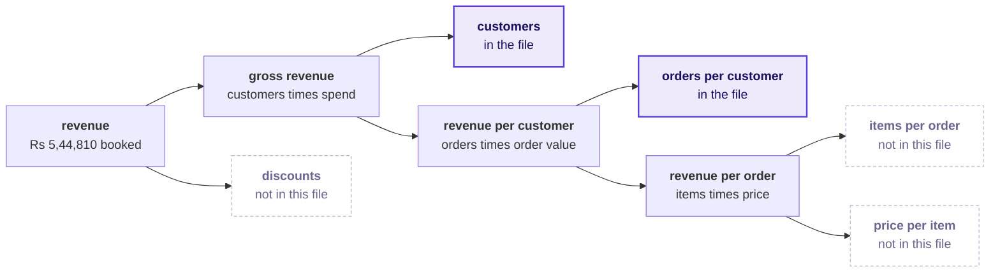
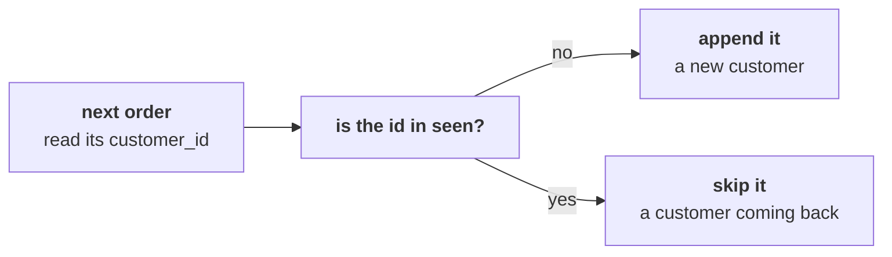
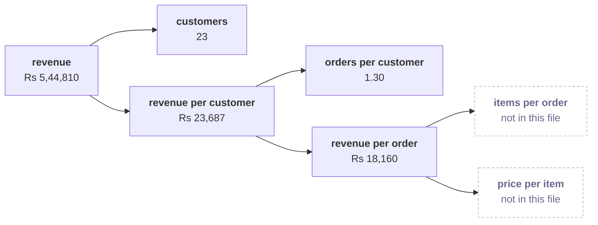
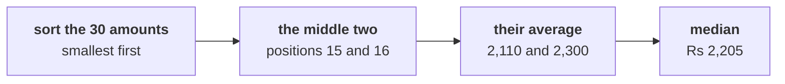
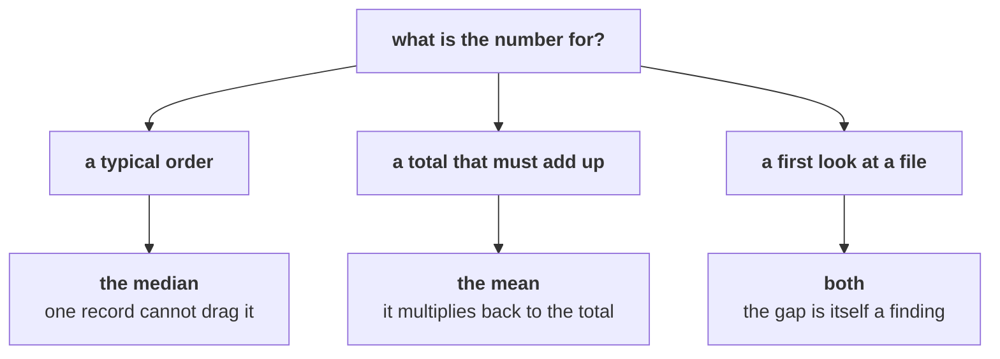
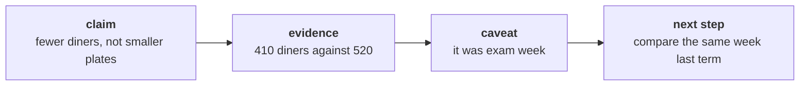
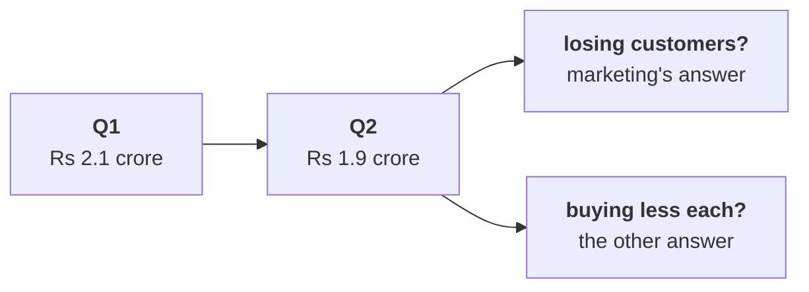

# The leaves, and the average that lies

Week 1, Day 1. Half two.

Kicker: WEEK 1  ·  MONDAY  ·  HALF TWO
Quote: No averages. One business customer can move an average.
Who: Anand Iyer, finance controller, Kalpa Retail, to the data and AI team at Kalpa's Global Capability Centre

```notes
LIVE, one minute. Read Anand's line aloud and leave it on screen. The morning drew the tree and
counted revenue; the afternoon counts two more leaves, then tests Anand's warning against the file.
Half two runs about two hours: the leaves, the average, forty minutes unguided, and the close.
```

---

## SECTION 1: The leaves
*The tree says what to count, the file carries two of the five leaves, and one careful loop counts each.*

```notes
LIVE. Chapter one runs about 30 minutes, including the 12-minute predict-three drill. It picks up
exactly where half one stopped: revenue is counted, customers are not.
```

---

## S1. Where the morning left the tree
*Revenue is counted, two leaves are in the file, and three are not.*


```mermaid
flowchart LR
    R["<b>revenue</b><br/>Rs 5,44,810 booked"] --> G["<b>gross revenue</b><br/>customers times spend"]
    R --> D["<b>discounts</b><br/>not in this file"]
    G --> C["<b>customers</b><br/>in the file"]
    G --> V["<b>revenue per customer</b><br/>orders times order value"]
    V --> F["<b>orders per customer</b><br/>in the file"]
    V --> O["<b>revenue per order</b><br/>items times price"]
    O --> B["<b>items per order</b><br/>not in this file"]
    O --> P["<b>price per item</b><br/>not in this file"]
    classDef known fill:#EEEAFB,stroke:#5B3FD6,color:#1A0F5C,stroke-width:2px
    classDef unknown fill:#FFFFFF,stroke:#B8B2D6,color:#6B6690,stroke-dasharray:4 3
    class C,F known
    class D,B,P unknown
```

The file says who bought and what each order came to, so two leaves can be counted this afternoon. The three dashed leaves need fields the file does not carry.

```notes
LIVE, 1 minute. This is the morning's tree, marked with what the file can answer. Ask one learner
to name the two solid leaves and one to name a dashed one. Spiral: this picture returns at the
close of the chapter with numbers on it.
```

---

## S2. Customers are people, not rows
*Thirty rows, and some of them are the same person coming back.*


```mermaid
flowchart LR
    O["<b>next order</b><br/>read its customer_id"] --> Q["<b>is the id in seen?</b>"]
    Q -->|"no"| A["<b>append it</b><br/>a new customer"]
    Q -->|"yes"| S["<b>skip it</b><br/>a customer coming back"]
```

```python
seen = []
for order in ORDERS:
    if order["customer_id"] not in seen:
        seen.append(order["customer_id"])
print(len(seen))       # 23
```

```notes
LIVE, 5 minutes. Two new pieces: an if inside the loop, and not in, which reads like English and
checks every item of the list. Build it on the projector line by line, with the room typing. The
trap is counting rows as customers, which gives 30.
```

---

## D3. A set counts distinct values in one line
*The same twenty-three customers, counted by a structure that keeps each value once.*

```python
len({order["customer_id"] for order in ORDERS})    # 23
```

A set keeps each value once, so its length is the distinct count. Checking whether a value is already in a set goes straight to it, where not in on a list checks every item in turn, which matters when thirty orders become three million.

```notes
SELF-STUDY, depth for the confident half; skip it live. The list version on S2 is the one to
understand first; the set is the one to use once the list version is second nature.
```

---

## S4. Question: thirty orders, twenty-three customers
*Seven rows did not add a customer. What are they?*

```stats
value: 30 | label: orders | note: rows in the file
value: 23 | label: customers | note: distinct customer ids
value: 7 | label: rows | note: that added nobody new
```

**Question.** Choose one: a) duplicates to delete before counting; b) seven customers who came back for a second order; c) orders with a missing customer id; d) a mistake in the loop.

```notes
LIVE, 2 minutes. Take letters. Expect some a, which is the most useful wrong answer of the day:
it confuses a customer coming back with a record entered twice.
```

---

## S5. Answer: seven customers came back
*The seven extra rows are real orders, and they are the frequency branch at work.*

```stats
value: 23 | label: customers | note: distinct customer ids
value: 16 | label: bought once | note: one order each
value: 7 | label: came back | note: two orders each
value: 30 | label: orders | note: 16, plus 7 times 2
```

**Kavya's review.** A customer coming back and a record entered twice look the same in a count. Check the order ids before you call anything a duplicate: here all thirty are different.

```notes
LIVE, 2 minutes. The answer is b. Have the room check it: thirty order ids, thirty different
values. Real duplicates are Wednesday's subject; today's point is that a count alone cannot tell
the two apart.
```

---

## S6. Orders per customer is thirty over twenty-three
*A rate is a numerator over a denominator, said out loud before it is computed.*

```python
orders = len(ORDERS)                    # 30
customers = len(seen)                   # 23
print(orders / customers)               # 1.3043478260869565
print(f"{orders / customers:.2f}")      # 1.30
```

**Kavya's review.** A rate leaves the team with its numerator, its denominator and its window: "Orders per customer, 1 July to 26 September: 30 orders over 23 customers, 1.30."

```notes
LIVE, 3 minutes. Division always gives a float in Python 3, so the full value prints. The f-string
formats it for a person to read and leaves the value itself alone. Ask what 1.30 means in words:
the average customer ordered 1.3 times in the window.
```

---

## S7. A filter is an if inside the loop
*Delivered revenue is the same accumulator, told which orders to skip.*

```python
delivered = 0
for order in ORDERS:
    if order["status"] == "delivered":
        delivered += int(order["amount"])
print(delivered)       # 520790
```

| Status | Orders | Amount |
|---|---|---|
| Delivered | 21 | Rs 5,20,790 |
| Returned | 5 | Rs 14,970 |
| Cancelled | 4 | Rs 9,050 |

```notes
LIVE, 3 minutes. Two equals signs compare and one assigns; say it once and point at the if. The
three rows add back to the morning's Rs 5,44,810, which is the check a senior runs first: the
parts of a total must add up to the total.
```

---

## S8. Question: predict three cells
*Three one-liners, each a trap a real file sets. Write all three predictions before anything runs.*

```python
ORDERS[0]["Amount"]          # cell a
"3500" > 3000                # cell b
round(30 / 23, 2)            # cell c
```

**Question.** For each cell, write the exact output you expect: a value, or the name of the error and why.

```notes
LIVE, the 12-minute mid-session drill with the next slide. Three minutes to write predictions in
silence, then pairs compare, then run the three cells. Collect one prediction per cell on the board
before running, so the room sees its own reasoning tested.
```

---

## S9. Answer: two errors and a dropped zero
*Keys match exactly, text never orders against a number, and round() does not format.*

```text
KeyError: 'Amount'
TypeError: '>' not supported between instances of 'str' and 'int'
1.3
```

| Cell | What happened | The habit it teaches |
|---|---|---|
| a | The key is amount, in lower case, and a dictionary matches keys exactly | Copy key names from the record, never from memory |
| b | Python will not decide whether text is bigger than a number | Know a field's type before you compare it |
| c | round() gives 1.3; the missing zero is display, never value | Format for people with an f-string, as on S6 |

```notes
LIVE, 4 minutes. Cell b is the morning's break in a new place: a loop counting orders above
Rs 3,000 stops on the same record the sum stopped on, because int() in one loop fixed that loop
only. The data still holds text. That is the question Wednesday asks of the whole file.
```

---

## S10. The tree, with today's numbers on it
*Four numbers from one file, and they multiply back to the total.*


```mermaid
flowchart LR
    R["<b>revenue</b><br/>Rs 5,44,810"] --> C["<b>customers</b><br/>23"]
    R --> V["<b>revenue per customer</b><br/>Rs 23,687"]
    V --> F["<b>orders per customer</b><br/>1.30"]
    V --> O["<b>revenue per order</b><br/>Rs 18,160"]
    O --> B["<b>items per order</b><br/>not in this file"]
    O --> P["<b>price per item</b><br/>not in this file"]
    classDef unknown fill:#FFFFFF,stroke:#B8B2D6,color:#6B6690,stroke-dasharray:4 3
    class B,P unknown
```

The check: 23 customers times Rs 23,687 comes back to Rs 5,44,810. Hold on to revenue per order, Rs 18,160. It is an average, and the next chapter asks what it describes.

```notes
LIVE, 3 minutes. Draw these numbers onto the board tree. Revenue per customer is 5,44,810 over 23;
revenue per order is 5,44,810 over 30, which is the mean order value. The discount branch is left
off this picture because the file has no discount field at all.
```

---

## S11. The three missing leaves, and how to ask for them
*Naming the missing data, and asking for it, beats filling the gap with a guess.*

```cards
icon: shopping-cart | eyebrow: Items per order | title: Needs order lines | body: One row per item sold, with the order it belongs to.
icon: tag | eyebrow: Price per item | title: Needs list prices | body: The price of each item before any discount.
icon: percent | eyebrow: Discounts | title: Needs what was given back | body: Per order or per line, in rupees. | tone: dark
```

**The rule.** Write the gap as a request: "Customers and frequency are counted. Basket, price and discounts need order lines, list prices and discounts, which this file does not carry."

```notes
LIVE, 3 minutes. The request is part of the deliverable, not an apology. An engineer who says what
the data cannot answer, and exactly which fields would answer it, is the one a client trusts with
the next question.
```

---

## SECTION 2: The average that lies
*Revenue per order is an average, and one record can make an average describe nobody.*

```notes
LIVE. Chapter two runs about 30 minutes. This is the reveal the row says never to cut. The room
finds what moves the mean by sorting; nobody names it before they do.
```

---

## S12. Revenue per order is an average
*Rs 5,44,810 over 30 orders is Rs 18,160, the number a slide would call a typical order.*

```stats
value: Rs 5,44,810 | label: revenue | note: all booked orders
value: 30 | label: orders | note: 1 July to 26 September
value: Rs 18,160 | label: revenue per order | note: the mean order value
```

Put Rs 18,160 in Meera's note as the typical order and it says Kalpa Retail sells eighteen-thousand-rupee baskets. Anand's warning was written for this moment.

```notes
LIVE, 2 minutes. Ask the room whether anyone they know spends Rs 18,000 on one consumer-goods
order. Let the doubt build; do not resolve it.
```

---

## S13. Question: does Rs 18,160 describe a typical order?
*Sort the thirty amounts in your notebook and read the middle before you answer.*

```python
amounts = []
for order in ORDERS:
    amounts.append(int(order["amount"]))
amounts.sort()
print(amounts[14], amounts[15])    # the two in the middle
print(amounts[-1])                 # the largest
```

**Question.** Choose one: a) yes, it is the average of every order; b) no, most orders sit far below it; c) no, most orders sit far above it; d) it cannot be judged without the segment.

```notes
LIVE, 5 minutes. Every learner runs the sort themselves and reads both prints. Then letters. The
discovery is the room's: whoever reads the largest amount first says it aloud, and the room says
what kind of order it must be.
```

---

## S14. Answer: the middle order is Rs 2,205
*The mean sits about eight times above the order in the middle, pulled up by the top of the list.*

```stats
value: Rs 18,160 | label: the mean | note: revenue over orders
value: Rs 2,205 | label: the median | note: the middle of 30 sorted amounts
value: 8.2 | label: times | note: the mean over the median
```

In one sentence, before the next slide: what sits at the top of your sorted list, and why does it move the mean so far?

```notes
LIVE, 3 minutes. The answer is b. Take two or three sentences from the room about the top of the
list. The strongest ones say what kind of customer placed it and that it is real revenue, which is
exactly what Anand predicted.
```

---

## S15. How one record moves a mean and leaves a median
*Five invented orders, then the same five with one bulk order in place of the largest.*

```stats
value: Rs 2,240 | label: mean | note: of 1,900, 2,100, 2,200, 2,400 and 2,600
value: Rs 2,200 | label: median | note: the middle of the five
value: 5 | label: orders | note: all of them ordinary
```

**What breaks.** Replace the Rs 2,600 order with one bulk order of Rs 90,000.

```stats
value: Rs 19,720 | label: mean | note: moved almost nine times
value: Rs 2,200 | label: median | note: did not move at all
value: 1 | label: order changed | note: out of five
```

```notes
LIVE, 4 minutes. Work the first mean on the board: 11,200 over 5. Then the second: 98,600 over 5.
The median is the middle value either way, because it only asks where the middle is, never how far
away the top is. That is the whole mechanism, on numbers nobody has to trust.
```

---

## S16. The median, without a library
*Sort, find the middle, and with an even count take the average of the two middle values.*


```mermaid
flowchart LR
    A["<b>sort the 30 amounts</b><br/>smallest first"] --> M["<b>the middle two</b><br/>positions 15 and 16"] --> R["<b>their average</b><br/>2,110 and 2,300"] --> X["<b>median</b><br/>Rs 2,205"]
```

```python
n = len(amounts)                                        # 30
median = (amounts[n // 2 - 1] + amounts[n // 2]) / 2
print(median)                                           # 2205.0
```

```notes
LIVE, 5 minutes. Positions 15 and 16 are indexes 14 and 15, because Python counts from zero and
people count from one; say it twice. With an odd count there is one middle value, at index n // 2.
The confident half can write the odd case themselves.
```

---

## S17. Question: which number goes in Meera's note?
*The note needs one number for a typical order, and a decision about the top of the list.*

```stats
value: Rs 18,160 | label: the mean | note: revenue over orders
value: Rs 2,205 | label: the median | note: the middle of the sorted list
```

**Question.** Choose one: a) the mean, Rs 18,160, because it uses every order; b) the median, Rs 2,205, with the largest order named on its own line; c) the mean after deleting the largest order; d) the largest order, because it drives the revenue.

```notes
LIVE, 3 minutes. Take letters and ask a c voter to defend it; someone always does. Their argument
sounds careful, which is why it is dangerous.
```

---

## S18. Answer: the median, and the large order named
*The right number depends on what it is for, and a real order is never deleted to make a mean behave.*


```mermaid
flowchart TB
    Q["<b>what is the number for?</b>"] --> A["<b>a typical order</b>"]
    Q --> B["<b>a total that must add up</b>"]
    Q --> C["<b>a first look at a file</b>"]
    A --> A2["<b>the median</b><br/>one record cannot drag it"]
    B --> B2["<b>the mean</b><br/>it multiplies back to the total"]
    C --> C2["<b>both</b><br/>the gap is itself a finding"]
```

**Kavya's review.** Option c is the dangerous one: that order is real revenue. Report the median as the typical order, name the large order on its own line, and keep the total whole.

```notes
LIVE, 4 minutes. The answer is b. The mean is not wrong; it answers a different question.
Revenue per order is a mean on purpose, because it has to multiply back to the total on the tree.
The typical order is a median on purpose, because it has to describe an order someone placed.
```

---

## S19. The interview question this chapter answers
*Mean or median for order value, and why: a strong answer has three parts.*

**In the interview.** [S] Mean or median for order value, and why?

```cards
num: 1 | eyebrow: First | title: Say what it is for | body: A typical order, or a total that has to reconcile.
num: 2 | eyebrow: Then | title: Say what the data does | body: Order values are skewed: a few very large orders pull the mean up.
num: 3 | eyebrow: Last | title: Say what you report | body: The median as the typical order; both on a first look, with the gap named.
```

```notes
LIVE, 2 minutes. Have one learner answer aloud in under thirty seconds using the three parts, then
move to the unguided work.
```

---

## SECTION 3: Your call
*Forty minutes unguided: three leaves on a new definition, and one sentence on which branch to open first.*

```notes
LIVE. Chapter three runs 40 minutes: two to brief, thirty-five working, three to collect. The
trainer does not teach during this block; the support TA answers environment problems only.
```

---

## S20. Your call: three numbers and one sentence
*Unguided, in the hands-on notebook, on delivered orders only, which is a definition you have not computed yet.*

```cards
icon: users | eyebrow: Number 1 | title: Customers | body: Distinct customer ids among delivered orders, counted with a loop.
icon: repeat | eyebrow: Number 2 | title: Orders per customer | body: Written as a numerator over a denominator, then computed.
icon: list-ordered | eyebrow: Number 3 | title: Median order value | body: Delivered amounts, sorted, with the middle found by hand.
icon: message-square | eyebrow: The sentence | title: Which branch first | body: The branch Meera should examine first, and why not the others. | tone: dark
```

Each number has a check cell in the notebook that tells you whether it is right. The sentence has no check; it is read aloud at the close.

```notes
LIVE, 2 minutes to brief. The definition changes on purpose: the room computed everything on
booked orders, and the filter from S7 is the only new move. Nobody pastes the demo, because the
demo's numbers are the wrong answers here.
```

---

## S21. What a sentence to a CEO carries
*Claim, evidence, caveat and next step, shown on a canteen so the Kalpa answer stays yours.*


```mermaid
flowchart LR
    A["<b>claim</b><br/>fewer diners, not smaller plates"] --> B["<b>evidence</b><br/>410 diners against 520"] --> C["<b>caveat</b><br/>it was exam week"] --> D["<b>next step</b><br/>compare the same week last term"]
```

**The rule.** One sentence, four parts, in this order: what you found, the number that shows it, what could make it wrong, and what you will check next.

```notes
LIVE, 2 minutes, shown with the brief. The canteen numbers are invented to show the shape. The
Kalpa sentence is the learner's own work; do not show a Kalpa version before the close.
```

---

## S22. If you are stuck after ten minutes
*Three prompts, in the order you will need them; each is a question, never the code.*

1. Customers: which loop from this afternoon adds an id only the first time it appears, and where does the delivered filter go in it?
2. Orders per customer: which total goes on top, and which on the bottom, when both count delivered orders only?
3. Median: how many delivered orders are there, and is that count odd or even?

```notes
SELF-STUDY for the room, shown only if a learner is stuck for ten minutes. The prompts point back
to S2, S6 and S16 without giving the lines.
```

---

## SECTION 4: Close
*Six questions, the sentence read aloud, and the one question Meera sends back for tomorrow.*

```notes
LIVE. The close runs 20 minutes: the Kahoot, two sentences read aloud, the day's recap, and
Tuesday's question.
```

---

## S23. Kahoot: six questions, ungraded
*Ungraded, for you and for the trainer: it shows what the day left in the room.*

```stats
value: 6 | label: questions | note: one per idea from today
value: 0 | label: scores recorded | note: ungraded, every day this week
value: 8 min | label: to play | note: then the answers, discussed
```

```notes
LIVE, 8 minutes. Run the Kahoot pack from the kahoot folder. Pause on any question below
60 percent correct and ask one learner who got it right to explain it.
```

---

## S24. Two sentences, read aloud
*Two learners read their sentence to Meera, and the room checks it for the four parts.*

| Part | What the room listens for |
|---|---|
| Claim | Which branch to examine first, named as a branch of the tree |
| Evidence | A number with its definition: booked or delivered, and the window |
| Caveat | What thirty orders from one window cannot show |
| Next step | What gets compared tomorrow, and why that settles it |

**Kavya's review.** A sentence without its evidence is an opinion, and one without its caveat is a promise. Say both, and Meera can act on it.

```notes
LIVE, 4 minutes. Pick one sentence that names orders per customer and one that names customers,
if the room has both. The honest caveat for every sentence is the same: one window of thirty
orders cannot show which branch moved, which is exactly tomorrow's question.
```

---

## S25. What the day leaves on your desk
*Six moves, each used again this week, in the order the day taught them.*

| You can now | The evidence from today |
|---|---|
| Turn a business ask into questions data can answer | Meera's message split into four questions, two of them today's |
| Draw the revenue tree, every branch a numerator over a denominator | The tree on the board, three leaves not in the file |
| Keep a notebook honest | Restart and Run All; the brackets read 1, 2, 3 |
| Count with an accumulator, and filter with an if | Revenue, customers and delivered revenue from one pattern |
| Read a trace from its last line up | The TypeError, the KeyError and the NameError, each read aloud |
| Choose the median over the mean on purpose | Rs 2,205 against Rs 18,160, and the reason in one sentence |

```notes
LIVE, 2 minutes. Ask the room which row felt weakest, by a show of hands, and note it for
tomorrow's opening recap.
```

---

## S26. The interview questions of the day
*Five questions from today's row, with the tag that says how often they are asked.*

| Tag | Question | Where today answered it |
|---|---|---|
| [S] | How would you increase sales for an online retailer? | The tree, and the five branches with their bills |
| [S] | Mean or median for order value, and why? | S19 of this half |
| [F] | A business says "grow revenue 15 percent"; how do you turn that into questions data can answer? | The five moves in half one |
| [SV] | A list against a dictionary: when do you reach for each? | ORDERS, a list of dictionaries |
| [D] | Marketing wants budget for acquisition; what would you check before agreeing, and how would you say no? | Where the Rs 12 crore lands |

```notes
LIVE, 2 minutes. [S] is asked everywhere, [F] often in GCC and product screens, [SV] opens
service-major screens, [D] separates candidates. Model answers are in the notebook's last section
and in the trainer's day sheet; learners practise them aloud in pairs tonight.
```

---

## S27. Tomorrow, Meera asks which branch moved
*Meera has read today's numbers, and her reply is tomorrow's work.*

**The client asks.** "So revenue is customers, times how often they buy, times basket, times price. Now: which of those moved? Q2 was Rs 1.9 crore, Q1 was 2.1. Are we losing customers, or are the ones we have buying less?"


```mermaid
flowchart LR
    Q1["<b>Q1</b><br/>Rs 2.1 crore"] --> Q2["<b>Q2</b><br/>Rs 1.9 crore"]
    Q2 --> C["<b>losing customers?</b><br/>marketing's answer"]
    Q2 --> F["<b>buying less each?</b><br/>the other answer"]
```

```notes
LIVE, 2 minutes. Read Meera's reply and stop. Do not predict the answer; tomorrow's file settles it.
Remind the room of the take-home and that one of tonight's trees is walked through first thing.
```

