# The branch, the sentence and the cases

Week 1, Day 1. Half two.

Kicker: WEEK 1  ·  MONDAY  ·  AFTERNOON
Quote: Is acquisition even the branch that is short?
Who: Meera Raghavan, CEO, Kalpa Retail, before she signs Rs 12 crore for new customers

```notes
On screen before the clock starts, while the room comes back. Meera's question is the day's question,
and this afternoon answers it in the close. The morning's metric tree is still on the board with its
numbers written in.
Transition: S1, what the morning found.
```

---

## S1. The morning's tree: 23 customers, 1.30 each, Rs 2,205
*What did the morning's four chapters find on Kalpa's 30 orders?*

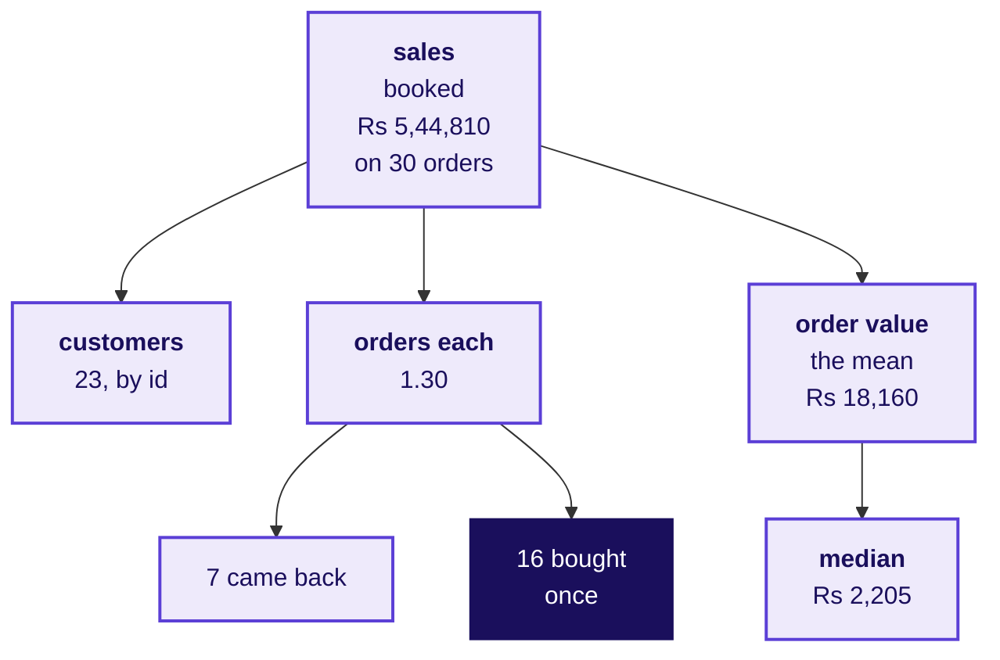
```mermaid
flowchart TB
    R["<b>sales</b><br/>booked<br/>Rs 5,44,810<br/>on 30 orders"] --> C["<b>customers</b><br/>23, by id"]
    R --> F["<b>orders each</b><br/>1.30"]
    R --> A["<b>order value</b><br/>the mean<br/>Rs 18,160"]
    F --> F1["7 came back"]
    F --> F2["16 bought<br/>once"]
    A --> A1["<b>median</b><br/>Rs 2,205"]
    classDef known fill:#EEEAFB,stroke:#5B3FD6,color:#1A0F5C,stroke-width:2px
    classDef bet fill:#1A0F5C,stroke:#1A0F5C,color:#FFFFFF
    class R,C,F,A,F1,A1 known
    class F2 bet
```

Chapter 1 read sales four ways, 30 orders booked for Rs 5,44,810, Rs 5,35,760 not cancelled and Rs 5,20,790 delivered; chapter 2 built each branch as a fraction on one definition; chapter 3 counted customers by id; and chapter 4 chose the median because only 1 of the 30 orders sits above the mean.

```notes
LIVE, 2 minutes, the first two of chapter 5's 30. Read the tree from the root: booked revenue of
Rs 5,44,810 still holds the 4 cancelled store orders, not cancelled is Rs 5,35,760 on 26 orders and
delivered is Rs 5,20,790 on 21. The AOV of Rs 18,160 is booked revenue over the 30 orders it was
summed over, and the median of Rs 2,205 is the number marketing gets as the typical order.
Ask one learner which branch looks weakest on this tree and which number says so. Most point at the
16 customers who bought once, which is where chapter 5 starts.
Transition: section 05, which branch Meera opens first.
```

---

## SECTION 5: Which branch first
*Which branch should Meera open first to reach the 15 percent plan, and why not the others?*

```notes
LIVE, 30 minutes, counting S1's two: the map and the need (3), the real company (1), the base (3),
each branch alone (4), the evidence and the call (4), the check (2), the trap (7), the second route
(2) and Kavya's review (2). D15 is self-study. Notebook 05 is the demonstration.
For more depth: sections 2 and 5 of the retail dossier, study-notes/C2_W01_D01_domain_retail_STUDENT.md, on Retail-Plus and the acquisition payback.
Transition: S2, the chapter's map.
```

---

## S2. Meera needs the branch before Rs 12 crore moves
*Who needs to know which branch Meera opens first, and which questions lead there?*

**Who needs the answer.** Meera Raghavan, who must choose the branch the Rs 12 crore goes to before she signs; a wrong choice spends the budget on a branch that was fine.

```timeline
label: Question 1 | title: The base | body: Who needs the branch, and which base is the plan sized on?
label: Question 2 | title: One branch | body: What would each branch have to do alone?
label: Question 3 | title: Evidence | body: Which branch has evidence behind it?
label: Question 4 | title: Two lifts | body: What goes wrong when two 10 percent lifts are called 20 percent?
label: Question 5 | title: Four parts | body: Do the four parts land on the multiplied total?
label: Question 6 | title: The switch | body: What would switch the call? | tone: dark
```

```notes
LIVE, 1 minute. Read the six questions aloud and leave them unanswered; each gets its own slide,
and S16 answers all six in a line each.
Transition: S3, who asks for the branch and what a wrong one costs.
```

---

## S3. Rs 12 crore rides on the branch Meera opens first
*Who asks for the branch, and what does a wrong one cost?*

**The client asks.** "Is acquisition even the branch that is short?"

| | |
|---|---|
| The metric at stake | Revenue growth is measured against the 15 percent plan, with what each branch alone would have to do. |
| Who asks | Meera signs, the marketing lead owns acquisition, and the head of Retail-Plus owns the members most likely to come back. |
| What a wrong number costs | Rs 12 crore goes to a branch that was fine, or the plan is sized by adding lifts that multiply. |

```notes
LIVE, 2 minutes. The question is now a choice between branches, so put the cost of each option
beside it. Meera decides, the marketing lead wants the Rs 12 crore for acquisition, and the
head of Retail-Plus runs the paid tier whose members come back most often.
Ask: which of the three loses most if we pick the wrong branch?
Transition: S4, two companies that pay to buy frequency.
```

---

## S4. Flipkart and Amazon pay to buy frequency
*Which real companies have bet on the frequency branch?*

```cards
icon: badge-check | eyebrow: Flipkart | title: Flipkart Black, Rs 1,499 a year | body: Flipkart launched it in 2025, evolving it from its VIP programme (Flipkart Stories, 12 September 2025).
icon: package | eyebrow: Amazon India | title: Prime, Rs 399 to Rs 1,499 a year | body: Amazon offers the plans in India (About Amazon India).
icon: repeat | eyebrow: Kalpa | title: Retail-Plus, the paid tier | body: Kalpa's own frequency bet already exists, and its head is one of today's stakeholders. | tone: dark
```

A membership is a bet on the orders-per-customer branch, placed by companies that could have spent the same money on acquisition.

```notes
LIVE, 1 minute. The companies are real and the prices are their own. Free or faster delivery takes
away a customer's reason to wait and batch purchases, so each member orders more often.
Transition: S5, which orders the plan is sized on.
```

---

## S5. The plan covers three consumer segments: Rs 64,810
*Which orders is Meera's 15 percent plan sized on?*

Meera's plan is about customers who buy again and again, so it concerns three segments, Retail-Core, Retail-Plus and Student, and the consumer view keeps every order whose segment is one of them.

```python
CONSUMER = {"Retail-Core", "Retail-Plus",
            "Student"}
consumer = [o for o in ORDERS
            if o["segment"] in CONSUMER]
base = sum(o["amount"] for o in consumer)
plan = base * 1.15
```

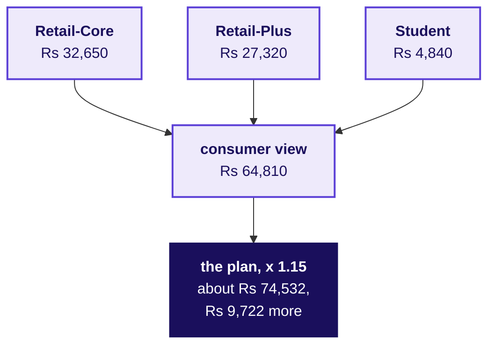
```mermaid
flowchart TB
    RC["<b>Retail-Core</b><br/>Rs 32,650"] --> V["<b>consumer view</b><br/>Rs 64,810"]
    RP["<b>Retail-Plus</b><br/>Rs 27,320"] --> V
    ST["<b>Student</b><br/>Rs 4,840"] --> V
    V --> P["<b>the plan, x 1.15</b><br/>about Rs 74,532,<br/>Rs 9,722 more"]
    classDef known fill:#EEEAFB,stroke:#5B3FD6,color:#1A0F5C,stroke-width:2px
    classDef bet fill:#1A0F5C,stroke:#1A0F5C,color:#FFFFFF
    class RC,RP,ST,V known
    class P bet
```

```notes
LIVE, 3 minutes. Say the rule before any number. The plan's levers, the Rs 12 crore of acquisition,
the retention offers and the Retail-Plus membership, all act on consumers who buy again and again,
so the plan is sized on the three consumer segments, and the code writes that rule once. Booked
revenue still counts every order; the consumer view answers the narrower question the plan asks.
Say the view in rupees. How many orders it keeps is each learner's to find in notebook 05's own cell.
Ask: if the plan were sized on all booked revenue, what would each extra order have to be worth?
The booked mean, Rs 18,160, which chapter 4 showed no typical order is; the consumer view's mean is
Rs 2,235.
Transition: S6, what one branch would have to do alone.
```

---

## S6. Question: how far must one branch move alone?
*What would each branch have to do alone to reach the plan?*

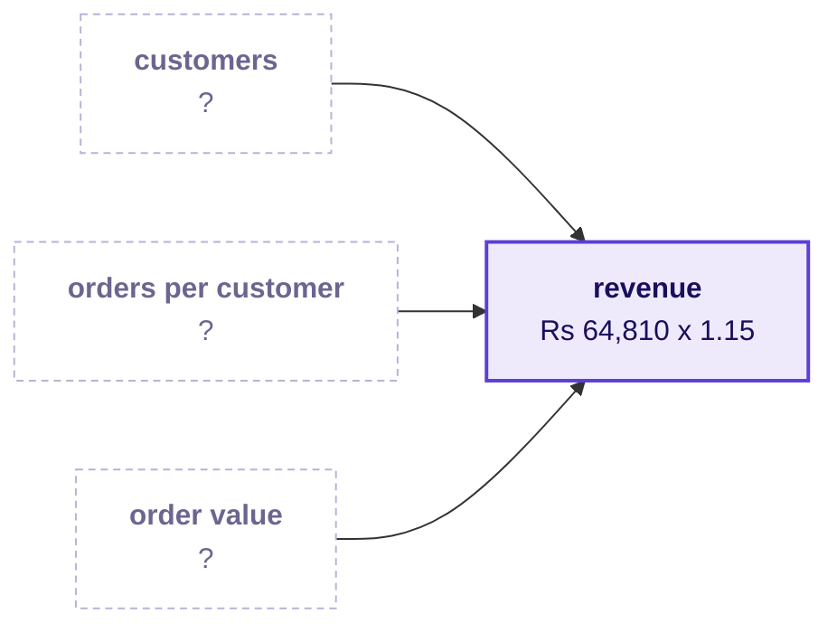
```mermaid
flowchart LR
    C["<b>customers</b><br/>?"] --> R["<b>revenue</b><br/>Rs 64,810 x 1.15"]
    F["<b>orders per customer</b><br/>?"] --> R
    A["<b>order value</b><br/>?"] --> R
    classDef known fill:#EEEAFB,stroke:#5B3FD6,color:#1A0F5C,stroke-width:2px
    classDef unknown fill:#FFFFFF,stroke:#B8B2D6,color:#6B6690,stroke-dasharray:4 3
    class R known
    class C,F,A unknown
```

**Predict before you run.** Revenue is customers x orders per customer x order value. If one branch moves while the other two hold, how far must it rise for 15 percent more revenue: a) 15 percent, the whole plan; b) 5 percent, a third of the plan; c) 7.5 percent, half the plan; d) further for customers than for order value?

```notes
LIVE, 1 minute. Take letters by hand before the next slide. Many pick b, sharing the plan out across
the three branches as though they added.
Transition: S7, the answer.
```

---

## S7. Answer: the whole 15 percent, since branches multiply
*Why must one branch moved alone carry the whole plan?*

**What happened.** The answer is a. Revenue is a product, so a branch that rises 15 percent while the others hold lifts revenue 15 percent, and each branch alone must bring the same Rs 9,722.

```python
# one factor x 1.15, the other two held
(cust * 1.15) * per_cust * value == plan
cust * (per_cust * 1.15) * value == plan
cust * per_cust * (value * 1.15) == plan
```

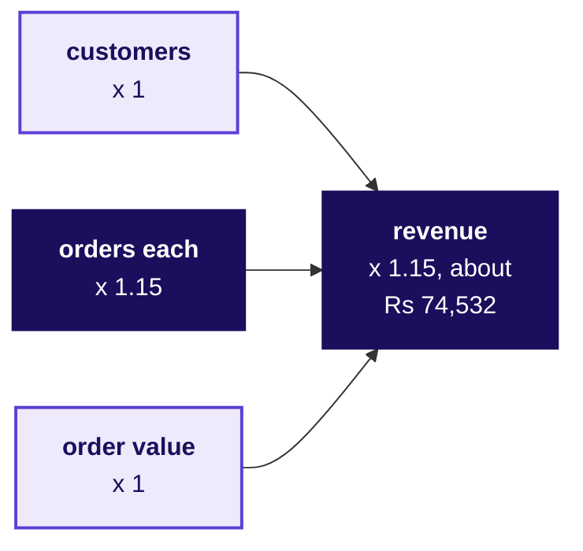
```mermaid
flowchart LR
    C["<b>customers</b><br/>x 1"] --> R["<b>revenue</b><br/>x 1.15, about<br/>Rs 74,532"]
    F["<b>orders each</b><br/>x 1.15"] --> R
    A["<b>order value</b><br/>x 1"] --> R
    classDef known fill:#EEEAFB,stroke:#5B3FD6,color:#1A0F5C,stroke-width:2px
    classDef bet fill:#1A0F5C,stroke:#1A0F5C,color:#FFFFFF
    class C,A known
    class F,R bet
```

```notes
LIVE, 3 minutes. Walk the three lines: whichever factor carries the 1.15, the product is revenue
times 1.15. Answer b's reasoning aloud: if all three branches shared the plan, each would need about
4.8 percent, since 1.048 x 1.048 x 1.048 is about 1.15, and three lifts of 5 percent would overshoot
to about 15.8 percent. Every branch is asked for the same Rs 9,722; what differs is what that asks
and of whom, which S8 lays out.
Transition: S8, which branch has evidence behind it.
```

---

## S8. Question: which branch has evidence behind it?
*Which branch does this file give Meera a reason to open first?*

| Option, moved alone | What 15 percent asks, and of whom |
|---|---|
| A. Customers | It needs 15 percent more customers who buy like today's, all of them people Kalpa has never met. |
| B. Frequency | It needs 15 percent more orders from the customers who already bought. |
| C. Order value | It needs Rs 335 more on every basket, the mean rising from Rs 2,235 to Rs 2,570. |
| D. Price | It needs every price 15 percent higher, with no shopper buying any less. |

**Predict before you run.** Each option asks for the same Rs 9,722. Which one does this file give evidence for: a) customers, b) frequency, c) order value, or d) price?

```notes
LIVE, 1 minute. Take letters by hand. Some pick c because Rs 335 a basket sounds small; ask them what
in the file would show that a basket can grow.
Transition: S9, the answer and the call.
```

---

## S9. Answer: frequency, since 7 of 23 customers came back
*Which branch should Meera open first, and why not the others?*

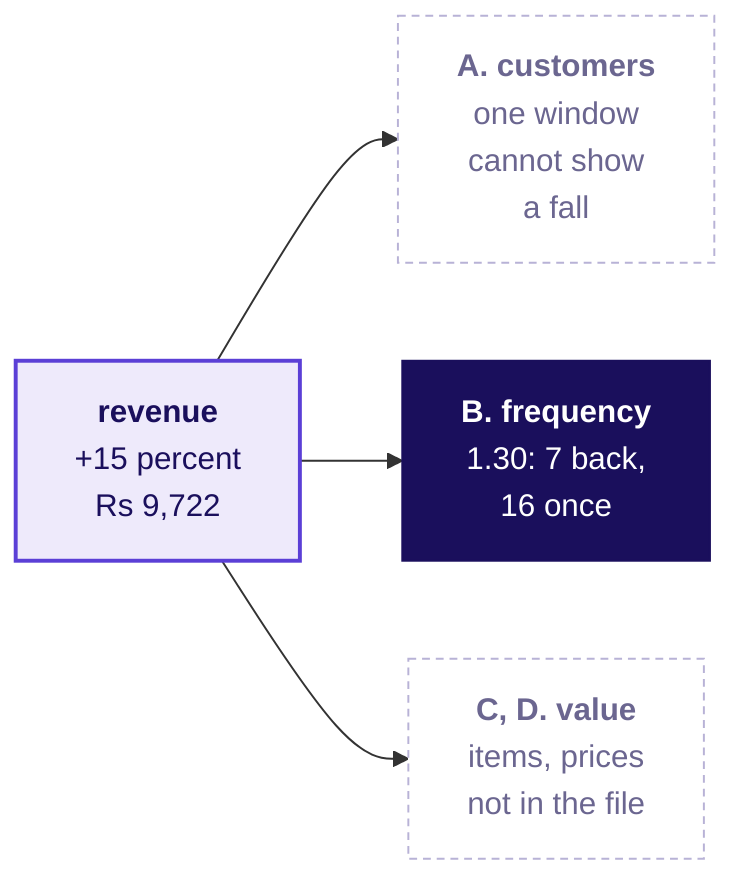
```mermaid
flowchart LR
    R["<b>revenue</b><br/>+15 percent<br/>Rs 9,722"] --> C["<b>A. customers</b><br/>one window<br/>cannot show<br/>a fall"]
    R --> F["<b>B. frequency</b><br/>1.30: 7 back,<br/>16 once"]
    R --> V["<b>C, D. value</b><br/>items, prices<br/>not in the file"]
    classDef known fill:#EEEAFB,stroke:#5B3FD6,color:#1A0F5C,stroke-width:2px
    classDef unknown fill:#FFFFFF,stroke:#B8B2D6,color:#6B6690,stroke-dasharray:4 3
    classDef bet fill:#1A0F5C,stroke:#1A0F5C,color:#FFFFFF
    class R known
    class C,V unknown
    class F bet
```

**The rule.** B is the best fit: the customers exist, 7 came back without a push, and a test costs a reminder to people already on the list. A second quarter showing customers falling while frequency held would switch the call to A.

```notes
LIVE, 3 minutes. The answer is b. Walk the three boxes. Acquisition may be short, but one quarter
cannot show customers falling; order value and price rest on items and prices the file does not
hold. Frequency has the evidence and the cheapest test: a reorder reminder to the one-time buyers,
against a group held back for comparison. The call has a second switch as well: a retained order
that costs more than winning a new customer.
Ask: which of the two switches could Tuesday's file show?
Transition: S10, whether the frequency ask is within reach.
```

---

## S10. Three in ten one-time buyers returning once carry it
*Is the frequency ask within reach of the customers already on file?*

```stats
value: Rs 9,722 | label: from frequency | note: 15 percent of Rs 64,810
value: Rs 2,235 | label: consumer mean order | note: what one more order brings
value: 3 in 10 | label: one-time buyers | note: in the consumer view, returning once
```

```python
mean  = base / len(consumer)            # Rs 2,235
extra = (plan - base) / mean            # the orders frequency must add
share = extra / len(consumer_once)      # about three in ten
```

The check multiplies back: the extra orders at the consumer mean bring Rs 9,722, which lands the consumer view on about Rs 74,532.

```notes
LIVE, 2 minutes. The ask is small: about three in ten of the consumer view's one-time buyers
ordering once more at the consumer mean. Notebook 05's check multiplies it back to the plan. Keep
the count of extra orders in each learner's own notebook and say the ask in rupees and as three in
ten.
Transition: S11, marketing answers with a bigger plan.
```

---

## S11. Wrong answer: two 10 percent lifts make 20 percent
*What does marketing's bigger plan claim for two 10 percent lifts?*

**The plausible wrong answer.** The marketing lead's slide: "Fund acquisition and retention together: 10 percent more customers and 10 percent more orders each make 20 percent growth, Rs 77,772 on the consumer view."

```stats
value: 20% | label: the slide's growth | note: 10 plus 10
value: Rs 77,772 | label: the slide's revenue | note: Rs 64,810 x 1.20
```

The decision it would mislead: a target sized by adding the lifts looks met with room to spare, and is then missed by the lift on the lift.

```notes
LIVE, 2 minutes. Present it confidently, as the marketing lead would. Before the next slide, take
hands for 20, 21, 10 or 11 percent; most rooms say 20.
Transition: S12, the check that catches it.
```

---

## S12. Why it is wrong: the lifts multiply to 21 percent
*Which check catches the added lifts, and how big is the gap?*

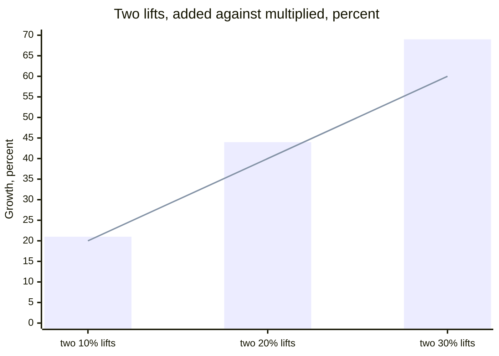
```mermaid
xychart-beta
    title "Two lifts, added against multiplied, percent"
    x-axis ["two 10% lifts", "two 20% lifts", "two 30% lifts"]
    y-axis "Growth, percent" 0 --> 70
    bar "multiplied" [21, 44, 69]
    line "added" [20, 40, 60]
```

**Why it is wrong.** The second lift applies to a customer base already 10 percent larger. Through the tree, 1.10 x 1.10 = 1.21, so the consumer view reaches Rs 78,420, Rs 648 above the slide; the bars are multiplied, the line is added, and the gap grows with the lifts.

```notes
LIVE, 3 minutes. Work it on the board on the consumer view: Rs 64,810 x 1.10 = Rs 71,291, and
x 1.10 again is Rs 78,420. At 10 percent the gap is Rs 648; with two 30 percent lifts the tree says
69 percent where addition says 60.
Transition: S13, the fix and what it changes.
```

---

## S13. Fix: multiply the lifts, and a discount the same way
*What changes once the lifts are multiplied?*

| Proposal on the consumer view | Added | Multiplied through the tree |
|---|---|---|
| Customers up 10 percent and frequency up 10 percent | Up 20 percent, Rs 77,772 | Up 21 percent, Rs 78,420 |
| 15 percent off, with orders up 10 percent | Down 5 percent | Down 6.5 percent, Rs 60,597 |

**The rule.** Lifts multiply along the tree, so size a target through the tree and price a discount as 0.85 x 1.10 = 0.935, a 6.5 percent fall that addition would call 5.

```notes
LIVE, 2 minutes. What the fix changes: the plan is sized on 21 percent, Rs 78,420, and a discount is
priced through the tree before anyone calls it growth. Marketing's discount comes back in the
escalated case, on delivered orders.
Transition: S14, the same total built from its parts.
```

---

## S14. A second route: four parts land on Rs 78,420
*Do the four parts land on the multiplied total of Rs 78,420?*

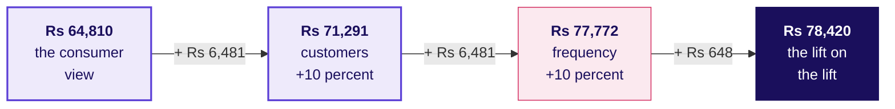
```mermaid
flowchart LR
    B["<b>Rs 64,810</b><br/>the consumer<br/>view"] -->|"+ Rs 6,481"| C["<b>Rs 71,291</b><br/>customers<br/>+10 percent"]
    C -->|"+ Rs 6,481"| F["<b>Rs 77,772</b><br/>frequency<br/>+10 percent"]
    F -->|"+ Rs 648"| T["<b>Rs 78,420</b><br/>the lift on<br/>the lift"]
    classDef known fill:#EEEAFB,stroke:#5B3FD6,color:#1A0F5C,stroke-width:2px
    classDef bad fill:#FBE9EF,stroke:#D63A6A,color:#1A0F5C
    classDef bet fill:#1A0F5C,stroke:#1A0F5C,color:#FFFFFF
    class B,C known
    class F bad
    class T bet
```

The base, two lifts of Rs 6,481 and the lift on the lift of Rs 648, which is 0.10 x 0.10 of the base, land where the multiplication did; the slide's Rs 77,772 stops one part short.

**The rule.** Multiply the factors when you need the total, and build the parts when someone asks where the extra came from, since the lift on the lift shows as its own line.

```notes
LIVE, 2 minutes. Notebook 05 draws this as a bridge and asserts it lands on the multiplied total.
Bring the parts route to marketing, since the lift on the lift has its own line there.
Transition: D15 is self-study, so go to S16, Kavya's review.
```

---

## D15. A 15 percent discount needs 17.6 percent more orders
*How far must orders rise before 15 percent off holds revenue?*

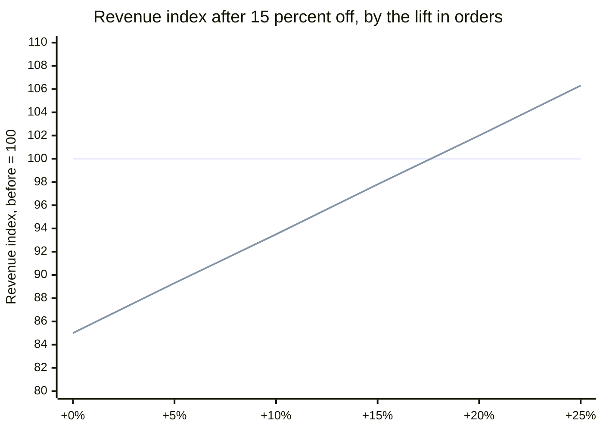
```mermaid
xychart-beta
    title "Revenue index after 15 percent off, by the lift in orders"
    x-axis ["+0%", "+5%", "+10%", "+15%", "+20%", "+25%"]
    y-axis "Revenue index, before = 100" 80 --> 110
    line "before the discount" [100, 100, 100, 100, 100, 100]
    line "after 15 percent off" [85, 89.3, 93.5, 97.8, 102, 106.3]
```

Revenue after the discount is 0.85 x (1 + the lift), which reaches 100 only when the lift is 1 / 0.85 less one, about 17.6 percent; holding margin needs more.

```notes
SELF-STUDY, 3 minutes. The flat line is revenue before the discount and the rising line is revenue
after it. Marketing's 10 percent lift sits well short of the 17.6 percent break-even, which is why
the tree calls the proposal a fall. Notebook 05's depth section draws the same two lines.
Transition: S16, Kavya's review.
```

---

## S16. Chapter 5 opens frequency and names its switch
*Which branch should Meera open first to reach the 15 percent plan, and why not the others?*

1. **Which base is the plan sized on?** It is sized on the consumer view, whose Rs 64,810 needs Rs 9,722 more.
2. **What would each branch have to do alone?** Each would have to rise the whole 15 percent.
3. **Which branch has evidence behind it?** Frequency has, since 7 of 23 customers came back.
4. **Do two 10 percent lifts make 20 percent?** They make 21 percent, Rs 78,420 against Rs 77,772.
5. **Do the four parts land on the multiplied total?** They do, on Rs 78,420.
6. **What would switch the call?** Customers falling in a second quarter would, or a retained order costing more than a new one.

**Kavya's review.** "Pick the branch the evidence points at and the one that costs least to test, then say what would make you pick another. And recompute anything someone adds up."

**In the interview.** [D] Marketing wants budget for acquisition; what would you check before agreeing it is the right branch, and how would you say no?

```notes
LIVE, 2 minutes. One learner answers the interview question aloud in under a minute: count customers
by id and the repeat buyers, price a new customer on the consumer mean of Rs 2,235, ask for the prior
quarter, and say no for now with a date while offering the cheaper frequency test.
Transition: section 06, the sentence Meera signs.
```

---

## SECTION 6: What will Meera sign
*What one sentence can Meera sign, with its evidence, its branch, its caveat and its ask?*

```notes
LIVE, 30 minutes: the map and the need (3), the real company (1), the options (4), the first draft
(6), the trap (8), the fix (3), the second route (3) and Kavya's review (2). D29 is self-study.
Notebook 06 is the demonstration.
For more depth: section 5 of the retail dossier, study-notes/C2_W01_D01_domain_retail_STUDENT.md, on retention and cohorts.
Transition: S17, the chapter's map.
```

---

## S17. Meera signs one sentence, and marketing tests it
*Who needs the sentence Meera signs, and which questions lead to it?*

**Who needs the answer.** Meera, who signs one sentence before the Rs 12 crore moves, and the marketing lead, who will look for the number in it that can be recomputed into another story.

```timeline
label: Question 1 | title: The readers | body: Who reads the sentence, and what will they look for?
label: Question 2 | title: The form | body: Which form carries the decision in the time Meera has?
label: Question 3 | title: The draft | body: What does the team's first draft of Meera's sentence say?
label: Question 4 | title: Lost? | body: How many of the 16 one-time buyers are really lost?
label: Question 5 | title: Due dates | body: Do due dates find the same buyers too recent to judge?
label: Question 6 | title: The sentence | body: What does the sentence Meera signs say? | tone: dark
```

```notes
LIVE, 1 minute. Read the six questions aloud and leave them open; S30 answers each in one line.
Transition: S18, who reads the sentence.
```

---

## S18. Marketing will hunt the sentence's weakest number
*Who reads the sentence, and what will they look for?*

**The client asks.** "Before I sign anything, I want to understand our own sales."

| | |
|---|---|
| The metric at stake | The repeat picture shows who came back, who has not, and who has not had time to. |
| Who asks | Meera signs, Kavya reviews it first, and the marketing lead reads it for its weakest number. |
| What a wrong number costs | Marketing knocks the claim down in one question, and the team loses the trust the week depends on. |

```notes
LIVE, 2 minutes. Meera will not read the day's notebooks. Marketing will read the sentence looking for the
number it can recompute into a different story.
Ask: which number from chapter 5 would you least like to defend in front of the marketing lead?
Transition: S19, a real company's first window.
```

---

## S19. Klarna's first month was not its verdict
*What happened when a company's first window was read as the verdict?*

```timeline
label: February 2024 | title: Two-thirds of chats | body: Klarna, 27 February 2024
label: May 2025 | title: Quality, fifteen months on | body: Fortune, 9 May 2025 | tone: dark
```

Klarna reported that its AI assistant handled two-thirds of customer-service chats in its first month, and fifteen months later its chief executive said the focus on cost had lowered quality and that customers would always be able to reach a human.

Meera's sentence carries a caveat so that one window's number is not taken as the verdict.

```notes
LIVE, 1 minute. The dossier's section 8 tells the full case. The first month measured volume, and
the verdict on quality came fifteen months later.
Transition: S20, four ways to hand Meera the answer.
```

---

## S20. One sentence carries the decision and its limit
*Which form carries the decision in Meera's reading time?*

| Option | Reading time | Carries a decision? |
|---|---|---|
| A. One number: 1.30 orders each | 2 seconds | No, so she has to supply the meaning. |
| B. The tree as a table | A minute or more | No, so she picks the number that suits the room. |
| C. One sentence: evidence, branch, caveat, ask | About 20 seconds | Yes, with its limit. |
| D. A weekly dashboard | Weeks to build | It carries whatever she looks at. |

**The rule.** C is the best fit, since it is the only form that carries a decision and its limit together. D earns its build cost once the question turns weekly, as it does in Week 2 when Meera's chief of staff asks for the leadership deck.

```notes
LIVE, 4 minutes. Walk the four. A is fast and carries nothing, B hands Meera the choice of number,
and D is the right tool once the definitions are settled and the question recurs. What would change
the call: a weekly question, which arrives in Week 2.
Transition: S21, predict the order of the sentence's parts.
```

---

## S21. Question: which part does the sentence put last?
*In what order do the four parts of Meera's sentence run?*

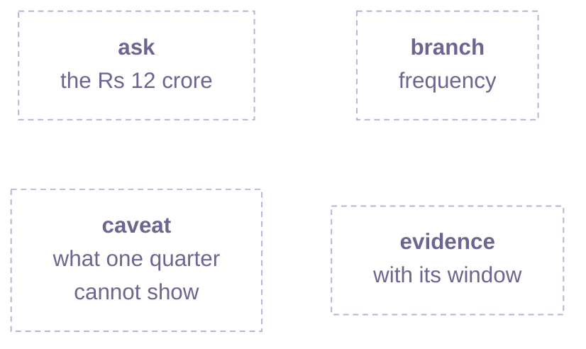
```mermaid
flowchart LR
    A["<b>ask</b><br/>the Rs 12 crore"] ~~~ B["<b>branch</b><br/>frequency"]
    C["<b>caveat</b><br/>what one quarter<br/>cannot show"] ~~~ E["<b>evidence</b><br/>with its window"]
    classDef unknown fill:#FFFFFF,stroke:#B8B2D6,color:#6B6690,stroke-dasharray:4 3
    class E,B,C,A unknown
```

**Predict before you run.** Kavya's review asks for one sentence in four parts. Which part comes last: a) the evidence, so Meera ends on the numbers; b) the ask, what happens to the Rs 12 crore; c) the branch, so she ends on the recommendation; d) the caveat, so she ends on the limit?

```notes
LIVE, 1 minute. Take letters by hand before the next slide.
Transition: S22, the answer.
```

---

## S22. Answer: the ask, so the sentence ends on the decision
*Why does the sentence end on what happens to the Rs 12 crore?*

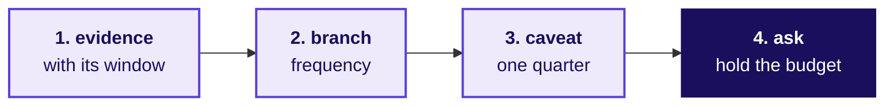
```mermaid
flowchart LR
    E["<b>1. evidence</b><br/>with its window"] --> B["<b>2. branch</b><br/>frequency"] --> C["<b>3. caveat</b><br/>one quarter"] --> A["<b>4. ask</b><br/>hold the budget"]
    classDef known fill:#EEEAFB,stroke:#5B3FD6,color:#1A0F5C,stroke-width:2px
    classDef bet fill:#1A0F5C,stroke:#1A0F5C,color:#FFFFFF
    class E,B,C known
    class A bet
```

**What happened.** The answer is b. The evidence comes first so Meera can weigh it, then the branch, then what the window cannot show, and last the ask she acts on.

```notes
LIVE, 2 minutes. Kavya's order puts the decision where Meera's eye lands last. A sentence that ends
on the caveat reads as doubt, and one that ends on the numbers leaves her to draw the conclusion.
Transition: S23, the first draft built from the chapters' numbers.
```

---

## S23. The draft: 23 customers, 1.30 each, 16 bought once
*What does the team's first draft of Meera's sentence say?*

```python
draft = (f"On the {len(ORDERS)} booked orders from 1 July to 26 September, {customers} customers "
         f"placed {per_customer:.2f} orders each at a typical order of {kit.rupees(median)}, "
         f"and {len(once_ids)} of them bought only once, so I would open frequency first ...")
```

> "On the 30 booked orders from 1 July to 26 September, 23 customers placed 1.30 orders each at a typical order of Rs 2,205, and 16 of them bought only once, so I would open frequency before acquisition, and since one quarter cannot show which branch moved, hold the Rs 12 crore until Tuesday's two quarters." The first draft

```notes
LIVE, 3 minutes. Every number in the draft comes from a variable, so the sentence cannot drift from
the work, and notebook 06 checks that the draft carries the customers, the rate and the typical
order.
Ask which number marketing will reach for first. Most say the 16.
Transition: S24, a colleague tightens the draft for the slide.
```

---

## S24. Wrong answer: 70 percent of our customers are lost
*What happens to the 16 when a colleague tightens the draft?*

**The plausible wrong answer.** A colleague tightens the draft for the slide: "16 of 23 never came back: 70 percent of our customers are lost."

```stats
value: 16 | label: bought once | note: in the 88-day window
value: 23 | label: customers | note: counted by id
value: 70% | label: called lost | note: 16 / 23, read as churn
```

The decision it would mislead: retention reads as an emergency, on a number marketing knocks down with one question.

```notes
LIVE, 2 minutes. Present the 70 percent as the colleague's tightened draft, which is how it would
reach Meera. Ask what the marketing lead would ask first; someone should say "how long do our
customers usually take to come back?"
Transition: S25, predict how many of the 16 can be called lost.
```

---

## S25. Question: how many of the 16 can we call lost?
*How many of the 16 one-time buyers are really lost?*

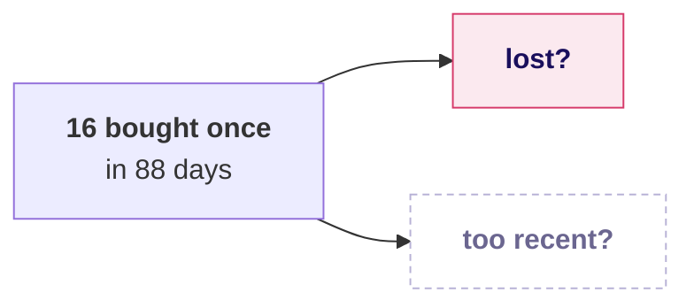
```mermaid
flowchart LR
    O["<b>16 bought once</b><br/>in 88 days"] --> L["<b>lost?</b>"]
    O --> R["<b>too recent?</b>"]
    classDef bad fill:#FBE9EF,stroke:#D63A6A,color:#1A0F5C
    classDef unknown fill:#FFFFFF,stroke:#B8B2D6,color:#6B6690,stroke-dasharray:4 3
    class L bad
    class R unknown
```

**Predict before you run.** Of the 16 who bought once, how many can you call lost from this file: a) all 16, which is 70 percent of 23 customers; b) 9, the ones who bought most recently; c) at most 7, the ones past the usual gap; d) none, since 7 customers did come back?

```notes
LIVE, 2 minutes. Take letters by hand; most pick a.
Transition: S26, the answer and the check that catches the 70 percent.
```

---

## S26. Answer: at most 7, since 9 of the 16 are too recent
*Which check catches the 70 percent, and what does it find?*

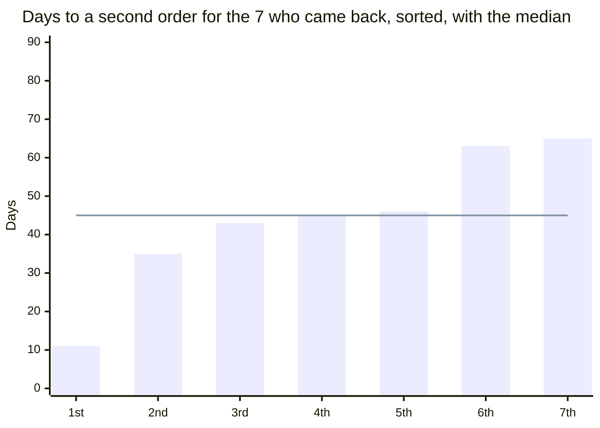
```mermaid
xychart-beta
    title "Days to a second order for the 7 who came back, sorted, with the median"
    x-axis ["1st", "2nd", "3rd", "4th", "5th", "6th", "7th"]
    y-axis "Days" 0 --> 90
    bar [11, 35, 43, 45, 46, 63, 65]
    line [45, 45, 45, 45, 45, 45, 45]
```

**Why it is wrong.** The file shows who bought once inside the window, and whether they are lost depends on orders placed after it closes. The 7 who came back took a median of 45 days, and 9 of the 16 ordered fewer than 45 days before 26 September, so the answer is c.

```notes
LIVE, 4 minutes. The check measures the usual gap from the customers who did come back and holds
back everyone who has not had that long. An 88-day window only sees gaps shorter than 88 days, so
45 days is a floor, and more of the 16 may still be on their way back.
Transition: S27, the fix in the sentence Meera signs.
```

---

## S27. Fix: the sentence splits the 16 into 7 and 9
*What does the sentence Meera signs say?*

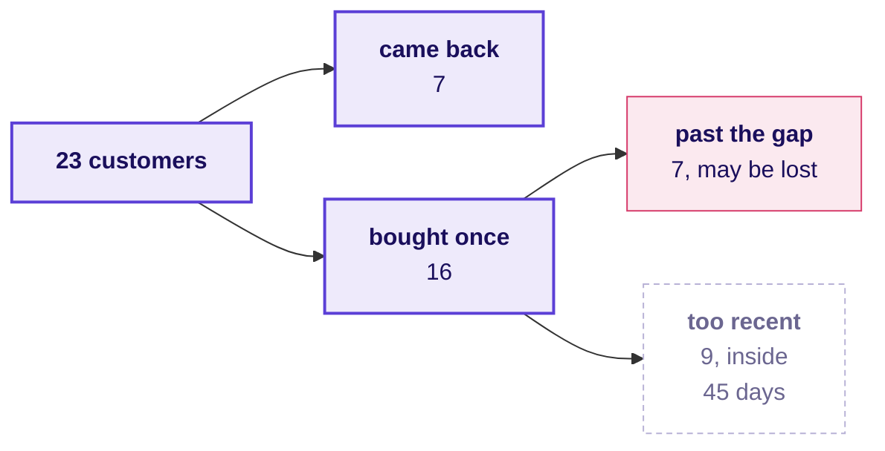
```mermaid
flowchart LR
    T["<b>23 customers</b>"] --> B["<b>came back</b><br/>7"]
    T --> O["<b>bought once</b><br/>16"]
    O --> P["<b>past the gap</b><br/>7, may be lost"]
    O --> R["<b>too recent</b><br/>9, inside<br/>45 days"]
    classDef known fill:#EEEAFB,stroke:#5B3FD6,color:#1A0F5C,stroke-width:2px
    classDef unknown fill:#FFFFFF,stroke:#B8B2D6,color:#6B6690,stroke-dasharray:4 3
    classDef bad fill:#FBE9EF,stroke:#D63A6A,color:#1A0F5C
    class T,B,O known
    class P bad
    class R unknown
```

> "On the 30 booked orders from 1 July to 26 September, 23 customers placed 1.30 orders each at a typical order of Rs 2,205; 7 came back, 7 are past the usual gap without a second order, and 9 bought too recently to judge, so I would open frequency before acquisition, and since one quarter cannot show which branch moved, hold the Rs 12 crore until Tuesday's two quarters." The data and AI team, to Meera Raghavan

```notes
LIVE, 3 minutes. What changed: the split replaces the 16, and the sentence carries no "lost" and no
percentage that marketing can recompute. Notebook 06's checks assert that each number is in the
sentence and that the word lost is not.
Transition: S28, the same split by a second route.
```

---

## S28. A second route: due dates find the same 9
*Do due dates find the same buyers as the days since ordering?*

```python
too_recent = [c for c in once_ids if (end - first[c]).days < 45]
due_late = [c for c in once_ids if first[c] + timedelta(days=45) > end]
assert set(due_late) == set(too_recent)       # the same 9 customers
```

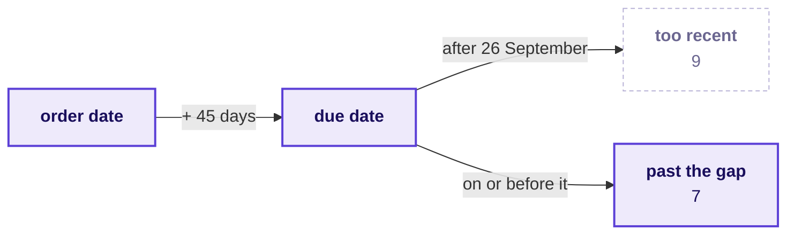
```mermaid
flowchart LR
    D["<b>order date</b>"] -->|"+ 45 days"| U["<b>due date</b>"]
    U -->|"after 26 September"| R["<b>too recent</b><br/>9"]
    U -->|"on or before it"| P["<b>past the gap</b><br/>7"]
    classDef known fill:#EEEAFB,stroke:#5B3FD6,color:#1A0F5C,stroke-width:2px
    classDef unknown fill:#FFFFFF,stroke:#B8B2D6,color:#6B6690,stroke-dasharray:4 3
    class D,U,P known
    class R unknown
```

```notes
LIVE, 3 minutes. The notebook asserts both routes find the same customers. When to switch: count the
days since the order to report today's state, and use due dates to plan follow-ups, since a due date
is the day a reminder would go out. A second quarter shows which of the 9 came back, and the
caveat shrinks.
Transition: D29 is self-study, so go to S30, Kavya's review.
```

---

## D29. The same edge hides in returns and renewals
*Where else does the end of a window cut a count short?*

```cards
icon: undo-2 | eyebrow: Returns | title: Returns arrive days after delivery, so a returns rate on last week's orders looks cleaner than it is.
icon: calendar-clock | eyebrow: Renewals | title: A member whose renewal falls after the extract ends has not lapsed, whatever the file shows.
```

The fix is the same each time: measure how long the thing usually takes, and hold back judgement on everyone who has not had that long.

```notes
SELF-STUDY, 2 minutes. Any count of who has not done something yet is cut short at the end of the
window. The dossier's returns-rate trap is the same edge.
Transition: S30, Kavya's review.
```

---

## S30. Chapter 6 hands Meera a sentence she can sign
*What one sentence can Meera sign, with its evidence, its branch, its caveat and its ask?*

1. **Who reads the sentence?** Meera reads it for the decision, and marketing for its weakest number.
2. **Which form carries the decision in the time Meera has?** One sentence does, in about 20 seconds, with its limit.
3. **What does the team's first draft say?** It names 23 customers at 1.30 orders each, Rs 2,205 typical and 16 bought once.
4. **How many of the 16 are really lost?** At most 7 are, since 9 bought inside the 45-day gap.
5. **Do due dates find the same buyers too recent to judge?** They find the same 9.
6. **What does Meera sign?** She signs a sentence that splits the 16 into 7 past the gap and 9 too recent, and opens frequency.

**Kavya's review.** "This is a sentence I would take into the room: what we know, what we would do, and what we need before spending Rs 12 crore, and every number in it is one we can defend."

**In the interview.** [D] You have one quarter of orders and 70 percent of customers bought once; what do you tell the CEO?

```notes
LIVE, 2 minutes. One learner answers aloud in under a minute: 70 percent bought once in this window,
which is a fact about the window, and churn needs orders placed after it closes; returning customers
took a median of 45 days and 9 of the 16 are inside it, so 7 came back, 7 are past the gap and 9 are
too recent, and the prior quarter comes before anyone is called lost.
Transition: section A, Anand pushes back.
```

---

## SECTION A: Does the branch survive
*Does frequency first survive on the orders that stayed delivered?*

```notes
LIVE, 35 minutes: 5 to brief on S31 and S32, then 30 alone with S32 on screen. The support TA
answers environment problems only. Collect wrong numbers while circulating, for the debrief.
Transition: S31, Anand's ask.
```

---

## S31. Anand asks for the answer again on delivered orders
*What does Anand ask, and what does each part rebuild?*

**The client asks.** "Booked includes orders we cancelled and orders that came back. Do it again on what was delivered and stayed delivered, and tell me whether your answer survives." Anand Iyer, finance controller

**Who needs the answer.** Anand, before the board sees it: an answer failing on delivered orders is restated.

1. **The delivered leaves.** Count orders, customers by id and orders per customer on delivered orders.
2. **The typical delivered order.** Find the mean, the median of an odd count and the orders above the mean.
3. **The plan and the discount.** Size the plan on delivered revenue and price the discount through the tree.
4. **The branch.** Hold back one-time buyers too recent to judge, then pick the branch and the headline.
5. **The sentence.** Write chapter 6's four parts on delivered orders, with what held.

```notes
LIVE, 5 minutes. The brief is exercises/unguided/C2_W01_D01_escalated_case_STUDENT.md and the
notebook is notebooks/C2_W01_D01_ex1_escalated_case_STUDENT.ipynb. Each learner posts the lines the
brief asks for, the sentence, and the notebook's TODO picks on one more line.
Transition: S32, what to post and how long each part takes.
```

---

## S32. Post the brief's lines, your sentence and your picks
*What do you post, and how long does each part take?*

```timeline
label: Parts 1 and 2 | title: 12 minutes | body: Rebuild the delivered leaves and find the delivered median.
label: Parts 3 and 4 | title: 12 minutes | body: Size the plan on delivered revenue, price the discount and apply the window's edge.
label: Part 5 | title: 6 minutes | body: Write the sentence, and one line on what moved and what held. | tone: dark
```

Work alone in the escalated case brief and its notebook, with no hints, and run every check before you post.

```notes
LIVE, 30 minutes, with this slide on screen while the room works alone. Write down every wrong
number you see; the debrief is built from them.
Transition: section B, the room's wrong answers.
```

---

## SECTION B: Which numbers hold up
*Which of the day's six plausible numbers would you sign, and which check catches each?*

```notes
LIVE, 15 minutes: the question 3 and the answer 12. Use the room's own numbers where they match; the
slides carry the six every room produces. A 10-minute break follows.
Transition: S33, the six numbers.
```

---

## S33. Question: which of these six numbers would you sign?
*Which of the day's plausible numbers survives its check?*

```stats
value: Rs 5,44,810 | label: sales | note: all 30 orders summed
value: Rs 25,943 | label: AOV | note: booked rupees / delivered orders
value: 1.00 | label: orders per customer | note: 30 orders / 30 rows
value: Rs 18,160 | label: typical order | note: revenue / orders
value: 20% | label: growth | note: two 10 percent lifts, added
value: 70% | label: customers lost | note: 16 of 23 bought once
```

Which would you sign as written: a) all six, since each came from the file; b) only the sales total; c) only the growth figure; d) none of the six?

```notes
LIVE, 3 minutes. Letters first, then one defender for b: the sales total is a real sum, which is why
it tempts.
Transition: S34, the checks.
```

---

## S34. Answer: none of the six survives its check
*Which check catches each number, and what goes to Meera instead?*

| The wrong number | The check that catches it | What to report |
|---|---|---|
| Rs 5,44,810 as sales | Count orders by status before summing. | Each total goes out named, with the bridge: Rs 9,050 cancelled, Rs 14,970 returned. |
| Rs 25,943 AOV | AOV x the 30 orders the revenue covers must give it back. | Rs 18,160 booked or Rs 24,800 delivered, each named, is the AOV. |
| 1.00 orders each | Compare rows with distinct ids: 30 against 23. | Kalpa has 1.30 orders per customer, and 7 came back. |
| Rs 18,160 typical | Count orders above the mean: 1 of 30. | The median, Rs 2,205, is the typical order. |
| 20 percent growth | Recompute through the tree: 1.10 x 1.10. | Growth is 21 percent, Rs 78,420 on the consumer view. |
| 70 percent lost | Hold back buyers inside the 45-day gap. | 7 came back, 7 are past the usual gap and 9 are too recent. |

```notes
LIVE, 12 minutes. The answer is d. Walk the rows in the order the room met them. Then the escalated
case: read what moved and what held on delivered orders from the day sheet's numbers table, and name
the two slips the case adds, a median of an odd count taken as the average of two middles, and
delivered one-time buyers called lost, which the same 45-day edge corrects.
Transition: a 10-minute break, then section C, the second case.
```

---

## SECTION C: Where does revenue come from
*Where does revenue come from, by customer type and channel, and does it change the branch?*

```notes
LIVE, after the break, 25 minutes: 2 to brief on S35, 15 in pairs with no slides, then S36 to S39 as
the debrief, about 8 minutes. Keep S36 off the screen until the pairs have worked.
Transition: S35, Meera's second question.
```

---

## S35. Pairs split revenue by channel, type and status
*What does Meera ask, and how do the pairs answer it?*

**The client asks.** "Where does revenue come from, by customer type and channel? The store team says they carry the business. Should the growth plan be store-led?"

**Who needs the answer.** Meera, before she makes the plan store-led: a misread share funds the wrong channel.

```timeline
label: Step 1 | title: By channel | body: Find each channel's share of booked revenue.
label: Step 2 | title: Behind a share | body: Count the orders by status in each channel.
label: Step 3 | title: Consumer view | body: Recompute the channels on the three consumer segments.
label: Step 4 | title: By status | body: Split what each channel booked, kept and lost.
label: Step 5 | title: By type | body: Add up revenue for each consumer segment.
label: Step 6 | title: The branch | body: Decide whether the channel view moves it. | tone: dark
```

```notes
LIVE, 17 minutes: 2 to brief, then 15 in pairs with no slides. Say the format aloud: in pairs, 15
minutes, in the second case brief and its notebook, arguing each item before recording it. The
pairs split by channel and by
status themselves. Segment is recorded on each order, so one repeat customer appears under two
customer types; watch for pairs who count customers per type and add the counts.
Transition: after 15 minutes, S36.
```

---

## S36. Question: is growth store-led at 91.6 percent?
*Does store's share of booked revenue make the plan store-led?*

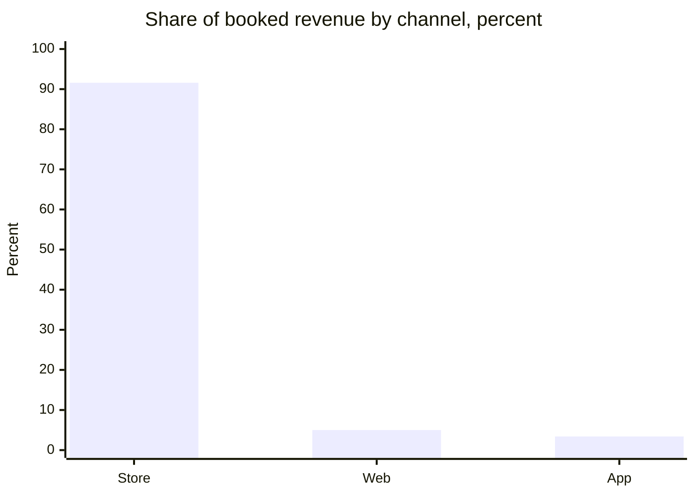
```mermaid
xychart-beta
    title "Share of booked revenue by channel, percent"
    x-axis ["Store", "Web", "App"]
    y-axis "Percent" 0 --> 100
    bar "all 30 orders" [91.6, 5.0, 3.4]
```

Choose one: a) yes, store carries nine rupees in ten; b) not yet, count the orders behind each share first; c) yes, and taking out the cancelled store orders changes little; d) no, app and web hold twenty of the thirty orders.

```notes
LIVE, 2 minutes. Expect a from pairs who stopped at the chart. The answer is b.
Transition: S37, the answer.
```

---

## S37. Answer: in the consumer view store holds 29.2 percent
*What happens to store's share once the view keeps the plan's three segments?*

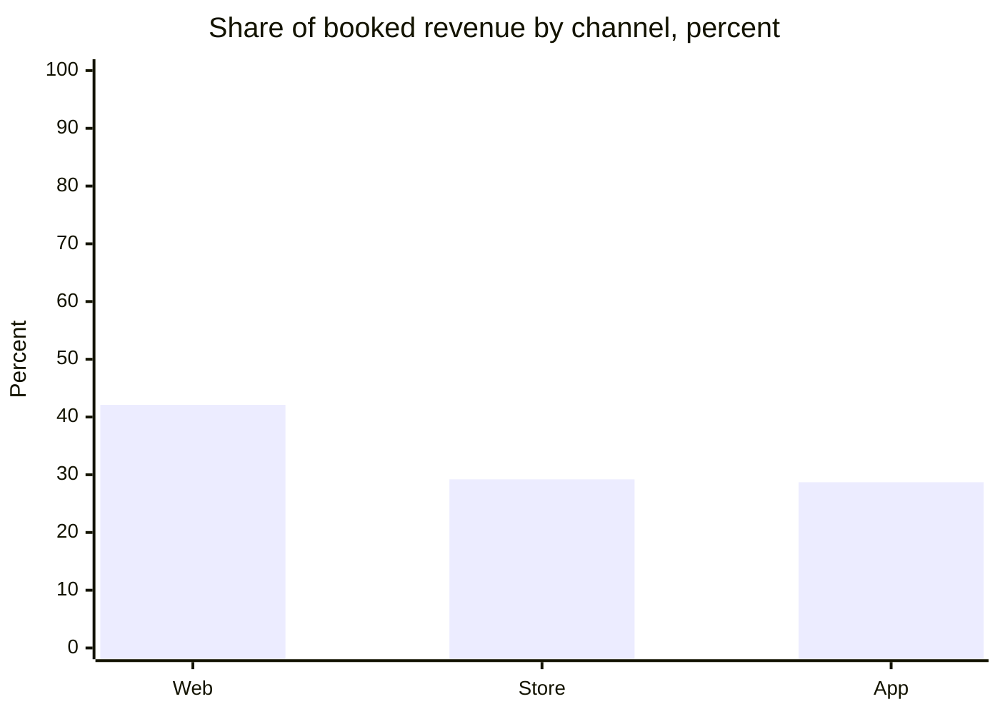
```mermaid
xychart-beta
    title "Share of booked revenue by channel, percent"
    x-axis ["Web", "Store", "App"]
    y-axis "Percent" 0 --> 100
    bar "three consumer segments" [42.1, 29.2, 28.7]
```

Store's share falls from 91.6 to 29.2 percent once the view keeps the three consumer segments Meera's plan concerns, so its headline share came from outside those segments: store holds Rs 18,920 of the view's Rs 64,810, and web leads with Rs 27,290.

```notes
LIVE, 2 minutes. Remind the room that booked revenue still counts every order and the consumer view
answers the plan's narrower question. Let the pairs say from their own table where the rest of
store's booked revenue sits, and leave the saying to them.
Transition: S38, the consumer channels split by status.
```

---

## S38. Web books the most, and more than half is returned
*What does splitting each channel by status add?*

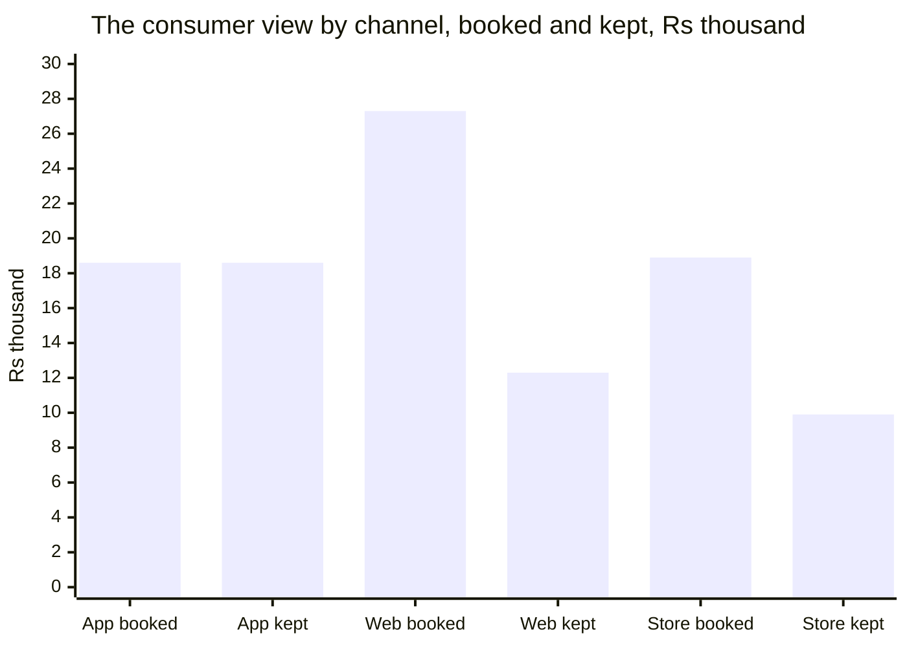
```mermaid
xychart-beta
    title "The consumer view by channel, booked and kept, Rs thousand"
    x-axis ["App booked", "App kept", "Web booked", "Web kept", "Store booked", "Store kept"]
    y-axis "Rs thousand" 0 --> 30
    bar [18.6, 18.6, 27.3, 12.3, 18.9, 9.9]
```

Web booked Rs 27,290, and customers returned Rs 14,970 of it. Store kept Rs 9,870 after Rs 9,050 of cancellations, and app kept every rupee of its Rs 18,600.

```notes
LIVE, 2 minutes. Ask which channel a finance controller would call the healthiest, and why it is app
although web books more.
Transition: S39, whether this changes the branch.
```

---

## S39. Frequency stays first, with two leaks named
*Does the channel view change the branch Meera opens first?*

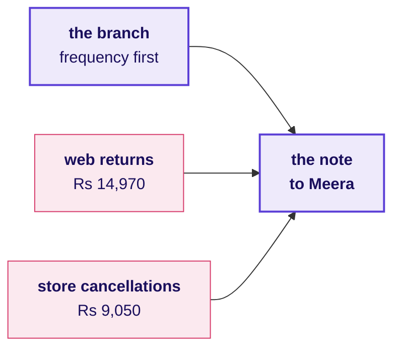
```mermaid
flowchart LR
    B["<b>the branch</b><br/>frequency first"] --> N["<b>the note<br/>to Meera</b>"]
    W["<b>web returns</b><br/>Rs 14,970"] --> N
    S["<b>store cancellations</b><br/>Rs 9,050"] --> N
    classDef known fill:#EEEAFB,stroke:#5B3FD6,color:#1A0F5C,stroke-width:2px
    classDef bad fill:#FBE9EF,stroke:#D63A6A,color:#1A0F5C
    class B,N known
    class W,S bad
```

The branch stays where chapter 5 put it.

The note gains two leaks, and Tuesday tests whether either grew.

**Kavya's review.** "Count the orders behind a share before you show it, and keep the segments the plan is about. Split each channel by status, and the 91.6 percent headline leaves the branch where it was and adds two leaks to the note."

**In the interview.** [D] One channel carries nine rupees in ten of revenue; does that change where the growth plan invests?

```notes
LIVE, 2 minutes. The leaks sit between booked and delivered on every branch; Tuesday tests whether
either grew. One pair answers the interview question aloud: count the orders behind the share, keep
the segments the plan concerns, and say that the branch stays with two leaks named.
Transition: section D, the interview drill.
```

---

## SECTION D: Can you answer the interviewer
*Can you answer the day's twelve interview questions aloud, each in under a minute, with its number?*

```notes
LIVE, 20 minutes, about 6 or 7 per slide. In pairs, one asks and one answers aloud, then they swap.
The one-breath answers are in each slide's notes, and the full answers in the study notes and the
notebooks. Listen for a number with its definition in every answer.
Transition: S40, the first four questions.
```

---

## S40. Four questions on sales, fractions and customers
*Can you define sales, choose a source and count customers aloud?*

| Tag | Question |
|---|---|
| [F] | What counts as "sales": booked, net of cancellations, or delivered, and which do you give a CEO? |
| [D] | How would you decide between summing the file yourself and asking Finance for the number? |
| [F] | Your extract shows 30 orders and 30 customers; what do you check before saying nobody comes back? |
| [SV] | A list against a dictionary: when do you reach for each? |

```notes
LIVE, 6 minutes. One breath each.
Sales: name all three and give the CEO the one her plan was set on, with the definition beside it.
Sum or Finance: sum by status for a first look, and reconcile to Finance for anything the board sees.
Thirty and thirty: compare rows with distinct ids; the set gives 23, and 7 came back.
List or dictionary: a list keeps order and walks every record, a dictionary counts or looks up by a
key, and records are a list of dictionaries.
Transition: S41, the next four.
```

---

## S41. Four questions on the typical order and the tree
*Can you defend a middle, a payback and a growth figure aloud?*

| Tag | Question |
|---|---|
| [S] | Mean or median for order value, and why? |
| [D] | Which middle would you put in a payback model, and what would make you change it? |
| [F] | A business says "grow revenue 15 percent"; how do you turn that into questions data can answer? |
| [F] | A 10 percent lift in customers and a 10 percent lift in frequency make 20 percent growth; what is the right number, and when does it matter? |

```notes
LIVE, 7 minutes. One breath each.
Mean or median: the median for a typical order, because one large order drags the mean, and the mean
where a total must multiply back.
Payback: a mean, because a payback is a total, taken over the segments the spend targets, Rs 2,235
on the consumer view, with the median of Rs 2,205 beside it as the typical order.
Grow 15 percent: fix the base and the window, then size what 15 percent asks of each branch alone;
on the consumer view that is Rs 9,722 more, 15 percent more customers or 15 percent more orders from
the same customers.
Two lifts: 1.10 x 1.10 = 1.21, so 21 percent, and the gap grows with the lifts.
Transition: S42, the last four.
```

---

## S42. Four questions on the branch and the sentence
*Can you recommend a branch and hold it when someone pushes back?*

| Tag | Question |
|---|---|
| [S] | How would you increase sales for an online retailer? |
| [D] | Marketing wants budget for acquisition; what would you check before agreeing it is the right branch, and how would you say no? |
| [D] | You have one quarter of orders and 70 percent of customers bought once; what do you tell the CEO? |
| [D] | One channel carries nine rupees in ten of revenue; does that change where the growth plan invests? |

```notes
LIVE, 7 minutes. One breath each.
Increase sales: draw the tree, measure each branch, and open the one with room to move and the
cheapest bill.
Acquisition budget: count repeat buyers, price a new customer on the consumer mean of Rs 2,235, and
ask for the prior quarter; frequency goes first, and the budget waits for two quarters.
Seventy percent: the file shows who bought once, and churn depends on orders after the window
closes; 9 of the 16 bought inside the 45-day gap.
Nine rupees in ten: count the orders behind the share and keep the segments the plan concerns; on
the three consumer segments store falls from 91.6 to 29.2 percent, and the branch stays.
Transition: section E, the close.
```

---

## SECTION E: What does Meera hear
*What do we keep from Monday, what does Meera hear, and what will she ask next?*

```notes
LIVE, 15 minutes: the Kahoot 8, the answer to Meera 2, the six lines 3 and Tuesday's question 2.
Transition: S43, the Kahoot.
```

---

## S43. The Kahoot replays today's traps, ungraded
*Which of today's traps does the room still fall for?*

```stats
value: 8 | label: items | note: one per chapter, the tree, a second on customers
value: 0 | label: scores recorded | note: ungraded, every day
value: 1 | label: return question | note: from today, in Tuesday's Kahoot
```

Each item replays one of today's traps in a new setting, so a wrong tap shows which check has not stuck yet.

```notes
LIVE, 8 minutes. Run kahoot/C2_W01_D01_quiz_STUDENT.md. Pause on any item below 60 percent correct
and ask one learner who got it right to explain it.
Transition: S44, the answer Meera hears.
```

---

## S44. No evidence acquisition is short, so frequency first
*Is acquisition even the branch that is short?*

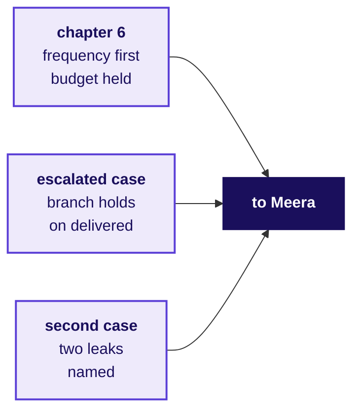
```mermaid
flowchart LR
    S["<b>chapter 6</b><br/>frequency first<br/>budget held"] --> M["<b>to Meera</b>"]
    D["<b>escalated case</b><br/>branch holds<br/>on delivered"] --> M
    C["<b>second case</b><br/>two leaks<br/>named"] --> M
    classDef known fill:#EEEAFB,stroke:#5B3FD6,color:#1A0F5C,stroke-width:2px
    classDef bet fill:#1A0F5C,stroke:#1A0F5C,color:#FFFFFF
    class S,D,C known
    class M bet
```

> "On the 30 booked orders from 1 July to 26 September, 23 customers placed 1.30 orders each at a typical order of Rs 2,205; 7 came back, 7 are past the usual gap without a second order, and 9 bought too recently to judge, so I would open frequency before acquisition, and since one quarter cannot show which branch moved, hold the Rs 12 crore until Tuesday's two quarters." The data and AI team, to Meera Raghavan

```notes
LIVE, 2 minutes. Read the sentence aloud as the day's answer to Meera's question. The escalated case
added that the branch holds on delivered orders, and the second case added two leaks to the note,
web returns and store cancellations, without moving the branch.
Transition: S45, the six lines to keep.
```

---

## S45. Each chapter's trap leaves one line to keep
*Which habit does each of the day's six traps leave behind?*

```cards
num: 1 | eyebrow: Chapter 1 | title: Definition | body: Name the definition before the number: booked, "not cancelled", or delivered.
num: 2 | eyebrow: Chapter 2 | title: One fraction | body: Build every fraction on one definition, and check that it multiplies back.
num: 3 | eyebrow: Chapter 3 | title: Customers | body: Count customers by their id, never by the rows.
num: 4 | eyebrow: Chapter 4 | title: Typical order | body: Report the median when one order can move the mean, and say why.
num: 5 | eyebrow: Chapter 5 | title: Lifts | body: Lifts multiply along the tree: two 10 percent lifts make 21 percent.
num: 6 | eyebrow: Chapter 6 | title: The window's edge | body: A one-time buyer is not a lost customer until they have had time to come back. | tone: dark
```

```notes
LIVE, 3 minutes. The same six lines are on the cheat sheet and in the study notes, word for word.
Ask which one the learner's own escalated case broke, and note the answers for Tuesday.
Transition: S46, Meera's reply.
```

---

## S46. Tomorrow, Meera asks which branch moved
*What does Meera ask once she has read the sentence?*

**The client asks.** "So revenue is customers, times how often they buy, times basket, times price. Now: which of those moved? Q2 was Rs 1.9 crore, Q1 was 2.1."

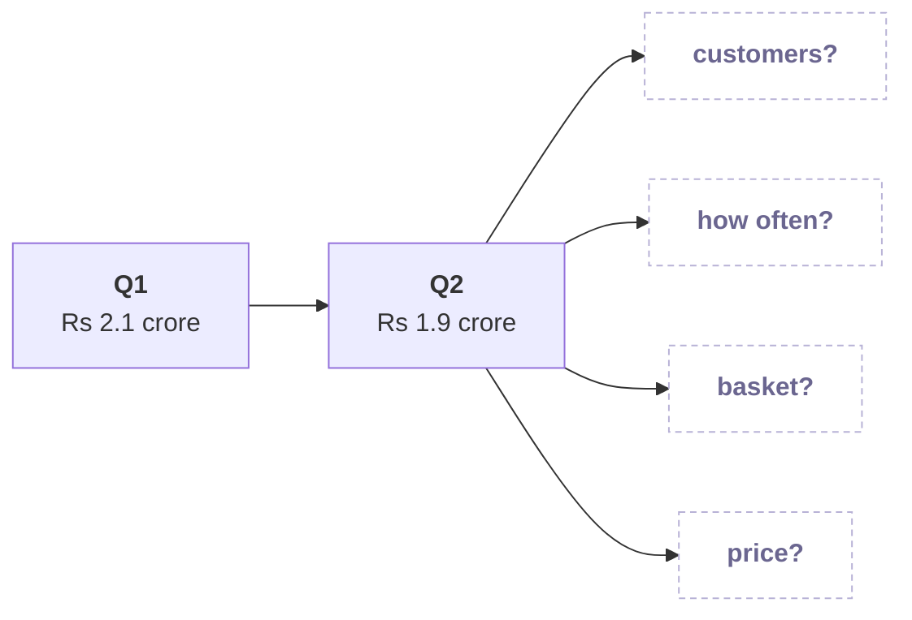
```mermaid
flowchart LR
    Q1["<b>Q1</b><br/>Rs 2.1 crore"] --> Q2["<b>Q2</b><br/>Rs 1.9 crore"]
    Q2 --> C["<b>customers?</b>"]
    Q2 --> F["<b>how often?</b>"]
    Q2 --> B["<b>basket?</b>"]
    Q2 --> P["<b>price?</b>"]
    classDef unknown fill:#FFFFFF,stroke:#B8B2D6,color:#6B6690,stroke-dasharray:4 3
    class C,F,B,P unknown
```

```notes
LIVE, 2 minutes. Read Meera's reply and stop; Tuesday's file settles it. Hand out the domain card
now, one per learner. Remind the room of the take-home and the pre-read, and that the practice lab
follows with the TA.
Transition: the practice lab, run by the TA.
```
