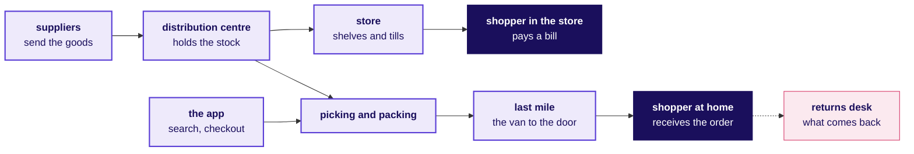
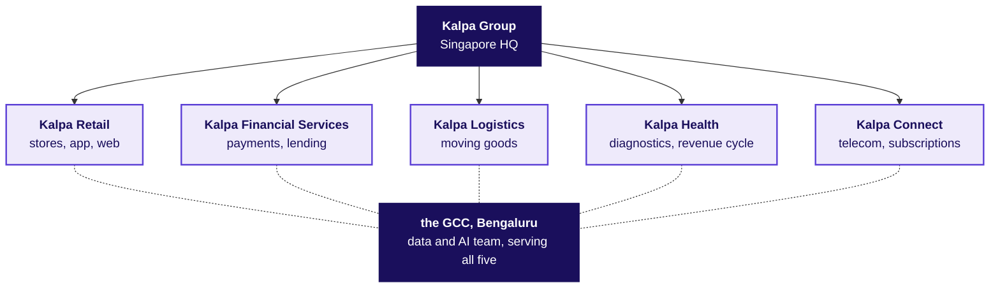
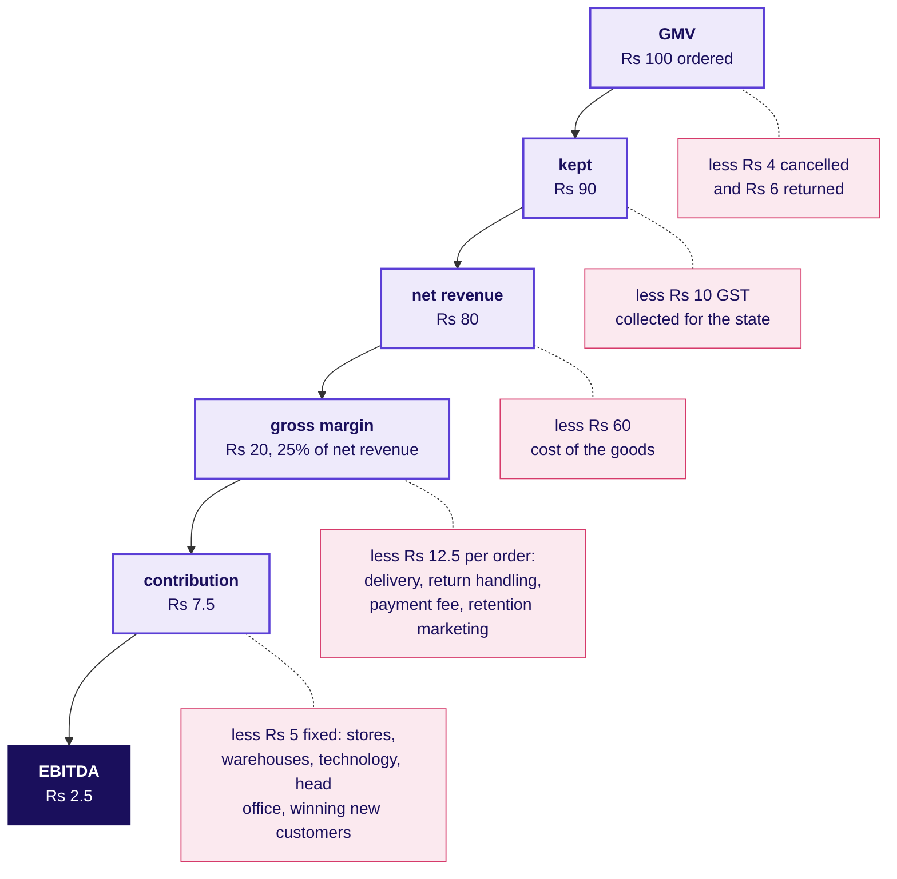
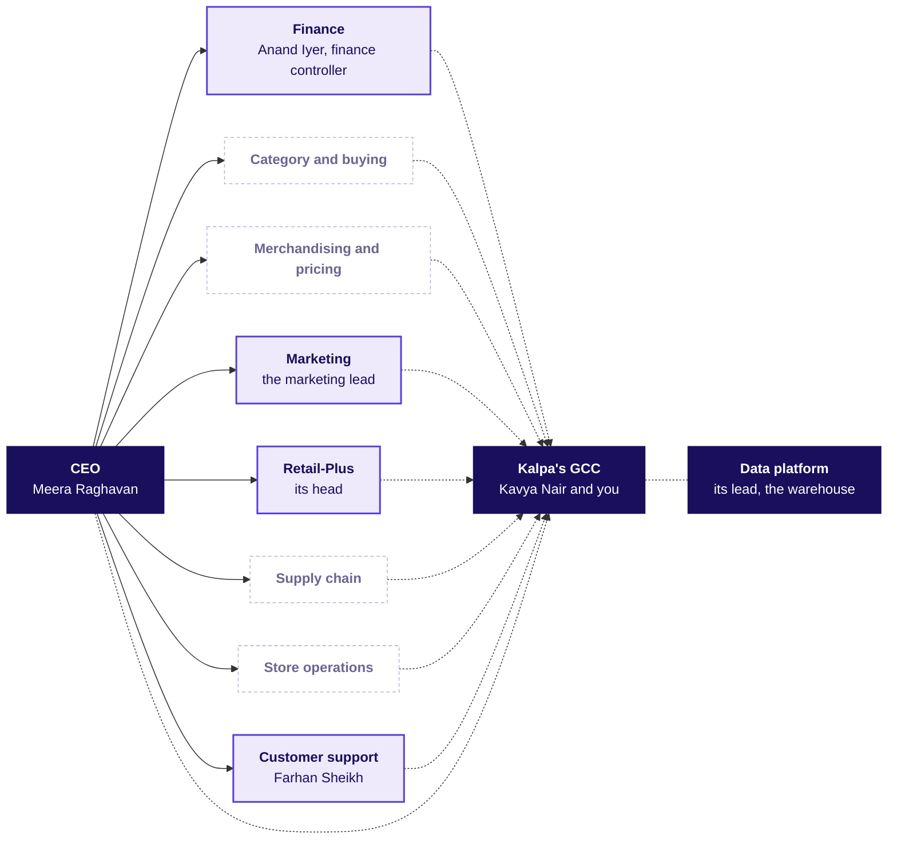
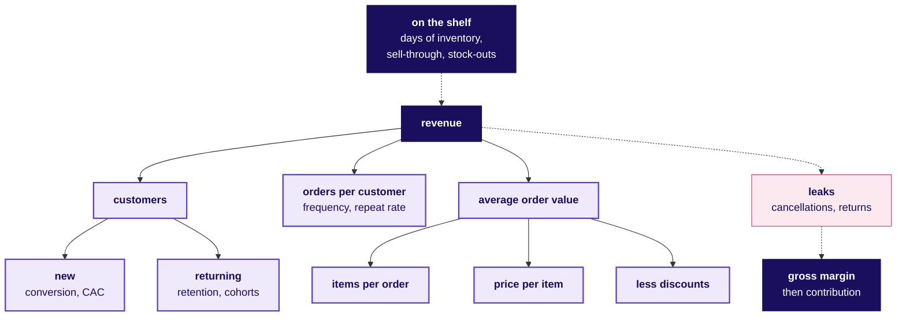
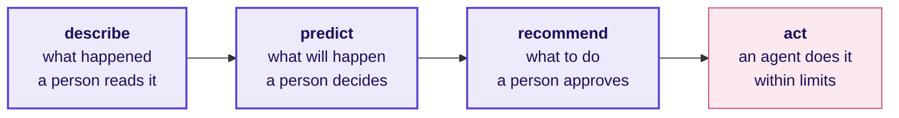

# How does Kalpa Retail make money, who decides what, and where does data earn its keep?

**Week 1, Monday · The domain before the data · Retail and e-commerce, and the real companies Kalpa resembles**

The business you work inside for the next two weeks: which real companies Kalpa is like, how a rupee at the checkout becomes profit, who asks the data team for what, every metric as a formula with a worked number and the trap it hides, and the words a stakeholder meeting assumes you know.

About a 55 minute read · 6 diagrams and 32 tables

> Kalpa Group, its people and its numbers are fictional. The real companies named here are analogies, each fact about them checked on 30 September 2026 against the source named beside it, and none of them is Kalpa's model. A number marked illustrative is a round number chosen for easy arithmetic, neither Kalpa's data nor any real company's.

---

## 1. What happens at Kalpa Retail in one working day, and who makes it happen?

One Saturday at one Kalpa Retail store and on Kalpa's app in the same city introduces the roles and most of the numbers the rest of the dossier uses. The numbers are illustrative, chosen for easy arithmetic, except the CEO's figures at the end and the support team's two thousand tickets a day, which are the story's own.

**Who needs the answer.** Meera Raghavan, the CEO, reads one page on Monday and wants to know where growth comes from and where it is leaking before she signs anything. Every number on that page was made by someone during a day like this one, and an analyst who cannot say where in the day a number comes from, or who produced it, cannot tell her whether to trust it.

**The questions on the way.**

1. What does the store find short before it opens?
2. How many shoppers come through the doors and the app, and how many of them buy?
3. What does one app basket hold, and how does it reach the door?
4. What does the category buyer weigh before marking stock down?
5. What comes back, and what reaches support, head office and finance?
6. What does the CEO read on Monday, and what does she ask?

**Before the shutters go up**, the store manager checks each shelf against its planogram, the drawing of what goes where. One check in twenty-five finds a product missing, a stock-out rate of 4 percent, and last month's stock count came up half a percent of sales short, which is shrinkage. The distribution centre's truck brings the replenishment ordered from yesterday's sales, but the cookware supplier sent only 900 of the 1,000 cases ordered, a fill rate of 90 percent, so pressure cookers will run short by Sunday.

**By mid-morning** the store is full. Across the day 1,200 people come through the doors and 480 of them pay at a till, a conversion of 40 percent, with an average bill of Rs 1,250 across five items. A family doing the month's shopping fills two trolleys; a student buys one bottle of shampoo.

**On the app** the same Saturday, 50,000 different people, its visitors, open it 80,000 times, its sessions. A shopper types "pressure cooker 3 litre" into search, and the order in which the results appear shapes what gets bought. Carts are filled 8,000 times and 2,000 orders are placed, at an average of Rs 1,500 for four items. One of them is the Saturday basket: a member of Retail-Plus, Kalpa's paid membership tier (section 2), orders a detergent, a shampoo, a pressure cooker and a bedsheet, Rs 2,000 of goods, a promotion takes Rs 200 off, and the member pays Rs 1,800 with a card the app keeps only as a token, a stand-in number from the card network, so the card itself is never stored (section 7).

**At the distribution centre** pickers pull and pack the app orders, and the Saturday basket leaves in a van for the last mile. Another parcel, ordered cash on delivery, is refused at the door and starts back as an RTO, a return to origin that cost two trips and earned nothing.

**The category buyer for home care** spends the afternoon on two numbers. The category holds 45 days of inventory, stock that would last 45 days at the current rate of sale, and its suppliers allow 60 days before they are paid. The festive lighting line has sold 620 of its 1,000 units in four weeks, a 62 percent sell-through, with Diwali still ahead. A markdown now, a permanent price cut to clear the stock, gives away margin, the gap between what an item sells for and what it cost; waiting risks carrying the stock into January.

**At the returns desk** a shopper brings back a mixer bought on the app, and next week the Saturday basket's bedsheet will come back the same way, because its colour differed from the picture. Of every 100 app orders delivered, 7 come back. Elsewhere, the support team led by Farhan Sheikh answers two thousand tickets a day, most of them asking where an order is, when a refund will land or why a payment failed.

**At head office** the marketing lead is finishing the case for Rs 12 crore to acquire new customers and following January's 1,000 new customers month by month, and the head of Retail-Plus is reading the month's renewals.

**After the store closes**, finance closes the week. The finance controller, Anand Iyer, has his team walk the week's gross merchandise value, everything ordered at the prices charged, down through cancellations, returns and GST to net revenue, what Kalpa earns from the goods (section 3), and the data team's dashboard has to agree with his books.

**On Monday** the CEO, Meera Raghavan, reads one page: revenue grew 4 percent last year against a plan of 15, marketing wants Rs 12 crore, and she wants to know where growth comes from and where it is leaking before she signs anything.

In one working day, then, goods travel from suppliers through the distribution centre to 480 bills at the store's tills and 2,000 orders on the app, and 7 of every 100 app orders delivered come back. The store manager, the pickers, the category buyer, the returns desk, Farhan Sheikh's support team, the marketing lead, the head of Retail-Plus, Anand Iyer's finance team and Meera Raghavan each make a part of it happen, and her question on Monday is the one the next two weeks answer.

---

## 2. Which real companies work the way Kalpa Retail does, and what does each teach?

In one week a family in Pune can recharge two Jio phone numbers, order the month's groceries on JioMart and buy school shoes at a Reliance store, and every one of those rupees lands in the same group.

**Who needs the answer.** Anand Iyer, the finance controller, and Meera Raghavan, whenever a Kalpa number is set beside a real company's. A store chain and an app that owns its stock book the full price of what they sell while a marketplace books only its fees, and each watches a different margin, so an analyst who benchmarks Kalpa's app against a marketplace, or its stores against an app, hands them a comparison that does not hold.

**The questions on the way.**

1. Which Indian groups is Kalpa Group built like?
2. What is a Global Capability Centre, and which real ones work like the team you join?
3. Which real retailers do Kalpa Retail's stores and app work like?
4. What does a paid tier like Retail-Plus buy a retailer, and what does its head watch?
5. Which real companies are Kalpa's other four units like, and when does each become your client?

### Which Indian groups is Kalpa Group built like?

For the quarter to 30 June 2026, Reliance Industries reported Jio with 533 million subscribers, and Reliance Retail with 20,169 stores and a JioMart app serving about 5,500 pin codes, beside its oil-to-chemicals business (Reliance Industries media release, 17 July 2026). The Tata group works the same way from a different history: founded in 1868, it runs 31 companies across ten verticals, including consumer and retail, financial services, and telecom and media (tata.com, business overview).

Kalpa Group is built like that: one group headquartered in Singapore with five business units, which share the Kalpa name and its largest engineering and data centre, in Bengaluru. Each unit is run and measured on its own numbers, so a metric that is right for Retail can mean nothing in Health, and each has a real-world twin, named below as an analogy.

### What is a Global Capability Centre, and which real ones work like the team you join?

A Global Capability Centre is a company's own team in another country, and the Indian centres of global retailers are the closest real picture of yours. Walmart Global Tech has teams in Bengaluru, Chennai and Gurugram (Walmart corporate, "Walmart in India"), and Target, Tesco and Lowe's each run a Bengaluru centre of several thousand people (Analytics India Magazine, 29 September 2026; tescobengaluru.com; lowes.co.in). Your stakeholders are internal clients who run a business elsewhere and judge you by whether their decision improved, and at Kalpa a senior on your own team, Kavya Nair, checks every number first.

### Which real retailers do Kalpa Retail's stores and app work like?

Kalpa Retail sells consumer goods through its app, its website and its stores across India and South-East Asia. Its stores work like DMart's or Reliance Retail's, buying goods and selling them at a margin. Its app books the full price of what it sells and the cost of the goods, as a retailer that owns its stock does, like DMart Ready, the online grocery business run by Avenue E-Commerce, a subsidiary of DMart's owner, Avenue Supermarts, with revenue of Rs 4,093 crore in the year to March 2026 (Business Standard, 20 March 2025; Upstox, 8 June 2026), or JioMart's grocery business, whose orders count in Reliance Retail's own grocery sales (RIL, 17 July 2026). Flipkart and Amazon India are marketplaces, where sellers own the goods, and section 3 sets the three models side by side.

### What does a paid tier like Retail-Plus buy a retailer, and what does its head watch?

Memberships are how retailers buy frequency. Paid tiers such as Amazon Prime, from Rs 399 to Rs 1,499 a year in India, typically carry faster delivery and early access to sales (About Amazon India), which remove the reason to wait and batch an order. The story does not list Retail-Plus's benefits, so these stand only as an illustration. Its head watches renewals, how often members order, and whether the fees cover what the benefits cost.

### Which real companies are Kalpa's other four units like, and when does each become your client?

Kalpa's other units have twins too: Financial Services is like PhonePe in payments and Tata Capital in lending, where a wrong loan decision costs very different amounts each way; Logistics is like Ekart, the Flipkart group's logistics arm, where every failed delivery has a price; Health is like Quest Diagnostics and Labcorp, with revenue-cycle firms such as Omega Healthcare, where an insurer stands between patient and bill; and Connect is like Jio, run on subscribers and churn. The programme prepares you for four domains, each opening on its own story: retail and e-commerce today, US healthcare with Kalpa Health on Build 1 Monday, financial services from Week 5, and SaaS and enterprise AI from Week 8, as the GCC builds AI products for Kalpa's units and for US clients.

Kalpa Group is built like Reliance or Tata, one group running several businesses. Kalpa Retail's stores work like DMart's or Reliance Retail's and its app like DMart Ready or JioMart's grocery business, Retail-Plus is a paid tier of the kind Amazon Prime is, and the team you join works like the Indian centres of Walmart, Target, Tesco and Lowe's. Each twin teaches how its kind of business books revenue and which numbers it watches.

---

## 3. How does Kalpa Retail make money, and where does each rupee go?

At the checkout the Saturday basket shows Rs 1,800: four items worth Rs 2,000 at their prices, less a Rs 200 promotional discount. Kalpa does not keep Rs 1,800, and where the money goes is the retail profit and loss statement, the P&L.

**Who needs the answer.** Anand Iyer, the finance controller, whose team walks the week's gross merchandise value down to net revenue and whose books the data team's dashboard has to agree with. Send him the value of everything ordered where his books carry what Kalpa earns, or a margin before each order's costs where he needs one after them, and he puts a figure in front of the board that he then has to restate.

**The questions on the way.**

1. How much of Rs 100 ordered does Kalpa keep, and what is each line on the way called?
2. How much of the Saturday basket's Rs 1,800 is left once the order's own costs are paid?
3. Who pays for the stock on the shelf until a customer buys it?
4. How do the three ways to sell book revenue, and why is foreign-owned multi-brand e-commerce in India a marketplace?

### How much of Rs 100 ordered does Kalpa keep, and what is each line on the way called?

**Gross merchandise value (GMV)** is the value of everything customers ordered, at the prices charged, before cancellations and returns and with tax still inside, so a discount given at the checkout is already out of it. Andreessen Horowitz calls it gross merchandise volume, "the total sales dollar volume of merchandise transacting through the marketplace in a specific period" (a16z, "16 Startup Metrics", 2015). Companies differ on whether discounts or marketplace sellers' sales are included, so the first question about any GMV is what it includes.

**Net revenue** is GMV less cancellations, returns and the GST collected for the government: what the business earns from the goods. Real retailers publish both: Reliance Retail reported gross revenue of Rs 90,408 crore and revenue from operations of Rs 79,745 crore for the same quarter, and the group's consolidated statement takes "GST Recovered", Rs 28,407 crore, off its value of sales to reach revenue from operations (RIL, 17 July 2026). Two correct numbers for one quarter is normal in retail.

Below, Rs 100 of GMV travels through an app business shaped like Kalpa's; the amounts are illustrative, and the order of the lines is every retailer's.

**Cost of goods sold (COGS)** is what Kalpa paid suppliers for the goods it sold, and **gross margin** is net revenue less COGS. Variable costs come with every order: picking and packing, last-mile delivery, the payment fee, handling returns, and the retention marketing that brings a customer back. Gross margin less variable costs is **contribution**, what each order adds towards the costs that do not change with one more order: stores and warehouses, technology, head office, and the budget that wins new customers, which section 5 turns into CAC. What remains is **EBITDA**, earnings before interest, tax, depreciation and amortisation: operating profit before depreciation, the margin retailers report.

Real retailers keep a thin slice. DMart reported an EBITDA margin of 7.8 percent and a profit-after-tax margin of 4.8 percent on FY26 revenue of Rs 66,968 crore, standalone figures for the company without its subsidiaries (DMart results release, 2 May 2026). Reliance Retail's EBITDA margin was 7.9 percent of revenue from operations in the quarter to June 2026, or 7.4 percent without Rs 374 crore of investment income (RIL, 17 July 2026). DMart keeps Rs 4.80 of every Rs 100 of revenue after tax, a little over Rs 6 before it, so a 5 percent price cut that sells nothing extra takes Rs 5 of that, about three quarters of the profit.

### How much of the Saturday basket's Rs 1,800 is left once the order's own costs are paid?

| Line | Rs, illustrative | What it is |
|---|---|---|
| Charged at checkout | 1,800 | GMV for this order, after the promotional discount |
| GST inside the price | 200 | Collected for the government |
| Net revenue | 1,600 | What Kalpa earns on the order |
| Cost of the four items | 1,200 | COGS |
| Gross margin | 400 | 25 percent of net revenue |
| Picking, packing and last-mile delivery | 120 | Variable |
| Payment gateway fee | 20 | Variable |
| Return handling, averaged | 50 | Pickups and restocking spread over every order, since most orders keep every item |
| Retention marketing on repeat orders | 60 | Variable: offers and reminders that bring a customer back; winning new customers sits in CAC |
| Contribution | 150 | 9.4 percent of net revenue, left to pay the fixed costs |

When the bedsheet comes back next week, the order shrinks: if it was Rs 450 of the Rs 1,800, Rs 400 of it net revenue and Rs 300 of it cost, net revenue falls to Rs 1,200 and gross margin to Rs 300, and with the delivery, the payment fee and the marketing already spent, the order keeps Rs 100 towards collecting the bedsheet and the fixed costs.

The trip to the door costs about the same whatever is in the bag, so a small basket carries the same delivery cost from far less margin. Quick commerce, such as Blinkit, Zepto and Swiggy Instamart, delivers small baskets in minutes from dark stores near the customer, and a Blinkit order averaged Rs 518 net of discounts in the quarter to June 2026 (MediaNama, 24 July 2026; Eternal's shareholders' letter for the quarter), about a third of the Saturday basket's value.

### Who pays for the stock on the shelf until a customer buys it?

A retailer pays for stock before a customer pays for it, and the gap is working capital.

| Measure | Formula | Illustrative |
|---|---|---|
| Days of inventory | Average inventory at cost / COGS per day | Rs 45 lakh / Rs 1 lakh a day = 45 days |
| Days of receivables | Money owed by customers and payment partners / net revenue per day | 2 days, an illustrative lag for card and UPI settlement |
| Days of payables | Money owed to suppliers / COGS per day | 60 days of supplier credit |

The cash conversion cycle is days of inventory plus days of receivables less days of payables: 45 plus 2 less 60 is minus 13 days, so suppliers fund the shelves. Stock that stops selling reverses it, until the business borrows to hold goods nobody is buying.

### How do the three ways to sell book revenue, and why is foreign-owned multi-brand e-commerce in India a marketplace?

| | Store-led | Inventory e-commerce | Marketplace |
|---|---|---|---|
| Who owns the goods | The retailer | The retailer | The sellers |
| Revenue booked | The full selling price, net of tax | The full selling price, net of tax | Only the commission and fees |
| The margin that matters | Gross margin, then store costs | Gross margin, then delivery cost per order | The take rate: fees as a share of GMV |
| Inventory risk | The retailer's | The retailer's | The sellers' |
| Indian examples, checked | DMart, with 503 stores at 30 June 2026 (Business Standard, 11 July 2026); Reliance Retail, with 20,169 (RIL, 17 July 2026); Trent's Westside and Zudio | DMart Ready, in 11 cities at 30 June 2026 (Business Standard, 11 July 2026); JioMart's grocery business | Flipkart, majority-owned by Walmart since August 2018 and about 85 percent owned at 31 January 2024 (Walmart's Form 10-K, filed 13 March 2026); Amazon India, a marketplace by its own seller terms (sell.amazon.in) |
| What its data team watches | Footfall, conversion, bill value, like-for-like growth, days of inventory | Conversion, order value, delivery cost per order, returns, days of inventory | GMV, the take rate, seller quality, returns |

The marketplace column exists in India largely because of one rule. Since 1 February 2019, foreign direct investment has been permitted up to 100 percent in marketplace e-commerce and not in the inventory model, and a marketplace may not own or control the goods sold on it or influence their prices (DPIIT, Press Note 2 of 2018). A foreign-owned multi-brand e-commerce business selling to Indian consumers must therefore run as a marketplace, which is why Flipkart and Amazon India do. The rule has edges: a single-brand retailer may sell its own brand online, and food made in India has a government-approval route (Consolidated FDI Policy 2020, paragraphs 5.2.15.3(2)(g) and 5.2.5.2).

Kalpa Retail makes money on the margin between what it charges and what its goods cost, and keeps it only once each order's own costs and the fixed costs are paid: on the illustrative numbers, Rs 100 ordered leaves Rs 80 of net revenue, Rs 20 of gross margin, Rs 7.50 of contribution and Rs 2.50 of EBITDA. Its stores and its app book the full price of what they sell, where a marketplace books only its fees, and with 60 days of supplier credit against 45 days of inventory and 2 of receivables, its suppliers fund the shelves.

---

## 4. Who decides what at Kalpa Retail, and what does each of them ask the data team?

On Monday morning, before any analysis runs, several people at Kalpa Retail already want something from the data team, and each loses something different when a number is wrong.

**Who needs the answer.** Kavya Nair, the senior analyst who checks every number before it leaves the team, and every trainee who sends one. A number sent without knowing who asked for it, or what they will decide with it, reaches a decision it was never built for, and the cost differs by role, from a figure restated in front of the board to a good store closed on a bad comparison.

**The questions on the way.**

1. How is a retailer like Kalpa organised, and which of its people has the story named?
2. What does each role own and ask the data team, and what does a wrong number cost it?

### How is a retailer like Kalpa organised, and which of its people has the story named?

The chart shows the usual shape of an Indian omnichannel retailer, drawn for orientation, since the story fixes Kalpa's people and leaves most reporting lines open.

Solid boxes are the people the story introduces, by name or by role; dashed boxes are real functions whose heads it has not introduced. Solid arrows are reporting lines, and every dotted arrow is an ask that reaches the data team.

### What does each role own and ask the data team, and what does a wrong number cost it?

| Role | Owns | Asks the data team | What a wrong number costs them | At Kalpa |
|---|---|---|---|---|
| CEO | The growth plan and where money is spent | Where does growth come from, and where is it leaking? | A budget placed on the wrong part of the business | Meera Raghavan, whose chief of staff asks for the leadership deck's numbers in Week 2 |
| Finance controller | The books, the monthly close, the audit | Do your numbers match my books, and can my analyst audit how you got them? | A figure restated in front of the board | Anand Iyer |
| Category and buying | Which products to carry, from whom, on what terms | Which lines to drop, and how much to buy for the festive season? | Dead stock that ties up cash, or empty shelves in the busiest weeks | Not named |
| Merchandising and pricing | Prices, promotions, markdowns, shelf layout | Did the promotion pay for itself? | A promotion repeated that lost money, or dropped when it paid | Not named |
| Marketing | Acquisition, retention, the customer relationship | Do we need more customers, and did my campaign work? | A campaign grown or cut on a wrong number | The marketing lead |
| Retail-Plus | Members, their fees and renewals | Is my tier the one slipping, and whom do I protect first? | The wrong members protected while the right ones lapse | The head of Retail-Plus |
| Supply chain | Warehouses, replenishment, supplier delivery | How much should go where, and when? | Stock-outs in one store and overstock in the next | Not named |
| Store operations | Stores, staffing, shelf availability, shrinkage | Which stores really underperform like for like? | A good store closed on a bad comparison | Not named |
| Customer support | Tickets, resolution time, refunds | How many tickets are coming, why, and can a model draft the replies? | A backlog, or refunds that policy did not allow | Farhan Sheikh, from Week 8, with two thousand tickets a day |
| Data platform | The warehouse and its pipelines | Query it, do not export it; tell me before you break it. | One broken pipeline feeds every dashboard | The data platform lead |
| Data and AI team | The analyses and models, and whether they are trusted | Show me the baseline, the evidence, and a second way to reach the number. | Trust, which one wrong number can lose | Kavya Nair, the senior analyst, and the trainees |

At Kalpa Retail, then, the CEO decides the growth plan and where money is spent, eight functions under her each own a part of the business, the data platform lead owns the warehouse, and Kavya Nair and the trainees own whether the analyses are trusted. Each asks the data team its own question, from Meera Raghavan asking where growth comes from and where it is leaking to Anand Iyer asking whether the numbers match his books, and the tension that runs through Weeks 1 and 2 sits in the middle of this table: marketing is measured on acquisition, finance on whether the books agree, and the data team is often the one saying that the number someone owns is not the one that moved.

---

## 5. Which numbers run Kalpa Retail, and how is each one worked out?

On Saturday the app counted 50,000 visitors, 2,000 orders and Rs 1,500 an order. If next Saturday's sales fall, each of those numbers is a suspect: fewer people came, fewer of them bought, or each spent less, and a metric exists to say which.

**Who needs the answer.** Meera Raghavan and the heads of the functions in section 4, since each owns a branch of the metric tree below. When a number moves, each of them needs to know which branch moved it, and a metric worked out on the wrong base sends the fix to the wrong team, as the returns rate below shows.

**The questions on the way.** First the tree, then the domain card's ten metrics, conversion, average order value, frequency, repeat rate, retention, lifetime value, acquisition cost and payback, gross margin, days of inventory and like-for-like growth, plus sell-through and returns, each as a formula, a worked number, the trap that most often makes it lie, and who asks for it:

1. What is revenue made of, branch by branch?
2. Of the people who visit, how many place an order?
3. How much does an average order bring in, and how many items does it hold?
4. How often does a customer order, and how many order more than once?
5. How many of a month's new customers are still buying months later?
6. How much is one customer worth across all the years they keep buying?
7. What does winning one new customer cost, and how long until that customer pays it back?
8. How much of each rupee earned is left after the goods, and after each order's own costs?
9. How many days would today's stock last, and how many times does it turn over in a year?
10. How fast does stock sell, how often is the shelf empty, and how much of an order arrives?
11. How many delivered orders come back?
12. How much did the stores that were already open grow?

The picture to keep from this dossier is the metric tree below: revenue is customers, times orders per customer, times items per order, times price per item, less discounts, and each branch says how its part is won or lost. Above revenue sits the shelf, since nothing sells that is not on it, and to its right the leaks run to the margin that decides whether the revenue was worth having.

The tree's revenue is sales at the prices charged, before cancellations, returns and GST come out, which section 3 calls GMV; the leaks are where it becomes net revenue.

Every worked number below is illustrative. Most come from section 1's Saturday or from the app's month and quarter in the same city: in the month, 40,000 customers placed 50,000 orders of four items each at Rs 450 an item before a 10 percent discount, and in the quarter 1,00,000 customers placed 1,50,000 orders. The rest are introduced where they are used.

### What is revenue made of, branch by branch?

| The revenue tree | |
|---|---|
| Formula | Revenue = customers x orders per customer x items per order x price per item, less discounts |
| Worked | 40,000 x 1.25 x 4 x Rs 450 = Rs 9 crore; less 10 percent, Rs 8.1 crore |
| The trap | Price rises read as demand: if price per item rises 6 percent and every other branch holds (invented), revenue grows 6 percent while nobody buys more, so growth counts as demand only after the price branch is taken out |
| Who asks | The CEO, first and always |

### Of the people who visit, how many place an order?

| Conversion and the funnel | |
|---|---|
| Formula | Orders / visits, both counted on the same days; each funnel step is the next stage over this one |
| Worked | 2,000 orders from 80,000 sessions is 2.5 percent, and from 50,000 visitors 4.0 percent; 2,000 of 8,000 carts became orders, 25 percent |
| The trap | A denominator that shifted: an app update that starts new sessions sooner cuts conversion with no change in buyers, and a store's conversion (bills over footfall) never compares with the app's |
| Who asks | Marketing and the app's product team |

### How much does an average order bring in, and how many items does it hold?

| Average order value and basket size | |
|---|---|
| Formula | AOV = revenue / orders; basket size = items / orders |
| Worked | Rs 30 lakh / 2,000 = Rs 1,500 with 4 items on the app; Rs 1,250 with 5 items at the store |
| The trap | Setting the app's AOV against the store's ABV, its average bill value: an app order is a planned delivery and a store bill counts every quick trip for one item, so each compares only with its own history |
| Who asks | Merchandising, marketing and finance |

### How often does a customer order, and how many order more than once?

| Frequency and repeat rate | |
|---|---|
| Formula | Orders per customer = orders / customers who ordered; repeat rate = customers with two or more orders / customers who ordered |
| Worked | The quarter's 1,50,000 orders from 1,00,000 customers is 1.5 each; 30,000 ordered twice or more, 30 percent |
| The trap | Dividing by every registered customer, including those who never ordered, gives a different and smaller metric than the tree's orders per customer |
| Who asks | The head of Retail-Plus and marketing |

### How many of a month's new customers are still buying months later?

| Retention and cohorts | |
|---|---|
| Formula | Retention in month k = the cohort's buyers in month k / the cohort's starting size |
| Worked | January's 1,000 new customers: 380 ordered in February, 300 in March and 260 in April, which is 38, 30 and 26 percent |
| The trap | Dividing by survivors: 300 over 380 is 79 percent and is the share of February's buyers who came back in March; retention divides by the 1,000 who started. |
| Who asks | The head of Retail-Plus and marketing |

### How much is one customer worth across all the years they keep buying?

| Customer lifetime value, CLV | |
|---|---|
| Formula | CLV = contribution per order x orders a year x expected years as a customer |
| Worked | Rs 150 x 6 x 2 = Rs 1,800, on contribution after retention marketing and before the cost of winning the customer, which CAC carries |
| The trap | Revenue in place of contribution values the same customer at Rs 19,200, more than ten times too high, and every budget sized on it is too large |
| Who asks | Marketing and finance, whenever an acquisition budget is argued |

### What does winning one new customer cost, and how long until that customer pays it back?

| Customer acquisition cost, CAC, and payback | |
|---|---|
| Formula | CAC = acquisition spend / new customers it brought; payback months = CAC / monthly contribution per customer |
| Worked | An invented campaign of Rs 3 crore that brought 20,000 new customers has a CAC of Rs 1,500; at Rs 75 of contribution a month, payback takes 20 of the 24 months a customer stays, so the CLV of Rs 1,800 clears the CAC by Rs 300 |
| The trap | Blended CAC divides by every new customer, including those who came free, so it makes spend look cheaper than paid CAC does (a16z, 2015) |
| Who asks | The CEO and the finance controller, before signing |

### How much of each rupee earned is left after the goods, and after each order's own costs?

| Gross margin and contribution margin | |
|---|---|
| Formula | Gross margin percent = (net revenue less COGS) / net revenue; contribution = gross margin less variable costs |
| Worked | Home care in a month: COGS of Rs 30 lakh, the Rs 1 lakh a day behind its 45 days of inventory, on net revenue of Rs 37.5 lakh is a gross margin of Rs 7.5 lakh, 20 percent; after Rs 5 lakh of per-order costs, contribution is Rs 2.5 lakh, 6.7 percent (invented) |
| The trap | Dividing margin by GMV: the Saturday basket's Rs 400 over its Rs 1,800 of GMV is 22 percent, about three points under its margin on net revenue, and with GST in the base a tax change moves the margin while the business stands still |
| Who asks | The finance controller and the category buyers |

### How many days would today's stock last, and how many times does it turn over in a year?

| Inventory turns and days of inventory | |
|---|---|
| Formula | Turns = annual COGS / average inventory at cost; days = average inventory at cost / COGS per day |
| Worked | Home care: Rs 45 lakh against Rs 1 lakh a day is 45 days, about 8 turns a year |
| The trap | Stock at selling price divided by COGS inflates the days, and a snapshot before the festive build-up is far from the year's average |
| Who asks | Supply chain, category buyers, and finance for working capital |

### How fast does stock sell, how often is the shelf empty, and how much of an order arrives?

| Sell-through, stock-outs and fill rate | |
|---|---|
| Formula | Sell-through = units sold / units received; stock-out rate = empty product-days / all product-days; fill rate = units delivered / units ordered |
| Worked | Festive lights: 620 of 1,000 in four weeks, 62 percent. Across 5,000 products and 30 days, 6,000 of 1,50,000 product-days empty, 4 percent. A supplier's 900 of 1,000 cases, 90 percent. |
| The trap | A missed sale leaves no row: a line that sold out on day three shows a perfect sell-through, and warehouse stock can call a product available while its shelf is empty |
| Who asks | Category buyers, store operations and supply chain |

### How many delivered orders come back?

| Returns rate | |
|---|---|
| Formula | Returned / delivered, in units, orders or rupees, on one stated basis |
| Worked | Of the month's 50,000 orders, 48,000 were delivered and 3,360 came back: 7 percent |
| The trap | A parcel refused at the door comes back as RTO without ever being delivered. Counted among the returns while the divisor is delivered orders, it puts in the top what the bottom leaves out, the rate rises, and the fix goes to the product team when the cause is cash on delivery and the address |
| Who asks | Finance, the fashion category, support and logistics |

### How much did the stores that were already open grow?

| Same-store sales, or like-for-like growth | |
|---|---|
| Formula | Sales of stores open throughout both periods / the same stores' sales in the earlier period, less 1 |
| Worked | 100 stores went from Rs 500 crore to Rs 510 crore, up 2 percent, while 20 new stores added Rs 65 crore for 15 percent in all (invented). DMart's stores two years and older grew 10.8 percent in the quarter to March 2026 (DMart, 2 May 2026), and Reliance Retail's grocery 7 percent like for like in the quarter to June 2026 (RIL, 17 July 2026). |
| The trap | Letting a young store into the base: one that opened halfway through last year has six months of sales in the base and twelve now, so it adds growth no customer created, and each company sets a minimum age before a store counts |
| Who asks | The CEO, store operations and investors |

The numbers that run Kalpa Retail hang off one tree: customers, orders per customer and average order value multiply to revenue, the leaks take it down to net revenue, and the margins decide whether it was worth having. Each is worked out as a formula on one stated base, conversion over visits, average order value over orders, repeat rate over customers who ordered, retention over the cohort's starting size, gross margin over net revenue and like-for-like growth over the same stores' earlier sales, and each has an owner who asks for it.

---

## 6. Which words will you hear in a stakeholder meeting at Kalpa Retail, and what do they mean?

At Monday's trading meeting the category buyer for home care says: "The lights are at 62 percent sell-through and the category holds 45 days of inventory, so do we mark down now or wait for Diwali?" Anyone who has to ask what sell-through or days of inventory mean has lost the thread before the question arrives.

**Who needs the answer.** The category buyer for home care, and every stakeholder at a meeting like that one, who use these words without stopping to define them. Mistake one word for another and the answer is a different number: net revenue given where GMV was asked for is the smaller figure, and a store's ABV set against the app's AOV compares two different baskets.

**The questions on the way.**

1. Which words say what a sale is worth, from the price charged to the margin kept?
2. Which words follow the stock from the supplier to the shelf?
3. Which words measure the shoppers and the stores?
4. Which words describe getting an order to the door, and back?
5. Which words describe customers over time, and what winning one costs?

Each word below is defined in plain language and then used as someone at Kalpa would use it; the numbers in those sentences are illustrative.

### Which words say what a sale is worth, from the price charged to the margin kept?

| Term | What it means | Said in a meeting |
|---|---|---|
| GMV | Gross merchandise value: all orders at the prices charged, before cancellations, returns and GST come out | "GMV grew 12 percent; after returns and GST, net revenue grew 8." |
| Net revenue | GMV less cancellations, returns and the GST collected for the government | "Finance reports net revenue, so reconcile to that." |
| AOV and ABV | Average order value online and average bill value in a store: sales per order or per bill | "The app's AOV is Rs 1,500 and the store's ABV is Rs 1,250, on different baskets." |
| MRP | Maximum retail price: the legal ceiling for a packaged item, taxes included | "We can sell below MRP on the app, never above it." |
| Markdown | A permanent price cut to clear stock that is not selling | "Take the festive lights down 30 percent before they become next year's problem." |
| COGS | Cost of goods sold: what we paid suppliers for what we sold | "Margin moved because COGS rose; we did not discount more." |
| Gross margin | Net revenue less COGS, often as a percent of net revenue | "Fashion carries a 40 percent gross margin and staples about 10." |
| Contribution margin | Gross margin less the costs that come with each order | "The small quick orders are contribution-negative once delivery is paid." |
| Private label | A retailer's own brand, usually at a higher margin than national brands | "Our private label rice earns twice the margin of the brand beside it." |
| Take rate | A marketplace's fees as a share of the GMV sold through it | "A 15 percent take rate on Rs 100 crore of GMV is Rs 15 crore of revenue." |

### Which words follow the stock from the supplier to the shelf?

| Term | What it means | Said in a meeting |
|---|---|---|
| SKU | A stock keeping unit: one sellable version of a product, such as one size | "A shampoo in two sizes is two SKUs, and home care carries 1,200 of them." |
| Fill rate | The share of an order a supplier actually delivered | "The supplier's fill rate fell to 90 percent, and that is our stock-out." |
| Replenishment | Reordering stock so the shelf is refilled before it empties | "Replenishment runs nightly from the day's sales." |
| Days of inventory | How many days current stock lasts at the current rate of sale | "Home care holds 45 days of inventory against 60 days of supplier credit." |
| Planogram | The diagram that says which product goes on which shelf, in which place | "The new planogram moved detergents to eye level; check sales by shelf position." |
| Stock-out | A product that is not on the shelf when a customer wants it | "Sunday's rice stock-out cost more than a month of shrinkage in that aisle." |
| Sell-through | Units sold over units received, for a line over a period | "At 62 percent sell-through in four weeks, the lights need a markdown plan." |
| Shrinkage | Stock lost to theft, damage or error, found when the count falls short of the books | "Shrinkage was half a percent of sales, twice last year's." |

### Which words measure the shoppers and the stores?

| Term | What it means | Said in a meeting |
|---|---|---|
| Footfall | People who walk into a store, counted at the door | "Footfall fell on Saturday, conversion rose, and sales held." |
| Conversion | The share of visits that end in a purchase | "App conversion is 2.5 percent of sessions." |
| Basket size | Items per order, also called units per transaction | "Bundles lifted basket size from four items to five." |
| Like-for-like | Growth measured only on stores open throughout both periods; also same-store sales | "Total sales grew 15 percent, like-for-like 2." |

### Which words describe getting an order to the door, and back?

| Term | What it means | Said in a meeting |
|---|---|---|
| Dark store | A small neighbourhood warehouse that serves only online orders | "Quick commerce runs on dark stores a short ride from the customer." |
| Last mile | The final leg of delivery, from the local hub to the door | "Our last-mile cost per order is what fast delivery really costs us." |
| Cash on delivery | Paying the delivery person when the parcel arrives | "Check whether refused parcels are mostly COD before we change payment options." |
| RTO | Return to origin: a parcel that goes back undelivered, often a refused COD order | "RTO is the first number to check before we offer cash on delivery in a new city." |

### Which words describe customers over time, and what winning one costs?

| Term | What it means | Said in a meeting |
|---|---|---|
| Cohort | Customers grouped by when they first bought, followed over time | "The January cohort retained 26 percent by April." |
| Churn | Customers or members who stop buying or do not renew, as a share of the base | "Retail-Plus churn is the number its head asks about first." |
| CAC | Customer acquisition cost: the spend on winning new customers over the number it brought | "A Rs 3 crore campaign that brought 20,000 customers had a CAC of Rs 1,500." |
| CLV | Customer lifetime value: the contribution a customer brings over their time with us | "Value customers on contribution; CLV on revenue flatters every campaign." |

A stakeholder meeting at Kalpa Retail assumes these thirty words, from GMV to CLV, and with them the home care buyer's question reads plainly: 620 of the 1,000 lights have sold in four weeks, the category's stock would last 45 days at the current rate of sale, and the choice is whether to mark the lights down now or wait for Diwali.

---

## 7. Which rules bind Kalpa Retail's data, and what do they forbid an analyst or an AI system?

The Saturday basket met most of the rules below on its way to the door: the tax on its invoice, the MRP on the shampoo, the declarations on the product page, the consent behind the member's data and the token that stands in for the card.

**Who needs the answer.** Anyone at Kalpa Retail who wants a model or an agent to touch customers' data, prices or complaints, and the analyst who builds it. Selling above MRP is an offence whatever a test would show, complaints run on a legal clock, and penalties under the data protection law run up to Rs 250 crore, so a rule missed when a model is designed becomes an offence or a penalty once it runs.

**The questions on the way.**

1. Which rules does a sale in India meet on its way to the door, and what does each ask of the data team?
2. Which rules travel with a US retailer's customers to a team in Bengaluru?

### Which rules does a sale in India meet on its way to the door, and what does each ask of the data team?

The table gives eight sets of rules, and its right-hand column is what an analyst or an AI system answers for.

| Rule, and what it requires | What it means for an analyst or an AI system |
|---|---|
| **GST and the tax invoice.** An invoice shows the tax inside the price and, on a sale across a state line, the place of supply, and sales under Rs 200 to unregistered buyers who do not ask for an invoice may share one invoice at the close of the day (CGST Act, section 31, and rule 46). Invoices to registered businesses are e-invoices once the seller's turnover passes Rs 5 crore, a marketplace collects tax at source on its sellers' sales, and most goods sit at 5 or 18 percent from 22 September 2025 (GST Council, 3 September 2025). | Every revenue column says whether GST is inside it, and finance reconciles to the invoices, where a day's small sales can share one, so an invoice count is no bill count. A comparison straddling 22 September 2025 mixes a tax change into a price change. |
| **Legal Metrology (Packaged Commodities) Rules 2011.** Every pre-packaged item shows its maker, its MRP "inclusive of all taxes", a consumer-care contact (rule 6) and, from 1 April 2022, its unit sale price (SCC Online, 8 November 2021); nobody may sell above the retail sale price (rule 18(2)); and since 1 January 2018 an e-commerce product page shows the same declarations, except the date of manufacture. | A pricing model or agent is capped at MRP, because selling above it is an offence whatever a test would show, and model-written catalogue text keeps every declaration. |
| **Consumer Protection (E-Commerce) Rules 2020** (G.S.R. 462(E), 23 July 2020). Complaints acknowledged within forty-eight hours and redressed within a month (4(5)); consent by explicit action, never a pre-ticked box (4(9)); no price manipulation and no discrimination between consumers of the same class (4(11)); a marketplace publishes the main parameters that rank goods and sellers, and their relative importance (5(3)(f)). | A support bot's turnaround is a legal clock. Different prices for similar customers need legal review first. A ranking model's main inputs and their weight are published to shoppers, so they must be ones the business can state. |
| **Dark patterns guidelines**, issued by the Central Consumer Protection Authority on 30 November 2023 with 13 specified patterns (PIB, 8 December 2023), which the guidelines' Annexure 1 sets out, among them false urgency, basket sneaking, drip pricing, and bait and switch (SCC Online, 4 December 2023). | A test that wins by slipping an item into the basket or running a fake countdown is a dark pattern, and a model writing offers must not invent urgency. |
| **Digital Personal Data Protection Act 2023 and Rules 2025.** The Rules were notified in the Gazette on 13 November 2025 (G.S.R. 846(E)), and most of their duties apply from 13 May 2027: a consent notice naming the purpose, use only for lawful and specific purposes, prompt notice of a breach, verifiable parental consent for a child's data, and penalties under the Act of up to Rs 250 crore for failing to keep reasonable security safeguards (PIB explainer, 17 November 2025). | Data collected to deliver a parcel is not automatically free to train a model. Analysis tables carry member IDs in place of names and phone numbers, deletion requests reach every copy, and a single view of a customer needs a purpose. |
| **RBI card-on-file tokenisation.** Only card issuers and networks may store the card number; merchants hold a token and may keep the last four digits and the issuer's name for reconciliation (RBI circular of 7 September 2021, in force from 1 October 2022; BusinessToday, 24 June 2022). | No payments table holds a full card number; reconciliation joins on the token, or matches the last four digits and the issuer together with the amount and the time. |
| **PCI DSS**, the card industry's security standard for anyone who stores, processes or transmits card data, now at version 4.0.1 of 11 June 2024 (PCI Security Standards Council blog). | Card data stays out of analytics environments, logs and model inputs. |
| **FDI policy on e-commerce.** A foreign-owned multi-brand e-commerce business selling to Indian consumers runs as a marketplace (section 3). | A marketplace must not steer its sellers' prices, so a pricing model built there advises sellers. |

### Which rules travel with a US retailer's customers to a team in Bengaluru?

For a GCC serving a US retailer, the customer's rights travel with the data. California's privacy law lets a resident learn what personal information a business holds, have it deleted or corrected, stop its sale or sharing, and limit the use of sensitive information (California Attorney General, CCPA page), and its rules on automated decision-making, in force from 1 January 2026, reach significant decisions from 1 January 2027 (CPPA, 23 September 2025). A deletion request made in California has to reach the copy in a Bengaluru notebook.

Eight sets of rules bind the data behind a sale in India, and California's travel with a US client's. They forbid selling above MRP, consent taken through a pre-ticked box, dark patterns such as false urgency and basket sneaking, a full card number in a payments table and personal data used beyond its purpose, and they require every revenue column to say whether GST is inside it and a marketplace to publish what ranks its goods and sellers. Before a model ships, an analyst takes five questions to the legal team: which data, for which purpose, with whose consent, at what price, and ranked by what rule.

---

## 8. Where do analytics, ML, NLP and agents pay for themselves in retail, and how is that measured?

On Saturday a person made every decision. Each technique below takes over part of one, and each row names its rung on this ladder: the further right, the less a person checks before the decision takes effect, so the more a wrong answer costs.

**Who needs the answer.** Meera Raghavan, before she funds a model or an agent, and the head whose work it would take over, such as Farhan Sheikh, whose team answers two thousand tickets a day. Each needs to know what the technique saves, how that is measured and what one wrong answer costs once no person checks it, since a saving counted without its cost reaches the budget looking larger than it is.

**The questions on the way.**

1. Which techniques pay for themselves where, and what does each cost when it is wrong?
2. What would a support model save Farhan Sheikh's team, and what could one wrong draft cost in a day?
3. What happened when real companies let software answer their customers?

### Which techniques pay for themselves where, and what does each cost when it is wrong?

| Where it earns | The problem, and why the technique | How it works, in outline | Value measured by | What it costs when wrong |
|---|---|---|---|---|
| Descriptive analytics: the Monday numbers (describe) | Leaders decide weekly on what happened, branch by branch of the tree | Governed SQL on the warehouse, one definition per metric | Decisions taken on it, and no restatements | A board decision on a wrong number |
| Demand forecasting and replenishment (predict, then recommend) | Stock must reach the store before the customer, across thousands of products | Forecast each product's daily sales per store from history, calendar, price and promotions, baselines first; order the forecast plus safety stock for the lead time | Error against a naive baseline, stock-outs, days of inventory | Cash tied in stock that ends in markdowns, or empty shelves |
| Pricing and markdowns (recommend) | The price that clears a line at the best margin | Estimate how demand responds to price from past changes, then simulate markdown paths | Margin on each line cleared, and the stock left when the season ends | Margin lost to a markdown too deep or too early; above MRP, an offence |
| Assortment (describe, then recommend) | Which products each store carries in limited space | Group stores by what their customers buy; measure what each product adds against what it takes from its neighbours | Sales and margin per metre of shelf | Delisting the product that brings a customer in |
| Recommendations and search ranking (predict, then act) | A shopper cannot see thousands of products, so the order shown decides what is found | Learn from purchases and clicks which items go together, and rank by predicted relevance and chance of purchase | Margin per search, and the share of searches that end in a purchase | Items shoppers do not want or cannot get, and a ranking whose main parameters the platform cannot state |
| Churn and retention scores (predict) | Knowing which members will lapse before they do | Classify each customer's chance of not ordering in the next ninety days from recency, frequency, spend and service history | How many flagged members do lapse, and renewals per rupee of offer | Offers spent on the wrong members while the ones at risk lapse |
| Fraud and returns abuse (predict, then act) | Stolen payments and return schemes hide among honest orders | Rules for the obvious, then anomaly and classification models on payments, accounts, devices and returns | Losses prevented against good customers blocked | A real customer turned away, or a fraudster paid, at very different costs |
| Catalogue enrichment (recommend) | New products arrive with thin descriptions | Extract attributes from supplier sheets and photos and write consistent descriptions with a model, checked against the declarations | Search success, and "not as described" returns | An invented attribute that becomes a return |
| Agents that act (act) | Replenishment, refunds and buyers' questions wait in queues | A replenishment agent drafts orders within limits; a support agent refunds when a case fits the policy; a merchandising copilot writes, runs and shows the query behind a buyer's question | Cases resolved without a person, reversals, time saved | An order outside limits, a refund the policy never allowed, a fluent answer on a wrong join |

### What would a support model save Farhan Sheikh's team, and what could one wrong draft cost in a day?

Language models enter here, on the rungs where a model recommends and then acts. Farhan Sheikh's team answers two thousand tickets a day. Suppose, as an illustration, that 1,200 ask where an order is or when a refund will land, and a model that reads each ticket, retrieves the policy and drafts a reply for an agent to approve saves four minutes on each: 1,200 times four minutes is 80 agent-hours a day, ten eight-hour shifts. Now suppose the draft misstates the return window and agents approve it on 300 refund tickets a day at Rs 800 each: Rs 2,40,000 of refunds the policy never allowed, in one day, before anyone notices. The gain shows in resolution time, repeat contacts and cost per ticket; the risk is measured by checking a sample of drafts against the refund policy every week, and the error rate on that sample decides whether the drafts keep going out.

### What happened when real companies let software answer their customers?

Two public cases show both ends of the ladder. Klarna's AI assistant handled two-thirds of its customer-service chats in its first month, the work of 700 full-time agents, and cut the time to resolve an errand from 11 minutes to under 2 (Klarna press release, 27 February 2024); fifteen months later its chief executive said the focus on cost had produced lower quality and that customers would always be able to reach a human (Fortune, 9 May 2025, from an interview with Bloomberg). When Air Canada's website chatbot described a bereavement-fare refund the airline did not offer, a Canadian tribunal held the airline responsible, since "it makes no difference whether the information comes from a static page or a chatbot" (Moffatt v. Air Canada, 2024 BCCRT 149, as reported by McCarthy Tétrault).

Analytics, ML, NLP and agents pay for themselves at Kalpa Retail in nine places, from the Monday numbers and replenishment to search ranking, fraud, catalogue text and agents that act within limits, and each is measured on its own terms, from forecast error against a naive baseline to cases resolved without a person. The further right a technique acts, the more a wrong answer costs: in the illustration above, drafts that save 80 agent-hours a day pay out Rs 2,40,000 the policy never allowed, in one day, once a misstated return window is approved on 300 refund tickets. An agent that issues refunds is only as safe as its policy and its limits.

---

## 9. Which technical problems does Kalpa Retail's data team meet, and how do you choose a fix?

On Saturday the category buyer for home care had 380 festive lights left of 1,000, with Diwali ahead, and more than one honest way to decide on a markdown. Most retail data problems look like that, with several defensible answers chosen by the rows each needs, its cost, its time and the accuracy it must reach.

**Who needs the answer.** Kavya Nair, who asks for the baseline, the evidence and a second way to reach every number, and the head of whichever function asked. Each problem below has more than one defensible answer, and an option sized wrong either spends weeks on a model the data cannot support or ships a rule of thumb where the stakes needed more.

**The questions on the way.** The seven below reach every retail data team; their sizes are illustrative.

1. When should the festive lights be marked down?
2. How do you find stock-outs in sales data?
3. How do you forecast what a promotion week will sell?
4. How do you stop risky cash-on-delivery orders before they become RTOs?
5. How should stores be grouped so each carries the range its customers buy?
6. How do you tell that an app customer and a store customer are the same person?
7. What do you do about searches that find nothing?

### When should the festive lights be marked down?

| Option | How to size it |
|---|---|
| A rule of thumb: mark down when sell-through at a checkpoint falls below plan | Minutes a line; blind to how fast festival weeks sell |
| Project the weeks left from the rate so far and last year's festival lift, and mark down only what the projection leaves unsold | An hour a line, on two years of weekly sales |
| Estimate how demand responds to price from past markdowns, then simulate the depth and timing that earn the most margin | Dozens of past markdowns on similar lines, and weeks to build |

The best fit for Kalpa is the projection, line by line, since one season of lights holds too few markdowns to estimate how demand responds to price. It changes once hundreds of seasonal lines are marked down each year and the simulation pays for itself.

### How do you find stock-outs in sales data?

| Option | How to size it |
|---|---|
| Flag runs of zero sales on products that normally sell every day | One query over the sales history; misses slow sellers |
| Join the daily stock records and mark a product-store-day out when stock on hand was zero | 50 stores x 5,000 products x 365 days, about 9 crore rows a year; right only when the records match the shelf |
| Estimate the sales lost on flagged days from what those days usually sell | A forecast per product and store, and days of work |

Kalpa is best served by the stock records with the zero-sales rule beside them, and a monthly audit of sample shelves to measure how often the records call a product available while its shelf is empty. The answer changes if shrinkage runs high, since the records then drift from the shelf and the audits carry more weight.

### How do you forecast what a promotion week will sell?

| Option | How to size it |
|---|---|
| Last year's promotion week, scaled by this year's growth | An hour; fails when the promotion changes |
| A normal-week baseline plus the uplift of past promotions of similar depth | Days; tested on past promotions it did not learn from |
| A machine-learning model on product-store-day history with price, promotion and calendar features | 50 stores x 5,000 products x 730 days is about 18 crore rows, and weeks of work |

For Kalpa a baseline plus uplift at category level, split down to products, fits best, since each product has seen few comparable promotions, and its history needs its stock-out days flagged first or it learns that an empty shelf sold nothing. It changes once each product has years of similar promotions behind it. A stock-out and an overstock cost different amounts, so the error is judged in rupees.

### How do you stop risky cash-on-delivery orders before they become RTOs?

| Option | How to size it |
|---|---|
| Rules: no cash on delivery above an order value, or for accounts that refused a parcel before | Hours; blunt, and it turns good customers away with the bad |
| Score each cash-on-delivery order's chance of refusal from the account's history, the address, the pin code's past refusals and the order | Months of delivered and refused orders as labels, and days to build |
| Ask before dispatch: a message to confirm, or a small reason to pay online, for the riskiest orders only | A message per risky order, and a day's delay for those who never answer |

The score fits Kalpa best when it chooses which orders get the confirmation step, weighing what a refused parcel costs against a good order turned away, which costs its contribution and perhaps the customer. It changes if the score would refuse orders outright: a rule that falls on a whole pin code goes to the legal team first, because the e-commerce rules forbid discriminating between consumers of the same class or classifying them arbitrarily (rule 4(11), section 7).

### How should stores be grouped so each carries the range its customers buy?

| Option | How to size it |
|---|---|
| Group stores by rule: city, size and region | An hour; blind to what each store's customers buy |
| Cluster stores on their category mix, each category's share of the store's sales | 50 stores x 40 categories, 2,000 numbers that cluster in seconds; the work is choosing categories and naming clusters buyers trust |
| Plan each store's range from its own product sales | 50 stores x 5,000 products; noisy for slow sellers, and fifty ranges to manage |

A handful of clusters on the category mix suits Kalpa, named in the buyers' words, with store-level exceptions for the fastest sellers. That changes if stores differ mostly in size, where size bands crossed with the clusters work better.

### How do you tell that an app customer and a store customer are the same person?

| Option | How to size it |
|---|---|
| Exact match on a verified phone number or email | Cheap; misses customers who gave neither at the till |
| Probabilistic match on name, address and phone similarity, with a review queue | Comparisons grow with the square of the records, so candidates are grouped by pin code or phone first |
| The member ID or phone number asked for at the till | Matches every record from now on and leaves the history as it was |

Kalpa should start with the exact match plus capture at the till, keeping the probabilistic match for reviewed reporting. It changes when merged records trigger offers or credit: a false merge of two people's histories and consents then costs more than a missed one, and the data protection law's purpose rule applies to the join itself.

### What do you do about searches that find nothing?

| Option | How to size it |
|---|---|
| A synonym list kept by the category team, such as "cooker" for "pressure cooker" and "3 L" for "3 litre" | Days for the first few hundred pairs, and a standing chore as the range changes |
| Spelling correction and unit clean-up on each query before it reaches the index | A week of work; fixes typos and "3ltr", misses queries phrased in other words |
| Semantic search: a language model turns queries and products into vectors and matches them by meaning | 5,000 products embed in minutes; weeks to tune and test, and a ranking that is harder to explain |

For Kalpa, spelling correction and a synonym list for the hundred queries that most often come back empty fit best, found in the search logs and tracked as the share of searches that end on an empty page. It changes once the empty searches are a long tail of one-off phrasings, where semantic matching pays for itself.

For each of the seven, the fix is chosen by the rows it needs, its cost, its time and the accuracy it must reach. For Kalpa that is the projection line by line for markdowns, the stock records with the zero-sales rule and a monthly shelf audit for stock-outs, a baseline plus uplift at category level for promotion weeks, a score that picks which cash-on-delivery orders get a confirmation step, a handful of clusters on category mix for store ranges, an exact match plus capture at the till for customers, and spelling correction with a synonym list for empty searches. Each call names the fact that would change it.

---

## 10. How does an everyday shopping scene turn into metrics and a data problem?

Most learners have lived through the five scenes below, and each turns into metrics on the tree in section 5 and a data problem hidden in it.

**Who needs the answer.** Whoever brings you a scene and expects a number back, such as the head of Retail-Plus with a month of renewals or the category buyer with a shelf that emptied by evening. Until the scene becomes a formula and the data problem inside it, any number sent back answers a different question from the one asked.

**The questions on the way.** Each row of the table answers three, in order:

1. What happens in the scene?
2. Which metrics and formulas does it turn into?
3. Which data and AI problem hides in it?

| The scene | Its metrics and formulas | The data and AI problem hidden in it |
|---|---|---|
| A DMart-style weekend rush: queues at every till, trolleys full, the favourite brand of rice gone by evening | Conversion = bills / footfall; bill value = sales / bills; items per bill; stock-outs by hour | Forecasting footfall by hour to open tills and refill fast movers, and a denominator trap: a family of four is four through the door and one bill |
| A delivery promised in minutes from a dark store nearby | Orders per dark store per day; average order value; delivery cost per order; contribution per order | Placing each product in the right dark store by forecast, and a speed promise weighed against riders' safety: in January 2026, after a government intervention, Blinkit dropped the "10-minute" promise from its branding and the other platforms agreed to follow (All India Radio News, 13 January 2026) |
| A festive sale, such as Flipkart's Big Billion Days or Amazon's Great Indian Festival, with early access for members | GMV; discount depth; sell-through; returns that arrive weeks later; sales pulled forward from the weeks after | Separating sales the event added from sales it only moved earlier, and forecasting its demand from few comparable events |
| A membership renewal: the reminder that Retail-Plus renews next week | Renewal rate = members who renew / members due to renew that month; orders per member per month; fee revenue against what the tier's benefits cost | Predicting who will not renew in time to act, with a churn score from each member's recent orders, returns and support contacts, judged by how many of the members it flags do lapse |
| A return: the Saturday basket's bedsheet goes back because the colour differs from the picture | Returns rate = returned / delivered; reverse-logistics cost; the order's contribution after the refund | "Not as described" returns trace back to catalogue data, abuse hides among honest returns, and a refund agent must act within the policy |

Each everyday scene turns into a formula on the tree and a problem the data team owns: the weekend rush into bills over footfall and a forecast of footfall by hour, the delivery in minutes into contribution per order and where each product is stocked, the festive sale into GMV and the sales it only pulled forward, the renewal into a renewal rate and a churn score, and the returned bedsheet into a returns rate and the catalogue data behind it.

---

## 11. Which questions will an interviewer for a retail analytics role ask?

Picture the first round for a retail analytics role at a GCC: before any code, the interviewer asks how a retailer makes money.

**Who needs the answer.** You, in that first round, where the interviewer decides whether you can think inside a business before any code is written. An answer in general terms, with no GMV, no contribution and no stated base for a rate, tells them you have not worked inside one yet.

**The questions on the way.**

1. Which staples does every screen ask?
2. Which questions come up often in GCC and product screens?
3. Which questions set a candidate apart?

Tags: [S] staple, asked everywhere; [F] frequent in GCC and product screens; [D] differentiator. The tagging is this programme's own calibration for candidates with 0 to 3 years of experience in the Indian market, and the answers belong in the day packs.

1. [S] How does a retailer make money, and why is a marketplace's GMV not its revenue?
2. [S] Define average order value, conversion and repeat rate, and say what each is divided by.
3. [S] Sales grew 15 percent this year; what do you check before calling it growth?
4. [F] A category earns a 30 percent gross margin and loses money on every order; how can both be true, and what do you recommend?
5. [F] What is CAC payback, and why does blended CAC make a campaign look cheaper than it was?
6. [F] How would you forecast demand for a festive-sale week, and how would you know the forecast was good enough?
7. [F] Returns rose after an app release; walk me through how you investigate.
8. [D] Design a support agent that can issue refunds within a policy: what may it do alone, what must it escalate, and how do you measure it?
9. [D] Build one view of each customer across the app and the stores under India's data protection law: what do you build, and what do you refuse to build?
10. [D] Your recommendation model lifted clicks 8 percent; how do you show it lifted profit?

An interviewer for a retail analytics role asks questions like these ten: three staples on how a retailer earns and what each metric is divided by, four frequent ones on margin, payback, forecasting and returns, and three differentiators on a refund agent, one view of each customer and a model's effect on profit.

---

## 12. Where do you read next, and what does each source add?

With an evening to spare, start where a retailer explains itself to its investors and read on in this order; each source was checked on the date shown.

**Who needs the answer.** You, whenever a stakeholder or an interviewer quotes a real company's number or a rule and you need the source behind it. Most sources below are a company's or a regulator's own text, each dated, so a figure you repeat can be traced; one repeated from memory and wrong costs the trust that section 4 says one wrong number can lose.

**The questions on the way.**

1. Where does a retailer explain its own numbers?
2. Where are the metrics defined?
3. Where are the rules, in the government's own text?
4. Where do a support agent's gain and its later cost show?
5. What does a video on a store chain add to its numbers?

| Order | What | Time | Why this one |
|---|---|---|---|
| 1 | Reliance Industries, media release for the quarter to 30 June 2026, its Reliance Retail pages, https://www.ril.com/sites/default/files/2026-07/Media_Release_RIL_Q1_FY2026-27_Financial_and_Operational_Performance.pdf (verified 30 Sep 2026) | 20 minutes | Gross revenue against revenue from operations, and like-for-like growth, in a retailer's own words |
| 2 | Avenue Supermarts (DMart), results press release of 2 May 2026, https://api.dmartindia.com/corporate/content/file/v1/2/R2aWBiIpiuD39xgfm4wrqQKc1777723315/Press%20release%20dated%202nd%20May,%202026 (verified 30 Sep 2026) | 10 minutes | A store chain's margins, and growth measured on stores two years and older |
| 3 | Andreessen Horowitz, "16 Startup Metrics", https://a16z.com/16-startup-metrics/ (verified 30 Sep 2026) | 20 minutes | GMV against revenue, blended against paid CAC, and retention by cohort |
| 4 | DPIIT, Press Note 2 (2018 Series) on FDI in e-commerce, https://www.dpiit.gov.in/static/uploads/2025/07/2959b696766693441f5eb45d3eb49f97.pdf (verified 30 Sep 2026) | 15 minutes | The marketplace rule in the government's own text |
| 5 | Consumer Protection (E-Commerce) Rules 2020, full text at IBC Laws, https://ibclaw.in/consumer-protection-e-commerce-rules-2020/ (verified 30 Sep 2026) | 20 minutes | What a platform owes a customer, including the duty to publish what ranks goods and sellers |
| 6 | PIB explainer, "DPDP Rules, 2025 Notified", https://static.pib.gov.in/WriteReadData/specificdocs/documents/2025/nov/doc20251117695301.pdf (verified 30 Sep 2026) | 15 minutes | Consent, purpose, breach notice and penalties in plain language |
| 7 | RBI circular on card-on-file tokenisation, 7 September 2021, https://rbi.org.in/Scripts/NotificationUser.aspx?Id=12159&Mode=0 (verified 30 Sep 2026) | 10 minutes | Why a payments table holds tokens and last four digits |
| 8 | Klarna press release on its AI assistant, 27 February 2024, https://www.klarna.com/international/press/klarna-ai-assistant-handles-two-thirds-of-customer-service-chats-in-its-first-month/ (verified 30 Sep 2026), then Fortune, 9 May 2025, https://fortune.com/2025/05/09/klarna-ai-humans-return-on-investment/ (verified 30 Sep 2026) | 15 minutes | A support agent's gain, and the cost found later |
| 9 | Think School, "How Dmart's BUSINESS STRATEGY made Radhakishan Damani the Retail King of India?", https://www.youtube.com/watch?v=B5txS_lC1yY (verified 30 Sep 2026) | Length not verified | A store chain's low-cost model, to hold against item 2's numbers |

Read the retailers' own releases first, Reliance's and DMart's, then a16z's metric definitions, then the rules in the government's and the RBI's text, then Klarna's two sides, in a little over two hours, and keep the DMart video for last to hold against DMart's numbers.
