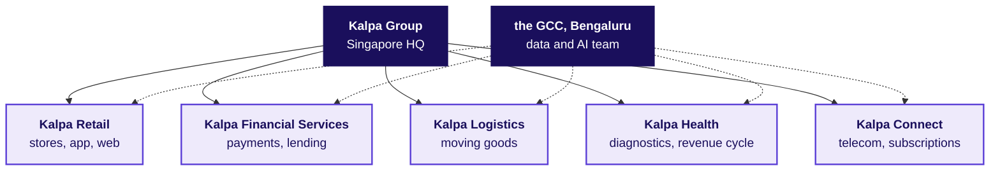
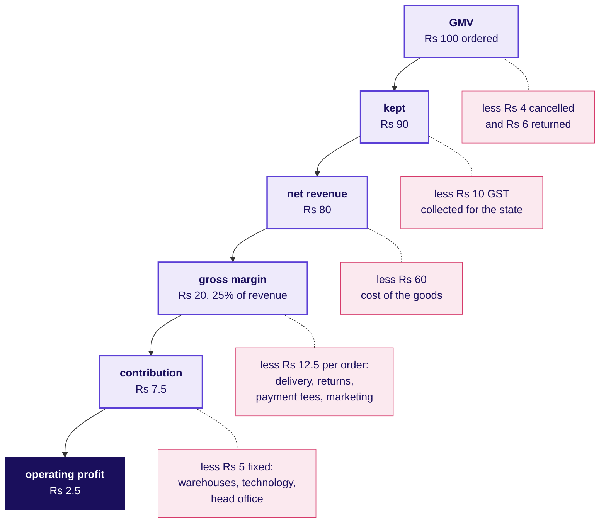
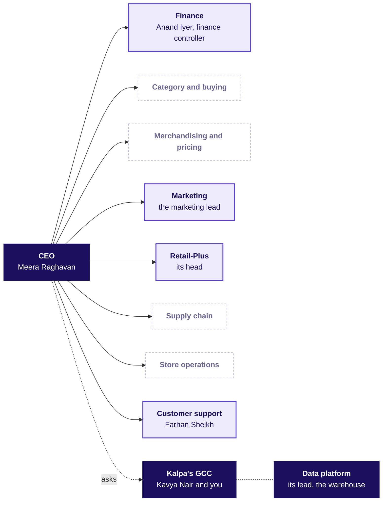
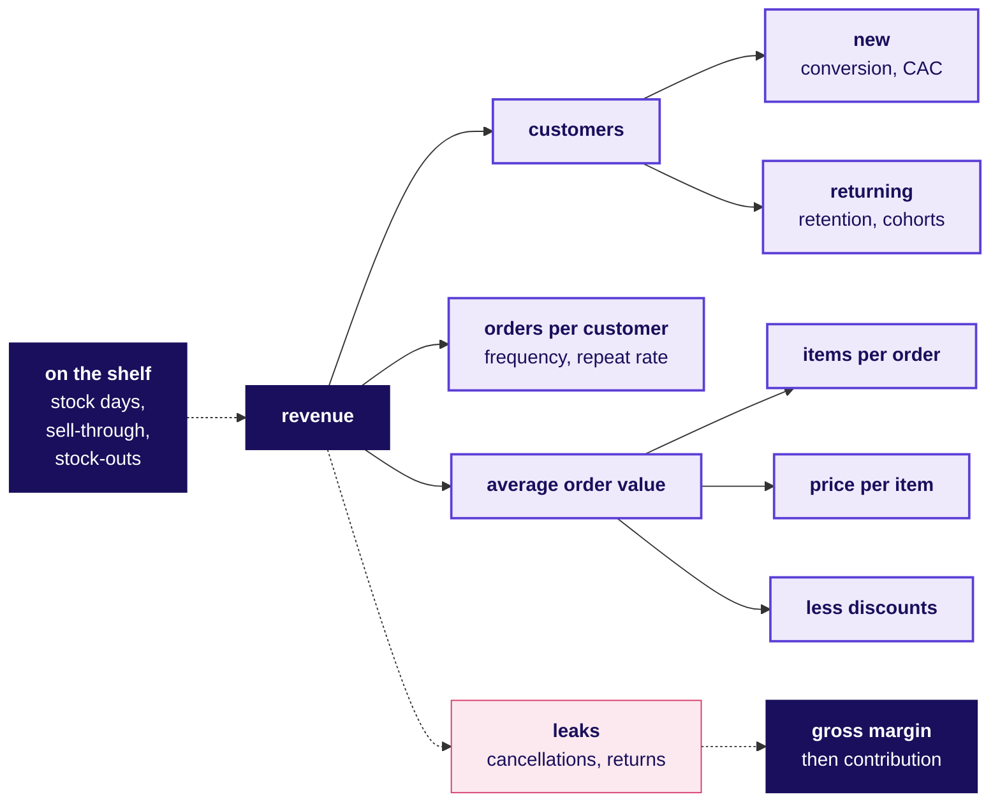

# Kalpa Retail from the inside: how a retailer makes money, who decides, and where data earns its keep

**Week 1, Monday · The domain before the data · Retail and e-commerce, and the real companies Kalpa resembles**

The business you work inside for the next two weeks: which real companies Kalpa is like, how a rupee at the checkout becomes profit, who asks the data team for what, every metric as a formula with a worked number and the trap it hides, and the words a stakeholder meeting assumes you already know.

About a 40 minute read · 16 figures and tables

> Kalpa Group, its people and its numbers are fictional, and any resemblance to a real company is coincidental. The real companies named here are analogies: each fact about them was checked on 30 September 2026 against the source named beside it, and none of them is the model for Kalpa. A number marked illustrative is a round number chosen for easy arithmetic; it is neither Kalpa's data nor any real company's.

---

## 2. Which real company is Kalpa like

In one week a family in Pune can fill the car at a Jio-bp pump, recharge two Jio phone numbers and buy the month's groceries at a Reliance store, and every one of those rupees lands in the same group. Reliance Industries reports its business in those pieces, and for the quarter to 30 June 2026 they included oil to chemicals with 2,221 Jio-bp fuel outlets, Jio's digital services with 533 million subscribers, and Reliance Retail with 20,169 stores (Reliance Industries media release, 17 July 2026). The Tata group works the same way from a different history. It was founded in 1868, runs 31 companies across ten verticals that include consumer and retail, financial services, and telecom and media, and has Tata Sons as the principal investment holding company that promotes them (tata.com, business overview).

Kalpa Group is built like that: one group headquartered in Singapore, five business units, and one engineering and data centre in Bengaluru that serves all five. A conglomerate matters to an analyst for a practical reason. The units share customers, a brand and a data centre, and each is still run and measured on its own numbers, so a metric that is right for Retail can mean nothing in Health.

Each unit has a real-world twin, and each twin teaches one thing you will need when that unit becomes your client.

| Kalpa | Its twin, as an analogy | What the twin teaches |
|---|---|---|
| Kalpa Group | The Tata group; Reliance Industries | Units share a customer and a brand, and each keeps its own books and its own definition of success |
| The GCC in Bengaluru | Walmart Global Tech India, Target in India, Tesco Bengaluru, Lowe's India | An in-house team in India that builds data and technology for a parent's businesses, whose clients are colleagues in other units and countries |
| Kalpa Retail | Store chains such as DMart, Reliance Retail and Trent; marketplaces such as Flipkart and Amazon India; quick commerce such as Blinkit, Zepto and Swiggy Instamart | How money is made from goods on a shelf, goods on a screen and goods delivered in minutes |
| Retail-Plus | Amazon Prime, Flipkart Black, Walmart+ | A paid membership buys frequency, and its health shows in renewals and orders per member |
| Kalpa Financial Services | PhonePe in payments, Tata Capital in lending | A wrong call costs very different amounts in each direction |
| Kalpa Logistics | Ekart, the Flipkart group's logistics arm | The cost of each shipment and of each failed delivery |
| Kalpa Health | Quest Diagnostics and Labcorp in US diagnostics, and revenue-cycle firms such as Omega Healthcare | The same growth question with an insurer standing between the patient and the bill |
| Kalpa Connect | Jio | Subscription economics: revenue per user, churn, and text at telecom scale |

### The GCC: whose team you join

A Global Capability Centre is a company's own team in another country, owned and run by the parent rather than hired from an outsourcing firm. The large retailers' centres in India are the closest real picture of the team you are joining. Walmart Global Tech has teams in Bengaluru, Chennai and Gurugram building engineering and product for Walmart's businesses (Walmart corporate, "Walmart in India"). Target in India is described as an integrated headquarters of the Minneapolis-based company, has operated in India for more than 21 years, and its Bengaluru campus brings together more than 5,700 team members across merchandising, supply chain, stores, digital and marketing (Analytics India Magazine, 29 September 2026). Tesco Bengaluru has served Tesco since 2004 with more than 4,000 colleagues (tescobengaluru.com), and Lowe's India, set up in 2014, has more than 5,000 associates across technology, analytics, finance and shared services (lowes.co.in).

What that means for you on Monday: your stakeholders are internal clients who run a business somewhere else, they judge you by whether their decision improved, and every number you send them is checked by someone senior on your own team first. At Kalpa that someone is Kavya Nair.

### Kalpa Retail, between the shelf and the screen

Kalpa Retail sells consumer goods through its app, its website and its stores across India and South-East Asia. That puts it between three kinds of Indian retailer, and each makes money in a different way.

| Kind of retailer | Real examples, checked | How it makes money | What its data team watches |
|---|---|---|---|
| Store-led chain | DMart, with 500 stores at 31 March 2026 and an "everyday low cost, everyday low price" strategy (DMart results release, 2 May 2026); Reliance Retail, with 20,169 stores (RIL, 17 July 2026); Trent, with 301 Westside and 982 Zudio stores at 30 June 2026 (Business Standard, 7 July 2026) | Buys goods, owns them, sells them from stores at a margin | Footfall, conversion, bill value, like-for-like growth, days of inventory |
| Marketplace | Flipkart, in which Walmart has held about 77 percent since August 2018 (Walmart corporate, 18 August 2018); Amazon India, whose seller terms call amazon.in the Marketplace on which registered sellers sell (sell.amazon.in) | Commissions, fees, advertising and delivery services charged to the sellers who own the goods | GMV, the share of it kept as fees, seller quality, returns |
| Quick commerce | Blinkit, with 2,443 dark stores at the end of June 2026 and a net average order value of Rs 518 (MediaNama on Eternal's results, 24 July 2026); Zepto; Swiggy Instamart | Small baskets from dark stores close to the customer, delivered in minutes | Orders per store per day, basket value, delivery cost per order |

Kalpa Retail owns its stock and its stores like DMart, and it sells through an app like Flipkart, so its data team needs both vocabularies. Section 3 shows that the second half of that sentence raises a question the story leaves open.

### Retail-Plus, the paid tier

Retail-Plus is Kalpa's paid membership, and memberships are how retailers buy frequency. Amazon offers Prime in India from Rs 399 to Rs 1,499 a year (About Amazon India). Flipkart launched Flipkart Black at Rs 1,499 a year in 2025, evolving it from its earlier VIP programme (Flipkart Stories, 12 September 2025). Walmart+ costs $98 a year or $12.95 a month in the United States (NBC Select, updated 25 September 2026). The benefits rhyme: free or faster delivery removes the reason to wait and batch an order, and early access pulls a member into the festive sale first, as Amazon's 24-hour early access for Prime members did before its Great Indian Festival in 2025 (About Amazon India).

The head of Retail-Plus lives on three numbers: how many members renew, how often members order, and whether the fee covers the delivery the tier gives away.

### The other four units, and when they become your client

- **Kalpa Financial Services**, payments and lending, is like PhonePe, which Walmart describes as having more than 520 million registered users, 38 million merchants and more than 230 million transactions a day (Walmart corporate, "Walmart in India"), and like Tata Capital, the Tata group's lending company (tata.com). Its head of risk, Rohan Desai, arrives in Week 5, where a loan that defaults costs far more than a good applicant turned away.
- **Kalpa Logistics** is like Ekart, the Flipkart group's logistics arm, which reaches more than 95 percent of Indian pin codes and is opening its network to other businesses (Business Standard, 28 July 2026). Its stakeholder is not yet named in the story.
- **Kalpa Health** runs diagnostic testing and the revenue cycle behind it for patients in the United States. Its twins are Quest Diagnostics, which says it serves one in three adult Americans and half the physicians and hospitals in the US each year (questdiagnostics.com), Labcorp, with more than 71,000 employees (labcorp.com), and revenue-cycle firms such as Omega Healthcare, whose teams verify insurance, code, bill, fight denied claims and collect payment for US providers (omegahms.com). Its COO, Dr Priya Menon, is your client in Build 1, where the Week 1 and Week 2 method meets a business in which a test booked and the cash collected for it are two different numbers, as a booked order and a collected payment are in retail.
- **Kalpa Connect**, telecom and subscriptions, is like Jio, which reported 533 million customers, an average revenue per user of Rs 215.6 a month and monthly churn of 1.6 percent in the quarter to June 2026 (RIL, 17 July 2026). Its COO, Ananya Bose, brings text problems at telecom scale in Build 3.

---

## 3. How the business makes money

On Saturday a Retail-Plus member places an order on Kalpa's app for four items: a detergent, a shampoo, a pressure cooker and a bedsheet. Their prices add up to Rs 2,000, the member discount takes Rs 200 off, and the checkout shows Rs 1,800. Call it the Saturday basket; it comes back throughout this dossier. Kalpa does not keep Rs 1,800, and the story of where the money goes is the retail profit and loss statement, the P&L.

### From GMV to operating profit

**Gross merchandise value (GMV)** is the value of everything customers ordered, at the prices they were charged, before cancellations and returns and with tax still inside. Andreessen Horowitz defines it as "the total sales dollar volume of merchandise transacting through the marketplace in a specific period" (a16z, "16 Startup Metrics", 2015). Companies differ on the fine print, such as whether discounts or marketplace sellers' sales are included, so the first question about any GMV figure is what it includes.

**Net revenue** is what the business earns after cancellations, returns, the discounts it funded and the GST it collects on behalf of the government. Real companies publish both numbers. Reliance Retail reported gross revenue of Rs 90,408 crore and revenue from operations of Rs 79,745 crore for the same quarter, and Reliance's consolidated statement labels the step between the two as GST recovered (RIL, 17 July 2026). Two correct numbers for one quarter is the normal state of retail, which is why every number you send leaves with its definition beside it.

Below is the journey of Rs 100 of GMV through an illustrative app business shaped like Kalpa's. The amounts are illustrative; the order of the lines is the order every retailer's P&L follows.

**Cost of goods sold (COGS)** is what Kalpa paid suppliers for the goods it sold, with inbound freight. **Gross margin** is net revenue less COGS, and it is the money the merchandise itself earns. The costs below it split in two. Variable costs arrive with every order: picking and packing, last-mile delivery, the payment gateway's fee, handling returns, and the marketing that brought the order. Revenue less COGS less variable costs is **contribution**, the amount each order contributes to paying for everything that does not change with one more order: warehouses and stores, technology, and head office. What is left after those is **operating profit**, before depreciation, interest and tax.

Real retailers keep a thin slice. DMart reported a standalone operating profit (EBITDA) margin of 7.8 percent and a profit-after-tax margin of 4.8 percent on its FY26 revenue of Rs 66,968 crore (DMart results release, 2 May 2026), and Reliance Retail reported an EBITDA margin of 7.9 percent of revenue from operations in the quarter to June 2026 (RIL, 17 July 2026). About five rupees of every hundred survive to the bottom line at DMart, so a five percent price cut that brings no extra volume gives away roughly the whole profit.

### Contribution per order, on the Saturday basket

| Line | Rs, illustrative | What it is |
|---|---|---|
| Charged at checkout | 1,800 | GMV for this order, after the Rs 200 member discount |
| GST inside the price | 200 | Collected for the government, never Kalpa's |
| Net revenue | 1,600 | What Kalpa earns on the order |
| Cost of the four items | 1,200 | COGS |
| Gross margin | 400 | 25 percent of net revenue |
| Picking, packing and last-mile delivery | 120 | Variable |
| Payment gateway fee | 20 | Variable |
| Expected cost of returns | 50 | An average across orders, since most orders keep every item |
| Marketing that brought the order | 60 | Variable |
| Contribution | 150 | 9.4 percent of net revenue, left to pay the fixed costs |

The delivery cost barely changes with the basket's size, which is the whole economics of quick commerce in one line. A Blinkit order averaged Rs 518 in the quarter to June 2026 (MediaNama, 24 July 2026), so the same trip to the door has to be paid for from a much smaller order than the Saturday basket.

### Working capital: who pays for the shelf

A retailer pays for stock before a customer pays for it, and the gap is working capital. Three numbers describe it.

| Measure | Formula | Illustrative |
|---|---|---|
| Days of inventory | Average inventory at cost / COGS per day | Rs 45 lakh / Rs 1 lakh a day = 45 days |
| Days of receivables | Money owed by customers and payment partners / net revenue per day | 2 days, an illustrative settlement lag for card and UPI payments |
| Days of payables | Money owed to suppliers / COGS per day | 60 days, on supplier credit |

The cash conversion cycle is inventory days plus receivable days less payable days: 45 plus 2 less 60 is minus 13 days. At minus 13, suppliers are funding the shelves, and growth releases cash instead of eating it. The same arithmetic warns of the danger: stock that stops selling pushes inventory days past payable days, and the business then borrows to hold goods nobody is buying.

### Three ways to sell, and why foreign-owned e-commerce in India is a marketplace

| | Store-led | Inventory e-commerce | Marketplace |
|---|---|---|---|
| Who owns the goods | The retailer | The retailer | The sellers |
| Revenue booked | The full selling price, net of tax | The full selling price, net of tax | Only the commission and fees |
| The margin that matters | Gross margin, after store costs | Gross margin, after delivery costs | The take rate: fees as a share of GMV |
| Inventory risk | The retailer's | The retailer's | The sellers' |
| Indian example | DMart | Kalpa's app, in the story | Flipkart, Amazon India |

The marketplace column exists in India largely because of one rule. Since 1 February 2019, foreign direct investment has been permitted up to 100 percent in the marketplace model of e-commerce and not permitted in the inventory-based model (DPIIT, Press Note 2 of 2018, dated 26 December 2018). The same press note bars a marketplace from owning or controlling the inventory sold on it, treats a seller as controlled when more than 25 percent of its purchases come from the marketplace or its group companies, and forbids the marketplace from influencing sale prices directly or indirectly. That is why Flipkart, majority-owned by Walmart, and Amazon India run as marketplaces rather than as online shops that own their stock. Press Note 3 of 2026, dated 23 July 2026, opened an inventory model to foreign-owned e-commerce companies only for exporting goods made in India, and left the ban on selling owned stock to Indian consumers in place (EY India tax alert, September 2026). Store chains sit under a separate rule: foreign investment in multi-brand retail is capped at 51 percent with government approval, and such a company may not sell by e-commerce in any form (Consolidated FDI Policy 2020, paragraph 5.2.15.4).

A question the story leaves open: Kalpa Group is headquartered in Singapore and Kalpa Retail sells from stores and an app in India. In the real world the first question would be who owns the Indian retail business, because the answer decides whether it may own stock and sell it online. The story does not settle it and none of the Week 1 or Week 2 cases depends on it. If an interviewer raises it, naming the rule and the question is the right answer.

---

## 4. Who decides what: the org chart and who asks

On Monday morning, before any analysis runs, six people at Kalpa Retail already want something from the data team, and each of them loses something different when a number is wrong. The chart shows the usual shape of an Indian omnichannel retailer, drawn for orientation. The story fixes Kalpa's people; it does not fix every reporting line, so treat the lines as typical and the names as Kalpa's.

The solid boxes have a named person in the story; the dashed ones are real functions whose heads the story has not named, so a pack refers to them by role.

| Role | Owns | Asks the data team | What a wrong number costs them | At Kalpa |
|---|---|---|---|---|
| CEO | The growth plan and where money is spent | Where does growth come from, and where is it leaking? | A budget placed on the wrong branch of the business | Meera Raghavan, whose chief of staff asks for the leadership deck's numbers in Week 2 |
| Finance controller | The books, the monthly close, the audit | Do your numbers match my books, and can my analyst audit how you got them? | A figure restated in front of the board, and an audit finding | Anand Iyer |
| Category and buying | Which products to carry, from whom, on what terms | Which lines to drop, and how much to buy for the festive season? | Dead stock that ties up cash, or empty shelves in the busiest weeks | Not named |
| Merchandising and pricing | Prices, promotions, markdowns, shelf layout | Did the promotion pay for itself? | Margin given away to customers who would have paid full price | Not named |
| Marketing | Acquisition, retention and the customer relationship | Do we need more customers, and did my campaign work? | Spend on customers who would have bought anyway | The marketing lead |
| Retail-Plus | Members, their fees and their renewals | Is my tier the one slipping, and whom do I protect first? | The wrong members protected while the right ones lapse | The head of Retail-Plus |
| Supply chain | Warehouses, replenishment, supplier delivery | How much should go where, and when? | Stock-outs on one side of the city and overstock on the other | Not named |
| Store operations | Stores, staffing, shelf availability, shrinkage | Which stores are really underperforming like for like? | A good store closed on a bad comparison | Not named |
| Customer support | Tickets, resolution time, refunds | How many tickets are coming, why, and can a model draft the replies? | A backlog, or refunds paid that policy did not allow | Farhan Sheikh, from Week 8, with two thousand tickets a day |
| Data platform | The warehouse and its pipelines | Query it, do not export it; tell me before you break it. | One broken pipeline feeds every dashboard in the company | The data platform lead |
| Data and AI team | The analyses and models, and whether they are trusted | Show me the baseline, the evidence, and a second way to reach the number. | Trust, which takes one wrong number to lose | Kavya Nair, the senior analyst, and the trainees |

The tension that runs through Weeks 1 and 2 sits in the middle of this table: marketing is measured on acquisition, finance on whether the books agree, and the data team is often the one saying that the branch someone owns is not the branch that moved.

---

## 5. The metrics, as formulas

Every metric in retail hangs off one tree, and the picture to keep from this section is the metric tree below. Revenue is customers, times orders per customer, times items per order, times price per item, less discounts. The branches under it say how each part is won or lost. The dotted line into it is the precondition, since nothing sells that is not on the shelf, and the dotted line out of it runs through the leaks to the margin that decides whether the revenue was worth having.

The worked numbers below are illustrative and come from one invented month of Kalpa's app in one city: 40,000 customers placed 50,000 orders of four items each, at Rs 450 an item before a 10 percent discount. Each metric carries the trap that most often makes it lie, and the person who will ask you for it.

### The revenue tree

| | |
|---|---|
| Formula | Revenue = customers x orders per customer x items per order x price per item, less discounts |
| Worked | 40,000 x 1.25 x 4 x Rs 450 = Rs 9 crore before discounts; less 10 percent = Rs 8.1 crore |
| The trap | A flat total can hide two branches moving in opposite directions. Twenty percent more customers each ordering a sixth less leaves revenue exactly where it was, since 1.2 x 5/6 = 1, and a report that shows only revenue hides both movements. |
| Who asks | The CEO, first and always |

### Conversion and the funnel

| | |
|---|---|
| Formula | Conversion = orders / visits in the same window; each funnel step is the next stage's count over this stage's |
| Worked | On Saturday, 80,000 app sessions from 50,000 visitors ended in 2,000 orders: 2.5 percent of sessions, 4.0 percent of visitors. Of 8,000 carts, 2,000 became orders, a cart-to-order rate of 25 percent. |
| The trap | A denominator that shifted. An app update that starts a new session after a shorter idle time raises sessions, and conversion falls with no change in buyers. A store's conversion (bills over people through the door) cannot be compared with the app's (orders over sessions). |
| Who asks | Marketing, and the product team that owns the app |

### Average order value and basket size

| | |
|---|---|
| Formula | AOV = revenue / orders; basket size = items / orders |
| Worked | Saturday on the app: Rs 32 lakh / 2,000 orders = Rs 1,600, with 4 items an order. In a store the same idea is the average bill value: Rs 1,250 across 5 items. |
| The trap | An average across segments. Ten household orders of Rs 1,600 and one office order of Rs 40,000 (invented numbers) have a mean of Rs 5,091 and a median of Rs 1,600. AOV also rises when small orders stop, for example after a minimum order for free delivery, with no customer spending more. |
| Who asks | Merchandising, marketing and finance |

### Frequency and repeat rate

| | |
|---|---|
| Formula | Orders per customer = orders / distinct customers who ordered in the window; repeat rate = customers with two or more orders / customers who ordered |
| Worked | In a quarter, 1,00,000 customers placed 1,50,000 orders: 1.5 orders per customer, against 1.25 in a single month. 30,000 of them ordered at least twice, a repeat rate of 30 percent. |
| The trap | The window decides the answer. The same app shows 1.25 orders per customer in a month and 1.5 in a quarter, and a higher repeat rate over a year than over a quarter, so two such rates compare only when their windows match. Dividing by every registered customer instead of those who ordered produces a much smaller, different metric. |
| Who asks | The head of Retail-Plus, and marketing's retention team |

### Retention and cohorts

| | |
|---|---|
| Formula | A cohort is the customers whose first order fell in the same month; retention in month k = cohort customers who ordered in month k / the cohort's starting size |
| Worked | January's cohort of 1,000 new customers: 380 ordered in February (38 percent), 300 in March (30 percent), 260 in April (26 percent). |
| The trap | A denominator that shifted. March's 300 over February's 380 is 79 percent, and a report that calls that retention is dividing by the survivors. Retention always divides by the cohort's starting size, and a one-month-old cohort is never compared with a six-month-old one. |
| Who asks | The head of Retail-Plus, and marketing |

### Customer lifetime value, simply

| | |
|---|---|
| Formula | CLV = contribution per order x orders per year x expected years as a customer |
| Worked | Rs 150 x 6 x 2 = Rs 1,800 |
| The trap | Revenue in place of contribution. The same customer valued on the Rs 1,600 order is worth Rs 19,200, more than ten times the Rs 1,800 they actually contribute, and every acquisition budget sized on it is too large. |
| Who asks | Marketing and finance, whenever an acquisition budget is argued |

### Customer acquisition cost and payback

| | |
|---|---|
| Formula | CAC = acquisition spend / new customers it brought; payback months = CAC / monthly contribution per new customer |
| Worked | If marketing's Rs 12 crore brought 80,000 new customers (an illustrative count), CAC is Rs 1,500. A new customer who orders once every two months at Rs 150 contribution returns Rs 75 a month, so the Rs 1,500 takes 20 months to earn back, and against the CLV of Rs 1,800 above, the margin of safety is Rs 300 a customer. |
| The trap | Blended against paid. Blended CAC divides spend by every new customer, including those who arrived through word of mouth for free; paid CAC counts only those the spend brought (a16z, 2015). Blended makes the spend look cheaper than it is. |
| Who asks | The CEO and the finance controller, before signing the budget |

### Gross margin and contribution margin

| | |
|---|---|
| Formula | Gross margin percent = (net revenue less COGS) / net revenue; contribution = gross margin less variable costs |
| Worked | The Saturday basket: Rs 400 / Rs 1,600 = 25 percent; contribution Rs 150, or 9.4 percent |
| The trap | Averaging percentages. Staples earning 10 percent on Rs 90 lakh and fashion earning 40 percent on Rs 10 lakh average to 25 percent, while the business earns Rs 13 lakh on Rs 1 crore, which is 13 percent. Margin percentages are weighted by revenue before they are combined. |
| Who asks | The finance controller and the category buyers |

### Inventory turns and days of inventory

| | |
|---|---|
| Formula | Inventory turns = COGS for a year / average inventory at cost; days of inventory = average inventory at cost / COGS per day |
| Worked | Home care: average stock of Rs 45 lakh at cost against COGS of Rs 1 lakh a day is 45 days, or about 8 turns a year |
| The trap | Mixing cost and price. Stock counted at selling price and divided by COGS inflates the days. A snapshot taken just before the festive build-up also differs sharply from the average across the year. |
| Who asks | Supply chain, the category buyer, and finance for working capital |

### Sell-through, stock-outs and fill rate

| | |
|---|---|
| Formula | Sell-through = units sold / units received, over a stated period; stock-out rate = product-days with an empty shelf / all product-days; fill rate = units the supplier delivered / units ordered |
| Worked | A festive lighting line: 620 of 1,000 units sold in four weeks, a 62 percent sell-through. Across 5,000 products and 30 days, 6,000 of 1,50,000 product-days had an empty shelf: 4 percent stock-outs. A supplier delivered 900 of 1,000 cases: a 90 percent fill rate. |
| The trap | A sale that never happened leaves no row. A line that sold out on day three shows a perfect sell-through and hides the demand it could not serve, and a system that counts stock in the warehouse can report a product available while the shelf is empty. |
| Who asks | Category buyers, store operations and supply chain |

### Returns rate

| | |
|---|---|
| Formula | Returns rate = units (or orders, or rupees) returned / units delivered, on one stated basis |
| Worked | Of 48,000 delivered orders in a month, 3,360 came back: 7 percent |
| The trap | Returns arrive late. A customer returns in the weeks after delivery, so the current month always looks clean and every past month keeps rising as its returns come in. Two months compare only once both return windows have closed. |
| Who asks | Finance, the fashion category, customer support and logistics |

### Same-store sales, or like-for-like growth

| | |
|---|---|
| Formula | Same-store growth = (this period's sales of stores open in both periods / their sales last period) less 1 |
| Worked | Last year 100 stores sold Rs 500 crore. This year the same 100 sold Rs 510 crore, up 2 percent, while 20 new stores added Rs 65 crore, so total sales grew 15 percent. The honest headline is 2 percent. Real retailers report exactly this: DMart's stores two years and older grew 10.8 percent in the quarter to March 2026 (DMart, 2 May 2026), and Reliance Retail's grocery business grew 7 percent like for like in the quarter to June 2026 (RIL, 17 July 2026). |
| The trap | The calendar and the tax. Diwali fell on 20 and 21 October in 2025 (by state) and falls on 8 November in 2026, which moves festive sales between months and quarters. GST on many everyday goods, such as shampoo and toilet soap, fell to 5 percent from 22 September 2025 (GST Council, 3 September 2025), so a comparison that straddles that date mixes a price change into a sales change. |
| Who asks | The CEO, store operations and every investor |

---

## 6. The domain language

A stakeholder meeting assumes these words. Each is defined in plain language and then used the way someone at Kalpa would use it; the numbers in those sentences are illustrative.

| Term | In plain words | Said in a meeting |
|---|---|---|
| SKU | A stock keeping unit: one sellable version of a product, so a shampoo in two sizes is two SKUs | "Home care carries 1,200 SKUs, and 200 of them sell less than one unit a week per store." |
| GMV | Gross merchandise value: everything ordered, at the price charged, before cancellations and returns | "GMV grew 12 percent, and after returns and GST, net revenue grew 8." |
| Net revenue | What the business earns after cancellations, returns, funded discounts and tax | "Finance reports net revenue, so reconcile to that, not to GMV." |
| AOV and ABV | Average order value online and average bill value in a store: revenue over orders or bills | "The app's AOV is Rs 1,600 and the store's ABV is Rs 1,250, on different baskets." |
| MRP | Maximum retail price: the most a packaged item may legally be sold for, inclusive of all taxes | "We can sell below MRP on the app, never above it." |
| Markdown | A permanent price cut to clear stock that is not selling | "Take the festive lights down 30 percent before they become next year's problem." |
| COGS | Cost of goods sold: what we paid suppliers for what we sold | "Margin moved because COGS rose, not because we discounted more." |
| Gross margin | Net revenue less COGS, often as a percent of net revenue | "Fashion carries a 40 percent gross margin and staples about 10." |
| Contribution margin | Gross margin less the costs that come with each order | "The quick orders are contribution-negative once delivery is paid." |
| Take rate | A marketplace's fees as a share of the GMV sold through it | "A 15 percent take rate on Rs 100 crore of GMV is Rs 15 crore of revenue." |
| Shrinkage | Stock lost to theft, damage or error, found when the count falls short of the books | "Shrinkage was half a percent of sales, twice last year's." |
| Planogram | The diagram that says which product goes on which shelf, in which place | "The new planogram moved detergents to eye level; check sales by shelf position." |
| Assortment | The range of products a store or category carries | "Cut the assortment by a tenth and keep the lines that bring people in." |
| Private label | A retailer's own brand, usually at a higher margin than national brands | "Our private label rice earns twice the margin of the brand beside it." |
| Footfall | People who walk into a store, counted at the door | "Footfall fell on Saturday, but conversion rose, so sales held." |
| Conversion | The share of visits that end in a purchase | "App conversion is 2.5 percent of sessions." |
| Basket size | Items per order, also called units per transaction | "Bundles lifted basket size from four items to five." |
| Dark store | A small warehouse in a neighbourhood that serves only online orders, closed to walk-in shoppers | "Quick commerce runs on dark stores within a few kilometres of the customer." |
| Last mile | The final leg of delivery, from the local hub to the customer's door | "Our last-mile cost per order is what fast delivery really costs us." |
| Cash on delivery | Paying the delivery person when the parcel arrives | "Check whether the parcels refused at the door are mostly COD before we change the payment options." |
| RTO | Return to origin: a parcel that goes back to the seller undelivered, often a refused COD order | "RTO costs us two trips and earns nothing." |
| Fill rate | The share of an order a supplier actually delivered | "The supplier's fill rate fell to 90 percent, and that is our stock-out." |
| Stock-out | A product that is not on the shelf when a customer wants it | "Stock-outs hide in sales data, because a missed sale leaves no row." |
| Sell-through | Units sold over units received, for a line over a period | "At 62 percent sell-through in four weeks, the lights need a markdown plan." |
| Days of inventory | How many days current stock would last at the current rate of sale | "Home care holds 45 days of inventory against 60 days of supplier credit." |
| Replenishment | Reordering stock so the shelf is refilled before it empties | "Replenishment runs nightly from the day's sales." |
| Like-for-like | Growth measured only on stores open in both periods; also same-store sales | "Total sales grew 15 percent, like-for-like 2." |
| Cohort | Customers grouped by when they first bought, followed over time | "The January cohort retained 26 percent by April." |
| Churn | Customers or members who stop buying or do not renew, as a share of the base | "Retail-Plus churn is the number its head asks about first." |
| CAC | Customer acquisition cost: marketing spend over the new customers it brought | "At a Rs 1,500 CAC, payback takes 20 months." |
| CLV | Customer lifetime value: the contribution a customer brings over their time with us | "Value customers on contribution; CLV on revenue flatters every campaign." |
| Omnichannel | One customer served across store, app and web as one relationship | "An omnichannel customer can buy online and return in the store." |
