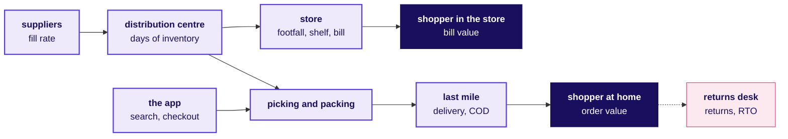
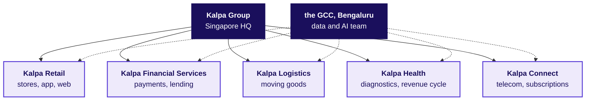
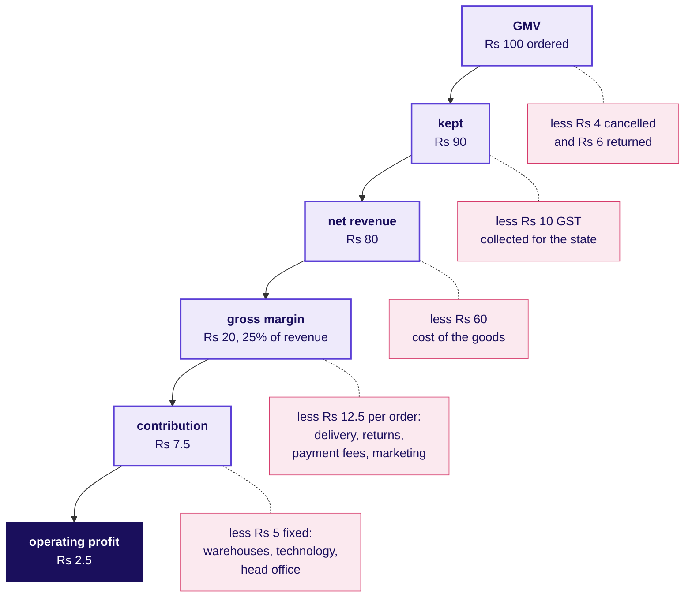
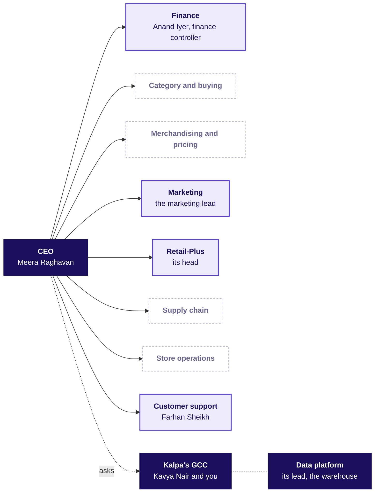
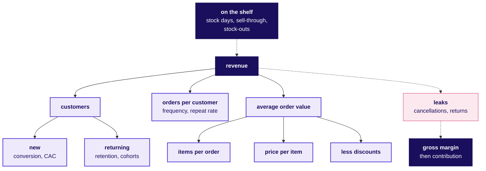
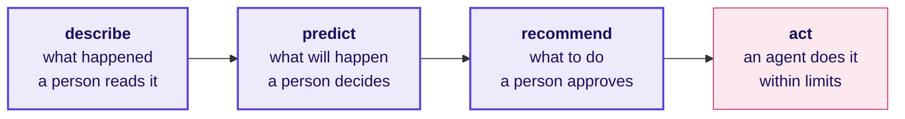

# Kalpa Retail from the inside: how a retailer makes money, who decides, and where data earns its keep

**Week 1, Monday · The domain before the data · Retail and e-commerce, and the real companies Kalpa resembles**

The business you work inside for the next two weeks: which real companies Kalpa is like, how a rupee at the checkout becomes profit, who asks the data team for what, every metric as a formula with a worked number and the trap it hides, and the words a stakeholder meeting assumes you know.

About a 40 minute read · 6 diagrams and 32 tables

> Kalpa Group, its people and its numbers are fictional, and any resemblance to a real company is coincidental. The real companies named here are analogies: each fact about them was checked on 30 September 2026 against the source named beside it, and none of them is the model for Kalpa. A number marked illustrative is a round number chosen for easy arithmetic; it is neither Kalpa's data nor any real company's.

---

## 1. A day in the life of a retailer

One Saturday at one Kalpa Retail store and on Kalpa's app in the same city. Every role and number in the rest of this dossier appears here first. Three numbers are the story's own: revenue grew 4 percent last year against a plan of 15, marketing wants Rs 12 crore to acquire customers, and the support team answers two thousand tickets a day. Every other number is illustrative.

**Before the shutters go up**, the store manager checks each shelf against its planogram, the drawing of what goes where. One check in twenty-five finds a product missing, a stock-out rate of 4 percent, and last month's stock count came up half a percent of sales short, which is shrinkage. The distribution centre's truck brings the replenishment ordered from yesterday's sales, but the cookware supplier sent only 900 of the 1,000 cases ordered, a fill rate of 90 percent, so pressure cookers will run short by Sunday.

**By mid-morning** the store is full. Across the day 1,200 people come through the doors and 480 of them pay at a till, a conversion of 40 percent, with an average bill of Rs 1,250 across five items. A family doing the month's shopping fills two trolleys; a student buys one bottle of shampoo.

**On the app** the same Saturday, 50,000 people open it 80,000 times. A shopper types "pressure cooker 3 litre" into search, and the order in which the results appear shapes what gets bought. Carts are filled 8,000 times and 2,000 orders are placed, at an average of Rs 1,600 for four items. One of them is the Saturday basket: a Retail-Plus member orders a detergent, a shampoo, a pressure cooker and a bedsheet, Rs 2,000 of goods, takes the member discount of Rs 200 and pays Rs 1,800 with a card the app holds only as a token.

**At the distribution centre** pickers pull and pack the app orders, and the Saturday basket leaves in a van for the last mile. Another parcel, ordered cash on delivery, is refused at the door and starts back as an RTO, a return to origin that cost two trips and earned nothing.

**The category buyer for home care** spends the afternoon on two numbers. The category holds 45 days of inventory against 60 days of supplier credit, and the festive lighting line has sold 620 of its 1,000 units in four weeks, a 62 percent sell-through, with Diwali still ahead. A markdown now gives away margin; waiting risks carrying the stock into January.

**At the returns desk** a shopper brings back a mixer bought on the app, and next week the Saturday basket's bedsheet will come back the same way, because its colour differed from the picture. Of every 100 app orders delivered, 7 come back. Elsewhere, the support team led by Farhan Sheikh answers two thousand tickets a day, most of them asking where an order is, when a refund will land or why a payment failed.

**At head office** the marketing lead is finishing the case for Rs 12 crore to acquire new customers, and the head of Retail-Plus is reading the month's renewals.

**After the store closes**, finance closes the week. The finance controller, Anand Iyer, has his team walk the week's gross merchandise value down through cancellations, returns and GST to net revenue, and the data team's dashboard has to agree with his books. At month end the same team will report the app's month in this city: 40,000 customers placed 50,000 orders of four items each, at Rs 450 an item before a 10 percent discount.

**On Monday** the CEO, Meera Raghavan, reads one page: revenue grew 4 percent last year against a plan of 15, marketing wants Rs 12 crore, and she wants to know where growth comes from and where it is leaking before she signs anything. That is the question the next two weeks answer.

| Number | What it is | Where it returns |
|---|---|---|
| 1,200 people, 480 bills, Rs 1,250 across 5 items | The store's Saturday: footfall, paying customers, average bill | Section 5 |
| 80,000 sessions, 50,000 visitors, 8,000 carts, 2,000 orders at Rs 1,600 | The app's Saturday funnel and average order | Section 5 |
| Rs 2,000, less Rs 200, is Rs 1,800 | The Saturday basket: price, member discount, charged | Sections 3, 5, 7 and 10 |
| 4 percent, half a percent, 900 of 1,000 | Stock-outs, shrinkage and the supplier's fill rate | Sections 5 and 6 |
| 45 days, 60 days, 620 of 1,000 | Days of inventory, supplier credit, festive sell-through | Sections 3, 5 and 10 |
| 7 in 100 | Delivered app orders that come back | Section 5 |
| 40,000 customers, 50,000 orders, Rs 450, 10 percent | The app's month in one city | Section 5 |
| Rs 12 crore; 4 percent against 15; two thousand tickets a day | The story's own numbers | Sections 4, 5 and 8 |

---

## 2. Which real company is Kalpa like

In one week a family in Pune can fill the car at a Jio-bp pump, recharge two Jio phone numbers and buy the month's groceries at a Reliance store, and every one of those rupees lands in the same group. For the quarter to 30 June 2026, Reliance Industries reported oil to chemicals with 2,221 Jio-bp fuel outlets, Jio with 533 million subscribers, and Reliance Retail with 20,169 stores (Reliance Industries media release, 17 July 2026). The Tata group works the same way from a different history: founded in 1868, it runs 31 companies across ten verticals, including consumer and retail, financial services, and telecom and media, with Tata Sons as the principal investment holding company that promotes them (tata.com, business overview).

Kalpa Group is built like that: one group headquartered in Singapore, five business units, and one engineering and data centre in Bengaluru that serves all five. For an analyst the point is practical. The units share customers, a brand and a data centre, and each is still run and measured on its own numbers, so a metric that is right for Retail can mean nothing in Health.

| Kalpa | Its twin, as an analogy | What the twin teaches |
|---|---|---|
| Kalpa Group | The Tata group; Reliance Industries | Units share a customer and a brand, and each keeps its own books |
| The GCC in Bengaluru | Walmart Global Tech India, Target in India, Tesco Bengaluru, Lowe's India | A parent's own team in India, whose clients are colleagues in other units and countries |
| Kalpa Retail | DMart, Reliance Retail and Trent in stores; Flipkart and Amazon India as marketplaces; Blinkit, Zepto and Swiggy Instamart in quick commerce | How money is made from goods on a shelf, on a screen and delivered in minutes |
| Retail-Plus | Amazon Prime, Flipkart Black, Walmart+ | A paid membership buys frequency |
| Kalpa Financial Services | PhonePe in payments, Tata Capital in lending | A wrong call costs very different amounts in each direction |
| Kalpa Logistics | Ekart, the Flipkart group's logistics arm | The cost of each shipment and each failed delivery |
| Kalpa Health | Quest Diagnostics and Labcorp in US diagnostics; revenue-cycle firms such as Omega Healthcare | The growth question with an insurer between the patient and the bill |
| Kalpa Connect | Jio | Revenue per user, churn, and text at telecom scale |

### The GCC: whose team you join

A Global Capability Centre is a company's own team in another country, and the Indian centres of global retailers are the closest real picture of yours. Walmart Global Tech has teams in Bengaluru, Chennai and Gurugram building engineering and product for Walmart's businesses (Walmart corporate, "Walmart in India"). Target in India, described as an integrated headquarters of the Minneapolis company, has operated in India for more than 21 years and brings more than 5,700 team members together on its Bengaluru campus (Analytics India Magazine, 29 September 2026). Tesco Bengaluru has served Tesco since 2004 with more than 4,000 colleagues (tescobengaluru.com), and Lowe's India, set up in 2014, has more than 5,000 associates across technology, analytics, finance and shared services (lowes.co.in).

What it means for you: your stakeholders are internal clients who run a business elsewhere, they judge you by whether their decision improved, and every number you send them is checked by someone senior on your own team first. At Kalpa that is Kavya Nair.

### Kalpa Retail, between the shelf and the screen

Kalpa Retail sells consumer goods through its app, its website and its stores across India and South-East Asia, which puts it between three kinds of Indian retailer.

| Kind of retailer | Real examples, checked | How it makes money | What its data team watches |
|---|---|---|---|
| Store-led chain | DMart, with 500 stores at 31 March 2026 and an "everyday low cost, everyday low price" strategy (DMart results release, 2 May 2026); Reliance Retail, with 20,169 stores (RIL, 17 July 2026); Trent, with 301 Westside and 982 Zudio stores at 30 June 2026 (Business Standard, 7 July 2026) | Buys goods and sells them from its stores at a margin | Footfall, conversion, bill value, like-for-like growth, days of inventory |
| Marketplace | Flipkart, about 77 percent owned by Walmart since August 2018 (Walmart corporate, 18 August 2018); Amazon India, whose seller terms call amazon.in the Marketplace on which registered sellers sell (sell.amazon.in) | Commissions, fees, advertising and delivery services charged to sellers who own the goods | GMV, the share kept as fees, seller quality, returns |
| Quick commerce | Blinkit, with 2,443 dark stores at the end of June 2026 and a net average order value of Rs 518 (MediaNama on Eternal's results, 24 July 2026); Zepto; Swiggy Instamart | Small baskets delivered in minutes from dark stores near the customer | Orders per store per day, basket value, delivery cost per order |

Kalpa Retail owns its stock and stores like DMart and sells through an app like Flipkart, so its data team needs both vocabularies. Section 3 shows that the app half raises a question the story leaves open.

### Retail-Plus, the paid tier

Memberships are how retailers buy frequency. Amazon offers Prime in India from Rs 399 to Rs 1,499 a year (About Amazon India), Flipkart launched Flipkart Black at Rs 1,499 a year in 2025, evolving it from its VIP programme (Flipkart Stories, 12 September 2025), and Walmart+ costs $98 a year or $12.95 a month in the United States (NBC Select, updated 25 September 2026). Free or faster delivery removes the reason to wait and batch an order, and early access pulls members into a sale first, as Amazon's 24-hour early access for Prime members did before its Great Indian Festival in 2025 (About Amazon India). The head of Retail-Plus lives on three numbers: how many members renew, how often they order, and whether the fee covers the delivery the tier gives away.

### The other four units, and when they become your client

- **Kalpa Financial Services** is like PhonePe, with more than 520 million registered users and 230 million transactions a day by Walmart's count (Walmart corporate, "Walmart in India"), and Tata Capital in lending (tata.com). Rohan Desai, its head of risk, arrives in Week 5 with loans where a default costs twenty times a wrongful rejection.
- **Kalpa Logistics** is like Ekart, the Flipkart group's logistics arm, which reaches more than 95 percent of Indian pin codes (Business Standard, 28 July 2026); its stakeholder is not yet named.
- **Kalpa Health** runs diagnostic testing, and the revenue cycle behind it, for patients in the United States, like Quest Diagnostics, which says it serves one in three adult Americans each year (questdiagnostics.com), and Labcorp, with more than 71,000 employees (labcorp.com). Revenue-cycle firms such as Omega Healthcare verify insurance, code, bill, fight denied claims and collect for US providers (omegahms.com). Dr Priya Menon, its COO, is your client in Build 1, where a test booked and the cash collected for it are two different numbers.
- **Kalpa Connect** is like Jio: 533 million customers, an average revenue per user of Rs 215.6 a month and monthly churn of 1.6 percent in the quarter to June 2026 (RIL, 17 July 2026). Ananya Bose, its COO, brings text problems at telecom scale in Build 3.

---

## 3. How the business makes money

At the checkout the Saturday basket shows Rs 1,800: four items worth Rs 2,000 at their prices, less the Rs 200 member discount. Kalpa does not keep Rs 1,800, and where the money goes is the retail profit and loss statement, the P&L.

### From GMV to operating profit

**Gross merchandise value (GMV)** is the value of everything customers ordered, at the prices charged, before cancellations and returns and with tax still inside. Andreessen Horowitz defines it as "the total sales dollar volume of merchandise transacting through the marketplace in a specific period" (a16z, "16 Startup Metrics", 2015). Companies differ on whether discounts or marketplace sellers' sales are included, so the first question about any GMV is what it includes.

**Net revenue** is what the business earns after cancellations, returns, the discounts it funded and the GST it collects for the government. Real retailers publish both numbers: Reliance Retail reported gross revenue of Rs 90,408 crore and revenue from operations of Rs 79,745 crore for the same quarter, and Reliance's consolidated statement labels the step between the two as GST recovered (RIL, 17 July 2026). Two correct numbers for one quarter is normal in retail, which is why every number you send carries its definition.

Below is the journey of Rs 100 of GMV through an illustrative app business shaped like Kalpa's. The amounts are illustrative; the order of the lines is the order every retailer's P&L follows.

**Cost of goods sold (COGS)** is what Kalpa paid suppliers for the goods it sold, and **gross margin** is net revenue less COGS. Variable costs come with every order: picking and packing, last-mile delivery, the payment fee, handling returns, and the marketing that brought the order. Gross margin less variable costs is **contribution**, what each order adds towards the costs that do not change with one more order: stores and warehouses, technology, head office. What remains is **operating profit**, before depreciation, interest and tax.

Real retailers keep a thin slice. DMart reported a standalone operating profit (EBITDA) margin of 7.8 percent and a profit-after-tax margin of 4.8 percent on FY26 revenue of Rs 66,968 crore (DMart results release, 2 May 2026), and Reliance Retail an EBITDA margin of 7.9 percent of revenue from operations in the quarter to June 2026 (RIL, 17 July 2026). About five rupees in every hundred reach DMart's bottom line, so a five percent price cut that brings no extra volume gives away roughly the whole profit.

### Contribution per order, on the Saturday basket

| Line | Rs, illustrative | What it is |
|---|---|---|
| Charged at checkout | 1,800 | GMV for this order, after the member discount |
| GST inside the price | 200 | Collected for the government |
| Net revenue | 1,600 | What Kalpa earns on the order |
| Cost of the four items | 1,200 | COGS |
| Gross margin | 400 | 25 percent of net revenue |
| Picking, packing and last-mile delivery | 120 | Variable |
| Payment gateway fee | 20 | Variable |
| Expected cost of returns | 50 | An average, since most orders keep every item |
| Marketing that brought the order | 60 | Variable |
| Contribution | 150 | 9.4 percent of net revenue, left to pay the fixed costs |

The trip to the door costs about the same whatever is in the bag, so a small basket carries the same delivery cost from far less margin. A Blinkit order averaged Rs 518 in the quarter to June 2026 (MediaNama, 24 July 2026), about a third of the Saturday basket's value.

### Working capital: who pays for the shelf

A retailer pays for stock before a customer pays for it, and the gap is working capital.

| Measure | Formula | Illustrative |
|---|---|---|
| Days of inventory | Average inventory at cost / COGS per day | Rs 45 lakh / Rs 1 lakh a day = 45 days |
| Days of receivables | Money owed by customers and payment partners / net revenue per day | 2 days, an illustrative lag for card and UPI settlement |
| Days of payables | Money owed to suppliers / COGS per day | 60 days of supplier credit |

The cash conversion cycle is inventory days plus receivable days less payable days: 45 plus 2 less 60 is minus 13 days. At minus 13, suppliers fund the shelves and growth releases cash. Stock that stops selling reverses it, pushing inventory days past payable days until the business borrows to hold goods nobody is buying.

### Three ways to sell, and why foreign-owned e-commerce in India is a marketplace

| | Store-led | Inventory e-commerce | Marketplace |
|---|---|---|---|
| Who owns the goods | The retailer | The retailer | The sellers |
| Revenue booked | The full selling price, net of tax | The full selling price, net of tax | Only the commission and fees |
| The margin that matters | Gross margin, after store costs | Gross margin, after delivery costs | The take rate: fees as a share of GMV |
| Inventory risk | The retailer's | The retailer's | The sellers' |
| Indian example | DMart | Kalpa's app, in the story | Flipkart, Amazon India |

The marketplace column exists in India largely because of one rule. Since 1 February 2019, foreign direct investment has been permitted up to 100 percent in the marketplace model of e-commerce and not permitted in the inventory-based model (DPIIT, Press Note 2 of 2018, dated 26 December 2018). The press note bars a marketplace from owning or controlling the inventory sold on it, treats a seller as controlled when more than 25 percent of its purchases come from the marketplace or its group companies, and forbids the marketplace to influence sale prices. That is why Flipkart, majority-owned by Walmart, and Amazon India run as marketplaces. Press Note 3 of 2026, dated 23 July 2026, opened an inventory model to foreign-owned e-commerce companies only for exporting goods made in India, and left the ban on selling owned stock to Indian consumers in place (EY India tax alert, September 2026). Store chains sit under a separate rule: foreign investment in multi-brand retail is capped at 51 percent with government approval, and such a company may not sell by e-commerce in any form (Consolidated FDI Policy 2020, paragraph 5.2.15.4).

A question the story leaves open: Kalpa Group is headquartered in Singapore and Kalpa Retail sells from stores and an app in India. In the real world the first question would be who owns the Indian retail business, because the answer decides whether it may own stock and sell it online. The story does not settle it, and no Week 1 or Week 2 case depends on it; if an interviewer raises it, naming the rule and the question is the right answer.

---

## 4. Who decides what: the org chart and who asks

On Monday morning, before any analysis runs, several people at Kalpa Retail already want something from the data team, and each loses something different when a number is wrong. The chart shows the usual shape of an Indian omnichannel retailer, drawn for orientation: the story fixes Kalpa's people, not every reporting line.

Solid boxes have a named person in the story; dashed ones are real functions whose heads the story has not named, so a pack refers to them by role.

| Role | Owns | Asks the data team | What a wrong number costs them | At Kalpa |
|---|---|---|---|---|
| CEO | The growth plan and where money is spent | Where does growth come from, and where is it leaking? | A budget placed on the wrong branch of the business | Meera Raghavan, whose chief of staff asks for the leadership deck's numbers in Week 2 |
| Finance controller | The books, the monthly close, the audit | Do your numbers match my books, and can my analyst audit how you got them? | A figure restated in front of the board | Anand Iyer |
| Category and buying | Which products to carry, from whom, on what terms | Which lines to drop, and how much to buy for the festive season? | Dead stock that ties up cash, or empty shelves in the busiest weeks | Not named |
| Merchandising and pricing | Prices, promotions, markdowns, shelf layout | Did the promotion pay for itself? | Margin given to customers who would have paid full price | Not named |
| Marketing | Acquisition, retention, the customer relationship | Do we need more customers, and did my campaign work? | Spend on customers who would have bought anyway | The marketing lead |
| Retail-Plus | Members, their fees and renewals | Is my tier the one slipping, and whom do I protect first? | The wrong members protected while the right ones lapse | The head of Retail-Plus |
| Supply chain | Warehouses, replenishment, supplier delivery | How much should go where, and when? | Stock-outs in one store and overstock in the next | Not named |
| Store operations | Stores, staffing, shelf availability, shrinkage | Which stores really underperform like for like? | A good store closed on a bad comparison | Not named |
| Customer support | Tickets, resolution time, refunds | How many tickets are coming, why, and can a model draft the replies? | A backlog, or refunds that policy did not allow | Farhan Sheikh, from Week 8, with two thousand tickets a day |
| Data platform | The warehouse and its pipelines | Query it, do not export it; tell me before you break it. | One broken pipeline feeds every dashboard | The data platform lead |
| Data and AI team | The analyses and models, and whether they are trusted | Show me the baseline, the evidence, and a second way to reach the number. | Trust, which one wrong number can lose | Kavya Nair, the senior analyst, and the trainees |

The tension that runs through Weeks 1 and 2 sits in the middle of this table: marketing is measured on acquisition, finance on whether the books agree, and the data team is often the one saying that the branch someone owns is not the branch that moved.

---

## 5. The metrics, as formulas

Every retail metric hangs off one tree, and the picture to keep from this dossier is this metric tree. Revenue is customers, times orders per customer, times items per order, times price per item, less discounts. The branches say how each part is won or lost. The dotted line above revenue is the precondition, since nothing sells that is not on the shelf, and the dotted line to its right runs through the leaks to the margin that decides whether the revenue was worth having.

The worked numbers come from section 1's illustrative Saturday and month. Each metric carries the trap that most often makes it lie, and the person who will ask you for it.

### The revenue tree

| | |
|---|---|
| Formula | Revenue = customers x orders per customer x items per order x price per item, less discounts |
| Worked | 40,000 x 1.25 x 4 x Rs 450 = Rs 9 crore before discounts; less 10 percent, Rs 8.1 crore |
| The trap | A flat total can hide two branches moving in opposite directions. Twenty percent more customers each ordering a sixth less leaves revenue where it was, since 1.2 x 5/6 = 1, and a report showing only revenue hides both. |
| Who asks | The CEO, first and always |

### Conversion and the funnel

| | |
|---|---|
| Formula | Conversion = orders / visits in the same window; each funnel step is the next stage's count over this stage's |
| Worked | 80,000 sessions from 50,000 visitors ended in 2,000 orders: 2.5 percent of sessions, 4.0 percent of visitors. Of 8,000 carts, 2,000 became orders, 25 percent. |
| The trap | A denominator that shifted. An app update that starts a new session after a shorter idle time raises sessions, and conversion falls with no change in buyers. A store's conversion (bills over people through the door) never compares with the app's (orders over sessions). |
| Who asks | Marketing, and the team that owns the app |

### Average order value and basket size

| | |
|---|---|
| Formula | AOV = revenue / orders; basket size = items / orders |
| Worked | The app's Saturday: Rs 32 lakh / 2,000 orders = Rs 1,600, with 4 items an order. In the store the same idea is the average bill: Rs 1,250 across 5 items. |
| The trap | An average across segments. Ten household orders of Rs 1,600 and one office order of Rs 40,000 (invented numbers) have a mean of Rs 5,091 and a median of Rs 1,600. AOV also rises when small orders stop, after a minimum order for free delivery, with no customer spending more. |
| Who asks | Merchandising, marketing and finance |

### Frequency and repeat rate

| | |
|---|---|
| Formula | Orders per customer = orders / distinct customers who ordered in the window; repeat rate = customers with two or more orders / customers who ordered |
| Worked | In a quarter, 1,00,000 customers placed 1,50,000 orders: 1.5 orders per customer, against 1.25 in a single month. 30,000 ordered at least twice: a repeat rate of 30 percent. |
| The trap | The window decides the answer. The same app shows 1.25 orders per customer in a month and 1.5 in a quarter, so two rates compare only over matching windows. Dividing by every registered customer instead of those who ordered gives a different, much smaller metric. |
| Who asks | The head of Retail-Plus, and marketing's retention team |

### Retention and cohorts

| | |
|---|---|
| Formula | A cohort is the customers whose first order fell in the same month; retention in month k = cohort customers who ordered in month k / the cohort's starting size |
| Worked | January's cohort of 1,000: 380 ordered in February (38 percent), 300 in March (30 percent), 260 in April (26 percent). |
| The trap | A denominator that shifted. March's 300 over February's 380 is 79 percent, and a report calling that retention is dividing by the survivors. Retention divides by the cohort's starting size, and a one-month-old cohort is never compared with a six-month-old one. |
| Who asks | The head of Retail-Plus, and marketing |

### Customer lifetime value, simply

| | |
|---|---|
| Formula | CLV = contribution per order x orders per year x expected years as a customer |
| Worked | Rs 150 x 6 x 2 = Rs 1,800 |
| The trap | Revenue in place of contribution. Valued on the Rs 1,600 order, the same customer is worth Rs 19,200, more than ten times the Rs 1,800 they contribute, and every budget sized on it is too large. |
| Who asks | Marketing and finance, whenever an acquisition budget is argued |

### Customer acquisition cost and payback

| | |
|---|---|
| Formula | CAC = acquisition spend / new customers it brought; payback months = CAC / monthly contribution per new customer |
| Worked | If marketing's Rs 12 crore brought 80,000 new customers (an illustrative count), CAC is Rs 1,500. A customer ordering once every two months at Rs 150 contribution returns Rs 75 a month, so payback takes 20 months, and against the CLV of Rs 1,800 the margin of safety is Rs 300 a customer. |
| The trap | Blended against paid. Blended CAC divides spend by every new customer, including those who came through word of mouth for free; paid CAC counts only those the spend brought (a16z, 2015). Blended makes the spend look cheaper. |
| Who asks | The CEO and the finance controller, before signing the budget |

### Gross margin and contribution margin

| | |
|---|---|
| Formula | Gross margin percent = (net revenue less COGS) / net revenue; contribution = gross margin less variable costs |
| Worked | The Saturday basket: Rs 400 / Rs 1,600 = 25 percent; contribution Rs 150, or 9.4 percent |
| The trap | Averaging percentages. Staples at 10 percent on Rs 90 lakh and fashion at 40 percent on Rs 10 lakh average to 25 percent, while the business earns Rs 13 lakh on Rs 1 crore: 13 percent. Margins are weighted by revenue before they are combined. |
| Who asks | The finance controller and the category buyers |

### Inventory turns and days of inventory

| | |
|---|---|
| Formula | Turns = COGS for a year / average inventory at cost; days of inventory = average inventory at cost / COGS per day |
| Worked | Home care: Rs 45 lakh of stock at cost against COGS of Rs 1 lakh a day is 45 days, about 8 turns a year |
| The trap | Mixing cost and price. Stock valued at selling price and divided by COGS inflates the days, and a snapshot taken just before the festive build-up differs sharply from the year's average. |
| Who asks | Supply chain, the category buyer, and finance for working capital |

### Sell-through, stock-outs and fill rate

| | |
|---|---|
| Formula | Sell-through = units sold / units received, over a stated period; stock-out rate = product-days with an empty shelf / all product-days; fill rate = units a supplier delivered / units ordered |
| Worked | Festive lights: 620 of 1,000 units sold in four weeks, 62 percent. Across 5,000 products and 30 days, 6,000 of 1,50,000 product-days had an empty shelf: 4 percent. A supplier delivered 900 of 1,000 cases: 90 percent. |
| The trap | A sale that never happened leaves no row. A line that sold out on day three shows a perfect sell-through and hides the demand it could not serve, and a system counting warehouse stock can call a product available while its shelf is empty. |
| Who asks | Category buyers, store operations and supply chain |

### Returns rate

| | |
|---|---|
| Formula | Returns rate = units (or orders, or rupees) returned / units delivered, on one stated basis |
| Worked | Of 48,000 delivered orders in a month, 3,360 came back: 7 percent |
| The trap | Returns arrive late. The current month always looks clean and every past month keeps rising as its returns come in, so two months compare only once both return windows have closed. |
| Who asks | Finance, the fashion category, customer support and logistics |

### Same-store sales, or like-for-like growth

| | |
|---|---|
| Formula | Same-store growth = this period's sales of stores open in both periods / their sales last period, less 1 |
| Worked | Last year 100 stores sold Rs 500 crore; this year the same 100 sold Rs 510 crore, up 2 percent, and 20 new stores added Rs 65 crore, so total sales grew 15 percent. The honest headline is 2 percent. DMart reports the same idea: its stores two years and older grew 10.8 percent in the quarter to March 2026 (DMart, 2 May 2026), and Reliance Retail's grocery business grew 7 percent like for like in the quarter to June 2026 (RIL, 17 July 2026). |
| The trap | The calendar and the tax. Diwali fell on 20 and 21 October in 2025, by state, and falls on 8 November in 2026, which moves festive sales between months and quarters. GST on everyday goods such as shampoo and toilet soap fell to 5 percent from 22 September 2025 (GST Council, 3 September 2025), so a comparison straddling that date mixes a price change into a sales change. |
| Who asks | The CEO, store operations and every investor |

---

## 6. The domain language

A stakeholder meeting assumes these words. Each is defined in plain language and then used as someone at Kalpa would use it; the numbers in those sentences are illustrative.

| Term | In plain words | Said in a meeting |
|---|---|---|
| SKU | A stock keeping unit: one sellable version of a product, such as one size | "A shampoo in two sizes is two SKUs, and home care carries 1,200 of them." |
| GMV | Gross merchandise value: all orders at the price charged, before returns | "GMV grew 12 percent; after returns and GST, net revenue grew 8." |
| Net revenue | Earned after cancellations, returns, funded discounts and tax | "Finance reports net revenue, so reconcile to that." |
| AOV and ABV | Revenue per order online (AOV) or per bill in a store (ABV) | "The app's AOV is Rs 1,600 and the store's ABV is Rs 1,250, on different baskets." |
| MRP | Maximum retail price: the legal ceiling for a packaged item, taxes included | "We can sell below MRP on the app, never above it." |
| Markdown | A permanent price cut to clear stock that is not selling | "Take the festive lights down 30 percent before they become next year's problem." |
| COGS | Cost of goods sold: what we paid suppliers for what we sold | "Margin moved because COGS rose; we did not discount more." |
| Gross margin | Net revenue less COGS, often as a percent of net revenue | "Fashion carries a 40 percent gross margin and staples about 10." |
| Contribution margin | Gross margin less the costs that come with each order | "The small quick orders are contribution-negative once delivery is paid." |
| Take rate | A marketplace's fees as a share of the GMV sold through it | "A 15 percent take rate on Rs 100 crore of GMV is Rs 15 crore of revenue." |
| Shrinkage | Stock lost to theft, damage or error, found when the count falls short of the books | "Shrinkage was half a percent of sales, twice last year's." |
| Planogram | The diagram that says which product goes on which shelf, in which place | "The new planogram moved detergents to eye level; check sales by shelf position." |
| Assortment | The range of products a store or category carries | "Cut the assortment by a tenth and keep the lines that bring people in." |
| Private label | A retailer's own brand, usually at a higher margin than national brands | "Our private label rice earns twice the margin of the brand beside it." |
| Footfall | People who walk into a store, counted at the door | "Footfall fell on Saturday, conversion rose, and sales held." |
| Conversion | The share of visits that end in a purchase | "App conversion is 2.5 percent of sessions." |
| Basket size | Items per order, also called units per transaction | "Bundles lifted basket size from four items to five." |
| Dark store | A small neighbourhood warehouse that serves only online orders | "Quick commerce runs on dark stores a short ride from the customer." |
| Last mile | The final leg of delivery, from the local hub to the door | "Our last-mile cost per order is what fast delivery really costs us." |
| Cash on delivery | Paying the delivery person when the parcel arrives | "Check whether the parcels refused at the door are mostly COD before we change payment options." |
| RTO | Return to origin: a parcel that goes back undelivered, often a refused COD order | "RTO costs us two trips and earns nothing." |
| Fill rate | The share of an order a supplier actually delivered | "The supplier's fill rate fell to 90 percent, and that is our stock-out." |
| Stock-out | A product that is not on the shelf when a customer wants it | "Stock-outs hide in sales data, because a missed sale leaves no row." |
| Sell-through | Units sold over units received, for a line over a period | "At 62 percent sell-through in four weeks, the lights need a markdown plan." |
| Days of inventory | How many days current stock lasts at the current rate of sale | "Home care holds 45 days of inventory against 60 days of supplier credit." |
| Replenishment | Reordering stock so the shelf is refilled before it empties | "Replenishment runs nightly from the day's sales." |
| Like-for-like | Growth measured only on stores open in both periods; also same-store sales | "Total sales grew 15 percent, like-for-like 2." |
| Cohort | Customers grouped by when they first bought, followed over time | "The January cohort retained 26 percent by April." |
| Churn | Customers or members who stop buying or do not renew, as a share of the base | "Retail-Plus churn is the number its head asks about first." |
| CAC | Customer acquisition cost: marketing spend over the new customers it brought | "At a Rs 1,500 CAC, payback takes 20 months." |
| CLV | Customer lifetime value: the contribution a customer brings over their time with us | "Value customers on contribution; CLV on revenue flatters every campaign." |
| Omnichannel | One customer served across store, app and web as one relationship | "An omnichannel customer can buy online and return in the store." |

---

## 7. Compliance and the rules the data team works under

The Saturday basket passed through six sets of rules on its way to the door: the tax invoice, the MRP on the shampoo, the product page's declarations, the member's consent, the card kept as a token, and the ownership rule behind the app. The right-hand column is what an analyst or an AI system answers for.

| Rule, and what it requires | What it means for an analyst or an AI system |
|---|---|
| **GST and the tax invoice.** Every sale carries a tax invoice with the seller's GSTIN, a serial number unique for the year, the HSN code, taxable value, tax rate and amount, and place of supply (Rule 46, CGST Rules; TaxGuru, 8 February 2025). E-invoices are required above Rs 5 crore of turnover from 1 August 2023 (Notification 10/2023-Central Tax); a marketplace collects 0.5 percent tax at source on its sellers' sales from 10 July 2024 (Notification 15/2024-Central Tax); most goods sit at 5 or 18 percent from 22 September 2025 (GST Council, 3 September 2025). | Every revenue column says whether GST is inside it, and finance reconciles to the invoice. A comparison straddling 22 September 2025 mixes a tax change into a price change. |
| **Legal Metrology (Packaged Commodities) Rules 2011.** Every pre-packaged item shows its MRP "inclusive of all taxes", its unit sale price, its maker and a consumer-care contact (rule 6); nobody may sell above the retail sale price (rule 18(2)); an e-commerce entity shows the same declarations, except the manufacture date, on the product page (rule 6(10), since 1 January 2018). | A pricing model or agent is capped at MRP, because a price above it is an offence rather than an experiment. Model-written catalogue text keeps every declaration. |
| **Consumer Protection (E-Commerce) Rules 2020** (G.S.R. 462(E), 23 July 2020). Complaints are acknowledged within forty-eight hours and resolved within a month (4(5)); no cancellation charge unless the platform bears similar charges (4(8)); consent by explicit action, never a pre-ticked box (4(9)); no price manipulation for unreasonable profit and no discrimination between consumers of the same class (4(11)); a marketplace explains the main parameters that rank goods and sellers (5(3)(f)); sellers state the country of origin (6(5)(d)). | A support bot's turnaround is a legal clock. Different prices for similar customers need legal review first. A ranking model must be explainable in plain words. |
| **Guidelines for Prevention and Regulation of Dark Patterns 2023**, issued by the Central Consumer Protection Authority on 30 November 2023: 13 specified patterns, including false urgency, basket sneaking, drip pricing, and bait and switch (PIB, 8 December 2023). | A test that wins by slipping an item into the basket or running a fake countdown is a dark pattern, and a model writing offers must not invent urgency. |
| **Digital Personal Data Protection Act 2023 and Rules 2025.** The Rules were notified on 14 November 2025 with an eighteen-month phase-in: a consent notice naming the specific purpose, use only for lawful and specific purposes, prompt notice of a breach to those affected, verifiable parental consent for a child's data, and penalties of up to Rs 250 crore for failing to keep reasonable security safeguards and Rs 200 crore for failing to report a breach (PIB explainer, 17 November 2025). | Data collected to deliver a parcel is not automatically free to train a model. Analysis tables carry member IDs rather than names and phone numbers, a deletion request reaches the warehouse, notebooks and feature tables, and a single view of a customer needs a purpose. |
| **RBI card-on-file tokenisation.** Only card issuers and networks may store the actual card number; merchants hold a token and may keep the last four digits and the issuer's name for reconciliation (RBI/2021-22/96, 7 September 2021; in force from 1 October 2022 after two extensions, BusinessToday, 24 June 2022). | No payments table holds a full card number; reconciliation joins on the token, or on the last four digits with the issuer. |
| **PCI DSS**, the card industry's security standard for anyone who stores, processes or transmits card data. Version 4.0.1, published 11 June 2024, has been the only supported version since 31 December 2024, with its new requirements in force from 31 March 2025 (PCI Security Standards Council blog). | Card data stays out of analytics environments, logs and model inputs. |
| **FDI policy on e-commerce.** Marketplace only, for foreign-owned e-commerce selling to Indian consumers (section 3). | A marketplace must not steer its sellers' prices, so a pricing model built there advises sellers rather than deciding for them. |

**For a GCC serving a US retailer**, the customer's rights travel with the data. California's privacy law lets a resident ask what personal information a business holds, have it deleted or corrected, stop its sale or sharing (including through a global privacy control signal), and limit the use of sensitive personal information (California Attorney General, CCPA page). The state's privacy agency adopted rules on automated decision-making technology that took effect on 1 January 2026, and a business using it for significant decisions meets their notice, opt-out and access duties from 1 January 2027 (CPPA announcement, 23 September 2025). PCI DSS covers a US retailer's card data exactly as it does in India, and a deletion request made in California has to reach the copy in a Bengaluru notebook.

None of this makes an analyst a lawyer. It says which questions go to the legal team before a model ships: which data, for which purpose, with whose consent, at what price, and ranked by what rule.

---

## 8. Where analytics, ML, NLP and agents earn their keep

On Saturday a person made every decision: the manager counted shelves, the buyer weighed the markdown, an agent answered each ticket. Each technique below takes over part of a decision, and the further right it sits on this ladder, the less a person checks before the decision takes effect, so the more a wrong answer costs.

| Where it earns | The problem, and why the technique | How it works, in outline | Value measured by | What it costs when wrong |
|---|---|---|---|---|
| Descriptive analytics: the Monday numbers | Leaders decide weekly on what happened, by branch | Governed SQL on the warehouse, one definition per metric | Decisions taken on it, and no restatements | A board decision on a wrong number |
| Demand forecasting and replenishment | Stock must reach the right store before the customer, across thousands of products | Forecast each product's daily sales per store from history, calendar, price and promotions, baselines first; order the forecast plus safety stock for the lead time | Forecast error against a naive baseline, stock-outs, days of inventory | Cash tied in stock that ends in markdowns, or empty shelves and sales that leave no row |
| Pricing and markdowns | The price that clears a line at the best margin before the season ends | Estimate how demand responds to price from past price changes, then simulate markdown paths | Margin against held-out stores or products | Margin given to customers who would have paid, or stock left over; above MRP, an offence |
| Assortment | Which products each store carries in limited shelf space | Group stores by what their customers buy; measure what each product adds against what it takes from its neighbours | Sales and margin per metre of shelf | Delisting the product that brings a customer in for the whole basket |
| Recommendations and search ranking | A shopper cannot see thousands of products, so the order shown decides what is found | Learn from purchases and clicks which items go together, and rank by predicted relevance and chance of purchase. Amazon's Rufus, a generative-AI shopping assistant trained on its catalogue and information from the web, has been open to all its India customers since November 2024 (About Amazon India, 20 November 2024). | Incremental margin in a holdout test, rather than clicks | Items shoppers do not want or cannot get, and a ranking the platform cannot explain |
| Churn and retention scores | Knowing which members will lapse before they do | Classify each customer's chance of not ordering in the next ninety days from recency, frequency, spend and service history | Members kept per rupee of offer, against an untreated group | An offer to someone who was never leaving, or silence to someone who was |
| Fraud and returns abuse | Stolen payments and return schemes hide among honest orders | Rules for the obvious, then anomaly and classification models on payments, accounts, devices and return histories | Losses prevented against good customers blocked | A real customer turned away, or a fraudster paid, at very different costs |
| Customer support at scale, where NLP and GenAI enter | Two thousand tickets a day, most of them repetitive | Classify each ticket's intent, retrieve the relevant policy, draft a reply for a person to approve, route the rest | Resolution time, repeat contacts, satisfaction, cost per resolved ticket | A confident wrong answer about a refund, repeated at scale |
| Catalogue enrichment | New products arrive with thin, inconsistent descriptions | Extract attributes from supplier sheets and photos, and write consistent descriptions with a model, checked against the mandatory declarations | Search success, and "not as described" returns | An invented attribute that becomes a return, as the bedsheet did |
| Agents that act | Replenishment, refunds and buyers' questions wait in queues for a person | A replenishment agent drafts purchase orders within limits; a support agent refunds when a case fits the policy; a merchandising copilot writes, runs and shows the query behind a buyer's question | Cases resolved without a person, reversals, time saved | Money moved by software: an order outside limits, a refund the policy never allowed, a fluent answer on a wrong join |

Two public cases show both ends of the ladder. Klarna's AI assistant handled two-thirds of its customer-service chats in its first month, the work of 700 full-time agents, and cut the time to resolve an errand from 11 minutes to under 2 (Klarna press release, 27 February 2024); fifteen months later its chief executive said the focus on cost had produced lower quality and that customers would always be able to reach a human (Fortune, 9 May 2025, from an interview with Bloomberg). When Air Canada's website chatbot described a bereavement-fare refund the airline did not offer, a Canadian tribunal held the airline responsible, since "it makes no difference whether the information comes from a static page or a chatbot" (Moffatt v. Air Canada, 2024 BCCRT 149, as reported by McCarthy Tétrault). An agent that issues refunds is only as safe as its policy and the limits around it.

---

## 9. The common technical problems, with their options

Seven problems reach every retail data team, and each has more than one honest answer, chosen by rows, cost, time and the accuracy the decision needs. Sizes are illustrative.

**Two revenue numbers that disagree**, the dashboard's and the finance controller's, for the same quarter.

| Option | How to size it |
|---|---|
| Bridge the two: start from finance's figure and explain each difference, from definition and timing to duplicates, tax and cancellations | A day on a quarter's orders; exact once it balances |
| One governed definition in the warehouse, which every dashboard reads | Weeks of platform work; prevents the next disagreement |
| Both numbers shown, each with its definition | An hour; honest, and leaves the argument open |

Best fit for Kalpa: the bridge first, since finance will not act until the numbers match, then the governed definition. What would change it: a gap inside rounding and timing, where the labelled pair is enough.

**A metric that moved for a boring reason.**

| Option | How to size it |
|---|---|
| Align the calendar: same weekdays, festival-aligned weeks, and tax changes such as 22 September 2025 marked | Minutes |
| Check the plumbing: a tracking change, late data, a definition changed in a dashboard release | An hour with the platform team |
| Check the mix: channel, segment, and new against old stores, before reading behaviour into the change | An hour of queries |

Best fit: all three, cheapest first, before any hypothesis about customers. What would change it: a move inside the usual week-to-week variation, which needs no explanation.

**Forecasting a promotion week.**

| Option | How to size it |
|---|---|
| Last year's promotion week, scaled by this year's growth | An hour; fails when the promotion changes |
| A normal-week baseline plus the uplift of past promotions of similar depth | Days; tested on past promotions held out |
| A machine-learning model on product-store-day history with price, promotion and calendar features | 50 stores x 5,000 products x 730 days is about 18 crore rows, weeks of work, and enough past promotions per product to learn from |

Best fit: baseline plus uplift at category level, split down to products, because each product has seen few comparable promotions. What would change it: years of similar promotions per product. A stock-out and an overstock cost different amounts, so the error is judged in rupees.

**Deduplicating customers across app and store.**

| Option | How to size it |
|---|---|
| Exact match on a verified phone number or email | Cheap; misses customers who gave neither at the till |
| Probabilistic match on name, address and phone similarity, with a threshold and a review queue | Comparisons grow with the square of the records, so candidates are grouped by pin code or phone first |
| The member ID or phone number asked for at the till | Fixes the future, not the past |

Best fit: the exact match plus capture at the till, with the probabilistic match only for reporting on reviewed samples. What would change it: merged records that trigger offers or credit, where a false merge of two people's histories and consents costs more than a missed one. The data protection law's purpose rule applies to the join itself.

**Attributing a sale to a campaign.**

| Option | How to size it |
|---|---|
| Last touch: the campaign clicked last gets the credit | Free; says who touched the sale |
| Rules that split credit across the first, last or every touch | Free; still says who touched it |
| An incrementality test: hold out a random group of customers or cities | Costs the sales the holdout might have made; says what the campaign added |

Best fit: a holdout for any campaign that argues for budget, and last touch for daily reporting, labelled as such. What would change it: a campaign nobody can be withheld from, where matched cities before and after are the fallback.

**Measuring a discount's effect fairly.**

| Option | How to size it |
|---|---|
| Discount weeks against the weeks before | Free, and confounded by the season |
| Customers who used the discount against those who did not | Free, and biased, since takers differ from non-takers |
| A randomised holdout that does not get the offer | Costs the offer's reach in the holdout; the cleanest answer |
| Similar stores or cities with and without it, before and after | Needs comparable groups and a stated caveat |

Best fit: a randomised holdout for the next campaign, and a matched comparison with its caveat for one already run. What would change it: a discount that must reach every member, where a launch staggered by city creates the comparison.

**Answering "why did revenue fall".**

| Option | How to size it |
|---|---|
| The investigation ladder by hand: is the fall real, is the comparison like for like, which branch moved, in which segment, which hypothesis the next data would settle | A day and a handful of queries |
| An automated drill-down ranking the dimensions that contributed most | Fast, and noisy without the ladder's discipline |
| An experiment or natural comparison testing the lead hypothesis | Weeks, before money moves |

Best fit: the ladder every time, the tool once the question recurs weekly, and the test before a budget changes. What would change it: a fall inside normal variation, where the answer stops at the ladder's first rung.

---

## 10. Relatable examples, converted

Five scenes most learners have lived through, each turned into its metrics and the data and AI problem hidden inside it.

| The scene | Its metrics and formulas | The data and AI problem hidden in it |
|---|---|---|
| A DMart-style weekend rush: queues at every till, trolleys full, the favourite brand of rice gone by evening | Conversion = bills / footfall; bill value = sales / bills; items per bill; stock-outs by hour | Forecasting footfall by hour to open tills and refill fast movers, and a denominator trap: a family of four is four through the door and one bill |
| A delivery promised in minutes from a dark store nearby | Orders per dark store per day; average order value, Rs 518 at Blinkit in the quarter to June 2026 (MediaNama); delivery cost per order; contribution per order | Placing each product in the right dark store by forecast, and a speed promise weighed against riders' safety: in January 2026 the quick-commerce platforms dropped "10-minute" from their branding after a government intervention (All India Radio News, 13 January 2026) |
| A festive sale, such as Flipkart's Big Billion Days or Amazon's Great Indian Festival, with early access for members | GMV; discount depth; sell-through; returns that arrive weeks later; sales pulled forward from the weeks after | Separating sales the event added from sales it only moved earlier, and forecasting its demand from few comparable events |
| A membership renewal: the reminder that Retail-Plus renews next week | Renewal rate = members renewing / members due; orders per member against orders per non-member; fee revenue against delivery given away | Members were heavier buyers before they joined, so comparing them with non-members overstates what the membership caused; a churn score decides who gets a renewal offer |
| A return: the Saturday basket's bedsheet goes back because the colour differs from the picture | Returns rate = returned / delivered; reverse-logistics cost; the order's contribution after the refund | "Not as described" returns trace back to catalogue data, abuse hides among honest returns, and a refund agent must act within the policy |

---

## 11. Interview questions this domain asks

Tags: [S] staple, asked everywhere; [F] frequent in GCC and product screens; [D] design. The answers belong in the day packs.

1. [S] How does a retailer make money, and why is a marketplace's GMV not its revenue?
2. [S] Define average order value, conversion and repeat rate, and say what each is divided by.
3. [S] Sales grew 15 percent this year; what do you check before calling it growth?
4. [F] A category earns a 30 percent gross margin and loses money on every order; how can both be true, and what do you recommend?
5. [F] What is CAC payback, and why does blended CAC make a campaign look cheaper than it was?
6. [F] How would you forecast demand for a festive-sale week, and how would you know the forecast was good enough?
7. [F] Returns rose after an app release; walk me through how you investigate.
8. [D] Design a support agent that can issue refunds within a policy: what may it do alone, what must it escalate, and how do you measure it?
9. [D] Build one view of each customer across the app and the stores under India's data protection law: what do you build, and what do you refuse to build?
10. [D] Your recommendation model lifted clicks 8 percent; how do you show it lifted profit?

---

## 12. Go deeper

A reading path, in order, each source checked on the date shown.

| Order | What | Time | Why this one |
|---|---|---|---|
| 1 | Reliance Industries, media release for the quarter to 30 June 2026, the Reliance Retail pages, https://www.ril.com/sites/default/files/2026-07/Media_Release_RIL_Q1_FY2026-27_Financial_and_Operational_Performance.pdf (verified 30 Sep 2026) | 20 minutes | Gross revenue against revenue from operations, stores and like-for-like growth by basket, in a real retailer's own words |
| 2 | Avenue Supermarts (DMart), results press release of 2 May 2026, https://api.dmartindia.com/corporate/content/file/v1/2/R2aWBiIpiuD39xgfm4wrqQKc1777723315/Press%20release%20dated%202nd%20May,%202026 (verified 30 Sep 2026) | 10 minutes | A store chain's margins, and growth measured on stores two years and older |
| 3 | Andreessen Horowitz, "16 Startup Metrics", https://a16z.com/16-startup-metrics/ (verified 30 Sep 2026) | 20 minutes | GMV against revenue, blended against paid CAC, and retention by cohort |
| 4 | DPIIT, Press Note 2 (2018 Series) on FDI in e-commerce, https://www.dpiit.gov.in/static/uploads/2025/07/2959b696766693441f5eb45d3eb49f97.pdf (verified 30 Sep 2026) | 15 minutes | The marketplace rule in the government's own text |
| 5 | Consumer Protection (E-Commerce) Rules 2020, full text at IBC Laws, https://ibclaw.in/consumer-protection-e-commerce-rules-2020/ (verified 30 Sep 2026) | 20 minutes | What a platform owes a customer, including the duty to explain its ranking |
| 6 | PIB explainer, "DPDP Rules, 2025 Notified", https://static.pib.gov.in/WriteReadData/specificdocs/documents/2025/nov/doc20251117695301.pdf (verified 30 Sep 2026) | 15 minutes | Consent, purpose, breach notice and penalties in plain language |
| 7 | RBI circular on card-on-file tokenisation, 7 September 2021, https://rbi.org.in/Scripts/NotificationUser.aspx?Id=12159&Mode=0 (verified 30 Sep 2026) | 10 minutes | Why a payments table holds tokens and last four digits |
| 8 | Klarna press release on its AI assistant, 27 February 2024, https://www.klarna.com/international/press/klarna-ai-assistant-handles-two-thirds-of-customer-service-chats-in-its-first-month/ (verified 30 Sep 2026), then Fortune, 9 May 2025, https://fortune.com/2025/05/09/klarna-ai-humans-return-on-investment/ (verified 30 Sep 2026) | 15 minutes | A support agent's measured gain, and the cost its maker found later |
| 9 | Think School, "How Dmart's BUSINESS STRATEGY made Radhakishan Damani the Retail King of India?", https://www.youtube.com/watch?v=B5txS_lC1yY (verified 30 Sep 2026) | Length not verified | A video walk through a store chain's low-cost model, to hold against item 2's numbers |
