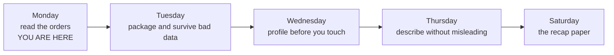
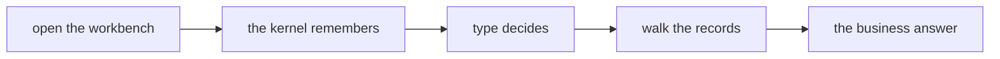

# Study notes: from setup to a first business answer

Week 1, Day 1. Read these after the session, with your notebook open beside them.

A notebook is a workbench that remembers what you put on it, and a dataset is a stack of named cards you walk through one at a time, so today you walk the stack and come back with a number a business person would accept.

---

## 0. The world these orders live in

Every order you handled today belongs to Kalpa Retail, which is one of the five business units of
Kalpa Group, and the Kalpa Retail order book is the dataset this programme returns to for the next
nineteen weeks. The fields you read today, `order_id`, `segment`, `amount`, `status` and
`order_date`, are the same fields that arrive tomorrow as a file, come back in Week 2 as Postgres
tables and as pandas columns, and are still there when the modelling weeks start. Nothing about the
scenario changes underneath you. What changes is the tool you point at it.

Kalpa Group is fictional. Any resemblance to a real company is coincidental.

## 1. The map, and where today sat on it

The week's terrain, with today marked. It fills up one column per teaching day, so by Saturday you
are looking at the whole pipeline rather than at five separate lessons.



Today's own five stops, which the deck repeated at every section boundary:



| Where it sits | What Monday covered | Status |
|---|---|---|
| Phase 1, read and clean data | The environment, kernel state, types, loops, conditions, accumulators, lists and dictionaries | Worked, with your own hands on the keys |
| Phase 1, read and clean data | Functions, files, profiling, statistics | Named as coming, not touched |
| Phase 2 onwards | SQL, pandas, models, retrieval | Mentioned once, so you know the same records return |

The coverage line: Monday worked eight of the nine subtopics on its row and mentioned the ninth,
negative indexing, in one beat without an exercise behind it.

**The outcome tie.** The moment inside the programme's terminal outcome this feeds is the one where
you are handed a file nobody prepared and asked what it says. Everything today was the first half of
that moment: getting the records into a shape you can walk, and getting a number back out.

**What was left out.** Functions and files, which are Tuesday, and everything that needs an `import`.
The nearest thing today did not cover is what happens when the conversion fails rather than
succeeding, and that arrives tomorrow morning as `ValueError`.

You walked that line from left to right in one day. The first three stops were the first half and
they were about the machine, and the last two stops were the second half and they were about the
data. Everything the rest of the week adds is bolted onto the right-hand end of that same line.

## 2. The answer you were shown before anything was explained

The day opened with a question nobody had prepared you for: "Of these thirty Kalpa Retail orders,
how much did we actually collect?" A notebook ran on screen and answered it: 13 delivered orders,
totalling Rs 25,720.

The four lines that produced it are the lines you wrote yourself by the end of the day.

```
total = 0
for r in records:
    if r["status"] == "delivered":
        total = total + int(r["amount"])
```

That cell is worth reading again now that you know what every line does, because tomorrow starts by
running it against a file.

## 3. The Codespace and the layout

A Codespace is a computer that GitHub runs for you and shows you inside a browser tab, with VS Code,
Python and this repository already on it. Nothing is installed on your laptop and nothing needs to
be, and the Codespace you opened today is the environment for the whole programme.

| Part of the screen | What it is for |
|---|---|
| The explorer down the left | It lists the files in the repository, and today's notebook is one of them. |
| The editor in the middle | It holds the notebook, one cell under another, with a run button on the left of each cell. |
| The output under a cell | It shows what that cell produced, and it stays there until you run the cell again. |
| The kernel indicator at the top right | It names the Python that is running your cells. |
| The terminal panel at the bottom | It is a shell on the same machine, and you had no reason to open it today. |

## 4. Cells, the kernel, and what a restart erases

The kernel is a workbench. Running a cell puts something on the bench, and the bench keeps it for as
long as the kernel is running. Restarting the kernel sweeps the bench clean and touches nothing on
disk, so your file is exactly as you left it and only the state is gone.

That split is the thing to hold on to. The notebook file and the kernel state are two different
things that live in two different places, and almost every confusing morning in a notebook comes
from treating them as one.

The kernel also has no opinion about where a cell sits on your screen. It sees the order you clicked
run in, and nothing else. The number in square brackets to the left of a cell counts the runs the
kernel has done, so it is the only honest record of what happened.

```
[2]  records = [ ... ]
[3]  count = 0
[1]  for r in records:
```

The cell at the bottom of that screen ran first. When an output surprises you, read the counters
before you read the code.

## 5. Out of order, and the recovery drill

```
NameError: name 'records' is not defined
```

You ran the counting cell before the setup cell, so the name `records` was never put on the bench and
the kernel had nothing to hand your loop. The message names the exact word it went looking for, which
is the most useful thing in it.

The recovery is two moves and it costs you seconds. Restart the kernel, then run all cells from the
top. The file on disk never changed, so the cells put the state straight back. Do this on purpose
whenever you are unsure what the bench is holding, because guessing takes longer than the drill.

## 6. The four types, and type()

| Type | What it holds | An example from today |
|---|---|---|
| `str` | It holds text of any kind, including text made only of digits. | The order id `"KR4224"` and the status `"delivered"`. |
| `int` | It holds a whole number you can do arithmetic with. | The amount `1460`. |
| `float` | It holds a number with a decimal part. | A value such as `1460.5`. |
| `bool` | It holds `True` or `False`, which is what every comparison hands back. | The result of `2395 > 2000`. |

`type()` is the question you ask a value when an operator behaves in a way you did not expect.

```
type("4500")        <class 'str'>
type(4500)          <class 'int'>
type(4500.0)        <class 'float'>
type(4500 > 2000)   <class 'bool'>
```

Ask before you edit. Changing code to fix a value whose type you never checked is how a short problem
becomes a long one.

## 7. Comparisons, and the record that stopped the loop

Comparison operators hand back a `bool`, and the `if` statement reads that `bool` and nothing else.

```
2395 > 2000                   True
2395 >= 2395                  True
"delivered" == "delivered"    True
"delivered" != "returned"     True
```

`if`, `elif` and `else` are tried from the top, and Python stops at the first condition that is
`True`.

```
amount = 1460
if amount > 2000:
    band = "large"
elif amount > 1500:
    band = "medium"
else:
    band = "small"
```

Here `band` holds `"small"`, because 1460 failed both of the tests above it.

**The break.** One record in the file wears quotes where the others do not.

```
{"order_id": "KR4200", "segment": "Retail-Core", "amount": "4500", "status": "returned", "order_date": "2026-08-03"}
```

Compare that amount with a number and the loop stops on the first card in the file.

```
TypeError: '>' not supported between instances of 'str' and 'int'
```

Python was asked whether a piece of text is greater than a number, and it refused and named both
types it was holding. A spreadsheet would have placed that value somewhere in the sort order and
shown you a number with no warning attached to it. You lost ten seconds and you kept the truth.

**The fix, at the point of use.** `int()` takes a value and hands back the whole number it stands
for, and you put the call where the comparison happens.

```
if int(r["amount"]) > 2000:
```

The record on the bench still holds text, and the comparison still gets a number. Today `int()` is a
converter and nothing more. What it does when a value refuses to convert is tomorrow's business, and
tomorrow opens on exactly that.

## 8. Loops, conditions and accumulators

A loop deals you one card at a time and calls it `r`. Thirty records means thirty turns through the
indented lines.

The count accumulator is set to zero once, above the loop, and each card that passes the condition
adds one to it.

```
count = 0
for r in records:
    if r["status"] == "delivered":
        count = count + 1

print(count)
```

```
13
```

The sum accumulator has the same shape with the amount going in where the one was.

```
total = 0
for r in records:
    if r["status"] == "delivered":
        total = total + int(r["amount"])

print(total)
```

```
25720
```

That is 13 delivered orders totalling Rs 25,720, which is the number the notebook handed you at the
start of the day.

**The drill you did in the middle of the block.** This cell runs cleanly and prints a number.

```
for r in records:
    if r["status"] == "delivered":
        total = 0
        total = total + int(r["amount"])

print(total)
```

```
1460
```

`total = 0` sits inside the loop, so it runs again on every delivered card and wipes out whatever the
last card left there. At the end, `total` holds the amount of KR4224, the last delivered order in the
file, and Rs 1,460 is a total of nothing at all. The repair is to move that one line above the `for`,
with no indent.

This failure is more dangerous than the `TypeError`, because it stopped nothing and named nothing. A
`TypeError` costs you a minute and cannot be ignored, and a plausible wrong number can travel all the
way to a slide. The check that catches it in your head is that a total over a group of orders can
never be smaller than the largest single order in that group. The largest delivered order here is
Rs 2,880, so Rs 1,460 was impossible before you read a line of the code.

## 9. The guided build

The question was how many of the thirty orders are above Rs 2,000 and what those orders add up to.
The cell grew one line at a time, broke in the middle on KR4200, and finished like this.

```
count = 0
total = 0
for r in records:
    if int(r["amount"]) > 2000:
        count = count + 1
        total = total + int(r["amount"])

print(count, total)
```

```
13 35020
```

13 orders are above Rs 2,000 and they total Rs 35,020.

**The two thirteens.** The opening demo gave you 13 delivered orders totalling Rs 25,720, and this
build gave you 13 orders above Rs 2,000 totalling Rs 35,020. Those are two different groups of orders
that happen to share a count, and the totals differ because the groups differ. If you report either
thirteen without naming its group, the person reading it will assume you meant the other one.

## 10. Lists

A list keeps its order, and you reach an item by its position, counting from zero.

```
ids = ["KR4200", "KR4201", "KR4202", "KR4203", "KR4204"]

ids[0]      "KR4200"
ids[2]      "KR4202"
ids[1:3]    ["KR4201", "KR4202"]
```

A slice starts at the first number and stops before the second one. `append` puts one more item on
the end of the list you already have, and it changes that list in place rather than handing you a new
one.

**The trap.**

```
a = ["KR4200", "KR4201"]
b = a
b.append("KR4202")

len(a)      3
```

`b = a` gives the same list a second name. There is one list here and two ways to reach it, so
appending through either name changes what both names show. When you want a second list, say so on
purpose with `b = list(a)`.

## 11. Dictionaries

A record is a dictionary, which stores values under names, and you fetch a field by asking for its
name.

```
r = {"order_id": "KR4224", "segment": "Retail-Core", "amount": 1460,
     "status": "delivered", "order_date": "2026-08-17"}

r["status"]     "delivered"
```

Position is a promise the file never made to you. The day someone adds a column in front of the
status field, every position you wrote points one field to the left, your code keeps running, and it
answers a different question in silence. A name survives that reordering, and that is the whole
argument for names.

**The break.** Two of the thirty orders carry a `discount` field and twenty-eight do not carry the
field at all.

```
records[0]["discount"]
```

```
KeyError: 'discount'
```

Absent is different from empty. Nobody wrote a discount of nothing on those twenty-eight orders, so
your code has to say what happens when the name is missing, and that instruction is yours to write.

**The fix, and the decision inside it.** `.get()` asks for a name and takes a second value to hand
back when the name is absent.

```
total = 0
for r in records:
    total = total + r.get("discount", 0)
```

With a default of 0, the thirty records total Rs 250 in discounts, which is the sum of the two
discounts the file actually records. With a default of 100, the same thirty records total Rs 3,050,
and Rs 2,800 of that is a number you invented twenty-eight times. Both cells run to the end and both
print a clean number, and only one of the two totals is a fact. Whoever reads your answer cannot see
which default you chose, so you have to tell them.

## 12. The dataset, and your three questions

A dataset is a list of dictionaries. Thirty records in one list, each record carrying the same field
names, and the loop you already wrote walks it without being told anything new.

Your three questions and their answers:

| Question | The answer, said as a sentence |
|---|---|
| How many orders are in the Student segment, and what do they total? | Seven of the thirty orders are in the Student segment, and they total Rs 12,945. |
| How many orders were returned, and what do returned orders total? | Seven orders were returned, and those returned orders total Rs 13,670. |
| How many delivered orders are above Rs 2,000, and what do they total? | Six delivered orders are above Rs 2,000, and they total Rs 15,520. |

Question 2 is the one that behaves differently from the other two. KR4200 is a returned order and its
amount is the text `"4500"`, so question 2 walks straight into the record you fought with in the
guided build. Questions 1 and 3 happen to miss that record, so they answer correctly today even
without the conversion, and they would break the morning a second text amount arrives. Convert at the
point of use every time and the question of which records happen to be tidy stops mattering.

The three counts come to 7, 7 and 6, which is 20 rather than 30, and that is allowed. The three
answers are three overlapping views of the same thirty records. KR4221 is a Student order that was
returned, so it lands in the first two. KR4214 is a Student order delivered at Rs 2,840, so it lands
in the first and the third. No order lands in all three, because one order cannot be both returned
and delivered.

## 13. From the field

**Mars Climate Orbiter, 1999.** A value crossed a system boundary in the wrong unit, nothing
validated it, and the mission, about USD 327 million, was lost.

Today's type discipline is the small version of that lesson. A value moved from one place to another,
its type came with it, and nothing on the way asked what it was.

## 14. The three failures, collected

| The error | What caused it | What you did about it |
|---|---|---|
| `NameError: name 'records' is not defined` | The counting cell ran before the setup cell, so the name was never put on the bench. | Restart the kernel and run all cells from the top. |
| `TypeError: '>' not supported between instances of 'str' and 'int'` | KR4200 stores its amount as the text `"4500"`, and a comparison reached it. | Convert at the point of use with `int(r["amount"])`. |
| `KeyError: 'discount'` | Twenty-eight of the thirty records carry no `discount` field at all. | Ask with `.get("discount", 0)` and state the default you chose. |

Copy an error into your notes rather than remembering it. An error you can quote is an error you can
search for, and an error you have paraphrased is gone.

## 15. Model answers to today's interview questions

**"A list against a dictionary: when do you reach for each?"**

I reach for a list when the order of the items is the meaningful thing and I will walk all of them,
which is how the thirty orders are stored. I reach for a dictionary when each value has a name and I
want to fetch it by that name, which is how one order is stored. Today's dataset is both at once, a
list of dictionaries, and that is the ordinary shape of records in this work. The reason I care is
that fetching by name survives a column being added or reordered, and fetching by position quietly
starts answering a different question.

**"You write `b = a`, then `b.append(9)`. What happens to `a`, and how do you copy on purpose?"**

`a` ends with 9 as well, and its length grew by one, because `b = a` gave one list a second name
rather than making a second list. There is one list on the bench and two ways to reach it. When I
want a genuine copy I write `b = list(a)`, and then appending through `b` leaves `a` alone. The
reason this is asked in interviews is that the bug it causes appears far away from the line that
caused it, usually as a total that grew between two cells nobody edited.

**"What does a kernel restart reset, and what survives it?"**

A restart clears every name the kernel was holding, so variables, imports and anything a cell put on
the bench are gone. The notebook file on disk is untouched, along with the code in every cell and any
output already displayed on screen. That is why restart and run all is a cheap recovery rather than a
loss. It also means an output on screen is not proof that the name behind it still exists, which is
the check I run first when a cell fails on a name I can see in the notebook.

**"Why is Python refusing a comparison safer than a spreadsheet quietly guessing?"**

A refusal is a signal that arrives at the moment the problem exists, and it names both types it was
holding, so I know the record and the field within seconds. A tool that guesses hands me a number
that looks like every other number on the screen, and nothing about it says a text value was sorted
as text. The cost of the refusal is ten seconds of my time, and the cost of the guess is a decision
someone makes on a wrong figure. Mars Climate Orbiter is the same failure with a bigger bill.

## 16. The crux lines to remember

The kernel remembers exactly what you gave it and nothing else, and the type of a value decides what
every operator means.

A dataset is a stack of named cards, and a loop with a condition and an accumulator turns that stack
into one number you can defend.

You can take thirty records nobody explained to you and come back with a number, and you can say what
would break it.

## 17. Check yourself, with nothing to write

Eight questions. No notebook, no notes, no writing. Say each answer out loud and move on; anything
you cannot say in ten seconds names the section to re-read.

1. You run a counting cell first and the setup cell second. What appears, and what is the last line
   of it? (Section 5)
2. What does a kernel restart erase, and what survives it? (Section 4)
3. `'10' > 9`. True, False, or something else? (Section 7)
4. Where does the `int()` go, and why not in the record? (Section 7)
5. A delivered total comes back as Rs 1,460 and Rs 1,460 is a real order's amount. What is wrong?
   (Section 8)
6. `b = a`, then `b.append(9)`. What is `len(a)`? (Section 10)
7. Twenty-eight of thirty orders carry no discount. What does `r.get("discount", 100)` report across
   the file, and how much of it did you invent? (Section 11)
8. Your three counting answers come to twenty across thirty orders. Is that a problem? (Section 12)

## 18. Read next, in this order

| What | Why it is next | Time |
|---|---|---|
| Corey Schafer, Lists, Tuples and Sets (verified 03 Sep 2026): https://www.youtube.com/watch?v=W8KRzm-HUcc | Fills in the list operations today only touched, and the copy question in section 10 is worked through properly | About 20 minutes |
| Corey Schafer, Dictionaries (verified 03 Sep 2026): https://www.youtube.com/watch?v=daefaLgNkw0 | The `.get()` default and what a `KeyError` really means, at a slower pace than the room allowed | About 10 minutes |
| Automate the Boring Stuff, 3rd edition, Ch 2 and Ch 3 (verified 03 Sep 2026): https://automatetheboringstuff.com/3e/ | The from-scratch pacing on conditions and loops, worth skimming if the accumulator felt fast | About 40 minutes |

Do the two videos before tomorrow. The chapters are for the weekend.

## 19. The words, and where each one starts mattering

| Term | What it means | Where it first bit |
|---|---|---|
| Kernel | The Python that runs your cells and holds every name you gave it, until it is restarted | The first time a second cell read a name the first cell made |
| Execution counter | The number in square brackets, counting runs rather than positions on the page | Reading an output that surprised you |
| Type | What a value is, which decides what every operator means for it | The comparison against KR4200 |
| Accumulator | A name set once above a loop and changed on every qualifying turn | The guided threshold build |
| `NameError` | The kernel was asked for a name nothing had put on the bench | Running a counting cell before the setup cell |
| `TypeError` | An operator was handed two values it has no honest meaning for | `'4500' > 2000` |
| `KeyError` | A dictionary was asked for a name that record does not carry | `records[0]["discount"]` |
| Default | The value you supply when a field is absent, which is a claim about the business | `.get("discount", 0)` against `.get("discount", 100)` |

---

These notes are written from the planned session. They are revised against the session transcript
once it arrives, so if something you remember from the room is missing here, it is coming.
