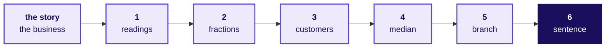
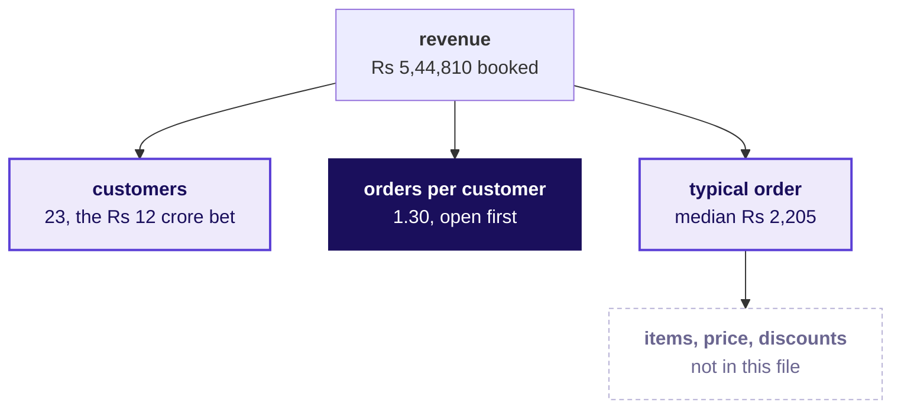

# Is acquisition even the short branch?

**Week 1, Monday · Python through data · Kalpa Retail, the revenue tree and the first honest numbers**

Meera's question climbed in six chapters on 30 orders. Each chapter follows the same six steps:
who asks and why, the options sized, the build, the plausible wrong number and its check, a
second route to the same answer, and the review. By the end the room tells Meera which branch
to open before anyone spends Rs 12 crore.

About a 30 minute read · 9 figures and tables

---

## What you can now do

1. You can say who at Kalpa asks for a metric, what a wrong number costs them, and which real
   company faces the same question.
2. You can lay out two to four ways to answer a data question, size each on the file in rows, time
   and error, and make the best-fit call with the fact that would change it.
3. You can report "sales" with its definition, build every branch of the revenue tree as a fraction
   on one definition, and check it by multiplying back.
4. You can count customers by their id, choose the median over the mean on purpose, and recompute
   lifts through the tree.
5. You can write the four-part sentence a stakeholder acts on, with the window's edge in its caveat.

---

## Where this sits

**What the session covered.** Worked in full: the retail story, then six chapters on Kalpa's 30
orders: four readings of sales, the tree as metrics, the leaves counted, the typical order, which
branch first, and the sentence Meera acts on. Then the escalated case on the delivered definition
and the second case by channel. Mentioned only: the amount stored as text, patched with `int()`
today and given a rule on Wednesday.

The business itself, from how Rs 100 of GMV becomes Rs 2.50 of profit to every retail metric as a
formula, is in the domain dossier, `study-notes/C2_W01_D01_domain_retail_STUDENT.md`, with its
one-page card in `cheatsheets/C2_W01_D01_retail_domain_card_STUDENT.pdf`. These notes build on it
and do not repeat it; where a chapter leans on a dossier section, it names the section.

```mermaid
flowchart LR
    S["<b>the story</b><br/>the business"] --> C1["<b>1</b><br/>readings"] --> C2["<b>2</b><br/>fractions"] --> C3["<b>3</b><br/>customers"]
    C3 --> C4["<b>4</b><br/>median"] --> C5["<b>5</b><br/>branch"] --> C6["<b>6</b><br/>sentence"]
    classDef known fill:#EEEAFB,stroke:#5B3FD6,color:#1A0F5C,stroke-width:2px
    classDef today fill:#1A0F5C,stroke:#1A0F5C,color:#FFFFFF
    class S,C1,C2,C3,C4,C5 known
    class C6 today
```

| | |
|---|---|
| In this programme | It rests on Week 0's loops and the four questions before any proposal, and it sets up Tuesday, when two quarters show which branch moved. |
| In the work | It decides the first line of a growth review in which one branch is about to receive a budget. |

**The outcome tie.** On Thursday Meera expects a recommendation on which branch to examine first, and
today's tree, definitions, typical order and caveat are what it is built from.

**What was left out.** Comparing two windows waits for Tuesday, because today's file holds one
quarter. Deciding what counts as a valid amount waits for Wednesday.

---

## The picture to remember: the revenue tree

```mermaid
flowchart TB
    R["<b>revenue</b><br/>Rs 5,44,810 booked"] --> C["<b>customers</b><br/>23, the Rs 12 crore bet"]
    R --> F["<b>orders per customer</b><br/>1.30, open first"]
    R --> A["<b>typical order</b><br/>median Rs 2,205"]
    A --> I["<b>items, price, discounts</b><br/>not in this file"]
    classDef known fill:#EEEAFB,stroke:#5B3FD6,color:#1A0F5C,stroke-width:2px
    classDef unknown fill:#FFFFFF,stroke:#B8B2D6,color:#6B6690,stroke-dasharray:4 3
    classDef bet fill:#1A0F5C,stroke:#1A0F5C,color:#FFFFFF
    class C,A known
    class I unknown
    class F bet
```

Revenue is customers, times orders per customer, times average order value, and order value is
items per order times price per item, less discounts. It is the dossier's metric tree (section 5)
with Kalpa's quarter written on it. Every chapter below adds one number, and the dark box is where
the day ended.

---

## The story in one paragraph, and the ask it hands over

A retailer keeps a thin slice: on the dossier's illustrative numbers, Rs 100 of GMV leaves Rs 80 of
net revenue, Rs 20 of gross margin, Rs 7.50 of contribution and Rs 2.50 of EBITDA, and
DMart reported profit after tax of 4.8 percent of its FY26 revenue. Six people at Kalpa Retail
already want numbers from the data team, and some of their mistakes can be undone next week while
others cannot.
The story ends on Meera Raghavan's page: revenue grew 4 percent against a plan of 15, marketing
wants Rs 12 crore to acquire customers, and she asks, "Before I sign anything, I want to understand
our own sales. What is 'sales' made of? Where does revenue come from, by customer type and channel?
Is acquisition even the branch that is short?" Anand Iyer, the finance controller, adds: "No
averages. One business customer can move an average." Notebook 00 turns the story's scene into the
card's formulas on invented numbers, if you want the formulas worked.

---

## Chapter 1: four readings of sales

**The need.** Sales is the base every growth percentage is measured from. Meera asks for it, and
Anand's books are what it must match. If it is wrong, a 15 percent plan is measured from demand that
never became a sale. Reliance Retail faces the same question in public: for the quarter to June
2026 it reported gross revenue of Rs 90,408 crore and revenue from operations of Rs 79,745 crore,
with GST recovered as the step between them. Two honest totals for one quarter is normal.

**The options.** There are four ways to answer "what are our sales?". The first is to add every
amount and send the total: 30 rows in under a second, but it counts cancelled orders as sales. The
second is to sum by status and send three readings with a bridge between them: 30 rows once, exact.
The third is to ask Finance for the figure in the books: a day or more. The fourth is to tick orders
off by hand: ten minutes at 30 rows, impossible at 30 lakh. The best fit for a first look is the
second. What would change it is Finance having already fixed the definition the plan was set on; then
Finance decides which of the three totals goes in the note, and the bridge explains the gaps.

**The build.** The first sum stops with `TypeError: unsupported operand type(s) for +=: 'int' and
'str'`, because one amount is stored as text. That gets two minutes: print the record, wrap the
amount in `int()`, move on. One loop then keeps three sums. Booked is Rs 5,44,810 on 30 orders, not
cancelled is Rs 5,35,760 on 26, and delivered is Rs 5,20,790 on 21.

**The trap.** "Sales this quarter: Rs 5,44,810 on 30 orders." It is correct arithmetic, and 4
cancelled orders ride inside it. They are demand that never arrived, and all 4 are store orders, so
store's baseline is overstated by 4 orders in 10. The check is to count by channel and status before
summing anything. The fix is the definition written beside the number, and a bridge: less Rs 9,050
on 4 cancelled store orders, less Rs 14,970 on 5 returned web orders.

**The second route.** A dictionary adds rupees under each status. Booked is the sum of every status,
not cancelled is delivered plus returned, and both routes agree to the rupee. The status route is the
one to use when a new status may appear, since it needs no new `if`.

**Kavya's review.** "You found Rs 9,050 that was never a sale by counting before adding. Which
definition Meera plans on is her call; your job is to make sure she can see which one she is
reading."

---

## Chapter 2: the tree as metrics

**The need.** A branch helps Meera only when it is a fraction on one definition and one window.
Average order value, revenue over orders, is the first branch this file can measure, and marketing's
payback case values every new customer by it. A tree built from two definitions multiplies to revenue
nobody booked. Reliance reports Jio the same way: 533 million subscribers and revenue per user of
Rs 215.6 a month, a tree of customers times revenue per customer.

**The options.** There are four trees a team could draw, sized by the fields each needs. Orders times
AOV needs only the amount and hides who buys. Customers times frequency times AOV needs the amount
and the customer id. The deeper tree splits AOV into items, price and discounts, and needs fields
this file lacks. A funnel from visits to orders needs traffic data. The best fit is the
three-branch tree, the deepest this file fills. Order lines with items and prices would move the call
to the deeper tree.

**The build.** AOV is Rs 5,44,810 / 30 = Rs 18,160, and 30 x Rs 18,160 lands exactly on booked
revenue. The product always lands on revenue, so a wrong leaf never shows in the total and only
shows in the split.

**The trap.** Finance reports booked revenue and the operations dashboard counts delivered orders. A
hurried analyst divides one by the other: Rs 5,44,810 / 21 = Rs 25,943. The numerator keeps the
rupees of 9 cancelled and returned orders while the denominator has dropped those orders. Multiplied
back over the 30 orders it claims Rs 7,78,300, 43 percent more than anyone booked. The check is the
identity: AOV times the orders the revenue was summed over must give that revenue back, and 30 x Rs 25,943 does not. The fix is Rs
18,160 booked or Rs 24,800 delivered, each named.

**The second route.** Revenue over orders is the mean of the 30 amounts, so `sum(amounts) /
len(amounts)` and `statistics.fmean(amounts)` give the same Rs 18,160. Use the totals route when a
report holds them and the rows route when you hold the rows.

**Kavya's review.** "Write each branch as a numerator over a denominator. When two reports feed one
fraction, ask each what it counts before you divide."

---

## Chapter 3: the leaves, counted

**The need.** Marketing's Rs 12 crore buys customers. If the customers Kalpa already has never come
back, acquisition really is the only branch. Meera asks; the marketing lead and the head of
Retail-Plus own the two branches. Reliance Retail reports 396 million registered customers, a
denominator of its own: divide a quarter's orders by it and you get a different, smaller metric from
orders per customer who ordered.

**The options.** There are four ways to count customers on 30 rows. `len(ORDERS)` counts orders.
`len(set(ids))` counts customers in one pass. A dictionary of orders per id counts customers, orders
each and who came back in one pass. Sorting the ids and counting where they change works, and is
easy to miscount by hand. The best fit is the dictionary, since the number Meera's question turns on
is how many came back. A set is enough when only the count is asked. At millions of rows the count
becomes one `COUNT(DISTINCT customer_id)` in the warehouse, which Week 2 teaches.

**The build.** The dictionary gives 16 customers who bought once and 7 who came back, and 23 x 1.30
x Rs 18,160 = Rs 5,44,810. Every leaf moves with the definition. On delivered orders it is 21 orders
from 19 customers, 1.11 each, and only 2 kept two orders: customers do return, and 4 of the 7
second orders were cancelled or sent back, against 5 of the 23 first orders.

**The trap.** A colleague's first draft: "30 customers placed 30 orders: 1.00 each, so nobody comes back." The division is
correct and its denominator is wrong: a row is an order, and one customer can place several. It would
make frequency look dead and the Rs 12 crore look like the only way to grow. The check compares the
length of the id list with the length of its set, 30 against 23. The fix is 23 customers at 1.30
orders each.

**The second route.** Orders per customer is also the mean of the dictionary's values, and it
equals 30 / 23. The counts route also shows the spread, 16 at one and 7 at two, which the ratio
hides.

**Kavya's review.** "Your first 30 was a count of rows, divided as if it were people. A count of
people comes from their ids."

---

## Chapter 4: the typical order

**The need.** The payback case values each new customer by the order they will place. Meera and the
marketing lead ask for it; Anand has already warned against averages. A first order valued eight
times too high makes Rs 12 crore look cheap. Blinkit reported a net average order value of Rs 518 for
the quarter to June 2026: a reported AOV is a mean, the right number for totals across millions of
similar baskets. It is the wrong number for one shopper's basket when a few very large orders share
the file.

**The options.** There are four middles, sized by how far each moves when one invented Rs 90,000
order joins five invented orders of Rs 1,900 to Rs 2,600. The mean moves Rs 14,623, since every rupee
of the new order enters it. The median moves Rs 50, one place along the sort. A trimmed mean that
drops one order at each end moves Rs 83, but it needs a rule for how many to drop. A mean per
customer type stays put within a type, and it needs the types. The best fit for "what does a
typical order look like" is the median, with the mean beside it for the total. If marketing prices
the payback per customer type, the mean per type answers better.

**The build.** Sorted, the 15th and 16th amounts are Rs 2,110 and Rs 2,300, so the median is Rs
2,205, about one eighth of the mean. It holds under every definition: Rs 2,100 not cancelled, Rs
2,060 delivered. The mean swings from Rs 18,160 to Rs 24,800 over the same three definitions. A
payback that credits each new customer with Rs 18,160 an order overstates a typical order about
eightfold.

**The trap.** "A typical Kalpa order is Rs 18,160." Only 1 of the 30 orders sits above it, and the
other 29 sit below. That count is the check, and sorting the amounts and reading the top shows why.
Each learner does the sort in the notebook's empty cell and names the order they find.

**The second route.** `statistics.median` holds the even-count rule and agrees with the hand-written
middle on every definition. Write it by hand once so the rule is yours, then use the library.

**Kavya's review.** "Put the median in the sentence, say the mean is eight times higher, and say one
order does it."

---

## Chapter 5: which branch first

**The need.** Every branch is measured, and marketing has proposed moving one of them. The plan is
15 percent, and Meera wants the branch to open first and why not the others. Chapter 4 found one
order carrying most of the booked total, and no retention offer or campaign repeats it, so the
plan is sized on the other 29, the everyday consumer orders: Rs 64,810, and Rs 9,722 more.
Flipkart launched Flipkart Black at Rs 1,499 a year in 2025, and Amazon offers Prime in India from Rs 399 to Rs 1,499 a year. Both pay existing customers to come back
more often, a bet on the frequency branch by companies that could have spent the money on
acquisition.

**The options, sized.** Each branch is moved alone, holding the other two:

| Branch | The plan needs | Evidence in this file |
|---|---|---|
| Customers | 3.3 more who buy like today's | None; one window cannot show customers falling |
| Frequency | 4.35 more orders from the same 22 at their mean of Rs 2,235, 4 or 5 of the 15 one-time buyers returning once | 7 already came back |
| Order value | Rs 335 more on every order | Items and prices are not in the file |
| Price | Every price 15 percent higher with nobody leaving | None; nothing sells above MRP |

The best fit is frequency: the customers exist, some return, and a reorder reminder to people
already on the list costs little. The call would switch to acquisition if Tuesday's second quarter
showed customers falling while frequency held, or if a retained order cost more than an acquired
customer.

**The build.** Predict each line before it runs. The 29 everyday orders sum to Rs 64,810, so the
plan's target is Rs 64,810 x 1.15, about Rs 74,532. They come from 22 customers at 1.32 orders
each and a mean of Rs 2,235 an order. Holding two branches still, the third must carry the whole
target alone: customers rise to 25.3, orders to 33.35, or the mean order to Rs 2,570. Every line
multiplies back to the target through the tree, which is the check that the sizing used one
definition throughout.

**The trap.** Marketing answers with a bigger plan: "Fund both; 10 percent more customers and 10
percent more orders each make 20 percent, Rs 77,772 on the everyday orders." The branches
multiply, so the lifts multiply: 1.10 x 1.10 = 1.21, which is Rs 78,420, Rs 648 above the slide. The gap grows with the lifts:
two 30 percent lifts make 69 percent where addition says 60. The check is to recompute through the
tree. The same rule prices a discount: 15 percent off with 10 percent more orders is 0.85 x 1.10 =
0.935, a 6.5 percent fall. Orders must rise about 17.6 percent before the discount holds revenue.

**The second route.** The total after both lifts is four parts: the base, Rs 6,481 for customers,
Rs 6,481 for frequency, and Rs 648 for the lift on the lift. The parts land on the multiplied
total. The parts route is the one to bring to marketing, because the lift on the lift has its own
line.

**Kavya's review.** "Pick the branch the evidence points at and the one that costs least to test,
then say what would make you pick another."

---

## Chapter 6: the sentence Meera acts on

**The need.** Meera will read one sentence and sign against it, and marketing will read the same
sentence looking for its weakest number. The number at stake is the repeat picture. Klarna reported
in February 2024 that its AI assistant handled two-thirds of customer-service chats in its first
month. Fifteen months later its chief executive said the focus on cost had lowered quality, so the
first month's number had been read as a result that time then changed.

**The options.** There are four ways to hand her the answer, sized in her reading time:

- One number, 1.30 orders each, takes two seconds and carries no decision.
- The tree as a table takes a minute and lets her pick the number that suits the room.
- One sentence with evidence, branch, caveat and ask takes about twenty seconds and carries the
  decision and its limit.
- A weekly dashboard takes weeks to build.

The best fit is the sentence. When the question turns weekly, as it does when her chief of staff asks
for the leadership deck in Week 2, the dashboard earns its cost, with the sentence as its headline.

**The build.** Every number in the sentence comes from a variable, so the sentence cannot drift from
the work. The first draft said "16 of them bought only once"; after the trap below, the final
sentence reads:

> "On the 30 booked orders from 1 July to 26 September, 23 customers placed 1.30 orders each at a
> typical order of Rs 2,205; 7 came back, 7 are past the usual gap without a second order, and 9 bought too
> recently to judge, so I would open frequency before acquisition, and since one quarter cannot show
> which branch moved, hold the Rs 12 crore until Tuesday's two quarters."

**The trap.** "16 of 23 customers never came back: 70 percent of our customers are lost." The file
shows who bought once inside the window; whether they are lost depends on orders placed after it
closes, which the file cannot show. The check asks the
question marketing would ask: how long do customers usually take to come back? The 7 who did took a
median of 45 days (11, 35, 43, 45, 46, 63 and 65). Of the 16 one-time buyers, 9 placed their order
fewer than 45 days before the 88-day window closes, so they have not had a typical customer's time. The
fix is that 7 came back, 7 are past the usual gap without a second order, and 9 are too recent to judge. Even the 45 days
rests on 7 customers, so the sentence claims nothing beyond it.

**The second route.** Give each one-time buyer a due date, their order date plus 45 days, and count
those due after the window ends. The count is the same 9 as the recency route. Recency reports
today's state; a due date is the day a reminder would go out.

**Kavya's review.** "Every number in it is one we can defend."

---

## The escalated case: does the answer survive on what stayed delivered?

Anand pushes back: booked includes cancelled and returned orders, so do it again on delivered. On 21
delivered orders, 19 customers kept 1.11 orders each and only 2 kept two. The typical order is Rs
2,060. The plan, sized on the 20 everyday delivered
orders, needs 3 more from frequency alone, and the discount still loses 6.5 percent. Of the 17
one-time buyers, 7 bought inside the 45-day edge. Orders per customer fell, while the typical order,
the window's edge and the branch held. The delivered view adds a leak to the note: of the 7
customers who came back, 4 lost that second order to a cancellation or a return.

## The second case: where revenue comes from by customer type and channel

The first chart most pairs draw says store brings 91.6 percent of booked revenue, and the plan goes
store-led. The check is to count the orders behind each share: every channel has 10 orders, and one
store order carries almost all of store's revenue, the order your chapter 4 sort put at the top. On
the 29 consumer orders, Rs 64,810 booked, web leads with Rs 27,290 but 5 of its 10 orders came back.
App kept all 10, Rs 18,600. Store holds Rs 18,920, and 4 of its 9 were cancelled. Frequency stays
first, and the note to Meera gains two leaks: web returns and store cancellations.

**Kavya's review.** "Count the orders behind a share before you show it to Meera."

---

## The six lines to keep

1. Name the definition before the number: booked, "not cancelled", or delivered.
2. Build every fraction on one definition, and check that it multiplies back.
3. Count customers by their id, never by the rows.
4. Report the median when one order can move the mean, and say why.
5. Lifts multiply along the tree: two 10 percent lifts make 21 percent.
6. A one-time buyer is not a lost customer until they have had time to come back.

---

## Try this yourself

No writing and no code. Pick a letter for each, note how sure you were, then read the key.

1. A report says "sales Rs 5,44,810" with no other words. What is missing? a) the median; b) which
   orders it counts and over which dates; c) the number of customers; d) the channel split.
2. Revenue from one report is divided by orders from another. The first check is: a) round both; b)
   multiply back and see whether it lands on a real total; c) use the larger AOV; d) average them.
3. An extract has 40 rows and 40 distinct order ids. How many customers does it have? a) 40; b)
   fewer than 40; c) it cannot be said until the customer ids are counted; d) more than 40.
4. Eleven amounts, sorted, in a Python list. The median sits at index: a) 4; b) 5; c) 6; d) the
   average of indexes 5 and 6.
5. Orders per customer rises 10 percent and average order value falls 10 percent, with customers
   steady. Revenue: a) is unchanged; b) rises 1 percent; c) falls 1 percent; d) falls 10 percent.
6. A customer bought once, three days before the extract ends; repeat buyers usually take 45 days.
   They are: a) lost; b) too recent to judge; c) a repeat customer; d) out of every count.

**The key, and what to re-read.**

1. b. A total needs its reading and its window. Missed it? Re-read chapter 1.
2. b. The identity lands on nothing when two definitions are mixed. Missed it? Re-read chapter 2.
3. c. Order ids say nothing about people. Missed it? Re-read chapter 3.
4. b. The sixth of eleven values sits at index 5, since Python counts from 0. Missed it? Re-read
   chapter 4 and the escalated case.
5. c. 1.10 x 0.90 is 0.99. Missed it? Re-read chapter 5.
6. b. Three days is far short of the usual gap. Missed it? Re-read chapter 6.

---

## Where this gets tested

The first five are the row's anchors; the rest are case-style and design follow-ups. Tags: [S]
staple, [F] frequent in GCC and product screens, [SV] service-major opener, [D] differentiator or
design.

**[S] How would you increase sales for an online retailer?**
"I draw revenue first: customers, times orders per customer, times average order value, each on one
definition and window. Then I size what the target asks of each branch alone and weigh the cost of
moving it: acquisition costs marketing, frequency costs retention, price risks volume. On one
quarter I worked, 16 of 23 customers bought once, and on the everyday orders 15 percent needed 3.3 more
customers or 4.35 more orders from the customers already there. I opened frequency, with the cheapest test agreed
first."

**[S] Mean or median for order value, and why?**
"The median for the typical order, because order values are skewed and one large order moves the
mean. On thirty orders I worked with, the mean was Rs 18,160, the median Rs 2,205, and 29 orders sat
below the mean. I keep the mean for anything that must add up to a total, and I report both on a
first look, since the gap is a finding."

**[F] A business says "grow revenue 15 percent"; how do you turn that into questions data can
answer?**
"First the base: 15 percent of which reading of revenue, over which window. Then the tree turns the
goal into what each branch would have to do alone, in customers, orders and rupees per order, and two
periods show where the gap sits. Last, I ask which decision each answer changes and who owns it."

**[SV] A list against a dictionary: when do you reach for each?**
"A list when order matters or I walk every item, like thirty orders I loop over to sum revenue. A
dictionary when I look things up or count by a key, like orders per customer id. Real data is
usually a list of dictionaries, and for distinct values I use a set."

**[D] Marketing wants budget for acquisition; what would you check before agreeing it is the right
branch, and how would you say no?**
"I put the budget on the tree: it moves customers, one branch of three. I check repeat buyers on the same window,
price what a new customer brings on the everyday orders' mean with the one large order set aside, then ask for the prior quarter, since only two windows show
which branch fell. On one quarter, 16 of 23 customers bought once and 7 came back. My no is a no for
now with a date, and a cheaper first step: a frequency test that costs a reminder. If customers turn
out to be the branch that fell, I back the budget."

**[F] What counts as "sales": booked, net of cancellations, or delivered, and which do you give a
CEO?**
"Booked is demand that reached us, not cancelled is what left the shelf, and delivered is what we
kept. On one file they were Rs 5,44,810, Rs 5,35,760 and Rs 5,20,790. I give the CEO the one her plan
was set on, with its definition, and the bridge to the others."

**[D] How would you decide between summing the file yourself and asking Finance for the number?**
"By who acts on it. For a first look, summing by status takes a second and shows every reading. For
anything the board sees, I reconcile to Finance's books, because a number that disagrees with them
loses the room whatever its logic."

**[F] Your extract shows 30 orders and 30 customers; what do you check before saying nobody comes
back?**
"Whether 30 customers means 30 distinct ids or 30 rows. In the case I worked it was 30 rows against
23 ids, so 7 customers bought twice and orders per customer was 1.30. I would also check the window,
since a customer who buys every four months looks one-time in a quarter."

**[D] Which middle would you put in a payback model, and what would make you change it?**
"A payback adds up what a customer brings over time, so it needs a mean, and the mean has to come
from the customers the spend targets: the consumer segment's mean contribution per customer over the
repeat window, with one-off large orders set aside. The median is what I quote beside it as the
typical order. If the spend targeted business buyers, I would switch segment, and the mean with it."

**[F] A 10 percent lift in customers and a 10 percent lift in frequency make 20 percent growth; what
is the right number, and when does it matter?**
"Revenue is a product of its branches, so 1.10 x 1.10 = 1.21, 21 percent. On the Rs 64,810 of everyday orders that is Rs
78,420 against Rs 77,772. It matters when lifts are large, many or negative: two 30 percent lifts
make 69 percent, and 15 percent off with 10 percent more orders is a 6.5 percent fall."

**[D] You have one quarter of orders and 70 percent of customers bought once; what do you tell the
CEO?**
"That 70 percent bought once in this window, which is a fact about the window; a churn rate is a claim about the future. I measure how
long returning customers took, 45 days in the case I worked. Then I hold back everyone who bought
inside that gap: 9 of the 16. So 7 came back, 7 are past the usual gap, 9 are too recent, and since a
one-quarter window only sees short gaps, 45 days is a floor. I ask for the prior quarter before calling
anyone lost."

**[D] One channel carries nine rupees in ten of revenue; does that change where the growth plan
invests?**
"Not before I count the orders behind the share. In the case I worked, store's 91.6 percent rested on
one large order. On consumer orders store had Rs 18,920 of Rs 64,810 with 4 of 9 cancelled, web lost
half its orders to returns, and app was clean. The plan stays on frequency and gains two leaks to
fix."

---

## Terms from today

| Term | In plain words | Where it appeared | An example |
|---|---|---|---|
| Revenue tree | Revenue drawn as the metrics that multiply into it, less discounts | The picture to remember | Customers times orders per customer times average order value |
| Denominator | What a metric is divided by, said before it is computed | Chapters 2 and 3 | Orders per customer is over distinct customers |
| Booked revenue | Every order placed in the window, whatever happened to it later | Chapter 1 | Rs 5,44,810 on 30 orders |
| Delivered revenue | Only the orders that reached the customer and stayed | Chapter 1 | Rs 5,20,790 on 21 orders |
| Identity check | Multiplying a tree's branches back to see they land on the total | Chapter 2 | 30 x Rs 18,160 = Rs 5,44,810 |
| Distinct customers | Each customer id counted once, however many orders it placed | Chapter 3 | 23 customers behind 30 rows |
| Orders per customer | Orders over distinct customers in the same window | Chapter 3 | 30 over 23, which is 1.30 |
| Median | The middle of the sorted values, or the average of the two middles | Chapter 4 | Rs 2,205 on the 30 booked orders |
| Mean | The total spread evenly over the count | Chapter 4 | Rs 18,160, revenue over orders |
| Lift | A change in one branch, written as a multiplier | Chapter 5 | 1.10 x 1.10 = 1.21 |
| Repeat gap | Days between a customer's first and second order | Chapter 6 | A median of 45 days |
| Window's edge | The end of the data, where recent customers have not had time to act | Chapter 6 | 9 one-time buyers too recent to judge |
| Share | One part's revenue over the whole, with the orders behind it counted | The second case | Store at 91.6 percent of booked revenue |

---

## Go deeper

| Order | What | Time | Why this one |
|---|---|---|---|
| 1 | The domain dossier, `study-notes/C2_W01_D01_domain_retail_STUDENT.md`, sections 3, 5 and 9 | 25 minutes | How the money flows, every metric as a formula, and the common problems with their options |
| 2 | MConsultingPrep, the profitability framework, variants 1 and 2, https://mconsultingprep.com/profitability-case-framework (verified 29 Sep 2026) | 20 minutes | The revenue side of the case framework, and the variant that splits by customers |
| 3 | Road to Offer, driver trees, https://www.roadtooffer.com/blog/driver-tree (verified 29 Sep 2026) | 20 minutes | A worked tree where one branch's change is carried through to the output |
| 4 | Hacking the Case Interview, the profitability case, https://www.hackingthecaseinterview.com/pages/profitability-case-interview (verified 29 Sep 2026) | 25 minutes | How the tree is spoken aloud in an interview |
| 5 | Khan Academy, mean, median and mode, https://www.khanacademy.org/math/statistics-probability/summarizing-quantitative-data/mean-median-basics/v/mean-median-and-mode (verified 29 Sep 2026) | 10 minutes | The median computed by hand, including the even-count case |
| 6 | Corey Schafer, Dictionaries, https://www.youtube.com/watch?v=daefaLgNkw0 (verified 29 Sep 2026) | 15 minutes | Records as dictionaries and the `get` pattern behind the count per customer |
| 7 | Automate the Boring Stuff with Python, 3rd edition, chapters 2 and 3, https://automatetheboringstuff.com/3e/ (verified 29 Sep 2026) | 45 minutes | if-else and loops, the two pieces the accumulator is made of |
