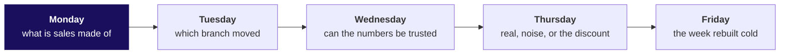
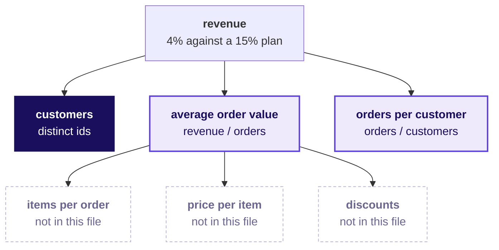
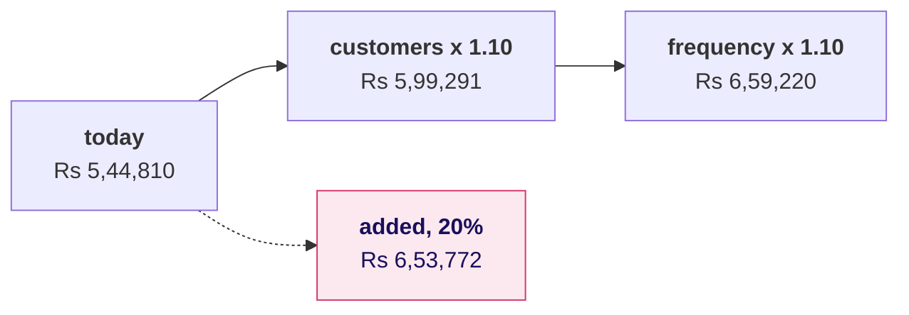

# Is acquisition even the short branch?

**Week 1, Monday · Python through data · Kalpa Retail, the revenue tree and the first honest numbers**

Drawing revenue as a tree of metrics, counting its leaves honestly on 30 orders, and telling Meera which branch to open before anyone spends Rs 12 crore.

About a 22 minute read · 7 figures and tables

---

## What you can now do

1. You can draw revenue as a tree and write each branch as a metric with a numerator, a denominator and a cost to move.
2. You can report "sales" with its definition beside the number.
3. You can count customers by their id and catch a report that counted rows as people.
4. You can choose the median over the mean on purpose and say what the choice does to a business case.
5. You can multiply lifts along the tree, and count the orders behind a channel's share before it steers a plan.

---

## Where this sits

**What the session covered.** Worked in full: Meera's ask drawn as a tree, the four readings of sales, the leaves counted on 30 orders in Python with dictionaries, loops, a set and a dictionary of counts, the mean against the median, the escalated case and the second case. Mentioned only: the amount stored as text, patched with `int()` today and given a rule on Wednesday.


```mermaid
flowchart LR
    M["<b>Monday</b><br/>what is sales made of"] --> T["<b>Tuesday</b><br/>which branch moved"]
    T --> W["<b>Wednesday</b><br/>can the numbers be trusted"]
    W --> H["<b>Thursday</b><br/>real, noise, or the discount"]
    H --> F["<b>Friday</b><br/>the week rebuilt cold"]
    classDef today fill:#1A0F5C,stroke:#1A0F5C,color:#FFFFFF
    class M today
```

This map of the week is the programme's own construction, drawn from the Week 1 rows.

| | |
|---|---|
| In this programme | It rests on Week 0's loops and the four questions before any proposal, and it sets up Tuesday, when two quarters show which branch moved. |
| In the work | It decides the first line of a growth review in which one branch is about to receive a budget. |

**The outcome tie.** On Thursday Meera expects a recommendation on which branch to examine first, and today's tree, definitions and typical order are what it is built from.

**What was left out.** Comparing two windows waits for Tuesday, because today's file holds one quarter. Deciding what counts as a valid amount waits for Wednesday.

---

## The picture to remember: the revenue tree


```mermaid
flowchart TB
    R["<b>revenue</b><br/>4% against a 15% plan"] --> C["<b>customers</b><br/>distinct ids"]
    R --> A["<b>average order value</b><br/>revenue / orders"]
    A --> I["<b>items per order</b><br/>not in this file"]
    A --> P["<b>price per item</b><br/>not in this file"]
    A --> D["<b>discounts</b><br/>not in this file"]
    R --> F["<b>orders per customer</b><br/>orders / customers"]
    classDef known fill:#EEEAFB,stroke:#5B3FD6,color:#1A0F5C,stroke-width:2px
    classDef unknown fill:#FFFFFF,stroke:#B8B2D6,color:#6B6690,stroke-dasharray:4 3
    classDef bet fill:#1A0F5C,stroke:#1A0F5C,color:#FFFFFF
    class F,A known
    class I,P,D unknown
    class C bet
```

Revenue is customers, times orders per customer, times average order value, and average order value is items per order times price per item, less discounts. The dark box is where marketing's Rs 12 crore would land, the solid boxes are what today's file can count, and the dashed ones need fields it does not carry. Every section below puts one more number on the revenue tree.

---

## The ask, and why the tree comes before any tool

Kalpa Retail grew revenue 4 percent last year against a plan of 15, the board wants a growth plan within a month, and marketing has asked for Rs 12 crore to acquire new customers. Meera Raghavan, the CEO, asked three questions before signing: what "sales" is made of, where revenue comes from by customer type and channel, and whether acquisition is even the branch that is short. Anand Iyer, the finance controller, added: "No averages. One business customer can move an average."

A budget request is a claim about the revenue tree: marketing claims the customers branch is short and that money moves it. The tree makes the claim testable, because each branch is a metric and each costs something different to move.

| Branch | Numerator over denominator | What moving it costs |
|---|---|---|
| Customers | Distinct customer ids in the window, a count | Marketing spend, and new buyers may never return |
| Orders per customer | Orders over distinct customers, same window | Retention, which may pay people who would have come back anyway |
| Items per order | Items over orders | Merchandising, and baskets can fill with low-margin lines |
| Price per item | Revenue before discounts over items | Volume, because price-sensitive buyers leave |
| Discounts | Rupees given back over revenue before discounts | Margin, traded for quantity |

The units prove the tree: customers times orders per customer gives orders, and orders times revenue per order gives rupees.

> **ORIGIN** · Road to Offer's guide to driver trees traces the method to the DuPont model of 1912, which split return on equity into margin, asset turnover and borrowing so that a change in any input traced cleanly to the output. (Road to Offer, driver trees, verified 29 Sep 2026)

> **CALLBACK** · Week 0, Wednesday: the warden asked for an app, and the first move was to set the attached solution aside and ask what number would move. Marketing's Rs 12 crore is the same shape of request.

---

## Round 1: what "sales" is, and the four readings of one word

A number without its definition starts an argument, because finance and marketing each hear the reading they expected. Sales on today's file has four honest readings, from demand that reached Kalpa to revenue Kalpa kept. The file is a list of 30 dictionaries, one per order, and a loop with an `if` on `status` sorts every order into its reading.

| Reading | Orders | Revenue |
|---|---|---|
| Booked, all orders | 30 | Rs 5,44,810 |
| Not cancelled | 26 | Rs 5,35,760 |
| Delivered | 21 | Rs 5,20,790 |
| Returned | 5 | Rs 14,970 |
| Cancelled | 4 | Rs 9,050 |

Delivered, returned and cancelled add back to Rs 5,44,810, which is the first check a senior runs on any split.

**The trap in round 1.**

| | |
|---|---|
| The wrong number | Sales is reported as Rs 5,44,810 from all 30 orders, with the 4 cancelled orders inside it. |
| Why it is wrong | A cancelled order never became a sale. All 4 are store orders, so store's order count is overstated by 4 in 10, and a growth baseline built on it includes demand that never arrived. |
| The check | Count orders by status before summing anything: 21 delivered, 5 returned, 4 cancelled. |
| The fix | State the definition beside the number: not cancelled is Rs 5,35,760 on 26 orders, with Rs 9,050 and 4 orders taken out, and delivered is Rs 5,20,790 on 21. |
| What changed | The rupee gap looks small at under 2 percent, and the order gap is large: 4 of 30 orders, all in one channel, which matters the moment anyone compares channels. |

The harder variant placed five initiatives on the tree: a discount on discounts, a new store on customers, a loyalty card on orders per customer, a price rise on price per item, and an app redesign on customers or frequency depending on what it fixes, which is the question to ask its sponsor.

**Kavya's review.** "Every number you send Meera carries its reading in the same line. Lead with not cancelled for demand and give delivered on the next line for what we kept."

**In the interview.** [F] What counts as "sales": booked, net of cancellations, or delivered, and which do you give a CEO?

---

## Round 2: counting the leaves, and the rows that were not people

A count is only as honest as the thing it counts. Thirty rows are thirty orders, and a person who bought twice is two rows and one customer.

An accumulator starts a total before the loop, updates it once per record, and is read after the loop. On today's file the revenue loop stopped with `TypeError: unsupported operand type(s) for +=: 'int' and 'str'`, because one amount arrived as text. That got two minutes: read the last line, find the record the loop stopped on yourself, and wrap the amount in `int()` for today.

```python
customers = set()
for order in ORDERS:
    customers.add(order["customer_id"])
print(len(ORDERS), len(customers))   # 30 23
```

A set keeps one copy of each value, so its length is the distinct count. A dictionary of counts, `counts[cid] = counts.get(cid, 0) + 1`, shows who came back: 16 customers bought once and 7 bought twice.

**The trap in round 2.**

| | |
|---|---|
| The wrong number | Customers are counted as rows, 30, so orders per customer reads 30 over 30, which is 1.00, and the report says nobody comes back. |
| Why it is wrong | A row is an order. Seven customers bought twice, and the report has erased them. |
| The check | Compare `len(rows)` with `len(set(ids))`: 30 against 23. |
| The fix | Customers 23, orders per customer 1.30, and 7 repeat customers, which is 30 percent of customers coming back. |
| What changed | At 1.00 acquisition looks like the only branch that can move, which is the argument for the Rs 12 crore. At 1.30, with 7 of 23 returning, frequency is a live branch. |

The harder variant counted the leaves on the delivered reading: 21 orders from 19 customers, 1.11 orders per customer and Rs 5,20,790. The definition changes every leaf, so it goes beside every leaf.

> **IN THE FIELD** · MConsultingPrep's profitability framework names revenue per customer times number of customers as its second variant, for businesses where individual spending varies widely. (MConsultingPrep, the profitability framework, verified 29 Sep 2026)

> **WATCH OUT** · A customer who came back and an order entered twice look the same in a count. Today all 30 order ids are different, so the 7 extra rows are real orders; Wednesday's file will test that.

**Kavya's review.** "Before you say anything about loyalty, say what you counted: twenty-three people, thirty orders, seven came back."

**In the interview.** [F] Your extract shows 30 orders and 30 customers; what do you check before saying nobody comes back?

---

## Round 3: the typical order, and which "typical" is honest

A business case built on a typical order that nobody placed promises returns nobody gets. Revenue per order is a mean: Rs 5,44,810 over 30 orders is Rs 18,160. The median, the middle of the 30 sorted amounts, is Rs 2,205, the average of the fifteenth and sixteenth values.

**The trap in round 3.**

| | |
|---|---|
| The wrong number | The mean, Rs 18,160, is sold as the typical order, and marketing values a new customer's first order at Rs 18,160. |
| Why it is wrong | 29 of the 30 orders sit below the mean. One order at the top of the sort drags it up. |
| The check | Count the orders above the mean (1 of 30), sort the amounts and read the top, and compute the median. |
| The fix | Report the median, Rs 2,205, about one eighth of the mean, and name the order at the top on its own line. |
| What changed | A first order is worth about Rs 2,205, so the payback on acquisition needs roughly eight times as many orders as the mean suggested. |

The mechanism, on invented records: five invented orders of Rs 1,900, 2,100, 2,300, 2,400 and 2,600 have a mean of Rs 2,260 and a median of Rs 2,300. Add an invented Rs 90,000 order as a sixth and the mean jumps to Rs 16,883, while the median moves only to Rs 2,350, the average of the two middle amounts. One extreme value pulls the mean by its whole distance from the mean divided by the count, and moves the median by one step along the sorted list.

| The number is for | Report | Because |
|---|---|---|
| A typical order | The median | One record cannot drag it |
| A total that must add up | The mean | It multiplies back to the total |
| A first look at a file | Both | The gap between them is itself a finding |

The harder variant took the median under each reading, booked Rs 2,205 and delivered Rs 2,060, so a first order is worth about two thousand rupees whichever reading marketing is paid on.

> **CALLBACK** · Week 0, Tuesday's diagnostic discussion made the same call on five customers, where the median was Rs 400, the mean Rs 2,100, and one buyer carried 86 percent of the spend.

**Kavya's review.** "The mean answers a different question from the one Meera asked. Give her the median as the typical order, the mean only where something has to add up, and one line on the order at the top."

**In the interview.** [S] Mean or median for order value, and why?

---

## The escalated case: which branch Meera opens first

Meera wants a branch to examine first, with the reasons the others were not picked, and marketing has a number of its own: a 10 percent lift in customers and a 10 percent lift in frequency will give 20 percent growth.

**The trap in the escalated case.**

| | |
|---|---|
| The wrong number | Two 10 percent lifts are called 20 percent growth. |
| Why it is wrong | Branches multiply: 1.10 times 1.10 is 1.21, so the growth is 21 percent. On Rs 5,44,810 that is Rs 6,59,220 against Rs 6,53,772 at 20 percent, Rs 5,448 apart. |
| The check | Recompute revenue through the revenue tree instead of adding percentages. |
| The fix | Multiply every lift along the tree. The same arithmetic turns a 15 percent discount that lifts quantity 10 percent into a 6.5 percent revenue fall, because 0.85 times 1.10 is 0.935. |
| What changed | The gap looks small on two lifts of 10 percent and grows with the size and number of lifts, so a plan that stacks four initiatives cannot be sized by addition. |


```mermaid
flowchart LR
    B["<b>today</b><br/>Rs 5,44,810"] --> C1["<b>customers x 1.10</b><br/>Rs 5,99,291"]
    C1 --> C2["<b>frequency x 1.10</b><br/>Rs 6,59,220"]
    B -.-> W["<b>added, 20%</b><br/>Rs 6,53,772"]
    classDef bad fill:#FBE9EF,stroke:#D63A6A,color:#1A0F5C
    class W bad
```

The recommendation comes from the leaves. Of 23 customers, 16 bought once in the quarter, so frequency is the branch to open first: it is measurable on data Kalpa holds, and it costs retention effort where acquisition costs crores for customers whose first order is worth about Rs 2,205. Only Tuesday's two quarters can show which branch moved, so the Rs 12 crore waits until then.

> **IN THE FIELD** · Road to Offer's worked driver tree follows a coffee chain whose daily traffic fell 10 percent, from 400 to 360 customers a store, and carries that change through to profit across 100 stores, which falls from $12 million to $7.68 million. (Road to Offer, driver trees, verified 29 Sep 2026)

**Kavya's review.** "Say no to the budget by offering a cheaper first step: the two-quarter comparison, which costs a day, before a spend that costs crores."

**In the interview.** [F] Marketing says a 10 percent lift in customers and a 10 percent lift in frequency make 20 percent growth; what is the right number, and when does the difference matter?

---

## The second case: where revenue comes from by customer type and channel

Meera's second question was where revenue comes from, and split by channel on booked revenue the answer looks dramatic.

| Channel | Orders | Share of booked revenue | Status |
|---|---|---|---|
| App | 10 | 3.4 percent | 10 delivered |
| Web | 10 | 5.0 percent | 5 delivered, 5 returned |
| Store | 10 | 91.6 percent | 6 delivered, 4 cancelled |

By customer type, Retail-Core booked Rs 32,650 on 14 orders, Retail-Plus Rs 27,320 on 10 and Student Rs 4,840 on 5; segment is recorded on the order, so one customer appears under two segments.

**The trap in the second case.**

| | |
|---|---|
| The wrong number | "Store brings 91.6 percent of revenue, so the growth plan should be store-led." |
| Why it is wrong | One order carries store's share: the order your round 3 sort put at the top. Among consumer orders, the 29 outside the Business segment, store has Rs 18,920 of Rs 64,810, and 4 of its 9 consumer orders were cancelled. |
| The check | Count the orders behind each share, recompute on consumer orders, and split each channel by status. |
| The fix | On consumer orders web leads booked revenue at Rs 27,290, and half its orders came back (5 returned, Rs 14,970); app is clean at 10 of 10 delivered and Rs 18,600; store delivered Rs 9,870 on 5 orders. |
| What changed | The branch recommendation, frequency first, stands. The channel view adds two leaks to name in the note to Meera: web returns and store cancellations. |

The consumer median, Rs 2,110, sits close to the booked median, one more sign that the typical order was never the problem.

**Kavya's review.** "A channel share that rests on one order is a finding about that order. Put the leaks in the note, and keep the recommendation where the evidence put it."

**In the interview.** [D] One channel carries nine rupees in ten of revenue; does that change where the growth plan invests?

---

## The five lines to keep

1. Name the definition before the number: booked, not cancelled, or delivered.
2. Count customers by their id, never by the rows.
3. Report the median when one order can move the mean, and say why.
4. Lifts multiply along the tree: two 10 percent lifts make 21 percent.
5. One window shows the shape of revenue; only two windows show which branch moved.

The sentence that went to Meera at the close:

> "On the 30 orders from 1 July to 26 September, 23 customers placed 1.30 orders each at a typical order of Rs 2,205, and 16 of them bought only once, so I would open frequency before acquisition; this one window cannot show which branch moved, so hold the Rs 12 crore until Tuesday's two quarters."

---

## Try this yourself

No writing and no code. Pick a letter for each, note how sure you were, then read the key.

1. A report says "sales Rs 5,44,810" with no other words. What is missing? a) the median; b) which orders it counts and over which dates; c) the number of customers; d) the channel split.
2. An extract has 40 rows and 40 distinct order ids. How many customers does it have? a) 40; b) fewer than 40; c) it cannot be said until the customer ids are counted; d) more than 40.
3. Orders per customer rises 10 percent and average order value falls 10 percent, with customers steady. Revenue: a) is unchanged; b) rises 1 percent; c) falls 1 percent; d) falls 10 percent.
4. Eleven amounts, sorted, in a Python list. The median sits at index: a) 4; b) 5; c) 6; d) the average of indexes 5 and 6.
5. The mean order is Rs 9,800 and the median Rs 1,400. The first thing to do is: a) report the mean, since it uses every order; b) drop the largest order; c) sort the amounts and read the top; d) average the two.
6. A warden asks for an app that predicts how many students will eat. The first move is: a) collect attendance data; b) ask what decision the number would change; c) pick a forecasting model; d) build a sign-out form.

**The key, and what to re-read.**

1. b. A total needs its reading and its window before anyone can check it. Missed this one? "Round 1: what sales is" is the one to re-read.
2. c. Order ids say nothing about people. Missed this one? "Round 2: counting the leaves" is the one to re-read.
3. c. 1.10 times 0.90 is 0.99. Missed this one? "The escalated case" is the one to re-read.
4. b. The sixth of eleven values sits at index 5, since Python counts from 0. Missed this one? "Round 3: the typical order" is the one to re-read.
5. c. Read the top before deciding anything; dropping it hides real revenue. Missed this one? "Round 3: the typical order" is the one to re-read.
6. b. This item is from Week 0, Wednesday: the first question is which decision the number changes. Missed this one? "The ask, and why the tree comes before any tool" is the one to re-read.

---

## Where this gets tested

Tags: [S] asked everywhere, [F] frequent in GCC and product screens, [SV] service-major opener, [D] differentiator.

**[S] How would you increase sales for an online retailer?**

*What is being tested:* structure before tactics.

**A model answer.** "I draw revenue first: customers, times orders per customer, times average order value. Two periods show which branch moved, and each lever has its own cost: acquisition costs marketing, frequency costs retention, price risks volume. On one quarter, 16 of 23 customers bought once, so I would open frequency and pick its cheapest lever, with the measure agreed first."

*What makes an answer weak here:* a list of tactics with no branch named.

**[S] Mean or median for order value, and why?**

*What is being tested:* choosing a statistic by purpose.

**A model answer.** "The median for the typical order, because order values are skewed and one large order moves the mean. On thirty orders I worked with, the mean was Rs 18,160, the median Rs 2,205, and 29 orders sat below the mean. I keep the mean for anything that must add up to a total."

*What makes an answer weak here:* "the median is more accurate", which names no purpose.

**[F] A business says "grow revenue 15 percent"; how do you turn that into questions data can answer?**

*What is being tested:* translating a goal into measurable questions.

**A model answer.** "First the baseline: 15 percent of which reading of revenue, over which window. Then the tree turns the goal into a question per branch, each with its denominator, and two periods show where the gap sits. Last, I ask which decision each answer changes."

*What makes an answer weak here:* reaching for a model before the baseline and the tree exist.

**[SV] A list against a dictionary: when do you reach for each?**

*What is being tested:* choosing a structure by how the data is accessed.

**A model answer.** "A list when order matters or I walk every item, like thirty orders I loop over to sum revenue. A dictionary when I look things up by key, like `order["amount"]`, or a count per customer keyed by id. Real data is usually a list of dictionaries, and for distinct values I use a set."

*What makes an answer weak here:* two definitions with no access pattern behind them.

**[D] Marketing wants budget for acquisition; what would you check before agreeing it is the right branch, and how would you say no?**

*What is being tested:* judgement with a senior stakeholder.

**A model answer.** "I agree with the goal, then put the budget on the tree: it moves customers, one branch of several. The check is whether customers is the branch that fell, which needs two windows. On one quarter, 16 of 23 customers bought once, which points at frequency. My no is a cheaper first step, a day's comparison before a spend of crores, and if customers turns out short, I back the budget."

*What makes an answer weak here:* a flat refusal, or agreement with no check.

**[F] What counts as "sales": booked, net of cancellations, or delivered, and which do you give a CEO?**

*What is being tested:* the definition as part of the number.

**A model answer.** "Booked is demand that reached us, not cancelled is demand that stood, delivered is what we kept; on one file they were Rs 5,44,810, Rs 5,35,760 and Rs 5,20,790. I give the CEO not cancelled with delivered on the next line, each with its window, after checking the split by status."

*What makes an answer weak here:* picking one reading without saying so, or calling the others wrong.

**[F] Your extract shows 30 orders and 30 customers; what do you check before saying nobody comes back?**

*What is being tested:* noticing that a count may count the wrong thing.

**A model answer.** "Whether 30 customers means 30 distinct ids or 30 rows. In the case I worked it was 30 rows against 23 ids, so 7 customers bought twice, orders per customer was 1.30 and 30 percent came back. Reporting 1.00 would have made acquisition look like the only branch that moves."

*What makes an answer weak here:* accepting 1.00 and moving to the conclusion.

**[SV] How do you count distinct customers in Python, and why does a set give the answer a list does not?**

*What is being tested:* the semantics of the basic structures.

**A model answer.** "I loop over the orders, add each customer id to a set, and take its length. A set keeps one copy of each value, so it gives 23 on the file I used; a list keeps every append, so it gives the row count, 30."

*What makes an answer weak here:* the length of a list of ids, or a set with no reason why it deduplicates.

**[S] The mean order is Rs 18,160 and the median Rs 2,205; what do you tell the business about its orders?**

*What is being tested:* reading a statistic as a business fact.

**A model answer.** "That the typical order is about Rs 2,205 and something at the top pulls the average to eight times that. I read the top of the sort, report the median, and name the large order on its own line, since it is real revenue. Acquisition payback uses Rs 2,205, since at Rs 18,160 it looks eight times better than it is."

*What makes an answer weak here:* deleting the large order as an outlier, or reporting the mean because it uses every value.

**[F] Marketing says a 10 percent lift in customers and a 10 percent lift in frequency make 20 percent growth; what is the right number, and when does the difference matter?**

*What is being tested:* multiplying along the tree.

**A model answer.** "Revenue is a product of its branches, so 1.10 times 1.10 is 1.21, which is 21 percent. On Rs 5,44,810 that is Rs 6,59,220 against Rs 6,53,772, so on two small lifts the gap is minor. It matters when lifts are large, many or negative: 15 percent off that lifts quantity 10 percent gives 0.935, a 6.5 percent fall."

*What makes an answer weak here:* the right number with no sense of when the gap changes a decision.

**[D] One channel carries nine rupees in ten of revenue; does that change where the growth plan invests?**

*What is being tested:* checking what sits behind a share.

**A model answer.** "Not before I count the orders behind the share. In the case I worked, store's 91.6 percent rested on one large order; on consumer orders store had Rs 18,920 of Rs 64,810 with 4 of 9 cancelled, web lost half its orders to returns, and app was clean. The plan stays on frequency and gains two leaks to fix. There is no clean answer here: one large order might be a segment worth its own plan, so I would ask about it."

*What makes an answer weak here:* investing on the share, or discarding the large order without asking what it is.

**[D] A 15 percent discount lifts quantity 10 percent; did revenue rise or fall, and what would you ask next?**

*What is being tested:* the tree applied to a promotion, and the question after the arithmetic.

**A model answer.** "It fell: 0.85 times 1.10 is 0.935, a 6.5 percent fall, and margin fell further. Next I ask whether the extra quantity came from new customers or from existing ones buying earlier, since pulled-forward orders cost margin twice."

*What makes an answer weak here:* "more units sold, so it worked".

---

## Terms from today

| Term | In plain words | Where it appeared | An example |
|---|---|---|---|
| Revenue tree | Revenue drawn as the metrics that multiply into it, less discounts | The picture to remember | Customers times orders per customer times average order value |
| Denominator | What a metric is divided by, said before it is computed | The ask, the branch table | Orders per customer is over distinct customers |
| Booked revenue | Every order placed in the window, whatever happened to it later | Round 1 | Rs 5,44,810 on 30 orders |
| Distinct customers | Each customer id counted once, however many orders it placed | Round 2 | 23 customers behind 30 rows |
| Orders per customer | Orders over distinct customers in the same window | Round 2 | 30 over 23, which is 1.30 |
| Median | The middle of the sorted values, or the average of the two middles | Round 3 | Rs 2,205 on the 30 booked orders |
| Mean | The total spread evenly over the count | Round 3 | Rs 18,160, revenue over orders |
| Delivered revenue | Only the orders that reached the customer and stayed | Round 1 | Rs 5,20,790 on 21 orders |
| Lift | A change in one branch, written as a multiplier | The escalated case | 1.10 times 1.10 is 1.21 |
| Share | One part's revenue over the whole, with the orders behind it counted | The second case | Store at 91.6 percent of booked revenue |

---

## Go deeper

| Order | What | Time | Why this one |
|---|---|---|---|
| 1 | MConsultingPrep, the profitability framework, variants 1 and 2, https://mconsultingprep.com/profitability-case-framework (verified 29 Sep 2026) | 20 minutes | The revenue side of the case framework, and the variant that splits by customers |
| 2 | Road to Offer, driver trees, https://www.roadtooffer.com/blog/driver-tree (verified 29 Sep 2026) | 20 minutes | A worked tree where one branch's change is carried through to the output |
| 3 | Hacking the Case Interview, the profitability case, https://www.hackingthecaseinterview.com/pages/profitability-case-interview (verified 29 Sep 2026) | 25 minutes | How the tree is spoken aloud in an interview |
| 4 | Khan Academy, mean, median and mode, https://www.khanacademy.org/math/statistics-probability/summarizing-quantitative-data/mean-median-basics/v/mean-median-and-mode (verified 29 Sep 2026) | 10 minutes | The median computed by hand, including the even-count case |
| 5 | Corey Schafer, Dictionaries, https://www.youtube.com/watch?v=daefaLgNkw0 (verified 29 Sep 2026) | 15 minutes | Records as dictionaries and the `get` pattern behind the count per customer |
| 6 | Automate the Boring Stuff with Python, 3rd edition, chapters 2 and 3, https://automatetheboringstuff.com/3e/ (verified 29 Sep 2026) | 45 minutes | if-else and loops, the two pieces the accumulator is made of |
