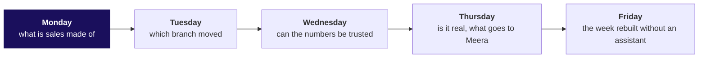
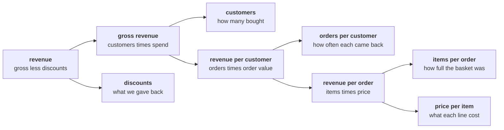

# The question before the budget

**Week 1, Monday. Study notes, read after the session.** Revenue is a tree of multiplied parts, a
number leaves the team with its definition, and the typical order is the one no single record can
move. Reading time: about 15 minutes.

---

## What you can now do

1. You can split a client's message into its separate questions and say which one gets answered
   when.
2. You can state a total with its definition and its window, and say why four honest totals can
   live inside the one word "sales".
3. You can draw revenue as a tree down to five leaves, write every branch as a numerator over a
   denominator, and say what moving each leaf costs.
4. You can keep a notebook honest with Restart and Run All, and read an error from its last line
   up.
5. You can count, sum, count distinct values and filter with one accumulator pattern.
6. You can choose between the mean and the median on purpose, and defend the choice in one
   sentence.

---

## Where this sits

**What the session covered.** Worked in full: Meera's ask split into questions, four readings of
"sales", the revenue tree with its denominators and its bills, the kernel, records as
dictionaries, the accumulator and the TypeError that stopped it, distinct customers, the first
rate, a filter, and the mean against the median on the day's thirty orders. Mentioned only: sets,
as the faster distinct count, and cleaning a field, which is Wednesday's work.


```mermaid
flowchart LR
    M["<b>Monday</b><br/>what is sales made of"] --> T["<b>Tuesday</b><br/>which branch moved"]
    T --> W["<b>Wednesday</b><br/>can the numbers be trusted"]
    W --> H["<b>Thursday</b><br/>is it real, what goes to Meera"]
    H --> F["<b>Friday</b><br/>the week rebuilt without an assistant"]
    classDef today fill:#1A0F5C,stroke:#1A0F5C,color:#FFFFFF
    class M today
```

This map of the week is this programme's own construction, drawn from the Week 1 rows.

**The outcome tie.** Thursday's recommendation to Meera is assembled from today's three parts: the
tree, a definition beside every number, and a typical order that one record cannot move.

**What was left out.** Grouping revenue by segment and by channel, which Meera asked for, waits for
Tuesday, when the file has two quarters to compare. Deciding what counts as a valid amount, and what
happens to rows that are not, waits for Wednesday.

---

## The picture to remember: the tree


```mermaid
flowchart LR
    R["<b>revenue</b><br/>gross less discounts"] --> G["<b>gross revenue</b><br/>customers times spend"]
    R --> D["<b>discounts</b><br/>what we gave back"]
    G --> C["<b>customers</b><br/>how many bought"]
    G --> V["<b>revenue per customer</b><br/>orders times order value"]
    V --> F["<b>orders per customer</b><br/>how often each came back"]
    V --> O["<b>revenue per order</b><br/>items times price"]
    O --> B["<b>items per order</b><br/>how full the basket was"]
    O --> P["<b>price per item</b><br/>what each line cost"]
```

Read it left to right: each box is made of the boxes it points to. Every section below adds one line
to the note the team owes Meera, and by the last section the note is written.

---

## "Sales" has four readings, and the note names one

The thirty orders total Rs 5,44,810 booked, Rs 5,35,760 not cancelled and Rs 5,20,790 delivered, and
the file cannot say what was kept after discounts because it has no discount field. All four are
correct arithmetic; each answers a different question, from how much demand reached Kalpa to how much
it kept.

The error is a number without its definition, so the first line of the note is:

> Revenue, all booked orders, 1 July to 26 September: Rs 5,44,810.

**WATCH OUT.** The smallest total feels safest and is not automatically the honest one. The honest
total is whichever one answers the question asked, written with the words that say which.

---

## The tree, and why every branch needs a denominator

Revenue broken once is customers times revenue per customer. Broken all the way down, gross revenue
is customers, times orders per customer, times items per order, times price per item, and discounts
come off the top. The units prove it: customers times orders per customer gives orders; times items
per order gives items; times price per item gives rupees.

| Leaf | Numerator over denominator | In today's file | What moving it costs |
|---|---|---|---|
| Customers | Distinct customer ids, a count | Yes | Marketing spend; new buyers may never return |
| Orders per customer | Orders over distinct customers | Yes | Loyalty and service; it may pay people who would return anyway |
| Items per order | Items over orders | No items in the file | Merchandising; baskets fill with low-margin lines |
| Price per item | Revenue before discounts over items | No items in the file | Volume, as the price-sensitive leave |
| Discounts | Rupees given back over revenue before discounts | No discount field | Margin, traded for quantity |

Because the branches multiply, small lifts compound: 10 percent on two branches gives 1.10 times
1.10, which is 21 percent, and a 15 percent discount that buys 10 percent more volume leaves revenue
at 1.10 times 0.85, which is 0.935. Marketing's Rs 12 crore is a bet on one leaf out of five, placed
before anyone checked which leaf is short.

The note's second line names what the file can and cannot answer:

> Customers and frequency are counted; basket, price and discounts need order lines, list prices and
> discounts, which this file does not carry.

**WATCH OUT.** A rate upside down still looks like a number. Orders per customer is 30 over 23, which
is 1.30; 23 over 30 is 0.77 and describes nothing.

---

## A notebook is only as true as its last clean run

The kernel remembers the cells it ran, in the order it ran them, since it last restarted. The page
shows cells in order and is not the kernel's memory, so a cell that uses a name no earlier run has
made stops with `NameError: name 'ORDERS' is not defined`.

The silent version is worse: a notebook that works only because a cell since deleted ran earlier.
The one test that catches it is Restart and Run All before every commit, every share and every number
that goes to Meera, and the brackets beside each cell, `In [1]`, `In [2]`, `In [3]`, show whether the
run order matched the page.

**CALLBACK.** Week 0, Monday's setup check ran a notebook cold for the first time; today made it a
rule.

---

## Counting is an accumulator, until the file breaks it

An accumulator makes three moves: start a total before the loop, update it once per record inside
the loop, and read it after the loop. Every leaf on the tree is these three moves with a different
update.

```python
revenue = 0
for order in ORDERS:
    revenue += order["amount"]
```

On the day's file this stopped part way through the list with
`TypeError: unsupported operand type(s) for +=: 'int' and 'str'`: a number on the left, text on the
right. Two names survive the crash, `revenue` with the total the loop reached and `order` with the
record it stopped on, which is where the reading starts.

`int()` made the total add up, and it is a patch: `int("1,20,000")` fails with a ValueError, because
an Indian comma is not part of a whole number. The note's third line says what was patched:

> One amount arrived as text and was converted; we are checking the file for others.

**CALLBACK.** Week 0, Wednesday's librarian's log used the same three moves and read its tracebacks
from the bottom up.

---

## Customers, the first rate, and a filter

Thirty rows are thirty orders, not thirty people. Counting customers means counting each
`customer_id` once, which a list and `not in` do: 23 customers, of whom 16 bought once and 7 came
back for a second order. The seven extra rows are real orders, which the order ids prove, since all
thirty are different; a customer coming back and a record entered twice look the same in a count.

A rate leaves the team with its numerator, its denominator and its window, and `round(30 / 23, 2)`
prints 1.3, since the value 1.30 is the number 1.3; an f-string such as `f"{rate:.2f}"` shows the
two places a report needs. A filter is an `if` inside the same accumulator: delivered revenue is Rs
5,20,790, returned Rs 14,970 and cancelled Rs 9,050, and the three add back to Rs 5,44,810, which is
the first check a senior runs.

> Orders per customer, all booked orders, 1 July to 26 September: 30 over 23, 1.30.

**WATCH OUT.** A key typed from memory fails exactly: `ORDERS[0]["Amount"]` raises
`KeyError: 'Amount'`, because the key is `amount`.

---

## The average that lies

Revenue per order is a mean: Rs 5,44,810 over 30 orders is Rs 18,160. The median, the middle of the
thirty sorted amounts, is Rs 2,205, the average of the fifteenth and sixteenth values, so the mean
sits about eight times above the order in the middle. Something at the top of the sorted list pulls
it there, and reading the top of that list is how the room found out what.

The mechanism, on five invented orders: Rs 1,900, 2,100, 2,200, 2,400 and 2,600 have a mean of Rs
2,240 and a median of Rs 2,200. Replace the last with a bulk order of Rs 90,000 and the mean moves to
Rs 19,720 while the median stays at Rs 2,200. Changing one value by d moves the mean by d over n,
here 87,400 over 5, and moves the median not at all unless the change crosses the middle.

| The number is for | Report | Because |
|---|---|---|
| A typical order | The median | One record cannot drag it |
| A total that must add up | The mean | It multiplies back to the total |
| A first look at a file | Both | The gap between them is itself a finding |

**CALLBACK.** Week 0, Tuesday's diagnostic discussion made the same choice on five customers, where
one bulk buyer carried 86 percent of the spend; today it happened on Kalpa's own file.

**IN THE FIELD.** The US Census Bureau's annual report on household income leads with the median:
median household income was $83,730 in 2024 (Income in the United States: 2024, published 9 September
2025). Incomes, like order values, have a few values far above the rest, and the headline describes
the household in the middle.

The note's last line, and its shape:

> The typical order is Rs 2,205, the median of thirty; the mean is eight times higher, so the note
> leads with the median and names the large order on its own line.

---

## Where this shows up in the work

**A growth review with a budget on the table.** A spend is proposed for one branch. The first
deliverable is the tree with that branch marked and the comparison that would show whether it is the
short one, which costs days while the spend costs crores.

**A reconciliation with Finance.** Two totals disagree. The first question is whether they share a
definition, because booked and delivered revenue differ on the same file without anything being
wrong.

**A dashboard's average order value.** A mean is shown as the typical order. The question to ask is
what the median is, and whether a handful of large orders sits behind the gap.

---

## Try this yourself

No writing: pick a letter for each, then check the key.

1. A total leaves the team without its definition. What is missing? a) its median; b) which orders
   it counts and over which dates; c) the number of customers; d) nothing.
2. Orders rise 10 percent at a steady price, and items per order fall 10 percent. Revenue: a) is
   unchanged; b) rises 1 percent; c) falls 1 percent; d) falls 10 percent.
3. A cell uses a name made by a cell that has not run since the restart. It raises: a) a NameError;
   b) a KeyError; c) a TypeError; d) nothing.
4. Thirty orders, twenty-three distinct customer ids, thirty distinct order ids. The seven extra
   rows are: a) duplicates; b) blank ids; c) a loop bug; d) repeat orders.
5. Eleven amounts, sorted. The median is at index: a) 4; b) 5; c) 6; d) the average of 5 and 6.
6. The note needs a typical order and the list has one bulk order. Report: a) the median, with the
   bulk order named; b) the mean; c) the mean without the bulk order; d) the bulk order.

Key: 1b 2c 3a 4d 5b 6a. If you missed 1, reread "Sales has four readings"; 2, the tree section (1.10
times 0.90 is 0.99); 3, the notebook section; 4, the customers section; 5, the median by hand in
notebook 4; 6, the average that lies.

---

## Where this gets tested

**[S] How would you increase sales for an online retailer?** Tested: structure before tactics.
Strong: the tree, the branch that is short found by comparing two periods, and the cheapest lever on
that branch with its measure. Weak: a list of ideas with no branch named.

**[S] Mean or median for order value, and why?** Tested: choosing by purpose. Strong: the median for
the typical order because order values are skewed, the mean for anything that must reconcile to a
total, and both on a first look. Weak: "the median is more accurate".

**[F] A business says "grow revenue 15 percent"; how do you turn that into questions data can
answer?** Tested: translation. Strong: baseline and window, the tree, the data and denominator per
driver, the gap sized per driver, and the decision each answer changes. Weak: jumping to a model.

**[SV] A list against a dictionary: when do you reach for each?** Tested: the access pattern.
Strong: a list for order and walking every item, a dictionary for lookup by name, records as a list
of dictionaries. Weak: a definition with no example.

**[D] Marketing wants budget for acquisition; what would you check before agreeing it is the right
branch, and how would you say no?** Tested: judgement under pressure. Strong: agree the goal, name
the two-quarter comparison of customers and frequency, and make the no a cheaper first step. Weak: a
flat refusal, or agreement without a check.

---

## Glossary

| Term | What it means here | Where it appeared | Example |
|---|---|---|---|
| Revenue tree | Revenue drawn as the counts and prices that multiply into it, less discounts | Half one, S7; notebook 1 | Customers times orders per customer times items per order times price per item, less discounts |
| Denominator | What a rate is divided by, said aloud before it is computed | Half one, S8; notebook 1 | Orders per customer is over distinct customers |
| Definition | The words that say which orders a total counts and over which dates | Half one, S4; notebook 1 | All booked orders, 1 July to 26 September |
| Accumulator | A total started before a loop, updated once per record, read after it | Half one, S22; notebook 2 | `revenue += int(order["amount"])` |
| Kernel | The Python process that remembers the cells it ran since its restart | Half one, S16; notebook 2 | A NameError after a restart |
| Median | The middle of the sorted values, or the average of the two middles | Half two, S14; notebook 4 | Rs 2,205 for the day's thirty orders |
| Mean | The total spread evenly over the count | Half two, S12; notebook 4 | Rs 18,160, revenue over orders |
| Skew | A few values far above the rest, pulling the mean from the median | Half two, S19; notebook 4 | The mean eight times the median |

---

## Go deeper

| Order | What | Time | Why this one |
|---|---|---|---|
| 1 | MConsultingPrep, "6 Variants of Profitability Framework", the first two variants, https://mconsultingprep.com/profitability-case-framework (verified 28 Sep 2026) | 20 minutes | The revenue side of the case-interview framework, which is today's tree |
| 2 | Hacking the Case Interview, the profitability case guide, https://www.hackingthecaseinterview.com/pages/profitability-case-interview (verified 28 Sep 2026) | 25 minutes | How the tree is spoken aloud in an interview |
| 3 | Automate the Boring Stuff with Python, 3rd edition, chapters 2 and 3, https://automatetheboringstuff.com/3e/ (verified 28 Sep 2026) | 45 minutes | if-else and loops, the two pieces the accumulator is made of |
| 4 | US Census Bureau, "Income in the United States: 2024", the highlights, https://www.census.gov/library/publications/2025/demo/p60-286.html (verified 28 Sep 2026) | 10 minutes | A national statistic that leads with the median |
