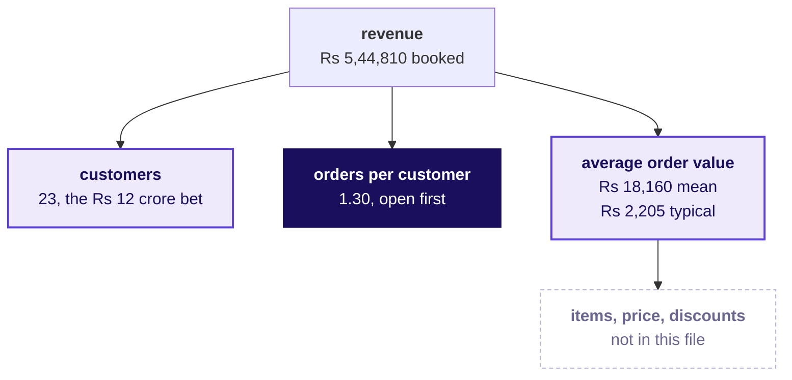

# Is acquisition even the branch that is short?

**Week 1, Monday · Python through data · Kalpa Retail, the revenue tree and the first honest numbers**

Before Meera Raghavan, Kalpa Retail's CEO, signs Rs 12 crore for new customers, is acquisition even
the branch of sales that is short? Six chapters on 30 orders climb that question, each in six steps:
who needs the answer, the options sized, the build, the plausible wrong number and its check, a second
route, and Kavya's review.

About a 30 minute read · 2 figures and 3 tables

---

## What can you do now that you could not do this morning?

- You can say who at Kalpa asks for a metric, what a wrong number costs them, and which real company
  faces the same question.
- You can size two to four ways to answer a data question and make the best-fit call with the fact
  that would change it.
- You can report sales with its definition and build each branch of the revenue tree as a fraction on
  one definition, checked by multiplying back.
- You can count customers by id, choose the median on purpose, recompute lifts through the tree, and
  write the four-part sentence a stakeholder signs.

---

## Where does Monday sit in the week and in the programme?

Monday works the retail story, six chapters on Kalpa's 30 orders and two cases in full, and only
patches the amount stored as text with `int()`; Wednesday gives that a rule.

```mermaid
flowchart LR
    M["<b>Mon</b><br/>the revenue tree"] --> T["<b>Tue</b><br/>which branch moved"] --> W["<b>Wed</b><br/>which figure is right"] --> H["<b>Thu</b><br/>real or noise"] --> F["<b>Fri</b><br/>the week rebuilt cold"]
    classDef unknown fill:#FFFFFF,stroke:#B8B2D6,color:#6B6690,stroke-dasharray:4 3
    classDef today fill:#1A0F5C,stroke:#1A0F5C,color:#FFFFFF
    class T,W,H,F unknown
    class M today
```

Monday rests on Week 0's loops and its four questions before any proposal. Comparing two windows
waits for Tuesday, and by Thursday Meera expects a recommendation on which branch to examine first,
built from today's tree, definitions, typical order and caveat. The business in full is the domain
dossier, `study-notes/C2_W01_D01_domain_retail_STUDENT.md`, with its card in
`cheatsheets/C2_W01_D01_retail_domain_card_STUDENT.pdf`.

---

## What does Kalpa's revenue tree look like with Monday's numbers on it?

```mermaid
flowchart TB
    R["<b>revenue</b><br/>Rs 5,44,810 booked"] --> C["<b>customers</b><br/>23, the Rs 12 crore bet"]
    R --> F["<b>orders per customer</b><br/>1.30, open first"]
    R --> A["<b>average order value</b><br/>Rs 18,160 mean<br/>Rs 2,205 typical"]
    A --> I["<b>items, price, discounts</b><br/>not in this file"]
    classDef known fill:#EEEAFB,stroke:#5B3FD6,color:#1A0F5C,stroke-width:2px
    classDef unknown fill:#FFFFFF,stroke:#B8B2D6,color:#6B6690,stroke-dasharray:4 3
    classDef bet fill:#1A0F5C,stroke:#1A0F5C,color:#FFFFFF
    class C,A known
    class I unknown
    class F bet
```

The revenue tree is the one picture to redraw from memory: revenue is customers, times orders per
customer, times average order value, and order value is items times price, less discounts. Each
chapter writes one number onto it, and the dark box is the branch the day opens first.

---

## How does a retailer like Kalpa make money, who asks the data team for which number, and how is each number worked out?

**Who needs the answer.** You do, before any number leaves the team, since each person who asks for
one decides something with it, and a number worked out without that decision in mind can send a
budget to the wrong branch.

**The questions on the way.** Which real companies look like Kalpa? How much of Rs 100 at the
checkout does Kalpa keep? Who asks the data team for which number? How is each retail number worked
out from the tree? What did Meera ask before signing Rs 12 crore?

### Which real companies look like Kalpa?

Kalpa Group is fictional. It runs five units from Singapore, and its data and AI team, the one you have
joined, sits in its Global Capability Centre (GCC) in Bengaluru. Kalpa Retail sells consumer goods
through an app, a website and stores in India and South-East Asia, to households and to businesses.
Reliance is the nearest real group, with Jio's 533 million subscribers and Reliance Retail's 20,169
stores in the quarter to June 2026 (Reliance Industries media release, 17 July 2026). The dossier's
section 2, on which real companies work the way Kalpa Retail does, names the others.

### How much of Rs 100 at the checkout does Kalpa keep?

Gross merchandise value, GMV, is everything customers ordered at the prices charged. Net revenue, the
smaller figure Finance reports as earned from the goods, differs from it, and chapter 1 asks what
fills the gap. On the dossier's illustrative numbers Rs 100 of GMV becomes Rs 80 of net
revenue, then Rs 20 of gross margin after the cost of the goods, Rs 7.50 of contribution after
per-order costs such as delivery, and Rs 2.50 of EBITDA (earnings before interest, tax, depreciation
and amortisation) after fixed costs. DMart's profit after tax was 4.8 percent of its FY26 revenue
(DMart results release, 2 May 2026).

### Who asks the data team for which number?

Meera Raghavan, the CEO, asks where growth comes from, and Anand Iyer, the finance controller, asks
whether our numbers match his books. The marketing lead asks whether Kalpa needs more customers, the
head of Retail-Plus, the paid membership tier, asks whether his tier is slipping, and Kavya Nair, the
senior analyst, checks every number first. A wrong dashboard figure can be corrected before anyone
acts on it, and a budget already spent cannot be taken back; the dossier's section 4, on who
decides what at Kalpa Retail, draws the whole chart.

### How is each retail number worked out from the tree?

Revenue is a product, customers x orders per customer x average order value (AOV), and each branch,
like most retail metrics, is a numerator over a denominator: AOV is revenue / orders and orders per
customer is orders / customers. Payback, which marketing's Rs 12 crore will be judged on, is the cost
of winning a customer over the contribution that customer brings each month. The dossier's section 5,
on which numbers run Kalpa Retail, gives the others.

### What did Meera ask before signing Rs 12 crore?

Revenue grew 4 percent last year against a plan of 15, and marketing wants Rs 12 crore to acquire
customers. Meera writes, "Before I sign anything, I want to understand our own sales. What is 'sales'
made of? Where does revenue come from, by customer type and channel? Is acquisition even the branch
that is short?" Anand adds, "No averages. One business customer can move an average."

A retailer keeps a thin slice of what it sells, each of its numbers answers one person's decision, and
all of them hang off the revenue tree, where Meera's question begins.

---

## Chapter 1: Which of the file's totals should Meera call sales, and what does each one count?

**Who needs the answer.** Meera measures her 15 percent plan from this total and Anand checks it
against his books, so unsold orders inside it set the plan's base too high and cost the team his
trust.

**The questions on the way.** Who needs one number called sales, and what does a wrong one cost?
Which way of answering fits this file? Which reading of sales comes out largest? What goes wrong if
all 30 orders are sent as sales? Do sums by status reach the same totals? Which number goes on the
tree's root?

### Who needs one number called sales, and what does a wrong one cost?

Meera plans from it and Anand checks it. Kalpa's extract holds 30 orders from 1 July to 26
September, an 88-day window, and each is delivered, returned or cancelled. Reliance Retail reported
gross revenue of Rs 90,408 crore and revenue from operations of Rs 79,745 crore for the quarter to
June 2026, with recovered GST between them (Reliance Industries media release, 17 July 2026), so two
honest totals are normal, and one sent without its name measures the plan from a base nobody chose.

### Which way of answering fits this file?

Adding every amount takes a second and counts cancelled orders as sales. Summing by status touches the
same 30 rows once and names every rupee between three readings. Finance's figure takes a day, and
ticking by hand cannot scale. Summing by status fits a first look, unless Finance has already fixed
the plan's definition.

### Which reading of sales comes out largest?

One loop keeps three sums, and a `TypeError` on the first run means one amount is stored as text, so
wrap it in `int()` and move on. Booked comes out largest: every order placed, Rs 5,44,810 on 30. Not
cancelled, what left the shelf, is Rs 5,35,760 on 26, and delivered, what reached the customer and
stayed, is Rs 5,20,790 on 21. With no discount field, sales after discounts cannot be worked out.

### What goes wrong if all 30 orders are sent as sales?

A colleague's draft reads, "Sales this quarter: Rs 5,44,810 on 30 orders." Inside it ride 4 cancelled
store orders worth Rs 9,050, so store's count is 4 orders in 10 too high. The check counts orders by
channel and status first: 21 delivered, 5 returned, all on web, and 4 cancelled, all in store. The fix
names the definition and bridges it, less Rs 9,050 cancelled and Rs 14,970 returned, to Rs 5,20,790
delivered. Those Rs 24,020 are the story's gap between GMV and net revenue as it shows in this file,
and GST is the rest.

### Do sums by status reach the same totals?

They do. A dictionary of rupees by status, Rs 5,20,790 delivered, Rs 14,970 returned and Rs 9,050
cancelled, adds back to booked, and delivered plus returned gives not cancelled, to the rupee.

### Which number goes on the tree's root?

Booked, Rs 5,44,810, goes on the root, named, with the bridge beside it, since chapters 2 to 6 build on
the same 30 orders; the total the plan uses is Meera's call with Finance.

**Kavya's review.** "You found Rs 9,050 that was never a sale by counting before adding. Which
definition Meera plans on is her call; your job is to make sure she can see which one she is
reading."

Sales is whichever of three honest totals is named beside it: booked Rs 5,44,810 counts every order,
not cancelled Rs 5,35,760 what left the shelf, and delivered Rs 5,20,790 what stayed.

---

## Chapter 2: How does sales split into customers, orders per customer and order value, each a fraction on one definition?

**Who needs the answer.** Meera needs the branches to see which one is short, and marketing's payback
values each new customer by one of them, so a branch built on two definitions overvalues every
customer the Rs 12 crore would buy.

**The questions on the way.** Who needs the branches, and why as fractions? Which tree can this file
fill? What is the average order value? What goes wrong when booked rupees are divided by delivered
orders? Does the mean of the 30 amounts agree? Which branches does the file still lack?

### Who needs the branches, and why as fractions?

Meera needs them to find the short branch, and chapter 1 put booked revenue, Rs 5,44,810 on 30
orders, on the root. The branches multiply back to revenue, so each must count the same orders in the
same window. Reliance reports Jio as such a tree,
533 million subscribers at Rs 215.6 of revenue per user a month (Reliance Industries media release,
17 July 2026).

### Which tree can this file fill?

Orders x AOV needs only the amount and hides who buys, while customers x orders per customer x AOV
needs the amount and the customer id, both in the file. A deeper tree needs items, prices and
discounts and a funnel needs traffic, neither of which the file holds. The three-branch tree fits, and order
lines with items and prices would move the call.

### What is the average order value?

AOV is Rs 5,44,810 / 30, about Rs 18,160, and 30 x (Rs 5,44,810 / 30) gives booked revenue back
exactly, as it always will, so a wrong branch shows only in the split. On delivered orders AOV is
Rs 5,20,790 / 21, about Rs 24,800.

### What goes wrong when booked rupees are divided by delivered orders?

A hurried analyst divides Finance's booked revenue by the dashboard's delivered orders and tells
marketing, "Our average order is Rs 25,943." The rupees of the 9 cancelled and returned orders stay in
the numerator while those orders leave the denominator, so 30 x (Rs 5,44,810 / 21) claims
Rs 7,78,300, 43 percent more than anyone booked. The check is the identity, AOV times the orders its revenue was summed over,
and the fix is one definition per fraction: Rs 18,160 booked or Rs 24,800 delivered.

### Does the mean of the 30 amounts agree?

`statistics.fmean(amounts)` reaches the same Rs 18,160 from the rows, the route for rows in hand,
where the totals route suits a report.

### Which branches does the file still lack?

Items per order, price per item and discounts are not in this extract, so the tree stops at AOV and
the answer says so.

**Kavya's review.** "Write each branch as a numerator over a denominator. When two reports feed one
fraction, ask each what it counts before you divide."

Sales on this file is customers, times orders per customer, times an AOV of Rs 18,160 booked or
Rs 24,800 delivered, each a fraction on one definition.

---

## Chapter 3: How many customers does Kalpa have, and how many came back for a second order?

**Who needs the answer.** Meera needs it before deciding whether acquisition is the only way to grow.
If nobody returns, the Rs 12 crore looks like the only lever, so a wrong count funds the wrong branch.

**The questions on the way.** Who needs the customer count, and what rides on it? How do we count
customers when a row is an order? How many came back? What goes wrong if every row is counted as a
customer? Does the mean of the counts agree? Which count goes on the tree's customer branch, and on which
definition?

### Who needs the customer count, and what rides on it?

The marketing lead owns the customers branch the Rs 12 crore buys, and the head of Retail-Plus the
members who return. Reliance Retail reports 396 million registered customers (Reliance Industries
media release, 17 July 2026), a denominator of its own, since orders over registered customers is a
smaller metric than orders per customer who ordered.

### How do we count customers when a row is an order?

`len(ORDERS)` counts orders, and `len(set(ids))` counts distinct ids in one pass. A dictionary of
orders per id counts customers and who came back in one pass, and sorting ids by hand is easy to
miscount. The dictionary fits, since Meera's question turns on who came back; at millions of rows it
becomes `COUNT(DISTINCT customer_id)` in the warehouse, in Week 2.

### How many came back?

The dictionary holds 23 customers, of whom 16 bought once and 7 came back, so orders per customer is
30 / 23, about 1.30, and 23 x (30 / 23) x (Rs 5,44,810 / 30) lands on Rs 5,44,810.

### What goes wrong if every row is counted as a customer?

A colleague's draft says, "30 customers placed 30 orders: 1.00 each, so nobody comes back." A row is
an order and one customer can place several, so the draft makes the Rs 12 crore look like the only
way to grow. The check compares the id list's length with its set's, 30 against 23, and the fix is 23
customers at 1.30 orders each.

### Does the mean of the counts agree?

(16 x 1 + 7 x 2) / 23 gives the same 1.30, and the counts show the spread the ratio hides, 16
customers at one order and 7 at two.

### Which count goes on the tree's customer branch, and on which definition?

The branch carries 23 customers at 1.30 orders each, written as booked orders from 1 July to 26
September, because every leaf moves with the definition it was counted on. The escalated case
recounts it on the orders that stayed delivered.

**Kavya's review.** "Your first 30 was a count of rows, divided as if it were people. A count of
people comes from their ids."

Kalpa's quarter has 23 customers at 1.30 orders each, and 7 of them came back for a second order,
so repeat buying already happens.

---

## Chapter 4: What does a typical Kalpa order look like, stated so that one large order cannot move it?

**Who needs the answer.** Marketing values each new customer by the order they will place and Meera
signs the budget on that payback, so a first order valued about eight times too high makes Rs 12 crore
look cheap. Anand has already warned against averages.

**The questions on the way.** Who needs a typical order, and what does it price? Which middle
survives one large order? What is the median order? What goes wrong when the mean is sold as
typical? Does Python's statistics.median agree? What goes into the payback case?

### Who needs a typical order, and what does it price?

Marketing prices a new customer's first order with it, and chapter 2's AOV of Rs 18,160 is the number
on hand. Blinkit reported a net average order value of Rs 518 for the quarter to June 2026 (MediaNama
on Eternal's Q1 FY27 earnings call, July 2026), and a reported AOV is a mean, right for totals across
millions of similar baskets and wrong for one basket when a few very large orders share the file.

### Which middle survives one large order?

When one invented Rs 90,000 order joins five invented orders of Rs 1,900 to Rs 2,600, the mean moves
Rs 14,623, the median Rs 50, and a trimmed mean Rs 83, though it needs a rule for how many to drop. A
mean per customer type stays put and needs the types. The median fits a typical order, with the mean
kept for totals.

### What is the median order?

The 15th and 16th sorted amounts are Rs 2,110 and Rs 2,300, so the median is Rs 2,205, about one
eighth of the mean. It holds at Rs 2,100 not cancelled and Rs 2,060 delivered, while the mean swings
from Rs 18,160 to Rs 24,800.

### What goes wrong when the mean is sold as typical?

Marketing's slide reads, "A typical Kalpa order is Rs 18,160, and so is each new customer's first
order." Only 1 of the 30 orders sits above that mean, so a payback built on it overstates a typical
order about eightfold. The check is that count; sort the amounts yourself to see which order sits
above the mean and what kind of order it must be. The fix quotes the median, Rs 2,205, and keeps the
mean for totals.

### Does Python's statistics.median agree?

`statistics.median` applies the even-count rule, the average of the two middles, and matches the
hand-written middle on every definition.

### What goes into the payback case?

A payback adds up what a customer brings over time, so it needs a mean over the customers the spend
targets. Meera's plan concerns the three consumer segments, Retail-Core, Retail-Plus and Student,
whose mean order is Rs 2,235, and the median goes beside it as the typical order.

**Kavya's review.** "Put the median in the sentence, say the mean is about eight times higher, and
say how many orders sit above it."

A typical Kalpa order is Rs 2,205, the median, which one large order cannot move, and the payback uses
the consumer segments' mean of Rs 2,235.

---

## Chapter 5: Which branch should Meera open first to reach the 15 percent plan, and why not the others?

**Who needs the answer.** Meera must pick a branch before she signs, and a wrong call puts Rs 12
crore on a branch that was not short.

**The questions on the way.** Who needs the branch, and which base is the plan sized on? What would
each branch have to do alone? Which branch has evidence behind it? What goes wrong when two 10 percent
lifts are called 20 percent? Do the four parts land on the same total? What would switch the call?

### Who needs the branch, and which base is the plan sized on?

The marketing lead owns acquisition and the head of Retail-Plus the members who return. Meera's plan
concerns the three consumer segments, so it is sized on the consumer view, the orders whose segment is
Retail-Core, Retail-Plus or Student: Rs 64,810 booked at a mean of Rs 2,235 an order, so 15 percent is
about Rs 9,722 more, a target of about Rs 74,532. Flipkart Black at Rs 1,499 a year (Flipkart
Stories, 12 September 2025) and Amazon Prime at Rs 399 to Rs 1,499 a year in India (About Amazon
India) both pay existing customers to come back more often, a bet on frequency.

### What would each branch have to do alone?

| Branch | What the plan needs from it alone | Evidence in this file |
|---|---|---|
| Customers | It needs 15 percent more customers who buy like today's. | There is none, since one quarter cannot show customers falling. |
| Orders per customer | It needs 15 percent more orders from the same customers, about three in ten of the consumer one-time buyers returning once. | 7 of the 23 customers already came back. |
| Order value | It needs Rs 335 more on every order, from Rs 2,235 to Rs 2,570. | There is none, since items and prices are not in the file. |
| Price | It needs every price 15 percent higher with nobody buying less. | There is none, and no price may exceed the maximum retail price (MRP) on the pack. |

Each line multiplies back to the target through the tree.

### Which branch has evidence behind it?

Frequency does: 7 of the 23 customers already came back, and a reorder reminder to people on the list
costs little, while acquisition must find people Kalpa has never met for the same 15 percent.

### What goes wrong when two 10 percent lifts are called 20 percent?

Marketing's slide reads, "Fund both: 10 percent more customers and 10 percent more orders make 20
percent, Rs 77,772 on the consumer view." The lifts multiply, 1.10 x 1.10 = 1.21, so the total is
Rs 78,420, Rs 648 above the slide, and two 30 percent lifts make 69 percent where addition says 60.
Addition misprices a discount too: 15 percent off with 10 percent more orders is 0.85 x 1.10 = 0.935, a
6.5 percent fall, and orders must rise about 17.6 percent before the discount holds revenue. The check
is to recompute through the tree.

### Do the four parts land on the same total?

Rs 64,810, plus Rs 6,481 for customers, Rs 6,481 for frequency and Rs 648 for the lift on the lift, is
Rs 78,420, and the parts show marketing the lift on the lift as its own line.

### What would switch the call?

A second quarter showing customers falling while frequency held, or retention costing more per order
it keeps than acquisition costs per customer it wins, would move the call to acquisition.

**Kavya's review.** "Pick the branch the evidence points at and the one that costs least to test,
then say what would make you pick another."

Meera should open frequency first: the plan's Rs 9,722 asks the same 15 percent of either customer
branch, and only frequency has evidence and a test that costs a reminder.

---

## Chapter 6: What one sentence can Meera sign, with its evidence, its branch, its caveat and its ask?

**Who needs the answer.** Meera signs it, Kavya reviews it first and the marketing lead reads it for
its weakest number, so a figure marketing can knock down with one question costs the week's trust.

**The questions on the way.** Who reads the sentence, and what will they look for? Which form carries
the decision? What does the first draft say? How many of the 16 one-time buyers are really lost? Do
due dates find the same 9 too-recent buyers? What does the sentence Meera signs say?

### Who reads the sentence, and what will they look for?

Meera reads it for the decision and its limit, marketing for the repeat picture. Klarna said in
February 2024 that its AI assistant handled two-thirds of customer-service chats in its first month
(Klarna press release, 27 February 2024), and fifteen months later its chief executive said the focus
on cost had lowered quality (Fortune, 9 May 2025), so one early window does not settle a question.

### Which form carries the decision?

One number, 1.30 orders each, takes two seconds and decides nothing, and the tree as a table takes a
minute and lets Meera pick. A sentence with evidence, branch, caveat and ask takes about twenty seconds
and carries the decision with its limit, so it fits today; a weekly dashboard takes weeks to build and
earns that cost once the question turns weekly, in Week 2.

### What does the first draft say?

Built from variables so that no number drifts, it reads: "On the 30 booked orders from 1 July to 26
September, 23 customers placed 1.30 orders each at a typical order of Rs 2,205, and 16 of them bought
only once, so I would open frequency before acquisition, and since one quarter cannot show which
branch moved, hold the Rs 12 crore until Tuesday's two quarters."

### How many of the 16 one-time buyers are really lost?

A colleague tightens it for a slide: "16 of 23 customers never came back: 70 percent of our customers
are lost." Being lost depends on orders after the window closes, which the file cannot show. The check
asks how long customers take to return: the 7 who did took a median of 45 days (11, 35, 43, 45, 46, 63
and 65), and 9 of the 16 ordered fewer than 45 days before the 88-day window closed. The fix is 7 came
back, 7 are past the usual gap and 9 are too recent to judge, and since the gap rests on 7 customers
in one quarter, 45 days is a floor.

### Do due dates find the same 9 too-recent buyers?

A one-time buyer's order date plus 45 days is their due date, and the 9 due after the window ends are
the same 9, now dated for a reminder.

### What does the sentence Meera signs say?

> "On the 30 booked orders from 1 July to 26 September, 23 customers placed 1.30 orders each at a
> typical order of Rs 2,205; 7 came back, 7 are past the usual gap without a second order, and 9
> bought too recently to judge, so I would open frequency before acquisition, and since one quarter
> cannot show which branch moved, hold the Rs 12 crore until Tuesday's two quarters."

**Kavya's review.** "Every number in it is one we can defend."

The sentence's evidence is 23 customers at 1.30 orders and a typical order of Rs 2,205, its branch is
frequency, its caveat is the window's edge and one quarter, and its ask is to hold the Rs 12 crore.

---

## Does the answer survive on the orders that stayed delivered?

**Who needs the answer.** Anand does, since he counts only what stayed sold and puts numbers before
the board; an answer that holds only on booked orders never reaches his books.

**The questions on the way.** How many customers kept a delivered order? What is the typical
delivered order? What does the plan ask of frequency? How many delivered one-time buyers are too
recent to judge? What moved and what held?

On the 21 delivered orders, 19 customers kept 1.11 orders each and only 2 kept two. The typical
delivered order is Rs 2,060, the 11th of 21 sorted amounts, since an odd count has one middle. On the
consumer view's delivered orders, frequency alone still needs 15 percent more orders from the same
customers, and 15 percent off with 10 percent more orders still loses 6.5 percent. Of the 17 delivered customers who kept one order,
7 bought fewer than 45 days before the window closed.

The answer survives: orders per customer fell from 1.30 to 1.11 while the typical order, the window's
edge and the branch held, and the note gains a leak, since 4 of the 7 returning customers lost their
second order to a cancellation or a return.

---

## Where does revenue come from, by customer type and channel, and does it change the branch?

**Who needs the answer.** Meera asked it in her first message, and a plan led by one channel's
headline share would invest where her consumer segments do not buy.

**The questions on the way.** Where does booked revenue come from by channel? Whose revenue is that
share? What does each channel keep once its orders are split by status? Does the channel view change
the branch?

Store brings 91.6 percent of booked revenue, and a plan drawn from that chart goes store-led. Meera's
plan concerns the three consumer segments, which booked Rs 64,810: Rs 32,650 from Retail-Core,
Rs 27,320 from Retail-Plus and Rs 4,840 from Student. Once the view keeps those segments, store's
share falls from 91.6 to 29.2 percent, so store's headline share came from outside them. On the
consumer view web leads with Rs 27,290, 42.1 percent, of which Rs 14,970 came back as returns; store
holds Rs 18,920, 29.2 percent, of which Rs 9,050 was cancelled; and app holds Rs 18,600, 28.7 percent,
all of it delivered.

**Kavya's review.** "Before a share goes to Meera, put it on the customers her plan concerns and
split it by status."

The channel view leaves the branch where it was: frequency stays first, and the note gains two leaks,
web returns and store cancellations.

---

## Which six lines should you carry out of Monday?

1. Name the definition before the number: booked, "not cancelled", or delivered.
2. Build every fraction on one definition, and check that it multiplies back.
3. Count customers by their id, never by the rows.
4. Report the median when one order can move the mean, and say why.
5. Lifts multiply along the tree: two 10 percent lifts make 21 percent.
6. A one-time buyer is not a lost customer until they have had time to come back.

---

## Can you answer six of today's questions with no notes and no code?

Pick a letter for each and note how sure you were before reading the key.

1. A report says "sales Rs 5,44,810" and nothing else. What does Meera still need? a) the median
   beside it; b) a count of the customers; c) which orders, and when; d) the split by channel.
2. Revenue from one report is divided by orders from another. What is the first check? a) round both
   to thousands; b) average the two figures; c) keep the larger of the two; d) multiply back to a total.
3. An extract has 40 rows and 40 distinct order ids. How many customers does it hold? a) unknown until
   ids are counted; b) fewer than 40, as ids repeat; c) exactly 40, one per order; d) more than 40, as
   orders are shared.
4. Eleven sorted amounts sit in a Python list. At which index is the median? a) 4; b) 5; c) 6;
   d) between 5 and 6.
5. Orders per customer rise 10 percent and AOV falls 10 percent with customers steady. What happens
   to revenue? a) no change; b) up 1 percent; c) down 10 percent; d) down 1 percent.
6. A customer bought once, three days before the extract ends, and repeat buyers usually take 45 days.
   How do you count them? a) lost to a rival; b) too recent to judge; c) a repeat customer; d) left out
   of the counts.

**The key, and what to re-read.** 1 c, since a total needs its reading and its window (chapter 1).
2 d, since mixed definitions multiply back to nothing (chapter 2). 3 a, since order ids say nothing
about people (chapter 3). 4 b, since Python counts from 0 (chapter 4). 5 d, since 1.10 x 0.90 is 0.99
(chapter 5). 6 b, since three days is far short of the usual gap (chapter 6).

---

## How would you answer the twelve interview questions Monday prepares you for?

The first five are the curriculum's anchors. The tags are [S] staple, [F] frequent in GCC and product
screens, [SV] service-major opener and [D] differentiator or design.

**[S] How would you increase sales for an online retailer?** "I draw revenue as customers x orders
per customer x order value and size what the target asks of each branch alone. In my case 16 of 23
customers bought once, and 15 percent needed 15 percent more customers or more orders from those
already there, so I opened frequency with the cheapest test first."

**[S] Mean or median for order value, and why?** "The median, since one large order moves the mean: on
thirty orders the mean was Rs 18,160, the median Rs 2,205, and only 1 order sat above the mean. The
mean stays for totals, and a first look reports both."

**[F] A business says "grow revenue 15 percent"; how do you turn that into questions data can
answer?** "I fix the base first: which revenue, over which window, for which customers. Then I size
what each branch must do alone, compare two periods to find the gap, and name the decision each
answer changes."

**[SV] A list against a dictionary: when do you reach for each?** "A list to keep order and walk every
record, a dictionary to count or look up by a key such as the customer id, and a set for distinct
values; records arrive as a list of dictionaries."

**[D] Marketing wants budget for acquisition; what would you check before agreeing it is the right
branch, and how would you say no?** "I count customers by id and who came back, price a new customer
on the targeted segments' mean order, Rs 2,235 in my case, and ask for the prior quarter. My no is a
no for now, with a date and a cheaper frequency test, and if customers turn out to be the branch that
fell, the budget follows."

**[F] What counts as "sales": booked, net of cancellations, or delivered, and which do you give a
CEO?** "Booked is what was ordered, not cancelled what left the shelf, delivered what stayed:
Rs 5,44,810, Rs 5,35,760 and Rs 5,20,790 on one file. The CEO gets the one her plan was set on, named,
with the bridge."

**[D] How would you decide between summing the file yourself and asking Finance for the number?** "By
who acts on it: summing by status for a first look, Finance's books for anything the board sees."

**[F] Your extract shows 30 orders and 30 customers; what do you check before saying nobody comes
back?** "Whether 30 means rows or distinct ids; in my case 30 rows held 23 customers, 1.30 orders
each. I also check the window, since a customer who buys every four months looks one-time in a
quarter."

**[D] Which middle would you put in a payback model, and what would make you change it?** "A mean,
since a payback is a total, over the segments the spend targets, with the median beside it as the
typical order; a new target segment means a new mean."

**[F] A 10 percent lift in customers and a 10 percent lift in frequency make 20 percent growth; what
is the right number, and when does it matter?** "Revenue multiplies its branches, so 1.10 x 1.10 =
1.21, 21 percent: Rs 78,420 on Rs 64,810 of consumer orders, against the Rs 77,772 addition gives. It matters when lifts are large or negative: two 30 percent lifts make 69
percent, and 15 percent off with 10 percent more orders loses 6.5 percent."

**[D] You have one quarter of orders and 70 percent of customers bought once; what do you tell the
CEO?** "That 70 percent bought once in this window, which is no churn rate. Returning customers took a
median of 45 days and 9 of the 16 bought inside that gap, so 7 came back, 7 are past it and 9 are too
recent, and I ask for the prior quarter before calling anyone lost."

**[D] One channel carries nine rupees in ten of revenue; does that change where the growth plan
invests?** "Not until I know whose revenue it is: store's 91.6 percent fell to 29.2 percent on the
consumer segments the plan concerned, and split by status it showed two leaks, web returns and store
cancellations, while the plan stayed on frequency."

---

## What does each of today's terms mean?

| Term | In plain words | Where it appeared | An example |
|---|---|---|---|
| Revenue tree | Revenue is split into metrics that multiply. | The picture | Customers x orders per customer x AOV |
| Booked revenue | It counts every order placed. | Chapter 1 | Rs 5,44,810 on 30 orders |
| Delivered revenue | It counts orders that arrived and stayed. | Chapter 1 | Rs 5,20,790 on 21 orders |
| Denominator | It is what a metric divides by. | Chapters 2 and 3 | Distinct customers |
| Identity check | Branches multiplied back must give the total. | Chapter 2 | 30 x (Rs 5,44,810 / 30) |
| Distinct customers | Each customer id is counted once. | Chapter 3 | 23 behind 30 rows |
| Median | It is the middle of the sorted values. | Chapter 4 | Rs 2,205 |
| Lift | It is a branch's change, as a multiplier. | Chapter 5 | 1.10 x 1.10 = 1.21 |
| GMV | It is everything ordered, at the prices charged. | The story | Rs 100, illustrative |
| Net revenue | It is what Finance reports as earned, less than GMV. | The story, chapter 1 | Rs 80 of Rs 100 |
| Consumer view | It keeps the Retail-Core, Retail-Plus and Student orders. | Chapter 5 | Rs 64,810 booked |
| Window's edge | It is where recent buyers have not had time to return. | Chapter 6 | 9 too recent to judge |

---

## What should you read or watch next, and in what order?

| Order | What | Time | Why this one |
|---|---|---|---|
| 1 | The domain dossier, `study-notes/C2_W01_D01_domain_retail_STUDENT.md`, section 3, on how Kalpa Retail makes money, and section 5, on how each number is worked out | 20 minutes | It walks the money and every metric's formula. |
| 2 | MConsultingPrep, the profitability framework, https://mconsultingprep.com/profitability-case-framework (verified 29 Sep 2026) | 20 minutes | It covers the revenue side of the case framework. |
| 3 | Road to Offer, driver trees, https://www.roadtooffer.com/blog/driver-tree (verified 29 Sep 2026) | 20 minutes | It carries one branch's change through a tree. |
| 4 | Hacking the Case Interview, the profitability case, https://www.hackingthecaseinterview.com/pages/profitability-case-interview (verified 29 Sep 2026) | 25 minutes | It shows the tree spoken aloud in an interview. |
| 5 | Khan Academy, mean, median and mode, https://www.khanacademy.org/math/statistics-probability/summarizing-quantitative-data/mean-median-basics/v/mean-median-and-mode (verified 29 Sep 2026) | 10 minutes | It works the median by hand. |
| 6 | Corey Schafer, Dictionaries, https://www.youtube.com/watch?v=daefaLgNkw0 (verified 29 Sep 2026) | 15 minutes | It shows the `get` pattern behind a count per key. |
| 7 | Automate the Boring Stuff with Python, 3rd edition, chapters 2 and 3, https://automatetheboringstuff.com/3e/ (verified 29 Sep 2026) | 45 minutes | It teaches the if-else and loops an accumulator uses. |

---

## So, before Meera signs Rs 12 crore, is acquisition the branch that is short?

Not on this quarter's evidence. Kalpa's 30 booked orders came from 23 customers, 7 of whom came back
inside 88 days, and 9 of the 16 one-time buyers have not yet had the usual 45 days. The plan's
Rs 9,722 on the consumer segments asks the same 15 percent of either customer branch, and only
frequency has evidence and a test that costs a reminder. The answer holds on delivered orders, and
the channel view adds two leaks without moving the branch. One quarter cannot show which branch fell,
so the Rs 12 crore waits for Tuesday's two quarters, where Meera's reply asks which branch moved.
